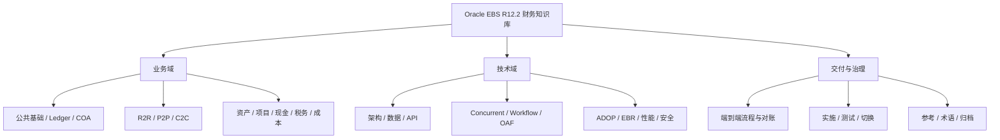
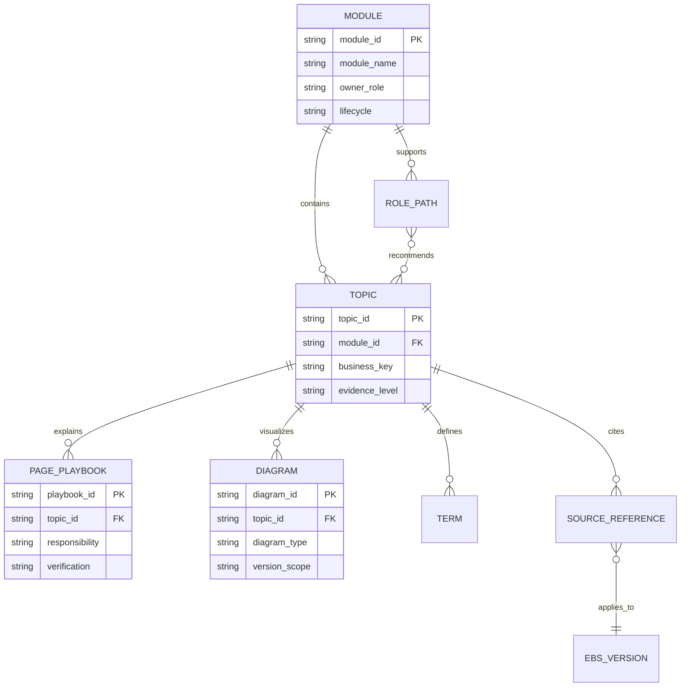

# Oracle EBS R12.2 财务学习与使用指南

> 面向 Oracle E-Business Suite（Oracle 电子商务套件，简称 EBS）R12.2.x 财务功能顾问、技术顾问和项目负责人。本章回答“先学什么、如何查证、怎样把业务问题定位到配置、数据、会计和程序”。

## 阅读导航

- [知识库使用方法](#1-本知识库怎样使用) · [学习与验证闭环](#2-学习方法与验证闭环) · [安全与版本](#3-安全与版本边界) · [深入指南](#5-深入指南)

## 知识库业务架构与 ER 图

### 知识架构图



### 知识资产 ER 图



该 ER 图描述知识库治理对象，不是 EBS 业务表。新增内容应绑定模块、主题、角色、版本和来源，避免同一概念在多个模块重复维护。

## 1. 本知识库怎样使用

### 1.1 先建立完整链路

不要把页面、表、并发程序或会计分录孤立学习。对任一业务场景，按下面六层形成闭环：

1. **业务目的**：谁发起、谁审批、形成什么权利义务。
2. **组织与主数据**：Ledger（账簿）、Legal Entity（法人实体）、Operating Unit（业务实体）、交易方和科目。
3. **交易状态**：单据从录入、验证、审批到完成的生命周期。
4. **会计事件**：Subledger Accounting（子账会计，SLA）如何生成借贷分录。
5. **技术执行**：接口、公开 API、Concurrent Program（并发程序）和日志。
6. **对账与证据**：来源交易、子账、SLA、GL（总账）和报表是否一致。

### 1.2 按角色选择学习路径

| 角色 | 建议顺序 | 学习成果 |
| --- | --- | --- |
| 财务功能顾问 | 公共基础 → 一个端到端流程 → 对应子账 → SLA/GL → 月结 | 能完成方案、配置、测试、对账和问题定位 |
| 技术顾问 | 公共基础 → 数据模型 → 接口/并发 → SLA 追溯 → R12.2 发布 | 能设计可重跑接口、诊断程序并安全发布 |
| 运维与支持 | 端到端流程 → 状态机 → 并发日志 → 会计链 → 运行手册 | 能收集证据、判断断点并控制生产风险 |
| 项目负责人 | 产品边界 → 端到端控制 → 交付物 → 测试/切换 → 治理 | 能管理范围、依赖、风险和验收 |

### 1.3 推荐的模块顺序

1. [财务公共基础](01-foundation.md)：组织、账簿、科目、期间、权限和 SLA。
2. 选择主流程：[R2R](02-record-to-report.md)、[P2P](03-procure-to-pay.md) 或 [C2C](04-credit-to-cash.md)。
3. 学习相邻领域：[资产与项目](05-assets-projects.md)、[现金与税务](06-cash-tax.md)、[成本核算](07-cost-accounting.md)。
4. 用[端到端流程](09-end-to-end.md)串联跨模块状态、接口、会计和对账。
5. 技术顾问继续阅读[技术架构](10-technical.md)，项目成员阅读[实施与运维](11-implementation-operations.md)。
6. 遇到术语、表或程序时查阅[统一参考资料](90-reference.md)。

### 1.4 UML 图与页面剧本怎样阅读

核心财务模块使用 Mermaid 绘制三类图：`flowchart` 表示业务或会计流，`sequenceDiagram` 表示跨角色/系统交互顺序，`stateDiagram-v2` 表示单据或批次状态及允许的恢复路径。图中的中文解释业务含义，英文名称对应 EBS 常用对象或动作。

页面操作统一采用以下结构：

1. **目标**：本次操作要形成的业务结果。
2. **常见职责与导航**：标准职责下常见菜单，不代表客户实例一定相同。
3. **前置检查**：组织、期间、主数据、权限和上游状态。
4. **操作步骤**：页面动作与关键字段，不鼓励无依据试错。
5. **结果验证**：业务状态、会计、接口和下游结果。
6. **审计证据**：业务键、Request ID、参数、日志、报表和批准。

客户可通过自定义职责、菜单排除、功能安全、Personalization（个性化）和本地化改变页面入口与字段显示。因此应把本文步骤转化为目标实例的配置工作簿或运行手册，并在 SIT/UAT 中验证。

## 2. 学习方法与验证闭环

### 2.1 每个专题回答八个问题

- 业务目标和模块边界是什么？
- 上游输入、下游输出和关键业务键是什么？
- 必需配置和配置依赖是什么？
- 单据状态如何变化，哪些状态允许回退或重跑？
- 何时产生会计事件，SLA 如何决定账户？
- 标准接口、公开 API 和并发程序是什么？
- 如何从业务单据追溯到 GL，如何反向追溯？
- 月结、权限、审计和生产操作有哪些控制要求？

### 2.2 四步练习法

**阅读**：先读模块概览和流程图，再看专题。**配置**：在非生产实例记录导航、前置条件和影响范围。**验证**：准备正常、异常、跨期、外币、撤销和重跑用例。**复盘**：保留业务键、请求 ID、日志、状态、分录和对账结果。

### 2.3 证据优先级

1. 目标实例中的配置、补丁级别、数据字典和实际日志。
2. 与实例版本匹配的 Oracle 官方文档、eTRM、Integration Repository 和 MOS 文档。
3. 项目批准的方案、配置工作簿、接口契约和运行手册。
4. 本知识库的示例。示例用于解释方法，不替代实例验证。

## 3. 安全与版本边界

- 默认范围为 EBS R12.2.x；菜单、列、API 签名和补丁行为必须在目标实例复核。
- 不直接更新 EBS 基表；写入优先使用标准页面、Open Interface（开放接口）或 Oracle 公布的 Public API（公开 API）。
- 生产查询需限定 Ledger、Operating Unit、期间或业务主键，并先评估执行计划和数据量。
- R12.2 自定义数据库对象、文件部署和在线补丁必须符合 Edition-Based Redefinition（基于版本的重定义，EBR）与 ADOP 规则。
- 银行账户、个人信息、税号、付款文件和日志中的凭据必须脱敏并按最小权限访问。

## 4. 学习成果检查

完成一个模块后，应能独立交付：流程与边界图、关键配置清单、状态与会计矩阵、接口字段映射、测试用例、对账规则、故障证据包和运行检查表。只会说明页面操作或只会查询单表，都不算完成模块学习。

## 5. 深入指南


<!-- source: docs/00-guide/README.md -->
<a id="src-docs-00-guide-readme"></a>
### 导航、学习与知识库治理


本目录是知识库的推荐起点，负责建立产品全景、角色学习路径、版本适用性、术语和生产安全边界。内容不替代 Oracle Support、许可证合同、客户变更流程、会计政策或当地法规意见。

<a id="src-docs-00-guide-readme--新读者从这里开始"></a>
#### 新读者从这里开始

1. [顾问学习手册](#src-docs-00-guide-consultant-handbook)：用一份文档建立财务功能与技术全景。
2. [按角色阅读与练习路径](#src-docs-00-guide-reading-paths-by-role)：选择功能、技术、集成、测试或运维路线。
3. [财务产品地图与边界](#src-docs-00-guide-financials-product-map)：分清 GL、SLA、AP、AR、FA、CE、IBY、EBTax、Projects 和 Costing 的职责。
4. [中英文术语与缩略语](90-reference.md#src-docs-90-reference-glossary-and-acronyms)：查询英文全称、中文名称和使用语境。
5. 再进入 [知识图谱与模块详文](#src-docs-readme) 完成专项学习。

<a id="src-docs-00-guide-readme--指南清单"></a>
#### 指南清单

| 文档 | 用途 |
| --- | --- |
| [顾问学习手册](#src-docs-00-guide-consultant-handbook) | 企业结构、端到端流程、会计追溯、技术架构、接口、发布、测试和排障综合教程 |
| [范围、版本与适用性](#src-docs-00-guide-scope-and-version) | 记录版本基线，判断产品、补丁、许可证和实例差异 |
| [财务产品地图与边界](#src-docs-00-guide-financials-product-map) | 按 R2R、P2P、C2C、A2R、Cash/Tax、Costing 划分产品职责 |
| [按角色阅读路径](#src-docs-00-guide-reading-paths-by-role) | 财务功能、财务技术、集成、测试、经理和运维的学习路线 |
| [按生命周期阅读路径](#src-docs-00-guide-reading-paths-by-lifecycle) | Assessment、Blueprint、Build、Test、Cutover、Hypercare、Run |
| [文档、SQL 与示例规范](#src-docs-00-guide-documentation-conventions) | 内容结构、术语、SQL 安全、验证和维护要求 |
| [生产安全与支持边界](#src-docs-00-guide-safety-and-production-boundaries) | 只读诊断、标准入口、变更审批、回退和敏感数据控制 |
| [Oracle 官方资料与验证顺序](#src-docs-00-guide-official-sources) | 从官方概念到目标实例和非生产验证的证据链 |

<a id="src-docs-00-guide-readme--三条必须遵守的原则"></a>
#### 三条必须遵守的原则

1. 所有结论先标明适用 EBS/AD-TXK/数据库/产品补丁、组织、账簿和场景；经验不能自动推广到所有 R12.2.x 实例。
2. 写入使用标准页面、公开 API、Open Interface、标准并发程序或批准的 Oracle Support 方案；不直接 DML EBS 业务基表。
3. “接口/请求完成”不等于业务闭环；必须验证业务状态、数量/金额、SLA、GL、报表和外部回执。

<a id="src-docs-00-guide-readme--推荐学习闭环"></a>
#### 推荐学习闭环

```text
概念与产品边界 → 业务流程 → 配置 → 交易与反向交易
  → SLA/GL → 报表/对账/关账 → 数据模型/接口 → 排错
  → 实施案例与官方依据 → 非生产验证
```

每个专题至少形成：流程图、配置清单、会计矩阵、状态/主键链、测试用例、对账公式、排错证据和官方来源。


<!-- source: docs/00-guide/consultant-handbook.md -->
<a id="src-docs-00-guide-consultant-handbook"></a>
### Oracle EBS R12.2.x 财务功能与技术顾问学习手册


> 本手册用于建立完整认知框架和项目工作方法，不替代目标实例的配置、补丁说明、Oracle 官方文档或 My Oracle Support（MOS）方案。示例会计分录仅用于理解数据流，实际科目、事件、借贷方向和入账时点必须以本项目配置与测试结果为准。

<a id="src-docs-00-guide-consultant-handbook--1-如何使用本手册"></a>
#### 1. 如何使用本手册

| 读者 | 首轮重点 | 第二轮重点 | 能力验收 |
| --- | --- | --- | --- |
| 财务功能顾问（Financial Functional Consultant） | 第 2～7 章 | 第 10～13 章 | 能解释配置如何影响交易、会计、对账和关账 |
| 财务技术顾问（Financial Technical Consultant） | 第 2、5、8～12 章 | 第 13～15 章 | 能从业务单据追溯到接口、SLA、GL、日志和部署工件 |
| 集成顾问（Integration Consultant） | 第 5、9、11 章 | 各模块接口手册 | 能设计可幂等、可重放、可对账且受支持的接口 |
| 测试/运维人员 | 第 5、10、12～15 章 | 对应业务模块 | 能按证据链定位故障，并验证数量、金额和会计结果 |

建议每学完一个流程，至少完成四个动作：

1. 画出业务单据与状态流转。
2. 在测试环境完成一笔正常交易和一笔冲销/异常交易。
3. 从业务单据追溯到 Subledger Accounting（SLA，子账会计）和 General Ledger（GL，总账）。
4. 写出该流程的关账检查、对账公式、失败重跑边界和审计证据。

<a id="src-docs-00-guide-consultant-handbook--2-ebs-财务的六层认知模型"></a>
#### 2. EBS 财务的六层认知模型

遇到任何配置、接口或会计问题，都先判断它属于哪一层，不要直接从表或报错开始猜。

| 层级 | 核心问题 | 典型对象 | 顾问输出 |
| --- | --- | --- | --- |
| 1. 企业与责任边界 | 谁拥有交易、资产、现金和法定责任？ | Legal Entity、Ledger、Operating Unit、Inventory Organization | 企业结构图、数据责任矩阵 |
| 2. 主数据与控制 | 与谁交易、用什么科目、币种、税和付款条件？ | Supplier、Customer、Bank、Item、COA、Tax、Payment Term | 主数据规则、配置工作簿 |
| 3. 业务交易 | 单据如何创建、审批、履行、冲销？ | PO、Receipt、Invoice、Receipt、Asset、Project、Material Transaction | 流程图、状态字典、例外流程 |
| 4. 子账会计 | 何时形成会计事件，如何派生科目和描述？ | Event、SLA Rule、Journal Line、Account Combination | 会计事件矩阵、会计分录样例 |
| 5. 总账与报告 | 如何传输、导入、过账、折算和报告？ | Journal、Ledger、Balance、FSG、Trial Balance | 过账控制、报表与对账包 |
| 6. 技术与运维 | 如何集成、监控、发布、恢复和审计？ | Interface、API、Concurrent、Workflow、ADOP、Log | 技术设计、运行手册、发布证据 |

常用故障定位顺序：

```text
业务事实 → 组织/账簿/期间 → 单据状态 → 接口/并发请求
        → 会计事件/SLA → GL 导入/过账 → 余额/报表 → 外部系统对账
```

<a id="src-docs-00-guide-consultant-handbook--3-企业结构与共享基础"></a>
#### 3. 企业结构与共享基础

<a id="src-docs-00-guide-consultant-handbook--31-关键组织对象"></a>
##### 3.1 关键组织对象

| 英文名称 | 中文说明 | 主要作用 | 常见误区 |
| --- | --- | --- | --- |
| Business Group | 业务组 | 主要是人力资源和组织定义的顶层上下文 | 把它当成财务核算主体 |
| Legal Entity | 法律实体/法人实体 | 表示依法承担权利义务、税务和法定报告责任的实体 | 认为一个法人只能对应一个经营单位 |
| Ledger | 账簿 | 由 Chart of Accounts、Accounting Calendar、Currency、Accounting Method 等核算属性构成 | 为数据权限隔离而滥建账簿 |
| Primary Ledger | 主账簿 | 交易的主要会计记录 | 与 Reporting Currency 混淆 |
| Secondary Ledger | 辅助账簿 | 按不同会计方法、科目表、日历或币种保留另一套会计表示 | 未设计转换层级和失败对账 |
| Ledger Set | 账簿集 | 对多个账簿执行查询、报告或部分批处理的逻辑集合 | 误认为它会合并或复制交易 |
| Operating Unit（OU） | 经营单位 | 多组织访问控制下处理采购、应付、应收等交易的组织范围 | 忽略 MOAC 上下文导致查不到或误查数据 |
| Inventory Organization | 库存组织 | 管理库存、物料交易、成本和制造业务 | 认为它天然等于法人或 OU |
| Data Access Set | 数据访问集 | 控制用户可访问的账簿、平衡段值及读写范围 | 只配置职责，不验证数据访问集 |

企业结构设计应从法律责任、管理责任、业务执行、核算要求和数据权限五个视角同时验证。详细模型见 [企业组织、法人、账簿与经营单位](01-foundation.md#src-docs-01-common-organization)。

<a id="src-docs-00-guide-consultant-handbook--32-账簿的核心核算属性"></a>
##### 3.2 账簿的核心核算属性

- Chart of Accounts（COA，科目表）：定义会计科目结构、段、值集和验证规则。
- Accounting Calendar（会计日历）：定义期间、季度、年度和开关期节奏。
- Ledger Currency（账簿币种）：定义本位币及总账余额的主要币种视角。
- Subledger Accounting Method（子账会计方法）：关联会计规则定义，决定子账如何生成分录。
- Balancing Segment Value（平衡段值）：常用于公司/法人平衡；具体法律含义由企业设计决定。

COA 设计不仅是段数和段名。应同步明确：段的业务所有者、值的新增流程、父子汇总、交叉验证规则、动态插入、预算控制、公司间平衡、报表维度以及停用后的历史查询策略。

<a id="src-docs-00-guide-consultant-handbook--33-多组织访问控制"></a>
##### 3.3 多组织访问控制

Multi-Org Access Control（MOAC，多组织访问控制）允许一个职责在安全配置允许时访问多个 OU。分析问题必须保存：用户、职责、应用、Security Profile（安全配置文件）、当前 OU、Ledger 和 Data Access Set。仅看到 `ORG_ID` 不代表已经理解数据权限。

<a id="src-docs-00-guide-consultant-handbook--34-共享主数据"></a>
##### 3.4 共享主数据

- Trading Community Architecture（TCA，贸易社区架构）统一建模 Party（参与方）、Party Site（参与方地点）、Account（账户）和关系。供应商与客户是 TCA 参与方在不同产品中的业务角色。
- Centralized Bank Account Model（集中式银行账户模型）集中维护银行、分行、内部银行账户、账户所有者和用途；CE、AP、AR、IBY 等产品在其上使用不同业务能力。
- E-Business Tax（EBTax，电子商务税）以税制、税种、状态、税率、司法管辖区、税务登记和确定因素规则计算交易税。
- Key Flexfield（KFF，关键弹性域）构成具有业务意义的组合键；Descriptive Flexfield（DFF，说明性弹性域）扩展标准对象的附加属性。

<a id="src-docs-00-guide-consultant-handbook--4-从业务交易到总账"></a>
#### 4. 从业务交易到总账

<a id="src-docs-00-guide-consultant-handbook--41-标准会计链路"></a>
##### 4.1 标准会计链路

```text
业务交易
  ↓ 生成会计事件
XLA Events（会计事件）
  ↓ Create Accounting（创建会计）
XLA Accounting Entries（SLA 会计分录）
  ↓ Transfer to General Ledger（传送至总账）
GL Interface / Journal Import（总账接口/日记账导入）
  ↓ Posting（过账）
GL Balances（总账余额）
  ↓
Trial Balance / Account Analysis / Financial Report（试算平衡/科目分析/财务报告）
```

SLA 的价值是把“业务事件”与“会计表示”分离。功能顾问需要理解 Event Class（事件类）、Event Type（事件类型）、Journal Line Type（日记账行类型）、Account Derivation Rule（账户派生规则）、Description Rule（说明规则）和 Mapping Set（映射集）；技术顾问需要能用业务主键、`APPLICATION_ID`、`ENTITY_ID`、`EVENT_ID`、`AE_HEADER_ID`、`AE_LINE_NUM`、`GL_SL_LINK_ID` 等标识逐层追溯。

常见数据链如下，但列和连接条件必须在目标实例验证：

```text
业务表
  → XLA_TRANSACTION_ENTITIES
  → XLA_EVENTS
  → XLA_AE_HEADERS / XLA_AE_LINES
  → GL_IMPORT_REFERENCES（启用并保留导入引用时）
  → GL_JE_HEADERS / GL_JE_LINES
  → GL_BALANCES
```

不要把 `GL_BALANCES` 当作交易明细表，也不要假设所有来源都以完全相同方式填充 GL 导入引用。追溯应同时使用来源、类别、批次、请求号、期间、金额、币种和业务主键交叉验证。

<a id="src-docs-00-guide-consultant-handbook--42-会计状态的四个问题"></a>
##### 4.2 会计状态的四个问题

对任何“没有进总账”的问题依次回答：

1. 业务交易是否已达到允许会计的状态？
2. 会计事件是否已创建，是否存在处理错误？
3. SLA 分录是否 Final（最终）而不是 Draft（草稿），是否已传 GL？
4. GL 日记账是否已导入、平衡并过账到正确期间和账簿？

<a id="src-docs-00-guide-consultant-handbook--43-对账的基本公式"></a>
##### 4.3 对账的基本公式

对账不等于只比较总数。最低应按组织、账簿、期间、币种和业务分类比较数量与金额：

```text
期初余额 + 本期增加 - 本期减少 ± 调整/重估 = 期末余额
子账期末余额 + 已解释的时间性差异 = 总账控制账户余额
来源控制总额 = 成功记录 + 拒绝记录 + 在途记录（数量与金额分别成立）
```

<a id="src-docs-00-guide-consultant-handbook--5-核心端到端流程"></a>
#### 5. 核心端到端流程

<a id="src-docs-00-guide-consultant-handbook--51-record-to-reportr2r记录到报告"></a>
##### 5.1 Record to Report（R2R，记录到报告）

```text
子账交易 → SLA → GL 导入 → 日记账审核/过账
        → 重估/折算/公司间/合并 → 对账 → 财务报告 → 关期
```

功能顾问重点：Ledger、Journal Source/Category、汇率、Suspense（暂记）、Intercompany（公司间）、Revaluation（重估）、Translation（折算）、Consolidation（合并）、关账日历和报表。

技术顾问重点：`GL_INTERFACE` 控制、Journal Import 请求、来源追溯、并发日志、SLA 到 GL 链、批量导入性能和失败重跑。

最低控制：日记账来源和类别受控；手工日记账审批与职责分离；子账控制账户禁止随意手工记账；未过账、未平衡、Suspense 和跨期日记账均有审阅。

详见 [GL 流程](02-record-to-report.md#src-docs-04-gl-process)、[SLA/FAH/AGIS](02-record-to-report.md#src-docs-04-gl-sla-fah-agis) 和 [R2R 关账](09-end-to-end.md#src-docs-08-e2e-record-to-report-close)。

<a id="src-docs-00-guide-consultant-handbook--52-procure-to-payp2p采购到付款"></a>
##### 5.2 Procure to Pay（P2P，采购到付款）

```text
供应商 → 请购 → 采购订单 → 收货/检验/入库
      → 应付发票匹配 → 验证/审批 → 付款批 → 银行文件/回执
      → 现金清算/银行对账 → SLA → GL
```

关键匹配概念：

- 2-way Match（二单匹配）：发票与采购订单比较。
- 3-way Match（三单匹配）：发票、采购订单与收货比较。
- 4-way Match（四单匹配）：再加入检验/接受数量。
- Tolerance（容差）：价格、数量、汇率等差异的允许范围。
- Hold（暂停）：阻止付款或后续处理的控制状态，必须区分系统暂停与人工暂停。

典型库存采购会计示意：

| 事件 | 借方示例 | 贷方示例 |
| --- | --- | --- |
| 接收 | Receiving Inspection（接收检验） | AP Accrual（应付暂估） |
| 入库 | Inventory Valuation（库存估值） | Receiving Inspection（接收检验） |
| 发票会计 | AP Accrual、税额、差异 | AP Liability（应付负债） |
| 付款 | AP Liability | Cash Clearing/现金 |
| 银行对账 | Cash Clearing | 现金（视清算设置） |

费用采购、期间末暂估、费用目的地、汇率差异和税务处理可能不同。必须用本项目设置和 SLA 输出确认。

最低对账：PO/收货未开票、收货暂估、发票匹配差异、AP Trial Balance（应付试算表）、付款在途、银行清算账户与 GL。

详见 [P2P 端到端](09-end-to-end.md#src-docs-08-e2e-procure-to-pay)、[AP 发票](03-procure-to-pay.md#src-docs-02-ap-invoices)、[付款](03-procure-to-pay.md#src-docs-02-ap-payments) 和 [IBY/费用报销](03-procure-to-pay.md#src-docs-02-ap-payments-iby-expenses)。

<a id="src-docs-00-guide-consultant-handbook--53-ordercredit-to-casho2cc2c订单信用到收款"></a>
##### 5.3 Order/Credit to Cash（O2C/C2C，订单/信用到收款）

```text
客户/TCA → 信用检查 → 销售订单 → 发运
         → AutoInvoice/AR 交易 → 收入/应收
         → 收款/核销/汇款 → 银行对账 → 催收/争议 → GL
```

功能顾问重点：Transaction Source/Type（事务处理来源/类型）、AutoAccounting（自动会计）、Payment Term（付款条件）、Receipt Class/Method（收款分类/方法）、AutoCash（自动核销）、Credit Management（信用管理）、Collections（催收）和 Revenue Recognition（收入确认）。

典型会计示意：

| 事件 | 借方示例 | 贷方示例 |
| --- | --- | --- |
| AR 发票 | Receivable（应收账款） | Revenue（收入）、Tax（税额） |
| 收款确认 | Cash/Remittance（现金/汇款在途） | Unapplied/Unidentified 或 Receivable |
| 核销 | Unapplied Cash（未核销收款） | Receivable |
| 收款冲销 | 原分录反向或按冲销规则处理 | 原分录反向或按冲销规则处理 |

最低对账：AutoInvoice 控制总额、AR Trial Balance、Aging（账龄）、未识别/未核销收款、汇款在途、坏账/调整、收入和税额与 GL。

详见 [O2C 端到端](09-end-to-end.md#src-docs-08-e2e-order-to-cash)、[AR 交易](04-credit-to-cash.md#src-docs-03-ar-transactions)、[收款](04-credit-to-cash.md#src-docs-03-ar-receipts) 和 [催收账龄](04-credit-to-cash.md#src-docs-03-ar-collections-aging)。

<a id="src-docs-00-guide-consultant-handbook--54-acquire-to-retirea2r资产取得到退出"></a>
##### 5.4 Acquire to Retire（A2R，资产取得到退出）

```text
AP/Projects/手工来源 → Mass Additions（成批增加）
                  → 资产新增/资本化 → 折旧/调整/转移
                  → 报废/恢复 → SLA/GL → 资产与总账对账
```

关键配置：Asset Book（资产账簿）、Category（类别）、Depreciation Method（折旧方法）、Prorate Convention（折旧分摊惯例）、Location（地点）、Distribution（分配）和资产清算/成本/累计折旧/折旧费用科目。

必须区分 Date Placed in Service（DPIS，启用日期）、会计日期、交易日期和折旧期间。折旧完成后对历史期间的调整可能触发追溯调整，不能仅凭界面金额判断影响。

最低对账：Mass Additions 来源与处理状态、资产成本、CIP（在建工程）、累计折旧、本期折旧、报废损益、资产明细与 GL 控制账户。

详见 [固定资产流程](05-assets-projects.md#src-docs-05-fa-process)、[折旧与会计](05-assets-projects.md#src-docs-05-fa-depreciation-accounting) 和 [项目资本化](05-assets-projects.md#src-docs-05-fa-projects-capitalization)。

<a id="src-docs-00-guide-consultant-handbook--55-inventorywipcost-to-gl库存在制品成本到总账"></a>
##### 5.5 Inventory/WIP/Cost to GL（库存/在制品/成本到总账）

```text
采购/接收、库存移动、销售发运、WIP 领料/资源/完工
  → Material/Resource Transactions
  → Cost Processor/Cost Distribution
  → SLA/GL → 库存估值、WIP 价值、差异和 COGS 对账
```

功能顾问应掌握 Cost Organization/Inventory Organization（成本/库存组织）、Cost Type（成本类型）、Cost Element（成本要素）、Subelement（子要素）、Standard/Average Costing（标准/平均成本）、WIP Variance（在制品差异）和 COGS Recognition（销售成本确认）。

技术顾问排错时必须区分：业务交易已发生但未成本、成本已计算但未分配、会计事件失败、SLA 未传 GL。直接修改成本处理标志会破坏处理链和审计证据。

详见 [成本会计流](07-cost-accounting.md#src-docs-06-cost-accounting-flow)、[成本方法](07-cost-accounting.md#src-docs-06-cost-costing-methods) 和 [库存/WIP 到 GL](09-end-to-end.md#src-docs-08-e2e-inventory-wip-cost-gl)。

<a id="src-docs-00-guide-consultant-handbook--56-cashpayments-与-bank-reconciliation现金支付与银行对账"></a>
##### 5.6 Cash、Payments 与 Bank Reconciliation（现金、支付与银行对账）

产品边界：

- Payables（AP，应付）确定负债、到期计划和付款选择资格。
- Oracle Payments（IBY，Oracle 支付）编排付款批、格式、支付指令、传输和回执。
- Cash Management（CE，现金管理）管理银行对账单、现金头寸和交易对账。
- General Ledger（GL，总账）保存最终会计和现金账户余额。

Payment Process Request（PPR，付款流程请求）“完成”不必然等于银行已扣款。应分别记录选择、构建、格式化、传输、银行接收、银行接受/拒绝、清算和对账状态。

银行接口必须验证文件级、批次级和交易级控制总额；敏感文件使用批准的传输通道、加密、签名、密钥轮换和最小权限。

详见 [现金管理](06-cash-tax.md#src-docs-07-ce-tax-cash-management)、[现金预测与接口](06-cash-tax.md#src-docs-07-ce-tax-cash-forecast-interfaces) 和 [CE/IBY/EBTax 接口](06-cash-tax.md#src-docs-07-ce-tax-interfaces)。

<a id="src-docs-00-guide-consultant-handbook--57-tax-determination-and-reporting税务确定与申报"></a>
##### 5.7 Tax Determination and Reporting（税务确定与申报）

税务问题按以下顺序定位：Configuration Owner（配置所有者）→ Party Tax Profile/Registration（参与方税务配置/登记）→ Tax Regime/Tax（税制/税种）→ Applicability/Place of Supply（适用性/纳税地点）→ Status/Rate（状态/税率）→ Recovery（抵扣）→ 交易税行 → SLA → Tax Reporting Ledger（税务报告台账）。

不要只检查税率。零税率、免税、不适用、反向征税、自计税和不可抵扣税的业务及会计含义不同，证据要求也不同。

详见 [EBTax](06-cash-tax.md#src-docs-07-ce-tax-ebtax) 和 [税务报告与本地化](06-cash-tax.md#src-docs-07-ce-tax-tax-reporting-localization)。

<a id="src-docs-00-guide-consultant-handbook--6-功能顾问的配置方法"></a>
#### 6. 功能顾问的配置方法

<a id="src-docs-00-guide-consultant-handbook--61-推荐配置顺序"></a>
##### 6.1 推荐配置顺序

```text
范围与法规要求
  → 企业结构/法人/账簿/OU/库存组织
  → COA/日历/币种/汇率/期间
  → 安全、职责、数据访问、审批
  → TCA、供应商、客户、银行、物料等主数据
  → 税务、付款、收款和模块选项
  → SLA/公司间/序列/报表
  → 接口、转换、关账和运维配置
```

顺序不是机械脚本；项目应维护配置依赖矩阵，明确前置对象、配置所有者、迁移工具、环境差异和回退方式。

<a id="src-docs-00-guide-consultant-handbook--62-配置工作簿最低字段"></a>
##### 6.2 配置工作簿最低字段

| 字段 | 说明 |
| --- | --- |
| 配置对象和业务目的 | 为什么配置，解决哪个已批准需求 |
| 导航路径与责任 | 在哪个职责/功能下维护 |
| 前置依赖 | 组织、值集、账户、主数据或补丁依赖 |
| 配置值及中文解释 | 记录代码、名称、含义和默认值理由 |
| 环境差异 | DEV、TEST、UAT、PROD 中哪些值不得照搬 |
| 会计/权限/接口影响 | 下游影响和需回归范围 |
| 迁移方式 | 手工、FNDLOAD、API、Loader 或其他受支持工具 |
| 验证证据 | 截图、查询、请求号、报表和测试用例 |
| 回退/补偿 | 如何停用、恢复或用反向交易处理 |

<a id="src-docs-00-guide-consultant-handbook--63-会计设计矩阵"></a>
##### 6.3 会计设计矩阵

每个模块至少按“业务事件 × 条件 × 借贷行 × 科目来源 × 币种 × 会计日期 × SLA 事件类型 × 冲销方式”记录。必须覆盖正常、冲销、取消、跨期、外币、税、差异、舍入、公司间和异常场景。

<a id="src-docs-00-guide-consultant-handbook--64-不可逆或高影响配置"></a>
##### 6.4 不可逆或高影响配置

以下设置在启用交易后通常难以更改或更改代价很高：COA 结构与段语义、账簿核心属性、会计日历、资产账簿与类别关键设置、成本方法、组织归属、主数据编码规则。决策前应完成原型验证、数据量评估、报表样例和正式签字。

<a id="src-docs-00-guide-consultant-handbook--7-功能顾问的日常诊断"></a>
#### 7. 功能顾问的日常诊断

<a id="src-docs-00-guide-consultant-handbook--71-收集事实"></a>
##### 7.1 收集事实

至少记录：实例与补丁级别、用户/职责、组织/账簿/期间、业务单据号和主键、金额/币种、当前状态、预期结果、实际结果、发生时间、并发请求号、相关接口批次和最近变更。

<a id="src-docs-00-guide-consultant-handbook--72-业务状态优先"></a>
##### 7.2 业务状态优先

先在页面和标准报表确认交易是否合法，再查表。常见根因包括：期间未开放、组织上下文错误、审批未完成、Hold 未释放、前置交易未完成、账户组合无效、税务登记/规则不匹配、汇率缺失、并发程序参数或责任权限错误。

<a id="src-docs-00-guide-consultant-handbook--73-用反向交易而不是数据修补"></a>
##### 7.3 用反向交易而不是数据修补

已会计或已过账交易通常应使用产品支持的 Cancel、Reverse、Unapply、Void、Credit Memo、Return、Retirement/Reinstatement 等业务动作纠正。是否允许、在哪个期间纠正及其会计影响，必须按具体产品规则验证。

<a id="src-docs-00-guide-consultant-handbook--8-技术架构基础"></a>
#### 8. 技术架构基础

<a id="src-docs-00-guide-consultant-handbook--81-r122-逻辑分层"></a>
##### 8.1 R12.2 逻辑分层

| 层 | 主要组件 | 技术顾问关注点 |
| --- | --- | --- |
| 客户端/入口 | 浏览器、Forms 客户端、负载均衡 | URL、会话、TLS、代理和客户端兼容性 |
| Web 层 | Oracle HTTP Server（OHS） | 路由、静态内容、反向代理、访问日志 |
| 应用层 | WebLogic、OAF、Forms、Concurrent、Workflow、OPP | Managed Server、JVM、并发队列、通知和输出生成 |
| 数据库层 | Oracle Database、APPS/产品 Schema、EBR | 数据模型、事务、锁、Edition、对象有效性 |
| 外部集成层 | 文件/SFTP、REST/SOAP、SOA/OIC、银行/税务/外围系统 | 契约、安全、幂等、监控和对账 |

R12.2 使用 Online Patching（在线补丁）和 Edition-Based Redefinition（EBR，基于版本的重定义）支持应用层在线修补。技术方案必须区分 Run File System（运行文件系统）、Patch File System（补丁文件系统）和 Non-Editioned File System（非版本化文件系统），并通过 AD Online Patching（`adop`）生命周期发布受影响工件。

<a id="src-docs-00-guide-consultant-handbook--82-常见技术组件中英文对照"></a>
##### 8.2 常见技术组件中英文对照

- Oracle Application Framework（OAF，Oracle 应用框架）：EBS HTML 页面开发框架。
- Oracle Forms（Forms，表单）：传统 Forms 业务界面与运行时。
- Concurrent Processing（并发处理）：后台批处理、报表和接口任务调度框架。
- Output Post Processor（OPP，输出后处理器）：处理 XML Publisher/BI Publisher 等输出转换。
- Workflow（工作流）：业务流程、通知、后台活动和事件处理。
- Approvals Management Engine（AME，审批管理引擎）：基于规则确定审批链。
- Integrated SOA Gateway（ISG，集成 SOA 网关）：从 Integration Repository 部署和调用受支持服务。
- AutoConfig（自动配置）：根据上下文文件维护许多 EBS 配置文件；不要把手工改生成文件作为长期方案。

<a id="src-docs-00-guide-consultant-handbook--9-数据模型与安全查询"></a>
#### 9. 数据模型与安全查询

<a id="src-docs-00-guide-consultant-handbook--91-对象命名只是线索"></a>
##### 9.1 对象命名只是线索

| 常见形式 | 通常含义 | 注意事项 |
| --- | --- | --- |
| `_ALL` | 常含组织维度的业务表 | 仍需确认 `ORG_ID`、Ledger 和访问策略 |
| `_B` | 多语言对象的基础表 | 不应把命名规律当成所有产品的硬规则 |
| `_TL` | Translation Table（翻译表） | 连接时关注 `LANGUAGE` 和来源语言 |
| `_VL` | 常见的多语言视图 | 适合展示，性能和列定义需验证 |
| `_INTERFACE` / `_IFACE` | 开放接口或处理接口对象 | 必须配合标准导入程序和错误处理 |
| `_GT` / `_TEMP` | 全局临时或处理临时对象 | 不应作为持久集成或报告来源 |

WHO Columns（WHO 审计列）通常包括创建/更新用户和时间，有些对象还记录登录或请求信息。它们用于基础追溯，但不能替代完整审计设计。

<a id="src-docs-00-guide-consultant-handbook--92-apps-schema-与产品-schema"></a>
##### 9.2 APPS Schema 与产品 Schema

APPS 通常通过同义词和授权提供统一访问入口；产品对象由相应 Schema 拥有。不要在 APPS 中随意创建无治理对象，也不要直接修改 Oracle 拥有的对象。自定义对象的 Schema、授权、同义词、Edition 属性、安装和卸载脚本应在技术设计中明确。

<a id="src-docs-00-guide-consultant-handbook--93-查询准则"></a>
##### 9.3 查询准则

1. 只读优先，使用绑定变量。
2. 先从主键或业务单号获得小集合，再连接大表。
3. 大表限定组织、账簿、期间、日期或主键范围。
4. 明确金额币种、精度和换算口径；不要对不同币种直接求和。
5. 使用目标实例的 `ALL_TAB_COLUMNS`、eTRM 和执行计划验证列与索引。
6. 查询敏感字段前确认权限和脱敏要求。

详细数据字典入口见 [模块数据字典](#src-docs-readme--模块数据字典) 和 [数据模型](10-technical.md#src-docs-09-technical-data-model)。

<a id="src-docs-00-guide-consultant-handbook--10-接口与扩展选型"></a>
#### 10. 接口与扩展选型

<a id="src-docs-00-guide-consultant-handbook--101-选型顺序"></a>
##### 10.1 选型顺序

| 方式 | 适用场景 | 优点 | 主要风险/控制 |
| --- | --- | --- | --- |
| 标准页面/批处理 | 人工或标准批量业务 | 产品校验最完整 | 操作权限、批次证据 |
| Open Interface（开放接口） | 官方提供接口表和导入程序的批量导入 | 适合大批量、错误可分批处理 | 不等于只插接口表；必须运行标准导入并闭环错误 |
| Public PL/SQL API（公开 PL/SQL API） | 实时或受控事务调用 | 复用产品校验与消息栈 | 签名、上下文、事务和版本必须从目标实例确认 |
| Integration Repository / ISG | 已登记并可部署的服务 | 标准化服务发现和治理 | 并非所有 API 都可直接暴露；需验证授权和服务状态 |
| Business Event / Workflow | 事件驱动和异步处理 | 降低耦合 | 重复事件、乱序、Deferred 队列和补偿 |
| Web ADI / Loader | 受控配置或用户批量录入 | 面向业务用户 | 模板版本、权限、数据验证 |
| 自定义 Staging + 标准入口 | 复杂映射、清洗、重试和对账 | 可观测、可恢复 | 自定义状态机与数据保留需要治理 |

禁止把直接 `INSERT/UPDATE/DELETE` Oracle EBS 业务基表当作接口或常规修复方案。

<a id="src-docs-00-guide-consultant-handbook--102-接口最小状态机"></a>
##### 10.2 接口最小状态机

```text
RECEIVED → VALIDATED → READY → SUBMITTED → PROCESSING
        → SUCCEEDED
        → REJECTED（业务错误，可修正后重放）
        → FAILED（技术错误，按策略重试）
        → QUARANTINED（超过重试上限，人工处理）
```

每条记录至少保留：来源系统、业务唯一键、批次号、关联号、负载版本、组织/账簿、状态、重试次数、错误分类、请求号、创建/更新时间和目标业务主键。幂等设计应能证明同一业务消息重放不会重复记账或重复付款。

<a id="src-docs-00-guide-consultant-handbook--103-提交成功不等于业务成功"></a>
##### 10.3 提交成功不等于业务成功

API 返回成功、HTTP 2xx、文件传输成功或并发请求提交成功，只证明一个技术步骤成功。最终验收必须检查目标业务对象、数量/金额、业务状态、会计结果和外部回执。

<a id="src-docs-00-guide-consultant-handbook--11-concurrentworkflow-与页面定制"></a>
#### 11. Concurrent、Workflow 与页面定制

<a id="src-docs-00-guide-consultant-handbook--111-concurrent-processing并发处理"></a>
##### 11.1 Concurrent Processing（并发处理）

技术顾问应区分 Executable（可执行）、Concurrent Program（并发程序）、Parameter/Value Set（参数/值集）、Request Group（请求组）、Request Set（请求集）、Manager/Queue（管理器/队列）、Incompatibility（不兼容性）和 Output Post Processor。

诊断顺序：请求参数 → Phase/Status（阶段/状态）→ 请求日志/输出 → 父子请求 → Manager 队列与专业化规则 → 数据库会话/锁/SQL → OPP 或外部依赖。不要仅凭 `FND_CONCURRENT_REQUESTS` 的最终状态断言业务结果。

<a id="src-docs-00-guide-consultant-handbook--112-workflow-与-ame"></a>
##### 11.2 Workflow 与 AME

Workflow 排错需要保存 Item Type（项目类型）、Item Key（项目键）、Process（流程）、Activity（活动）、Notification（通知）和相关业务键。AME 决定审批人时，还要检查 Transaction Type（事务类型）、Attribute（属性）、Condition（条件）、Action Type（操作类型）、Rule（规则）和审批组。

重复通知、活动 Deferred（延迟）、Background Engine 未处理、Mailer 失败和业务回调错误是不同问题，不能一概通过重试通知解决。

<a id="src-docs-00-guide-consultant-handbook--113-oafforms-与-personalization"></a>
##### 11.3 OAF、Forms 与 Personalization

优先级通常为：标准配置 → Personalization（个性化）→ 受支持扩展 → 自定义页面/程序。每项定制都应记录 CEMLI 分类、业务依据、标准对象依赖、权限、版本、迁移方式、回归范围和退役条件。禁止直接覆盖 Oracle 标准文件。

<a id="src-docs-00-guide-consultant-handbook--12-r122-发布adop-与-ebr"></a>
#### 12. R12.2 发布、ADOP 与 EBR

<a id="src-docs-00-guide-consultant-handbook--121-adop-基本周期"></a>
##### 12.1 ADOP 基本周期

| 阶段 | 中文说明 | 顾问关注点 |
| --- | --- | --- |
| Prepare | 准备 | 创建/同步补丁版本环境，检查系统健康和前置条件 |
| Apply | 应用 | 在补丁版本应用补丁或自定义发布工件，记录 Worker/失败信息 |
| Finalize | 最终化 | 完成切换前准备，降低 Cutover 停机工作量 |
| Cutover | 切换 | 停止相关服务并切换 Run/Patch 角色；需要正式窗口和业务验证 |
| Cleanup | 清理 | 清理旧版本数据和对象；按维护策略选择清理方式 |

`fs_clone`、Abort、Restart 和其他维护动作有明确前提，必须依据当前周期状态和官方维护指南执行，不应把网上命令直接复制到生产。

<a id="src-docs-00-guide-consultant-handbook--122-自定义对象的-ebr-合规"></a>
##### 12.2 自定义对象的 EBR 合规

发布前至少确认：对象是否 Editioned（版本化）或 Noneditioned（非版本化）、依赖是否跨 Edition、同义词/授权是否正确、数据库对象是否有效、文件部署位置是否正确、Patch 文件系统是否同步、Cutover 后 Smoke Test（冒烟测试）是否覆盖关键财务路径。

功能顾问也应参与补丁回归：登录与职责、关键主数据、AP/AR/GL/FA/CE/CST 代表性交易、Create Accounting、传 GL、核心报表、银行/税务/外围接口和审批通知。

<a id="src-docs-00-guide-consultant-handbook--13-测试迁移和切换"></a>
#### 13. 测试、迁移和切换

<a id="src-docs-00-guide-consultant-handbook--131-测试层次"></a>
##### 13.1 测试层次

| 测试 | 中文说明 | 财务重点 |
| --- | --- | --- |
| Unit Test | 单元测试 | 单一配置、API、程序或报表正确 |
| CRP | 会议室演练 | 用原型验证流程和蓝图决策 |
| SIT | 系统集成测试 | 跨模块/跨系统状态、错误和重跑 |
| UAT | 用户验收测试 | 业务可用性、控制、会计、报表和职责 |
| Regression Test | 回归测试 | 补丁/变更未破坏既有关键流程 |
| Performance Test | 性能测试 | 代表性数据量、并发量、关账窗口和批处理时长 |
| Security Test | 安全测试 | 最小权限、职责分离、敏感数据和接口认证 |

每个财务测试用例至少断言：业务状态、数量、交易币/本位币金额、税、会计日期、SLA 分录、GL 传输/过账、报表展示、冲销结果和审计证据。

<a id="src-docs-00-guide-consultant-handbook--132-数据迁移分层"></a>
##### 13.2 数据迁移分层

```text
配置/参考数据 → 主数据 → 期初余额 → 未结交易 → 必要历史数据
```

每一层都需要 Extract（抽取）、Profile（剖析）、Cleanse（清洗）、Map（映射）、Transform（转换）、Load（装载）、Reconcile（对账）和 Sign-off（签字）。至少完成多轮 Mock Conversion（模拟转换），记录批次耗时、错误率、人工处理量和最终切换窗口。

<a id="src-docs-00-guide-consultant-handbook--133-cutover切换最低控制"></a>
##### 13.3 Cutover（切换）最低控制

- 冻结范围、最终增量、责任人、前后依赖和 Go/No-Go 条件明确。
- 每个装载和接口步骤有控制总额、开始/结束时间、请求号和重跑边界。
- 余额、未结 AP/AR、库存、资产、项目、银行和 GL 按批准口径对账。
- 回退方案区分技术回退与业务补偿；进入不可逆点前必须再次审批。
- 上线后执行 Daily Reconciliation（每日对账）和缺陷分级，直至移交标准满足。

<a id="src-docs-00-guide-consultant-handbook--14-月结与运行管理"></a>
#### 14. 月结与运行管理

<a id="src-docs-00-guide-consultant-handbook--141-典型关账依赖"></a>
##### 14.1 典型关账依赖

```text
采购/接收、库存/WIP/成本、项目
        → AP/AR/FA/CE 等子账处理完成
        → Create Accounting / Transfer to GL
        → 子账与 GL 对账
        → GL 日记账、重估、折算、公司间、合并
        → 财务与管理报告 → 关期与签字
```

实际顺序受产品、会计政策和企业批处理设计影响。关账清单必须包含负责人、截止时间、前置条件、程序参数、成功标准、异常升级、输出证据和重开期间审批。

<a id="src-docs-00-guide-consultant-handbook--142-运行指标"></a>
##### 14.2 运行指标

- 接口：接收量、成功/拒绝/在途量、金额、最老在途时间、重试次数。
- 并发：排队时间、运行时间、失败率、关键请求是否错过窗口。
- Workflow：Deferred 积压、错误活动、通知延迟和 Mailer 状态。
- 会计：未处理事件、会计错误、未传 GL、未导入和未过账数量/金额。
- 关账：按模块完成时间、对账差异、手工调整和重开次数。
- 基础设施：服务可用性、JVM/OPP、数据库会话、存储、证书和批处理容量。

<a id="src-docs-00-guide-consultant-handbook--15-通用故障排查与证据包"></a>
#### 15. 通用故障排查与证据包

<a id="src-docs-00-guide-consultant-handbook--151-五类根因"></a>
##### 15.1 五类根因

| 根因类别 | 例子 | 首选动作 |
| --- | --- | --- |
| 业务状态 | 未审批、Hold、前置交易未完成 | 按产品流程完成或合法冲销 |
| 配置/主数据 | 账户无效、期间关闭、税率或银行用途错误 | 修正配置并评估已发生交易影响 |
| 数据/接口 | 重复键、映射错误、控制总额不平 | 隔离批次、修正来源、按幂等策略重放 |
| 技术运行 | Manager、Workflow、OPP、网络或证书失败 | 恢复服务后从受支持断点重启 |
| 缺陷/补丁 | 标准代码错误或补丁冲突 | 最小复现、查官方资料/MOS、按批准方案修复 |

<a id="src-docs-00-guide-consultant-handbook--152-标准证据包"></a>
##### 15.2 标准证据包

提交内部升级或 MOS Service Request（服务请求）前，准备：

- EBS、AD/TXK、数据库和相关产品补丁级别。
- 发生时间、时区、节点、用户/职责、组织/账簿/期间。
- 可脱敏的业务主键、接口批次、请求号、Workflow Item Key。
- 清晰的重现步骤、预期/实际结果和影响范围。
- 相关日志中首个有意义的错误，而非只截最后一行。
- 只读诊断结果、配置截图、近期变更和非生产复现情况。
- 已尝试动作及其结果；不要反复执行可能重复业务的步骤。

<a id="src-docs-00-guide-consultant-handbook--16-项目交付物检查表"></a>
#### 16. 项目交付物检查表

<a id="src-docs-00-guide-consultant-handbook--161-功能顾问"></a>
##### 16.1 功能顾问

- 已批准的业务流程和例外流程。
- 企业结构、COA、会计日历、币种和安全设计。
- 配置工作簿、主数据规则、会计事件矩阵。
- 报表清单、对账公式、关账日历和控制证据。
- CRP/SIT/UAT 用例、缺陷决定和用户培训材料。
- 数据迁移映射、切换清单、Hypercare 和支持移交。

<a id="src-docs-00-guide-consultant-handbook--162-技术顾问"></a>
##### 16.2 技术顾问

- CEMLI 清单与逐项技术设计。
- 接口契约、状态机、幂等/重试/补偿、对账和监控。
- 数据模型、对象依赖、权限、敏感数据和容量评估。
- 源码、数据库/文件部署工件、ADOP/EBR 合规说明和回退步骤。
- 单元/SIT/性能/安全测试证据和运行手册。
- 日志规范、告警、支持知识、版本记录和退役方案。

<a id="src-docs-00-guide-consultant-handbook--17-延伸阅读"></a>
#### 17. 延伸阅读

- [按角色阅读路径](#src-docs-00-guide-reading-paths-by-role)
- [财务产品地图与边界](#src-docs-00-guide-financials-product-map)
- [范围、版本与适用性](#src-docs-00-guide-scope-and-version)
- [生产安全与支持边界](#src-docs-00-guide-safety-and-production-boundaries)
- [中英文术语与缩略语](90-reference.md#src-docs-90-reference-glossary-and-acronyms)
- [Oracle 官方资料与验证顺序](#src-docs-00-guide-official-sources)
- [模块接口实现手册索引](#src-docs-readme--模块接口实现手册)


<!-- source: docs/00-guide/documentation-conventions.md -->
<a id="src-docs-00-guide-documentation-conventions"></a>
### 文档、SQL 与示例规范


本规范用于让功能顾问、技术顾问和运维人员对同一术语、状态、表和处理边界形成一致理解。

<a id="src-docs-00-guide-documentation-conventions--文件与标题"></a>
#### 文件与标题

- 文件名使用小写英文 `kebab-case.md`；目录入口使用 `README.md`。
- 标题使用中文业务名称；首次出现的重要英文术语写成 `English Name（中文说明）` 或 `中文名称（English Name）`。
- 缩略语首次出现应给出英文全称和中文解释，例如 `Subledger Accounting（SLA，子账会计）`。
- 同一正文只维护在一个权威位置；其他页面给出上下文摘要和链接。
- 不在文件名放作者、日期、状态或版本；这些信息需要时写入正文元数据表。

<a id="src-docs-00-guide-documentation-conventions--推荐文档结构"></a>
#### 推荐文档结构

不是每篇都必须机械使用全部章节，但应覆盖与主题有关的部分：

1. 目的、读者、适用产品/版本和前置知识。
2. 业务概念和产品边界：负责什么、不负责什么。
3. 端到端流程、状态、正常与反向交易。
4. 配置顺序、依赖、关键选项和不可逆决策。
5. 会计事件、分录示例、SLA/GL 追溯和期间影响。
6. 数据模型、业务主键、组织/账簿/币种和表关系。
7. 标准页面、Public API、Open Interface、并发程序和集成边界。
8. 报表、数量/金额对账、关账和内控。
9. 常见问题、诊断顺序、恢复、重试和补偿。
10. 测试场景、验收标准、限制和官方依据。

<a id="src-docs-00-guide-documentation-conventions--事实示例与实例结论"></a>
#### 事实、示例与实例结论

明确区分：

| 类型 | 写法 |
| --- | --- |
| 标准概念 | 给出适用 Release 和官方资料链接 |
| 项目设计建议 | 使用“建议/通常/应评估”，并说明权衡和适用条件 |
| 示例 | 标明“示例/示意”，不得暗示账户、状态或参数可直接照搬 |
| 实例验证 | 记录环境、版本、组织/账簿、场景、日期和限制 |
| 未验证信息 | 标明待验证项，不把推断写成确定事实 |

任何可能受补丁、许可证、本地化或客户定制影响的结论都应明确条件。

<a id="src-docs-00-guide-documentation-conventions--术语写法"></a>
#### 术语写法

推荐：

- `General Ledger（GL，总账）`
- `Operating Unit（OU，经营单位）`
- `Payment Process Request（PPR，付款流程请求）`
- `Create Accounting（创建会计）`

避免：

- 只写缩略语且无上下文，如“跑 XLA、看 IBY”。
- 同一文档把 Ledger 交替翻译为账簿、账套而不说明历史术语差异。
- 把 Oracle Payments、Payables 和 Cash Management 都笼统称为“付款模块”。
- 将 Receipt 在 AP/Receiving 语境翻译成同一含义而不说明“收货/收款”。

统一术语见 [中英文术语与缩略语](90-reference.md#src-docs-90-reference-glossary-and-acronyms)。

<a id="src-docs-00-guide-documentation-conventions--sql-规范"></a>
#### SQL 规范

<a id="src-docs-00-guide-documentation-conventions--安全原则"></a>
##### 安全原则

- 默认只读；禁止提供可直接执行的 EBS 基表 `UPDATE`/`DELETE`/`INSERT` 修复脚本。
- 使用 `:p_*` 绑定变量，不将用户输入拼接到 SQL。
- 大表限定 `ORG_ID`、`LEDGER_ID`、期间/日期或业务主键范围。
- 明确币种、精度、时区和 NLS；不要跨币种直接汇总金额。
- 不使用 `select *` 作为文档示例，列出与结论直接相关的字段。
- 连接条件写明业务意义，避免仅因字段同名就连接。
- 在目标实例用数据字典验证对象、列、索引、状态值和访问权限。
- 性能诊断先在非生产验证执行计划；生产 Trace/Debug 需要审批和时限。

数据字典示例：

```sql
select owner,
       table_name,
       column_id,
       column_name,
       data_type,
       nullable
  from all_tab_columns
 where owner = upper(:p_owner)
   and table_name = upper(:p_table_name)
 order by column_id;
```

<a id="src-docs-00-guide-documentation-conventions--sql-示例前置说明"></a>
##### SQL 示例前置说明

每段诊断 SQL 应说明：用途、适用产品/版本、参数、预期行粒度、组织/账簿范围、潜在数据量、关键状态含义和结果不能证明什么。

<a id="src-docs-00-guide-documentation-conventions--接口与代码示例规范"></a>
#### 接口与代码示例规范

接口示例至少说明：

- 标准入口是否为公开 API/Open Interface/ISG 服务，如何在目标实例确认。
- 用户、职责、应用、MOAC、Ledger、NLS 和日期上下文。
- 业务唯一键、批次、相关号、幂等和重复处理策略。
- API/导入程序的事务所有者、Commit/Rollback 和部分成功行为。
- Error/Message Stack（错误/消息栈）、请求日志和业务主键回写。
- 重试上限、技术失败与业务拒绝分类、人工补偿入口。
- 来源、接口、业务、SLA、GL 和外部回执的数量/金额对账。
- 认证、授权、TLS、证书/密钥和敏感字段脱敏。

占位 API 名必须显式写成占位符，并提示从当前实例 Integration Repository 或 Package Specification 获取真实签名。

<a id="src-docs-00-guide-documentation-conventions--会计分录规范"></a>
#### 会计分录规范

- 标明分录是示意还是目标实例验证结果。
- 写明业务事件、会计日期、交易币/本位币和账户来源。
- 同时覆盖正常、取消/冲销、差异和跨期场景。
- 不把总账手工调整当作子账流程的标准分录。
- 指向 Event Class/Event Type、SLA Rule 和 GL Source/Category 的验证入口。

<a id="src-docs-00-guide-documentation-conventions--排错文档规范"></a>
#### 排错文档规范

使用统一顺序：

```text
实例/版本 → 用户/职责 → 组织/账簿/期间 → 业务主键/状态
→ 接口/请求/Workflow → SLA → GL → 报表/对账 → 外部回执
```

每个错误条目应包含症状、影响、可能根因、只读证据、受支持恢复动作、是否可重试、重复风险和完成验证。不要只给“运行某脚本”而无前置条件和后果。

<a id="src-docs-00-guide-documentation-conventions--链接与引用"></a>
#### 链接与引用

- 内部相对链接必须指向存在的文件和正确锚点。
- 外部资料优先 Oracle 官方 R12.2 文档；技术问题优先官方指南、目标实例和 MOS。
- 链接文字使用书名或主题名，不使用“点击这里”。
- MOS 只登记授权范围内的文档/补丁标识，不复制受限全文。
- 引用实例结论时记录版本、环境、验证日期和限制。

<a id="src-docs-00-guide-documentation-conventions--评审清单"></a>
#### 评审清单

- [ ] 标题和重要英文术语有中文说明。
- [ ] 产品、版本、补丁、许可证和本地化边界明确。
- [ ] 功能、数据、会计、接口、报表和关账关系一致。
- [ ] 示例没有直接 DML 标准业务表或覆盖 Oracle 标准工件。
- [ ] SQL 使用绑定变量和范围限制，并说明行粒度/币种。
- [ ] API、字段、状态和程序参数提示目标实例验证。
- [ ] 正常、异常、冲销、跨期、重跑和对账场景已覆盖。
- [ ] 内部链接有效，官方资料指向 R12.2 对应入口。

<a id="src-docs-00-guide-documentation-conventions--相关文档"></a>
#### 相关文档

- [生产安全边界](#src-docs-00-guide-safety-and-production-boundaries)
- [范围、版本与适用性](#src-docs-00-guide-scope-and-version)
- [Oracle 官方资料与验证顺序](#src-docs-00-guide-official-sources)


<!-- source: docs/00-guide/financials-product-map.md -->
<a id="src-docs-00-guide-financials-product-map"></a>
### 财务产品地图与边界


本页按业务能力说明 Oracle E-Business Suite（EBS）财务及相邻产品的职责。产品是否可用取决于许可证、安装状态、国家本地化和补丁级别；标记为“可选”的能力不得仅凭菜单或表存在就认定可使用。

<a id="src-docs-00-guide-financials-product-map--一图理解产品关系"></a>
#### 一图理解产品关系

```text
供应商/TCA → PO/Receiving → AP ──→ IBY ──→ Bank
                    │          │        │        │
                    │          └→ SLA ──┼→ GL ←─┤ CE Reconciliation
                    │                   │
客户/TCA → OM/Shipping → AR ───────────┘
                    │
             Inventory/WIP/Cost ─→ SLA/GL
                    │
Projects/CIP ─→ Fixed Assets ─────→ SLA/GL

EBTax 为 PO/AP/AR/OM/Projects/Assets 等交易提供税务确定
SLA 为各子账提供会计规则与分录生成
GL 汇总最终会计、余额与财务报告
```

<a id="src-docs-00-guide-financials-product-map--共享基础产品"></a>
#### 共享基础产品

| 产品/能力 | 英文全称与中文说明 | 主要职责 | 不负责什么 |
| --- | --- | --- | --- |
| FND | Application Object Library，应用对象库 | 用户、职责、菜单、Profile、Lookup、并发程序和公共元数据 | 不定义具体子账交易规则 |
| TCA | Trading Community Architecture，贸易社区架构 | Party、地点、账户、关系和客户/供应商共享身份模型 | 不承担 AP 发票或 AR 收款处理 |
| SLA/XLA | Subledger Accounting，子账会计 | 会计事件、规则、分录、传送 GL 和追溯 | 不替代业务子账余额，也不完成 GL 过账 |
| EBTax/ZX | E-Business Tax，电子商务税 | 交易税适用性、税率、税额、抵扣和税务明细 | 不替代法定申报流程和所有国家本地化 |
| MOAC | Multi-Org Access Control，多组织访问控制 | 基于安全配置文件访问多个经营单位 | 不代替 Ledger/Data Access Set 的总账权限 |

<a id="src-docs-00-guide-financials-product-map--record-to-reportr2r记录到报告"></a>
#### Record to Report（R2R，记录到报告）

| 产品/能力 | 中文说明 | 核心对象/流程 | 主要上下游 |
| --- | --- | --- | --- |
| GL | General Ledger，总账 | Ledger、Journal、Posting、Balance、Revaluation、Translation、Reporting | 上游为 SLA/Journal Import；下游为报表、合并 |
| SLA | Subledger Accounting，子账会计 | Event、Accounting Rule、Journal Entry、GL Transfer | 上游为各子账；下游为 GL |
| FAH（可选） | Financials Accounting Hub，财务会计中心 | 为外部系统或扩展来源建立会计事件与会计规则 | 外部子账、SLA、GL |
| AGIS（可选） | Advanced Global Intercompany System，高级全球公司间系统 | 公司间交易、审批、AR/AP/GL 衔接和对账 | 法人、AP、AR、GL |
| Budgetary Control | 预算控制 | Funds Check、Reservation、Encumbrance、Budget Balance | Purchasing、AP、Projects、GL；具体模式需按产品确认 |
| Consolidation | 合并 | 多账簿余额映射、传输、调整和抵销 | Ledger、汇率、报表 |

边界提示：Ledger Set（账簿集）是集合访问/处理能力，不等于合并；Secondary Ledger（辅助账簿）是另一会计表示，不等于 Reporting Currency（报告币种）。

入口：[Record to Report](02-record-to-report.md#src-docs-02-record-to-report-readme)｜[既有 GL 详文](02-record-to-report.md#src-docs-04-gl-readme)

<a id="src-docs-00-guide-financials-product-map--procure-to-payp2p采购到付款"></a>
#### Procure to Pay（P2P，采购到付款）

| 产品/能力 | 中文说明 | 核心对象/流程 | 边界 |
| --- | --- | --- | --- |
| Supplier/TCA | 供应商与参与方主数据 | Supplier、Site、Contact、税务和银行关系 | 主数据身份由 TCA 支撑，采购/AP 使用业务站点 |
| Purchasing（PO） | 采购 | Requisition、RFQ、Quotation、Purchase Order、Agreement | 创建采购承诺，不形成 AP 负债 |
| iProcurement（可选） | 互联网采购 | 员工自助请购、目录、购物车和审批 | 前端采购体验，后续仍由 PO/Receiving/AP 处理 |
| Receiving（RCV） | 接收 | Receipt、Inspection、Delivery、Return、Correction、Accrual | 接收与入库不同；应计方式受目的地和设置影响 |
| AP | Payables，应付账款 | Invoice、Matching、Validation、Hold、Approval、Liability、Payment Schedule | 确认负债和付款资格，不负责最终银行文件编排 |
| IBY | Oracle Payments，Oracle 支付 | Payment Process Request、Instruction、Format、Transmission、ACK | 编排支付，不替代 AP 负债和 CE 银行对账 |
| iExpenses（可选） | Internet Expenses，互联网费用报销 | Expense Report、Policy、Card、Audit、AP Import | 报销前端，付款通常进入 AP/IBY |
| iSupplier（可选） | 供应商门户 | 供应商协同、订单/发运/发票可见性 | 权限和数据范围需独立治理 |

入口：[Procure to Pay](03-procure-to-pay.md#src-docs-03-procure-to-pay-readme)｜[既有 AP 详文](03-procure-to-pay.md#src-docs-02-ap-readme)

<a id="src-docs-00-guide-financials-product-map--ordercredit-to-casho2cc2c订单信用到收款"></a>
#### Order/Credit to Cash（O2C/C2C，订单/信用到收款）

| 产品/能力 | 中文说明 | 核心对象/流程 | 边界 |
| --- | --- | --- | --- |
| TCA Customer | 客户主数据 | Party、Customer Account、Site Use、Contact、Profile | Party 与 Account 是不同层级 |
| Order Management（OM） | 订单管理 | Sales Order、Price、Credit Check、Fulfillment | 订单履行不等于 AR 已开票 |
| Shipping Execution（WSH） | 发运执行 | Pick、Ship Confirm、Delivery | 发运状态与 AutoInvoice 状态需分别追踪 |
| AR | Receivables，应收账款 | Transaction、AutoInvoice、Receipt、Application、Adjustment、Revenue | 管理应收和收款应用，不替代银行对账 |
| Credit Management（可选） | 信用管理 | Credit Review、Case Folder、Credit Limit | 与 OM 信用检查、客户 Profile 配合 |
| Advanced Collections（可选） | 高级催收 | Delinquency、Strategy、Promise to Pay、Dunning | 与 AR 余额、账龄和争议衔接 |
| iReceivables（可选） | 互联网应收 | 客户自助查看账单、付款和争议 | 需评估外部访问和支付安全 |
| Loans（可选） | 贷款 | Origination、Servicing、Billing、Interest | 独立产品，不应与普通 AR 交易混为一谈 |

入口：[Credit to Cash](04-credit-to-cash.md#src-docs-04-credit-to-cash-readme)｜[既有 AR 详文](04-credit-to-cash.md#src-docs-03-ar-readme)

<a id="src-docs-00-guide-financials-product-map--acquire-to-retire-与-projects资产取得到退出项目"></a>
#### Acquire to Retire 与 Projects（资产取得到退出、项目）

| 产品/能力 | 中文说明 | 核心对象/流程 | 边界 |
| --- | --- | --- | --- |
| FA | Fixed Assets，固定资产 | Asset、Book、Category、Depreciation、Transfer、Retirement | 管理资产价值与折旧，不承担采购审批 |
| Mass Additions | 成批增加 | 从 AP/Projects/外部来源准备并过账资产 | 接口成功不等于资产已资本化 |
| Projects Foundation | 项目基础 | Project、Task、Organization、Role、Classification | 为 Costing/Billing 等项目产品提供基础 |
| Project Costing | 项目成本 | Expenditure、Cost Distribution、Burden、Commitment | 成本分配与 GL/FA 接口是后续步骤 |
| Project Billing | 项目开票 | Agreement、Funding、Revenue、Invoice、AR Interface | 项目收入/发票进入 AR 后仍需 AR 处理 |
| Project to Asset | 项目转资产 | CIP、Project Asset、Capitalization、FA Interface | 需对账项目资本成本、FA 成本和 GL |
| Grants（可选） | 赠款会计 | Award、Funding、Compliance | 依赖项目基础并受资助方规则影响 |
| iAssets（可选） | 互联网资产 | 员工资产查询/转移请求 | 不替代 FA 核心资产账簿 |
| Property Manager（可选） | 物业管理 | Property、Space、Lease、Payment/Receipt | 与 AP/AR/FA/Projects 的接口需明确 |

入口：[资产与项目](05-assets-projects.md#src-docs-05-assets-projects-readme)｜[既有 FA 详文](05-assets-projects.md#src-docs-05-fa-readme)

<a id="src-docs-00-guide-financials-product-map--cashtreasury-与-tax现金资金与税务"></a>
#### Cash、Treasury 与 Tax（现金、资金与税务）

| 产品/能力 | 中文说明 | 核心对象/流程 | 边界 |
| --- | --- | --- | --- |
| CE | Cash Management，现金管理 | Bank Account、Statement、Reconciliation、Cash Position、Forecast | 对账和现金可视性，不负责 AP 付款选择 |
| IBY | Oracle Payments，Oracle 支付 | 付款/收款执行框架、格式、传输和回执 | 与 AP/AR 业务义务及 CE 对账分层 |
| Treasury（可选） | 资金管理 | Deal、Counterparty、Limit、Settlement、Exposure、Revaluation | 需要单独确认产品许可和会计边界 |
| EBTax | 电子商务税 | Tax Regime、Tax、Rate、Rule、Recovery、Tax Line | 税务确定与法定申报不能简单等同 |
| Tax Reporting Ledger | 税务报告台账 | 提取、分组、法定报告数据准备 | 国家本地化和申报工具因地区而异 |

入口：[现金与税务](06-cash-tax.md#src-docs-06-cash-tax-readme)｜[既有 CE/Tax 详文](06-cash-tax.md#src-docs-07-ce-tax-readme)

<a id="src-docs-00-guide-financials-product-map--supply-chain-financials-and-costing供应链财务与成本"></a>
#### Supply Chain Financials and Costing（供应链财务与成本）

| 产品/能力 | 中文说明 | 核心对象/流程 | 边界 |
| --- | --- | --- | --- |
| Inventory（INV） | 库存 | Item、On-hand、Material Transaction、Lot/Serial、Valuation | 库存数量状态与成本处理状态需分别检查 |
| Cost Management（CST） | 成本管理 | Cost Type、Element、Rollup、Cost Update、Distribution | 计算/分配成本，不替代业务交易处理 |
| WIP | Work in Process，在制品 | Job、Material、Resource、Completion、Close、Variance | 关闭工单前需完成交易与成本处理 |
| OPM Costing（可选） | 流程制造成本 | Process Organization、Recipe/Batch 相关成本 | 数据模型和成本方法与离散制造不同 |
| LCM（可选） | Landed Cost Management，到岸成本管理 | Charge、Allocation、Actual Landed Cost | 需与采购、接收、库存和 AP 差异对账 |
| COGS Recognition | 销售成本确认 | Revenue/COGS Matching | 与 OM/Shipping/AR 收入事件协同 |

入口：[供应链财务与成本](07-cost-accounting.md#src-docs-07-cost-accounting-readme)｜[既有 Cost 详文](07-cost-accounting.md#src-docs-06-cost-readme)

<a id="src-docs-00-guide-financials-product-map--reporting-and-governance报表与治理"></a>
#### Reporting and Governance（报表与治理）

| 工具/能力 | 中文说明 | 适用范围 | 注意事项 |
| --- | --- | --- | --- |
| FSG | Financial Statement Generator，财务报表生成器 | 基于 GL 余额的财务报表 | 行集、列集、内容集和显示集需版本管理 |
| BI Publisher / XML Publisher | BI 发布工具/XML 发布工具 | 模板化报表、eText、分发 | 数据定义、模板、字体、OPP 和安全共同影响结果 |
| RXi | Report eXchange，报表交换 | 可配置财务报表输出 | 与普通 BI Publisher 模板治理不同 |
| Web ADI | Web Applications Desktop Integrator，Web 应用桌面集成器 | Excel 录入/上传和部分配置迁移 | 模板、Integrator、权限和版本需控制 |
| Smart View（可选） | Oracle Smart View Office 插件 | 连接已部署的 EBS/Oracle Analytics/EPM 数据源进行查询和分析 | 不是 EBS GL 的原生报表引擎；连接、成员选择、刷新口径和本地文件安全需单独治理 |
| ECC（可选） | Enterprise Command Center，企业指挥中心 | 运营看板和数据发现 | 数据加载、职责安全和产品版本需确认 |

入口：[报表与治理](08-reporting-governance.md#src-docs-08-reporting-governance-readme)

<a id="src-docs-00-guide-financials-product-map--技术产品边界"></a>
#### 技术产品边界

| 能力 | 负责 | 不应承担 |
| --- | --- | --- |
| Open Interface | 标准批量导入与错误处理入口 | 绕过标准导入程序直接写业务表 |
| Public API | 受支持的程序化业务操作 | 根据网络样例猜 API 签名和 Commit 行为 |
| Integration Repository / ISG | 服务发现、部署和调用治理 | 把所有内部 Package 都视为公开服务 |
| Concurrent Processing | 后台调度、批处理、日志和输出 | 单凭请求 Completed/Normal 判断业务成功 |
| Workflow / AME | 流程活动、通知和规则审批 | 代替业务对象本身的状态和会计校验 |
| ADOP / EBR | R12.2 在线补丁和版本化发布 | 允许覆盖标准文件或跳过发布审批 |

<a id="src-docs-00-guide-financials-product-map--项目范围确认清单"></a>
#### 项目范围确认清单

每个产品进入方案前确认：

1. 产品是否已安装、共享还是完全安装，是否有使用许可证。
2. 目标 EBS、AD/TXK、数据库和中间件补丁级别。
3. 适用法人、账簿、OU、库存组织、国家/地区和币种。
4. 业务所有者、主数据所有者、会计所有者、接口所有者和关账责任人。
5. 标准功能、CEMLI、本地化和外部系统之间的边界。
6. 交易量、历史数据、月结窗口、批处理容量和保留要求。
7. 安全、职责分离、审计、隐私、银行/税务合规要求。
8. 配置、接口、会计、报表、迁移和运维的验收证据。

<a id="src-docs-00-guide-financials-product-map--官方依据"></a>
#### 官方依据

- [Oracle E-Business Suite R12.2 Documentation Library](https://docs.oracle.com/cd/E26401_01/index.htm)
- [Oracle Financials Documentation](https://docs.oracle.com/cd/E26401_01/nav/financials.htm)
- [Oracle Projects Documentation](https://docs.oracle.com/cd/E26401_01/nav/projects.htm)
- [Oracle Procurement Documentation](https://docs.oracle.com/cd/E26401_01/nav/procurement.htm)
- [Oracle Supply Chain Management Documentation](https://docs.oracle.com/cd/E26401_01/nav/scm.htm)


<!-- source: docs/00-guide/official-sources.md -->
<a id="src-docs-00-guide-official-sources"></a>
### Oracle 官方资料与验证顺序


本页说明“查什么资料、资料能证明什么、还需要怎样验证”。官方文档说明产品设计和标准行为，但无法自动证明目标实例的补丁、配置、权限和客户定制与文档完全一致。

<a id="src-docs-00-guide-official-sources--证据优先级"></a>
#### 证据优先级

| 层级 | 证据 | 能回答的问题 | 限制 |
| --- | --- | --- | --- |
| 1 | Oracle R12.2 Concepts/Implementation/User/Technical Guide | 标准产品概念、配置和操作意图是什么？ | 可能覆盖整个 R12.2 系列，不等同于目标补丁行为 |
| 2 | Release Notes、Readme、认证和 MOS 文档 | 某版本/补丁有哪些变化、缺陷和前置条件？ | MOS 需要客户授权；内容可能针对特定组合 |
| 3 | 目标实例元数据 | 产品是否安装？对象、列、API、菜单和参数是否存在？ | 存在不代表已许可、已配置或业务可用 |
| 4 | 目标实例配置与运行日志 | 当前 Ledger、OU、Profile、请求和服务如何配置/运行？ | 只能证明当前快照，需要记录时间和环境 |
| 5 | 非生产场景测试 | 正常、异常、冲销、重跑、会计和报表是否符合预期？ | 需记录与生产的版本/配置/数据量差异 |
| 6 | 生产审批与验证 | 是否允许在生产执行，执行后结果是否正确？ | 仅对批准范围和当前版本有效 |

<a id="src-docs-00-guide-official-sources--oracle-r122-文档总入口"></a>
#### Oracle R12.2 文档总入口

- [Oracle E-Business Suite Release 12.2 Documentation Library](https://docs.oracle.com/cd/E26401_01/index.htm)：全部产品文档的首选入口。
- [Current Booklist](https://docs.oracle.com/cd/E26401_01/index.htm)：从总库的 Current Booklist 查找当前书名和格式。
- [Financials Documentation](https://docs.oracle.com/cd/E26401_01/nav/financials.htm)：财务概念、GL、AP、AR、FA、CE、SLA、FAH、AGIS、Payments、税务等。
- [Projects Documentation](https://docs.oracle.com/cd/E26401_01/nav/projects.htm)：Projects Foundation、Costing、Billing、Project to Asset 等。
- [Procurement Documentation](https://docs.oracle.com/cd/E26401_01/nav/procurement.htm)：Purchasing、iProcurement、iSupplier 等。
- [Supply Chain Management Documentation](https://docs.oracle.com/cd/E26401_01/nav/scm.htm)：Inventory、WIP、Costing、OM、Shipping 和制造相关产品。
- [Technology Documentation](https://docs.oracle.com/cd/E26401_01/nav/technology.htm)：架构、安全、开发、集成、维护、升级和系统管理。

<a id="src-docs-00-guide-official-sources--财务顾问优先资料"></a>
#### 财务顾问优先资料

| 资料 | 重点用途 |
| --- | --- |
| [Oracle Financials Concepts Guide](https://docs.oracle.com/cd/E26401_01/doc.122/e48836/toc.htm) | 企业结构、Ledger、Financials 共享概念和跨产品关系 |
| [Oracle Financials Implementation Guide](https://docs.oracle.com/cd/E26401_01/doc.122/e48783/toc.htm) | 公共财务设置、账簿、银行、税务等实施主题入口 |
| [Oracle Subledger Accounting Implementation Guide](https://docs.oracle.com/cd/E26401_01/doc.122/e48771/title.htm) | SLA 会计事件、AMB、账户派生、会计方法和 GL 传输 |
| [Oracle E-Business Suite Multiple Organizations Implementation Guide](https://docs.oracle.com/cd/E26401_01/doc.122/e48833/toc.htm) | 多组织、OU、安全配置和 MOAC |
| [Oracle Trading Community Architecture Administration Guide](https://docs.oracle.com/cd/E26401_01/doc.122/e48940/toc.htm) / [Reference Guide](https://docs.oracle.com/cd/E26401_01/doc.122/e48941/toc.htm) | Party、Customer/Supplier 共享身份、关系、接口和数据质量 |
| [Financials 产品页](https://docs.oracle.com/cd/E26401_01/nav/financials.htm) | 查找 AP、AR、GL、FA、CE、Payments、EBTax、AGIS、FAH 的 User/Implementation Guide |

阅读顺序：Concepts Guide（概念）→ Implementation Guide（配置）→ User Guide（交易/操作）→ Technical/Reference Guide（接口/数据）→ Release Notes/MOS（版本差异）→ 实例验证。

<a id="src-docs-00-guide-official-sources--技术顾问优先资料"></a>
#### 技术顾问优先资料

| 资料 | 重点用途 |
| --- | --- |
| [Oracle E-Business Suite Concepts](https://docs.oracle.com/cd/E26401_01/doc.122/e22949/toc.htm) | R12.2 架构、应用层、数据库层和组件概念 |
| [Oracle E-Business Suite Setup Guide](https://docs.oracle.com/cd/E26401_01/doc.122/e22953/toc.htm) | 用户、职责、并发、Profile、审计等应用基础设置 |
| [Oracle E-Business Suite Security Guide](https://docs.oracle.com/cd/E26401_01/doc.122/e22952/toc.htm) | 身份、授权、安全配置、网络和应用安全原则 |
| [Oracle E-Business Suite Maintenance Guide](https://docs.oracle.com/cd/E26401_01/doc.122/e22954/toc.htm) | ADOP、维护、补丁和 R12.2 文件系统操作 |
| [Integrated SOA Gateway Developer's Guide](https://docs.oracle.com/cd/E26401_01/doc.122/e20927/toc.htm) | Integration Repository、服务部署、REST/SOAP 和安全 |
| [Electronic Technical Reference Manual User's Guide](https://docs.oracle.com/cd/E26401_01/doc.122/f53031/) | 使用 eTRM 查表、视图、依赖和技术元数据 |
| [Technology Documentation](https://docs.oracle.com/cd/E26401_01/nav/technology.htm) | OAF、Forms、Workflow、Concurrent、BI Publisher、安装升级等书目入口 |

<a id="src-docs-00-guide-official-sources--目标实例的权威入口"></a>
#### 目标实例的权威入口

<a id="src-docs-00-guide-official-sources--integration-repository集成信息库"></a>
##### Integration Repository（集成信息库）

用于确认接口是否公开、所属产品、方法/参数、服务是否生成/部署及授权状态。网上博客或旧项目代码可作为线索，不能替代当前实例 Integration Repository 和 Package Specification（包规范）。

<a id="src-docs-00-guide-official-sources--etrm-与数据库数据字典"></a>
##### eTRM 与数据库数据字典

eTRM 用于理解标准对象与依赖；`ALL_OBJECTS`、`ALL_TAB_COLUMNS`、`ALL_CONSTRAINTS`、`ALL_INDEXES` 和 Package Source/Specification 用于确认当前实例实物。数据字典证明对象结构，不证明直接写表是受支持的。

<a id="src-docs-00-guide-official-sources--应用元数据与页面"></a>
##### 应用元数据与页面

通过有权职责确认菜单、Function、Concurrent Program、Request Group、Profile、Lookup、Value Set、Workflow、AME、Ledger、OU 和产品选项。页面标签可能因语言或 Personalization（个性化）不同，排错时记录内部名称/代码和显示名称。

<a id="src-docs-00-guide-official-sources--日志和请求"></a>
##### 日志和请求

保存 Concurrent Request ID、父子请求、参数、日志/输出、Workflow Item Type/Key、OAF/Forms 请求时间、节点和相关业务键。优先分析第一个有意义错误及其上游原因。

<a id="src-docs-00-guide-official-sources--my-oracle-support-使用边界"></a>
#### My Oracle Support 使用边界

MOS 用于查询认证矩阵、补丁 Readme、已知问题、数据修复和提交 Service Request（SR，服务请求）。使用规则：

- 记录文档/补丁/SR 标识和适用版本，不在公开知识库复制受限全文。
- 数据修复步骤只在授权客户、适用实例和批准变更中使用。
- 执行前核对前置补丁、备份、停机、对象版本、数据条件和回退说明。
- 执行后保存日志、受影响记录、业务/SLA/GL 前后对账和 Oracle 建议结果。
- 不把一次性 Datafix（数据修复）改造成日常接口或通用脚本。

<a id="src-docs-00-guide-official-sources--从资料到结论的验证模板"></a>
#### 从资料到结论的验证模板

| 项目 | 记录内容 |
| --- | --- |
| 问题/结论 | 要证明的业务或技术命题 |
| 文档依据 | 书名、章节、URL、Release、访问日期 |
| 版本适用性 | EBS、AD/TXK、数据库、产品补丁、平台 |
| 实例证据 | 对象、配置、请求号、日志、查询或截图 |
| 测试场景 | 前置条件、步骤、输入、预期和实际结果 |
| 会计/对账 | 数量、交易币/本位币、SLA、GL 和报表结果 |
| 限制 | 未覆盖组织、币种、异常、数据量或可选产品 |
| 结论等级 | 文档推断、实例确认、场景验证或生产批准 |

<a id="src-docs-00-guide-official-sources--常见错误"></a>
#### 常见错误

- 只看搜索摘要，不打开对应 Release 的完整官方章节。
- 将 Fusion Cloud、R12.1 或其他客户版本的内容混入 R12.2 结论。
- 用表存在证明产品已安装、许可并启用。
- 用 eTRM 字段清单代替目标实例列、索引和数据分布验证。
- 看到并发请求 Completed/Normal 就省略业务状态、SLA/GL 和报表检查。
- 未记录文档 Release、访问日期、环境和验证限制，导致结论无法复现。


<!-- source: docs/00-guide/reading-paths-by-lifecycle.md -->
<a id="src-docs-00-guide-reading-paths-by-lifecycle"></a>
### 按实施生命周期阅读路径


本页将知识库映射到 Oracle EBS 财务实施、扩展、升级和重大变更的阶段。详细交付方法见 [实施与运维生命周期](11-implementation-operations.md#src-docs-11-implementation-operations-readme)。

<a id="src-docs-00-guide-reading-paths-by-lifecycle--生命周期总览"></a>
#### 生命周期总览

```text
Assessment → Blueprint → Build → Test → Cutover → Hypercare → BAU
    ↑             每个阶段都维护需求追踪、风险、决策和证据             ↓
    └──────────────── 持续改进与下一轮变更 ────────────────────────┘
```

<a id="src-docs-00-guide-reading-paths-by-lifecycle--1-assessment评估"></a>
#### 1. Assessment（评估）

<a id="src-docs-00-guide-reading-paths-by-lifecycle--先读"></a>
##### 先读

- [范围、版本与适用性](#src-docs-00-guide-scope-and-version)
- [财务产品地图与边界](#src-docs-00-guide-financials-product-map)
- [评估、范围与许可证](11-implementation-operations.md#src-docs-11-implementation-operations-assessment-scope-license-readme)

<a id="src-docs-00-guide-reading-paths-by-lifecycle--回答"></a>
##### 回答

- 当前 EBS/AD-TXK/数据库/中间件版本和支持状态是什么？
- 哪些产品已安装、已配置并有许可？哪些只是数据对象存在？
- 企业组织、Ledger、COA、期间、币种、交易量和月结窗口如何？
- 现有 CEMLI、接口、报表、数据质量、性能和控制风险是什么？
- 项目范围、排除项、依赖、假设、成功指标和负责人是什么？

<a id="src-docs-00-guide-reading-paths-by-lifecycle--退出证据"></a>
##### 退出证据

版本/产品/许可证清单、现状流程、CEMLI 清单、数据量和质量评估、风险登记、范围与高阶计划签字。

<a id="src-docs-00-guide-reading-paths-by-lifecycle--2-blueprint解决方案蓝图"></a>
#### 2. Blueprint（解决方案蓝图）

<a id="src-docs-00-guide-reading-paths-by-lifecycle--先读-1"></a>
##### 先读

- [顾问学习手册](#src-docs-00-guide-consultant-handbook)
- [财务公共基础](01-foundation.md#src-docs-01-common-readme)
- [端到端流程](09-end-to-end.md#src-docs-08-e2e-readme)
- [解决方案蓝图](11-implementation-operations.md#src-docs-11-implementation-operations-solution-blueprint-readme)

<a id="src-docs-00-guide-reading-paths-by-lifecycle--设计顺序"></a>
##### 设计顺序

1. 企业结构、法律实体、Ledger、OU、库存组织和数据访问。
2. COA、日历、币种、汇率、SLA、公司间和报告结构。
3. P2P、C2C、R2R、A2R、Cost、Cash/Tax 的正常和例外流程。
4. 主数据、审批、职责分离、银行/税务和审计控制。
5. 接口、报表、数据迁移、CEMLI、性能和支持模型。

<a id="src-docs-00-guide-reading-paths-by-lifecycle--退出证据-1"></a>
##### 退出证据

蓝图、L1～L3 流程、会计事件矩阵、角色/权限矩阵、接口与报表目录、数据迁移策略、决策日志和业务/财务/技术签字。

<a id="src-docs-00-guide-reading-paths-by-lifecycle--3-build配置与构建"></a>
#### 3. Build（配置与构建）

<a id="src-docs-00-guide-reading-paths-by-lifecycle--先读-2"></a>
##### 先读

- [配置顺序与工作簿](11-implementation-operations.md#src-docs-11-implementation-operations-setup-sequence-and-workbooks-readme)
- [技术架构与开发](10-technical.md#src-docs-10-technical-readme)
- 各产品的 `interfaces.md` 和表/流程文档

<a id="src-docs-00-guide-reading-paths-by-lifecycle--关键活动"></a>
##### 关键活动

- 按依赖顺序配置，维护配置工作簿和环境差异。
- 对 CEMLI 编写功能/技术设计、代码评审、单元测试和部署/回退工件。
- 接口实现业务键、状态、幂等、重试、补偿、对账、监控和安全。
- 所有 R12.2 数据库/文件工件满足 EBR 和 ADOP 要求。
- 迁移模板包含来源、清洗、映射、验证和控制总额。

<a id="src-docs-00-guide-reading-paths-by-lifecycle--退出证据-2"></a>
##### 退出证据

版本化配置和工件、单元测试、代码/设计评审、对象清单、迁移包、运行手册初稿和需求追踪更新。

<a id="src-docs-00-guide-reading-paths-by-lifecycle--4-test测试"></a>
#### 4. Test（测试）

<a id="src-docs-00-guide-reading-paths-by-lifecycle--先读-3"></a>
##### 先读

- [测试策略](11-implementation-operations.md#src-docs-11-implementation-operations-testing-strategy-readme)
- [按角色路径中的测试要求](#src-docs-00-guide-reading-paths-by-role--测试人员路径)
- 各模块关账、接口排错和端到端文档

<a id="src-docs-00-guide-reading-paths-by-lifecycle--测试层次"></a>
##### 测试层次

| 类型 | 核心验收 |
| --- | --- |
| CRP | 目标流程、组织、会计和职责设计可行 |
| SIT | 跨模块/跨系统状态、异常、重试、性能和对账闭环 |
| UAT | 业务用户确认操作、控制、会计、报表和关账 |
| Regression | 补丁/变更未破坏关键现有流程 |
| Performance/Security | 峰值窗口、并发、最小权限、敏感数据和审计达标 |

每个财务用例都要检查业务状态、数量、金额/币种、税、SLA、GL、报表、反向交易和审计证据。

<a id="src-docs-00-guide-reading-paths-by-lifecycle--退出证据-3"></a>
##### 退出证据

需求到测试的追踪、结果和日志、缺陷决定、性能容量报告、安全评审、业务/财务/技术验收签字。

<a id="src-docs-00-guide-reading-paths-by-lifecycle--5-cutover切换"></a>
#### 5. Cutover（切换）

<a id="src-docs-00-guide-reading-paths-by-lifecycle--先读-4"></a>
##### 先读

- [数据迁移与转换](11-implementation-operations.md#src-docs-11-implementation-operations-data-migration-and-conversion-readme)
- [切换与回退](11-implementation-operations.md#src-docs-11-implementation-operations-cutover-and-rollback-readme)
- [生产安全边界](#src-docs-00-guide-safety-and-production-boundaries)

<a id="src-docs-00-guide-reading-paths-by-lifecycle--关键控制"></a>
##### 关键控制

- 多轮 Mock Conversion 已证明质量、顺序和窗口。
- Freeze、Delta、负责人、依赖、控制总额和不可逆点明确。
- 技术回退与业务补偿分别设计并经过演练。
- 余额、未结 AP/AR、库存、资产、项目、银行和 GL 对账口径获批准。
- Go/No-Go 依据实际证据，不以“计划完成百分比”代替质量判断。

<a id="src-docs-00-guide-reading-paths-by-lifecycle--退出证据-4"></a>
##### 退出证据

执行完成的 Cutover Runbook、请求/日志、前后对账、问题与决定、Go-Live 签字和 Hypercare 交接。

<a id="src-docs-00-guide-reading-paths-by-lifecycle--6-hypercare上线强化支持"></a>
#### 6. Hypercare（上线强化支持）

<a id="src-docs-00-guide-reading-paths-by-lifecycle--先读-5"></a>
##### 先读

- [Hypercare 与支持移交](11-implementation-operations.md#src-docs-11-implementation-operations-hypercare-and-support-transition-readme)
- [监控与诊断](11-implementation-operations.md#src-docs-11-implementation-operations-monitoring-and-diagnostics-readme)
- [事件、问题与变更](11-implementation-operations.md#src-docs-11-implementation-operations-incident-problem-change-readme)

<a id="src-docs-00-guide-reading-paths-by-lifecycle--日常节奏"></a>
##### 日常节奏

- 监控接口、并发、Workflow、会计、银行/税务回执和关键服务。
- 按日对账数量、金额、子账/GL 和未结异常。
- 对缺陷分级，区分恢复、根因、永久修复和临时规避。
- 更新已知错误、操作手册、培训和支持升级路径。

<a id="src-docs-00-guide-reading-paths-by-lifecycle--退出证据-5"></a>
##### 退出证据

稳定性 KPI 达标、重大缺陷关闭、无未解释重大对账差异、BAU 团队独立运行、知识与责任正式移交。

<a id="src-docs-00-guide-reading-paths-by-lifecycle--7-bau-operations常态运维"></a>
#### 7. BAU Operations（常态运维）

<a id="src-docs-00-guide-reading-paths-by-lifecycle--先读-6"></a>
##### 先读

- [期间关账运维](11-implementation-operations.md#src-docs-11-implementation-operations-period-close-operations-readme)
- [补丁与升级](11-implementation-operations.md#src-docs-11-implementation-operations-patching-and-upgrade-readme)
- [克隆与刷新](11-implementation-operations.md#src-docs-11-implementation-operations-cloning-and-refresh-readme)
- [备份恢复与灾备](11-implementation-operations.md#src-docs-11-implementation-operations-backup-recovery-dr-readme)
- [归档清理与容量](11-implementation-operations.md#src-docs-11-implementation-operations-archive-purge-capacity-readme)

<a id="src-docs-00-guide-reading-paths-by-lifecycle--持续控制"></a>
##### 持续控制

- 日/周/月批处理与关账清单、对账和签字。
- 接口、并发、Workflow、证书、容量和数据增长监控。
- Incident/Problem/Change、RCA、补丁演练和财务回归。
- 克隆隔离、数据脱敏、备份恢复和 DR 演练。
- CEMLI、配置、文档和支持知识随变更同步更新。

<a id="src-docs-00-guide-reading-paths-by-lifecycle--各阶段共同禁止项"></a>
#### 各阶段共同禁止项

- 未确认版本和许可证便承诺产品能力。
- 用直接 DML 业务基表代替标准流程或受支持接口。
- 只测试页面成功，不验证 SLA、GL、报表、对账和反向交易。
- 只写技术回退，不考虑已发付款/发票/会计的业务补偿。
- 上线后用长期手工调整掩盖流程、配置或接口设计缺陷。


<!-- source: docs/00-guide/reading-paths-by-role.md -->
<a id="src-docs-00-guide-reading-paths-by-role"></a>
### 按角色阅读与练习路径


本页把知识库内容转换为可执行的学习路径。所有角色都应先阅读 [顾问学习手册](#src-docs-00-guide-consultant-handbook)、[范围与版本](#src-docs-00-guide-scope-and-version) 和 [生产安全边界](#src-docs-00-guide-safety-and-production-boundaries)，再进入专项。

<a id="src-docs-00-guide-reading-paths-by-role--共同基础先建立端到端认知"></a>
#### 共同基础：先建立端到端认知

| 阶段 | 阅读内容 | 动手练习 | 验收标准 |
| --- | --- | --- | --- |
| 1. 企业结构 | [企业组织](01-foundation.md#src-docs-01-common-organization)、[COA](01-foundation.md#src-docs-01-common-coa)、[期间币种](01-foundation.md#src-docs-01-common-calendar-currency-period) | 画出一个实例的 Ledger、Legal Entity、OU、Inventory Org 关系 | 能解释组织、核算和权限边界 |
| 2. 会计主线 | [SLA](01-foundation.md#src-docs-01-common-sla)、[GL 流程](02-record-to-report.md#src-docs-04-gl-process) | 追溯一笔子账交易至 SLA 和 GL | 能区分业务状态、会计状态、传输和过账状态 |
| 3. 端到端流程 | [P2P](09-end-to-end.md#src-docs-08-e2e-procure-to-pay)、[O2C](09-end-to-end.md#src-docs-08-e2e-order-to-cash)、[R2R](09-end-to-end.md#src-docs-08-e2e-record-to-report-close) | 为一个流程标注单据、状态、主键、分录和控制点 | 能说明上游失败如何影响关账 |
| 4. 安全与运维 | [安全](01-foundation.md#src-docs-01-common-security)、[技术运维](10-technical.md#src-docs-09-technical-operations) | 用职责、组织、账簿、期间复现一次“查不到数据”问题 | 能先验证上下文，而不是先改数据 |

<a id="src-docs-00-guide-reading-paths-by-role--财务功能顾问路径"></a>
#### 财务功能顾问路径

<a id="src-docs-00-guide-reading-paths-by-role--阶段-1公共财务基础"></a>
##### 阶段 1：公共财务基础

建议顺序：

1. 企业结构、Legal Entity Configurator（法律实体配置器）、Accounting Setup Manager（会计设置管理器）。
2. Ledger（账簿）、Ledger Set（账簿集）、Secondary Ledger（辅助账簿）、Reporting Currency（报告币种）。
3. Chart of Accounts（科目表）、Key Flexfield（关键弹性域）、会计日历、币种和汇率。
4. MOAC（多组织访问控制）、Data Access Set（数据访问集）、职责和审批。
5. TCA（贸易社区架构）、集中银行账户、EBTax（电子商务税）。
6. SLA（子账会计）、单据序列、报表和审计基础。

成果：企业结构图、COA 设计说明、职责/数据权限矩阵、共享主数据所有权矩阵和会计设计原则。

<a id="src-docs-00-guide-reading-paths-by-role--阶段-2选择主修业务域"></a>
##### 阶段 2：选择主修业务域

| 主修方向 | 推荐阅读顺序 | 必做练习 |
| --- | --- | --- |
| R2R/GL | [GL](02-record-to-report.md#src-docs-04-gl-readme) → [SLA/FAH/AGIS](02-record-to-report.md#src-docs-04-gl-sla-fah-agis) → [重估合并](02-record-to-report.md#src-docs-04-gl-consolidation-revaluation) → [关账](02-record-to-report.md#src-docs-04-gl-close-reports) | 手工/接口日记账、过账、冲销、外币重估和期末对账 |
| P2P/AP | [AP](03-procure-to-pay.md#src-docs-02-ap-readme) → [供应商](03-procure-to-pay.md#src-docs-02-ap-suppliers) → [发票](03-procure-to-pay.md#src-docs-02-ap-invoices) → [付款](03-procure-to-pay.md#src-docs-02-ap-payments) → [P2P](09-end-to-end.md#src-docs-08-e2e-procure-to-pay) | PO 匹配发票、Hold、预付款、付款、作废和 AP-GL 对账 |
| C2C/AR | [AR](04-credit-to-cash.md#src-docs-03-ar-readme) → [客户信用](04-credit-to-cash.md#src-docs-03-ar-customers-credit) → [交易](04-credit-to-cash.md#src-docs-03-ar-transactions) → [收款](04-credit-to-cash.md#src-docs-03-ar-receipts) → [O2C](09-end-to-end.md#src-docs-08-e2e-order-to-cash) | AutoInvoice、收款核销/撤销、贷项通知单、账龄和 AR-GL 对账 |
| Assets | [FA](05-assets-projects.md#src-docs-05-fa-readme) → [设置](05-assets-projects.md#src-docs-05-fa-setup) → [资产交易](05-assets-projects.md#src-docs-05-fa-asset-transactions) → [折旧](05-assets-projects.md#src-docs-05-fa-depreciation-accounting) | 新增、调整、转移、折旧、报废/恢复和 FA-GL 对账 |
| Cash/Tax | [CE/Tax](06-cash-tax.md#src-docs-07-ce-tax-readme) → [现金管理](06-cash-tax.md#src-docs-07-ce-tax-cash-management) → [EBTax](06-cash-tax.md#src-docs-07-ce-tax-ebtax) | 银行对账单、自动对账、税务确定、税额会计和申报对账 |
| Costing | [成本](07-cost-accounting.md#src-docs-06-cost-readme) → [成本方法](07-cost-accounting.md#src-docs-06-cost-costing-methods) → [会计流](07-cost-accounting.md#src-docs-06-cost-accounting-flow) | 采购入库、库存移动、WIP 完工、成本处理和库存/WIP-GL 对账 |

<a id="src-docs-00-guide-reading-paths-by-role--阶段-3实施能力"></a>
##### 阶段 3：实施能力

按 [实施与运维生命周期](11-implementation-operations.md#src-docs-11-implementation-operations-readme) 学习以下交付：

- 现状评估、Fit-to-Standard/Fit-Gap（标准适配/差异分析）和范围边界。
- 配置工作簿、会计事件矩阵、主数据模板和报表清单。
- CRP（会议室演练）、SIT（系统集成测试）、UAT（用户验收测试）和财务回归。
- 余额/未结交易迁移、切换对账、Go/No-Go 和 Hypercare（上线强化支持）。
- 月结运行手册、控制证据、问题升级和知识转移。

功能顾问完成路径的标准：能从一个业务需求推导配置、角色、会计、接口、报表、测试、关账和内控影响；能与技术顾问共同定义可验证的接口与排错证据。

<a id="src-docs-00-guide-reading-paths-by-role--财务技术顾问路径"></a>
#### 财务技术顾问路径

<a id="src-docs-00-guide-reading-paths-by-role--阶段-1理解业务数据而不只记表名"></a>
##### 阶段 1：理解业务数据而不只记表名

1. 阅读 [模块数据字典](#src-docs-readme--模块数据字典) 与至少一个端到端流程。
2. 选择 AP 或 AR 的一笔交易，记录业务主键、`ORG_ID`、Ledger、期间和币种。
3. 追溯业务分配、XLA Event、SLA 分录、GL Import Reference、Journal 和 Balance。
4. 分别观察正常、冲销、拒绝和跨期场景；整理状态字典。

验收标准：能够解释每次连接的业务意义，而不是只给出“能查到数据”的 SQL。

<a id="src-docs-00-guide-reading-paths-by-role--阶段-2ebs-技术栈"></a>
##### 阶段 2：EBS 技术栈

| 专题 | 入口 | 实践成果 |
| --- | --- | --- |
| 架构与请求链路 | [技术总览](10-technical.md#src-docs-10-technical-readme)、[R12.2 技术运维](10-technical.md#src-docs-09-technical-readme) | 一张浏览器到数据库/并发/外部系统的调用链图 |
| 数据模型与 PL/SQL | [数据模型](10-technical.md#src-docs-09-technical-data-model)、[表索引](10-technical.md#src-docs-09-technical-tables) | 只读诊断 SQL、对象依赖与权限说明 |
| 接口与 API | [集成](10-technical.md#src-docs-09-technical-integration)、[接口实现手册](10-technical.md#src-docs-09-technical-interfaces) | 接口契约、状态机、幂等、重试、补偿和对账设计 |
| Concurrent | [并发程序](10-technical.md#src-docs-09-technical-concurrent-programs) | 程序定义、请求提交、日志和队列排错手册 |
| Workflow/AME/OAF | [工作流治理](10-technical.md#src-docs-09-technical-workflow-ame-oaf-governance) | 一条审批链的业务键、活动、通知和错误定位 |
| 定制与迁移 | [定制](10-technical.md#src-docs-09-technical-customization) | CEMLI 工件、依赖、迁移和回退清单 |
| ADOP/EBR | [发布治理](10-technical.md#src-docs-09-technical-adop-ebr-release) | 一次非生产发布记录和 Cutover 冒烟测试 |
| 运维与性能 | [运维](10-technical.md#src-docs-09-technical-operations) | 从请求号到 SQL/日志/业务结果的证据包 |

<a id="src-docs-00-guide-reading-paths-by-role--阶段-3模块接口主修"></a>
##### 阶段 3：模块接口主修

选择一个接口完成全链路实作：

- AP Invoice Open Interface（AP 发票开放接口）。
- AutoInvoice（AR 自动开票）。
- GL Interface / Journal Import（总账接口/日记账导入）。
- FA Mass Additions（固定资产成批增加）。
- Material Transactions Interface（物料事务接口）。
- Bank Statement Interface（银行对账单接口）。

每个实作必须包含：来源控制总额、暂存表、字段映射、业务验证、标准入口、并发程序、错误分类、幂等重放、业务主键回写、SLA/GL 检查、监控告警和数据保留。

技术顾问完成路径的标准：实现不直接 DML 业务基表；能证明重复调用不产生重复业务；能从外部消息关联到 EBS 业务单据、并发请求、会计和回执；发布符合 R12.2 ADOP/EBR 边界。

<a id="src-docs-00-guide-reading-paths-by-role--集成顾问路径"></a>
#### 集成顾问路径

1. 先理解目标业务状态机和最终会计结果。
2. 从 Open Interface、Public API、Integration Repository/ISG、Business Event 中选择受支持入口。
3. 定义业务唯一键、批次/相关号、顺序性、幂等、重试上限和人工补偿。
4. 设计认证、授权、TLS、证书/密钥、敏感数据脱敏和审计。
5. 建立“来源 → 中间件 → EBS 接口 → EBS 业务 → SLA/GL → 回执”的数量与金额对账。
6. 以正常、重复、乱序、超时、部分成功、跨期和下游不可用场景完成 SIT。

推荐入口：[通用接口实现](01-foundation.md#src-docs-01-common-interfaces)、[跨模块接口](09-end-to-end.md#src-docs-08-e2e-interfaces)、[技术接口治理](10-technical.md#src-docs-09-technical-interfaces)。

<a id="src-docs-00-guide-reading-paths-by-role--实施经理方案负责人路径"></a>
#### 实施经理/方案负责人路径

重点不是记忆产品表，而是管理边界、依赖与证据：

- 用 [财务产品地图](#src-docs-00-guide-financials-product-map) 确定产品、许可证、负责人和相邻系统。
- 用 [实施生命周期](#src-docs-00-guide-reading-paths-by-lifecycle) 规划阶段门、交付物和签字。
- 评审企业结构、COA、会计、数据迁移、接口、报表、安全和关账方案之间的依赖。
- 管理 CEMLI（Configurations, Extensions, Modifications, Localizations, Integrations，配置、扩展、修改、本地化和集成）清单与标准能力替代计划。
- 在切换前确认控制总额、不可逆点、业务补偿、性能容量和支持移交。

<a id="src-docs-00-guide-reading-paths-by-role--测试人员路径"></a>
#### 测试人员路径

测试脚本不能只写页面点击步骤。每个用例应包含：前置配置、角色/组织、输入数据、预期业务状态、预期会计、预期报表、接口/请求证据、反向交易和清理方式。

优先场景：正常、取消/冲销、拒绝、重复、跨期、外币、多组织、税差异、舍入、批量、并发冲突、权限拒绝和关账期间。

<a id="src-docs-00-guide-reading-paths-by-role--生产运维人员路径"></a>
#### 生产运维人员路径

推荐顺序：[生产安全边界](#src-docs-00-guide-safety-and-production-boundaries) → [技术运维](10-technical.md#src-docs-09-technical-operations) → [接口排错](10-technical.md#src-docs-09-technical-interfaces) → 各模块 `interfaces-troubleshooting.md`/关账文档。

运维人员应能：

- 从业务单据、接口批次或请求号定位日志和状态。
- 区分可重试技术失败、需修正业务拒绝和需 Oracle Support 的产品缺陷。
- 在恢复前判断步骤是否可能重复付款、重复开票或重复记账。
- 使用标准页面、公开 API、Open Interface、标准并发程序或批准的 Support 方案修复。
- 为事件、问题和变更保存前后对账、审批和审计证据。

<a id="src-docs-00-guide-reading-paths-by-role--建议的-12-周共同学习计划"></a>
#### 建议的 12 周共同学习计划

| 周 | 主题 | 交付 |
| --- | --- | --- |
| 1 | 产品地图、企业结构、职责 | 实例结构图与术语卡片 |
| 2 | COA、日历、币种、期间 | 核算基础配置说明 |
| 3 | SLA 与 GL | 子账到 GL 追溯记录 |
| 4 | P2P/AP/IBY | 发票到付款流程与分录 |
| 5 | O2C/AR/CE | 开票到银行对账流程与分录 |
| 6 | FA/Projects | 资本化、折旧和资产对账 |
| 7 | INV/WIP/Cost | 成本处理状态和库存/WIP 对账 |
| 8 | EBTax、公司间和报表 | 税务/公司间案例与报告解释 |
| 9 | 数据模型、SQL、Concurrent | 只读诊断与请求排错 |
| 10 | 接口、Workflow、AME | 一份可重放接口设计与审批排错 |
| 11 | ADOP/EBR、性能、安全 | 非生产发布和冒烟测试证据 |
| 12 | 迁移、切换、关账、支持 | 端到端演练与交付评审 |

<a id="src-docs-00-guide-reading-paths-by-role--学习纪律"></a>
#### 学习纪律

- 所有表、列、API 签名、状态值和并发程序参数均以目标实例验证为准。
- SQL 是诊断证据，不是绕过产品校验的数据修复工具。
- 示例会计分录是理解工具，不代表项目实际账户和规则。
- 可选产品、国家本地化和数据库诊断包必须确认许可证与安装范围。
- 每次结论都应能回到业务事实、配置依据、运行日志或官方资料。


<!-- source: docs/00-guide/safety-and-production-boundaries.md -->
<a id="src-docs-00-guide-safety-and-production-boundaries"></a>
### 生产安全与支持边界


本页定义 EBS 财务诊断、数据处理、集成和发布的最低安全边界。核心原则是：只读诊断、标准入口写入、业务反向纠正、变更可验证可回退、敏感数据最小暴露。

<a id="src-docs-00-guide-safety-and-production-boundaries--操作风险分级"></a>
#### 操作风险分级

| 风险级别 | 例子 | 最低要求 |
| --- | --- | --- |
| 低 | 有主键/组织/日期限制的只读查询、查看日志和标准报表 | 具备授权、避免敏感数据扩散、确认性能影响 |
| 中 | 重提并发请求、重新导入已拒绝批次、修改配置、启停调度 | 明确幂等/重复风险、测试、审批、前后验证 |
| 高 | ADOP Cutover、受支持产品的期间更正、批量主数据/余额迁移、证书切换 | 变更窗口、业务/技术负责人、回退/补偿、完整对账；Inventory 期间正式关闭后不可重开 |
| 极高 | Datafix、直接数据库数据修复、大批量冲销、灾备切换 | Oracle Support/正式设计依据、备份、演练、双人复核和管理层批准 |

<a id="src-docs-00-guide-safety-and-production-boundaries--数据写入优先级"></a>
#### 数据写入优先级

按优先顺序选择：

1. 标准业务页面或标准批处理。
2. 产品公开并适用于当前版本的 Public API（公开 API）。
3. 标准 Open Interface（开放接口）及配套导入程序。
4. Integration Repository/ISG 中已部署并授权的服务。
5. 受控客户自定义 Staging（暂存）对象，再调用上述标准入口。
6. 仅在 Oracle Support 明确适用且完成客户审批时使用 Datafix。

禁止直接对 Oracle EBS 业务、会计、FND、Workflow 运行时基表执行 `INSERT`、`UPDATE` 或 `DELETE` 作为常规接口、纠错或“快速关闭工单”的手段。直接 DML 会绕过业务验证、状态机、审计、SLA、缓存和下游处理，并可能造成无法由页面发现的不一致。

<a id="src-docs-00-guide-safety-and-production-boundaries--只读-sql-安全"></a>
#### 只读 SQL 安全

- 使用绑定变量，先按主键/业务单号缩小集合。
- 对大表限定 `ORG_ID`、`LEDGER_ID`、期间/日期或主键范围。
- 明确交易币、账簿币、精度和汇率口径，避免跨币种错误汇总。
- 在非生产验证列名、执行计划、返回量和数据库负载。
- 不在工单、聊天或截图中暴露银行账号、税号、身份证、工资、密钥和完整个人信息。
- 使用最低权限只读账户；不要为了查询便利授予广泛 APPS/DBA 权限。

安全的数据字典检查示例：

```sql
select owner,
       table_name,
       column_name,
       data_type
  from all_tab_columns
 where owner = upper(:p_owner)
   and table_name = upper(:p_table_name)
 order by column_id;
```

该查询只能确认列定义，不能证明表可直接写入、API 公开或业务状态含义。

<a id="src-docs-00-guide-safety-and-production-boundaries--重试前的重复业务判断"></a>
#### 重试前的重复业务判断

任何恢复动作前回答：

1. 上一次调用是否可能已在 EBS 创建业务对象但响应超时？
2. 是否已生成付款文件、客户发票、收款核销、资产或会计分录？
3. 来源业务键在暂存、接口和业务表中是否已有记录？
4. 并发请求是否存在父子请求或部分成功？
5. 外部银行/税务/支付系统是否已接受文件或交易？
6. 重试是技术重启、业务重放还是需要反向/补偿？

如果不能证明幂等，先隔离并人工核对，不要盲目重新提交。

<a id="src-docs-00-guide-safety-and-production-boundaries--财务纠错原则"></a>
#### 财务纠错原则

| 场景 | 首选方式 | 禁止做法 |
| --- | --- | --- |
| 未会计业务错误 | 使用页面修改、拒绝、取消或重新验证 | 直接改状态列绕过校验 |
| 已会计但未过账 | 依据产品规则冲销/撤销并重新会计 | 删除 XLA 分录或事件 |
| 已过账交易 | 使用产品支持的反向交易并评估期间影响 | 只删子账或只改 GL 余额 |
| 接口拒绝 | 修正来源/暂存数据，按原业务键受控重放 | 复制一条新记录造成重复业务 |
| 子账与 GL 差异 | 找到未会计、未传、未导入、未过账或手工日记账根因 | 长期用手工 GL 调整掩盖子账问题 |

<a id="src-docs-00-guide-safety-and-production-boundaries--r122-发布边界"></a>
#### R12.2 发布边界

- 不覆盖 Oracle 标准文件，不直接修改 Oracle 拥有的数据库对象。
- 自定义对象和文件具备版本、依赖、安装/卸载脚本、EBR 属性和回退说明。
- 受影响工件纳入 ADOP（AD Online Patching）生命周期；明确 Run/Patch File System 和 Edition。
- AutoConfig 生成文件的长期变更应通过受支持模板/上下文机制维护。
- Cutover 前确认系统健康、磁盘/备份、服务和业务窗口；切换后执行技术与财务冒烟测试。

<a id="src-docs-00-guide-safety-and-production-boundaries--数据修复的最低控制"></a>
#### 数据修复的最低控制

确需 Datafix 时至少保存：

- Oracle MOS 文档/SR 或正式批准的技术依据及适用条件。
- 精确受影响记录、业务影响、根因和不修复风险。
- 非生产复现、备份/恢复方法、脚本评审和执行计划。
- 事务控制、预期更新行数、实际更新行数和异常停止条件。
- 执行前后业务状态、SLA、GL、报表和数量/金额对账。
- 业务、财务、技术、数据库和变更审批记录。

不要在本知识库保存客户受限的 MOS 全文、生产敏感数据或可被误执行的通用 Datafix。

<a id="src-docs-00-guide-safety-and-production-boundaries--环境克隆与脱敏"></a>
#### 环境克隆与脱敏

生产克隆到非生产后，在允许用户/作业运行前：隔离外部端点，禁用生产邮件/SFTP/支付/税务连接，检查计划请求和 Workflow Mailer，替换证书/密钥，按政策脱敏银行、税务、个人和薪资数据，并验证 SSO、打印和文件路径不会指向生产。

<a id="src-docs-00-guide-safety-and-production-boundaries--变更完成标准"></a>
#### 变更完成标准

“命令成功”不是完成。变更至少需要：

- 工件/配置版本与实际部署一致。
- 技术服务和关键并发/Workflow 正常。
- 代表性业务交易、Create Accounting、GL 传输和核心报表通过。
- 接口数量/金额、子账/GL 和外部回执完成对账。
- 监控无新增异常，回退窗口和观察期已按计划关闭。

<a id="src-docs-00-guide-safety-and-production-boundaries--相关文档"></a>
#### 相关文档

- [顾问学习手册](#src-docs-00-guide-consultant-handbook)
- [范围、版本与适用性](#src-docs-00-guide-scope-and-version)
- [R12.2 技术架构与开发](10-technical.md#src-docs-10-technical-readme)
- [实施与运维生命周期](11-implementation-operations.md#src-docs-11-implementation-operations-readme)
- [Oracle E-Business Suite Maintenance Guide](https://docs.oracle.com/cd/E26401_01/doc.122/e22954/toc.htm)


<!-- source: docs/00-guide/scope-and-version.md -->
<a id="src-docs-00-guide-scope-and-version"></a>
### 范围、版本与适用性


<a id="src-docs-00-guide-scope-and-version--文档适用范围"></a>
#### 文档适用范围

本知识库默认面向 Oracle E-Business Suite Release 12.2.x，重点是 Financials（财务）、Projects（项目）、Procurement（采购）、Supply Chain Financials（供应链财务）、通用技术开发和实施运维。以下内容不应在未验证时直接套用：

- Release 11i、R12.0、R12.1 或 Oracle Fusion Cloud ERP 的功能与数据模型。
- 其他客户实例的表列、API 签名、Lookup 状态、Profile 值和并发程序参数。
- My Oracle Support（MOS）中针对特定补丁、平台或数据状态的修复步骤。
- 依赖单独许可证、国家本地化、数据库选件或第三方组件的能力。

文档中的“R12.2.x”表示系列范围，并不保证每个小版本、RUP、AD/TXK 组合都具有完全相同的行为。

<a id="src-docs-00-guide-scope-and-version--必须记录的版本基线"></a>
#### 必须记录的版本基线

<a id="src-docs-00-guide-scope-and-version--应用与技术栈"></a>
##### 应用与技术栈

| 项目 | 应记录内容 | 为什么重要 |
| --- | --- | --- |
| EBS Release | 例如 R12.2.x 及当前 Release Update Pack | 菜单、功能、对象和缺陷修复随版本变化 |
| AD/TXK | Delta、代码级别、关键 one-off | 决定 ADOP、AutoConfig、WebLogic 等技术行为 |
| 产品补丁 | AP、AR、GL、FA、CE、ZX、XLA 等相关补丁 | 财务处理和报表结果可能由产品补丁改变 |
| Database | 数据库版本、RU/RUR、兼容性参数 | 影响支持矩阵、性能、EBR 和安全修补 |
| Middleware | WebLogic、OHS、Java 等版本 | 影响应用服务、TLS、客户端和补丁兼容性 |
| OS/平台 | 操作系统、节点、负载均衡和共享文件系统 | 影响路径、脚本、HA 和运维步骤 |

<a id="src-docs-00-guide-scope-and-version--业务配置基线"></a>
##### 业务配置基线

| 项目 | 应记录内容 |
| --- | --- |
| 企业结构 | Business Group、Legal Entity、Ledger、OU、Inventory Organization |
| 核算基础 | COA、日历、币种、会计方法、Secondary Ledger/Reporting Currency |
| 数据访问 | User、Responsibility、Security Profile、Data Access Set、Role/Grant |
| 产品范围 | 已安装产品、共享/完全安装状态、许可证和国家本地化 |
| 外部依赖 | 银行、税务、支付网关、SOA/OIC、数据仓库、SSO、邮件和打印 |
| CEMLI | 配置、扩展、修改、本地化、接口及其版本和所有者 |

<a id="src-docs-00-guide-scope-and-version--适用性标签"></a>
#### 适用性标签

编写或评审专题时，可使用以下说明：

| 标签 | 含义 |
| --- | --- |
| 核心 | 典型 R12.2 财务实例普遍适用，但仍需目标实例验证 |
| 可选产品 | 需确认许可证和安装，如 FAH、Treasury、Loans、Advanced Collections |
| 本地化 | 仅对特定国家/地区或法定要求适用 |
| 补丁相关 | 行为依赖 RUP、AD/TXK、产品或 one-off 补丁 |
| 数据库选件 | 可能涉及额外数据库许可证，如部分诊断/调优能力 |
| 客户定制 | 只对特定客户 CEMLI 适用，不能冒充标准功能 |

<a id="src-docs-00-guide-scope-and-version--如何验证目标实例"></a>
#### 如何验证目标实例

<a id="src-docs-00-guide-scope-and-version--1-从产品意图开始"></a>
##### 1. 从产品意图开始

阅读相同 Release 12.2 文档库中的 Concepts Guide（概念指南）、Implementation Guide（实施指南）、User Guide（用户指南）、Technical/Reference Guide（技术/参考指南）和 Release Notes（发行说明）。

<a id="src-docs-00-guide-scope-and-version--2-核对实例元数据"></a>
##### 2. 核对实例元数据

- Installed Products（已安装产品）和应用版本信息。
- Integration Repository（集成信息库）中的公开接口与服务状态。
- eTRM（Electronic Technical Reference Manual，电子技术参考手册）及数据库数据字典。
- 目标责任的菜单、请求组、Profile、Lookup、Value Set 和安全配置。
- Context File（上下文文件）、AutoConfig、节点和服务拓扑。

列定义检查示例：

```sql
select owner,
       table_name,
       column_id,
       column_name,
       data_type,
       data_length,
       nullable
  from all_tab_columns
 where owner = upper(:p_owner)
   and table_name = upper(:p_table_name)
 order by column_id;
```

<a id="src-docs-00-guide-scope-and-version--3-在非生产环境验证行为"></a>
##### 3. 在非生产环境验证行为

使用与生产相同或明确记录差异的补丁/配置，执行正常、异常、冲销、跨期、外币、多组织、批量和重跑场景。保存业务主键、请求号、日志、会计、报表和对账证据。

<a id="src-docs-00-guide-scope-and-version--4-形成结论等级"></a>
##### 4. 形成结论等级

| 等级 | 含义 |
| --- | --- |
| 文档推断 | 仅根据官方或项目文档推断，尚未在实例验证 |
| 实例确认 | 已确认对象/配置存在，但未完成业务测试 |
| 场景验证 | 已在指定环境和版本用明确场景验证 |
| 生产批准 | 已完成变更审批、测试、回退和上线授权；不代表永久适用于未来补丁 |

<a id="src-docs-00-guide-scope-and-version--变更后的最低回归"></a>
#### 变更后的最低回归

升级、CPU（Critical Patch Update，关键补丁更新）、RUP、AD/TXK 变更、数据库 RU、证书/加密变更或重要 CEMLI 发布后，按影响范围验证：

1. 登录、职责、MOAC 和 Data Access Set。
2. AP、AR、GL、FA、CE、CST 等关键代表性交易。
3. Create Accounting、Transfer to GL、Journal Import 和 Posting。
4. 核心并发程序、Workflow/AME、OPP 和通知。
5. 银行、税务、外围系统、文件和 REST/SOAP 接口。
6. BI Publisher/FSG/法定报表、字体、打印和分发。
7. 月结关键请求的性能与批处理窗口。
8. 权限、审计、TLS、SSO 和敏感数据控制。

<a id="src-docs-00-guide-scope-and-version--常见错误"></a>
#### 常见错误

- 看到表或菜单就推断产品已许可且可用。
- 用另一个实例的 API 样例替代当前 Package Specification（包规范）验证。
- 混用 R12.1 与 R12.2 的文件系统、部署和补丁步骤。
- 只记录 EBS 小版本，不记录 AD/TXK、数据库和产品补丁。
- 把“测试环境通过”表述为所有组织、账簿、币种和交易类型都适用。
- 将已过时的 MOS 建议或一次性数据修复固化为日常运维脚本。

<a id="src-docs-00-guide-scope-and-version--官方依据"></a>
#### 官方依据

- [Oracle E-Business Suite Release 12.2 Documentation Library](https://docs.oracle.com/cd/E26401_01/index.htm)
- [Oracle E-Business Suite Concepts](https://docs.oracle.com/cd/E26401_01/doc.122/e22949/toc.htm)
- [Oracle E-Business Suite Maintenance Guide](https://docs.oracle.com/cd/E26401_01/doc.122/e22954/toc.htm)
- [Oracle Financials Documentation](https://docs.oracle.com/cd/E26401_01/nav/financials.htm)

<!-- 兼容旧版目录与学习材料的定位锚点；正文已按主题重编。 -->
<a id="src-docs-readme"></a>
<a id="src-docs-readme--sql-约定"></a>
<a id="src-docs-readme--使用方法"></a>
<a id="src-docs-readme--官方资料"></a>
<a id="src-docs-readme--新读者入口"></a>
<a id="src-docs-readme--模块接口实现手册"></a>
<a id="src-docs-readme--模块数据字典"></a>
<a id="src-docs-readme--阅读路径"></a>
<a id="src-root-readme"></a>
<a id="src-root-readme--architecture"></a>
<a id="src-root-readme--assetsprojects-与资本化规划"></a>
<a id="src-root-readme--cash-management"></a>
<a id="src-root-readme--cashtreasury-与-e-business-tax-规划"></a>
<a id="src-root-readme--concurrent-processing-与-workflow-and-ame"></a>
<a id="src-root-readme--configuration-migrationadop-and-ebr-与-release-engineering"></a>
<a id="src-root-readme--credit-to-cash-规划"></a>
<a id="src-root-readme--creditcollections-与客户自助"></a>
<a id="src-root-readme--data-model-与-database-development"></a>
<a id="src-root-readme--database-platformmiddleware-与-performance"></a>
<a id="src-root-readme--e-business-tax"></a>
<a id="src-root-readme--financials-accounting-hub-与-agis"></a>
<a id="src-root-readme--fixed-assets"></a>
<a id="src-root-readme--general-ledger"></a>
<a id="src-root-readme--integration"></a>
<a id="src-root-readme--oafforms-与-reporting-development"></a>
<a id="src-root-readme--oracle-payments-与-internet-expenses"></a>
<a id="src-root-readme--oracle-projects"></a>
<a id="src-root-readme--oracle-r122-官方资料基线"></a>
<a id="src-root-readme--payables"></a>
<a id="src-root-readme--procure-to-pay-规划"></a>
<a id="src-root-readme--property-与-lease"></a>
<a id="src-root-readme--receivables-与-tca"></a>
<a id="src-root-readme--record-to-report-规划"></a>
<a id="src-root-readme--securityaudit-and-compliance-与-testing-and-automation"></a>
<a id="src-root-readme--subledger-accounting"></a>
<a id="src-root-readme--supplierpurchasing-与-receiving"></a>
<a id="src-root-readme--treasury"></a>
<a id="src-root-readme--产品子模块统一文档骨架"></a>
<a id="src-root-readme--供应链财务与成本规划"></a>
<a id="src-root-readme--信息架构原则"></a>
<a id="src-root-readme--内容权威归属与去重规则"></a>
<a id="src-root-readme--命名与维护规范"></a>
<a id="src-root-readme--完整目标目录蓝图"></a>
<a id="src-root-readme--实施与运维生命周期规划"></a>
<a id="src-root-readme--快速入口"></a>
<a id="src-root-readme--技术架构与开发规划"></a>
<a id="src-root-readme--报表关账治理与全球合规规划"></a>
<a id="src-root-readme--现有目录迁移映射"></a>
<a id="src-root-readme--目录状态"></a>
<a id="src-root-readme--目标知识域总览"></a>
<a id="src-root-readme--端到端流程规划"></a>
<a id="src-root-readme--财务公共基础规划"></a>
