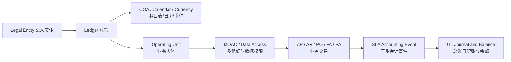
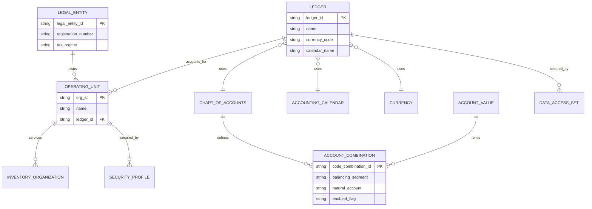
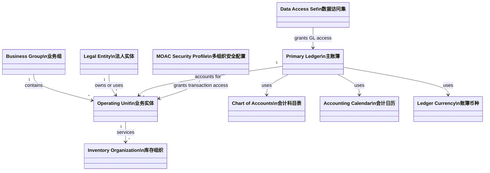

# 财务公共基础（Financials Foundation）

> 公共基础决定所有财务模块的组织边界、核算口径、权限范围和会计能力。错误的基础设计通常不能靠子模块配置补救。

## 阅读导航

- [学习目标](#1-学习目标与范围) · [企业结构](#2-企业结构的认知顺序) · [配置顺序](#3-推荐配置顺序) · [COA 与主数据](#4-coa-与主数据治理) · [权限](#5-权限与数据访问) · [诊断与练习](#7-基础问题诊断清单) · [页面与配置实操](#9-资深顾问实操页面与配置) · [专题详解](#10-专题详解)
- [模块数据字典与名词解释](data-dictionary.md#dict-01)

## 模块业务架构与核心 ER 图

### 基础设置到交易的业务架构



### 公共基础 ER 图（逻辑模型）



图中实体为顾问设计层的逻辑对象；实际表名、主键和法人/OU 多对多关系须以目标实例 eTRM 与 Accounting Setup Manager 复核。

## 1. 学习目标与范围

学完本模块，应能解释企业组织如何映射到 EBS，能够设计 Ledger（账簿）、Chart of Accounts（会计科目表，COA）、日历、币种、Legal Entity（法人实体）、Operating Unit（业务实体）和数据访问，并能判断安全、主数据或 SLA 问题的责任边界。

## 2. 企业结构的认知顺序

### 2.1 从法律责任到业务处理

| 层级/对象 | 中文说明 | 主要作用 | 常见误区 |
| --- | --- | --- | --- |
| Business Group | 业务组 | 人力资源和组织结构的顶层分区 | 当成财务核算主体 |
| Legal Entity | 法人实体 | 承担法律、税务与法定报告责任 | 与 Ledger 或 OU 一一等同 |
| Ledger | 账簿 | 由 COA、会计日历、币种和会计方法确定核算环境 | 后期随意改关键属性 |
| Operating Unit | 业务实体 | AP、AR、PO 等交易处理和数据隔离 | 忽略 MOAC 权限和默认 OU |
| Inventory Organization | 库存组织 | 物料、库存和制造交易的执行边界 | 与 OU、法人映射不清 |
| Balancing Segment Value | 平衡段值 | 保证试算平衡并常用于公司维度 | 直接等同法人而无正式映射 |

设计时先画“法律责任—核算账簿—交易组织—库存/项目组织”的关系图，再配置系统对象。多对多关系必须写清所有权、结算、税务和跨组织交易规则。

### 2.2 Ledger 的四个关键组成

Primary Ledger（主账簿）由 COA、Accounting Calendar（会计日历）、Ledger Currency（账簿币种）和 Subledger Accounting Method（子账会计方法）共同定义。Secondary Ledger（二级账簿）用于不同会计准则或核算维度；Reporting Currency（报告币种）用于币种报告。选择前先明确差异来自会计规则、科目维度、日历还是币种，避免把所有需求都交给二级账簿。

## 3. 推荐配置顺序

1. 明确法人、管理组织、共享服务和报告需求。
2. 设计 COA 段、值集、交叉验证规则和保留值。
3. 定义会计日历、币种和汇率类型。
4. 定义 Ledger、会计选项、Ledger Set（账簿集）和数据访问集。
5. 在 Legal Entity Configurator（法人实体配置器）维护法律实体和注册信息。
6. 建立 OU、库存组织及其 Ledger/法人关系，配置 Multi-Org Access Control（多组织访问控制，MOAC）。
7. 配置银行、客户、供应商、税务和其他共享主数据。
8. 配置 SLA、单据序列、审批和安全；再启用各子账。

每一步都要记录前置对象、责任人、生效日期、迁移方法和回退限制。

## 4. COA 与主数据治理

### 4.1 科目表设计原则

- 段表达稳定的管理维度，不用描述字段代替需要汇总和控制的维度。
- Natural Account（自然科目）表达会计性质；公司、成本中心、产品、项目等维度保持职责清晰。
- 父值用于汇总，不直接过账；明细值设置允许过账、预算和生效日期。
- Cross-Validation Rule（交叉验证规则）防止不合理组合，但规则过多会增加维护和性能成本。
- 科目新增、停用、映射和报表层级变更必须走审批并评估接口、SLA、FSG 和历史比较影响。

### 4.2 共享主数据的唯一性

供应商和客户在 R12 基于 Trading Community Architecture（交易社区架构，TCA）。Party（参与方）描述现实主体，Account（账户）描述业务关系，Site（地点）描述用途和组织层属性。去重不能只比名称；应综合税号、注册号、地址、银行信息和来源系统标识。

## 5. 权限与数据访问

Responsibility（职责）决定菜单、请求组和配置文件；MOAC Security Profile（MOAC 安全配置文件）决定可访问 OU；Data Access Set（数据访问集）决定 GL 中可访问的 Ledger/平衡段。排查“看不到数据”时依次确认用户—职责—配置文件—安全配置文件—组织上下文—对象授权，不要先怀疑数据丢失。

职责分离（Segregation of Duties，SoD）至少隔离：主数据维护与付款、交易录入与审批、日记账录入与过账、开发与生产发布、银行账户维护与支付审批。

## 6. 会计与技术共同语言

业务交易进入 SLA 后形成 Accounting Event（会计事件）、Accounting Entry（会计分录）和 Accounting Class（会计分类），再传输到 GL。功能顾问负责事件分类、账户规则和会计结果；技术顾问负责来源键、状态、接口、程序和追溯；两者应共同维护“交易—事件—XLA—GL”映射。

## 7. 基础问题诊断清单

1. 确认实例版本、产品安装状态和职责。
2. 确认 Ledger、OU、组织上下文和期间。
3. 确认主数据生效日期、用途和组织归属。
4. 确认配置文件值的层级（Site/Application/Responsibility/User）。
5. 确认业务状态，再追踪 SLA 和 GL；不要用手工分录掩盖子账错误。
6. 比较正常案例与异常案例的配置、数据、请求参数和日志差异。

## 8. 建议练习

- 为一个含两家法人、两个 Ledger 和共享服务中心的集团绘制组织模型。
- 设计六段 COA，并说明每段所有者、值治理、跨段校验和报表用途。
- 用同一用户切换两项职责，解释为何可见 OU 或 Ledger 不同。
- 从一张 AP 发票追溯到 XLA 和 GL，标注每层主键及状态。

## 9. 资深顾问实操：页面与配置

> 下列为 Oracle EBS R12.2 标准职责下的常见导航。客户常通过自定义职责、菜单排除和功能安全调整入口，执行前须在目标实例核对；基础配置变更应先在非生产环境完成影响分析和回归测试。

### 9.1 企业结构 UML



这张图是设计检查图，不代表所有客户都采用一对多关系。法人、Ledger、OU 和库存组织之间的实际映射应在组织设计文档中逐项列明，并说明税务登记、平衡段和跨组织结算逻辑。

### 9.2 页面剧本：检查 Accounting Setup Manager

**目标**：确认 Ledger 及其法律实体、业务实体、会计选项和报告关系已完整配置。

**常见职责与导航**：`General Ledger Super User（总账超级用户） → Setup（设置） → Financials（财务） → Accounting Setup Manager（会计设置管理器）`。部分版本从 Accounting Setup Manager 首页进入 Accounting Setups。

**操作步骤**：

1. 选择适用的 Accounting Setup（会计设置），先记录名称、状态和变更请求号。
2. 展开 Primary Ledger，核对 COA、Calendar、Currency、Accounting Method 和启用日期。
3. 核对 Legal Entity、Balancing Segment Value、Operating Unit 及 Ledger 的关系。
4. 核对 Subledger Accounting Options、Intracompany Balancing、Sequencing、Secondary Ledger 和 Reporting Currency。
5. 对比批准的组织/会计设计，不一致项先登记，不在生产页面直接试改。
6. 保存截图或导出配置清单，并由功能、财务和技术负责人共同签认。

**结果验证**：使用相同职责检查 GL Ledger 可见性，再使用 AP/AR 职责核对默认 OU 和可切换 OU；建立一笔低风险测试交易验证会计上下文。

### 9.3 页面剧本：维护科目值与层级

**常见职责与导航**：`General Ledger Super User → Setup → Financials → Flexfields → Key → Values（值）`；父子层级也可能通过 Account Hierarchy Manager（科目层级管理器）维护。

1. 取得已批准的段、值、父值、有效日期、允许过账/预算标志和属性。
2. 查询目标 Value Set（值集），确认不存在同义值或时间重叠。
3. 新增或修改值，维护 Description（说明）、Parent（父值）和 Segment Qualifiers（段限定符）。
4. 仅对明细值启用 Allow Posting；父值用于汇总时通常不允许过账。
5. 检查 Cross-Validation Rules（交叉验证规则）、Security Rules（安全规则）和报表层级影响。
6. 在非生产环境建立账户组合，测试日记账、子账派生、FSG 汇总和接口校验。

**禁止事项**：不要通过更新 `FND_FLEX_VALUES` 等基表修复值；不要在关闭历史科目值前忽略未结交易、预算、报表和接口映射。

### 9.4 页面剧本：检查 MOAC 与 GL 数据权限

1. 在 `System Administrator（系统管理员） → Profile → System` 查询 `MO: Security Profile`、`MO: Operating Unit` 和 `GL: Data Access Set` 的 Site/Application/Responsibility/User 层值。
2. 记录最终生效值及覆盖层级，不只看 Site 层默认值。
3. 使用目标职责进入 AP/AR 查询页面，验证可见 OU；在 GL 日记账或余额查询中验证可见 Ledger/平衡段。
4. 用“应可见”和“应不可见”各一组样本验证，保留用户、职责、参数和结果。
5. 权限修改后重新登录，防止旧会话缓存造成误判。

### 9.5 资深顾问的基础配置评审表

| 决策 | 必须形成的证据 | 下游影响 |
| --- | --- | --- |
| Ledger 四要素 | 会计政策、币种/日历、COA 设计、会计方法 | 所有子账、SLA、报表 |
| 法人与平衡段映射 | 法定主体清单、税务登记、平衡规则 | 税务、公司间、法定报告 |
| OU 与共享服务 | 业务所有权、处理职责、MOAC 范围 | AP/AR/PO、数据访问 |
| 科目值与层级 | 值所有者、有效期、父子层级、审批 | 接口、SLA、FSG、预算 |
| 数据访问和职责 | SoD 矩阵、应见/不应见测试 | 交易、查询、审批、审计 |
| 主数据治理 | 唯一性规则、变更流程、停用策略 | 客户、供应商、银行、税务 |

### 9.6 高级诊断：配置正确但交易仍失败

按“生效日期 → 配置层级 → 组织上下文 → 缓存/会话 → 业务对象默认 → SLA/接口”检查。比较正常与异常职责的 Profile 值、OU、Ledger、用户权限和单据类型；确认页面默认值是否来自 Supplier/Customer Site、Transaction Type、Financial Options 或 SLA，而不是只检查总账设置。

## 10. 专题详解


<!-- source: docs/01-common/README.md -->
<a id="src-docs-01-common-readme"></a>
### 财务公共基础


本目录是所有财务与供应链子账的共同前提。先完成企业结构、账簿、会计科目、期间、MOAC 和职责权限的设计，再配置 AP、AR、GL、FA 或成本模块；后续改变这些基础对象通常需要跨模块影响评估和完整回归。

<a id="src-docs-01-common-readme--阅读与实施顺序"></a>
#### 阅读与实施顺序

1. [企业结构与多组织](#src-docs-01-common-organization)：Business Group、Legal Entity、Ledger、OU、Inventory Organization 与 MOAC。
2. [会计科目](#src-docs-01-common-coa)：COA、段限定符、值集、交叉验证和安全规则。
3. [日历、币种与期间](#src-docs-01-common-calendar-currency-period)：会计日历、汇率与期间状态。
4. [职责与数据安全](#src-docs-01-common-security)：Responsibility、Data Access Set、MO: Security Profile 和请求组。
5. [SLA](#src-docs-01-common-sla)：所有子账会计事件进入 GL 前的权威会计规则入口。
6. [附件、DFF 与序列](#src-docs-01-common-attachments-dff)：合规凭证、扩展字段和编号控制。
7. [表结构](#src-docs-01-common-tables) 与 [接口基础](#src-docs-01-common-interfaces)：只读诊断、会话上下文和集成治理。

<a id="src-docs-01-common-readme--关键设计决策"></a>
#### 关键设计决策

| 决策 | 应在蓝图阶段确认 | 典型风险 |
| --- | --- | --- |
| Ledger 边界 | 币种、会计日历、COA、会计方法、法定/管理报告 | 将仅需 OU 隔离的场景错误拆为多个 Ledger，增加合并和对账成本 |
| Legal Entity 边界 | 法定责任、注册、税务和银行账户所有权 | 把经营组织当成法人，造成税务、公司间和付款主体混乱 |
| OU/MOAC | 交易处理责任、共享服务访问范围、默认 OU | 使用全局安全配置掩盖职责隔离，或自定义 SQL 漏加 `ORG_ID` |
| COA | Balancing、Cost Center、Natural Account 等限定符和治理流程 | 上线后改段结构、改限定符或删除值，导致历史数据和报表不可比 |
| SLA | 法规/管理会计差异、辅助参考、过账粒度、审计追溯 | 直接修改子账或 GL 数据替代规则设计，破坏 Drilldown 和审计链 |

<a id="src-docs-01-common-readme--r122-适用边界"></a>
#### R12.2 适用边界

- 页面配置、Profile、职责和标准设置优先通过应用界面或 FNDLOAD 迁移；不可直接更新 FND、HR、XLA、GL 等业务基表。
- 只读 SQL 必须在目标实例用 `ALL_TAB_COLUMNS` 和 eTRM 复核。多组织对象优先限定 `ORG_ID`，账簿对象限定 `LEDGER_ID`。
- Legal Entity Configurator、Accounting Setup Manager、MOAC 和 Data Access Set 的设计应保留工作簿、审批记录和回归证据。

<a id="src-docs-01-common-readme--官方依据"></a>
#### 官方依据

- [Oracle Financials Implementation Guide](https://docs.oracle.com/cd/E26401_01/doc.122/e48783/toc.htm)
- [Oracle E-Business Suite Security Guide](https://docs.oracle.com/cd/E26401_01/doc.122/e22952/toc.htm)


<!-- source: docs/01-common/attachments-dff.md -->
<a id="src-docs-01-common-attachments-dff"></a>
### 附件、说明性弹性域与文档序列


<a id="src-docs-01-common-attachments-dff--附件"></a>
#### 附件

EBS 附件由实体定义、文档、附件关联和存储内容组成。常用对象为 `FND_ATTACHED_DOCUMENTS`、`FND_DOCUMENTS`、`FND_DOCUMENTS_TL`、`FND_DOCUMENT_DATATYPES`、`FND_LOBS`。附件可以是文件、URL、短文本或长文本，是否可见受实体、类别、功能和用户权限影响。

<a id="src-docs-01-common-attachments-dff--dff-原理"></a>
#### DFF 原理

Descriptive Flexfield（DFF）用于在不修改标准表结构的情况下，使用预留 `ATTRIBUTE_CATEGORY`、`ATTRIBUTE1...N` 字段扩展业务属性。Global Segment 对所有上下文显示，Context-sensitive Segment 由上下文值决定。DFF 只是存储与校验机制，不应替代独立业务实体或高频报表模型。

<a id="src-docs-01-common-attachments-dff--文档序列"></a>
#### 文档序列

Document Sequence 为业务文档生成唯一、可审计的编号。通常流程为：定义 Sequence → Document Category → 按 Ledger/Application/Method/Date 分配。`Sequential Numbering` Profile 决定强制、部分或不使用。已启用并产生编号的序列不应随意修改初始值或删除分配。

<a id="src-docs-01-common-attachments-dff--配置检查"></a>
#### 配置检查

- DFF：确认 Title/Application/Table、上下文、Value Set、Required/Security、引用字段和编译状态。
- 附件：确认 Entity/Primary Key 映射、Category 分配、文件大小限制、MIME 类型、存储和病毒扫描策略。
- 序列：确认应用、单据类别、账簿/方法、有效日期和 Profile 值。
- R12.2 在线补丁环境中，数据库定制必须遵循 Edition-Based Redefinition 和 AD Online Patching 开发标准。

<a id="src-docs-01-common-attachments-dff--常用-sql"></a>
#### 常用 SQL

```sql
-- 某业务实体附件元数据（PK1_VALUE 根据实体可能为字符串）
SELECT fad.attached_document_id, fad.entity_name,
       fad.pk1_value, fad.pk2_value, fad.seq_num,
       fd.document_id, fd.datatype_id, fd.category_id,
       fdt.title, fdt.description, fd.url, fd.media_id
  FROM fnd_attached_documents fad
  JOIN fnd_documents fd ON fd.document_id = fad.document_id
  LEFT JOIN fnd_documents_tl fdt
    ON fdt.document_id = fd.document_id
   AND fdt.language = USERENV('LANG')
 WHERE fad.entity_name = :p_entity_name
   AND fad.pk1_value = TO_CHAR(:p_pk1_value)
 ORDER BY fad.seq_num;

-- DFF 定义
SELECT application_table_name, descriptive_flexfield_name,
       title, freeze_flex_definition_flag
  FROM fnd_descriptive_flexs_vl
 WHERE UPPER(title) LIKE UPPER(:p_title_pattern);

-- 文档序列
SELECT name, application_id, type, initial_value,
       start_date, end_date, message_flag
  FROM fnd_document_sequences
 WHERE application_id = :p_application_id
 ORDER BY name;
```

<a id="src-docs-01-common-attachments-dff--排查"></a>
#### 排查

- **DFF 不显示**：检查功能对应 DFF Title、上下文值、段启用/有效期、编译和缓存。
- **DFF 值保存失败**：检查 Value Set 长度/类型、Required、安全规则和底层 `ATTRIBUTE` 列长度。
- **附件看不到**：比较 Entity Name、PK1...PK5、Category 和功能分配；不要只查 `FND_LOBS`。
- **文件无法下载**：检查 `MEDIA_ID`、LOB 存在性、MIME、Web 层日志和反向代理大小/超时限制。
- **序列不生成/重复**：查 Sequential Numbering Profile、Category Assignment、有效期和方法；不直接改序列表。

<a id="src-docs-01-common-attachments-dff--关联文档"></a>
#### 关联文档

- [R12.2 定制开发](10-technical.md#src-docs-09-technical-customization)
- [权限与审计](#src-docs-01-common-security)


<!-- source: docs/01-common/calendar-currency-period.md -->
<a id="src-docs-01-common-calendar-currency-period"></a>
### 日历、币种、汇率与期间控制


<a id="src-docs-01-common-calendar-currency-period--原理"></a>
#### 原理

Ledger 的核心属性包括 Accounting Calendar、Period Type 和 Ledger Currency。子账期间与 GL 期间分开控制：AP/AR/PO/INV/FA 可以在同一 GL 期间下处于不同状态，关闭顺序应从业务子账到 GL。

```text
Transaction Currency
  → Conversion Type + Conversion Date + Daily Rate
  → Ledger Currency（Accounted Amount）
  → Reporting Currency / Secondary Ledger（如已配置）
```

`GL_DAILY_RATES` 保存日汇率，汇率类型在 `GL_DAILY_CONVERSION_TYPES`。日记账头的汇率日期/类型/汇率决定折算；重估（Revaluation）处理外币账户未实现汇兑差额，折算（Translation）用于将账簿余额转为报告币种。

<a id="src-docs-01-common-calendar-currency-period--配置顺序"></a>
#### 配置顺序

1. 定义 Calendar 和 Period Type，一次生成并仔细检查期间日期、期间号和年度。
2. 确认币种、精度、最小账户单位和启用日期。
3. 定义 Conversion Type，建立汇率获取、审批和导入控制。
4. 完成 Ledger 设置后打开首个 GL 期间，再按模块打开子账期间。
5. 月结时先处理接口/未过账交易、创建会计、转 GL 并对账，再关闭子账，最后关闭 GL。

<a id="src-docs-01-common-calendar-currency-period--常用-sql"></a>
#### 常用 SQL

```sql
-- Ledger 日历和期间
SELECT gl.ledger_id, gl.name, gl.currency_code,
       gl.period_set_name, gl.accounted_period_type,
       gps.period_name, gps.start_date, gps.end_date,
       gps.closing_status
  FROM gl_ledgers gl
  JOIN gl_period_statuses gps
    ON gps.application_id = 101
   AND gps.set_of_books_id = gl.ledger_id
 WHERE gl.ledger_id = :p_ledger_id
 ORDER BY gps.start_date;

-- 某日汇率
SELECT from_currency, to_currency, conversion_date,
       conversion_type, conversion_rate, status_code
  FROM gl_daily_rates
 WHERE conversion_date = :p_conversion_date
   AND from_currency = :p_from_currency
   AND to_currency = :p_to_currency;

-- 各应用期间状态；APPLICATION_ID 需联接 FND_APPLICATION 解读
SELECT gps.application_id, fa.application_short_name,
       gps.set_of_books_id, gps.period_name, gps.closing_status,
       gps.start_date, gps.end_date
  FROM gl_period_statuses gps
  JOIN fnd_application fa ON fa.application_id = gps.application_id
 WHERE gps.set_of_books_id = :p_ledger_id
   AND gps.period_name = :p_period_name;
```

<a id="src-docs-01-common-calendar-currency-period--排查"></a>
#### 排查

- **缺少汇率**：核对 From/To Currency、Conversion Type/Date、直接或反向汇率、导入状态和精度。
- **日期不在开放期间**：检查交易日期对应的子账期间，不要只检查 GL。
- **期间无法关闭**：查待处理接口、未验证/未会计交易、未转 GL 会计和未完成并发请求。
- **会计金额不等**：比较交易汇率与公司标准汇率，检查手工覆盖和 SLA 舍入。
- **错误关期**：优先用标准 Reopen 流程并评估已发布报表，禁止更新 `GL_PERIOD_STATUSES`。

<a id="src-docs-01-common-calendar-currency-period--关联文档"></a>
#### 关联文档

- [GL 期间关闭](02-record-to-report.md#src-docs-04-gl-close-reports)
- [AP 会计与月结](03-procure-to-pay.md#src-docs-02-ap-accounting-close-reports)
- [AR 会计与月结](04-credit-to-cash.md#src-docs-03-ar-accounting-close-reports)


<!-- source: docs/01-common/coa.md -->
<a id="src-docs-01-common-coa"></a>
### 会计科目与会计弹性域（COA / Accounting Flexfield）


<a id="src-docs-01-common-coa--核心原理"></a>
#### 核心原理

Ledger 通过 `CHART_OF_ACCOUNTS_ID` 使用一套 Accounting Key Flexfield 结构。结构由段、值集、限定词、交叉验证规则和安全规则组成；段值组合实例存放于 `GL_CODE_COMBINATIONS`（CCID）。

典型结构：

```text
Company（Balancing）- Cost Center（Cost Center）- Account（Natural Account）
- Intercompany（Intercompany）- Product - Project - Future
```

- Balancing Segment 用于平衡和资产负债表边界，常与法人平衡段分配配合。
- Natural Account 决定账户类型（资产/负债/所有者权益/收入/费用），影响年结。
- Cost Center 支持管理会计和成本归集，不应与 OU 概念混用。
- Dynamic Insertion 允许运行时创建 CCID，但仍受值集、安全和交叉验证约束。

<a id="src-docs-01-common-coa--设计与配置"></a>
#### 设计与配置

1. 确定全局报表维度、法定报表边界和未来扩展需求。
2. 定义 Value Set，包括格式、长度、独立/从属验证和值安全。
3. 定义 Accounting Flexfield 结构、段顺序和限定词。
4. 定义段值、父子层级和汇总组；禁止将父值用于明细过账。
5. 定义 Cross-Validation Rules 防止非法组合，定义 Security Rules 限制用户可见值。
6. 编译弹性域并完成日记账、SLA、FSG 和接口测试。

R12.2 生产中改变已使用段的长度、顺序、限定词或值集是高风险变更，应先评估 SLA、FSG、定制接口、子账账户默认及历史报表。

<a id="src-docs-01-common-coa--常用-sql"></a>
#### 常用 SQL

```sql
-- Ledger 与 COA
SELECT ledger_id, name, chart_of_accounts_id, currency_code,
       period_set_name, accounted_period_type
  FROM gl_ledgers
 WHERE ledger_id = :p_ledger_id;

-- 科目组合；SEGMENT 数量以实际 COA 为准
SELECT code_combination_id, chart_of_accounts_id,
       segment1, segment2, segment3, segment4,
       account_type, enabled_flag, detail_posting_allowed_flag,
       detail_budgeting_allowed_flag, start_date_active, end_date_active
  FROM gl_code_combinations
 WHERE chart_of_accounts_id = :p_coa_id
   AND segment1 = :p_company
   AND segment3 = :p_natural_account;

-- 值集值和父子层级
SELECT flex_value_set_id, flex_value, description,
       enabled_flag, summary_flag, start_date_active, end_date_active
  FROM fnd_flex_values_vl
 WHERE flex_value_set_id = :p_value_set_id
 ORDER BY flex_value;
```

<a id="src-docs-01-common-coa--常见问题"></a>
#### 常见问题

- **APP-FND-00828/组合无效**：依次检查段值有效期、启用标志、Security Rule、Cross-Validation Rule 和 Dynamic Insertion。
- **科目可选但不能过账**：检查 CCID 和各段的 `ENABLED_FLAG`、`DETAIL_POSTING_ALLOWED_FLAG`、有效期。
- **年结结果异常**：检查 Natural Account 的 `ACCOUNT_TYPE`，已产生历史数据时不要直接修改基表。
- **新规则不生效**：确认规则分配到正确职责、弹性域已编译、用户已重新登录。
- **FSG 汇总不全**：检查父子范围、汇总组、账户类型和层级变更日期。

<a id="src-docs-01-common-coa--关联文档"></a>
#### 关联文档

- [Ledger、日历和期间](#src-docs-01-common-calendar-currency-period)
- [SLA 会计派生](#src-docs-01-common-sla)
- [GL 报表与导入](02-record-to-report.md#src-docs-04-gl-reporting-interfaces)

<a id="src-docs-01-common-coa--官方参考"></a>
#### 官方参考

- [Oracle General Ledger Implementation Guide R12.2](https://docs.oracle.com/cd/E26401_01/doc.122/e48747/toc.htm)


<!-- source: docs/01-common/interfaces.md -->
<a id="src-docs-01-common-interfaces"></a>
### 财务公共基础接口实现


<a id="src-docs-01-common-interfaces--1-适用场景"></a>
#### 1. 适用场景

本章提供各业务模块共用的接口基础设计：

- EBS 用户/职责/MOAC 上下文初始化。
- 外部系统提交 EBS Concurrent Program。
- 统一 Staging、幂等、状态、错误和对账模型。
- EBS Business Event 发布与下游解耦。
- Integration Repository/Integrated SOA Gateway（ISG）服务暴露。

> **安全边界**：写入类代码仅用于开发/测试环境。生产必须完成代码审查、权限审批、性能测试和回退演练。不使用 APPS 账号作为外部系统直连账号。

<a id="src-docs-01-common-interfaces--2-接口标准分层"></a>
#### 2. 接口标准分层

```text
Source System
  → API Gateway / SFTP / MQ
  → Landing（原始报文，不可变）
  → XX Staging（标准化、幂等、业务校验）
  → Oracle Public API / Open Interface
  → Standard Import Concurrent Program
  → Base Transaction → SLA → GL
  → Acknowledgement / Reconciliation / Archive
```

<a id="src-docs-01-common-interfaces--21-统一状态"></a>
##### 2.1 统一状态

| 状态 | 中文含义 | 允许的下一步 |
| --- | --- | --- |
| `NEW` | 已接收 | 格式与幂等校验 |
| `VALIDATED` | 已校验 | 写入 Oracle 标准接口/API |
| `SUBMITTED` | 已提交 | 等待 Concurrent Request/API 结果 |
| `SUCCESS` | 已成功 | 对账、ACK、归档 |
| `ERROR` | 业务错误 | 修正后人工/受控重试 |
| `RETRY` | 技术重试 | 按指数退避再执行 |
| `DEAD` | 超过重试上限 | 人工介入，不自动循环 |

<a id="src-docs-01-common-interfaces--3-自定义-staging-表实现"></a>
#### 3. 自定义 Staging 表实现

```sql
-- 仅在自定义 schema 中创建，并通过 R12.2 adop/EBR 标准发布。
CREATE TABLE xxint_messages (
  message_id          NUMBER        NOT NULL,
  interface_code      VARCHAR2(30)  NOT NULL,
  source_system       VARCHAR2(30)  NOT NULL,
  external_key        VARCHAR2(240) NOT NULL,
  payload_hash        VARCHAR2(64)  NOT NULL,
  correlation_id      VARCHAR2(100),
  org_id              NUMBER,
  ledger_id           NUMBER,
  status_code         VARCHAR2(20)  DEFAULT 'NEW' NOT NULL,
  retry_count         NUMBER        DEFAULT 0 NOT NULL,
  next_retry_date     DATE,
  request_id          NUMBER,
  ebs_transaction_id  NUMBER,
  error_code          VARCHAR2(100),
  error_message       VARCHAR2(2000),
  payload_clob        CLOB,
  creation_date       DATE          DEFAULT SYSDATE NOT NULL,
  created_by          NUMBER        NOT NULL,
  last_update_date    DATE          DEFAULT SYSDATE NOT NULL,
  last_updated_by     NUMBER        NOT NULL,
  CONSTRAINT xxint_messages_pk PRIMARY KEY (message_id),
  CONSTRAINT xxint_messages_u1 UNIQUE
    (interface_code, source_system, external_key)
);
```

幂等不只检查 `EXTERNAL_KEY`：如同一键的 `PAYLOAD_HASH` 改变，应进入“源数据冲突”而非静默覆盖。

<a id="src-docs-01-common-interfaces--4-ebsmoac-上下文代码"></a>
#### 4. EBS/MOAC 上下文代码

```sql
DECLARE
  l_user_id       NUMBER := :p_user_id;
  l_resp_id       NUMBER := :p_resp_id;
  l_resp_appl_id  NUMBER := :p_resp_appl_id;
  l_org_id        NUMBER := :p_org_id;
BEGIN
  fnd_global.apps_initialize(
    user_id      => l_user_id,
    resp_id      => l_resp_id,
    resp_appl_id => l_resp_appl_id
  );

  -- 按实际产品使用应用短名，AP 通常为 SQLAP。
  mo_global.init('SQLAP');
  mo_global.set_policy_context('S', l_org_id);

  IF mo_global.get_current_org_id <> l_org_id THEN
    raise_application_error(-20001, 'MOAC context initialization failed');
  END IF;
END;
/
```

生产实现中，User/Responsibility 应是专用、最小权限、可审计的接口身份；不使用离职员工或 System Administrator 职责。

<a id="src-docs-01-common-interfaces--5-提交-concurrent-program"></a>
#### 5. 提交 Concurrent Program

```sql
DECLARE
  l_request_id NUMBER;
BEGIN
  -- 必须已执行 FND_GLOBAL.APPS_INITIALIZE。
  l_request_id := fnd_request.submit_request(
    application => :p_application_short_name,
    program     => :p_concurrent_program_short_name,
    description => NULL,
    start_time  => NULL,
    sub_request => FALSE,
    argument1   => :p_argument1,
    argument2   => :p_argument2,
    argument3   => :p_argument3
  );

  IF l_request_id = 0 THEN
    raise_application_error(-20002,
      'Submit request failed: ' || fnd_message.get);
  END IF;

  -- FND_REQUEST 提交需要 commit 后 Concurrent Manager 才能看到。
  COMMIT;
  dbms_output.put_line('REQUEST_ID=' || l_request_id);
END;
/
```

`ARGUMENT1..100` 是位置参数。必须在当前实例的 Concurrent Program Parameters 窗口/数据字典中确认顺序，不从网上复制其他补丁级别的参数位置。

<a id="src-docs-01-common-interfaces--6-等待请求完成"></a>
#### 6. 等待请求完成

```sql
DECLARE
  l_phase       VARCHAR2(80);
  l_status      VARCHAR2(80);
  l_dev_phase   VARCHAR2(30);
  l_dev_status  VARCHAR2(30);
  l_message     VARCHAR2(240);
  l_done        BOOLEAN;
BEGIN
  l_done := fnd_concurrent.wait_for_request(
    request_id => :p_request_id,
    interval   => 5,
    max_wait   => 600,
    phase      => l_phase,
    status     => l_status,
    dev_phase  => l_dev_phase,
    dev_status => l_dev_status,
    message    => l_message
  );

  dbms_output.put_line(
    l_dev_phase || '/' || l_dev_status || ': ' || l_message);

  IF NOT l_done OR l_dev_phase <> 'COMPLETE'
     OR l_dev_status NOT IN ('NORMAL', 'WARNING') THEN
    raise_application_error(-20003, 'Concurrent request failed or timed out');
  END IF;
END;
/
```

对高并发接口，不应让每个 Web 请求长时间同步等待 Concurrent Program；建议返回 `REQUEST_ID`，由客户端轮询或通过回调/消息获取结果。

<a id="src-docs-01-common-interfaces--7-business-event-发布示例"></a>
#### 7. Business Event 发布示例

```sql
DECLARE
  l_parameter_list wf_parameter_list_t := wf_parameter_list_t();
BEGIN
  wf_event.addparametertolist(
    p_name          => 'SOURCE_SYSTEM',
    p_value         => :p_source_system,
    p_parameterlist => l_parameter_list
  );
  wf_event.addparametertolist(
    p_name          => 'TRANSACTION_ID',
    p_value         => TO_CHAR(:p_transaction_id),
    p_parameterlist => l_parameter_list
  );

  wf_event.raise(
    p_event_name => 'oracle.apps.xxint.transaction.completed',
    p_event_key  => :p_interface_code || ':' || :p_external_key,
    p_parameters => l_parameter_list,
    p_event_data => NULL
  );
END;
/
```

Event Name 必须先在 Workflow Administrator 中定义并启用。订阅应幂等，因为 Workflow/Agent 重试可能再次交付同一 Event Key。

<a id="src-docs-01-common-interfaces--8-业界常用案例"></a>
#### 8. 业界常用案例

| 案例 | 推荐方式 | 不推荐 |
| --- | --- | --- |
| 主数据批量导入 | 标准 Open Interface/API + Concurrent Program | 直接 DML TCA/FND/HR 基表 |
| 外部系统发起批处理 | ISG Concurrent Program REST 或中间件提交 | 长时间 HTTP 同步锁住 |
| EBS 业务完成通知 | Business Event + Queue/Subscriber | 在业务交易中同步调外部 HTTP |
| 参数/组织映射 | 客户自定义配置表 + 有效期 | 在代码中硬编码 OU/Ledger/CCID |

<a id="src-docs-01-common-interfaces--9-官方参考"></a>
#### 9. 官方参考

- [Oracle E-Business Suite Integrated SOA Gateway Implementation Guide](https://docs.oracle.com/cd/E26401_01/doc.122/e20925/)
- [Oracle E-Business Suite Integrated SOA Gateway Developer's Guide](https://docs.oracle.com/cd/E26401_01/doc.122/e20927/)
- [Oracle E-Business Suite Concepts: Integration Repository](https://docs.oracle.com/cd/E26401_01/doc.122/e22949/T120505T120507.htm)


<!-- source: docs/01-common/organization.md -->
<a id="src-docs-01-common-organization"></a>
### Oracle EBS R12.2.x 企业结构与多组织（Multi-Org / MOAC）


<a id="src-docs-01-common-organization--1-文档目标与适用范围"></a>
#### 1. 文档目标与适用范围

本文面向 Oracle E-Business Suite R12.2.x，用于设计、配置和排查以下企业结构：

- Business Group（业务组）
- Ledger（账簿，R11i 中称 Set of Books）
- Legal Entity（法人实体）
- Operating Unit（业务实体，简称 OU）
- Inventory Organization（库存组织，简称 IO）
- MOAC（Multiple Organizations Access Control，多组织访问控制）

> **SQL 安全说明**：本文 SQL 默认为只读诊断 SQL，建议使用 APPS 只读账号执行。不要在生产库直接更新 `HR_*`、`XLE_*`、`GL_*`、`FND_*` 或业务表；配置变更应通过标准 Form/OAF 页面、公开 API 或经 Oracle Support 确认的数据修复方案完成。

---

<a id="src-docs-01-common-organization--2-核心概念与层级"></a>
#### 2. 核心概念与层级

```text
EBS Instance
└── Business Group（HR 人员与组织数据边界）
    ├── Primary Ledger（COA + 币种 + 会计日历 + SLA 方法）
    │   ├── Legal Entity A（法定/税务报告主体）
    │   │   ├── Operating Unit A1（AP/AR/PO/OM 交易数据边界）
    │   │   │   ├── Inventory Organization A11
    │   │   │   └── Inventory Organization A12
    │   │   └── Operating Unit A2
    │   └── Legal Entity B
    └── Other Ledger / Legal Entity / OU ...
```

这是逻辑关系，不表示所有层级都由同一张父子表存储。EBS 会分别在 HR、GL、XLE 和 INV 数据模型中保存组织定义及关系。

<a id="src-docs-01-common-organization--21-各层级的作用"></a>
##### 2.1 各层级的作用

| 层级 | 业务含义 | 主要数据边界 | 常用字段/ID |
| --- | --- | --- | --- |
| Business Group | HR 上的最高层人员与组织分区，决定立法代码、HR 弹性域等 | 人员、岗位、组织、HR 安全 | `BUSINESS_GROUP_ID` |
| Ledger | 共享科目表、本位币、会计日历和 SLA 方法的财务报告主体 | GL 日记账和余额；由 Data Access Set 控制 | `LEDGER_ID` |
| Legal Entity | 依法设立、承担税务和法定报告义务的实体 | 法人登记、税号、法定地址、法人与账簿关系 | `LEGAL_ENTITY_ID` |
| Operating Unit | 使用 AP、AR、PO、OM、CE 等子模块的业务单元 | 子账模块交易，通常以 `ORG_ID` 隔离 | `ORG_ID` / `ORGANIZATION_ID` |
| Inventory Organization | 记录物料、库存、WIP、BOM 和制造交易的组织 | 库存与制造数据 | `ORGANIZATION_ID` |

<a id="src-docs-01-common-organization--22-容易混淆的边界"></a>
##### 2.2 容易混淆的边界

1. **OU 不等于法人**：OU 是子账业务和数据权限边界，Legal Entity 是法定主体。OU 通过 Primary Ledger 和 Default Legal Context 与法人关联。
2. **OU 权限不等于 Ledger 权限**：MOAC 控制 OU；GL Data Access Set 控制 Ledger/平衡段值。一个职责能查到 AP 发票，不代表它一定有权查看相应 GL 账簿数据。
3. **OU 不等于 Inventory Organization**：OU 下可有多个 IO；IO 另有自己的组织代码、库存参数和物料主组织关系。
4. **`ORG_ID` 的含义取决于表**：在 AP/AR/PO/OM 中通常表示 OU；在 INV 表中更常见的是 `ORGANIZATION_ID`，通常表示 IO。不能只看字段名猜测。
5. **HR Organization 是通用容器**：同一个 `HR_ALL_ORGANIZATION_UNITS` 组织可被赋予一个或多个分类；具体属性保存在组织信息表或专用模块表中。

---

<a id="src-docs-01-common-organization--3-r122-moac-工作原理"></a>
#### 3. R12.2 MOAC 工作原理

<a id="src-docs-01-common-organization--31-从职责到数据的链路"></a>
##### 3.1 从职责到数据的链路

```text
User
  → Responsibility
    → HR: Business Group
    → MO: Security Profile（多 OU）
       或 MO: Operating Unit（单 OU，兼容方式）
    → MO: Default Operating Unit（可选，仅用于默认值）
      → 会话初始化 MOAC 上下文
        → 子账页面/报表/API 只能处理授权 OU
```

- `MO: Security Profile` 可授权一个或多个 OU，是 R12 共享服务模式的核心。
- `MO: Operating Unit` 只提供单 OU 访问。
- 如果已设置 `MO: Security Profile`，`MO: Operating Unit` 会被忽略。
- `MO: Default Operating Unit` 只决定录入时的默认 OU，**不会扩大授权范围**。
- 标准 Security Profile 限于同一 Business Group；跨 Business Group 访问应使用 Global Security Profile。

<a id="src-docs-01-common-organization--32-访问模式"></a>
##### 3.2 访问模式

MOAC 会话通常有以下访问模式：

| 模式 | 含义 | 常见场景 |
| --- | --- | --- |
| `S` | Single，当前只有一个 OU | 单 OU 职责或程序显式选定 OU |
| `M` | Multiple，可访问安全配置文件中的多个 OU | MOAC 职责 |
| `A` | All，特殊全局模式 | 仅限经确认的标准程序/管理场景 |
| NULL | 未初始化 | SQL Developer、自定义 JDBC 连接或会话初始化失败 |

R12 标准应用会在登录并选择职责后初始化 FND 和 MOAC 上下文。定制 PL/SQL/API 如果从 SQL*Plus、JDBC 或外部调度器调用，不能假设上下文已存在。

<a id="src-docs-01-common-organization--33-all安全视图与-orgid"></a>
##### 3.3 `_ALL`、安全视图与 `ORG_ID`

- 多数 OU 级交易表含 `ORG_ID`，如 `AP_INVOICES_ALL`、`RA_CUSTOMER_TRX_ALL`、`PO_HEADERS_ALL`、`OE_ORDER_HEADERS_ALL`。
- 定制报表必须明确组织边界：使用当前 EBS 会话中的标准安全机制，或在经授权的管理报表中对 `ORG_ID` 显式限定。
- 不要因为对象名含 `_ALL` 就默认当前账号一定能无限制查看全部数据；同义词、VPD 策略、执行 schema 和会话上下文都会影响结果。
- 生产定制程序不应通过硬编码 `ORG_ID`、禁用策略或连接基表来绕过 MOAC。

---

<a id="src-docs-01-common-organization--4-规划原则"></a>
#### 4. 规划原则

<a id="src-docs-01-common-organization--41-什么时候需要新-ledger"></a>
##### 4.1 什么时候需要新 Ledger

下列四项中任一核心属性不同，通常需要新 Ledger：

1. Chart of Accounts（会计科目表）
2. Accounting Calendar（会计日历）
3. Ledger Currency（账簿币种）
4. Subledger Accounting Method（子分类账会计方法）

管理报表、部门分割或地区不同，未必要新建 Ledger，可考虑平衡段、成本中心、OU 或管理维度。

<a id="src-docs-01-common-organization--42-什么时候需要新-legal-entity"></a>
##### 4.2 什么时候需要新 Legal Entity

当存在独立法定注册、税号、法定报表、合同主体或法律责任时，应考虑新 Legal Entity。不要仅为了权限隔离而创建虚假法人。

<a id="src-docs-01-common-organization--43-什么时候需要新-ou"></a>
##### 4.3 什么时候需要新 OU

当 AP/AR/PO/OM 需要独立的交易类型、单据编号、税务默认、银行/收付款配置、采购或订单管理策略，或需要强 OU 级交易数据隔离时，可考虑新 OU。新建 OU 会增加设置、对账、月结和运维成本，不应将每个部门都设为 OU。

<a id="src-docs-01-common-organization--44-什么时候需要新-inventory-organization"></a>
##### 4.4 什么时候需要新 Inventory Organization

当需要独立追踪库存数量、库位、物料状态、成本、制造或供应计划时，应设置 IO。纯交易型 OU 不一定需要自己的 IO；但 PO Receiving、INV、WIP 等功能通常需要库存组织。

---

<a id="src-docs-01-common-organization--5-标准配置顺序"></a>
#### 5. 标准配置顺序

> 菜单名称会因语言、产品安装和自定义职责而有差异，以当前实例的 Navigator 为准。

<a id="src-docs-01-common-organization--步骤-1设计企业结构"></a>
##### 步骤 1：设计企业结构

在配置前形成经业务、财务、税务、HR 和信息安全共同确认的映射表：

| Business Group | Ledger | Legal Entity | Balancing Segment | OU | Inventory Org | 负责人 |
| --- | --- | --- | --- | --- | --- | --- |
| ... | ... | ... | ... | ... | ... | ... |

同时确认组织编码、名称、启用日期、法定地址、税号、账簿四要素及历史数据迁移边界。

<a id="src-docs-01-common-organization--步骤-2定义-ledger-和-accounting-setup"></a>
##### 步骤 2：定义 Ledger 和 Accounting Setup

常用路径：

```text
General Ledger 超级用户
  → Setup
  → Financials
  → Accounting Setup Manager
  → Accounting Setups
```

配置 Primary Ledger，并根据需要关联 Legal Entity、Balancing Segment Value、Reporting Currency、Secondary Ledger、SLA 选项、公司间/公司内平衡规则等。

<a id="src-docs-01-common-organization--步骤-3定义-legal-entity"></a>
##### 步骤 3：定义 Legal Entity

通过 Legal Entity Configurator 或 Accounting Setup Manager 定义法人、法定地址、注册地、税务登记和相关联系。确保法人与 Primary Ledger 及平衡段值的设计一致。

<a id="src-docs-01-common-organization--步骤-4定义-location"></a>
##### 步骤 4：定义 Location

常用路径：

```text
HRMS / Inventory 相关职责
  → Work Structures
  → Location
```

组织尤其是库存组织通常需要有效 Location。核对地址、国家/地区、启用日期以及 Location 是否已被其他 IO 占用。

<a id="src-docs-01-common-organization--步骤-5定义-ou"></a>
##### 步骤 5：定义 OU

可在 Define Organization 窗口定义，也可通过 Accounting Setup Manager 建立。OU 至少需要：

- Organization Classification = Operating Unit
- Primary Ledger
- Default Legal Context
- 正确的 Business Group 和有效日期

若在 Define Organization 中建立，仍应在 Accounting Setup Manager 中检查其账簿/法人关系。

<a id="src-docs-01-common-organization--步骤-6定义-inventory-organization"></a>
##### 步骤 6：定义 Inventory Organization

先建立组织与 Inventory Organization 分类，设置 Accounting Information：

- Primary Ledger
- Legal Entity
- Operating Unit

再完成 Inventory Parameters、Organization Code、Master Organization、账户、日历、子库和库位等 INV 设置。不要通过复制表数据建立 IO。

<a id="src-docs-01-common-organization--步骤-7完成各模块-ou-级设置"></a>
##### 步骤 7：完成各模块 OU 级设置

常见设置包括：

- AP：Financial Options、Payables Options、发票选项、付款、银行账户用途。
- AR：System Options、Transaction Types、Transaction Sources、Receivables Activities、AutoAccounting。
- PO：Financial Options、Purchasing Options、Receiving Options、Document Types。
- OM：OM System Parameters、Transaction Types、Shipping Parameters。
- CE/IBY/EBTax：银行账户使用权、付款处理配置、税务法规和法人/OU 适用范围。

<a id="src-docs-01-common-organization--步骤-8定义-security-profile-global-security-profile"></a>
##### 步骤 8：定义 Security Profile / Global Security Profile

常用路径：

```text
Human Resources
  → Security
  → Profile
```

选择直接列出组织或使用组织层级。遵循最小权限，将交易处理职责和跨 OU 查询/共享服务职责分开。

<a id="src-docs-01-common-organization--步骤-9运行-security-list-maintenance"></a>
##### 步骤 9：运行 Security List Maintenance

创建或修改 Security Profile/组织层级后，提交：

```text
Security List Maintenance（程序短名常见为 PERSELM）
```

等待请求正常完成并检查日志。遗漏该步骤是“配置文件已加 OU，但用户仍看不到”的常见原因。

<a id="src-docs-01-common-organization--步骤-10设置-profile-options"></a>
##### 步骤 10：设置 Profile Options

使用 System Administrator 职责，建议优先在 Responsibility 层设置：

| Profile | 用途 | 建议 |
| --- | --- | --- |
| `HR: Business Group` | 职责所属 Business Group | 与普通 Security Profile 中的 BG 一致 |
| `MO: Security Profile` | 授权的一个或多个 OU | R12.2 多 OU 首选 |
| `MO: Default Operating Unit` | 新建交易时默认 OU | 必须属于上述授权集 |
| `MO: Operating Unit` | 单 OU 授权 | 未设 `MO: Security Profile` 时使用 |
| `GL: Data Access Set` | GL 账簿/平衡段访问 | 与 OU 权限联合测试 |

设置后要求用户退出并重新登录，至少重新进入职责，以创建新会话上下文。

<a id="src-docs-01-common-organization--步骤-11执行端到端验证"></a>
##### 步骤 11：执行端到端验证

1. 每个 OU 分别建立测试交易。
2. 验证单 OU 和多 OU 职责的查询、新增、修改和报表范围。
3. 验证默认 OU 与 LOV 范围。
4. 测试并发请求参数和输出是否跨 OU。
5. 跟踪 SLA 会计、GL 转入、平衡段值和法人归属。
6. 验证未授权用户不能通过 Form、OAF、报表、Web ADI 或定制接口绕过权限。

---

<a id="src-docs-01-common-organization--6-常用只读-sql"></a>
#### 6. 常用只读 SQL

<a id="src-docs-01-common-organization--61-查询-ouledger-和默认-legal-entity"></a>
##### 6.1 查询 OU、Ledger 和默认 Legal Entity

```sql
SELECT hou.organization_id              AS org_id,
       hou.name                         AS operating_unit,
       hou.short_code,
       hou.business_group_id,
       hou.set_of_books_id              AS ledger_id,
       gl.name                           AS ledger_name,
       gl.currency_code,
       gl.chart_of_accounts_id,
       hou.default_legal_context_id      AS legal_entity_id,
       xep.name                          AS legal_entity_name,
       xep.legal_entity_identifier,
       hou.date_from,
       hou.date_to
  FROM hr_operating_units hou
  LEFT JOIN gl_ledgers gl
    ON gl.ledger_id = hou.set_of_books_id
  LEFT JOIN xle_entity_profiles xep
    ON xep.legal_entity_id = hou.default_legal_context_id
 ORDER BY gl.name, hou.name;
```

> `SET_OF_BOOKS_ID` 是兼容历史命名，在 R12 的 OU 视图中实际对应 Primary Ledger ID。不要把它误解为 R11i 独立账簿对象。

<a id="src-docs-01-common-organization--62-查询-ledger-四要素"></a>
##### 6.2 查询 Ledger 四要素

```sql
SELECT gl.ledger_id,
       gl.name                  AS ledger_name,
       gl.short_name,
       gl.ledger_category_code,
       gl.currency_code,
       gl.chart_of_accounts_id,
       gl.period_set_name,
       gl.accounted_period_type,
       gl.sla_accounting_method_code,
       gl.sla_accounting_method_type,
       gl.complete_flag
  FROM gl_ledgers gl
 WHERE gl.ledger_category_code = 'PRIMARY'
 ORDER BY gl.name;
```

<a id="src-docs-01-common-organization--63-查询-legal-entity"></a>
##### 6.3 查询 Legal Entity

```sql
SELECT xep.legal_entity_id,
       xep.name AS legal_entity_name,
       xep.legal_entity_identifier,
       xep.transacting_entity_flag,
       xep.effective_from,
       xep.effective_to
  FROM xle_entity_profiles xep
 ORDER BY xep.name;
```

<a id="src-docs-01-common-organization--64-查询-inventory-organization-及所属-ou"></a>
##### 6.4 查询 Inventory Organization 及所属 OU

```sql
SELECT ood.organization_id,
       ood.organization_code,
       ood.organization_name,
       ood.operating_unit              AS org_id,
       hou.name                        AS operating_unit,
       ood.set_of_books_id             AS ledger_id,
       gl.name                         AS ledger_name,
       ood.legal_entity                AS legal_entity_id,
       xep.name                        AS legal_entity_name,
       ood.master_organization_id,
       ood.disable_date
  FROM org_organization_definitions ood
  LEFT JOIN hr_operating_units hou
    ON hou.organization_id = ood.operating_unit
  LEFT JOIN gl_ledgers gl
    ON gl.ledger_id = ood.set_of_books_id
  LEFT JOIN xle_entity_profiles xep
    ON xep.legal_entity_id = ood.legal_entity
 ORDER BY hou.name, ood.organization_code;
```

<a id="src-docs-01-common-organization--65-检查组织分类及有效期"></a>
##### 6.5 检查组织分类及有效期

```sql
SELECT haou.organization_id,
       haou.name,
       haou.business_group_id,
       haou.date_from,
       haou.date_to,
       hoi.org_information1 AS classification_code,
       hoi.org_information2 AS enabled_flag
  FROM hr_all_organization_units haou
  JOIN hr_organization_information hoi
    ON hoi.organization_id = haou.organization_id
   AND hoi.org_information_context = 'CLASS'
 ORDER BY haou.name, hoi.org_information1;
```

> 不同补丁级别下 HR 分类视图的可用列可能不同。如果上述 SQL 提示列不存在，请先用 `ALL_TAB_COLUMNS` 检查当前实例定义，不要盲目修改数据。

<a id="src-docs-01-common-organization--66-查询-profile-option-在各层级的显式设置"></a>
##### 6.6 查询 Profile Option 在各层级的显式设置

```sql
SELECT fpo.user_profile_option_name,
       fpov.level_id,
       CASE fpov.level_id
         WHEN 10001 THEN 'SITE'
         WHEN 10002 THEN 'APPLICATION'
         WHEN 10003 THEN 'RESPONSIBILITY'
         WHEN 10004 THEN 'USER'
         ELSE TO_CHAR(fpov.level_id)
       END AS level_name,
       fpov.level_value,
       CASE fpov.level_id
         WHEN 10002 THEN fa.application_name
         WHEN 10003 THEN frv.responsibility_name
         WHEN 10004 THEN fu.user_name
       END AS level_value_name,
       fpov.profile_option_value
  FROM fnd_profile_options_vl fpo
  JOIN fnd_profile_option_values fpov
    ON fpov.application_id = fpo.application_id
   AND fpov.profile_option_id = fpo.profile_option_id
  LEFT JOIN fnd_application_vl fa
    ON fpov.level_id = 10002
   AND fa.application_id = fpov.level_value
  LEFT JOIN fnd_responsibility_vl frv
    ON fpov.level_id = 10003
   AND frv.responsibility_id = fpov.level_value
   AND frv.application_id = fpov.level_value_application_id
  LEFT JOIN fnd_user fu
    ON fpov.level_id = 10004
   AND fu.user_id = fpov.level_value
 WHERE fpo.profile_option_name IN
       ('ORG_ID', 'DEFAULT_ORG_ID', 'XLA_MO_SECURITY_PROFILE_LEVEL',
        'PER_BUSINESS_GROUP_ID', 'GL_ACCESS_SET_ID')
 ORDER BY fpo.user_profile_option_name,
          fpov.level_id,
          level_value_name;
```

> 页面显示名与内部 `PROFILE_OPTION_NAME` 不同。上述内部名称在标准 R12 中常见，实际环境应先通过下面 SQL 确认：

```sql
SELECT profile_option_name,
       user_profile_option_name
  FROM fnd_profile_options_vl
 WHERE UPPER(user_profile_option_name) IN
       ('MO: OPERATING UNIT',
        'MO: DEFAULT OPERATING UNIT',
        'MO: SECURITY PROFILE',
        'HR: BUSINESS GROUP',
        'GL: DATA ACCESS SET')
 ORDER BY user_profile_option_name;
```

<a id="src-docs-01-common-organization--67-查看当前-ebs-会话上下文"></a>
##### 6.7 查看当前 EBS 会话上下文

```sql
SELECT fnd_global.user_id                       AS user_id,
       fnd_global.user_name                     AS user_name,
       fnd_global.resp_id                       AS responsibility_id,
       fnd_global.resp_appl_id                  AS responsibility_application_id,
       fnd_profile.value('PER_BUSINESS_GROUP_ID') AS business_group_id,
       fnd_profile.value('ORG_ID')              AS mo_operating_unit,
       fnd_profile.value('DEFAULT_ORG_ID')      AS default_operating_unit,
       fnd_profile.value('XLA_MO_SECURITY_PROFILE_LEVEL') AS security_profile_id,
       mo_global.get_access_mode                AS mo_access_mode,
       mo_global.get_current_org_id             AS current_org_id
  FROM dual;
```

`FND_GLOBAL.RESP_ID = -1` 或关键 Profile 为 NULL，往往说明当前不是一个已正确初始化的 EBS 会话。

<a id="src-docs-01-common-organization--68-查看当前会话可访问-ou"></a>
##### 6.8 查看当前会话可访问 OU

```sql
SELECT organization_id,
       name
  FROM mo_glob_org_access_tmp
 ORDER BY name;
```

`MO_GLOB_ORG_ACCESS_TMP` 是会话级临时数据。在另一个 SQL 会话查询，不会看到 EBS Forms/OAF 会话的内容；未先初始化 MOAC 时返回空集也是正常的。

<a id="src-docs-01-common-organization--69-从-ou-汇总主要子账交易量"></a>
##### 6.9 从 OU 汇总主要子账交易量

```sql
SELECT hou.organization_id AS org_id,
       hou.name AS operating_unit,
       (SELECT COUNT(*)
          FROM ap_invoices_all aia
         WHERE aia.org_id = hou.organization_id) AS ap_invoice_count,
       (SELECT COUNT(*)
          FROM ra_customer_trx_all rcta
         WHERE rcta.org_id = hou.organization_id) AS ar_trx_count,
       (SELECT COUNT(*)
          FROM po_headers_all pha
         WHERE pha.org_id = hou.organization_id) AS po_count,
       (SELECT COUNT(*)
          FROM oe_order_headers_all ooha
         WHERE ooha.org_id = hou.organization_id) AS order_count
  FROM hr_operating_units hou
 ORDER BY hou.name;
```

> 该 SQL 会对大表执行多次计数，仅适合在测试库或经 DBA 确认后使用。生产库建议增加日期/单据范围，并检查执行计划。

<a id="src-docs-01-common-organization--610-找出无效-orgid-的交易数据质量"></a>
##### 6.10 找出无效 `ORG_ID` 的交易（数据质量）

```sql
SELECT 'AP_INVOICES_ALL' AS table_name,
       aia.org_id,
       COUNT(*) AS row_count
  FROM ap_invoices_all aia
 WHERE NOT EXISTS
       (SELECT 1
          FROM hr_operating_units hou
         WHERE hou.organization_id = aia.org_id)
 GROUP BY aia.org_id
UNION ALL
SELECT 'RA_CUSTOMER_TRX_ALL',
       rcta.org_id,
       COUNT(*)
  FROM ra_customer_trx_all rcta
 WHERE NOT EXISTS
       (SELECT 1
          FROM hr_operating_units hou
         WHERE hou.organization_id = rcta.org_id)
 GROUP BY rcta.org_id;
```

如果结果不为空，先检查是否为历史升级数据、失效 OU、定制导入或查询权限造成的假阳性，再向 DBA/Oracle Support 提供样例数据。

<a id="src-docs-01-common-organization--611-查询并发请求的-ou-参数线索"></a>
##### 6.11 查询并发请求的 OU 参数线索

```sql
SELECT r.request_id,
       r.phase_code,
       r.status_code,
       r.actual_start_date,
       r.actual_completion_date,
       r.responsibility_id,
       r.responsibility_application_id,
       r.argument_text
  FROM fnd_concurrent_requests r
 WHERE r.request_id = :p_request_id;
```

`ARGUMENT_TEXT` 仅是参数快照，不能通过位置盲猜 OU。应在程序定义的 Parameters 窗口确认参数顺序和 Value Set，并联合请求日志分析。

<a id="src-docs-01-common-organization--612-检查当前表视图列定义"></a>
##### 6.12 检查当前表/视图列定义

```sql
SELECT owner,
       table_name,
       column_id,
       column_name,
       data_type,
       data_length
  FROM all_tab_columns
 WHERE table_name IN
       ('HR_OPERATING_UNITS',
        'ORG_ORGANIZATION_DEFINITIONS',
        'XLE_ENTITY_PROFILES',
        'GL_LEDGERS')
 ORDER BY table_name, column_id;
```

这是跨 R12.2 补丁级别或客户定制环境排查 `ORA-00904: invalid identifier` 时的第一步。

---

<a id="src-docs-01-common-organization--7-定制程序的上下文初始化"></a>
#### 7. 定制程序的上下文初始化

<a id="src-docs-01-common-organization--71-诊断会话示例"></a>
##### 7.1 诊断会话示例

以下仅用于开发/测试环境复现 EBS 会话，不应将用户、职责和 OU ID 硬编码到生产接口：

```sql
DECLARE
  l_user_id      NUMBER := :p_user_id;
  l_resp_id      NUMBER := :p_resp_id;
  l_resp_appl_id NUMBER := :p_resp_appl_id;
  l_org_id       NUMBER := :p_org_id;
BEGIN
  -- 初始化 EBS 用户和职责上下文
  fnd_global.apps_initialize(
    user_id      => l_user_id,
    resp_id      => l_resp_id,
    resp_appl_id => l_resp_appl_id
  );

  -- 参数为应用短名；AP 常见为 SQLAP
  mo_global.init('SQLAP');

  -- 诊断时选定单 OU。先确认该 OU 属于职责授权范围。
  mo_global.set_policy_context('S', l_org_id);
END;
/
```

注意：

- 应用短名必须与实际模块一致，不要对所有模块固定使用 `SQLAP`。
- `FND_GLOBAL.APPS_INITIALIZE` 只应使用真实、有权且未失效的 User/Responsibility/Application ID。
- 先初始化 FND 上下文，再初始化 MOAC。
- 并发程序由 EBS Concurrent Manager 初始化用户和职责上下文；仍应按开发指南处理 OU 参数和 MOAC，不要随意覆盖会话权限。

<a id="src-docs-01-common-organization--72-定制-sqlplsql-的安全原则"></a>
##### 7.2 定制 SQL/PLSQL 的安全原则

1. 交易接口要求显式传入 OU，并验证它在当前职责授权范围内。
2. 所有接口表、错误表和日志表应保存 `ORG_ID`，避免后续无法对账。
3. 不将 OU 名称作为唯一键；使用 ID，并在输出中同时展示名称。
4. 不仅依赖前端 LOV 过滤；数据库 API 层也要验证权限。
5. 不在连接池中泄漏上一个请求的 EBS/MOAC 会话状态；每次借出连接时显式初始化，归还时清理。
6. 对跨 OU 报表记录操作用户、职责、参数、请求 ID 和导出时间，便于审计。

---

<a id="src-docs-01-common-organization--8-常见问题与排查"></a>
#### 8. 常见问题与排查

<a id="src-docs-01-common-organization--81-责任中看不到-ou"></a>
##### 8.1 责任中看不到 OU

**现象**：OU LOV 为空、进入页面报无可访问组织，或只看到部分 OU。

**按顺序检查**：

1. 用户分配的职责是否有效，开始/结束日期是否正确。
2. `MO: Security Profile` 的最终值是否在 User 层被意外覆盖。
3. Security Profile 是否包含目标 OU，组织层级版本和日期是否有效。
4. 普通 Security Profile 的 Business Group 是否与 `HR: Business Group` 一致；跨 BG 是否应使用 Global Security Profile。
5. 修改后是否成功运行 Security List Maintenance。
6. 用户是否已退出重登，旧 Forms/OAF 会话是否仍在使用旧上下文。
7. OU 和组织分类是否在当前日期有效。

<a id="src-docs-01-common-organization--82-只能看到一个-ou"></a>
##### 8.2 只能看到一个 OU

**常见原因**：

- 只设置了 `MO: Operating Unit`，没有设置 `MO: Security Profile`。
- Security Profile 本身只包含一个 OU。
- 程序或页面在会话中将 policy context 设成了 Single。
- 特定产品功能本身不支持跨 OU 处理，或报表参数将范围限制到一个 OU。

先用第 6.7、6.8 节 SQL 判断是职责配置问题，还是特定程序行为。

<a id="src-docs-01-common-organization--83-默认-ou-不正确或不生效"></a>
##### 8.3 默认 OU 不正确或不生效

1. 查看 User 层是否覆盖 `MO: Default Operating Unit`。
2. 默认 OU 必须属于 `MO: Security Profile` 的 OU 集合。
3. 某些页面会优先使用业务单据、客户/供应商地点、用户首选项或程序参数的 OU，并非所有字段都直接使用 Profile 默认值。
4. 重新登录后再测试。

<a id="src-docs-01-common-organization--84-新建-ou-后-aparpoom-无法录入交易"></a>
##### 8.4 新建 OU 后 AP/AR/PO/OM 无法录入交易

分两层排查：

**组织层**

- OU 分类是否启用。
- Primary Ledger 和 Default Legal Context 是否正确。
- 账簿、OU、法人和平衡段值的关系是否符合 Accounting Setup。
- 当前职责是否获得 OU 权限。

**模块层**

- AP/PO Financial Options 和模块 Options 是否完整。
- AR System Options、Transaction Source/Type、AutoAccounting 是否已按 OU 设置。
- OM System Parameters、Shipping Parameters 是否完整。
- EBTax、IBY、银行账户用途和文档序列是否已分配。
- 会计期间和相关子模块期间是否已打开。

<a id="src-docs-01-common-organization--85-并发报表页面有数据输出为空"></a>
##### 8.5 并发报表页面有数据，输出为空

1. 检查请求由哪个职责提交，不要只看用户。
2. 检查程序的 OU/Reporting Level 参数和 Value Set。
3. 检查请求日志中的 `ORG_ID`、Ledger ID、日期范围和数据权限提示。
4. 确认定制报表是否正确初始化 MOAC，是否错把 `MO: Default Operating Unit` 当作唯一授权 OU。
5. 如为 BI Publisher，同时检查 Data Template 参数映射、Before Data Trigger 和执行 schema。

<a id="src-docs-01-common-organization--86-sql-查询结果与应用页面不一致"></a>
##### 8.6 SQL 查询结果与应用页面不一致

通常由以下原因造成：

- SQL 会话没有 FND/MOAC 上下文。
- SQL 使用的 schema/同义词与标准应用不同。
- 页面还应用了状态、有效日期、数据访问集或产品级安全规则。
- SQL 遗漏 `ORG_ID`、`LEDGER_ID`、日期有效性或语言条件。
- 页面使用物化结果、摘要表或已缓存的会话数据。

诊断时记录同一用户、职责、时间点、OU、参数和具体单据 ID，再做对比。

<a id="src-docs-01-common-organization--87-用户能看数据但不能创建或更新"></a>
##### 8.7 用户能看数据，但不能创建或更新

MOAC 只是数据访问的一层。继续检查：

- Responsibility 的 Menu/Function Exclusion。
- Form/OAF 的个性化和只读设置。
- 单据状态、期间状态、审批状态和业务规则。
- Ledger/Data Access Set 是否仅有 Read Only 权限。
- 子模块职责是否只授予查询功能。
- 自定义代码是否对用户、职责或 OU 进行了额外限制。

<a id="src-docs-01-common-organization--88-法人ou-或-ledger-关联错误"></a>
##### 8.8 法人、OU 或 Ledger 关联错误

不要直接更新 `HR_OPERATING_UNITS` 或组织信息表。先：

1. 停止在错误 OU 继续建立交易。
2. 导出组织、Accounting Setup、法人、平衡段值和已有交易数量证据。
3. 判断是新建错误且无交易，还是已产生会计/税务/付款数据。
4. 在测试环境验证标准页面是否允许更正。
5. 已有生产交易时，建议建立 Oracle Support SR，按数据修复方案处理。

<a id="src-docs-01-common-organization--89-组织已失效但仍出现或提前消失"></a>
##### 8.9 组织已失效但仍出现，或提前消失

联合检查：

- `HR_ALL_ORGANIZATION_UNITS.DATE_FROM/DATE_TO`
- 组织分类的启用状态
- 组织层级版本的有效期
- Security Profile 的有效日期规则
- EBS 会话日期与数据库日期
- 修改后是否运行 Security List Maintenance 并重新登录

<a id="src-docs-01-common-organization--810-性能问题跨-ou-查询很慢"></a>
##### 8.10 性能问题：跨 OU 查询很慢

1. 确认查询对 `ORG_ID`、业务日期和主键有选择性条件。
2. 避免对大表先跨组织联接、最后才过滤 OU。
3. 使用绑定变量，不拼接 OU 列表。
4. 检查统计信息、执行计划和数据倾斜，不在未评估时盲目加 Hint/索引。
5. 检查定制视图是否重复调用 MOAC 策略函数，是否存在隐式数据类型转换。
6. 用 SQL Monitor/AWR/ASH 需遵循数据库许可和 DBA 流程。

---

<a id="src-docs-01-common-organization--9-实施检查清单"></a>
#### 9. 实施检查清单

<a id="src-docs-01-common-organization--91-上线前"></a>
##### 9.1 上线前

- [ ] 企业结构映射已由业务、财务、税务、HR 和安全团队签字。
- [ ] Ledger 四要素、Legal Entity 和 Balancing Segment 映射已确认。
- [ ] OU 的 Primary Ledger 和 Default Legal Context 正确。
- [ ] IO 的 Ledger、Legal Entity、OU、Master Org 和库存参数正确。
- [ ] AP/AR/PO/OM/CE/EBTax/IBY 等 OU 级设置已完成。
- [ ] Security Profile 遵循最小权限，跨 BG 场景已使用 Global Security Profile。
- [ ] Security List Maintenance 已成功完成。
- [ ] Profile Option 的 Site/Application/Responsibility/User 覆盖关系已审查。
- [ ] MOAC 权限与 GL Data Access Set 已做交叉验证。
- [ ] 每个 OU 已完成 P2P、O2C、会计、税务和月结的端到端测试。
- [ ] 定制报表、接口、Web ADI 和 API 已测试未授权 OU 的拒绝访问。
- [ ] 已准备回退方案；回退不依赖直接 DML 修改 EBS 基表。

<a id="src-docs-01-common-organization--92-日常运维"></a>
##### 9.2 日常运维

- [ ] 定期审计用户层 Profile 覆盖。
- [ ] 定期审计跨 OU 共享服务职责和导出权限。
- [ ] 组织层级或 Security Profile 变更后运行 Security List Maintenance。
- [ ] 定期检查即将失效的组织、Location 和职责。
- [ ] 保留组织变更申请、测试证据、并发请求 ID 和发布记录。
- [ ] 禁止定制程序通过基表 DML 维护组织和安全数据。

---

<a id="src-docs-01-common-organization--10-术语与关键对象速查"></a>
#### 10. 术语与关键对象速查

| 类别 | 常用对象 | 用途 |
| --- | --- | --- |
| OU | `HR_OPERATING_UNITS` | OU 及 Ledger/默认 Legal Entity 的常用视图 |
| HR 组织 | `HR_ALL_ORGANIZATION_UNITS` | 组织基本信息和有效期 |
| 组织扩展 | `HR_ORGANIZATION_INFORMATION` | 组织分类和扩展属性 |
| Ledger | `GL_LEDGERS` | 账簿四要素和类型 |
| Legal Entity | `XLE_ENTITY_PROFILES` | 法人实体基本信息 |
| Inventory Org | `ORG_ORGANIZATION_DEFINITIONS` | IO 与 OU/Ledger/LE 的便利查询视图 |
| Profile 定义 | `FND_PROFILE_OPTIONS_VL` | Profile 内部名和显示名 |
| Profile 取值 | `FND_PROFILE_OPTION_VALUES` | Site/Application/Responsibility/User 层显式设置 |
| 运行时 Profile | `FND_PROFILE.VALUE` | 获取当前会话最终值 |
| EBS 会话 | `FND_GLOBAL` | 当前 User/Responsibility/Application 上下文 |
| MOAC 会话 | `MO_GLOBAL` | 初始化、访问模式和当前 OU |
| MOAC 临时数据 | `MO_GLOB_ORG_ACCESS_TMP` | 当前会话授权 OU 集合 |

> 视图和列在不同 R12.2 RU/RUP、产品安装组合或定制环境中可能存在差异。以当前实例 `ALL_OBJECTS`、`ALL_TAB_COLUMNS`、eTRM 和 Oracle Support 为准。

---

<a id="src-docs-01-common-organization--11-官方参考资料"></a>
#### 11. 官方参考资料

- [财务公共基础常用表结构与状态字典](#src-docs-01-common-tables)
- [Oracle E-Business Suite Multiple Organizations Implementation Guide, Release 12.2](https://docs.oracle.com/cd/E26401_01/doc.122/e48833/T443823T443827.htm)
- [Oracle E-Business Suite Multiple Organizations 架构与术语](https://docs.oracle.com/cd/E26401_01/doc.122/e48833/T443823T443826.htm)
- [Oracle E-Business Suite Concepts: Multiple Organization Architecture](https://docs.oracle.com/cd/E26401_01/doc.122/e22949/T120505T120523.htm)
- [Oracle Financials Concepts Guide: Enterprise Structures](https://docs.oracle.com/cd/E26401_01/doc.122/e48836/T433149T433153.htm)
- [Oracle E-Business Suite Release 12.2 Documentation Library](https://docs.oracle.com/cd/E26401_01/index.htm)

Oracle 文档给出产品原理和标准实施步骤；具体补丁级别的已知问题、数据修复和性能建议，应进一步在 My Oracle Support 中根据准确版本、产品、错误栈和补丁水平检索。


<!-- source: docs/01-common/security.md -->
<a id="src-docs-01-common-security"></a>
### 职责、数据访问权限与安全配置


<a id="src-docs-01-common-security--安全模型"></a>
#### 安全模型

```text
User → Responsibility → Menu → Function
                    ├→ Request Group → Concurrent Program
                    ├→ Profile Options → OU / Ledger / BG
                    └→ Data Security / Grants / Product-specific rules
```

- Responsibility 定义功能边界；Menu/Function Exclusion 决定可打开功能。
- Request Group 决定可提交的并发程序，它与页面功能权限分开。
- MOAC 控制 OU；GL Data Access Set 控制 Ledger/平衡段；HR Security Profile 控制 HR 数据。
- Profile 按 User > Responsibility > Application > Site 的优先级取最终值，用户层覆盖是常见漏权原因。
- R12.2 客刷定制不应直接修改标准权限对象，应通过自定义 Menu/Responsibility/Grant 扩展。

<a id="src-docs-01-common-security--配置原则"></a>
#### 配置原则

1. 按岗位而非个人设计职责，实施最小权限和职责分离（SoD）。
2. 将交易录入、审批、付款、过账、设置和用户管理分离。
3. 尽量在 Responsibility 层设置组织和账簿 Profile，严格控制 User 层特例。
4. 为共享服务职责配置 MOAC，并对报表导出、批量更新和跨 OU 处理单独授权。
5. 使用失效日期和定期复核，不共享 EBS 账号。

<a id="src-docs-01-common-security--常用-sql"></a>
#### 常用 SQL

```sql
-- 用户的职责
SELECT fu.user_name, frv.responsibility_name,
       furg.start_date, furg.end_date,
       fa.application_short_name
  FROM fnd_user fu
  JOIN fnd_user_resp_groups_direct furg ON furg.user_id = fu.user_id
  JOIN fnd_responsibility_vl frv
    ON frv.responsibility_id = furg.responsibility_id
   AND frv.application_id = furg.responsibility_application_id
  JOIN fnd_application fa ON fa.application_id = frv.application_id
 WHERE fu.user_name = UPPER(:p_user_name)
 ORDER BY frv.responsibility_name;

-- 职责的菜单和请求组
SELECT frv.responsibility_name, frv.menu_id, fm.menu_name,
       frv.request_group_id, frv.data_group_id,
       frv.start_date, frv.end_date
  FROM fnd_responsibility_vl frv
  LEFT JOIN fnd_menus fm ON fm.menu_id = frv.menu_id
 WHERE frv.responsibility_id = :p_resp_id
   AND frv.application_id = :p_resp_appl_id;

-- 当前会话
SELECT fnd_global.user_id, fnd_global.resp_id,
       fnd_global.resp_appl_id,
       fnd_profile.value('ORG_ID') org_id,
       fnd_profile.value('GL_ACCESS_SET_ID') access_set_id
  FROM dual;
```

<a id="src-docs-01-common-security--排查"></a>
#### 排查

- **菜单不可见**：查用户/职责有效期、Menu 层级、Function Exclusion、缓存和登录时使用的职责。
- **不能提交程序**：查 Request Group 及 Program/Application 分配，不要只看 Menu。
- **能查不能改**：查 Function Parameters、Data Access Set 读写权限、单据状态和个性化。
- **多看到了数据**：先查 User 层 Profile、MO Security Profile/GL Access Set，再查定制 SQL 是否绕过组织过滤。
- **授权后不生效**：检查 Security List Maintenance（如适用）、Workflow Directory Services 同步、缓存与重新登录。

<a id="src-docs-01-common-security--关联文档"></a>
#### 关联文档

- [多组织 MOAC](#src-docs-01-common-organization)
- [并发程序与日志](10-technical.md#src-docs-09-technical-concurrent-programs)
- [生产运维与审计](10-technical.md#src-docs-09-technical-operations)


<!-- source: docs/01-common/sla.md -->
<a id="src-docs-01-common-sla"></a>
### 子分类账会计（SLA）规则、事件与过账


<a id="src-docs-01-common-sla--会计链路"></a>
#### 会计链路

```text
Subledger Transaction
  → XLA Transaction Entity
  → Accounting Event（XLA_EVENTS）
  → Create Accounting
  → SLA Header/Lines（XLA_AE_HEADERS / XLA_AE_LINES）
  → GL Interface / GL Journal（GL_IMPORT_REFERENCES）
  → Post → GL Balances
```

SLA 将业务事件模型与会计规则分离。Event Class/Type 描述业务事件；Journal Line Type 定义借贷方和账户类型；Account Derivation Rule/Mapping Set 派生账户；Journal Lines Definition 组合行规则；Application Accounting Definition 按应用组装；Subledger Accounting Method 最终分配到 Ledger。

<a id="src-docs-01-common-sla--配置与发布"></a>
#### 配置与发布

1. 先使用标准 seeded 方法验证业务流程，仅在确有法定/管理需求时复制并定制规则。
2. 明确 Source 的事件类别可用性，再定义 Mapping Set/ADR/JLT/JLD/AAD/SAM。
3. 检查优先级、条件、默认值和无匹配处理，使用 Accounting Definitions Inquiry 检查组装结果。
4. 在 Accounting Setup Manager 将方法分配到 Ledger，进行 Draft 会计测试后再 Final。
5. 测试会计、反冲、调整、外币、二级账簿、转 GL、汇总和 Drilldown。

<a id="src-docs-01-common-sla--常用-sql"></a>
#### 常用 SQL

```sql
-- 以业务交易号跟踪 XLA；SOURCE_ID_INT_1 的含义按应用/实体而异
SELECT xte.application_id, xte.entity_code, xte.entity_id,
       xte.source_id_int_1, xe.event_id, xe.event_type_code,
       xe.event_status_code, xe.process_status_code,
       xah.ae_header_id, xah.accounting_entry_status_code,
       xah.gl_transfer_status_code, xah.accounting_date
  FROM xla_transaction_entities xte
  JOIN xla_events xe
    ON xe.application_id = xte.application_id
   AND xe.entity_id = xte.entity_id
  LEFT JOIN xla_ae_headers xah
    ON xah.application_id = xe.application_id
   AND xah.event_id = xe.event_id
 WHERE xte.application_id = :p_application_id
   AND xte.entity_code = :p_entity_code
   AND xte.source_id_int_1 = :p_transaction_id;

-- SLA 分录
SELECT xah.ae_header_id, xal.ae_line_num, xal.accounting_class_code,
       xal.code_combination_id, xal.entered_dr, xal.entered_cr,
       xal.accounted_dr, xal.accounted_cr, xal.description,
       xal.gl_sl_link_id, xal.gl_sl_link_table
  FROM xla_ae_headers xah
  JOIN xla_ae_lines xal
    ON xal.application_id = xah.application_id
   AND xal.ae_header_id = xah.ae_header_id
 WHERE xah.ae_header_id = :p_ae_header_id
 ORDER BY xal.ae_line_num;

-- 通过 GL_SL_LINK 查 GL 行
SELECT gjh.je_header_id, gjh.name, gjh.status, gjh.period_name,
       gjl.je_line_num, gir.gl_sl_link_id, gir.gl_sl_link_table
  FROM gl_import_references gir
  JOIN gl_je_headers gjh ON gjh.je_header_id = gir.je_header_id
  JOIN gl_je_lines gjl
    ON gjl.je_header_id = gir.je_header_id
   AND gjl.je_line_num = gir.je_line_num
 WHERE gir.gl_sl_link_id = :p_gl_sl_link_id
   AND gir.gl_sl_link_table = :p_gl_sl_link_table;
```

<a id="src-docs-01-common-sla--状态与排查"></a>
#### 状态与排查

- **事件未处理**：查 `XLA_EVENTS.EVENT_STATUS_CODE/PROCESS_STATUS_CODE`、交易是否已完成业务前置和 Create Accounting 日志。
- **无法派生账户**：从错误消息定位 JLT/ADR/Mapping Set，检查 Source 为 NULL、值范围、规则优先级和 CCID 有效性。
- **SLA 已有但 GL 没有**：查 `GL_TRANSFER_STATUS_CODE`、Transfer to GL/Journal Import 请求、接口错误和期间状态。
- **GL 不能 Drilldown**：检查 Transfer 汇总级别、`GL_IMPORT_REFERENCES`、`GL_SL_LINK_ID/TABLE` 和日记账来源配置。
- **Draft 与 Final 不一致**：检查两次之间交易、汇率、规则或映射是否变更。

<a id="src-docs-01-common-sla--官方参考"></a>
#### 官方参考

- [Oracle Subledger Accounting Implementation Guide R12.2](https://docs.oracle.com/cd/E26401_01/doc.122/e48771/)


<!-- source: docs/01-common/tables.md -->
<a id="src-docs-01-common-tables"></a>
### 财务公共基础常用表结构


<a id="src-docs-01-common-tables--业务边界"></a>
#### 业务边界

财务公共层为所有子账提供企业结构、Ledger、COA、日历/期间、币种/汇率、MOAC、SLA 和 FND 会话权限。排查任何子账问题时，应先回答：哪个 User/Responsibility、OU、Ledger、Legal Entity、COA、Period 和 Application。

<a id="src-docs-01-common-tables--表级速查"></a>
#### 表级速查

| 表/视图 | 中文名 | 业务粒度 | 关键字段 |
| --- | --- | --- | --- |
| `GL_LEDGERS` | 账簿 | 每个 Ledger 一行 | `LEDGER_ID`, `CHART_OF_ACCOUNTS_ID`, `CURRENCY_CODE`, `PERIOD_SET_NAME` |
| `HR_OPERATING_UNITS` | 业务实体 OU | 每个 OU 一行 | `ORGANIZATION_ID`, `SET_OF_BOOKS_ID`, `DEFAULT_LEGAL_CONTEXT_ID` |
| `HR_ALL_ORGANIZATION_UNITS` | HR 组织基本信息 | 组织及有效期 | `ORGANIZATION_ID`, `BUSINESS_GROUP_ID`, `DATE_FROM/DATE_TO` |
| `XLE_ENTITY_PROFILES` | 法人实体 | 每个 Legal Entity 一行 | `LEGAL_ENTITY_ID`, `LEGAL_ENTITY_IDENTIFIER` |
| `ORG_ORGANIZATION_DEFINITIONS` | 库存组织定义综合视图 | 每个 IO 一行 | `ORGANIZATION_ID`, `OPERATING_UNIT`, `LEGAL_ENTITY` |
| `GL_CODE_COMBINATIONS` | 会计科目组合 | 每个 CCID 一行 | `CODE_COMBINATION_ID`, `SEGMENT1..N`, `ACCOUNT_TYPE` |
| `FND_FLEX_VALUES_VL` | 弹性域段值 | 每个值集值一行 | `FLEX_VALUE_SET_ID`, `FLEX_VALUE`, `SUMMARY_FLAG` |
| `GL_PERIOD_STATUSES` | 应用期间状态 | Application+Ledger+Period | `APPLICATION_ID`, `SET_OF_BOOKS_ID`, `PERIOD_NAME`, `CLOSING_STATUS` |
| `GL_DAILY_RATES` | 日汇率 | 币种对+日期+类型 | `FROM_CURRENCY`, `TO_CURRENCY`, `CONVERSION_DATE/TYPE` |
| `FND_USER` | EBS 用户 | 每个用户一行 | `USER_ID`, `USER_NAME`, `START_DATE/END_DATE` |
| `FND_RESPONSIBILITY_VL` | 职责 | 每个职责一行 | `RESPONSIBILITY_ID`, `APPLICATION_ID`, `MENU_ID`, `REQUEST_GROUP_ID` |
| `FND_PROFILE_OPTION_VALUES` | Profile 选项值 | Profile+层级+层级值 | `PROFILE_OPTION_ID`, `LEVEL_ID`, `LEVEL_VALUE`, `PROFILE_OPTION_VALUE` |
| `XLA_TRANSACTION_ENTITIES` | SLA 交易实体 | 子账交易的 SLA 实体 | `APPLICATION_ID`, `ENTITY_ID`, `ENTITY_CODE`, `SOURCE_ID_INT_1..4` |
| `XLA_EVENTS` | SLA 会计事件 | 每个事件一行 | `EVENT_ID`, `ENTITY_ID`, `EVENT_TYPE_CODE`, `EVENT_STATUS_CODE` |
| `XLA_AE_HEADERS` | SLA 分录头 | 每个会计分录头 | `AE_HEADER_ID`, `EVENT_ID`, `LEDGER_ID`, `GL_TRANSFER_STATUS_CODE` |
| `XLA_AE_LINES` | SLA 分录行 | 每个分录行 | `AE_HEADER_ID`, `AE_LINE_NUM`, `CODE_COMBINATION_ID`, `ACCOUNTING_CLASS_CODE` |

<a id="src-docs-01-common-tables--重要表与字段"></a>
#### 重要表与字段

<a id="src-docs-01-common-tables--glledgers-账簿"></a>
##### `GL_LEDGERS` — 账簿

| 字段 | 中文含义 | 说明 |
| --- | --- | --- |
| `LEDGER_ID` | 账簿 ID | GL 和 SLA 的核心组织键 |
| `NAME` / `SHORT_NAME` | 账簿名/短名 | 业务显示与程序引用 |
| `LEDGER_CATEGORY_CODE` | 账簿类别 | 常见 `PRIMARY`、`SECONDARY`；报告币种相关表述以实例设置为准 |
| `CHART_OF_ACCOUNTS_ID` | 会计科目表 ID | 关联 Accounting KFF 结构 |
| `CURRENCY_CODE` | 账簿本位币 | 交易币折算后的 Accounted Currency |
| `PERIOD_SET_NAME` | 会计日历 | 与 `ACCOUNTED_PERIOD_TYPE` 共同确定期间 |
| `SLA_ACCOUNTING_METHOD_CODE` | SLA 会计方法 | 决定各子账应用会计定义 |

<a id="src-docs-01-common-tables--glcodecombinations-科目组合"></a>
##### `GL_CODE_COMBINATIONS` — 科目组合

| 字段 | 中文含义 | 常见值/业务影响 |
| --- | --- | --- |
| `CODE_COMBINATION_ID` | 科目组合 ID | 交易表通常保存 CCID，不重复保存全部段 |
| `SEGMENT1..N` | 各会计维度 | 顺序与含义由 COA 定义，不能假设 `SEGMENT1` 永远是公司 |
| `ACCOUNT_TYPE` | 账户类型 | 常见 `A`资产、`L`负债、`O`所有者权益、`R`收入、`E`费用；以 GL Lookup/eTRM 为准 |
| `ENABLED_FLAG` | CCID 是否启用 | `Y/N` |
| `DETAIL_POSTING_ALLOWED_FLAG` | 是否允许明细过账 | `N` 时可查到但日记账不可过账 |
| `SUMMARY_FLAG` | 是否汇总账户 | 明细交易通常应使用 `N` |
| `START_DATE_ACTIVE/END_DATE_ACTIVE` | 有效期 | 应与会计日期而不仅是当前日期比较 |

<a id="src-docs-01-common-tables--glperiodstatuses-期间状态"></a>
##### `GL_PERIOD_STATUSES` — 期间状态

`CLOSING_STATUS` 常见值：

| 值 | 中文含义 | 说明 |
| --- | --- | --- |
| `N` | 从未打开 | 未建立可过账期间 |
| `F` | 将来可录入 | 允许某些未来期交易/日记账，不等于完全打开 |
| `O` | 打开 | 允许标准交易/过账 |
| `C` | 已关闭 | 可通过授权流程重开 |
| `P` | 永久关闭 | 不应作为普通关期使用，通常不可重开 |

> 同一 `PERIOD_NAME` 在不同 `APPLICATION_ID` 下可有不同状态；必须联接 `FND_APPLICATION` 识别 GL/AP/AR/PO 等模块。

<a id="src-docs-01-common-tables--xla-状态字段"></a>
##### XLA 状态字段

| 字段 | 业务含义 | 注意 |
| --- | --- | --- |
| `XLA_EVENTS.EVENT_STATUS_CODE` | 事件会计状态 | 常见未处理/已处理代码，与 `PROCESS_STATUS_CODE` 组合判断 |
| `XLA_AE_HEADERS.ACCOUNTING_ENTRY_STATUS_CODE` | SLA 分录状态 | Draft/Final 等业务含义应通过 XLA Lookup 解码 |
| `XLA_AE_HEADERS.GL_TRANSFER_STATUS_CODE` | 转 GL 状态 | 不能仅以“已会计”推断“已过账 GL” |
| `XLA_AE_LINES.ACCOUNTING_CLASS_CODE` | 会计分类 | 如 Liability、Expense、Receivable、Revenue、Tax，按应用事件模型解读 |

SLA 状态代码可因产品和处理阶段而不同，查询时建议同时输出原始代码和 Lookup Meaning，不将单字母翻译硬编码到业务程序。

<a id="src-docs-01-common-tables--状态解码通用-sql"></a>
#### 状态解码通用 SQL

```sql
SELECT flv.lookup_type, flv.lookup_code,
       flv.meaning, flv.description,
       flv.enabled_flag, flv.start_date_active,
       flv.end_date_active
  FROM fnd_lookup_values_vl flv
 WHERE flv.lookup_type = :p_lookup_type
 ORDER BY flv.lookup_code;

SELECT owner, table_name, column_id, column_name,
       data_type, data_length, nullable
  FROM all_tab_columns
 WHERE table_name = UPPER(:p_table_name)
 ORDER BY owner, column_id;
```

<a id="src-docs-01-common-tables--官方参考"></a>
#### 官方参考

- [Oracle E-Business Suite eTRM User's Guide R12.2](https://docs.oracle.com/cd/E26401_01/doc.122/f53031/)
- [Oracle E-Business Suite Multiple Organizations Implementation Guide](https://docs.oracle.com/cd/E26401_01/doc.122/e48833/)
- [Oracle Subledger Accounting Implementation Guide](https://docs.oracle.com/cd/E26401_01/doc.122/e48771/)

<!-- 兼容旧版目录与学习材料的定位锚点；正文已按主题重编。 -->
<a id="src-docs-01-foundation-accounting-setup-manager-readme"></a>
<a id="src-docs-01-foundation-accounting-setup-manager-readme--关联与官方依据"></a>
<a id="src-docs-01-foundation-accounting-setup-manager-readme--常见风险与排查"></a>
<a id="src-docs-01-foundation-accounting-setup-manager-readme--核心对象与诊断范围"></a>
<a id="src-docs-01-foundation-accounting-setup-manager-readme--适用范围与业务说明"></a>
<a id="src-docs-01-foundation-accounting-setup-manager-readme--配置与实施要点"></a>
<a id="src-docs-01-foundation-attachments-dff-lookups-readme"></a>
<a id="src-docs-01-foundation-attachments-dff-lookups-readme--关联与官方依据"></a>
<a id="src-docs-01-foundation-attachments-dff-lookups-readme--常见风险与排查"></a>
<a id="src-docs-01-foundation-attachments-dff-lookups-readme--核心对象与诊断范围"></a>
<a id="src-docs-01-foundation-attachments-dff-lookups-readme--适用范围与业务说明"></a>
<a id="src-docs-01-foundation-attachments-dff-lookups-readme--配置与实施要点"></a>
<a id="src-docs-01-foundation-calendar-currency-period-readme"></a>
<a id="src-docs-01-foundation-calendar-currency-period-readme--关联与官方依据"></a>
<a id="src-docs-01-foundation-calendar-currency-period-readme--常见风险与排查"></a>
<a id="src-docs-01-foundation-calendar-currency-period-readme--核心对象与诊断范围"></a>
<a id="src-docs-01-foundation-calendar-currency-period-readme--适用范围与业务说明"></a>
<a id="src-docs-01-foundation-calendar-currency-period-readme--配置与实施要点"></a>
<a id="src-docs-01-foundation-centralized-bank-account-model-readme"></a>
<a id="src-docs-01-foundation-centralized-bank-account-model-readme--关联与官方依据"></a>
<a id="src-docs-01-foundation-centralized-bank-account-model-readme--常见风险与排查"></a>
<a id="src-docs-01-foundation-centralized-bank-account-model-readme--核心对象与诊断范围"></a>
<a id="src-docs-01-foundation-centralized-bank-account-model-readme--适用范围与业务说明"></a>
<a id="src-docs-01-foundation-centralized-bank-account-model-readme--配置与实施要点"></a>
<a id="src-docs-01-foundation-coa-and-flexfields-readme"></a>
<a id="src-docs-01-foundation-coa-and-flexfields-readme--关联与官方依据"></a>
<a id="src-docs-01-foundation-coa-and-flexfields-readme--常见风险与排查"></a>
<a id="src-docs-01-foundation-coa-and-flexfields-readme--核心对象与诊断范围"></a>
<a id="src-docs-01-foundation-coa-and-flexfields-readme--适用范围与业务说明"></a>
<a id="src-docs-01-foundation-coa-and-flexfields-readme--配置与实施要点"></a>
<a id="src-docs-01-foundation-document-accounting-sequencing-readme"></a>
<a id="src-docs-01-foundation-document-accounting-sequencing-readme--关联与官方依据"></a>
<a id="src-docs-01-foundation-document-accounting-sequencing-readme--常见风险与排查"></a>
<a id="src-docs-01-foundation-document-accounting-sequencing-readme--核心对象与诊断范围"></a>
<a id="src-docs-01-foundation-document-accounting-sequencing-readme--适用范围与业务说明"></a>
<a id="src-docs-01-foundation-document-accounting-sequencing-readme--配置与实施要点"></a>
<a id="src-docs-01-foundation-enterprise-organization-readme"></a>
<a id="src-docs-01-foundation-enterprise-organization-readme--关联与官方依据"></a>
<a id="src-docs-01-foundation-enterprise-organization-readme--常见风险与排查"></a>
<a id="src-docs-01-foundation-enterprise-organization-readme--核心对象与诊断范围"></a>
<a id="src-docs-01-foundation-enterprise-organization-readme--适用范围与业务说明"></a>
<a id="src-docs-01-foundation-enterprise-organization-readme--配置与实施要点"></a>
<a id="src-docs-01-foundation-ledger-and-ledger-set-readme"></a>
<a id="src-docs-01-foundation-ledger-and-ledger-set-readme--关联与官方依据"></a>
<a id="src-docs-01-foundation-ledger-and-ledger-set-readme--常见风险与排查"></a>
<a id="src-docs-01-foundation-ledger-and-ledger-set-readme--核心对象与诊断范围"></a>
<a id="src-docs-01-foundation-ledger-and-ledger-set-readme--适用范围与业务说明"></a>
<a id="src-docs-01-foundation-ledger-and-ledger-set-readme--配置与实施要点"></a>
<a id="src-docs-01-foundation-legal-entity-configurator-readme"></a>
<a id="src-docs-01-foundation-legal-entity-configurator-readme--关联与官方依据"></a>
<a id="src-docs-01-foundation-legal-entity-configurator-readme--常见风险与排查"></a>
<a id="src-docs-01-foundation-legal-entity-configurator-readme--核心对象与诊断范围"></a>
<a id="src-docs-01-foundation-legal-entity-configurator-readme--适用范围与业务说明"></a>
<a id="src-docs-01-foundation-legal-entity-configurator-readme--配置与实施要点"></a>
<a id="src-docs-01-foundation-master-data-governance-readme"></a>
<a id="src-docs-01-foundation-master-data-governance-readme--关联与官方依据"></a>
<a id="src-docs-01-foundation-master-data-governance-readme--常见风险与排查"></a>
<a id="src-docs-01-foundation-master-data-governance-readme--核心对象与诊断范围"></a>
<a id="src-docs-01-foundation-master-data-governance-readme--适用范围与业务说明"></a>
<a id="src-docs-01-foundation-master-data-governance-readme--配置与实施要点"></a>
<a id="src-docs-01-foundation-multi-org-and-moac-readme"></a>
<a id="src-docs-01-foundation-multi-org-and-moac-readme--关联与官方依据"></a>
<a id="src-docs-01-foundation-multi-org-and-moac-readme--常见风险与排查"></a>
<a id="src-docs-01-foundation-multi-org-and-moac-readme--核心对象与诊断范围"></a>
<a id="src-docs-01-foundation-multi-org-and-moac-readme--适用范围与业务说明"></a>
<a id="src-docs-01-foundation-multi-org-and-moac-readme--配置与实施要点"></a>
<a id="src-docs-01-foundation-readme"></a>
<a id="src-docs-01-foundation-readme--关联与官方依据"></a>
<a id="src-docs-01-foundation-readme--常见风险与排查"></a>
<a id="src-docs-01-foundation-readme--核心对象与诊断范围"></a>
<a id="src-docs-01-foundation-readme--适用范围与业务说明"></a>
<a id="src-docs-01-foundation-readme--配置与实施要点"></a>
<a id="src-docs-01-foundation-security-and-data-access-readme"></a>
<a id="src-docs-01-foundation-security-and-data-access-readme--关联与官方依据"></a>
<a id="src-docs-01-foundation-security-and-data-access-readme--常见风险与排查"></a>
<a id="src-docs-01-foundation-security-and-data-access-readme--核心对象与诊断范围"></a>
<a id="src-docs-01-foundation-security-and-data-access-readme--适用范围与业务说明"></a>
<a id="src-docs-01-foundation-security-and-data-access-readme--配置与实施要点"></a>
<a id="src-docs-01-foundation-tca-party-model-readme"></a>
<a id="src-docs-01-foundation-tca-party-model-readme--关联与官方依据"></a>
<a id="src-docs-01-foundation-tca-party-model-readme--常见风险与排查"></a>
<a id="src-docs-01-foundation-tca-party-model-readme--核心对象与诊断范围"></a>
<a id="src-docs-01-foundation-tca-party-model-readme--适用范围与业务说明"></a>
<a id="src-docs-01-foundation-tca-party-model-readme--配置与实施要点"></a>
<a id="src-docs-01-foundation-workflow-and-ame-readme"></a>
<a id="src-docs-01-foundation-workflow-and-ame-readme--关联与官方依据"></a>
<a id="src-docs-01-foundation-workflow-and-ame-readme--常见风险与排查"></a>
<a id="src-docs-01-foundation-workflow-and-ame-readme--核心对象与诊断范围"></a>
<a id="src-docs-01-foundation-workflow-and-ame-readme--适用范围与业务说明"></a>
<a id="src-docs-01-foundation-workflow-and-ame-readme--配置与实施要点"></a>
