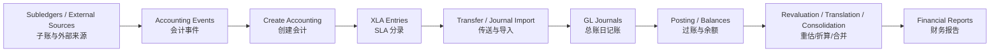
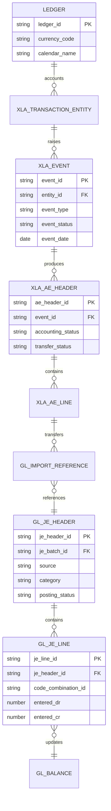
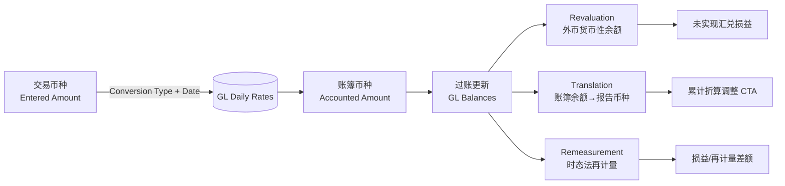
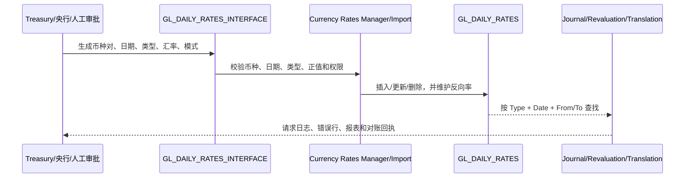
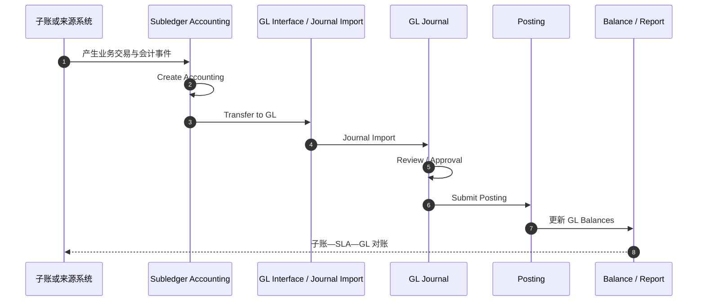
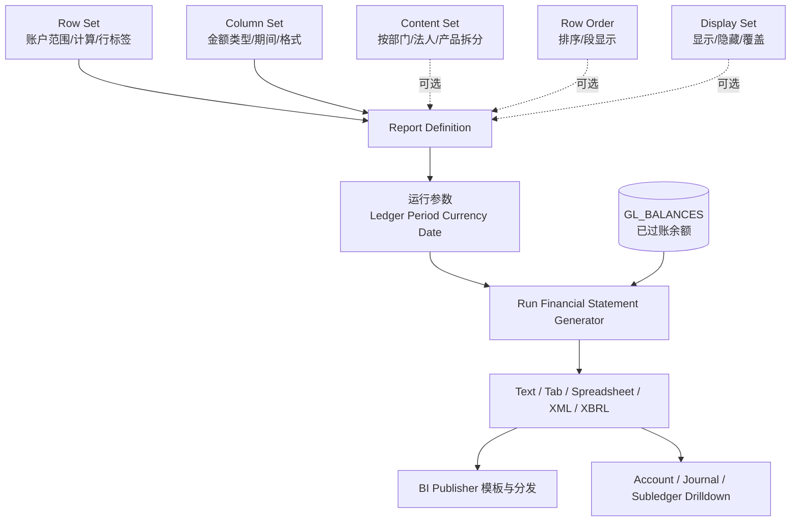

# 记录到报告（Record to Report，R2R）

> R2R 把各子账和外部来源的业务事件转换为可审计总账、余额和财务报告。核心不是“把分录传入 GL”，而是保证来源、会计、过账、余额和报告全链路一致。

## 阅读导航

- [实施配置](#implementation) · [会计链](#2-端到端会计链) · [SLA 定义与流程](#r2r-sla) · [总账设计](#3-总账核心设计) · [月结](#4-月结控制顺序) · [功能视角](#5-功能顾问检查点) · [技术视角](#6-技术顾问检查点) · [差异诊断](#7-高频差异诊断) · [页面与关账实操](#9-资深顾问实操页面会计与关账) · [专题详解](#10-专题详解)
- [模块数据字典与名词解释](data-dictionary.md#dict-02)

## 模块业务架构与核心 ER 图

### R2R 业务架构图



### R2R 核心 ER 图



`XLA_*`、`GL_*` 为常见 R12 对象族；接口或 FAH 来源应通过业务键和 `GL_IMPORT_REFERENCES` 保留来源关系，具体关联列以目标实例验证。

## 1. 学习目标与边界

应能完成 Ledger 与日记账控制设计，理解 SLA、Financials Accounting Hub（财务会计中心，FAH）、Advanced Global Intercompany System（高级全球公司间系统，AGIS）、预算控制、重估、折算、合并和关账，并能从 GL 反向追溯到来源交易。

<a id="implementation"></a>

## 实施配置手册：GL、SLA 与关账控制

以下步骤建立在 [财务公共基础](01-foundation.md#实施配置手册财务公共基础) 已完成的前提上。SLA 规则要先在测试账簿验证，再按受控迁移方式发布；切勿用修改历史 XLA 或 GL 记录来“修正”会计。

| 顺序 | 配置项 | 预置职责 / 导航（功能名） | 关键配置内容 | 验收与产出 |
| --- | --- | --- | --- | --- |
| 1 | Ledger 与会计选项复核 | `Accounting Setup Manager > Accounting Setups / Accounting Options` | 确认 COA、日历、币种、期间控制、SLA 方法、平衡规则和 OU 分配已完成 | 保存账簿配置基线，并在 GL 职责下确认正确 Ledger Profile |
| 2 | 日记账来源和类别 | `GL Super User > Setup > Journals > Sources / Categories` | 为外部导入、手工调整、子账来源定义可审计的 Source/Category；避免复用语义不同的来源 | 形成“来源—类别—审批—AutoPost—保留期”矩阵 |
| 3 | 日记账控制 | `GL Super User > Setup > Journals > Journal Sources`；`... > AutoPost > Define` | 设置导入/过账控制、必要的审批和 AutoPost 规则；规则条件要含 Ledger、Source、Category 等足够维度 | 导入一笔应自动过账和一笔应人工审核的测试日记账 |
| 4 | 期间、汇率与重估 | `GL Super User > Setup > Open/Close`；`Setup > Currencies > Rates > Daily`；`Setup > Currencies > Revaluation` | 维护期间状态；定义汇率类型、每日汇率和重估定义（范围、汇率、未实现损益账户） | 对外币余额运行小范围重估，复核反转日期、损益账户和日记账类别 |
| 5 | SLA 会计方法 | `Subledger Accounting Setup > Accounting Methods Builder`（名称因职责而异） | 仅在复制预置 Application Accounting Definition 后维护：事件类/事件类型、Journal Line Definition、账户规则、描述规则、条件和优先级 | 对每个关键事件生成 Create Accounting 草稿，逐行对照借贷、账户、会计日期与来源 |
| 6 | 转送与导入策略 | 各子账的 `Create Accounting` 请求；`GL Super User > Journal > Import > Run` | 明确每来源是 Final/Transfer、汇总层级、GL 日期、错误处理人和重跑边界；接口来源保留业务唯一键 | 从一笔子账交易下钻到 XLA、GL Import References、GL 日记账和余额 |
| 7 | FSG 与关账报表 | `GL Super User > Reports > Define > Row Set / Column Set / Report`；`Reports > Request` | 先定义 Row Set、Column Set，再定义 Report/Content Set 和运行参数；对行列对象按 Definition Access Set 授权 | 用已过账余额运行报表，复核 PTD/YTD、符号、舍入、排除零值及控制总额 |
| 8 | 预算、承诺与资金控制（如适用） | `GL Super User > Setup > Budgets`；资金控制相关菜单 | 定义预算组织、预算、预算规则和控制级别；不要把测试预算与生产预算混用 | 以足额/超额两笔交易分别验证 funds check、保留和例外审批 |

### SLA 配置发布顺序

`复制预置 AAD → 维护账户/描述规则 → 维护 JLD 与事件分配 → 编译/验证 → 分配至 Subledger Accounting Method → 在账簿选项启用 → 草稿会计测试 → Final/Transfer 测试`。

发布前应固定测试样本：AP 标准发票/付款、AR 发票/收款、FA 折旧、库存事务及手工 GL 分录。每个样本保留来源单据号、事件类型、XLA 分录、GL 批次/凭证和预期借贷矩阵。

## 2. 端到端会计链

```text
来源交易/外部子账
  → Accounting Event（会计事件）
  → Create Accounting（创建会计）
  → XLA 会计分录
  → Transfer to GL（传送总账）
  → Journal Import（日记账导入）
  → Journal/Post（日记账/过账）
  → GL Balances（总账余额）
  → Revaluation/Translation/Consolidation（重估/折算/合并）
  → Financial Reporting（财务报告）
```

诊断时必须指出断点在事件生成、创建会计、传输、导入、过账还是余额/reporting；“未进总账”不是足够的问题描述。

<a id="r2r-sla"></a>
### 2.1 SLA 定义、来源与会计生成流程

#### 2.1.1 SLA 的定义与边界

Subledger Accounting（SLA，子分类账会计）是 EBS 中连接业务子账与总账的会计规则引擎。它不负责录入 AP 发票、AR 发票或库存交易本身，而是读取来源交易产生的会计事件，按账簿适用的会计方法生成可追溯的子分类账分录，再把最终分录传送到 GL。SLA 的核心目标是：

- **同一业务事件可产生不同会计表示**：Secondary Ledger 可采用不同的会计方法、币种、COA 或日历；Reporting Currency 主要提供币种表示，转换级别和时点需单独定义。
- **规则与交易分离**：交易数据保存在产品子账，账户和借贷逻辑由 Accounting Methods Builder（AMB）配置；不通过直接修改基表改变历史会计。
- **可审计可追溯**：从交易实体、事件、SLA 分录头/行到 GL 日记账和余额保留关联键，并支持从 GL 下钻回来源交易。
- **由事件驱动而不是由表驱动**：只有已定义、可处理且满足会计日期/期间条件的 Accounting Event 才能进入 Create Accounting。

本节采用 Oracle EBS R12.2 的 AMB 术语。不要把 R12.2 EBS 的 Application Accounting Definition（AAD）/Journal Lines Definition（JLD）与 Oracle Fusion Cloud 的 Journal Entry Rule Set 直接混称；迁移或对照时必须以目标产品和版本的界面、文档和实例定义为准。

#### 2.1.2 SLA 对象层次

| 层次 | 对象 | 作用 | 典型问题 |
| --- | --- | --- | --- |
| 来源交易 | AP 发票、AR 收款、FA 资产、INV 交易、PO 接收、Projects 成本、外部接口 | 提供业务事实、金额、币种、组织和账户属性 | 交易未完成、来源字段为空、组织/账簿错误 |
| Transaction Entity | 交易实体 | 将产品交易登记为 SLA 可识别的业务对象 | `SOURCE_ID_INT_*` 映射不正确、实体未生成 |
| Accounting Event | 会计事件 | 表示可产生会计的业务动作；由 Event Class/Type 分类 | 事件未创建、事件日期或状态不符合条件 |
| Sources / Accounting Attributes | 来源值和会计属性 | 为条件、账户、描述、币种、日期、主体和业务流提供输入 | 来源未分配到事件类、上下文/金额缺失 |
| Journal Line Type（JLT） | 日记账行类型 | 决定借/贷/损益、会计类别、余额类型、合并和转 GL 行为 | 行类型条件不命中、借贷方向错误 |
| Account Derivation Rule（ADR） | 账户推导规则 | 推导完整 Accounting Flexfield、段或值集 | 映射缺失、优先级/默认规则错误、CCID 无效 |
| Journal Entry Description（JED） | 日记账描述规则 | 生成 SLA 日记账头、行的描述 | 描述缺少业务键或泄露敏感字段 |
| Supporting Reference（SR） | 支持性参考 | 在分录头/行记录可对账、分析的来源属性 | 未分配到所有相关事件，无法按项目/客户对账 |
| Journal Lines Definition（JLD） | 日记账行定义 | 将 JLT、ADR、JED、SR 组合为一套事件级行规则 | 行定义未激活、事件类不匹配 |
| Application Accounting Definition（AAD） | 应用会计定义 | 为应用的 Event Class/Type 分配 JLD、头描述和支持性参考 | 未勾选 Create Accounting、定义未验证 |
| Subledger Accounting Method（SAM） | 子分类账会计方法 | 把多个应用的 AAD 组合成一套会计政策 | 未分配到 Ledger、COA 不兼容 |
| Ledger / Accounting Representation | 账簿/会计表示 | 决定会计 COA、币种、日历和使用的 SAM | 主账簿/二级账簿结果不一致 |

Oracle 官方 AMB 关系是：Source、Event Entity、Event Class/Type 为规则输入；Mapping Set 供 ADR 使用，JLT、ADR、JED 和 Supporting Reference 组成 JLD；JLD 和头部定义组成 AAD；多个 AAD 组成 SAM；SAM 再分配给 Ledger。参见 [Oracle Subledger Accounting Implementation Guide：Accounting Methods Builder](https://docs.oracle.com/cd/E26401_01/doc.122/e48771/T149412T149415.htm)。

#### 2.1.3 从来源交易到 GL 的运行时流程

```text
产品/外部来源交易
  → Transaction Entity（交易实体）
  → Accounting Event（会计事件：Event Class + Event Type）
  → 来源/会计属性装载与校验
  → 选择 AAD（应用会计定义）和 JLD（行定义）
  → JLT 条件判断：是否生成该行、借/贷/损益及行属性
  → ADR/Mapping Set 推导 Accounting Flexfield
  → 计算 Entered/Accounted Amount、汇率、舍入和多期间
  → XLA_AE_HEADERS / XLA_AE_LINES（Draft 或 Final）
  → Transfer Journal Entries to GL / Journal Import
  → GL Journal Batch/Header/Lines（来源、类别、描述、引用）
  → Approval（如启用）→ Posting → GL Balances
  → 子账、SLA、GL、外部回执数量/金额对账
```

每个阶段都要保存上一阶段的主键和下一阶段的状态。`Create Accounting` 成功只说明 SLA 分录生成成功；如果未勾选 Transfer to GL，或传送/Journal Import/Posting 失败，GL 仍可能没有可过账日记账。

#### 2.1.4 会计事件、事件类和事件类型

- **Transaction Entity** 是业务对象的登记容器，例如一张发票、一笔收款或一项资产。它通过产品定义的来源列指向原交易；`SOURCE_ID_INT_1..4` 的业务含义随应用和 Entity Code 变化，不能跨产品硬编码。
- **Event Class** 将具有相同会计模型的一组事件归类，例如 Invoice、Payment、Receipt、Asset Addition、Inventory Issue。JLT 通常先按 Event Class 定义，再在具体 Event Type 上加条件。
- **Event Type** 是可处理的业务动作，例如 Validated、Paid、Adjusted、Received、Transferred。一个交易可能在生命周期内产生多个事件，各事件应按顺序和业务状态处理。
- **事件状态** 至少要区分未处理、处理中、已完成和错误；状态代码在不同应用/补丁中可能不同，应同时输出原始代码和 Lookup Meaning，不把单字符代码直接翻译进程序。
- **会计日期** 决定进入哪个 Ledger 期间；交易日期、事件日期和 GL Date 可能不同，期间关闭、未来可录入和会计日期来源规则都必须在测试中确认。

事件未创建时先查产品交易完成条件和事件生成程序；事件已创建但未会计时查 Event Status、Process Status、会计日期和 Create Accounting 日志；不要直接插入 `XLA_EVENTS` 或修改状态列。

#### 2.1.5 Sources（来源）与 Accounting Attributes（会计属性）

**Source** 是规则可以读取的交易或事件属性，来源可以是产品提供的标准 Source，或在确有必要时由 PL/SQL 函数定义的 Custom Source。来源必须先在对应 Event Class/Entity 上可用，才能被 JLT 条件、ADR、JED、Supporting Reference 或属性分配使用；一个规则引用了事件类不可用的 Source，AAD/JLD 验证会失败。

| 来源类别 | 常见内容 | 典型用途 | 设计控制 |
| --- | --- | --- | --- |
| 交易标识 | 交易号、分配行号、供应商/客户、物料、项目、资产号 | 描述、幂等和 Drilldown | 保留业务主键，不把完整敏感载荷写入描述 |
| 组织与账簿 | Ledger、Legal Entity、OU、Inventory Organization、项目组织 | ADR 条件、MOAC、跨组织隔离 | 明确组织来源和会计 COA，不用页面默认值代替 |
| 原始账户 | 发票分配账户、物料账户、现金账户、税账户、原交易 CCID | 账户推导的 Source 或继承值 | 验证 CCID 有效期、允许过账和 COA |
| 金额与币种 | Entered Amount、Currency、Exchange Rate、Tax Amount | JLT 金额、汇率、舍入和 Gain/Loss | 区分交易币种与账簿币种，保留汇率类型/日期 |
| 事件与状态 | Event Type、Event Date、Accounting Date、状态、Tracking Option | JLT 条件、会计日期和描述 | 按 Lookup 解码，避免把状态文本当稳定接口 |
| 会计属性 | Party、Reconciliation Reference、Reversal Indicator、Multiperiod、Encumbrance Type | 分录头/行特殊处理和对账 | 按 Header/Line 层级分配，缺失必填属性时拒绝会计 |
| Lookup/常量/自定义 | Lookup Code、固定值、客户函数结果 | 条件、Mapping Set 输入、描述或段值 | 常量须有变更控制；Custom Source 控制性能和异常 |

Accounting Attribute 不等同于普通来源列：有些属性会写入 SLA 命名列并参与特殊处理，例如 Entered Currency/Amount；有些属性改变行为，例如 Accounting Reversal Indicator、Multiperiod Option。属性通常在事件类默认，也可以在 JLT 或 AAD 层按支持范围覆盖。

##### 典型产品来源（Source）示例

下表用于设计来源清单，不是跨产品通用的固定字段名。实际 Source 名称、可用事件类和来源应用必须从目标实例的 Accounting Definitions、eTRM 和产品文档确认：

| 产品/事件 | 常见 Source | 账户或规则用途 |
| --- | --- | --- |
| Payables Invoice | Invoice Distribution Account、Supplier Site Liability Account、Tax Code、Invoice Type、PO/Receipt、Project/Task | 费用、资产、税、负债和应计账户；项目/采购维度对账 |
| Payables Payment | Liability Account、Payment Method、Bank Account、Cash Clearing、Currency | 负债结清、现金/银行、汇兑损益和付款方式条件 |
| Receivables Invoice | Receivable Account、Revenue Account、Transaction Type、Customer/Site、Tax Code、Salesperson | 应收、收入、税、客户和销售区域账户 |
| Receivables Receipt | Receipt Method、Bank/Cash Account、Remittance、Customer、Applied Transaction | 现金、汇款/清算、应收核销和未核销收款 |
| Assets | Asset Category、Asset Book、Cost、Depreciation Expense、Reserve、Retirement Type | 资产成本、折旧、累计折旧、处置损益和资产账簿 |
| Inventory/Costing | Item、Inventory Organization、Subinventory、Cost Element、Transaction Type、WIP/Overhead | 库存、发出、接收检查、WIP、制造费用和成本差异 |
| Purchasing/Receiving | PO Charge Account、Accrual Account、Receiving Inspection、Destination Type、Item/Organization | 收货、暂估应计、费用/库存目的地和业务流继承 |
| Projects/FAH/外部来源 | Project/Task、Expenditure Type、Source System、External Key、Event Type、金额/币种 | 项目成本/收入、FAH 事件、外部批次、幂等和跨系统对账 |

Source 名称相似不代表语义相同。例如 `Invoice Distribution Account`、`Supplier Site Liability Account` 和 `Bank Account` 分别属于费用/资产、负债和现金侧；不能因字段都返回 CCID 就互换使用。

#### 2.1.6 AMB 定义顺序与发布控制

推荐按“先验证标准，再最小复制”的顺序实施：

1. **确认 Ledger 与会计政策**：确定 Primary/Secondary Ledger、Accounting COA、币种、日历、会计方法、会计选项和是否使用现金制/权责制；先运行标准定义的 Draft 会计。
2. **盘点事件与来源**：列出应用、Entity、Event Class/Type、可用 Sources、会计日期来源和需要的 Accounting Attributes；缺少来源时先评估是否能使用已有 Source。
3. **定义或复制 JLT**：按 Event Class 定义行类型、Side、Accounting Class、Balance Type、合并/转 GL、Business Flow、Multiperiod、条件和属性。不要直接修改 Oracle Owner 的 seeded JLT。
4. **定义 JED**：分别设计 Journal Header Description 和 Line Description，至少包含业务单号、事件类型或批次；描述内容需脱敏且限制长度。
5. **定义 Mapping Set**：把一个或多个输入 Source 映射为完整账户、段或值集；为未匹配值定义拒绝/默认策略，不把 Suspense 当正常映射。
6. **定义 ADR**：决定输出完整 Accounting Flexfield、单个段或值集，配置 Source/Mapping Set/Constant/ADR 的 Value Type、条件和优先级。
7. **定义 Supporting Reference**：选择项目、客户、资产、外部批次等用于余额分析和对账的 Source，并分配到所有产生该账户的 JLD 行。
8. **定义 JLD**：把 JLT、ADR、JED、Supporting Reference 组合为事件类/类型的完整行集合；确认行类型、账户规则和描述引用的 Source 均可用，并将行分配设为 Active。
9. **定义 AAD**：为事件类/类型分配头描述、JLD 和支持性参考，设置是否 Create Accounting；执行 Validate，只有 Valid 的事件类/类型才可生成分录。
10. **定义并分配 SAM**：把各应用 AAD 组合成共同会计政策，确认 Accounting COA 兼容，再通过 Accounting Setup Manager 分配到 Ledger。
11. **迁移与回归**：使用 AAD Loader/FNDLOAD 或实例认可的配置迁移方式，先 DEV/SIT Draft，再 Final、Transfer、Journal Import、Posting 和 Drilldown；保留版本、Owner、依赖、差异和回退包。

Oracle 建议对 seeded 组件使用 Copy and Modify，而不是直接修改；自定义组件只分配给自定义 JLD/AAD/SAM，并在补丁前执行 Merge Analysis。配置变更不能只导出一张截图，必须同时保存规则定义、输入值、输出账户、验证状态和测试结果。

#### 2.1.7 账户推导规则（ADR）与 Mapping Set

##### 账户推导的三个输出层级

1. **完整 Accounting Flexfield（Flexfield/Account）**：一次返回整套会计组合，适合来源已经带有目标 COA 的场景。
2. **Segment/Qualifier**：只推导一个段或限定段，其余段由其他规则补齐；例如从交易分配账户继承 Balancing Segment 或 Cost Center。
3. **Value Set**：在指定值集内返回值，再由规则构成目标段；适合受控的映射值而非任意字符串。

##### Value Type 与规则优先级

| Value Type | 输入/输出含义 | 典型场景 |
| --- | --- | --- |
| Source | 从交易或事件来源直接取账户/段/值 | 发票分配账户、库存组织、税码 |
| Mapping Set | 按 Source 值查表得到完整账户或段 | OU/法人/产品线映射自然科目或成本中心 |
| Constant | 返回固定账户、段或值集值 | 固定银行现金段、特定汇总账户（须受控） |
| Account Derivation Rule | 复用另一条 ADR 的结果 | 公共账户规则被多个 JLT 复用 |

规则明细按 Priority 升序判断，数字越小优先级越高；满足条件后采用该行，后续行不再评估。建议最后保留一条无条件的默认行，或明确让事件进入 Error；不要无声地落入 Suspense。账户推导时还要注意：

- 规则可以按完整账户或逐段构建；如果同时指定完整 Accounting Flexfield 规则和段规则，段规则可能覆盖对应段，必须在目标 COA 上验证最终组合。
- Mapping Set 的输入值、输出值和 COA 必须版本化；新增 OU、法人、库存组织、项目类型或产品线时同步补充映射并测试未匹配分支。
- 交易 COA 与 Accounting COA 在 Primary Ledger 始终一致；Secondary Ledger 或多重会计表示可能不同，ADR 仍是在目标 Accounting COA 上生成账户，必要时使用 COA Mapping。
- 账户推导结果必须通过 CCID、有效期、Detail Posting Allowed、启用标志和账户权限验证；“能拼出字符串”不等于可过账。
- 规则条件使用的 Source 必须对该 Event Class 可用；跨应用复用 ADR 时，所有依赖 Source 都要在目标事件类上存在。
- 原始账户和替代账户都要保留审计依据；如果替代账户无效，是否允许 Suspense 由产品和 Ledger 配置决定，不能把 Suspense 当账户推导成功。

##### 账户推导示例（教学账户）

假设目标账户结构为 `法人-成本中心-自然科目-产品`，AP 发票费用行要从分配账户继承成本中心，并按物料类别映射自然科目：

| 优先级 | 条件 | 输出类型 | 输出 |
| --- | --- | --- | --- |
| 10 | 物料类别 = `CAPEX` | Mapping Set | `自然科目=160000`，其余段来自来源/继承 |
| 20 | 项目号不为空 | Mapping Set | `自然科目=540100`，成本中心来自项目 |
| 90 | 无条件默认 | Source | 直接使用发票分配 Accounting Flexfield |

如果 `CAPEX` 映射缺失，系统应按项目/默认分支或明确报错，不能随机使用上一行值。实施验收要保存输入 Source、匹配的 Priority、Mapping Set 版本、最终 CCID 和 Journal Line ID。

#### 2.1.8 JLT、会计类型与借贷逻辑

**Journal Line Type（JLT）不是“总账科目”**，而是定义某一事件类下如何生成一类 SLA 行。下表是实施时必须区分的会计类型：

| 概念 | 含义 | 示例 | 与其他概念的区别 |
| --- | --- | --- | --- |
| Event Class/Type | 业务动作分类 | AP Invoice / Validated、AR Receipt / Remitted | 决定处理的业务事件，不直接表示借或贷 |
| Accounting Class | 分录行业务语义 | Expense、Liability、Tax、Revenue、Cash、Accrual | 用于分类、Post-Accounting 和分析，不等同 GL Category |
| Balance Type | 余额类型 | Actual、Budget、Encumbrance | 决定进入实际、预算或承诺余额；普通财务交易通常是 Actual |
| Side | 行方向 | Debit、Credit、Gain/Loss | 由 JLT 指定；Gain/Loss 是汇兑损益专用行为 |
| Accounting Method | 会计政策集合 | Accrual、Cash Basis 或客户定义方法 | 由 SAM 汇总 AAD 后分配给 Ledger |
| Business Flow Method | 关联交易继承方式 | None、Prior Entry、Same Entry | 解决收货—发票—付款等关联交易的账户/属性继承 |
| Multiperiod | 多期间处理 | None、Accrual、Recognition | 决定递延/确认分录及 GL 日期 |
| Transfer Level | 传送粒度 | Detail、Summary | 决定 GL 保留明细还是按 Accounting Flexfield 汇总 |
| Journal Source/Category | GL 日记账元数据 | Payables、Receivables、Manual；业务类别 | 由 GL 识别来源/类别，不是 ADR 或 Accounting Class |

JLT 还可以定义 Rounding Class、Merge Matching Lines、条件、Accounting Attribute Assignment、Gain/Loss 是否在主账簿计算和是否允许多期间。配置前先用标准 JLT 观察结果，再针对明确需求复制并修改。

**借贷生成规则**：

- `Side = Debit` 时，金额通常进入 `ENTERED_DR/ACCOUNTED_DR`；`Side = Credit` 时进入对应 `CR` 列。一个 SLA 行通常只填一侧，但最终每个会计事件/账簿的借贷必须平衡。
- `ENTERED_DR/CR` 是交易币种金额，`ACCOUNTED_DR/CR` 是账簿币种金额；不能用交易币种金额直接与 GL 账簿金额比较。
- `Side = Gain/Loss` 由 SLA 根据相关交易汇率差计算；损失通常生成借方，收益通常生成贷方，实际账户由 Gain/Loss ADR 和配置决定，不应手工把普通行改成负数。
- 负数、冲销和反向交易应由产品事件、Reversal Indicator 或标准 API 处理；不要通过交换 DR/CR 列或直接更新 XLA/GL 表“修正方向”。
- 余额类型为 Budget/Encumbrance 时，需确认产品是否启用预算/承诺会计以及对应的 Encumbrance Type；不能把预算行当作 Actual 交易。

##### 常见业务分录示意

以下金额和科目仅为教学示意，最终账户、税、折扣、汇兑和自动平衡以产品规则及目标实例为准：

| 业务事件 | Accounting Class / JLT | 借方 | 贷方 | 说明 |
| --- | --- | ---: | ---: | --- |
| AP 发票验证 | Expense | 费用 100 | — | ADR 通常来自发票分配、项目和物料规则 |
| AP 发票验证 | Tax | 税 13 | — | Tax Source/Mapping Set 决定税账户和舍入 |
| AP 发票验证 | Liability | — | 供应商负债 113 | 可按供应商站点、法人或业务流继承段值 |
| AP 付款 | Liability | 供应商负债 113 | — | 结清发票负债 |
| AP 付款 | Cash / Bank | — | 银行现金 113 | 银行账户和现金结算规则参与推导 |
| AR 发票 | Receivable | 应收 113 | — | 客户账户/交易类型提供来源 |
| AR 发票 | Revenue / Tax | — | 收入 100；税 13 | 收入账户按物料、交易类型或销售区域推导 |
| AR 收款 | Cash | 现金/银行 113 | — | 收款方式和银行账户决定现金账户 |
| AR 收款 | Receivable | — | 应收 113 | 应用/核销事件清理客户余额 |

业务案例不能只看借贷是否平衡，还要确认每一行的 Event Type、Accounting Class、ADR 命中规则、币种、组织、Supporting Reference、来源键和最终会计状态。

#### 2.1.9 Business Flow、继承与多期间

- **None**：当前事件独立推导账户和属性。
- **Same Entry**：同一会计事件内，某一行可以从另一侧继承指定 Accounting Attribute 或段值。例如 AP 发票负债行继承费用行的 Cost Center 等指定段，避免收货/发票分配的对应段不一致。
- **Prior Entry**：从同一 Business Flow Class 的上游会计事件继承账户或属性。例如付款继承发票的负债/主体信息，或发票反转收货应计分录。

Business Flow 的 `Applied-to` 属性、Flow Class、继承的币种/汇率/主体和段值必须在关联交易的正向、反向、部分应用和取消场景验证。不要把 Same Entry/Prior Entry 当作简单复制整套账户；继承哪些属性由 JLT、JLD 和 Accounting Attribute Assignment 决定。

多期间会计至少定义：起始日、结束日、期间数、每期间或一次性确认、GL Date 规则、Accrual/Recognition 行类型、舍入和中断恢复。Originating Entry 与 Recognition Entry 必须分别对账，期间关闭时使用标准 Complete Multiperiod Accounting/反转程序，不直接改历史 SLA 行。

#### 2.1.10 日记账头、行和其他定义

SLA 生成的是子分类账日记账；传送到 GL 后还会形成 GL Batch/Header/Lines。以下定义必须分层管理：

| 定义 | 所属层 | 主要字段/控制 | 实施要点 |
| --- | --- | --- | --- |
| Journal Entry Description | SLA | Header/Line Description、Source、常量 | 用业务单号/事件/批次，脱敏并限制长度 |
| Supporting Reference | SLA | Reference 类型、Source、余额维度 | 用于项目、客户、资产、外部批次对账；需覆盖所有相关 JLT |
| Accounting Class | SLA | 行分类和 Post-Accounting 选择 | 是语义标签，不代替科目或 GL Category |
| Post-Accounting Program | SLA/产品后处理 | Accounting Class assignments、Ledger | 为资产 Mass Additions 等后续处理筛选分录行 |
| Entered/Accounted Amount | SLA | 交易币种/账簿币种借贷金额 | 保留汇率类型、日期、舍入和交易币种 |
| Accounting Date / Reversal Date | SLA | 事件/会计/冲销日期来源 | 受期间状态和会计属性影响 |
| Transfer Level | SLA→GL | Detail 或 Summary | Summary 降低 GL 行数，但可能减少直接下钻粒度 |
| GL Journal Source | GL | `JE_SOURCE` / 用户来源名 | 标识来源系统，如 Payables、Receivables 或自定义来源 |
| GL Journal Category | GL | `JE_CATEGORY` / 用户类别名 | 标识业务性质，如 Purchase Invoices、Payments、Manual |
| Batch/Header/Line | GL | 批名、日记账名、行号、描述、Reference | 用于审批、过账、审计和 Drilldown |
| Document Sequence | GL/产品 | 序列类别、编号、日期 | 法规或内部凭证编号，不能用批次名代替 |
| Journal Approval | GL | 审批规则、状态、审批人、时间 | 与录入人、过账人职责分离 |
| AutoPost | GL | 来源/类别/批次自动过账条件 | 自动化也要保留请求、规则和异常证据 |
| Suspense / Intercompany Balancing | GL | 暂记账户、平衡段和公司间规则 | 只作为配置的例外机制；要能追溯和清理 |

**Journal Source/Category 与 SLA 的关系**：SLA 的 Event Class、JLT、Accounting Class 决定“为什么生成哪一行”；GL Source、Category、Batch 和 Approval 决定“以什么总账元数据接收、审批和过账”。二者都出现在审计报表中，但不能互相替代。配置自定义来源/类别时要确认 Journal Import、自动过账、审批、报表和下钻设置。

#### 2.1.11 Create Accounting、Transfer 和 Posting 参数

Oracle R12.2 的 Create Accounting 程序使用 AAD/SAM 处理符合条件的事件。常用参数及边界如下：

| 参数 | 作用 | 关键边界 |
| --- | --- | --- |
| Ledger | 限定处理的账簿 | 受职责、Data Access Set 和子账数据安全限制 |
| Process Category | 按事件类/类型缩小范围 | 只选择实例已定义的处理类别 |
| End Date | 处理事件日期截止点 | 不能代替会计日期/期间检查 |
| Mode | Draft 或 Final | Draft 可检查规则但不可传 GL；Final 分录不可随意修改 |
| Errors Only | 仅重处理先前错误事件 | 先确认错误已分类和修复，避免无条件重复 |
| Report | Summary 或 Detail | Detail 用于逐事件/逐行验证和问题复盘 |
| Transfer to General Ledger | 是否传送 Final SLA 到 GL | No 时需运行 Transfer Journal Entries to GL |
| Post in General Ledger | 传送后是否提交 GL Posting | 是否可用受权限、子账和配置影响 |
| General Ledger Batch Name | 传送后 GL 批名 | 用外部批次/请求 ID 形成可追踪命名 |
| Include User Transaction Identifiers | 报告是否包含用户交易标识 | 需防止输出敏感字段并按权限保留 |

Create Accounting 的正确判断顺序是：先看事件选择范围和错误数，再看 AAD/JLD 验证、账户推导、SLA 行、Transfer 状态、Journal Import、Posting 和最终余额。Final SLA 已生成但未传 GL 时，应运行 Transfer Journal Entries to GL；再次运行 Create Accounting 不一定会重新拾取已经 Final 的事件。参见 [Create Accounting and Transfer Journal Entries to GL Programs](https://docs.oracle.com/cd/E26401_01/doc.122/e48771/T149412T283033.htm)。

#### 2.1.12 SLA 结果追溯与对账证据

| 断点 | 必须记录的证据 | 结论示例 |
| --- | --- | --- |
| 来源→事件 | 业务主键、Entity Code、Event ID、事件日期、状态 | 交易已完成但事件未生成 |
| 事件→SLA | Create Accounting Request ID、AAD/JLD 版本、错误消息、AE Header/Line | 规则未命中或 CCID 无效 |
| SLA→GL | `AE_HEADER_ID`、`GL_TRANSFER_STATUS_CODE`、Transfer Request ID、批名 | Final SLA 未传送或 Journal Import 失败 |
| GL→余额 | `JE_HEADER_ID`、`JE_LINE_NUM`、Posting Request ID、期间、币种 | 日记账未过账或期间/币种错误 |
| GL→来源 | `GL_IMPORT_REFERENCES`、`GL_SL_LINK_ID/TABLE`、Source/Category、业务键 | 下钻引用缺失或传送汇总丢失粒度 |
| 业务→外部 | 外部批次/回执、数量/金额控制总额、ACK 时间 | EBS 成功但外部 ACK 丢失，需按幂等键补发 |

最低对账断言：在预先定义的粒度上，来源交易、会计事件、Final SLA、已传 GL 和已过账 GL 的数量与金额差异都可解释；允许的舍入、汇兑、税差、冲销、汇总以及部分成功必须单列并经批准。只比较借贷净额可能掩盖账户、组织、币种、项目或客户维度错误。

#### 2.1.13 SLA 实施案例：AP 发票验证

**场景**：一张外币 AP 发票含费用 100、税 13，费用分配来自项目，供应商站点定义负债账户；发票验证后要产生 SLA，再传送并过账到 GL。

1. AP 完成发票校验，产品生成 Invoice Entity 和 Validated Event；确认 Ledger、ORG、会计日期和期间可用。
2. AAD 为该 Event Class/Type 选择 Invoice JLD；JLD 激活 Expense、Tax、Liability 三个 JLT。
3. Expense JLT 的 ADR 先读取分配/项目来源，Tax JLT 读取税行来源；Liability JLT 读取供应商站点负债账户，并按 Business Flow/继承规则补齐平衡段。
4. JLT 计算交易币种 Entered Amount 和账簿币种 Accounted Amount；根据汇率类型、日期、舍入和税规则形成借贷行。
5. Draft Create Accounting 检查：三类 JLT 是否都命中、总借贷是否平衡、CCID 是否有效、税/项目 Supporting Reference 是否写入。
6. 修复错误后运行 Final Create Accounting，保存 `AE_HEADER_ID/AE_LINE_NUM` 和详细报告；Transfer to GL 后保存 `GL_IMPORT_REFERENCES`、Journal Import Request ID 和批名。
7. 经过审批（如启用）后 Posting，查询 GL 余额并从 GL 下钻回 AP 发票；对账金额、币种、税、项目和供应商维度。

| SLA 行 | 教学借贷 | 账户来源 | 关键验收 |
| --- | --- | --- | --- |
| Expense | DR 100 | 项目/发票分配 ADR | 项目号、成本中心、自然科目和 CCID |
| Tax | DR 13 | 税行 ADR/Mapping Set | 税码、税账户和舍入 |
| Liability | CR 113 | 供应商站点 ADR + Business Flow | 供应商、法人/平衡段、负债账户 |

若出现“AP 发票已验证但 GL 无金额”，按事件存在性 → AAD/JLD Valid → ADR/CCID → Final 状态 → Transfer → Journal Import → Approval/Posting 顺序定位；不要直接插入 GL 行。

#### 2.1.14 SLA 配置自审清单

- [ ] Ledger、Accounting COA、币种、日历、SAM 和应用会计选项已核对。
- [ ] 每个目标 Event Class/Type 的来源、事件日期、会计属性和会计前置条件有清单。
- [ ] JLT 的 Side、Accounting Class、Balance Type、Rounding、Merge、Business Flow、Multiperiod 和 Transfer Level 有设计说明。
- [ ] JED 头/行描述、Supporting Reference、敏感字段和 Drilldown 需求经过审查。
- [ ] Mapping Set、ADR 的输入、输出、COA、优先级、默认/拒绝分支和 CCID 校验有测试。
- [ ] JLD、AAD 已激活并 Validate 为 Valid；自定义组件没有直接修改 Oracle Owner 的 seeded 定义。
- [ ] Draft/Final、Errors Only、Transfer、Post、Journal Import、Approval 和 Posting 均有 Request ID/输出证据。
- [ ] AP/AR/FA/INV/PO/Projects/外部接口至少各有一个正向、错误、重复、冲销、外币和期间边界案例。
- [ ] 来源→事件→SLA→GL→余额的数量/金额/维度对账通过，失败和补偿路径有负责人。

本节的规则层次、来源可用性、JLT 借贷/余额类型、ADR 优先级、Supporting Reference、AAD 验证和 Create Accounting 参数均以 [Oracle Subledger Accounting Implementation Guide](https://docs.oracle.com/cd/E26401_01/doc.122/e48771/) 为 R12.2 基线；实际字段、事件名称、可用 Source、产品 API 和状态值仍需用目标实例 eTRM、Integration Repository 和测试请求确认。

## 3. 总账核心设计

### 3.1 日记账治理

Journal Source（日记账来源）标识系统来源，Journal Category（日记账类别）标识业务性质。为每类来源定义是否允许手工录入、是否需要审批、是否自动过账、冲销规则和对账责任。手工日记账不得作为修复子账的默认方法。

### 3.2 多币种处理

EBS 的多币种设计必须先把“交易币种、账簿币种、报告币种、输入汇率和余额再计量”分开。Conversion、Revaluation、Translation 和 Remeasurement 的对象、时点、汇率来源及损益位置均不同，不能用一个“当前汇率”解释所有结果。



#### 3.2.1 币种层次与金额列

| 层次 | 典型字段/对象 | 计算或维护方式 | 不能混淆的点 |
| --- | --- | --- | --- |
| Transaction/Entered Currency（交易币种） | Journal `CURRENCY_CODE`、`ENTERED_DR/CR` | 来源单据或日记账输入的原始币种金额 | 不是账簿报表的本位金额；同一日记账行只应有明确的交易币种 |
| Ledger/Accounted Currency（账簿币种） | Ledger `CURRENCY_CODE`、`ACCOUNTED_DR/CR`、标准余额 | 交易金额乘以选定日汇率并按精度舍入 | GL 过账和余额控制以账簿币种为主；不能拿外币 entered 金额直接和 `GL_BALANCES` 比较 |
| Reporting Currency（报告币种） | Journal/Balance-level Reporting Currency | 可在日记账级、子账级或余额级转换 | 主要解决报告币种，不自动代表另一套会计政策；转换层级和延迟要单独定义 |
| Secondary Ledger（次级账簿） | 独立 Ledger、COA、Calendar、Currency、SLA Method | 按另一套会计表示生成或转换 | 用于准则、COA、日历或核算差异；不只是“把金额换成另一币种” |
| Statistical Currency（统计币种） | FSG/余额的统计量 | 记录数量、人数、面积等非货币统计量 | 不能套用货币汇率；FSG 的默认 Currency 不能设为 `STAT` |

#### 3.2.2 日汇率的主键、方向与公式

`GL_DAILY_RATES` 的业务唯一维度应按“From Currency + To Currency + Conversion Date + Conversion Type”理解。相同币种对、同一天需要维护两套不同口径时，必须使用不同的 Conversion Rate Type；不要覆盖同一类型的历史值来表达不同业务口径。

日汇率在一个 EBS 实例内由 General Ledger 统一维护，通常不按 Ledger 单独存一份；同一 From/To、日期和 Type 会被多个账簿、报告币种及重估/折算流程共享。因此，汇率发布和 Definition Access Set 控制必须从“实例级公共主数据”而不是单个 OU 的局部参数来设计。

```text
To Amount = From Amount × CONVERSION_RATE
Inverse Rate = 1 ÷ CONVERSION_RATE（Daily Rates 会生成对应反向行；Profile 决定是否强制两边始终互为倒数）
Accounted Amount = Entered Amount × Retrieved Rate，随后按币种精度/最小记账单位舍入
```

示例：EUR→CNY 的汇率为 `7.8000`，外币发票 10,000 EUR，则账簿金额为 78,000 CNY；反向汇率约为 `0.128205` CNY→EUR。若同一日期同时有 Spot `7.80` 和 Corporate `7.75`，两者都可能正确，关键是来源交易、Ledger 选项或报表流程指定了哪一个类型。

#### 3.2.3 Conversion Rate Type 的区别

Oracle General Ledger 预置 Spot、Corporate、User；EMU Fixed 仅适用于欧元与 EMU 固定汇率关系，企业还可以定义自有类型。名称本身不决定用途，必须在 Ledger、子账选项、Revaluation、Translation 和接口规范中明确责任人与使用场景。

| 类型 | 业务含义 | 日汇率维护 | 典型使用 | 控制重点 |
| --- | --- | --- | --- | --- |
| **Spot** | 指定日期的市场即期报价 | 在 Daily Rates/Currency Rates Manager 或接口维护 | 交易日换算、即时外币日记账 | 明确报价时间、来源、买入/卖出方向和生效日期 |
| **Corporate** | 公司统一采用的标准市场/管理汇率 | 按公司汇率日历每日或按日期区间维护 | AP/AR/GL 默认交易换算、跨部门统一口径 | 汇率发布人、审批、生效范围；不能与 Spot 误当成同一数值 |
| **User** | 录入人在单据/日记账上直接指定的汇率 | 不在 Daily Rates 窗口维护；在 Enter Journals 或产品页面输入 | 合同固定价、特殊交易、历史补录 | 权限、理由、附件和异常阈值；同一批次可能出现不同用户汇率 |
| **EMU Fixed** | 欧元与关联 EMU 币种的法定固定转换因子 | 由固定关系决定，不能按市场汇率修改 | 欧元/EMU 过渡或固定关系转换 | 仅在满足固定关系时使用，不能作为一般 EUR 汇率 |
| **Period Average（常用自定义类型）** | 某期间平均口径 | 通常为期间每天或期末代表日维护 | Translation 的收入/费用、预算平均口径 | 先定义统计口径和天数权重；不是把某一天 Spot 直接命名为 Average |
| **Period End（常用自定义类型）** | 期末资产负债表日口径 | 通常维护期间最后一天汇率 | Translation 的资产/负债、期末余额 | 期末日期缺失时按实例规则回溯；补率后需重新折算 |
| **Historical（历史汇率/金额）** | 特定科目历史取得日或历史金额 | 在 Historical Rates 中按 Ledger、期间、科目维护 | 权益、非货币性项目、时态法再计量 | 可覆盖 Period End/Average；必须有准则依据和变更审批 |
| **客户自定义类型** | Treasury、Regulatory、Tax、Budget 等专用口径 | 由汇率接口或受控页面维护 | 监管报告、税务、预算、集团管理报表 | 不能只靠名称猜用途；需写入接口契约、数据字典和报表定义 |

> `Period Average`、`Period End` 在 R12.2 中可以是企业自定义的 Conversion Rate Type；它们是“使用场景/口径”，不是所有实例都同名预置的固定代码。Ledger 创建时要指定期末和期间平均汇率类型，报告/翻译运行时可再按预算等场景覆盖。

#### 3.2.4 各业务过程如何选择汇率

| 过程 | 输入 | 汇率选择 | 结果/凭证 | 主要检查 |
| --- | --- | --- | --- | --- |
| 外币日记账/子账交易 | Currency、Conversion Type、Conversion Date | User 直接取行上汇率；其他类型按日汇率查找 | 生成 Entered 与 Accounted 借贷金额 | 日期、类型、方向、精度、期间及缺率报错 |
| Reporting Currency/次级账簿日记账级转换 | 来源 Journal 的 entered/accounted 金额 | 按目标 Reporting Currency/Secondary Ledger 的转换配置和转换日期换算 | 生成报告币种/次级账簿日记账 | 传送级别、原始请求、汇率来源及四舍五入 |
| Revaluation | 外币货币性账户余额、Rate Date | Revaluation 定义的类型/日期；可按 Profile Option 回溯近期日汇率 | 生成未实现 Gain/Loss 日记账，需再过账 | 账户范围、币种、Effective Date、Rate Date、损益账户、重复运行 |
| Translation（权益法） | 已过账 Ledger 余额 | 通常资产负债用 Period End，收入费用用 Period Average，权益用 Historical | 更新报告币种余额，差额进 CTA | 顺序期间、CTA、历史汇率、期间末缺率、Data Access Set |
| Remeasurement（时态法） | 已过账 Ledger 余额 | 货币性项目期末、非货币性项目历史，收入费用按相关项目 | 再计量差额通常进损益 | 功能币种判断、非货币性历史基础、损益账户 |
| FSG 外币报告 | Row/Column Set、Ledger/Reporting Currency、Period | 读取已存在的 Ledger/Reporting Currency 余额；FSG 不替代汇率维护 | 按 Row/Column/Content Set 输出余额 | 报表币种、Amount Type、Period Offset、账户安全 |

Oracle 的基本规则是：Conversion 在交易录入时立即把外币金额换为 Ledger Currency；Revaluation 调整汇率变动导致的外币资产/负债账面差异；Translation 把整套账簿余额重述到另一币种；Remeasurement 对非货币性项目使用历史汇率。参见 [Oracle General Ledger User's Guide：Multi-Currency](https://docs.oracle.com/cd/E26401_01/doc.122/e48748/T312864T314328.htm)。

#### 3.2.5 Period End、Period Average、Historical 的实际差异

| 账户/场景 | 常见汇率口径 | 计算示意 | 原因与例外 |
| --- | --- | --- | --- |
| 货币性资产/负债 | Period End | 期末外币余额 × 期末汇率 | 反映报告日现时价值；Revaluation 另行生成未实现损益 |
| 收入/费用（权益法翻译） | Period Average + PTD/YTD 规则 | PTD 余额 × 平均汇率，或 YTD 期末汇率与期初折算余额的差额 | 具体 PTD/YTD 由账户类型和 Ledger/Profile 规则决定 |
| 权益/投入资本/留存收益 | Historical 或系统衍生历史类型 | 历史金额/取得日汇率 | 历史汇率/金额会覆盖 Period End/Average；留存收益可能产生 Prior/Calculated 类型 |
| 非货币性资产/负债（时态法） | Historical | 历史取得日汇率 × 外币余额 | 需按 IAS 21/SFAS 52 或本地准则确认适用范围 |
| 预算余额 | Translation 参数指定的 Period End/Average | 预算金额按报表运行时指定口径折算 | 预算汇率可在 Translation 运行参数中覆盖默认值 |
| 缺失期末日汇率 | 实例配置允许时，在本期间内向前回溯 | 取期间最后一个可用日汇率 | 不是跨期间无限回溯；若整个期间没有可用率应报错 |

例：本月收入 1,000,000 EUR，期间平均汇率 7.85，则 PTD 翻译值约 7,850,000 CNY；期末应收 500,000 EUR，期末汇率 7.95，则余额翻译值约 3,975,000 CNY；权益历史汇率 7.20，则不应因为本月 7.95 而自动改写历史投入资本的翻译基础。以上数值仅为教学示意，生产规则以会计政策和实例配置为准。

#### 3.2.6 日汇率维护与接口流程



推荐操作顺序：

1. 在 Currencies 窗口启用币种，确认 Precision、Extended Precision、Minimum Accountable Unit 和有效日期。
2. 在 Conversion Rate Types 窗口定义或查询类型；需要同一日期多个口径时新增类型，不复制覆盖原类型。
3. 通过 Daily Rates、Currency Rates Manager、受控电子表格或 `GL_DAILY_RATES_INTERFACE` 维护汇率；不要直接更新 `GL_DAILY_RATES`。
4. 校验 From/To 方向、汇率正数、日期覆盖期间、反向汇率和 Rate Type 的 Definition Access Set 权限。
5. 在 Accounting Setup Manager 指定 Ledger 的 Period End/Period Average 类型；为 Translation/Reporting Currency 明确历史汇率和 CTA 账户。
6. 先在测试账簿用一笔外币日记账验证换算，再执行 Revaluation/Translation；已运行翻译后变更期间平均/期末汇率，必须按标准程序重新翻译。
7. 保存每日汇率来源文件、审批单、接口批次、错误报告、导入请求 ID 和最终查询结果。

```sql
-- 查指定币种方向、日期和类型的汇率；反向关系是 From/To 交换后的另一行
SELECT from_currency, to_currency, conversion_date,
       conversion_type, conversion_rate
  FROM gl_daily_rates
 WHERE from_currency = :p_from_currency
   AND to_currency = :p_to_currency
   AND conversion_date BETWEEN :p_from_date AND :p_to_date
   AND conversion_type = :p_conversion_type
 ORDER BY conversion_date;

-- 查询日汇率接口的错误和未处理行；具体状态/模式以实例版本为准
SELECT from_currency, to_currency, from_conversion_date,
       to_conversion_date, user_conversion_type,
       conversion_rate, mode_flag, error_code
  FROM gl_daily_rates_interface
 WHERE error_code IS NOT NULL
    OR mode_flag IN ('I', 'D', 'X');
```

`GL_DAILY_RATES_INTERFACE` 中 `MODE_FLAG='I'` 表示插入；如果相同币种对、日期和类型已存在，Oracle 会按新汇率更新该行；`MODE_FLAG='D'` 删除匹配行及其反向行。校验失败的行会保留在接口表并把模式改为 `X`、填充 `ERROR_CODE`，不能在原行上直接重处理，应先删除错误行并以新行修正。日期范围不能超过 366 天；批量导入时只在一行设置 `LAUNCH_RATE_CHANGE='Y'`，避免重复启动汇率变更程序。

#### 3.2.7 多币种实施案例与控制断言

**案例 A：外币 AP 发票**：发票 10,000 EUR，交易日期 2026-08-10，Ledger Currency 为 CNY。若类型为 Corporate、日期为 2026-08-10，系统读取当天 Corporate 7.75，账簿金额为 77,500 CNY；若改为 User 7.80，必须有用户输入和业务理由，不能仅因“希望与 Spot 一致”直接替换。

**案例 B：期末重估**：期初 100,000 EUR 应收按 7.80 记录，期末重估汇率 7.95，理论未实现差额为 15,000 CNY。系统按 Revaluation Definition 的账户范围和损益账户生成标准日记账；若启用 AutoPost，仍要保留 Revaluation Execution Report 和 Posting Request ID。

**案例 C：报告折算**：收入费用使用期间平均口径，资产负债使用期末口径，权益使用历史口径；三者的差额由 CTA/翻译规则平衡。不能用“把所有余额乘同一个 Spot”替代 Translation。

最低控制断言：

- 每一笔外币交易都能回答“使用哪种 Type、哪一天、哪一方向、哪条汇率、谁审批”。
- `ENTERED_DR/CR` 与 `ACCOUNTED_DR/CR` 的差异可由汇率、精度、舍入或汇兑规则解释。
- 期间平均/期末类型与 Ledger 配置一致；Historical 账户覆盖关系有清单。
- 汇率补录后，受影响的 Journal、Revaluation、Translation、Reporting Currency 和 FSG 报表均有重跑/重对账记录。
- 同一报表不能混用 Ledger Currency、Reporting Currency、Entered Currency 而不在标题和参数中明确标识。

### 3.3 二级账簿和报告币种

| 需求 | 优先考虑 | 设计说明 |
| --- | --- | --- |
| 同一会计政策，仅需另一币种报表 | Reporting Currency | 选择日记账级、子账级或余额级转换；定义 Reporting Conversion Type、初始余额和延迟容忍度 |
| 不同会计准则、COA、日历或会计方法 | Secondary Ledger | 可分配不同 SAM、COA、Calendar、Currency；测试事件级关联和两套余额对账 |
| 需要外部集团合并 | Translation/Consolidation 或 Secondary Ledger | 先确定母子账簿关系、COA Mapping、历史汇率、CTA、增量/全量传输和抵销责任 |

```text
Primary Ledger（主会计表示）
  ├─ Reporting Currency：以既定转换规则复制/转换金额，重点是报告币种
  └─ Secondary Ledger：以另一套 Ledger + SLA Method 生成会计表示，重点是准则/COA/日历差异
```

配置和验收至少要列出：源 Ledger、目标 Ledger/Reporting Currency、Conversion Level（Journal/Subledger/Balance）、汇率类型和日期、是否保留原始汇率、初始余额、CTA/汇兑账户、事件/日记账关联键、对账截止时间以及失败补偿路径。Reporting Currency 不是“自动同步的另一张总账”，Secondary Ledger 也不是简单的汇率换算表。

## 4. 月结控制顺序

1. 冻结接口批次并确认所有来源系统完成交付。
2. 完成各子账验证、会计、传输和子账对账。
3. 清理 GL Interface 和未过账/错误日记账。
4. 完成跨公司、分摊、重估、折算和必要的合并抵销。
5. 对账子账余额、GL 账户、银行/库存/资产等控制账户。
6. 审阅试算平衡、异常波动和手工分录。
7. 关闭子账期间后关闭 GL；保留签核和例外批准证据。

## 5. 功能顾问检查点

- Ledger、期间状态、Journal Source/Category、序列和审批。
- Accounting Method、Application Accounting Definition 和账户派生规则。
- 自动过账、经常性日记账、分摊、预算控制和余额控制。
- 重估、折算、合并、AGIS 与 FAH 的适用边界。
- 关账日历、责任矩阵、关键报表和差异阈值。

## 6. 技术顾问检查点

关键对象通常包括 `GL_JE_BATCHES`、`GL_JE_HEADERS`、`GL_JE_LINES`、`GL_IMPORT_REFERENCES`、`GL_BALANCES`、`XLA_TRANSACTION_ENTITIES`、`XLA_EVENTS`、`XLA_AE_HEADERS` 和 `XLA_AE_LINES`。先用实例数据字典确认列和关联，再以 Ledger、期间、来源、业务键和请求 ID 限定查询。

接口设计至少保存：来源系统、业务唯一键、批次/行号、Ledger、会计日期、币种、借贷控制总额、状态、错误信息和重跑标识。Journal Import 成功不等于 Posting 成功，也不等于来源系统完成对账。

## 7. 高频差异诊断

| 现象 | 优先检查 | 不应采用的处理 |
| --- | --- | --- |
| 子账有交易、XLA 无分录 | 事件状态、会计日期、Create Accounting 日志 | 直接补 GL 分录 |
| XLA 已完成、GL 无日记账 | 传输标志、GL Interface、Journal Import 请求 | 反复无条件重跑 |
| 日记账已过账、余额不符 | Ledger/期间/币种、实际与统计余额、账户组合 | 修改历史基表 |
| 重估差异 | 账户范围、汇率、余额币种、冲销 | 把折算和重估混为一谈 |
| 合并不平 | 映射、转换、抵销、期间和公司间差异 | 仅看合并后净额 |

## 8. 建议练习

- 从一笔 AP 发票双向追溯到 GL，并识别所有状态断点。
- 为外币应收设计交易换算、期末重估和报告折算案例。
- 制作一个包含子账完成、接口清理、重估、合并和签核的月结运行表。

## 9. 资深顾问实操：页面、会计与关账

### 9.1 日记账生命周期时序图



任一步失败都要保留上一层成功主键和下一层缺失证据。资深顾问应能回答：事件是否存在、是否 Final Accounted、是否已传 GL、Journal Import 是否生成日记账、日记账是否批准和过账、余额是否进入正确期间与币种。

### 9.2 页面剧本：录入并过账手工日记账

**常见职责与导航**：`General Ledger Super User → Journals（日记账） → Enter（录入）`。

**前置检查**：Ledger/Data Access Set、期间状态、Journal Source/Category、币种与汇率、账户组合、审批和单据序列。

1. 在 Find Journals 或 Enter Journals 窗口新建 Batch（批），填写可追溯的批名、期间和说明。
2. 新建 Journal Header（头），确认 Ledger、Category、Currency、Accounting Date 和 Conversion 信息。
3. 录入 Journal Lines（行）：账户、借/贷金额、说明和必要 DFF；总借方必须等于总贷方。
4. 若启用 Budgetary Control（预算控制），执行 Check Funds/Reserve Funds，并查看失败账户和金额。
5. 保存后执行 Journal Approval（如启用）；不得由录入人绕过审批直接过账。
6. 在 `Journals → Post` 查询批次，复核期间、总额和审批状态后提交 Posting。
7. 在请求窗口记录 Posting Request ID，确认批状态为 Posted；使用 Account Inquiry 或报表验证余额。

**审计证据**：业务批准、批/日记账名称、来源与类别、附件、审批历史、Posting 请求 ID、过账日期和余额验证。

### 9.3 页面剧本：打开或关闭 GL 期间

**常见职责与导航**：`General Ledger Super User → Setup → Open/Close（打开/关闭期间）`。

1. 查询目标 Ledger 与期间，确认状态是 Never Opened、Future Entry、Open、Closed 或 Permanently Closed。
2. 开期前确认上一期间状态和未来可录入期间配置；关闭前确认所有子账已签核。
3. 清理未过账批、Suspense（暂记）和 Import Error；核对接口与 Create Accounting 请求。
4. 完成重估、折算、分摊、公司间和必要的调整日记账。
5. 运行 Trial Balance、Account Analysis 和关键控制账户对账，记录参数和输出。
6. 由授权角色把期间改为 Closed；Permanently Closed（永久关闭）应作为独立高风险操作审批。
7. 验证下一期间、报表和接口日期，并保存关账签核。

### 9.4 页面剧本：从 GL 反查子账

1. 在 `Journals → Inquiry → Journal` 按 Ledger、期间、Source、Batch 或 Document Number 查询。
2. 打开 Journal Lines，查看 Reference、Description、GL Import References 或 Drilldown（下钻）入口。
3. 下钻到 SLA Journal Entry，核对 Event Class、Event Type、Accounting Class、Entered/Accounted Amount。
4. 继续进入来源交易页面；记录交易头、分配行和会计事件主键。
5. 若无法下钻，确认来源是否导入了 Reference、Summary/Detail Transfer 设置、数据权限及自定义接口是否保留来源键。

### 9.5 资深顾问的关账控制台

| 阶段 | 退出条件 | 关键证据 | 失败处理 |
| --- | --- | --- | --- |
| 子账完成 | 未处理/未会计交易清零或获批 | 子账异常报表、请求 ID | 回到来源单据或接口修复 |
| SLA | Final Accounted 且无错误 | Create Accounting 输出 | 按事件/分配修复，不补手工 GL |
| GL 导入 | Interface 无错误、日记账完整 | Import Execution Report | 修正来源/接口并受控重跑 |
| 过账 | 所有批准批已 Posted | Posting 日志、未过账清单 | 查期间、账户、审批和并发日志 |
| 期末处理 | 重估/折算/分摊/抵销完成 | 参数、汇率、批次和复核 | 冲销或重跑前评估已过账结果 |
| 报表签核 | 控制账户和报表一致 | TB、FSG、对账与签字 | 差异落到业务键、账户和期间 |

### 9.6 高级场景：多账簿与多准则

对 Primary/Secondary Ledger 和 Reporting Currency 分别列出会计准则、COA、日历、币种、转换级别、事件来源和延迟。测试同一业务事件在各 Ledger 的会计日期、账户、金额和过账状态，并建立“主账簿分录—二级账簿分录—报告余额”的相关键。不要只比较期末净额。

### 9.7 官方操作依据

- [Oracle General Ledger Implementation Guide](https://docs.oracle.com/cd/E26401_01/doc.122/e48747/)
- [Oracle General Ledger User's Guide — Journal Entry](https://docs.oracle.com/cd/E26401_01/doc.122/e48748/T312864T451269.htm)

## 10. 专题详解


<!-- source: docs/04-gl/README.md -->
<a id="src-docs-04-gl-readme"></a>
### Oracle General Ledger（GL / Record to Report）


GL 是法人/账簿层面的最终会计记录与报告层。本目录覆盖日记账、预算控制、重估/折算/合并、报表、Journal Import 及期间关闭；SLA 规则的权威正文见 `01-common/sla.md`。

<a id="src-docs-04-gl-readme--专题导航"></a>
#### 专题导航

- [账簿、日记账与过账流程](#src-docs-04-gl-process)
- [日记账来源、类别、审批与自动过账](#src-docs-04-gl-journals)
- [预算与资金控制](#src-docs-04-gl-budgetary-control)
- [合并、重估、折算与重复日记账](#src-docs-04-gl-consolidation-revaluation)
- [月结、年结与报表](#src-docs-04-gl-close-reports)
- [FSG、Smart View、Web ADI 与导入](#src-docs-04-gl-reporting-interfaces)
- [SLA、FAH 与 AGIS](#src-docs-04-gl-sla-fah-agis)
- [表结构](#src-docs-04-gl-tables)
- [`GL_INTERFACE` 实现](#src-docs-04-gl-interfaces)

<a id="src-docs-04-gl-readme--设计与关账原则"></a>
#### 设计与关账原则

1. 先锁定 COA、日历、币种、会计方法和 Ledger，再配置 Ledger Set、Data Access Set、二级账簿及 Reporting Currency。
2. 任何子账余额差异先在子账/SLA 排除，确认已生成、传输和导入后再检查 GL；不要以手工总账分录掩盖子账差异。
3. 月结采用“子账关闭 → SLA/GL 传输 → Journal Import/Posting → 重估/折算/合并 → 报表与签字”的受控顺序。
4. 预算控制、自动平衡、悬挂账户、公司间与 Journal Approval 的例外须进入持续监控和审批流程。

<a id="src-docs-04-gl-readme--官方依据"></a>
#### 官方依据

- [Oracle General Ledger Documentation](https://docs.oracle.com/cd/E26401_01/nav/financials.htm)
- [Oracle Financials Implementation Guide](https://docs.oracle.com/cd/E26401_01/doc.122/e48783/toc.htm)


<!-- source: docs/04-gl/budgetary-control.md -->
<a id="src-docs-04-gl-budgetary-control"></a>
### 预算、预算控制与资金可用性


<a id="src-docs-04-gl-budgetary-control--概念"></a>
#### 概念

GL Budget 保存预算余额；Encumbrance 表示承诺/义务；Budgetary Control/Funds Check 按预算组织、账户范围、期间和边界判断可用资金。在不同实施中，可能使用传统 GL Encumbrance/Budgetary Control 或公共部门相关功能，须以已安装产品为准。

```text
Budget - Actual - Encumbrance = Funds Available
```

<a id="src-docs-04-gl-budgetary-control--配置"></a>
#### 配置

1. 定义 Budget、Budget Organization、Account Ranges、Calendar/Periods。
2. 定义 Encumbrance Types 和采购阶段（Requisition/PO/Invoice）会计。
3. 定义 Funds Check Level（None/Advisory/Absolute）、Tolerance、Boundary 和 Override Authority。
4. 加载/过账预算，测试预算转移、补充、采购取消/反冲和期末结转。

<a id="src-docs-04-gl-budgetary-control--sql"></a>
#### SQL

```sql
SELECT gb.budget_name, gb.status, gb.first_valid_period_name,
       gb.last_valid_period_name
  FROM gl_budgets gb
 WHERE gb.budget_name = :p_budget_name;

SELECT gb.ledger_id, gb.code_combination_id, gb.currency_code,
       gb.period_name, gb.actual_flag, gb.encumbrance_type_id,
       gb.period_net_dr, gb.period_net_cr,
       gb.begin_balance_dr, gb.begin_balance_cr
  FROM gl_balances gb
 WHERE gb.ledger_id = :p_ledger_id
   AND gb.period_name = :p_period_name
   AND gb.code_combination_id = :p_ccid
   AND gb.actual_flag IN ('A','B','E');
```

<a id="src-docs-04-gl-budgetary-control--排查"></a>
#### 排查

- Funds Check 失败：检查预算组织账户范围、Budget Period/Amount、Actual/Encumbrance、Boundary、Currency 和控制级别。
- 可用金额不对：区分 Requisition/PO/Invoice 保留、未过账 Journal、取消/退货释放和期间跨度。
- Override 不可用：查用户限额/权限、Funds Check 级别、单据状态和审批链。
- 预算导入错：检查 Budget Name、Ledger/CCID、Currency、Period、Debit/Credit 方向和接口错误代码。

<a id="src-docs-04-gl-budgetary-control--关联"></a>
#### 关联

- [COA](01-foundation.md#src-docs-01-common-coa)
- [P2P](09-end-to-end.md#src-docs-08-e2e-procure-to-pay)


<!-- source: docs/04-gl/close-reports.md -->
<a id="src-docs-04-gl-close-reports"></a>
### GL 期间开关、月结、年结与报表


<a id="src-docs-04-gl-close-reports--关账依赖"></a>
#### 关账依赖

```text
Operational Freeze
→ AP/AR/CE/FA/INV/WIP/Cost/Projects Close & Reconcile
→ SLA Final + Transfer → GL Import/Post
→ Intercompany/Allocation/Revaluation/Translation
→ Trial Balance & Financial Statements
→ GL Close → Year-end Carry Forward
```

<a id="src-docs-04-gl-close-reports--月结清单"></a>
#### 月结清单

1. 发布结账日历和截止时间，确认本期/下期输入规则。
2. 所有子账完成业务处理、库存/接口、会计、转 GL 和对账。
3. 处理 GL Interface、Suspense、未审批/未过账 Journal、Intercompany 不平。
4. 运行 Allocation/Accrual/Revaluation/Translation/Elimination，过账并复核。
5. 运行 Trial Balance、Account Analysis、FSG/BI 财务报表，保留参数和请求 ID。
6. 关闭 GL 期间。需重开时走授权与审计流程。

<a id="src-docs-04-gl-close-reports--年结"></a>
#### 年结

- 确认 Natural Account Type，收入/费用结转 Retained Earnings，资产/负债/权益结转期初。
- 完成最终重估/折算、法人税务调整、抵销与审计分录。
- 开放新年期间前验证 Calendar 和期间，保存年末 Trial Balance/财务报表快照。

<a id="src-docs-04-gl-close-reports--sql"></a>
#### SQL

```sql
SELECT fa.application_short_name, gps.period_name,
       gps.closing_status, gps.start_date, gps.end_date
  FROM gl_period_statuses gps
  JOIN fnd_application fa ON fa.application_id = gps.application_id
 WHERE gps.set_of_books_id = :p_ledger_id
   AND gps.period_name = :p_period_name
 ORDER BY fa.application_short_name;

SELECT gjh.je_source, gjh.je_category, gjh.status,
       COUNT(*) journal_count
  FROM gl_je_headers gjh
 WHERE gjh.ledger_id = :p_ledger_id
   AND gjh.period_name = :p_period_name
 GROUP BY gjh.je_source, gjh.je_category, gjh.status
 ORDER BY gjh.je_source, gjh.je_category, gjh.status;

SELECT status, user_je_source_name, COUNT(*) row_count
  FROM gl_interface
 WHERE ledger_id = :p_ledger_id
 GROUP BY status, user_je_source_name;
```

<a id="src-docs-04-gl-close-reports--排查"></a>
#### 排查

- 无法关期：读取关期页面/报表指出的未完成项，定位子账、SLA、Interface 或 Journal 断点。
- Trial Balance 不平：分析 Ledger/Currency/Actual Flag/Translated Flag，检查 Suspense、Intercompany、异常 Journal 和数据完整性。
- 报表数字变动：比较两次请求之间的过账/反冲/重开期间记录，固定报表参数和数据截止时间。
- 期间误关：不更新 Period Status；评估报表/披露影响后使用标准 Reopen。

<a id="src-docs-04-gl-close-reports--关联"></a>
#### 关联

- [Calendar/Period](01-foundation.md#src-docs-01-common-calendar-currency-period)
- [AP Close](03-procure-to-pay.md#src-docs-02-ap-accounting-close-reports)
- [AR Close](04-credit-to-cash.md#src-docs-03-ar-accounting-close-reports)


<!-- source: docs/04-gl/consolidation-revaluation.md -->
<a id="src-docs-04-gl-consolidation-revaluation"></a>
### 合并、重估、折算与重复日记账


<a id="src-docs-04-gl-consolidation-revaluation--原理"></a>
#### 原理

- **Revaluation**：将外币账户余额按期末汇率重新计量，差额进入未实现损益。
- **Translation**：将 Ledger 余额从本位币折算为报告币种，资产负债/损益通常使用不同汇率规则。
- **Consolidation**：通过账户映射、数据转移和抵销将多账簿汇总；也可根据架构使用 Ledger Set/Secondary Ledger/Reporting 工具。
- **Recurring Journal/MassAllocation**：定期生成固定、公式或分配分录，生成后仍需审批与过账。

<a id="src-docs-04-gl-consolidation-revaluation--配置与执行"></a>
#### 配置与执行

1. 定义 Period/Balance 汇率，定义 Revaluation 账户范围、Rate Type、Unrealized Gain/Loss。
2. 为 Translation 配置 Cumulative Translation Adjustment 账户和历史汇率。
3. 为 Consolidation 定义 COA Mapping、币种处理、子/母账簿期间映射、抵销与少数股东。
4. 对 Recurring/Allocation 使用独立 Source/Category，审查公式、统计量、分配基础和反冲。

<a id="src-docs-04-gl-consolidation-revaluation--sql"></a>
#### SQL

```sql
-- 某期外币余额
SELECT ledger_id, code_combination_id, currency_code,
       period_name, actual_flag,
       begin_balance_dr, begin_balance_cr,
       period_net_dr, period_net_cr,
       begin_balance_dr_beq, begin_balance_cr_beq,
       period_net_dr_beq, period_net_cr_beq
  FROM gl_balances
 WHERE ledger_id = :p_ledger_id
   AND period_name = :p_period_name
   AND currency_code <> :p_ledger_currency
   AND actual_flag = 'A';

-- 期末汇率
SELECT from_currency, to_currency, conversion_date,
       conversion_type, conversion_rate, status_code
  FROM gl_daily_rates
 WHERE conversion_date = :p_rate_date
   AND to_currency = :p_ledger_currency
   AND conversion_type = :p_rate_type
 ORDER BY from_currency;
```

> 日汇率只是重估输入之一；实际执行还受 Revaluation Definition 的账户范围、币种、汇率类型和损益账户影响。生产重估以标准程序日志和报表输出为准。

<a id="src-docs-04-gl-consolidation-revaluation--排查"></a>
#### 排查

- Revaluation 遗漏账户：查账户范围、Currency、Balance、Period Rate 和余额是否已为零。
- Translation 不平：查 Historical/Average/Period-end Rate、CTA Account、期间顺序和当期日记账是否全部过账。
- Consolidation 差异：查 COA Mapping、期间/币种、增量/全量转移、重复转移和抵销分录。
- Allocation 异常：保存生成批次，输出分配基础与公式中间值，不直接修改已过账行。

<a id="src-docs-04-gl-consolidation-revaluation--关联"></a>
#### 关联

- [Currency/Rate](01-foundation.md#src-docs-01-common-calendar-currency-period)
- [GL 结账](#src-docs-04-gl-close-reports)


<!-- source: docs/04-gl/interfaces.md -->
<a id="src-docs-04-gl-interfaces"></a>
### Oracle General Ledger 接口实现案例


<a id="src-docs-04-gl-interfaces--1-业界常用场景"></a>
#### 1. 业界常用场景

| 场景 | 推荐接口 | 实施要点 |
| --- | --- | --- |
| 薪资、资金、费用系统生成总账凭证 | `GL_INTERFACE` + Journal Import | 每批使用独立 `GROUP_ID`，源系统单号写入 `REFERENCE*` |
| 多 ERP/海外系统汇总凭证 | 汇总层暂存表 + `GL_INTERFACE` | 同时传批次控制总额、币种和账簿，导入前验证借贷平衡 |
| 大批量人工调整 | Web ADI | 使用受控 Layout、List of Values 和职责权限 |
| 子账会计传总账 | SLA Transfer to GL | AP/AR/FA 等子账不应绕过 SLA 直接拼装 GL 分录 |
| 外部系统实时记账 | ISG 暴露受控并发程序或自定义服务 | 接口服务只入暂存/接口表，后台异步 Journal Import |

<a id="src-docs-04-gl-interfaces--2-导入前主数据与期间校验"></a>
#### 2. 导入前主数据与期间校验

```sql
SELECT gl.ledger_id,
       gl.name ledger_name,
       gl.currency_code,
       gps.period_name,
       gps.closing_status
  FROM gl_ledgers gl
  JOIN gl_period_statuses gps
    ON gps.set_of_books_id = gl.ledger_id
   AND gps.application_id = 101             -- General Ledger
 WHERE gl.ledger_id = :p_ledger_id
   AND gps.period_name = :p_period_name;

SELECT gcc.code_combination_id,
       gcc.enabled_flag,
       gcc.detail_posting_allowed_flag,
       gcc.start_date_active,
       gcc.end_date_active
  FROM gl_code_combinations gcc
 WHERE gcc.code_combination_id = :p_ccid
   AND gcc.chart_of_accounts_id = :p_coa_id;
```

`CLOSING_STATUS='O'` 通常表示 Open；实际允许状态还应结合 Open Future Enterable Periods、Data Access Set 和账户有效期判断。

<a id="src-docs-04-gl-interfaces--3-glinterface-具体实现"></a>
#### 3. `GL_INTERFACE` 具体实现

<a id="src-docs-04-gl-interfaces--31-生成批次号并写入借贷行"></a>
##### 3.1 生成批次号并写入借贷行

```sql
DECLARE
  l_group_id NUMBER := gl_interface_control_s.NEXTVAL;
  l_user_id  NUMBER := fnd_global.user_id;
BEGIN
  -- 借方行
  INSERT INTO gl_interface (
    status,
    ledger_id,
    accounting_date,
    currency_code,
    date_created,
    created_by,
    actual_flag,
    user_je_source_name,
    user_je_category_name,
    group_id,
    code_combination_id,
    entered_dr,
    entered_cr,
    reference1,
    reference4,
    reference10
  ) VALUES (
    'NEW',
    :p_ledger_id,
    :p_accounting_date,
    :p_currency_code,
    SYSDATE,
    l_user_id,
    'A',
    'XX EXTERNAL',
    'Adjustment',
    l_group_id,
    :p_debit_ccid,
    :p_amount,
    NULL,
    :p_external_batch_id,
    :p_external_document_id,
    'External integration debit'
  );

  -- 贷方行
  INSERT INTO gl_interface (
    status,
    ledger_id,
    accounting_date,
    currency_code,
    date_created,
    created_by,
    actual_flag,
    user_je_source_name,
    user_je_category_name,
    group_id,
    code_combination_id,
    entered_dr,
    entered_cr,
    reference1,
    reference4,
    reference10
  ) VALUES (
    'NEW',
    :p_ledger_id,
    :p_accounting_date,
    :p_currency_code,
    SYSDATE,
    l_user_id,
    'A',
    'XX EXTERNAL',
    'Adjustment',
    l_group_id,
    :p_credit_ccid,
    NULL,
    :p_amount,
    :p_external_batch_id,
    :p_external_document_id,
    'External integration credit'
  );

  COMMIT;
  dbms_output.put_line('GROUP_ID=' || l_group_id);
END;
/
```

生产实现应先在自定义暂存表保存原始消息和幂等键，再由单一工作进程写 `GL_INTERFACE`。不要直接写 `GL_JE_HEADERS`、`GL_JE_LINES` 或 `GL_BALANCES`。

<a id="src-docs-04-gl-interfaces--32-外币分录"></a>
##### 3.2 外币分录

外币日记账必须按实例规则提供 `CURRENCY_CONVERSION_TYPE`、`CURRENCY_CONVERSION_DATE` 和汇率，或者确保 GL Daily Rates 能派生汇率：

```sql
UPDATE gl_interface
   SET currency_conversion_type = :p_conversion_type,
       currency_conversion_date = :p_conversion_date,
       currency_conversion_rate = :p_conversion_rate
 WHERE group_id = :p_group_id
   AND currency_code <> :p_ledger_currency
   AND status = 'NEW';
```

该更新只能作为同一接口工作单元在 Journal Import 前执行，不应在 Import 已运行后修补数据。

<a id="src-docs-04-gl-interfaces--4-批次控制与幂等校验"></a>
#### 4. 批次控制与幂等校验

```sql
-- 每个 Ledger、Currency、Group 必须借贷平衡
SELECT ledger_id,
       currency_code,
       group_id,
       SUM(NVL(entered_dr, 0)) total_dr,
       SUM(NVL(entered_cr, 0)) total_cr,
       SUM(NVL(entered_dr, 0) - NVL(entered_cr, 0)) difference
  FROM gl_interface
 WHERE group_id = :p_group_id
 GROUP BY ledger_id, currency_code, group_id
HAVING ABS(SUM(NVL(entered_dr, 0) - NVL(entered_cr, 0))) > 0.00001;

-- 提交前防止同一外部单据再次入接口
SELECT COUNT(*) duplicate_count
  FROM gl_interface
 WHERE user_je_source_name = 'XX EXTERNAL'
   AND reference1 = :p_external_batch_id
   AND reference4 = :p_external_document_id;
```

只查 `GL_INTERFACE` 不能覆盖已导入数据。可靠幂等应以自定义消息表唯一约束为主，并在成功表中保存 `JE_BATCH_ID/JE_HEADER_ID`。

<a id="src-docs-04-gl-interfaces--5-提交-journal-import"></a>
#### 5. 提交 Journal Import

先在目标实例确认并发程序 `GLLEZL` 的参数顺序；补丁、Ledger/Data Access Set 设置可能使参数定义不同。

```sql
SELECT cp.concurrent_program_name,
       dfa.column_seq_num,
       dfa.end_user_column_name,
       dfa.required_flag
  FROM fnd_concurrent_programs cp
  JOIN fnd_descr_flex_column_usages dfa
    ON dfa.application_id = cp.application_id
   AND dfa.descriptive_flexfield_name = '$SRS$.' || cp.concurrent_program_name
 WHERE cp.concurrent_program_name = 'GLLEZL'
   AND dfa.enabled_flag = 'Y'
 ORDER BY dfa.column_seq_num;
```

确认参数后，可封装为受控程序提交：

```sql
DECLARE
  l_request_id NUMBER;
BEGIN
  fnd_global.apps_initialize(:p_user_id, :p_resp_id, :p_resp_appl_id);

  l_request_id := fnd_request.submit_request(
    application => 'SQLGL',
    program     => 'GLLEZL',
    description => NULL,
    start_time  => NULL,
    sub_request => FALSE,
    argument1   => TO_CHAR(:p_interface_run_id),
    argument2   => TO_CHAR(:p_access_set_id),
    argument3   => 'XX EXTERNAL',
    argument4   => TO_CHAR(:p_ledger_id),
    argument5   => TO_CHAR(:p_group_id),
    argument6   => 'N',
    argument7   => 'N'
  );

  IF l_request_id = 0 THEN
    raise_application_error(-20040, fnd_message.get);
  END IF;
  COMMIT;
  dbms_output.put_line('REQUEST_ID=' || l_request_id);
END;
/
```

上例是常见参数骨架，不是可跳过目标实例核对的固定签名。若实例要求 `GL_INTERFACE_CONTROL`，应通过标准 Journal Import 提交流程创建 Interface Run，而不是猜测参数或自行更新控制状态。

<a id="src-docs-04-gl-interfaces--6-错误排查与成功对账"></a>
#### 6. 错误排查与成功对账

```sql
-- 接口状态及错误代码分布
SELECT status, COUNT(*) line_count
  FROM gl_interface
 WHERE group_id = :p_group_id
 GROUP BY status
 ORDER BY status;

-- 成功导入后按来源和外部批次定位 Journal
SELECT gjb.je_batch_id,
       gjb.name batch_name,
       gjh.je_header_id,
       gjh.name journal_name,
       gjh.status,
       gjh.period_name,
       SUM(NVL(gjl.entered_dr, 0)) entered_dr,
       SUM(NVL(gjl.entered_cr, 0)) entered_cr
  FROM gl_je_batches gjb
  JOIN gl_je_headers gjh ON gjh.je_batch_id = gjb.je_batch_id
  JOIN gl_je_lines gjl ON gjl.je_header_id = gjh.je_header_id
 WHERE gjh.je_source = 'XX EXTERNAL'
   AND EXISTS (
         SELECT 1
           FROM gl_import_references gir
          WHERE gir.je_header_id = gjl.je_header_id
            AND gir.je_line_num = gjl.je_line_num
            AND gir.reference_1 = :p_external_batch_id
       )
 GROUP BY gjb.je_batch_id, gjb.name, gjh.je_header_id,
          gjh.name, gjh.status, gjh.period_name;
```

Journal Import Execution Report 是错误代码的首要解释来源。常见问题包括期间未开、Source/Category 未定义、CCID 无效、外币汇率缺失、借贷不平和 Data Access Set 无权限。

<a id="src-docs-04-gl-interfaces--7-实施控制清单"></a>
#### 7. 实施控制清单

- 为外部来源建立独立 Journal Source/Category，并明确是否允许冻结、审批和保留 Import Reference。
- 每个消息保存 `CORRELATION_ID`、源单号、`GROUP_ID`、Request ID、Journal ID 和批次控制总额。
- 重试只重试暂存层失败消息；不要复制仍在处理或结果未知的 `GL_INTERFACE` 行。
- 把“导入成功”“审批完成”“已过账”作为不同业务状态，分别对账。
- 日记账成功导入后仍需根据公司政策执行审批、过账和反冲。

<a id="src-docs-04-gl-interfaces--8-关联文档"></a>
#### 8. 关联文档

- [GL 日记账、审批与过账](#src-docs-04-gl-journals)
- [GL 业务流程](#src-docs-04-gl-process)
- [公共 SLA](01-foundation.md#src-docs-01-common-sla)
- [GL 常用表](#src-docs-04-gl-tables)
- [通用接口治理](01-foundation.md#src-docs-01-common-interfaces)

<a id="src-docs-04-gl-interfaces--9-官方参考"></a>
#### 9. 官方参考

- [Oracle General Ledger Implementation Guide R12.2](https://docs.oracle.com/cd/E26401_01/doc.122/e48747/)
- [Oracle E-Business Suite Integrated SOA Gateway Implementation Guide](https://docs.oracle.com/cd/E26401_01/doc.122/e20925/)
- [Oracle E-Business Suite eTRM User's Guide](https://docs.oracle.com/cd/E26401_01/doc.122/f53031/)


<!-- source: docs/04-gl/journals.md -->
<a id="src-docs-04-gl-journals"></a>
### GL 日记账来源、类别、审批与自动过账


<a id="src-docs-04-gl-journals--原理与控制"></a>
#### 原理与控制

Journal Source 标识产生系统，控制 Import、Freeze Source、Journal References 等；Category 标识业务性质。Batch 是审批/过账单位，Header 定义 Ledger/Period/Currency/Source/Category，Line 保存账户和借贷。

- Journal Approval 通常依据 Ledger、Source/Category、Amount 和职权配置 Workflow/AME。
- AutoPost Criteria Set 按 Ledger、Source、Category、Balance Type、Period 筛选批次。
- Reversal 可按 Category 默认 Method/Period；Switch Dr/Cr 与 Change Sign 的结果不同。
- Source Freeze 可防止在 GL 修改来自子账的日记账，保持审计链。

<a id="src-docs-04-gl-journals--sql"></a>
#### SQL

```sql
SELECT gjh.je_header_id, gjh.je_batch_id, gjh.name,
       gjh.je_source, gjh.je_category, gjh.status,
       gjh.period_name, gjh.currency_code,
       gjh.running_total_dr, gjh.running_total_cr,
       gjh.running_total_accounted_dr,
       gjh.running_total_accounted_cr,
       gjh.reversed_je_header_id, gjh.accrual_rev_period_name
  FROM gl_je_headers gjh
 WHERE gjh.je_header_id = :p_je_header_id;

SELECT gjb.je_batch_id, gjb.name, gjb.status,
       gjb.approval_status_code, gjb.posted_date,
       gjb.posting_run_id, gjb.request_id
  FROM gl_je_batches gjb
 WHERE gjb.je_batch_id = :p_je_batch_id;

SELECT je_source_name, user_je_source_name,
       journal_approval_flag, override_edits_flag
  FROM gl_je_sources
 ORDER BY user_je_source_name;
```

<a id="src-docs-04-gl-journals--排查"></a>
#### 排查

- 审批人找不到：查员工/用户关联、职位/审批限额、Workflow/AME 规则和通知状态。
- AutoPost 没选中：比较 Criteria Set 与 Batch 的 Ledger/Source/Category/Balance Type/Period/Status。
- Reversal 不正确：检查 Reversal Method、Period、Effective Date、原日记账状态和是否已反冲。
- 子账 Journal 被修改：检查 Source Freeze、职责和审计数据；应在子账反冲并重建会计。

<a id="src-docs-04-gl-journals--关联"></a>
#### 关联

- [GL 主流程](#src-docs-04-gl-process)
- [Web ADI/Import](#src-docs-04-gl-reporting-interfaces)


<!-- source: docs/04-gl/process.md -->
<a id="src-docs-04-gl-process"></a>
### General Ledger 账簿、日记账与过账流程


<a id="src-docs-04-gl-process--架构"></a>
#### 架构

```text
Subledger/SLA → GL_INTERFACE → Journal Import
Manual/Web ADI/Recurring → Journal Batch/Header/Lines
→ Approval → Post → GL_BALANCES → Reporting/Close
```

Ledger 由 COA、Currency、Calendar 和 SLA Method 组成。Primary/Secondary Ledger 表示不同会计表述，Reporting Currency 表示币种表述，Ledger Set 用于对多账簿统一开关期和报表。Data Access Set 决定职责对 Ledger/平衡段的读写权限。

<a id="src-docs-04-gl-process--配置"></a>
#### 配置

1. 定义 COA、Calendar、Currency/Rate，在 Accounting Setup Manager 建立 Ledger。
2. 配置 Legal Entity/Balancing Segment、Secondary Ledger/Reporting Currency、SLA、Intercompany/Intracompany。
3. 定义 Journal Source/Category、Suspense/Rounding/Retained Earnings、Document Sequence、Approval/AutoPost。
4. 定义 Data Access Set、Ledger Set、账户安全与 FSG/BI 报表。

<a id="src-docs-04-gl-process--sql"></a>
#### SQL

```sql
SELECT gjb.je_batch_id, gjb.name batch_name, gjb.status batch_status,
       gjh.je_header_id, gjh.name journal_name, gjh.status,
       gjh.ledger_id, gjh.period_name, gjh.je_source,
       gjh.je_category, gjh.currency_code, gjh.actual_flag
  FROM gl_je_batches gjb
  JOIN gl_je_headers gjh ON gjh.je_batch_id = gjb.je_batch_id
 WHERE gjh.je_header_id = :p_je_header_id;

SELECT gjl.je_line_num, gjl.code_combination_id,
       gjl.entered_dr, gjl.entered_cr,
       gjl.accounted_dr, gjl.accounted_cr,
       gjl.description, gjl.status
  FROM gl_je_lines gjl
 WHERE gjl.je_header_id = :p_je_header_id
 ORDER BY gjl.je_line_num;
```

<a id="src-docs-04-gl-process--排查"></a>
#### 排查

- Import 失败：查 `GL_INTERFACE.STATUS/STATUS_DESCRIPTION`、Ledger/Period/Currency/CCID、Source/Group ID。
- Journal 不平：分别检查 Entered/Accounted 借贷、Currency/Rate、Suspense/Rounding 设置和平衡段。
- 不能 Post：检查 Batch/Header Status、Approval、Period、Data Access Set Write 权限、账户有效性。
- 余额不更新：查 Posting 请求日志、Journal Status、Actual Flag、Currency 和查询的 Balance Type。

<a id="src-docs-04-gl-process--关联"></a>
#### 关联

- [GL 常用表结构与字段含义](#src-docs-04-gl-tables)
- [Journal 控制](#src-docs-04-gl-journals)
- [SLA](01-foundation.md#src-docs-01-common-sla)
- [GL 结账](#src-docs-04-gl-close-reports)


<!-- source: docs/04-gl/reporting-interfaces.md -->
<a id="src-docs-04-gl-reporting-interfaces"></a>
### FSG、Report Manager、Smart View、Web ADI 与日记账导入


> `GL_INTERFACE`、批次平衡、Journal Import 提交和结果对账代码见 [GL 接口实现案例](#src-docs-04-gl-interfaces)。

<a id="src-docs-04-gl-reporting-interfaces--报表与接口"></a>
#### 报表与接口

- **FSG**：Row Set 定义账户/计算行，Column Set 定义期间/金额/计算列，Content Set 按段拆分，Row Order 定义排序，Display Set 控制显示。
- **Report Manager/FSG**：EBS 原生提交和财务报表路径；按职责、Data Access Set 和报表定义控制范围。
- **Smart View（可选）**：通过已部署的连接器在 Excel 查询/钻取 GL 或外部 EPM/BI 数据；连接器的刷新口径和权限需单独验证，不能默认等同 EBS 原生报表。
- **Web ADI**：Integrator + Interface + Content + Layout + Mapping 将 Excel 数据验证并上传，GL Journal 最终进入 GL Interface/Import。
- **Journal Import**：按 Source/Group ID 从 `GL_INTERFACE` 生成 Batch/Header/Lines，错误行留在接口表并带 Status。

#### FSG 定义、组件与运行

FSG（Financial Statement Generator，财务报表生成器）是 Oracle General Ledger 中基于已过账余额生成自定义财务报表的定义工具。它读取 Ledger、Ledger Set 或 Reporting Currency 的余额及统计数据，通过可复用的行、列、内容和计算定义形成损益表、资产负债表、现金流量/资金可用性和管理分析报表；它不是子账会计引擎，也不会把未过账的 SLA 或 `GL_INTERFACE` 行直接显示为已确认余额。



##### FSG 组件职责

| 组件 | 必需性 | 定义内容 | 典型用途与边界 |
| --- | --- | --- | --- |
| **Row Set** | 必需 | 行号、行标签、账户范围或计算、格式/显示属性 | “报什么账户”；一个行不能同时定义账户分配和计算 |
| **Column Set** | 必需（可用标准列集） | 列顺序、Amount Type、Period Offset、标题、宽度、格式、计算/异常 | “报哪个期间和余额类型”；可复用月度、季度、年度和预算列 |
| **Content Set** | 可选 | 按一个或多个账户段拆分的处理类型、范围和显示级别 | 一次请求生成多个部门/法人/产品报表；Parallel/Sequential 影响并发与顺序 |
| **Row Order** | 可选 | 行/段排序、段值及描述显示、按列排名 | 资产负债表层级、销售额降序、段值排序；只能对已生成的明细进行排序 |
| **Display Set / Display Group** | 可选 | 显示/隐藏行列、组范围、异常显示 | 复用同一行列定义输出管理层/明细版报表 |
| **Report Definition** | 必需 | Report Name/Title、Row Set、Column Set、可选组件、Ledger/段覆盖、默认币种和舍入 | 保存可重复运行的报表模板；运行时参数不会反写定义 |
| **Report Set** | 可选 | 多个 Report Definition 的顺序、共同参数和调度 | 一次提交资产负债表、损益表、试算表等月结包 |
| **BI Publisher Template** | 可选 | XML 数据的版式、Logo、分页、PDF/Excel 输出 | FSG 负责数据，模板负责外观；同一 XML 可用不同模板重新发布 |

##### Row Set：账户、显示类型和计算

Row Set 的每行至少有 Sequence、Line Item Description，以及“Account Assignment 或 Calculation”二选一。Account Assignment 使用 Low/High 账户范围；段值留空表示该段全部值。每个账户段可设置：

- **Expand**：为每个段值展开明细行；适合按成本中心、产品或法人查看。
- **Total**：把范围汇总为一行；给列分配账户、或一行包含多个账户范围时通常必须使用 Total。
- **Both**：同时输出明细和合计；行数较多，必须确认性能和分页。
- **Sign（+/-）**：对指定范围累加或扣减；只有各段为 Total 时才适合使用。
- **Activity（Dr/Cr/Net）**：指定读取借方、贷方或净额活动；现金流/资金变动报表常需要拆成 Dr 和 Cr。
- **Summary**：只读取汇总余额；启用父段展开时要结合 `FSG:Expand Parent Value` 等配置验证。
- **Display Options**：Indent、Lines to Skip、Underline、Page Break、Display Zero、Change Sign、Factor、Level of Detail。

FSG 内部借方通常为正、贷方通常为负。`Change Sign` 只改变显示，不改变 `GL_BALANCES`。例如销售贷方为 `-1,000`、销售成本借方为 `600`，毛利内部公式应使用 `Sales + COGS = -400`；若希望报表打印为正数，再在行或列上启用 Change Sign。不要在公式中凭显示符号再额外减一次成本。

##### Column Set：Amount Type、期间和格式

Column Set 的列定义由 Sequence、Name、Amount Type、Period Offset、Heading、Width、Factor、Format Mask、Currency/Control Value 和可选 Calculation 组成。常用 Amount Type 包括：

| Amount Type | 含义 | 典型列 |
| --- | --- | --- |
| `PTD-Actual` / `QTD-Actual` / `YTD-Actual` | 本期/季度/年初至今实际 | 本月实际、季度累计、年累计 |
| `PTD-Budget` / `YTD-Budget` | 本期/年度预算 | 预算执行表 |
| `PTD-Encumbrance` / `YTD-Encumbrance` | 本期/年度承诺或保留 | 资金可用、采购承诺 |
| `PTD-Variance` / `YTD-Variance` | Budget - Actual | 预算差异 |
| `PTD-Variance%` / `YTD-Variance%` | 差异 ÷ 预算 | 预算百分比（须防除零） |
| `BAL-Actual (FY Start)` / `YTD-Actual (FY End)` | 财年初/财年末余额 | 资产负债表期初、年末 |
| `PATD` / `QATD` / `YATD` | 期间/季度/年度平均余额 | 启用平均余额处理的金融机构或监管报表 |
| `Project-Actual/Budget/Variance` | 项目至今余额和差异 | 项目管理报表 |

`Period Offset` 相对运行时的 Period of Interest（POI）计算，例如 `-1` 是上一期间、`0` 是当前期间。`Constant Period of Interest` 固定期间，不随运行参数变化，适合“去年 12 月”比较列。相对标题可以使用 `&POI-1`、`&POI0`、`&CPOI1`、`&DOI0` 等 Token；标题和 Offset 不一致会造成“数据对但标题错”。

Column Set 还要定义列宽和 Format Mask。格式掩码决定小数位、货币符号、千分位及估计标识；列宽不足会截断或错位。对于公式列，明确选择 **Calculate Then Round** 或 **Round Then Calculate**，并在验收样例中保留未舍入值与显示值。

##### FSG 币种控制值与行列冲突

当同一报表需要同时展示账簿币种、外币输入金额、已转换金额或统计量时，不能只在运行参数里填一个 Currency。应在 Row/Column Set 中定义 Currency Control Value，并在 Report Definition 或运行时把控制值编号绑定到具体币种。Oracle 的四种 Currency Type 含义如下：

| Currency Type | Entered Currency | Ledger Currency | FSG 取数含义 |
| --- | --- | --- | --- |
| `Converted` | 任意已录入币种 | 目标账簿/报告币种 | 从 Ledger 或可用的 Journal/Subledger Reporting Currency 读取该 Entered Currency 的已转换等价金额；余额级 Reporting Currency 不支持此取法 |
| `Entered` | 任意已录入币种 | 目标账簿/报告币种 | 读取该币种的 entered balance；适合核对原始外币金额 |
| `Statistical` | 固定为 `STAT` | 目标账簿/报告币种 | 读取统计余额（数量、人数等），不做货币汇率换算 |
| `Total` | 不适用 | 目标账簿/报告币种 | 读取所选 Ledger 中的 total/translated balance；不需要 entered currency |

Currency 的解析优先级为 **Currency Control Value → Row/Column 的 Balance Control Currency → Report Definition 默认 Currency → 运行时 Currency**。Report Definition/运行时的默认 Currency 必须是货币币种，不能填 `STAT`；但 Row/Column 的 Balance Control Currency 可以选择 `STAT`，前提是使用 `Statistical` Currency Type。若每列使用不同币种，列标题应明确打印币种代码，避免同一数字被误读。

行列同时设置属性时要遵循 Oracle 的冲突规则：Amount Type、Period Offset、Control Value、Currency 必须在同一行或同一列层级定义；Row Set 的 Format、Factor、Display Zero 和 Level of Detail 通常覆盖 Column Set；Column Set 的计算和 Activity（Dr/Cr/Net）覆盖 Row Set；Change Sign 选 `Yes` 会覆盖 `No`。因此，设计评审应把“属性定义层级”和“预期优先级”作为报表元数据一并保存。

计算按步骤 Sequence 执行，支持 `+`、`-`、`*`、`/`、`%`、`ENTER`、`AVERAGE`、`MEDIAN`、`STDDEV` 和 `Abs` 等运算；引用行号/列号或名称时，名称必须在各自 Set 内唯一。行计算与列计算在同一单元格冲突时，默认由列计算优先，但可在 Row Set 选择 **Override Column Calculations**。分母为零的行计算会生成报表但不输出该计算结果；XBRL 只能可靠输出行级计算，列级计算和方差列可能在日志中告警并不进入实例文档。

##### Content Set、Row Order、Display Set 与 Segment Override

- **Content Set** 把同一报表按部门、法人、成本中心、产品、Ledger 或 Reporting Currency 拆成多份；Parallel 适合相互独立的大量明细，Sequential 适合需要顺序控制或资源受限的月结任务。每份输出要保存 Content Set 展开值和子请求 ID。
- Content Set 的显示类型需明确写入设计：`N`（继承 Row Set）、`RE`（Row/Expand）、`RT`（Row/Total）、`RB`（Row/Both）、`CT`（Column/Total）、`PE`（Page/Expand，每个段值一份报表）和 `PT`（Page/Total）。`PE` 只能作用于一个段（可包含 Ledger 段），且必须提供该段范围。
- Content Set 不能与 XBRL 输出组合；选择 Parallel 处理时也不能用 BI Publisher 发布，应改为 Sequential 或拆分为多个请求后套版。
- **Row Order** 可按 Ledger Name/Short Name、段值/描述或某一显示列金额升降序排列。按金额排名时，后续段必须能得到 Total/Both 汇总，否则排序结果不可解释。
- **Display Set/Display Group** 只控制输出可见性，不改变余额；未显示的计算列仍可能被其他公式引用，不能因“看不见”就删除。
- **Segment Override** 可在 Column Set、Report Definition 或运行时指定段值。建议一个报表只选择一种覆盖层级；若同时设置，优先级通常为运行时 > Report Definition > Column Set。避免同一段在多个层级覆盖导致结果漂移。
- 同一报表不要同时在 Row Set 和 Column Set 分配 Ledger Segment；Ledger Set 在单列中不能展开为多本 Ledger，跨账簿列报应为每一列显式指定 Ledger 或 Reporting Currency。

##### FSG 定义操作（文字版界面示意）

以下是与 R12.2 窗口一致的操作顺序；字段名称可能因语言包和职责菜单略有差异，实际权限以目标实例为准：

```text
Define Row Set
  Name / Description / Enable Security
  └─ Define Rows
       Sequence | Line Item | Account Assignment OR Calculation
       Display Type | Sign | Activity | Summary | Format / Level of Detail

Define Column Set
  Name / Description / Enable Security
  └─ Define Columns / Column Set Builder
       Sequence | Amount Type | Period Offset | Heading | Width | Factor
       Format Mask | Currency/Control Value | Calculation | Exception

Define Content Set / Row Order / Display Set（可选）
Define Financial Report
  Name / Title / Row Set / Column Set
  Content Set / Row Order / Display Set / Segment Override
  Default Currency / Rounding Option / Level of Detail / Output Option

Run Financial Reports
  Report or Report Set | Ledger/Ledger Set/Reporting Currency
  Period | Date（平均余额时）| Currency | Budget/Encumbrance/Control Values
  Output: Text / Tab-Delimited / Spreadsheet / XML / XBRL
```

##### FSG 示例：月度损益与部门拆分

目标是输出 2026 年 8 月按部门的 PTD/YTD 损益和预算差异：

| 对象 | 示例定义 | 关键配置 |
| --- | --- | --- |
| Row Set `XX_IS_ROW` | Sales、COGS、Gross Margin、Operating Expense、Operating Income | Sales/COGS/Expense 使用账户范围；Gross Margin、Operating Income 使用计算行 |
| Column Set `XX_IS_COL` | PTD Actual、PTD Budget、PTD Variance、YTD Actual、YTD Budget、YTD Variance% | POI=2026-08；预算控制值绑定 `FY26_BUDGET`；Variance% 处理预算为零 |
| Content Set `XX_DEPT` | Department 段 100、200、300 | Parallel 生成三个部门版本；保存每个展开值 |
| Row Order `XX_IS_ORDER` | 按行号和段描述排序 | 输出账户值+描述；不按未显示列排名 |
| Report `XX_MONTHLY_IS` | Row Set + Column Set + Content Set + Row Order | Ledger 在运行时指定；Currency=Ledger Currency；Output=XML 或 Spreadsheet |

运行时选择 Ledger、Period、Currency 和 Level of Detail；若使用 XML，再提交 XML Publisher/BI Publisher 模板。每个部门的结果应与按部门过滤的 Trial Balance 和 `GL_BALANCES` 控制总额一致；差异只能来自舍入、汇总、显示符号或明确的账户排除。

##### FSG 运行、输出与安全

1. **运行方式**：Run Financial Reports 窗口可运行单个预定义/临时报表、部分或全部 Report Set；Submit Requests 可运行 `Program - Run Financial Statement Generator`，并支持排程、Request Set 和与标准报表组合。
2. **核心运行参数**：Ledger/Ledger Set/Reporting Currency、Period、Date（平均余额）、Currency、Optional Components、Budget/Encumbrance/Constant Period 控制值、Level of Detail、Rounding Option、Output Option。运行时修改不会保存回 Report Definition。
3. **输出类型**：Text 适合在线查看；Tab-Delimited/Spreadsheet 适合分析；XML 供 BI Publisher 套版；XBRL 需要已加载 Taxonomy，且列级计算可能只在日志中提示、不会进入 XBRL 结果。
4. **BI Publisher**：可一步生成 XML 并发布，或先运行 FSG 得到 XML、再用不同模板重复发布；这样可以更换版式而不重复取数。启用 Drilldown 的模板应能从金额链接到余额、日记账或来源明细。
5. **数据安全**：Data Access Set 控制 Ledger、Balancing Segment 或 Management Segment 的读写范围；Definition Access Set 控制 Row/Column/Content/Row Order/Report/Report Set 的 Use、View、Modify；FSG Segment Value Security 需定义规则并启用 `FSG: Enforce Segment Value Security`。
6. **性能与治理**：月结前运行 GL Optimizer；大型 Content Set 评估 Parallel 的并发、数据库负载和输出数量；保存 Report/Row/Column/Content 的 Detail Listing、请求参数、日志、输出文件、版本和签核，不以 Excel 手工改数作为正式报表。

##### FSG 诊断矩阵

| 现象 | 优先检查 | 常见根因 | 修复边界 |
| --- | --- | --- | --- |
| 报表为空 | Ledger/Period/Currency、Data Access Set、账户范围、Zero Suppression、Content Set | 期间未过账、段覆盖错误、无 Use/Read 权限 | 先用 Trial Balance 验证余额，再改 FSG 定义 |
| 余额不对 | Row Account Assignment、Summary/Detail、Sign、Activity、Amount Type、Period Offset | 账户范围交叉、借贷符号、PTD/YTD 混用、标题与 Offset 不一致 | 用单一 CCID/期间重现，再扩展范围 |
| 总计重复 | Row/Column 同时分配账户、多个 Content Set、Expand+Both | 同一余额在多个维度展开或汇总 | 明确“账户在行、期间在列”的主维度 |
| 预算/承诺空白 | Balance Control、Budget/Encumbrance Control Value、预算名称/类型 | Row/Column 未定义控制值或运行时未绑定 | 同一控制值在相交行列绑定同一 Budget/Encumbrance |
| 报表能跑但 XML/BI 无金额 | FSG 日志、XDO 模板、计算列、Locale、Child Request | 模板标签/版式、XBRL 列计算限制、子请求失败 | 先确认 FSG 原始 XML，再单独验证模板 |
| 只能看定义不能运行 | Definition Access Set Use/View/Modify | 只有 View/Modify 无 Use，或职责未分配程序 | 由管理员补正确权限，不复制敏感报表 |
| 内容集运行很慢 | Content Set 类型、并发请求、GL Optimizer、账户段选择 | 过多展开值、Parallel 资源争用、余额索引不新鲜 | 拆分批次、调整并发窗口并保留性能基线 |

FSG 最终验收应同时保存：Report Definition、Row/Column/Content/Order/Display 定义清单、运行参数、Request ID/子请求 ID、原始输出、BI Publisher 模板版本、Data Access Set/Definition Access Set、Trial Balance 对账及异常说明。参见 [Oracle General Ledger User's Guide：Financial Statement Generator](https://docs.oracle.com/cd/E26401_01/doc.122/e48748/T312864T313620.htm)。

<a id="src-docs-04-gl-reporting-interfaces--sql"></a>
#### SQL

```sql
SELECT status, ledger_id, user_je_source_name,
       user_je_category_name, accounting_date,
       currency_code, code_combination_id,
       entered_dr, entered_cr, accounted_dr, accounted_cr,
       group_id, reference1, reference4
  FROM gl_interface
 WHERE group_id = :p_group_id
 ORDER BY accounting_date;

SELECT gir.je_header_id, gir.je_line_num,
       gir.reference_1, gir.reference_2, gir.reference_3,
       gir.reference_4, gir.gl_sl_link_id, gir.gl_sl_link_table
  FROM gl_import_references gir
 WHERE gir.je_header_id = :p_je_header_id
 ORDER BY gir.je_line_num;

SELECT row_set_id, name, description
  FROM rg_report_axis_sets
 ORDER BY name;
```

<a id="src-docs-04-gl-reporting-interfaces--排查"></a>
#### 排查

- FSG 金额不对：检查 Ledger/Currency/Amount Type、Period Offset、Row Account Assignment、Summary/Detail、Sign 和报表显示舍入。
- FSG 空白：查 Data Access Set、行列显示条件、Zero Suppression、Content Set 和账户范围。
- Web ADI 上传失败：查 Desktop Integration 配置、Excel 信任/宏、Integrator/Layout/Mapping、职责、日期格式和服务器日志。
- Journal Import 错：按 `STATUS` 解码，检查 Ledger/Period/CCID/Currency/Balance/Source；修正上游或接口，不直接改已生成 Journal。
- 子账 Drilldown 丢失：检查 Journal Source Import References 选项和 `GL_IMPORT_REFERENCES`/SLA Link。

<a id="src-docs-04-gl-reporting-interfaces--关联"></a>
#### 关联

- [GL Process](#src-docs-04-gl-process)
- [COA](01-foundation.md#src-docs-01-common-coa)
- [Integration](10-technical.md#src-docs-09-technical-integration)

<a id="src-docs-04-gl-reporting-interfaces--官方参考"></a>
#### 官方参考

- [Oracle General Ledger Implementation Guide R12.2](https://docs.oracle.com/cd/E26401_01/doc.122/e48747/toc.htm)


<!-- source: docs/04-gl/sla-fah-agis.md -->
<a id="src-docs-04-gl-sla-fah-agis"></a>
### SLA、Financials Accounting Hub 与 AGIS


<a id="src-docs-04-gl-sla-fah-agis--适用范围"></a>
#### 适用范围

SLA 是 EBS 子账会计的通用引擎；GL 接收其传输的日记账。Financials Accounting Hub（FAH）用于将外部业务系统的事件转换为受控的子账会计；Advanced Global Intercompany System（AGIS）处理跨法人/跨组织内部交易。两者均为独立可选产品/功能边界，须确认许可证、安装和实施范围。

<a id="src-docs-04-gl-sla-fah-agis--会计链路"></a>
#### 会计链路

```text
业务交易
  → Transaction Entity / Event / Event Type
  → Accounting Method Builder（AAD/JLD/JLT/ADR/Mapping Set）
  → XLA AE Header / Line
  → Transfer to GL
  → Journal Import / GL Journal / Post
```

<a id="src-docs-04-gl-sla-fah-agis--设计要点"></a>
#### 设计要点

| 主题 | 实施决定 | 控制要求 |
| --- | --- | --- |
| SLA | 会计方法、事件类型、账户规则、辅助参考、说明规则 | 不直接改已完成历史会计；规则改动须版本化、测试和审批 |
| FAH | 外部来源、事件模型、接口字段、映射、异常/重放 | 外部业务键必须唯一，可从来源交易追溯至 GL |
| AGIS | 交易类型、组织关系、内部交易账户、审批与接收规则 | 发出/接收、AP/AR、公司间与消除差异分别对账 |
| Balancing | Intercompany/Intracompany 规则、舍入、悬挂账户 | 配置变化先在隔离 Ledger/测试数据验证分录平衡 |

<a id="src-docs-04-gl-sla-fah-agis--只读诊断-sql"></a>
#### 只读诊断 SQL

```sql
-- 从会计事件追踪已生成的子账分录；按事件或实体键收缩范围。
select xte.entity_code,
       xte.source_id_int_1,
       xte.transaction_number,
       xah.event_id,
       xah.ae_header_id,
       xah.accounting_entry_status_code,
       xah.gl_transfer_status_code
  from xla_transaction_entities xte
  join xla_events xev
    on xev.entity_id = xte.entity_id
  join xla_ae_headers xah
    on xah.event_id = xev.event_id
 where xte.ledger_id = :p_ledger_id
   and xte.transaction_number = :p_transaction_number;

-- 分录行到 GL 的关联应通过受支持的 XLA/GL 链审查，字段以目标 eTRM 为准。
select xal.ae_header_id,
       xal.ae_line_num,
       xal.accounting_class_code,
       xal.accounted_dr,
       xal.accounted_cr,
       xal.gl_sl_link_id
  from xla_ae_lines xal
 where xal.ae_header_id = :p_ae_header_id
 order by xal.ae_line_num;
```

<a id="src-docs-04-gl-sla-fah-agis--排错顺序"></a>
#### 排错顺序

1. 确认源交易、会计事件及其状态，再检查会计定义是否对该事件类型生效。
2. 区分“未创建会计”“Draft/Final 状态”“未传输 GL”“Journal Import/过账失败”四个断点。
3. 对 FAH/AGIS 先检查来源业务键、批次控制和接收方状态；不要把跨系统部分成功当作单一数据库事务回滚。

<a id="src-docs-04-gl-sla-fah-agis--官方参考"></a>
#### 官方参考

- [Oracle Subledger Accounting Implementation Guide](https://docs.oracle.com/cd/E26401_01/doc.122/e48771/title.htm)
- [Oracle Financials Accounting Hub Documentation](https://docs.oracle.com/cd/E26401_01/nav/financials.htm)
- [Oracle Advanced Global Intercompany System Documentation](https://docs.oracle.com/cd/E26401_01/nav/financials.htm)


<!-- source: docs/04-gl/tables.md -->
<a id="src-docs-04-gl-tables"></a>
### Oracle General Ledger 常用表结构


<a id="src-docs-04-gl-tables--业务说明"></a>
#### 业务说明

GL 的业务层级是 Ledger → Batch → Journal Header → Journal Line → Balance。子账数据经 SLA 进入 `GL_INTERFACE`，Journal Import 生成日记账，Posting 更新 `GL_BALANCES`。日记账行是交易流量，Balance 是 Ledger+CCID+Currency+Period+Balance Type 的累计/期间快照。

<a id="src-docs-04-gl-tables--表级速查"></a>
#### 表级速查

| 表 | 中文名 | 业务粒度 | 关键字段 |
| --- | --- | --- | --- |
| `GL_LEDGERS` | 账簿 | 每个 Ledger | `LEDGER_ID`, `CHART_OF_ACCOUNTS_ID` |
| `GL_LEDGER_SETS` | 账簿集 | 每个 Ledger Set | `LEDGER_SET_ID`, `NAME` |
| `GL_ACCESS_SETS` | 数据访问集 | 每个 Data Access Set | `ACCESS_SET_ID`, `SECURITY_SEGMENT_CODE` |
| `GL_CODE_COMBINATIONS` | 会计科目组合 | 每个 CCID | `CODE_COMBINATION_ID`, `SEGMENT1..N` |
| `GL_JE_BATCHES` | 日记账批 | 每个 Batch | `JE_BATCH_ID`, `STATUS`, `APPROVAL_STATUS_CODE` |
| `GL_JE_HEADERS` | 日记账头 | 每个 Journal | `JE_HEADER_ID`, `LEDGER_ID`, `PERIOD_NAME`, `STATUS` |
| `GL_JE_LINES` | 日记账行 | Journal+行号 | `JE_HEADER_ID`, `JE_LINE_NUM`, `CODE_COMBINATION_ID` |
| `GL_INTERFACE` | GL 日记账接口 | 待 Import 分录行 | `STATUS`, `LEDGER_ID`, `GROUP_ID`, `USER_JE_SOURCE_NAME` |
| `GL_IMPORT_REFERENCES` | GL 导入参考 | GL Journal Line 与子账链接 | `JE_HEADER_ID`, `JE_LINE_NUM`, `GL_SL_LINK_ID/TABLE` |
| `GL_BALANCES` | GL 科目余额 | Ledger+CCID+Currency+Period+Flag | `LEDGER_ID`, `CODE_COMBINATION_ID`, `PERIOD_NAME`, `ACTUAL_FLAG` |
| `GL_PERIOD_STATUSES` | GL/子账期间状态 | Application+Ledger+Period | `APPLICATION_ID`, `CLOSING_STATUS` |
| `GL_DAILY_RATES` | 日汇率 | 币种对+日期+类型 | `CONVERSION_DATE`, `CONVERSION_TYPE`, `CONVERSION_RATE` |

<a id="src-docs-04-gl-tables--gljebatches-日记账批"></a>
#### `GL_JE_BATCHES` — 日记账批

| 字段 | 中文名 | 业务含义 |
| --- | --- | --- |
| `JE_BATCH_ID` | 日记账批 ID | Header 的外键，审批/过账常以 Batch 为单位 |
| `NAME` | 批名称 | 可包含 Source/Period/系统生成信息，不应作为稳定唯一集成键 |
| `STATUS` | 批状态 | 与 Header Status 共同判断是否可审批/过账 |
| `APPROVAL_STATUS_CODE` | 审批状态 | Required/In Process/Approved/Rejected 等，请用 GL Lookup 解码 |
| `POSTED_DATE` | 过账日期 | 已过账批的实际过账时间 |
| `POSTING_RUN_ID` | 过账运行 ID | 跟踪 Posting 程序批次 |

<a id="src-docs-04-gl-tables--gljeheaders-日记账头"></a>
#### `GL_JE_HEADERS` — 日记账头

| 字段 | 中文名 | 业务含义/值 |
| --- | --- | --- |
| `LEDGER_ID` | 账簿 ID | 决定 COA、日历、本位币和 Data Access Set |
| `JE_SOURCE` | 日记账来源 | Payables/Receivables/Assets/Manual 等，应与 `GL_JE_SOURCES` 解码 |
| `JE_CATEGORY` | 日记账类别 | Invoices/Payments/Receipts/Adjustment 等业务性质 |
| `STATUS` | Journal 状态 | `U` 常表示 Unposted，`P` 常表示 Posted；其他值可为错误/导入状态，必须通过 GL 标准解码 |
| `ACTUAL_FLAG` | 余额类型 | `A`实际、`B`预算、`E`保留/承诺 |
| `CURRENCY_CODE` | Journal 币种 | 交易币；`ACCOUNTED_*` 为 Ledger Currency |
| `PERIOD_NAME` | 会计期间 | 需与 `DEFAULT_EFFECTIVE_DATE` 及 Ledger Calendar 一致 |
| `CONVERSION_TYPE/DATE/RATE` | 汇率属性 | 非本位币 Journal 的折算依据 |
| `REVERSED_JE_HEADER_ID` | 被反冲 Journal | 用于反冲链跟踪，同时查 Reversal Period/Method |

<a id="src-docs-04-gl-tables--gljelines-日记账行"></a>
#### `GL_JE_LINES` — 日记账行

| 字段 | 中文名 | 说明 |
| --- | --- | --- |
| `ENTERED_DR/ENTERED_CR` | 交易币借/贷 | 同一行通常仅一侧有值 |
| `ACCOUNTED_DR/ACCOUNTED_CR` | 本位币借/贷 | 外币 Journal 经汇率折算后金额 |
| `CODE_COMBINATION_ID` | 会计科目 CCID | 必须属于 Ledger COA，在有效日可过账 |
| `EFFECTIVE_DATE` | 有效/过账日期 | 决定 Period，不等于 Creation Date |
| `REFERENCE_1..10` | 导入参考 | 含义由 Source/Interface 决定，不应跨 Source 固定解读 |

<a id="src-docs-04-gl-tables--glbalances-余额"></a>
#### `GL_BALANCES` — 余额

| 字段 | 中文名 | 说明 |
| --- | --- | --- |
| `ACTUAL_FLAG` | 实际/预算/保留 | `A/B/E` |
| `CURRENCY_CODE` | 余额币种 | Ledger Currency、Foreign Currency、Statistical Currency 需按报表参数区分 |
| `TRANSLATED_FLAG` | 折算标志 | 用于外币/折算余额识别，NULL 不一定是错误 |
| `BEGIN_BALANCE_DR/CR` | 期初借/贷余额 | 净额通常用 Dr-Cr 计算，显示符号受账户类型影响 |
| `PERIOD_NET_DR/CR` | 本期借/贷发生 | 与期初共同计算期末 |
| `*_BEQ` | 本位币等值 | 外币余额的 Ledger Currency Equivalent |

<a id="src-docs-04-gl-tables--glinterface-常见状态原则"></a>
#### `GL_INTERFACE` 常见状态原则

- `STATUS='NEW'` 通常表示等待 Journal Import。
- Import 失败后 `STATUS` 可变为具体错误代码，应用 Journal Import Execution Report/GL Lookup 解码，不建立不完整的自制代码表。
- `GROUP_ID` 隔离一次导入批次；`REFERENCE*` 应保存可追溯源单据的值。
- 已成功 Import 的数据不再以 `GL_INTERFACE` 为完整审计源，应跟踪 Journal 和 `GL_IMPORT_REFERENCES`。

<a id="src-docs-04-gl-tables--官方参考"></a>
#### 官方参考

- 参见本章总账接口小节的官方参考。

<!-- 兼容旧版目录与学习材料的定位锚点；正文已按主题重编。 -->
<a id="src-docs-02-record-to-report-agis-intercompany-readme"></a>
<a id="src-docs-02-record-to-report-agis-intercompany-readme--业务定位"></a>
<a id="src-docs-02-record-to-report-agis-intercompany-readme--关联与官方依据"></a>
<a id="src-docs-02-record-to-report-agis-intercompany-readme--实施边界"></a>
<a id="src-docs-02-record-to-report-agis-intercompany-readme--常见问题与排查"></a>
<a id="src-docs-02-record-to-report-agis-intercompany-readme--数据接口与会计追溯"></a>
<a id="src-docs-02-record-to-report-agis-intercompany-readme--设计与配置"></a>
<a id="src-docs-02-record-to-report-budgetary-control-readme"></a>
<a id="src-docs-02-record-to-report-budgetary-control-readme--业务定位"></a>
<a id="src-docs-02-record-to-report-budgetary-control-readme--关联与官方依据"></a>
<a id="src-docs-02-record-to-report-budgetary-control-readme--实施边界"></a>
<a id="src-docs-02-record-to-report-budgetary-control-readme--常见问题与排查"></a>
<a id="src-docs-02-record-to-report-budgetary-control-readme--数据接口与会计追溯"></a>
<a id="src-docs-02-record-to-report-budgetary-control-readme--设计与配置"></a>
<a id="src-docs-02-record-to-report-consolidation-and-elimination-readme"></a>
<a id="src-docs-02-record-to-report-consolidation-and-elimination-readme--业务定位"></a>
<a id="src-docs-02-record-to-report-consolidation-and-elimination-readme--关联与官方依据"></a>
<a id="src-docs-02-record-to-report-consolidation-and-elimination-readme--实施边界"></a>
<a id="src-docs-02-record-to-report-consolidation-and-elimination-readme--常见问题与排查"></a>
<a id="src-docs-02-record-to-report-consolidation-and-elimination-readme--数据接口与会计追溯"></a>
<a id="src-docs-02-record-to-report-consolidation-and-elimination-readme--设计与配置"></a>
<a id="src-docs-02-record-to-report-financials-accounting-hub-readme"></a>
<a id="src-docs-02-record-to-report-financials-accounting-hub-readme--业务定位"></a>
<a id="src-docs-02-record-to-report-financials-accounting-hub-readme--关联与官方依据"></a>
<a id="src-docs-02-record-to-report-financials-accounting-hub-readme--实施边界"></a>
<a id="src-docs-02-record-to-report-financials-accounting-hub-readme--常见问题与排查"></a>
<a id="src-docs-02-record-to-report-financials-accounting-hub-readme--数据接口与会计追溯"></a>
<a id="src-docs-02-record-to-report-financials-accounting-hub-readme--设计与配置"></a>
<a id="src-docs-02-record-to-report-general-ledger-readme"></a>
<a id="src-docs-02-record-to-report-general-ledger-readme--业务定位"></a>
<a id="src-docs-02-record-to-report-general-ledger-readme--关联与官方依据"></a>
<a id="src-docs-02-record-to-report-general-ledger-readme--实施边界"></a>
<a id="src-docs-02-record-to-report-general-ledger-readme--常见问题与排查"></a>
<a id="src-docs-02-record-to-report-general-ledger-readme--数据接口与会计追溯"></a>
<a id="src-docs-02-record-to-report-general-ledger-readme--设计与配置"></a>
<a id="src-docs-02-record-to-report-readme"></a>
<a id="src-docs-02-record-to-report-readme--与既有知识的关系"></a>
<a id="src-docs-02-record-to-report-readme--官方依据"></a>
<a id="src-docs-02-record-to-report-readme--核心数据对象"></a>
<a id="src-docs-02-record-to-report-readme--范围与目标"></a>
<a id="src-docs-02-record-to-report-readme--运行与实施控制"></a>
<a id="src-docs-02-record-to-report-record-to-report-close-readme"></a>
<a id="src-docs-02-record-to-report-record-to-report-close-readme--业务定位"></a>
<a id="src-docs-02-record-to-report-record-to-report-close-readme--关联与官方依据"></a>
<a id="src-docs-02-record-to-report-record-to-report-close-readme--实施边界"></a>
<a id="src-docs-02-record-to-report-record-to-report-close-readme--常见问题与排查"></a>
<a id="src-docs-02-record-to-report-record-to-report-close-readme--数据接口与会计追溯"></a>
<a id="src-docs-02-record-to-report-record-to-report-close-readme--设计与配置"></a>
<a id="src-docs-02-record-to-report-secondary-ledger-reporting-currency-readme"></a>
<a id="src-docs-02-record-to-report-secondary-ledger-reporting-currency-readme--业务定位"></a>
<a id="src-docs-02-record-to-report-secondary-ledger-reporting-currency-readme--关联与官方依据"></a>
<a id="src-docs-02-record-to-report-secondary-ledger-reporting-currency-readme--实施边界"></a>
<a id="src-docs-02-record-to-report-secondary-ledger-reporting-currency-readme--常见问题与排查"></a>
<a id="src-docs-02-record-to-report-secondary-ledger-reporting-currency-readme--数据接口与会计追溯"></a>
<a id="src-docs-02-record-to-report-secondary-ledger-reporting-currency-readme--设计与配置"></a>
<a id="src-docs-02-record-to-report-subledger-accounting-readme"></a>
<a id="src-docs-02-record-to-report-subledger-accounting-readme--业务定位"></a>
<a id="src-docs-02-record-to-report-subledger-accounting-readme--关联与官方依据"></a>
<a id="src-docs-02-record-to-report-subledger-accounting-readme--实施边界"></a>
<a id="src-docs-02-record-to-report-subledger-accounting-readme--常见问题与排查"></a>
<a id="src-docs-02-record-to-report-subledger-accounting-readme--数据接口与会计追溯"></a>
<a id="src-docs-02-record-to-report-subledger-accounting-readme--设计与配置"></a>
