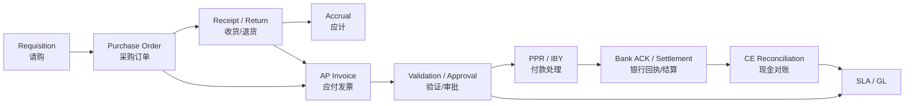
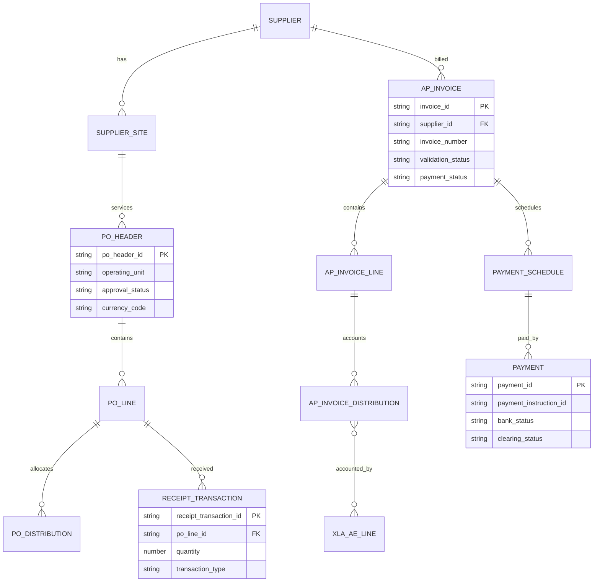
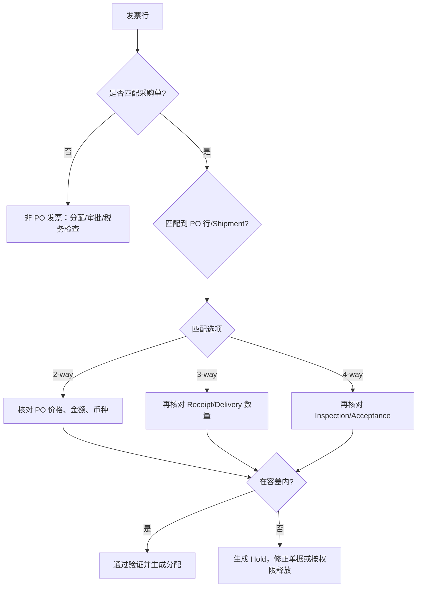
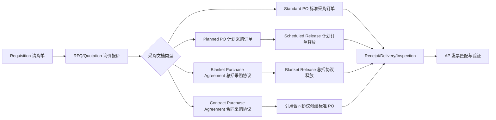
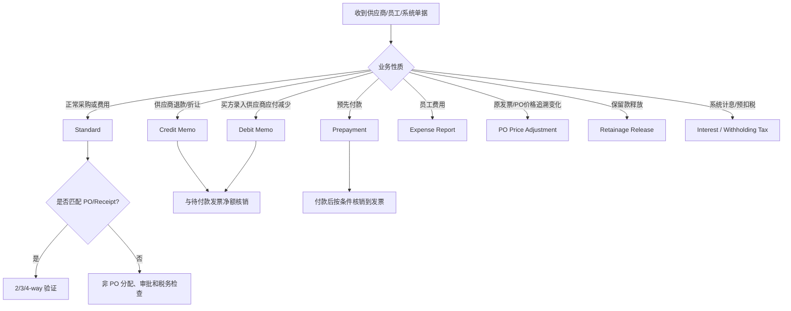
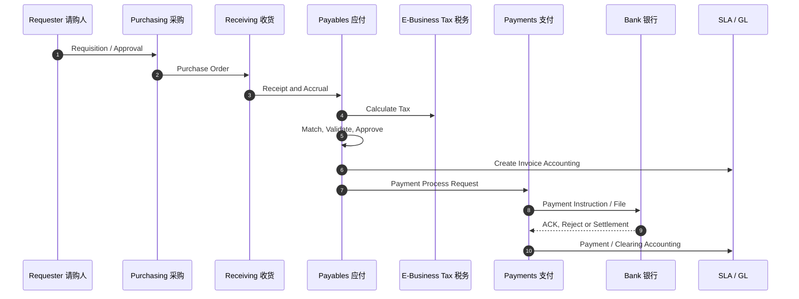
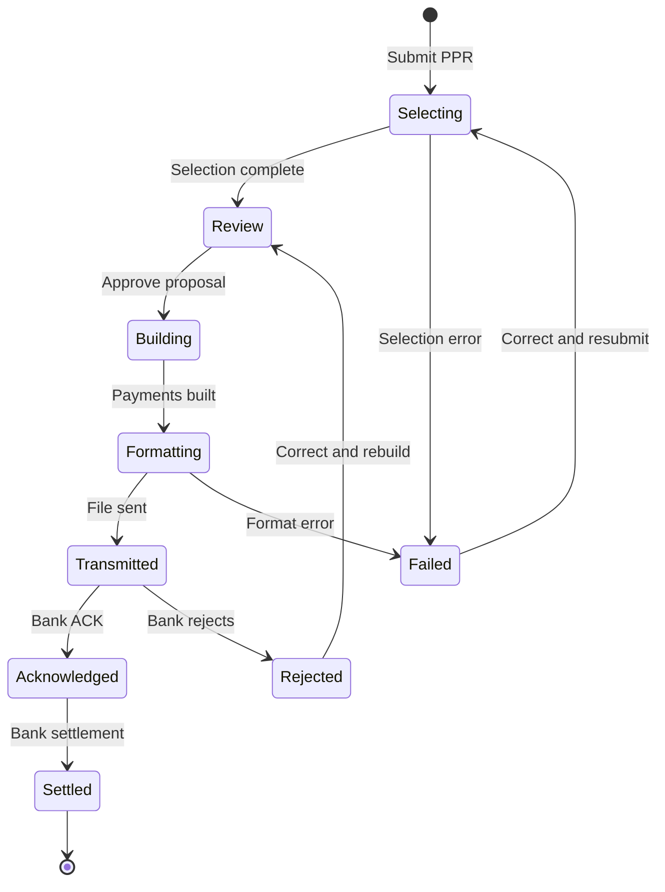

# 采购到付款（Procure to Pay，P2P）

> P2P 从需求、采购、收货、发票、付款到银行清算，连接采购合规、负债确认、现金安全和税务控制。

## 阅读导航

- [产品边界](#1-学习目标与产品边界) · [业务会计主链](#2-业务与会计主链) · [关键控制](#3-关键控制设计) · [功能实施](#4-功能顾问实施顺序) · [接口设计](#5-技术与接口设计) · [月结排错](#6-月结与对账) · [页面与支付实操](#9-资深顾问实操发票匹配与支付) · [专题详解](#10-专题详解)
- [模块数据字典与名词解释](data-dictionary.md#dict-03)

## 模块业务架构与核心 ER 图

### P2P 业务架构图



### P2P 核心 ER 图



实体关系用于解释三单匹配和付款链；实际实现还需加入税行、预付款、费用报销、IBY 指令和 CE 清算对象。

## 1. 学习目标与产品边界

应能解释 Purchasing（采购，PO）、Receiving（接收，RCV）、Payables（应付，AP）、E-Business Tax（电子商务税务，ZX）、Payments（支付，IBY）和 Cash Management（现金管理，CE）的职责边界，设计三单匹配、付款审批、接口幂等和月结对账。

## 2. 业务与会计主链

```text
需求/请购 → 采购订单 → 收货/退货 → 应付发票 → 验证/审批
→ 付款处理请求 PPR → 支付文件/银行回执 → 清算/对账 → GL
```

常见会计（以实例 SLA 为准）：

```text
收货或期末应计：Dr Inventory/Expense/Accrual  Cr Receiving/Expense Accrual
发票：          Dr Expense/Asset/Tax/Accrual  Cr AP Liability
付款：          Dr AP Liability               Cr Cash/Cash Clearing
银行清算：      Dr Cash Clearing              Cr Cash
```

## 3. 关键控制设计

### 3.1 供应商主数据

供应商基于 TCA，付款、税务和采购属性通常落在不同层级。建立税号/注册号/银行账户的去重规则；供应商新建、地点启用、银行变更和一次性付款应分权审批。停用地点前评估未结 PO、发票和付款计划。

### 3.2 匹配与容差

- **2-way match（两单匹配）**：发票数量/金额与 PO 订单数量/价格核对，适合服务、订阅或不要求仓库收货的采购。
- **3-way match（三单匹配）**：在 2-way 基础上增加已接收数量或金额，适合实物采购；未收货或超收会产生 Matching Hold。
- **4-way match（四单匹配）**：在 3-way 基础上增加 Inspection/Acceptance 结果，适合需要质量验收的物料。

| 匹配方式 | 必须存在的事实 | 主要检查 | 典型适用场景 | 常见失败原因 |
| --- | --- | --- | --- | --- |
| 2-way | PO + Invoice | 价格、金额、税/运费、币种和日期 | 咨询、租赁、订阅、已在外部系统验收的服务 | PO 价格过期、发票金额超容差、PO 关闭 |
| 3-way | PO + Receipt/Delivery + Invoice | 订单量、已收量、发票量及价格 | 库存、费用物料和普通实物采购 | 收货未完成、退货未扣减、UOM 不一致 |
| 4-way | PO + Receipt + Inspection/Acceptance + Invoice | 在 3-way 上检查验收数量/状态 | 食品、药品、质量门禁物料 | 检验未完成、拒收未处理、验收数量不足 |

#### 匹配粒度和容差

1. **匹配粒度**：可以从 PO Header、Line、Shipment 到 Distribution 逐层选择；发票行应尽量落到 PO Shipment/Distribution，避免只按供应商和总额“粗匹配”。按 Receipt 匹配时，应保存 `RCV_TRANSACTION_ID`，从而能够解释部分收货、退货和更正。
2. **数量容差**：比较发票数量与可开票接收数量；应考虑 UOM 转换、退货、纠正和已开票数量。超过容差时按 Ignore、Warning 或 Reject 处理，Reject 通常形成 Quantity Hold。
3. **价格/金额容差**：比较 PO 单价、发票单价、扩展金额、税和运费；价格差异必须区分供应商错误、已批准变更、汇率差异和税额舍入，不能用提高 Price Tolerance 掩盖 PO 未更新。
4. **汇率容差**：外币发票通常按发票汇率入账；与 PO 汇率不同产生的差额应在 SLA 中进入汇兑损益/价格差异规则，先确认汇率日期和 Rate Type，再判断是否为业务差异。
5. **容差层级**：组织、供应商、物料和订单均可能提供接收/发票控制；实施时应记录最终生效值、覆盖层级和审批人。不同补丁级别对可配置项的名称和优先级可能不同，生产配置以目标实例页面和 eTRM 为准。
6. **Final Match**：发票分配标记为 Final Match 时，表示不再向该 PO 分配后续发票，并在启用承诺会计时冲回未使用承诺；Final Match 不能用于 Receipt 或 Prepayment 匹配，必须由业务确认剩余数量不会再开票。



### 3.3 采购文档层级与采购订单类型

采购不是从 PO 直接开始。完整链路通常是“请购需求 → 询价/供应商选择 → 采购文档 → 收货/验收 → 发票”。Oracle Purchasing 将采购文档区分为请购单、询价/报价、采购订单和采购协议；采购订单类型的显示名称可以在 Document Types 中改名，但其功能类别仍是下列四种 seeded 类型。



#### 四类采购订单/协议

| 类型（Oracle seeded class） | 什么时候用 | 下单时已知的信息 | 后续释放方式 | 承诺/预留控制 | 业务例子 |
| --- | --- | --- | --- | --- | --- |
| **Standard Purchase Order**（标准采购订单） | 一次性或明确批次的采购 | 商品/服务、价格、数量、交付计划、账户分配均已知 | 不需要释放，批准后直接收货/开票 | 可启用 Encumbrance；批准后形成可执行订单 | 采购 100 台显示器，已确定供应商、单价和到货日期 |
| **Planned Purchase Order**（计划采购订单） | 需求总量已知、实际交付节奏待定 | 商品/服务和预计总量已知；交付计划可只填预计值，具体日期/地点在 Release 时细化 | 通过 Scheduled Release 产生实际交付计划 | 可预留总额；释放时可调整分配，须符合变更审批 | 年度预计采购 12,000 件，按月由工厂拉动 |
| **Blanket Purchase Agreement**（Blanket Purchase Agreement，总括采购协议） | 价格和条款谈妥、按需分批采购 | 商品/服务和价格通常已知；具体数量、交付计划不确定 | 通过 Blanket Release 按需下单；可设价格 breaks | 可启用承诺；可设 Global Agreement 供多个 OU/BU 引用 | 与办公用品供应商约定一年价格，按部门申请释放 |
| **Contract Purchase Agreement**（合同采购协议） | 只先锁定法律条款和商业条件 | 条款已知，但商品/服务、价格、数量、分配均未定义 | 创建引用合同的 Standard PO 再收货/开票 | 通常不直接做采购金额承诺，实际订单才形成金额 | 集团框架合同，后续各 OU 按项目创建具体订单 |

Oracle 的选择逻辑可以概括为：**已知交付计划选 Standard；已知总量但计划不定选 Planned；已知价格、按需分批选 Blanket；只知条款、不知具体采购内容选 Contract**。如果价格、数量或科目尚未经过预算和业务批准，不要为了“先占额度”而创建金额不真实的 Standard PO。

#### Planned/Blanket Release 的区别

| 释放对象 | 来源 | 释放时必须明确 | 对原协议的影响 | 需要关注的控制 |
| --- | --- | --- | --- | --- |
| Scheduled Release | Planned PO 或部分协议场景 | 具体交付日期、地点、数量、分配和价格 | 消耗计划订单的可释放数量/金额 | 计划变更、交付窗口、项目/成本中心分配 |
| Blanket Release | Blanket Purchase Agreement | 本次采购数量、交付计划、收货地点和分配 | 消耗协议金额/数量；按协议价格和价格阶梯计算 | 协议有效期、价格 breaks、累计承诺、供应商地点 |

合同协议本身不等于可收货的订单；收货和 AP 匹配应引用实际批准的 Standard PO 或 Release。Global Agreement 可以让不同采购业务单元引用共享协议，但必须检查供应商地点、币种、税务和本 OU 的访问权限。

#### PO 控制字段与生命周期

- **Header**：供应商、Supplier Site、采购员、Operating Unit/BU、币种、付款条件、交货条款、协议引用、审批状态和 Global 标志。批准 PO 后通常不能任意更换供应商；供应商地点变更是否允许取决于配置，并会增加修订和重新审批。
- **Line**：物料或服务描述、Item/Category、数量、单位、单价、价格基础、税分类和供应商物料号。服务行要明确服务期间、验收人和是否需要收货。
- **Shipment**：交付日期、收货组织、Ship-to/Bill-to、接收路由、匹配选项、超收/迟交容差和最终关闭标志；同一行可拆分多个 Shipment。
- **Distribution**：费用、库存、项目、资产或预付款分配，包含数量/金额、科目组合、项目/任务、预算账户和应计账户。一个 Shipment 可分摊到多个分配。
- **Approval/Revision/Change Order**：批准是可执行性的门槛；金额、价格、数量、日期、地点、匹配选项等关键字段变更应走 Change Order 工作流。不要直接更新 `PO_*_ALL` 表绕过审批和审计。
- **Close/Cancel**：关闭阻止后续收货/开票，取消只释放未履行部分；取消前要检查已收、已开票、预付款、承诺和项目成本，必要时先做退货/贷项。

#### 采购订单类型选择案例

1. **一次性硬件**：创建 Standard PO，按实际物料行拆分交付计划，采用 3-way；收货后 AP 按 Receipt 匹配。
2. **年度框架价**：创建 Blanket Agreement，维护价格阶梯和有效期；每次需求创建 Blanket Release，Release 才是实际可收货、可开票的订单。
3. **滚动生产计划**：创建 Planned PO，维护年度预计量；每次排产创建 Scheduled Release，允许在释放阶段细化日期和科目。
4. **法律框架先行**：创建 Contract Agreement，只记录合同条款和供应商；项目启动时引用合同创建 Standard PO，不把合同协议当作收货依据。

上线前至少形成一张“订单类型—审批规则—匹配选项—收货路由—应计方式—关闭规则”矩阵，并为每种类型配置正向、变更、取消、部分收货、退货和跨期发票测试案例。

官方依据：[Oracle Purchasing User's Guide — Purchase Order Types](https://docs.oracle.com/cd/E26401_01/doc.122/e48931/T446883T443953.htm)。

### 3.4 AP 发票类型、行类型与处理边界

AP 的 **Invoice Type 是发票头级别的业务性质**，而 `ITEM/TAX/FREIGHT/MISCELLANEOUS` 是发票行类型，二者不能混用。不同补丁或本地化可能扩展 Lookup，但下表覆盖 Oracle Payables R12.2 常见 seeded 类型；生产实例应以 Invoice Workbench 的 Type 值、eTRM 和本地化文档为准。



#### 发票头类型定义

| Invoice Type | 借贷方向/金额特征 | 来源与含义 | PO/Receipt 匹配 | 后续处理和控制 |
| --- | --- | --- | --- | --- |
| **Standard** | 必须为正数 | 供应商贸易发票，可为商品、服务或费用 | 可匹配 PO、Receipt，也可非 PO | 通过验证、审批和会计后进入付款计划；检查重复发票号 |
| **Mixed** | 可正可负 | 同一张发票同时包含匹配行、非 PO 行或调整行 | 可同时匹配 PO/其他发票；负数 Mixed 通常只能匹配 Standard Invoice | 逐行核对正负方向、税和分配；避免将贷项误当作负 Standard |
| **PO Price Adjustment** | 由差额决定，可正可负 | PO 价格追溯调整后，原发票与新价格之间的差额 | 可引用 PO/发票；常由追溯定价流程生成 | 与原始发票、价格生效日期和供应商通知关联；不能手工伪造为普通费用 |
| **Credit Memo** | 负数 | 供应商主动开具的退货、折让、质量赔偿或退款凭证 | 可匹配原发票、PO 或 Receipt | 与待付款发票净额核销；退货应先完成 RCV Return/Correction |
| **Debit Memo** | 负数 | 买方为记录供应商应减少的应付款而录入，如供应商少发货、折扣未扣 | 可匹配原发票/PO/Receipt | 必须保留买方计算依据和通知供应商的证据；不要理解成“借方正数发票” |
| **Prepayment**（Temporary/Permanent） | 通常为正数预付款 | 在货物/服务前向供应商或员工支付的预付款 | 可引用 PO；核销时匹配正式发票 | Temporary 可后续 Apply，Permanent 不可核销；预付款必须已验证、已付款、无活动 Hold |
| **Expense Report** | 通常为正数 | 员工差旅、招待、里程、公司卡等费用报销 | 通常不与 PO 匹配 | 依赖 Internet Expenses/费用审批；按费用行、税和项目分配入账 |
| **Interest** | 系统计算 | 发票逾期产生的利息（启用自动计息时） | 通常不匹配 PO | 系统生成并关联原发票/付款条件；需检查利率、宽限期和会计科目 |
| **Retainage Release** | 释放保留款的正数或调整金额 | 复杂服务合同达到里程碑后释放保留金额 | 关联原始保留款/合同发票 | 以验收/里程碑证据为前提；检查保留款余额不能超释放上限 |
| **Withholding Tax** | 预扣税专用单据/金额 | 将供应商发票中代扣的税款结算给税务机关；可由预扣税流程自动产生或按实例流程录入 | 由原发票的税务规则和预扣事件衍生 | 不应当作普通费用发票；核对税率、税务主体、税务机关和原发票关联 |
| **Adjustment** | 系统生成 | 价格、税或舍入更正产生的调整单据 | 关联原始发票/交易 | 必须保留原始单据和调整原因；按实例规则由系统生成 |
| **Standard Invoice Request** | 通常为正数 | iSupplier 自助提交的非 PO 发票请求 | 通常无 PO 匹配 | 先经过批准，再由 AP 在 Invoice Workbench 中修改/转正式发票 |

> Oracle Payables 将 Credit Memo 和 Debit Memo 都定义为负数；Credit Memo 来自供应商，Debit Memo 由买方录入以记录应减少的供应商负债。预付款的 Temporary/Permanent 属性决定能否 Apply，不要只根据发票编号或负号判断类型。

#### 发票行类型与分配

| 行类型 | 记录内容 | 是否形成会计分配 | 典型控制 |
| --- | --- | --- | --- |
| `ITEM` | 商品、服务、费用或资产成本 | 是；可有多个 Distribution | PO/Receipt 匹配、项目/资产、费用科目和数量 |
| `TAX` | E-Business Tax 计算的税额 | 是；可区分可抵扣/不可抵扣 | 税分类、税率、税务日期、法人与地点 |
| `FREIGHT` | 运费/运输费用 | 是 | 运费供应商、分摊规则、是否计入存货成本 |
| `MISCELLANEOUS` | 包装、手续费等杂项 | 是 | 费用科目、供应商合同和税处理 |
| `PREPAY` | 预付款核销产生的负分配 | 是 | 原预付款、核销金额、供应商/币种和付款状态 |
| `AWT`/Withholding | 自动预扣税分配（名称按实例） | 是 | 预扣税规则和税务机关 |

发票数据的正确粒度是 **Header → Lines → Distributions**：Header 保存供应商、发票号、日期、币种、总额和付款条件；Lines 保存商品/服务、税、运费和杂项；Distribution 是账户、项目、资产、税和匹配信息的会计来源。一条发票行可以拆分到多个科目或项目，因而不能仅以 `AP_INVOICE_LINES_ALL.AMOUNT` 代替会计金额。

#### 录入、验证与付款边界

1. **Invoice Workbench** 适合复杂、在线匹配、税务、预付款、贷项/借项、附件、Hold 和审批；录入后执行 Validate 才会完成匹配、税、期间、分配和 Hold 检查。
2. **Quick Invoices** 适合大量简单非 PO 发票；默认和验证多在导入阶段完成，不应把它当作绕过验证的入口。
3. **Validation ≠ Approval**：Validation 检查业务和会计可付款性；Invoice Approval/AME 决定授权。两者状态必须分别记录，批准不代表已会计，已会计也不代表已付款。
4. **付款前**：发票须已验证、满足付款条件、无阻止付款 Hold、付款计划到期且供应商地点/银行账户有效。PPR 选择条件还可能按 OU、付款日期、币种、付款方式和金额筛选。
5. **外币**：发票分配通常按发票汇率入账，PO 汇率只作为采购承诺/比较依据；差额应由汇兑损益或价格差异规则解释。记录 Rate Type、Rate Date、Rate 和来源，不要在接口中只传一个换算后的本位币金额。

#### 发票处理案例

- **正常三单发票**：Standard + `ITEM`，引用 PO Shipment 和 Receipt；验证通过后冲销收货应计，差异在容差内才允许付款。
- **供应商退货**：先记录 RCV Return，再接收 Credit Memo；Credit Memo 关联原发票或 PO，确保库存、应计和 AP 同步减少。
- **供应商少收款/折扣未扣**：由买方创建 Debit Memo（负数），附计算表和供应商通知；与原 Standard 发票净额核销。
- **合同预付款**：创建 Temporary Prepayment，先验证并付款；正式发票到达后在同一供应商、相同发票/付款币种及有效结算日期下 Apply，产生 `PREPAY` 负分配。
- **年度价格追溯**：批准新价格后运行追溯定价，产生 PO Price Adjustment；对原发票、PO 修订和价格生效期间做三方追溯，不能将差额直接记入任意费用科目。
- **员工差旅**：Expense Report 由员工提交并经费用政策审批，再导入 AP；费用行按成本中心、项目、税和公司卡结算，不走 PO 三单匹配。

官方依据：[Oracle Payables User's Guide — Entering Invoices](https://docs.oracle.com/cd/E26401_01/doc.122/e48760/T295436T366808.htm)。

### 3.5 接收路由、退货与应计

接收路由决定 Receiving 事务的先后顺序和库存/费用何时生效。Oracle 常见三种路由可按组织、供应商、物料或订单设置，较低层级可以覆盖较高层级；实际生效值必须在 PO Shipment 和接收页面核对。

| 路由 | 事务顺序 | 库存/目的地何时生效 | 适用场景 | 关键控制 |
| --- | --- | --- | --- | --- |
| **Standard Receipt** | Receive → Deliver/Put Away | 完成 Deliver/Put Away 后才增加库存或进入目的地 | 普通仓库收货，收货和上架分离 | 收货数量、库位、迟交/超收容差 |
| **Inspection Required** | Receive → Inspect → Accept/Reject → Deliver | Accept 并 Deliver/Put Away 后生效；Reject 不应进入可用库存 | 质量检验、药品、食品、关键零件 | 检验结果、拒收原因、隔离区和验收人 |
| **Direct Delivery** | Receive/Deliver 一次完成 | 收货时立即增加库存或费用目的地 | 直接送线、服务现场、无需仓储的物料 | 现场签收、数量、地点和不可逆操作复核 |

标准收货与发票匹配应区分 **Receive 数量** 和 **Deliver 数量**；4-way 还要区分 **Inspection/Acceptance 数量**。退货和更正不是删除原收货，而是创建带原因和参考事务的 Return to Supplier、Return to Receiving 或 Correction，以保留审计轨迹。

| 接收事务 | 业务含义 | 对后续 AP/库存的影响 |
| --- | --- | --- |
| Receive | 记录供应商已交付到接收地点 | 形成可用于 3-way 的收货事实，是否入库取决于路由 |
| Deliver | 将接收数量送入库存、费用、项目或资产目的地 | 更新目的地数量/成本，可能触发应计 |
| Inspect / Accept | 记录检验和验收结果 | 决定 4-way 是否可匹配，拒收数量不能作为可开票数量 |
| Reject | 质量/数量不合格 | 保留拒收证据；按业务退货或重发 |
| Return to Supplier | 将已收数量退回供应商 | 冲减可开票/可用数量，通常需要 Credit Memo 或重开订单 |
| Return to Receiving | 撤回错误 Deliver | 修正库存/目的地，不能替代供应商退货 |
| Correction | 更正数量或事务错误 | 原事务不删除，保留调整链和责任人 |

#### 应计与跨期

- **收货应计**：启用收货时应计且未开票时，系统按 PO/Receipt 形成暂估；AP 发票验证后以匹配分配冲销应计并确认负债。库存组织、费用目的地、项目和资产目的地的账户来源可能不同，应以 SLA 规则为准。
- **期末处理**：关账前列出未开票收货、已开票未收货、收货冲正、退货和价格差异；按责任人决定补收货、催票、退货或做合规调整，不以手工 GL 净额掩盖明细差异。
- **跨期**：PO/Receipt 在旧期间、Invoice 在新期间时，旧期间保留应计，新期间发票冲销；如果旧期间已关闭，按组织的 Accrual Reconciliation 和调整政策处理并保留审批。
- **Drop Ship/ASN**：Drop Ship 订单的收货路由和普通仓库不同，可能由订单履行或 ASN 自动产生；不要把自动收货当成仓库实收，必须确认来源、数量和客户签收证据。
- **Receiving Open Interface**：外部仓库、条码系统或 ASN 可通过 Receiving Open Interface 导入；接口需保存 PO Shipment、事务类型、数量、UOM、事务日期、来源系统键和原始回执，按 `Source + External Transaction ID` 幂等。

官方依据：[Oracle Purchasing User's Guide — Receiving](https://docs.oracle.com/cd/E26401_01/doc.122/e48931/T446883T443958.htm)。

### 3.6 付款安全

Payment Process Request（付款处理请求，PPR）从选择、建立付款、格式化、传输到确认是多个状态。支付文件已生成不表示银行已受理；需要保存文件校验、传输回执、银行 ACK/拒绝、作废和重发链路。银行账户维护、PPR 提交、审批和文件传输应职责分离。

## 4. 功能顾问实施顺序

1. 供应商、地点、税务和银行治理。
2. 采购类型、审批、收货路由、应计方式和匹配选项。
3. AP 发票选项、容差、Hold、付款条件和预付款。
4. IBY 付款方式、格式、Payment Process Profile（付款处理配置）和传输。
5. SLA、期间、对账报表和关闭规则。

场景至少覆盖：PO/非 PO 发票、预付款、借贷项、员工报销、外币、部分收货、价格差异、退货、作废付款和跨期处理。

### 4.1 实施蓝图与职责边界

实施前先把“谁创建、谁批准、谁接收、谁验证、谁付款、谁对账”写成 RACI，而不是只配置菜单。建议至少拆分以下职责：

| 业务职责 | 主要动作 | 不应同时拥有的权限 | 必留证据 |
| --- | --- | --- | --- |
| 需求/请购人 | 提交需求、确认服务完成 | 不应批准自己的 PO 或释放自己的付款 | 请购理由、预算、验收证明 |
| 采购员 | 询价、供应商选择、创建/变更 PO | 不应维护供应商银行账户并执行付款 | 比价、合同、PO 修订和批准历史 |
| 收货/验收人 | Receive、Deliver、Inspect、Return | 不应验证同一批次 AP 发票 | 收货单、检验报告、退货单 |
| AP 录入/验证 | 录入发票、匹配、Validate、处理 Hold | 不应审批自己创建的发票或维护付款银行 | 发票影像、匹配依据、Hold 释放理由 |
| AP 付款审批人 | 审核 PPR、付款提案和例外 | 不应修改供应商银行账户或直接改付款金额 | PPR 审批、付款清单、复核签名 |
| 资金/银行操作 | 格式化、传输、获取 ACK、现金预测 | 不应创建/批准业务发票 | 文件哈希、传输日志、银行回执 |
| 财务关账/对账 | AP-GL、收货应计、CE 对账和关账 | 不应绕过来源系统手工冲销明细 | Trial Balance、对账表、关账清单 |

### 4.2 配置产出物清单

| 设计域 | 必须明确的决策 | 产出物/验收标准 |
| --- | --- | --- |
| 企业与权限 | OU、BU、法人、Ledger、库存组织、MOAC、安全职责 | 组织访问矩阵；用户只能看到授权 OU/库存组织 |
| 供应商/TCA | Party、Supplier、Site、Pay Site、Purchasing Site、税登记、银行账户 | 供应商去重和变更审批；停用前有未结单据检查 |
| 采购文档 | 四种 PO 类型、协议/Release、审批金额和变更阈值 | 订单类型选择矩阵；每种类型可完成正向和取消测试 |
| 收货/应计 | Receipt Routing、接收容差、应计方法、库存/费用目的地 | 收货事务和会计事件可追溯；未开票收货报表可对账 |
| AP 发票 | Invoice Type、Line Type、Match Option、Tolerance、Duplicate Check | Standard、Credit/Debit、Prepayment、Expense Report 至少各有一条通过案例 |
| 税务 | EBTax Regime/Tax/Rate、输入税/输出税、可抵扣率、预扣税 | 税额、税务日期、税务主体和税务机关结果可复核 |
| 付款/资金 | Terms、Payment Method、Bank Account、PPP、PPR 模板、格式和传输 | 从付款选择到银行 ACK/CE Clearing 的端到端证据链 |
| SLA/GL | 负债、应计、库存/费用、税、现金、汇兑和差异账户 | 每类事件至少可下钻到来源发票/收货/付款 |

### 4.3 端到端测试矩阵

| 测试组 | 主数据/单据 | 关键步骤 | 预期控制结果 |
| --- | --- | --- | --- |
| 标准库存采购 | Standard PO、3-way、Standard Receipt | PO → Receive → Deliver → Invoice Match → Validate → Pay | 发票量不超过可接收量；应计冲销；付款可追溯 |
| 质量采购 | Standard PO、4-way、Inspection | Receive → Inspect Reject/Accept → Deliver → Invoice | 未验收数量不能通过匹配；拒收有原因和退货链 |
| 框架采购 | Blanket Agreement、Blanket Release | Agreement → Release → Receipt → Invoice | Release 消耗协议余额；不能超有效期/价格阶梯 |
| 计划采购 | Planned PO、Scheduled Release | Planned total → Release → Partial receipt | 释放可细化日期/分配；总量和预算不超限 |
| 非 PO 服务 | Standard Invoice（unmatched） | Workbench → Distribution → Approval → Validate | 必须有服务验收和费用审批；不借 PO 绕过采购 |
| 退货/贷项 | Receipt、Return、Credit Memo | Return to Supplier → Credit Memo → Apply/Pay | 库存、应计和 AP 同步减少；原单据仍可审计 |
| 预付款 | Temporary Prepayment、PO | Validate → Pay → Apply to Standard | 只能在已付款、无 Hold、同供应商/币种条件下核销 |
| 价格追溯 | 原发票、PO 修订、PO Price Adjustment | 价格生效 → 调整 → Validate/Account | 差额关联原 PO/发票；不产生无来源的费用调整 |
| 外币 | 外币 PO/Invoice、Rate Type | 输入发票汇率 → 匹配 → 付款/重估 | 交易币、账簿币和汇兑损益可解释 |
| 付款异常 | PPR、银行文件、Reject/ACK | Selection → Build → Format → Transmit → Rebuild/Void | 回执不明不重发；重复付款和作废链路可证明 |

每个测试案例应保存输入数据、职责/用户、请求 ID、页面状态、日志、会计分录、报表和预期/实际差异。只验证“页面显示成功”不足以证明 P2P 完成；必须验证数据库状态、SLA/GL 和银行/对账结果。

## 5. 技术与接口设计

常用对象：`PO_HEADERS_ALL`、`PO_LINES_ALL`、`PO_LINE_LOCATIONS_ALL`、`PO_DISTRIBUTIONS_ALL`、`RCV_TRANSACTIONS`、`AP_INVOICES_ALL`、`AP_INVOICE_LINES_ALL`、`AP_INVOICE_DISTRIBUTIONS_ALL`、`AP_PAYMENT_SCHEDULES_ALL`、`AP_CHECKS_ALL` 及 XLA 表。

AP Invoice Open Interface 应维护来源、发票号、供应商、业务唯一键、批次和控制总额。重跑前先识别已导入、拒绝和处理中记录；不能用“先删接口表再导入”作为通用策略。银行和支付接口还要保存文件 ID、哈希/控制总额、传输状态和回执相关号。

## 6. 月结与对账

依次核对未处理收货、未开票收货应计、未验证/挂起发票、未会计交易、未传 GL 分录、AP Trial Balance（应付试算表）、付款清算和 GL 负债/现金账户。差异应定位到具体单据和期间，不能只用期末净额判断。

## 7. 高频问题定位

| 问题 | 断点判断 |
| --- | --- |
| 发票无法验证 | 供应商地点、期间、匹配差异、税、分配和 Hold |
| 发票已验证但不能付款 | 付款计划、审批、Hold、付款方式、银行和 PPR 选择条件 |
| PPR 卡住 | 请求阶段、格式、支付指令、传输配置和并发日志 |
| AP 与 GL 不符 | 会计日期、未会计/未传输、手工 GL、负债账户和期间 |
| 重复付款风险 | 发票唯一性、供应商重复、付款状态、作废/重发链 |

## 8. 建议练习

- 完成一笔采购、部分收货、发票价格差异、付款和银行清算案例。
- 设计 AP 发票接口的幂等键、拒绝重跑和控制总额。
- 制作 P2P 月结清单并为每一步指定证据和责任人。

## 9. 资深顾问实操：发票、匹配与支付

### 9.1 P2P 跨模块时序图



### 9.2 页面剧本：创建采购文档与收货

#### 创建 Standard PO

**常见职责与导航**：`Purchasing Super User → AutoCreate Documents`（从已批准请购创建）或 `Purchase Orders → Purchase Orders`（手工创建）。

1. 先确认 OU/BU、采购员、供应商及 Supplier Site 的 Purchasing Site/Pay Site、币种和有效期；协议订单还要确认协议可见范围和剩余金额。
2. 在 Header 选择 Document Type：Standard、Planned、Blanket 或 Contract。不要因为“以后可能会买”就用 Standard PO 代替协议。
3. 在 Lines 输入 Item/Category、描述、数量或金额、UOM、单价、税分类和供应商物料号；服务行补充服务期间、验收人和是否需要收货。
4. 在 Shipments 维护 Ship-to Organization/Location、Need-By/Promise 日期、Receipt Routing、Match Option、超收和迟交容差；同一行需拆分多个地点或日期时创建多个 Shipment。
5. 在 Distributions 维护库存、费用、项目、资产或预付款科目；核对数量/金额合计、项目任务有效期、预算账户和应计账户。
6. 运行 Funds Check（如启用预算控制），使用 Notes/附件保存合同、比价和技术规格；提交 PO Approval/AME，并确认批准版本和 revision。
7. 批准并向供应商发送 PO/Release；供应商确认、变更和拒绝均应回写到单据历史，不能只保留邮件。

#### 创建 Blanket/Planned Release

1. 查询有效的 Blanket Agreement 或 Planned PO，检查生效/失效日期、供应商地点、币种、价格 breaks、剩余数量/金额和 Global Agreement 访问权限。
2. 选择 **Blanket Release** 或 **Scheduled Release**，输入本次具体数量/金额、交付日期、Ship-to、收货路由、匹配选项和分配；Release 是实际可收货、可开票的订单。
3. 对 Release 重新执行预算、审批和供应商通知；检查累计释放不超过协议/计划总量，价格取值与协议版本一致。

#### 录入 Receipt/Inspection/Return

1. 在 `Receiving → Receipts` 以 PO、Release、ASN 或供应商查询预期行；核对 packing slip、供应商批次、序列/批次号、收货组织和数量。
2. **Standard Receipt** 先 Receive 到 Receiving，再执行 Deliver/Put Away；**Inspection Required** 先 Receive，录入检验结果后 Accept/Reject，再 Deliver；**Direct Delivery** 在一次事务中完成收货并进入目的地。
3. 部分到货只录实收数量；超收、迟交、地点不符或 UOM 不一致时，按容差和授权处理，不用“多收后再删行”修正。
4. 退货选择原始 Receipt/Delivery，创建 Return to Supplier 或 Return to Receiving 并填写 Reason；更正使用 Correction，保留原事务、参考号和责任人。
5. 验证 3-way/4-way 可用数量、库存/费用目的地数量、收货应计和后续 AP 匹配键（`PO_LINE_LOCATION_ID`、`RCV_TRANSACTION_ID`）。

### 9.3 页面剧本：录入并验证标准发票

**常见职责与导航**：`Payables Super User（应付超级用户） → Invoices（发票） → Entry（录入） → Invoices`，进入 Invoice Workbench（发票工作台）。

**前置检查**：当前 OU、Supplier/Site、发票期间、付款条件、币种/汇率、PO/Receipt、税注册和重复发票规则。

1. 输入 Supplier、Site、Invoice Number、Invoice Date、GL Date、Invoice Amount、Currency 和 Type。
2. 对 PO 发票选择 Match（匹配），按 PO Shipment 或 Receipt 选择数量/金额；非 PO 发票录入 Lines/Distributions。
3. 核对税务计算、Recoverable/Nonrecoverable Tax、Withholding（预扣税，如适用）及账户分配。
4. 保存并选择 Actions → Validate；查看 Holds（挂起）并区分匹配、期间、税、分配或审批原因。
5. 需要审批时提交 Invoice Approval Workflow；确认批准历史，而非仅看 Validation Status。
6. 运行 Create Accounting（Final），确认会计完成并按项目策略传送 GL。
7. 在 Invoice Overview/Distributions/View Accounting 中核对负债、费用/资产、税和应计冲销。

**结果验证**：发票总额等于行和税；匹配数量不超过可用数量；付款计划正确；无未解释 Hold；SLA 与 GL 可追溯。

### 9.4 页面剧本：处理匹配差异与 Hold

1. 在 Invoice Workbench 查询发票，打开 Holds 标签或 Actions 查看 Hold 名称和原因。
2. 对 Quantity/Price/Amount Hold，比较 PO、Receipt、Invoice 的数量、单价、币种和 UOM。
3. 判断正确动作是更正 PO、补/退收货、更正发票、批准容差例外还是释放 Hold。
4. 释放需授权的 Hold 时填写原因并保存审批证据；不可为通过付款而无依据释放系统控制。
5. 重新 Validate，并复核分配与会计是否发生变化。

### 9.5 页面剧本：创建 Payment Process Request

**常见职责与导航**：`Payables Manager/Payments Responsibility → Payments → Entry → Payment Manager`。

1. 新建 PPR，输入名称、Payment Process Profile、支付日期、银行账户和选择条件。
2. 运行/提交 Invoice Selection，复核 Selected、Rejected 和未选发票原因。
3. Review Proposed Payments，按审批规则移除或暂停异常付款；核对供应商银行变更和高额/重复付款。
4. Build Payments 后复核 Payment Instruction、付款数量和控制总额。
5. Format/Transmit 支付文件，保存文件 ID、哈希或控制总额及传输状态。
6. 获取银行 ACK/Reject，不把“文件已生成”当作“银行已支付”。
7. 按银行事实完成确认、作废/重发和 CE Clearing/Reconciliation；核对付款会计与现金账户。

### 9.6 PPR 状态与恢复决策



恢复前确认是否已生成 Payment、Payment Instruction 或银行文件。同一 PPR 的不同阶段不能采用相同重跑方式；银行回执不明时先向银行查询，不得盲目重发造成重复支付。

### 9.7 月结页面检查

在 AP Period Close/Control 页面检查期间，运行 Invoice Validation、Create Accounting、Transfer to GL 和相关 Trial Balance/Accounting 报表。关闭前清理未验证、Hold、未会计、未传输、未清算和接口拒绝，并与 PO Receiving Accrual、IBY、CE 和 GL 责任人签核。

### 9.8 资深顾问必须设计的例外

- 预付款申请与核销、员工报销、借项/贷项通知单、外币付款与汇兑损益。
- 取消发票、取消付款、Stop Payment（止付）、Void（作废）和银行已结算后的补偿。
- 同一供应商多个地点/银行、供应商合并、银行账户变更冻结期。
- PO/Receipt 在旧期间、发票在新期间时的应计与价格差异。
- 接口部分成功、重复发票号、税额舍入和 Project/Asset 分配。

### 9.9 官方操作依据

- [Oracle Payables User's Guide](https://docs.oracle.com/cd/E26401_01/doc.122/e48760/title.htm)
- [Oracle Payables User's Guide — Contents](https://docs.oracle.com/cd/E26401_01/doc.122/e48760/toc.htm)

## 10. 专题详解


<!-- source: docs/02-ap/README.md -->
<a id="src-docs-02-ap-readme"></a>
### Oracle Payables（AP）


本目录覆盖 P2P 链路中的供应商主数据、采购/收货匹配、应付发票、付款、子账会计、对账与关账。付款执行由 Oracle Payments（IBY）承担；银行对账由 Cash Management（CE）承担，因此必须以端到端相关号和控制批次追溯，而不是仅依赖单张 AP 发票状态。

<a id="src-docs-02-ap-readme--专题导航"></a>
#### 专题导航

- [流程与控制点](#src-docs-02-ap-process)
- [供应商与地点](#src-docs-02-ap-suppliers)
- [发票、验证、匹配与税务](#src-docs-02-ap-invoices)
- [付款与核销](#src-docs-02-ap-payments)
- [Oracle Payments 与 Internet Expenses](#src-docs-02-ap-payments-iby-expenses)
- [预付款、员工报销、借贷项和保留款](#src-docs-02-ap-special-transactions)
- [会计、月结与报表](#src-docs-02-ap-accounting-close-reports)
- [表结构](#src-docs-02-ap-tables)
- [标准 Open Interface 实现](#src-docs-02-ap-interfaces)
- [接口排错](#src-docs-02-ap-interfaces-troubleshooting)

<a id="src-docs-02-ap-readme--必须形成闭环的控制"></a>
#### 必须形成闭环的控制

| 控制目标 | EBS 关键点 | 验证证据 |
| --- | --- | --- |
| 防重复付款 | Supplier Site、Invoice Number、Duplicate Invoice 控制、付款状态 | 重复发票例外清单、付款批次复核 |
| 采购合规 | 2/3/4-way Match、Tolerance、Hold、Receipt Accrual | PO/Receipt/Invoice 三单匹配差异及 Hold 处理记录 |
| 付款安全 | Payment Method、Payment Process Profile、职责分离、银行回执 | PPR 审批、支付文件、ACK/拒绝和作废/重发记录 |
| 财务完整性 | Validation、Create Accounting、Transfer/Post、AP Trial Balance | AP 负债、付款、XLA 和 GL 的期间对账 |

<a id="src-docs-02-ap-readme--相关产品边界"></a>
#### 相关产品边界

- 采购、收货和应计归属 Procurement/Receiving；本目录说明 AP 消耗这些结果的方式。
- 税务确定归属 E-Business Tax；本目录仅说明发票场景的使用和诊断入口。
- iExpenses、Corporate Card、iSupplier 和 Payments 是可选/已安装产品依赖项，实施前核对许可证、责任和补丁级别。

<a id="src-docs-02-ap-readme--官方依据"></a>
#### 官方依据

- [Oracle Payables Documentation](https://docs.oracle.com/cd/E26401_01/nav/financials.htm)
- [Oracle Payments Documentation](https://docs.oracle.com/cd/E26401_01/nav/financials.htm)


<!-- source: docs/02-ap/accounting-close-reports.md -->
<a id="src-docs-02-ap-accounting-close-reports"></a>
### AP 会计、过账、月结与常用报表


<a id="src-docs-02-ap-accounting-close-reports--会计链路"></a>
#### 会计链路

AP 发票、付款、作废、预付核销和汇兑损益通过 SLA 建立会计。常见经济分录（以实际 SLA 规则为准）：

```text
Invoice:  Dr Expense/Asset/Tax   Cr Liability
Payment:  Dr Liability           Cr Cash/Cash Clearing
Clearing: Dr Cash Clearing       Cr Cash
```

<a id="src-docs-02-ap-accounting-close-reports--月结顺序"></a>
#### 月结顺序

1. 冻结当期录入，确认 AP 期间范围和汇率完整。
2. 处理 Open Interface、报销、未验证发票、Holds、未审批和未完成 PPR。
3. 运行 Create Accounting（Final），处理 SLA 错误，转入 GL 并 Journal Import/Post。
4. 运行 Invoice Register、Payment Register、AP Trial Balance/Aging、Unaccounted Transactions 等报表。
5. 对账 AP Liability 子账与 GL，单独分析未转 GL、未过账和手工 GL 分录。
6. 关闭 AP 期间，再完成 GL 月结。

<a id="src-docs-02-ap-accounting-close-reports--sql"></a>
#### SQL

```sql
-- 未过账 AP 分配
SELECT aid.org_id, aid.accounting_date, aid.posted_flag,
       aid.match_status_flag, COUNT(*) row_count, SUM(aid.amount) amount
  FROM ap_invoice_distributions_all aid
 WHERE aid.accounting_date BETWEEN :p_start_date AND :p_end_date
   AND NVL(aid.posted_flag, 'N') <> 'Y'
 GROUP BY aid.org_id, aid.accounting_date,
          aid.posted_flag, aid.match_status_flag
 ORDER BY aid.org_id, aid.accounting_date;

-- 发票支付余额
SELECT aia.org_id, aia.invoice_id, aia.invoice_num,
       aia.invoice_amount, aia.amount_paid,
       SUM(apsa.amount_remaining) amount_remaining
  FROM ap_invoices_all aia
  JOIN ap_payment_schedules_all apsa ON apsa.invoice_id = aia.invoice_id
 WHERE aia.org_id = :p_org_id
   AND aia.cancelled_date IS NULL
 GROUP BY aia.org_id, aia.invoice_id, aia.invoice_num,
          aia.invoice_amount, aia.amount_paid;

-- SLA 未转 GL
SELECT xah.application_id, xah.ledger_id,
       xah.gl_transfer_status_code,
       COUNT(*) header_count
  FROM xla_ae_headers xah
 WHERE xah.application_id = 200
   AND xah.accounting_date BETWEEN :p_start_date AND :p_end_date
 GROUP BY xah.application_id, xah.ledger_id,
          xah.gl_transfer_status_code;
```

<a id="src-docs-02-ap-accounting-close-reports--对账差异排查"></a>
#### 对账差异排查

- 确保 AP Trial Balance 和 GL 使用同一 Ledger、OU/法人、截止日、币种和责任账户范围。
- 区分未会计、已会计未转 GL、已转未 Import、已 Import 未 Post 四个断点。
- 查 GL 中对 AP Source 的手工调整、其他 Source 过入 AP Liability 账户、反冲期间错位。
- 报表差异优先根据标准 AP Trial Balance 日志和 Oracle Support 建议排查，不直接汇总 `AP_INVOICES_ALL` 代替会计余额。

<a id="src-docs-02-ap-accounting-close-reports--关联"></a>
#### 关联

- [SLA](01-foundation.md#src-docs-01-common-sla)
- [GL 月结](02-record-to-report.md#src-docs-04-gl-close-reports)


<!-- source: docs/02-ap/interfaces-troubleshooting.md -->
<a id="src-docs-02-ap-interfaces-troubleshooting"></a>
### AP Open Interface、发票导入与排错


> 需要可落地的发票头行、PO/Receipt 匹配、并发提交与对账代码，请先读 [AP 接口实现案例](#src-docs-02-ap-interfaces)。

<a id="src-docs-02-ap-interfaces-troubleshooting--架构"></a>
#### 架构

```text
Source System/Staging
 → AP_INVOICES_INTERFACE / AP_INVOICE_LINES_INTERFACE
 → Payables Open Interface Import
 → AP_INVOICES_ALL / AP_INVOICE_LINES_ALL / Distributions
 → Validation / Approval / Accounting
```

接口必须保存 Source、外部唯一键、OU、Supplier/Site、Currency/Rate、Invoice Date/GL Date、Line Type/Amount、PO/Receipt 匹配键和 DFF。应使用 `GROUP_ID` 隔离批次，使用幂等键防止重复。

<a id="src-docs-02-ap-interfaces-troubleshooting--sql"></a>
#### SQL

```sql
SELECT invoice_id, invoice_num, source, group_id, org_id,
       vendor_id, vendor_site_id, invoice_amount,
       invoice_currency_code, invoice_date, gl_date,
       status, request_id
  FROM ap_invoices_interface
 WHERE source = :p_source
   AND group_id = :p_group_id
 ORDER BY invoice_id;

SELECT parent_id, reject_lookup_code, last_update_date
  FROM ap_interface_rejections
 WHERE parent_table IN ('AP_INVOICES_INTERFACE',
                        'AP_INVOICE_LINES_INTERFACE')
   AND parent_id IN
       (SELECT invoice_id FROM ap_invoices_interface
         WHERE group_id = :p_group_id)
 ORDER BY parent_id, last_update_date;

-- 重复外部单号风险
SELECT org_id, vendor_id, invoice_num, COUNT(*) cnt
  FROM ap_invoices_all
 WHERE source = :p_source
 GROUP BY org_id, vendor_id, invoice_num
HAVING COUNT(*) > 1;
```

<a id="src-docs-02-ap-interfaces-troubleshooting--导入检查清单"></a>
#### 导入检查清单

1. 确认 Import 参数 Source/Group/Batch Name/GL Date 与接口数据一致。
2. 查 `AP_INTERFACE_REJECTIONS` 的 Header/Line 拒绝原因，再查并发日志。
3. 检查 Supplier/Site 有效且属于 OU，Terms、Currency、Account、Tax 和 PO/Receipt 键有效。
4. 对比 Header Amount 与 Lines/Tax；负数、Credit Memo、预付类型须符合业务规则。
5. 拒绝数据修正后重跑；已成功导入的单据不应通过重新插入接口来“更新”。

<a id="src-docs-02-ap-interfaces-troubleshooting--常见错误"></a>
#### 常见错误

- Invalid Supplier/Site：查 ID 与编码是否混用、Site `ORG_ID`、有效期和 Pay Site Flag。
- Duplicate Invoice：查 Supplier + Invoice Number + OU 的重复规则、大小写/空格标准化和接口重试机制。
- Invalid PO/Receipt：查 PO Distribution、Shipment、Receipt Transaction、OU、开放数量和 Match Option。
- Invalid Account：查 CCID/Segments、COA、有效期、Cross Validation 和 Dynamic Insertion。
- 请求完成但无数据：检查 Source/Group 参数、MOAC OU、接口 `STATUS/REQUEST_ID` 和日志中选择行数。

<a id="src-docs-02-ap-interfaces-troubleshooting--关联"></a>
#### 关联

- [AP 发票](#src-docs-02-ap-invoices)
- [集成设计](10-technical.md#src-docs-09-technical-integration)

<a id="src-docs-02-ap-interfaces-troubleshooting--官方参考"></a>
#### 官方参考

- [Oracle Payables Implementation Guide R12.2](https://docs.oracle.com/cd/E26401_01/doc.122/e48761/toc.htm)


<!-- source: docs/02-ap/interfaces.md -->
<a id="src-docs-02-ap-interfaces"></a>
### Oracle Payables 接口实现案例


<a id="src-docs-02-ap-interfaces--1-业界常用场景"></a>
#### 1. 业界常用场景

| 场景 | 推荐接口 | 后续处理 |
| --- | --- | --- |
| OCR/电子发票平台导入 AP | `AP_INVOICES_INTERFACE` + `AP_INVOICE_LINES_INTERFACE` | Payables Open Interface Import → Validation/Approval |
| 采购系统传 PO Match Invoice | AP Invoice Interface，行上传 PO/Receipt 关键 ID | Import → Invoice Validation |
| 员工费用/差旅平台 | Internet Expenses/标准费用报销接口 | Expense Report Import → AP Invoice |
| 供应商门户主数据 | Supplier Open Interface/当前实例公开 Supplier API | Supplier/Site Import + 数据治理 |
| 付款状态回传 | AP/IBY 只读 Outbound View/Event | 银行回执、清算和对账 |

> 示例使用非 PO 标准发票，为了展示核心代码故省略 EBTax、DFF、外币和审批扩展字段。上线前必须以当前实例 eTRM 和 Payables Interface 字段校验。

<a id="src-docs-02-ap-interfaces--2-ap-发票导入完整骨架"></a>
#### 2. AP 发票导入完整骨架

<a id="src-docs-02-ap-interfaces--21-输入参数"></a>
##### 2.1 输入参数

```text
External invoice key, invoice number/date, supplier/site,
OU, currency, amount, GL date, expense CCID,
description, tax classification, attachment reference
```

<a id="src-docs-02-ap-interfaces--22-写入标准接口表"></a>
##### 2.2 写入标准接口表

```sql
DECLARE
  l_invoice_id       NUMBER := ap_invoices_interface_s.NEXTVAL;
  l_invoice_line_id  NUMBER := ap_invoice_lines_interface_s.NEXTVAL;
  l_source           VARCHAR2(80) := 'XX_OCR_INVOICE';
  l_group_id         NUMBER := :p_group_id;
BEGIN
  -- 导入前在 XX Staging 层检查幂等键，不要只查接口表。
  INSERT INTO ap_invoices_interface (
    invoice_id,
    invoice_num,
    invoice_type_lookup_code,
    invoice_date,
    vendor_id,
    vendor_site_id,
    invoice_amount,
    invoice_currency_code,
    description,
    source,
    group_id,
    org_id,
    gl_date,
    creation_date,
    created_by,
    last_update_date,
    last_updated_by,
    last_update_login
  ) VALUES (
    l_invoice_id,
    :p_invoice_num,
    'STANDARD',
    :p_invoice_date,
    :p_vendor_id,
    :p_vendor_site_id,
    :p_invoice_amount,
    :p_currency_code,
    :p_description,
    l_source,
    l_group_id,
    :p_org_id,
    :p_gl_date,
    SYSDATE,
    fnd_global.user_id,
    SYSDATE,
    fnd_global.user_id,
    fnd_global.login_id
  );

  INSERT INTO ap_invoice_lines_interface (
    invoice_id,
    invoice_line_id,
    line_number,
    line_type_lookup_code,
    amount,
    accounting_date,
    description,
    dist_code_combination_id,
    org_id,
    creation_date,
    created_by,
    last_update_date,
    last_updated_by,
    last_update_login
  ) VALUES (
    l_invoice_id,
    l_invoice_line_id,
    1,
    'ITEM',
    :p_invoice_amount,
    :p_gl_date,
    :p_line_description,
    :p_expense_ccid,
    :p_org_id,
    SYSDATE,
    fnd_global.user_id,
    SYSDATE,
    fnd_global.user_id,
    fnd_global.login_id
  );

  COMMIT;
  dbms_output.put_line('INTERFACE_INVOICE_ID=' || l_invoice_id);
END;
/
```

<a id="src-docs-02-ap-interfaces--23-poreceipt-match-行扩展"></a>
##### 2.3 PO/Receipt Match 行扩展

对 PO 匹配发票，优先传稳定内部 ID，并在 Staging 校验它们属于同一 OU/Supplier：

```sql
INSERT INTO ap_invoice_lines_interface (
  invoice_id,
  invoice_line_id,
  line_number,
  line_type_lookup_code,
  amount,
  po_header_id,
  po_line_id,
  po_line_location_id,
  po_distribution_id,
  rcv_transaction_id,
  quantity_invoiced,
  unit_price,
  org_id,
  accounting_date,
  creation_date,
  created_by,
  last_update_date,
  last_updated_by
) VALUES (
  :p_interface_invoice_id,
  ap_invoice_lines_interface_s.NEXTVAL,
  :p_line_number,
  'ITEM',
  :p_line_amount,
  :p_po_header_id,
  :p_po_line_id,
  :p_line_location_id,
  :p_po_distribution_id,
  :p_rcv_transaction_id,
  :p_quantity_invoiced,
  :p_unit_price,
  :p_org_id,
  :p_gl_date,
  SYSDATE,
  fnd_global.user_id,
  SYSDATE,
  fnd_global.user_id
);
```

PO/Receipt 列的必填组合受 Match Option（2-way/3-way/4-way）和当前补丁级别影响，不要同时传入互相矛盾的编码与 ID。

<a id="src-docs-02-ap-interfaces--3-提交-payables-open-interface-import"></a>
#### 3. 提交 Payables Open Interface Import

```sql
DECLARE
  l_request_id NUMBER;
BEGIN
  fnd_global.apps_initialize(
    user_id      => :p_user_id,
    resp_id      => :p_resp_id,
    resp_appl_id => :p_resp_appl_id
  );
  mo_global.init('SQLAP');
  mo_global.set_policy_context('S', :p_org_id);

  l_request_id := fnd_request.submit_request(
    application => 'SQLAP',
    program     => 'APXIIMPT',
    description => NULL,
    start_time  => NULL,
    sub_request => FALSE,
    argument1   => TO_CHAR(:p_org_id),
    argument2   => 'XX_OCR_INVOICE',
    argument3   => TO_CHAR(:p_group_id)
  );

  IF l_request_id = 0 THEN
    raise_application_error(-20010, fnd_message.get);
  END IF;
  COMMIT;
  dbms_output.put_line('REQUEST_ID=' || l_request_id);
END;
/
```

> `APXIIMPT` 的参数数量/顺序必须在目标实例的“Payables Open Interface Import”程序定义中核对。上例只展示 OU/Source/Group ID 核心位置的常见骨架，不可未核对即用于生产。

<a id="src-docs-02-ap-interfaces--4-拒绝错误回写"></a>
#### 4. 拒绝错误回写

```sql
SELECT aii.invoice_id,
       aii.invoice_num,
       air.parent_table,
       air.parent_id,
       air.reject_lookup_code,
       lv.meaning reject_meaning
  FROM ap_invoices_interface aii
  JOIN ap_interface_rejections air
    ON (air.parent_table = 'AP_INVOICES_INTERFACE'
        AND air.parent_id = aii.invoice_id)
    OR (air.parent_table = 'AP_INVOICE_LINES_INTERFACE'
        AND air.parent_id IN
            (SELECT aili.invoice_line_id
               FROM ap_invoice_lines_interface aili
              WHERE aili.invoice_id = aii.invoice_id))
  LEFT JOIN fnd_lookup_values_vl lv
    ON lv.lookup_code = air.reject_lookup_code
   AND lv.language = USERENV('LANG')
 WHERE aii.source = 'XX_OCR_INVOICE'
   AND aii.group_id = :p_group_id;
```

不要把 `REJECT_LOOKUP_CODE` 直接展示给业务用户。在自定义错误字典中增加中文说明、责任方（源系统/主数据/AP 会计）和可重试标志。

<a id="src-docs-02-ap-interfaces--5-成功幂等和对账"></a>
#### 5. 成功幂等和对账

```sql
SELECT aia.invoice_id,
       aia.invoice_num,
       aia.org_id,
       aia.source,
       aia.vendor_id,
       aia.invoice_amount,
       aia.invoice_currency_code,
       aia.creation_date
  FROM ap_invoices_all aia
 WHERE aia.source = 'XX_OCR_INVOICE'
   AND aia.org_id = :p_org_id
   AND aia.invoice_num = :p_invoice_num
   AND aia.vendor_id = :p_vendor_id;
```

推荐将接口 `INVOICE_ID` 写入自定义 Staging 的 `EBS_TRANSACTION_ID`，并对比源系统批次数、金额、币种、成功/拒绝数。

<a id="src-docs-02-ap-interfaces--6-实施方法"></a>
#### 6. 实施方法

1. 先定义 Supplier/Site/OU/Tax/PO 映射和重复规则。
2. 将 OCR 识别值与人工确认值分开保存，保留原始图像参考。
3. 接口批次使用唯一 Source+Group ID，拒绝项修正后只重试失败行。
4. 导入成功不等于验证/审批/会计成功，状态回传需覆盖后续阶段。
5. 付款和银行账号变更使用 IBY/供应商标准流程与双人复核，不通过发票接口搭车修改。

<a id="src-docs-02-ap-interfaces--7-关联文档"></a>
#### 7. 关联文档

- [AP Open Interface 排错](#src-docs-02-ap-interfaces-troubleshooting)
- [AP 常用表](#src-docs-02-ap-tables)
- [通用接口框架](01-foundation.md#src-docs-01-common-interfaces)

<a id="src-docs-02-ap-interfaces--8-官方参考"></a>
#### 8. 官方参考

- [Oracle Payables Implementation Guide R12.2](https://docs.oracle.com/cd/E26401_01/doc.122/e48761/)
- [Oracle E-Business Suite Integration Repository](https://docs.oracle.com/cd/E26401_01/doc.122/e22949/T120505T120507.htm)


<!-- source: docs/02-ap/invoices.md -->
<a id="src-docs-02-ap-invoices"></a>
### AP 发票录入、验证、匹配与税务


<a id="src-docs-02-ap-invoices--生命周期"></a>
#### 生命周期

```text
Enter/Import → Lines/Distributions/Tax → Match → Validate
→ Holds Released → Approve → Account → Pay/Cancel
```

常见类型有 Standard、Credit Memo、Debit Memo、Prepayment、Expense Report、Mixed。发票金额应与行/税/分配一致；PO Match 可按 PO/Receipt 及 2-way/3-way/4-way 控制数量、价格、收货和检验容差。Validation 会创建/释放系统 Hold，Approval 与 Validation 是两个不同状态。

<a id="src-docs-02-ap-invoices--关键配置"></a>
#### 关键配置

- Payables Options、Financial Options、Invoice Tolerance、Distribution Set、Payment Terms、Invoice Approval/AME。
- PO Match Option、Invoice Match Option、Receipt Routing、Accrual Method、Price/Quantity/Exchange Rate Tolerance。
- EBTax Regime/Tax/Status/Rate/Rule、Tax Classification、Recovery Rate 和 Inclusive/Exclusive Tax。
- Sequential Numbering、GL Date Basis、Future Period、Exchange Rate Type、Liability Account。

<a id="src-docs-02-ap-invoices--sql"></a>
#### SQL

```sql
SELECT aia.invoice_id, aia.invoice_num, aia.org_id,
       aia.invoice_type_lookup_code, aia.invoice_amount,
       aia.invoice_currency_code, aia.invoice_date, aia.gl_date,
       aia.payment_status_flag, aia.wfapproval_status,
       ap_invoices_pkg.get_approval_status(
         aia.invoice_id, aia.invoice_amount,
         aia.payment_status_flag, aia.invoice_type_lookup_code) validation_status
  FROM ap_invoices_all aia
 WHERE aia.invoice_id = :p_invoice_id;

SELECT ail.line_number, ail.line_type_lookup_code,
       ail.amount, ail.accounting_date, ail.discarded_flag,
       ail.po_header_id, ail.po_line_id, ail.rcv_transaction_id
  FROM ap_invoice_lines_all ail
 WHERE ail.invoice_id = :p_invoice_id
 ORDER BY ail.line_number;

SELECT aih.hold_lookup_code, aih.hold_reason,
       aih.hold_date, aih.release_lookup_code,
       aih.release_reason, aih.release_date
  FROM ap_holds_all aih
 WHERE aih.invoice_id = :p_invoice_id
 ORDER BY aih.hold_date;
```

<a id="src-docs-02-ap-invoices--排查"></a>
#### 排查

- 金额不平：比较 Header/Lines/Distributions/Tax，查舍入、已丢弃行和反冲分配。
- Matching Hold：跟踪 `PO_DISTRIBUTION_ID/RCV_TRANSACTION_ID`，对比 PO、Receipt、Correction/Return 和容差。
- Tax Hold/税不对：先查交易日期、法人/OU、供应商地点、税分类和 Place of Supply，再查 ZX 明细。
- 无法 Cancel：检查已付款、已核销预付款、已会计和 PO/Receipt 关联，使用标准取消流程。

<a id="src-docs-02-ap-invoices--关联"></a>
#### 关联

- [发票接口](#src-docs-02-ap-interfaces-troubleshooting)
- [特殊交易](#src-docs-02-ap-special-transactions)
- [P2P](09-end-to-end.md#src-docs-08-e2e-procure-to-pay)


<!-- source: docs/02-ap/payments-iby-expenses.md -->
<a id="src-docs-02-ap-payments-iby-expenses"></a>
### Oracle Payments（IBY）与 Internet Expenses


<a id="src-docs-02-ap-payments-iby-expenses--业务定位"></a>
#### 业务定位

AP 负责确认负债和生成待付款项；Oracle Payments 负责付款方式、付款流程请求（PPR）、付款指令、格式、传输和回执。Internet Expenses 将员工费用、公司卡和现金预支按费用政策审批后导入 AP。三者必须以付款业务键、员工/供应商身份和银行对账结果形成闭环。

<a id="src-docs-02-ap-payments-iby-expenses--配置主线"></a>
#### 配置主线

1. 定义内部银行账户及用途，并按法人、OU、付款组织和币种限制可用范围。
2. 配置 Payment Method、Payment Process Profile、Payment Document、Format、Transmission Protocol 与外部银行账户。
3. 设置付款审批、Positive Pay、付款文件传输、ACK/拒绝回执和作废/重发的责任分离。
4. iExpenses 配置费用类型、日限额、Per Diem、Mileage、现金预支、公司卡、审批和 AP 导入参数。
5. 使用测试供应商/员工验证“选择发票 → PPR → 文件/回执 → AP 付款 → CE 核对 → XLA/GL”完整路径。

<a id="src-docs-02-ap-payments-iby-expenses--状态与控制点"></a>
#### 状态与控制点

| 阶段 | 需要保留的证据 | 不可直接假设 |
| --- | --- | --- |
| PPR 建议付款 | 发票选择条件、排除原因、审批 | `PAYMENT_STATUS_FLAG` 不等于银行已付款 |
| Payment Instruction | 指令号、格式文件、付款方式、金额/币种控制总额 | 文件生成成功不等于已传输/已受理 |
| 银行回执 | ACK/Reject、银行流水号、拒绝原因 | 银行成功不等于 CE 已自动核对 |
| Employee Expense | 员工、费用行、政策校验、审批、公司卡匹配 | 报销批准不等于 AP 已导入或付款 |

<a id="src-docs-02-ap-payments-iby-expenses--只读诊断-sql"></a>
#### 只读诊断 SQL

```sql
-- 在目标实例先通过 ALL_TAB_COLUMNS 校验 IBY 对象与列；按付款对象追溯 AP 发票。
select ai.invoice_id,
       ai.invoice_num,
       ai.invoice_amount,
       aps.payment_num,
       aps.amount_remaining,
       aps.payment_status_flag
  from ap_invoices_all ai
  join ap_payment_schedules_all aps
    on aps.invoice_id = ai.invoice_id
 where ai.org_id = :p_org_id
   and ai.invoice_num = :p_invoice_num;

-- 付款完成后再通过 AP 付款与 CE 对账状态分层核实，不以单一状态替代全链结论。
select ac.check_id,
       ac.check_number,
       ac.amount,
       ac.status_lookup_code,
       ac.payment_date,
       ac.ce_bank_acct_use_id
  from ap_checks_all ac
 where ac.org_id = :p_org_id
   and ac.check_number = :p_payment_number;
```

<a id="src-docs-02-ap-payments-iby-expenses--常见排查顺序"></a>
#### 常见排查顺序

1. 发票是否已验证、未冻结、到期且付款方式/供应商地点/银行账户均满足选择规则。
2. PPR 是否因付款文档、格式、账户用途、币种、最小/最大金额或审批被排除。
3. 付款指令是否完成格式化与传输，银行回执是否已被受控处理；拒绝项以作废/重发或标准流程处理。
4. 检查 AP 付款、CE 外部交易/对账单行、SLA 和 GL 是否在相同会计期间可追溯。

<a id="src-docs-02-ap-payments-iby-expenses--实施边界"></a>
#### 实施边界

支付文件、账号、证书、私钥、卡号和个人报销附件属于敏感数据。示例日志仅保留掩码、哈希、相关号和错误码。付款和报销的写入必须使用页面、标准接口/API 或受支持的并发程序。

<a id="src-docs-02-ap-payments-iby-expenses--官方参考"></a>
#### 官方参考

- [Oracle Payments Documentation](https://docs.oracle.com/cd/E26401_01/nav/financials.htm)
- [Oracle Internet Expenses Documentation](https://docs.oracle.com/cd/E26401_01/nav/financials.htm)


<!-- source: docs/02-ap/payments.md -->
<a id="src-docs-02-ap-payments"></a>
### AP 付款、付款批次、银行账户与核销


<a id="src-docs-02-ap-payments--流程"></a>
#### 流程

```text
Due Installment → Payment Process Request
→ Select/Build/Validate → Payment Instruction
→ Format/Transmit/Confirm → AP Payment
→ Cash Clearing/Reconciliation → Accounting
```

R12 付款由 AP 与 Oracle Payments（IBY）共同完成。`AP_CHECKS_ALL` 保存 AP 付款，`AP_INVOICE_PAYMENTS_ALL` 关联发票与付款，`AP_PAYMENT_SCHEDULES_ALL` 保存分期应付；IBY 保存付款服务请求、指令、文件与传输状态。

<a id="src-docs-02-ap-payments--配置"></a>
#### 配置

- Internal Bank/Branch/Account、OU/Legal Entity Account Use、Cash/Clearing Account。
- Payment Method、Payment Process Profile（PPP）、Format、Transmission Configuration、Payment System。
- Payment Terms、Pay Group、Priority、Currency、Pay Alone、Separate Remittance Advice。
- 付款文件、编号、签名权限、正向付款/止付和银行对账控制。

<a id="src-docs-02-ap-payments--sql"></a>
#### SQL

```sql
SELECT ac.check_id, ac.check_number, ac.org_id,
       ac.vendor_id, ac.vendor_site_id, ac.bank_account_name,
       ac.currency_code, ac.amount, ac.check_date,
       ac.status_lookup_code, ac.void_date, ac.cleared_date
  FROM ap_checks_all ac
 WHERE ac.check_id = :p_check_id;

SELECT aipa.invoice_payment_id, aipa.invoice_id, aipa.check_id,
       aipa.amount, aipa.accounting_date, aipa.posted_flag,
       aipa.reversal_flag, aipa.reversal_inv_pmt_id
  FROM ap_invoice_payments_all aipa
 WHERE aipa.check_id = :p_check_id
 ORDER BY aipa.invoice_payment_id;

SELECT apsa.invoice_id, apsa.payment_num, apsa.due_date,
       apsa.gross_amount, apsa.amount_remaining,
       apsa.payment_status_flag, apsa.hold_flag
  FROM ap_payment_schedules_all apsa
 WHERE apsa.invoice_id = :p_invoice_id
 ORDER BY apsa.payment_num;
```

<a id="src-docs-02-ap-payments--排查"></a>
#### 排查

- PPR 选不到发票：查 Validation/Approval、Payment Hold、Due Date、Pay Group/Priority、Currency、Payment Method、Supplier Site 和 OU。
- Build/Validation 失败：查 IBY 请求日志、收款人银行账户、PPP、内部银行账户用途和格式。
- 文件未生成/传输：查 BI Publisher 模板、Output Post Processor、Transmission Configuration、文件路径/证书和外部系统回执。
- 付款无法作废：检查是否已清算/对账、会计、传输或存在后续反冲，按标准 Void/Stop 流程处理。
- AP 与银行差异：按 Check ID/Payment Reference 对比 AP、IBY、CE Statement 和 SLA，区分 Issued、Cleared、Voided。

<a id="src-docs-02-ap-payments--关联"></a>
#### 关联

- [现金管理](06-cash-tax.md#src-docs-07-ce-tax-cash-management)
- [AP 会计与结账](#src-docs-02-ap-accounting-close-reports)


<!-- source: docs/02-ap/process.md -->
<a id="src-docs-02-ap-process"></a>
### Oracle Payables 业务流程（P2P 子账视角）


<a id="src-docs-02-ap-process--流程与控制点"></a>
#### 流程与控制点

```text
Supplier/Site → Requisition → PO → Receipt → Invoice/Match
 → Validation → Approval → Create Accounting → Payment
 → Clearing/Reconciliation → Transfer/Post to GL → Close
```

AP 以 OU 隔离交易，发票头为 `AP_INVOICES_ALL`，行为 `AP_INVOICE_LINES_ALL`，分配为 `AP_INVOICE_DISTRIBUTIONS_ALL`。PO 匹配将发票与 `PO_*`/`RCV_*` 单据关联；Validation 检查金额、税、期间、匹配和挂起；Approval 决定业务授权；SLA 创建会计；Oracle Payments（IBY）生成支付指令和文件。

<a id="src-docs-02-ap-process--实施清单"></a>
#### 实施清单

1. 完成 Ledger、OU、Legal Entity、COA、期间和 MOAC。
2. 配置 Financial Options、Payables Options、Invoice Tolerances、Distribution Sets、Payment Terms、Lookups。
3. 配置供应商/地点、银行账户、Payment Process Profile、付款方法与格式。
4. 配置 EBTax、Withholding Tax、预付款、审批、文档序列和 SLA。
5. 测试 PO/Receipt Match、非 PO 发票、贷项、预付款、外币、付款、作废、对账和月结。

<a id="src-docs-02-ap-process--快速跟踪-sql"></a>
#### 快速跟踪 SQL

```sql
SELECT aia.invoice_id, aia.invoice_num, aia.invoice_type_lookup_code,
       aia.org_id, aia.vendor_id, aia.vendor_site_id,
       aia.invoice_date, aia.gl_date, aia.invoice_currency_code,
       aia.invoice_amount, aia.amount_paid, aia.payment_status_flag,
       aia.wfapproval_status, aia.cancelled_date
  FROM ap_invoices_all aia
 WHERE aia.org_id = :p_org_id
   AND aia.invoice_num = :p_invoice_num;

SELECT aid.invoice_distribution_id, aid.invoice_line_number,
       aid.line_type_lookup_code, aid.amount, aid.dist_code_combination_id,
       aid.accounting_date, aid.posted_flag, aid.match_status_flag,
       aid.po_distribution_id, aid.rcv_transaction_id
  FROM ap_invoice_distributions_all aid
 WHERE aid.invoice_id = :p_invoice_id
 ORDER BY aid.invoice_line_number, aid.distribution_line_number;
```

<a id="src-docs-02-ap-process--排查顺序"></a>
#### 排查顺序

- 先确认 OU、单据 ID、当前状态和业务日期，再查错误表/请求日志。
- 不能 Validation：查 Holds、期间、分配总额、税行、匹配容差和兑换率。
- 不能审批：查 AME/Workflow 规则、审批人、职位层级、通知和代理。
- 不能会计：查 XLA Event、无效 CCID、关闭期间、未解决 Hold 和 Create Accounting 日志。
- 不能付款：查 Payment Hold、到期日、银行账户权限、付款方法/PPP、供应商地点和 IBY 错误。

<a id="src-docs-02-ap-process--关联文档"></a>
#### 关联文档

- [AP 常用表结构与字段含义](#src-docs-02-ap-tables)
- [P2P 端到端](09-end-to-end.md#src-docs-08-e2e-procure-to-pay)
- [AP 月结](#src-docs-02-ap-accounting-close-reports)
- [SLA](01-foundation.md#src-docs-01-common-sla)


<!-- source: docs/02-ap/special-transactions.md -->
<a id="src-docs-02-ap-special-transactions"></a>
### AP 预付款、员工报销、借贷项与保留款


<a id="src-docs-02-ap-special-transactions--场景"></a>
#### 场景

- **Prepayment**：Temporary 预付款可在 Settlement Date 后核销标准发票；Permanent 不用于核销。
- **Credit/Debit Memo**：减少供应商余额，可匹配 PO/原发票，应保留原始单据引用。
- **Employee Expense**：来自 Internet Expenses/报销接口，员工作为 Party/Supplier 的主数据同步是关键。
- **Retainage**：在复杂 PO/工程采购中按进度保留部分款项，释放时生成对应单据和会计。
- **Withholding Tax**：根据税组/税码和计算时点生成预扣税分配或发票。

<a id="src-docs-02-ap-special-transactions--控制与会计"></a>
#### 控制与会计

1. 预付款的可用日、币种、供应商/地点、OU 必须与核销单据兼容。
2. 核销和取消核销是独立业务事件，需重新 Create Accounting。
3. 员工报销要检查 HR 员工有效期、默认费用账户、成本中心、银行信息和报销审批。
4. 贷项核销需区分供应商余额冲抵与实际银行退款。

<a id="src-docs-02-ap-special-transactions--sql"></a>
#### SQL

```sql
-- 预付款及可用情况
SELECT invoice_id, invoice_num, org_id, vendor_id, vendor_site_id,
       invoice_amount, amount_paid, invoice_currency_code,
       earliest_settlement_date, payment_status_flag, cancelled_date
  FROM ap_invoices_all
 WHERE invoice_type_lookup_code = 'PREPAYMENT'
   AND vendor_id = :p_vendor_id
   AND org_id = :p_org_id;

-- 核销分配线索（列含义以当前补丁级别为准）
SELECT invoice_distribution_id, invoice_id, line_type_lookup_code,
       amount, prepay_distribution_id, parent_reversal_id,
       reversal_flag, accounting_date
  FROM ap_invoice_distributions_all
 WHERE invoice_id IN (:p_prepay_invoice_id, :p_standard_invoice_id)
 ORDER BY accounting_date, invoice_distribution_id;
```

<a id="src-docs-02-ap-special-transactions--排查"></a>
#### 排查

- 预付款不可选：查是否已付款/验证，Earliest Settlement Date、剩余可用额、币种、Supplier/Site/OU。
- 取消核销失败：查后续会计/付款/期间状态，确保从最后一笔链路逆序反冲。
- 报销导入失败：查 `AP_EXPENSE_REPORT_HEADERS_ALL/LINES_ALL`、员工 Supplier 生成、GL Account、Currency/Rate 和接口拒绝原因。
- 预扣税不对：查 Supplier/Site 税组、发票日期、计算基础、阈值、会计时点和已作废单据。

<a id="src-docs-02-ap-special-transactions--关联"></a>
#### 关联

- [AP 发票](#src-docs-02-ap-invoices)
- [AP 付款](#src-docs-02-ap-payments)


<!-- source: docs/02-ap/suppliers.md -->
<a id="src-docs-02-ap-suppliers"></a>
### 供应商与供应商地点


<a id="src-docs-02-ap-suppliers--数据模型"></a>
#### 数据模型

R12 供应商基于 TCA：`AP_SUPPLIERS` 关联 `HZ_PARTIES`，供应商地点在 `AP_SUPPLIER_SITES_ALL`，地址与 Party Site 在 `HZ_LOCATIONS/HZ_PARTY_SITES`，联系人在 TCA Relationship/Contact 模型，银行信息由 CE/IBY 管理。Supplier 为全局层，Site 通常按 OU（`ORG_ID`）设置采购/付款/报价用途。

<a id="src-docs-02-ap-suppliers--配置和治理"></a>
#### 配置和治理

- 定义统一的供应商命名、税号、重复检查和黑名单规则。
- 区分 Supplier、Address、Site、Contact、Bank Account 的层级，不为每个 OU 重复建 Supplier。
- Site 上检查 Pay/Purchasing/RFQ Flag、Payment Terms、Currency、Liability/Prepayment Account、Tax、Withholding、Payment Method。
- 银行账户变更应实施双人复核、独立回拨验证和审计，防止支付欺诈。

<a id="src-docs-02-ap-suppliers--sql"></a>
#### SQL

```sql
SELECT aps.vendor_id, aps.segment1 supplier_number,
       aps.vendor_name, aps.vendor_type_lookup_code,
       aps.enabled_flag, aps.start_date_active, aps.end_date_active,
       aps.party_id, hp.party_number
  FROM ap_suppliers aps
  LEFT JOIN hz_parties hp ON hp.party_id = aps.party_id
 WHERE aps.vendor_id = :p_vendor_id;

SELECT assa.vendor_site_id, assa.vendor_id, assa.org_id,
       assa.vendor_site_code, assa.pay_site_flag,
       assa.purchasing_site_flag, assa.rfq_only_site_flag,
       assa.inactive_date, assa.payment_currency_code,
       assa.terms_id, assa.accts_pay_code_combination_id,
       assa.prepay_code_combination_id
  FROM ap_supplier_sites_all assa
 WHERE assa.vendor_id = :p_vendor_id
 ORDER BY assa.org_id, assa.vendor_site_code;

-- 可疑重复，最终须结合税号/地址/银行人工判断
SELECT UPPER(TRIM(vendor_name)) normalized_name, COUNT(*) cnt
  FROM ap_suppliers
 GROUP BY UPPER(TRIM(vendor_name))
HAVING COUNT(*) > 1;
```

<a id="src-docs-02-ap-suppliers--排查"></a>
#### 排查

- LOV 找不到：查 Supplier/Site 有效期、OU、Site Use Flag、Hold、业务单据日期。
- 默认账户不对：按 Supplier Site → Financial Options 的默认链路查，再查 SLA 是否覆盖。
- 重复供应商：先冻结新交易，评估 TCA Merge/Supplier Merge 标准功能，不直接合并表数据。
- 银行账户不可选：查 IBY 所有者/用途、有效期、币种、国家和付款方法要求。

<a id="src-docs-02-ap-suppliers--关联"></a>
#### 关联

- [AP 发票](#src-docs-02-ap-invoices)
- [AP 付款](#src-docs-02-ap-payments)
- [EBTax](06-cash-tax.md#src-docs-07-ce-tax-ebtax)


<!-- source: docs/02-ap/tables.md -->
<a id="src-docs-02-ap-tables"></a>
### Oracle Payables 常用表结构


<a id="src-docs-02-ap-tables--业务说明"></a>
#### 业务说明

AP 数据从“供应商主数据 → 发票头/行/分配 → 挂起与审批 → 付款分期 → 付款与发票核销 → SLA”组成。发票头金额不是会计粒度；账户、PO/收货匹配和 GL Date 主要在分配层。

<a id="src-docs-02-ap-tables--表级速查"></a>
#### 表级速查

| 表 | 中文名 | 粒度/用途 | 主键与关联 |
| --- | --- | --- | --- |
| `AP_SUPPLIERS` | 供应商 | 每个供应商 | `VENDOR_ID`, `PARTY_ID` 关联 TCA |
| `AP_SUPPLIER_SITES_ALL` | 供应商地点 | Supplier+OU+Site | `VENDOR_SITE_ID`, `VENDOR_ID`, `ORG_ID` |
| `AP_INVOICES_ALL` | AP 发票头 | 每张发票 | `INVOICE_ID`, `VENDOR_ID`, `VENDOR_SITE_ID`, `ORG_ID` |
| `AP_INVOICE_LINES_ALL` | AP 发票行 | 发票+行号 | `INVOICE_ID`, `LINE_NUMBER` |
| `AP_INVOICE_DISTRIBUTIONS_ALL` | AP 发票分配 | 发票行的会计/匹配分配 | `INVOICE_DISTRIBUTION_ID`, `DIST_CODE_COMBINATION_ID` |
| `AP_HOLDS_ALL` | AP 发票挂起 | 每次 Hold/Release | `INVOICE_ID`, `HOLD_LOOKUP_CODE`, `RELEASE_LOOKUP_CODE` |
| `AP_PAYMENT_SCHEDULES_ALL` | AP 付款分期 | 发票每个到期分期 | `INVOICE_ID`, `PAYMENT_NUM`, `DUE_DATE` |
| `AP_CHECKS_ALL` | AP 付款 | 每笔付款/支票 | `CHECK_ID`, `CHECK_NUMBER`, `ORG_ID` |
| `AP_INVOICE_PAYMENTS_ALL` | 发票付款核销 | Invoice+Payment 关联 | `INVOICE_PAYMENT_ID`, `INVOICE_ID`, `CHECK_ID` |
| `AP_INVOICES_INTERFACE` | AP 发票接口头 | 待导入发票 | `INVOICE_ID`, `SOURCE`, `GROUP_ID`, `ORG_ID` |
| `AP_INVOICE_LINES_INTERFACE` | AP 发票接口行 | 待导入发票行 | `INVOICE_ID`, `INVOICE_LINE_ID`, `LINE_NUMBER` |
| `AP_INTERFACE_REJECTIONS` | AP 接口拒绝 | 每个拒绝原因 | `PARENT_TABLE`, `PARENT_ID`, `REJECT_LOOKUP_CODE` |

<a id="src-docs-02-ap-tables--apinvoicesall-发票头"></a>
#### `AP_INVOICES_ALL` — 发票头

| 字段 | 中文名 | 业务含义/常见值 |
| --- | --- | --- |
| `INVOICE_ID` | 发票 ID | 内部主键；接口/跟踪使用 ID，展示使用 `INVOICE_NUM` |
| `INVOICE_TYPE_LOOKUP_CODE` | 发票类型 | 常见 `STANDARD`、`CREDIT`、`DEBIT`、`PREPAYMENT`、`EXPENSE REPORT`、`MIXED` |
| `INVOICE_NUM` | 供应商发票号 | 重复检查通常结合 Supplier/OU，以 Payables Options 为准 |
| `INVOICE_AMOUNT` | 发票总额 | 交易币金额；应与行/税及业务规则一致 |
| `INVOICE_CURRENCY_CODE` | 发票币种 | 与 `PAYMENT_CURRENCY_CODE`、Ledger Currency 可不同 |
| `INVOICE_DATE` | 发票日期 | 业务/税务日期，不等于会计日期 |
| `GL_DATE` | 头层 GL 日期 | 默认线索；最终会计应检查分配 `ACCOUNTING_DATE`/XLA |
| `SOURCE` | 发票来源 | 手工、Open Interface、Expense Report 等，实际值查 AP Lookup/Source 设置 |
| `PAYMENT_STATUS_FLAG` | 付款状态 | 常见 `N`未付、`P`部分付、`Y`已付；余额仍以 Payment Schedules 为准 |
| `WFAPPROVAL_STATUS` | Workflow 审批状态 | 可见 Initiated/Required/Approved/Rejected/Not Required 等含义，必须用 Lookup/Workflow 解码 |
| `CANCELLED_DATE` | 作废日期 | 非空表示已通过标准流程取消 |
| `ORG_ID` | OU ID | MOAC 数据边界 |

> Validation Status 并非只靠一个头字段判断。标准页面/报表会结合发票类型、分配匹配状态、Hold 和 API 结果，定制 SQL 不应只把 `WFAPPROVAL_STATUS` 当成 Validation Status。

<a id="src-docs-02-ap-tables--发票行与分配"></a>
#### 发票行与分配

<a id="src-docs-02-ap-tables--apinvoicelinesalllinetypelookupcode"></a>
##### `AP_INVOICE_LINES_ALL.LINE_TYPE_LOOKUP_CODE`

| 常见值 | 中文含义 | 说明 |
| --- | --- | --- |
| `ITEM` | 货物/费用行 | 可匹配 PO/Receipt 或非 PO 费用 |
| `TAX` | 税行 | 通常由 EBTax 生成/管理 |
| `FREIGHT` | 运费 | 可独立分配或按规则分摊 |
| `MISCELLANEOUS` | 杂项 | 非物料/税/运费的其他费用 |
| `PREPAY` | 预付核销行 | 标准发票上的预付核销影响 |
| `AWT` | 预扣税 | 取值/生成方式受 Withholding Tax 设置影响 |

<a id="src-docs-02-ap-tables--apinvoicedistributionsall"></a>
##### `AP_INVOICE_DISTRIBUTIONS_ALL`

| 字段 | 中文名 | 业务说明 |
| --- | --- | --- |
| `LINE_TYPE_LOOKUP_CODE` | 分配类型 | 比行类型更接近会计/税/价差粒度，具体值查 AP Lookup |
| `DIST_CODE_COMBINATION_ID` | 分配账户 CCID | 默认账户；最终 SLA 可覆盖全部或部分段 |
| `ACCOUNTING_DATE` | 会计日期 | 决定 AP/SLA 会计期间 |
| `MATCH_STATUS_FLAG` | 匹配/验证状态 | 常见 `A`已验证、`N`未验证、`T`需重新验证等含义；以 AP Lookup/标准 API 为准 |
| `POSTED_FLAG` | 是否已进入会计链 | 常见 `Y/N`；不能替代 XLA Final/Transfer/Post 状态 |
| `PO_DISTRIBUTION_ID` | PO 分配 ID | P2P 对账的稳定关联键 |
| `RCV_TRANSACTION_ID` | 收货交易 ID | 用于收货匹配和 Accrual Reconciliation |
| `REVERSAL_FLAG/PARENT_REVERSAL_ID` | 反冲标志/原行 | 跟踪取消、预付取消核销等反向分配 |

<a id="src-docs-02-ap-tables--付款状态"></a>
#### 付款状态

<a id="src-docs-02-ap-tables--appaymentschedulesallpaymentstatusflag"></a>
##### `AP_PAYMENT_SCHEDULES_ALL.PAYMENT_STATUS_FLAG`

| 值 | 含义 |
| --- | --- |
| `N` | 未付 |
| `P` | 部分付 |
| `Y` | 已付/当前分期余额为零 |

`HOLD_FLAG='Y'` 表示分期付款挂起。PPR 是否选中发票还受 Due Date、Payment Method、Pay Group/Priority、Currency、Supplier Site、IBY 和请求参数影响。

`AP_CHECKS_ALL.STATUS_LOOKUP_CODE` 会出现 Negotiable/Issued/Voided/Stopped/Cleared 等业务含义，确切代码必须通过 AP Lookup 解码；不能只以 `VOID_DATE` 判断整个 IBY/银行链路状态。

<a id="src-docs-02-ap-tables--结构自检-sql"></a>
#### 结构自检 SQL

```sql
SELECT owner, table_name, column_id, column_name,
       data_type, data_length, nullable
  FROM all_tab_columns
 WHERE table_name IN ('AP_INVOICES_ALL',
                      'AP_INVOICE_LINES_ALL',
                      'AP_INVOICE_DISTRIBUTIONS_ALL',
                      'AP_PAYMENT_SCHEDULES_ALL',
                      'AP_CHECKS_ALL')
 ORDER BY table_name, column_id;

SELECT lookup_type, lookup_code, meaning, description
  FROM fnd_lookup_values_vl
 WHERE lookup_type IN ('INVOICE TYPE',
                       'PAYMENT STATUS',
                       'CHECK STATE')
 ORDER BY lookup_type, lookup_code;
```

> Lookup Type 名称可因应用内部定义而不同。先根据页面 Meaning 在 `FND_LOOKUP_VALUES_VL` 搜索，再固化查询。

<a id="src-docs-02-ap-tables--官方参考"></a>
#### 官方参考

- [Oracle Payables Implementation Guide R12.2](https://docs.oracle.com/cd/E26401_01/doc.122/e48761/)
- [Oracle E-Business Suite eTRM User's Guide](https://docs.oracle.com/cd/E26401_01/doc.122/f53031/)

<!-- 兼容旧版目录与学习材料的定位锚点；正文已按主题重编。 -->
<a id="src-docs-03-procure-to-pay-internet-expenses-readme"></a>
<a id="src-docs-03-procure-to-pay-internet-expenses-readme--业务定位"></a>
<a id="src-docs-03-procure-to-pay-internet-expenses-readme--关联与官方依据"></a>
<a id="src-docs-03-procure-to-pay-internet-expenses-readme--实施边界"></a>
<a id="src-docs-03-procure-to-pay-internet-expenses-readme--常见问题与排查"></a>
<a id="src-docs-03-procure-to-pay-internet-expenses-readme--数据接口与会计追溯"></a>
<a id="src-docs-03-procure-to-pay-internet-expenses-readme--设计与配置"></a>
<a id="src-docs-03-procure-to-pay-isupplier-and-supplier-management-readme"></a>
<a id="src-docs-03-procure-to-pay-isupplier-and-supplier-management-readme--业务定位"></a>
<a id="src-docs-03-procure-to-pay-isupplier-and-supplier-management-readme--关联与官方依据"></a>
<a id="src-docs-03-procure-to-pay-isupplier-and-supplier-management-readme--实施边界"></a>
<a id="src-docs-03-procure-to-pay-isupplier-and-supplier-management-readme--常见问题与排查"></a>
<a id="src-docs-03-procure-to-pay-isupplier-and-supplier-management-readme--数据接口与会计追溯"></a>
<a id="src-docs-03-procure-to-pay-isupplier-and-supplier-management-readme--设计与配置"></a>
<a id="src-docs-03-procure-to-pay-payables-readme"></a>
<a id="src-docs-03-procure-to-pay-payables-readme--业务定位"></a>
<a id="src-docs-03-procure-to-pay-payables-readme--关联与官方依据"></a>
<a id="src-docs-03-procure-to-pay-payables-readme--实施边界"></a>
<a id="src-docs-03-procure-to-pay-payables-readme--常见问题与排查"></a>
<a id="src-docs-03-procure-to-pay-payables-readme--数据接口与会计追溯"></a>
<a id="src-docs-03-procure-to-pay-payables-readme--设计与配置"></a>
<a id="src-docs-03-procure-to-pay-payments-iby-readme"></a>
<a id="src-docs-03-procure-to-pay-payments-iby-readme--业务定位"></a>
<a id="src-docs-03-procure-to-pay-payments-iby-readme--关联与官方依据"></a>
<a id="src-docs-03-procure-to-pay-payments-iby-readme--实施边界"></a>
<a id="src-docs-03-procure-to-pay-payments-iby-readme--常见问题与排查"></a>
<a id="src-docs-03-procure-to-pay-payments-iby-readme--数据接口与会计追溯"></a>
<a id="src-docs-03-procure-to-pay-payments-iby-readme--设计与配置"></a>
<a id="src-docs-03-procure-to-pay-procure-to-pay-controls-readme"></a>
<a id="src-docs-03-procure-to-pay-procure-to-pay-controls-readme--业务定位"></a>
<a id="src-docs-03-procure-to-pay-procure-to-pay-controls-readme--关联与官方依据"></a>
<a id="src-docs-03-procure-to-pay-procure-to-pay-controls-readme--实施边界"></a>
<a id="src-docs-03-procure-to-pay-procure-to-pay-controls-readme--常见问题与排查"></a>
<a id="src-docs-03-procure-to-pay-procure-to-pay-controls-readme--数据接口与会计追溯"></a>
<a id="src-docs-03-procure-to-pay-procure-to-pay-controls-readme--设计与配置"></a>
<a id="src-docs-03-procure-to-pay-purchasing-and-iprocurement-readme"></a>
<a id="src-docs-03-procure-to-pay-purchasing-and-iprocurement-readme--业务定位"></a>
<a id="src-docs-03-procure-to-pay-purchasing-and-iprocurement-readme--关联与官方依据"></a>
<a id="src-docs-03-procure-to-pay-purchasing-and-iprocurement-readme--实施边界"></a>
<a id="src-docs-03-procure-to-pay-purchasing-and-iprocurement-readme--常见问题与排查"></a>
<a id="src-docs-03-procure-to-pay-purchasing-and-iprocurement-readme--数据接口与会计追溯"></a>
<a id="src-docs-03-procure-to-pay-purchasing-and-iprocurement-readme--设计与配置"></a>
<a id="src-docs-03-procure-to-pay-readme"></a>
<a id="src-docs-03-procure-to-pay-readme--与既有知识的关系"></a>
<a id="src-docs-03-procure-to-pay-readme--官方依据"></a>
<a id="src-docs-03-procure-to-pay-readme--核心数据对象"></a>
<a id="src-docs-03-procure-to-pay-readme--范围与目标"></a>
<a id="src-docs-03-procure-to-pay-readme--运行与实施控制"></a>
<a id="src-docs-03-procure-to-pay-receiving-and-accrual-readme"></a>
<a id="src-docs-03-procure-to-pay-receiving-and-accrual-readme--业务定位"></a>
<a id="src-docs-03-procure-to-pay-receiving-and-accrual-readme--关联与官方依据"></a>
<a id="src-docs-03-procure-to-pay-receiving-and-accrual-readme--实施边界"></a>
<a id="src-docs-03-procure-to-pay-receiving-and-accrual-readme--常见问题与排查"></a>
<a id="src-docs-03-procure-to-pay-receiving-and-accrual-readme--数据接口与会计追溯"></a>
<a id="src-docs-03-procure-to-pay-receiving-and-accrual-readme--设计与配置"></a>
<a id="src-docs-03-procure-to-pay-supplier-master-readme"></a>
<a id="src-docs-03-procure-to-pay-supplier-master-readme--业务定位"></a>
<a id="src-docs-03-procure-to-pay-supplier-master-readme--关联与官方依据"></a>
<a id="src-docs-03-procure-to-pay-supplier-master-readme--实施边界"></a>
<a id="src-docs-03-procure-to-pay-supplier-master-readme--常见问题与排查"></a>
<a id="src-docs-03-procure-to-pay-supplier-master-readme--数据接口与会计追溯"></a>
<a id="src-docs-03-procure-to-pay-supplier-master-readme--设计与配置"></a>
