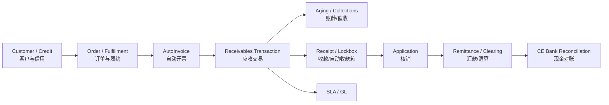
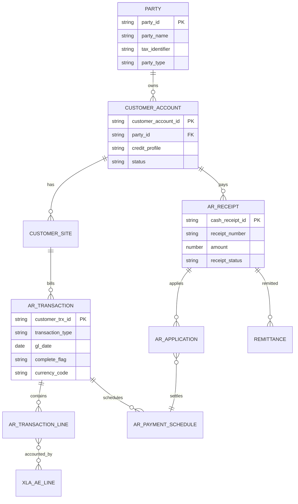
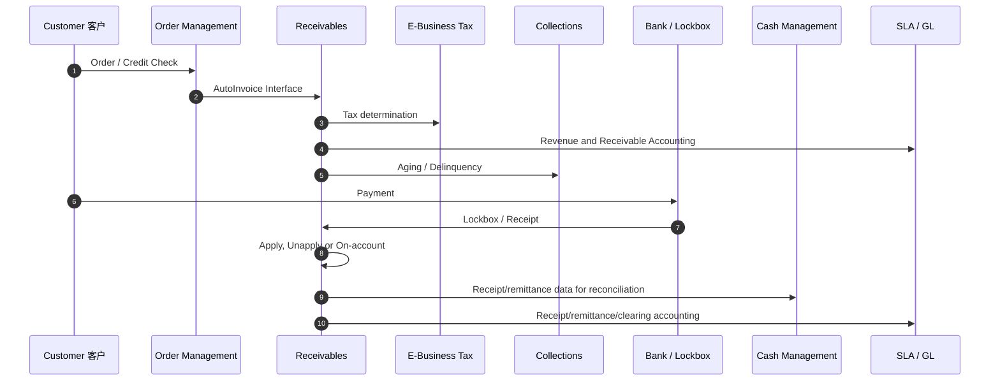
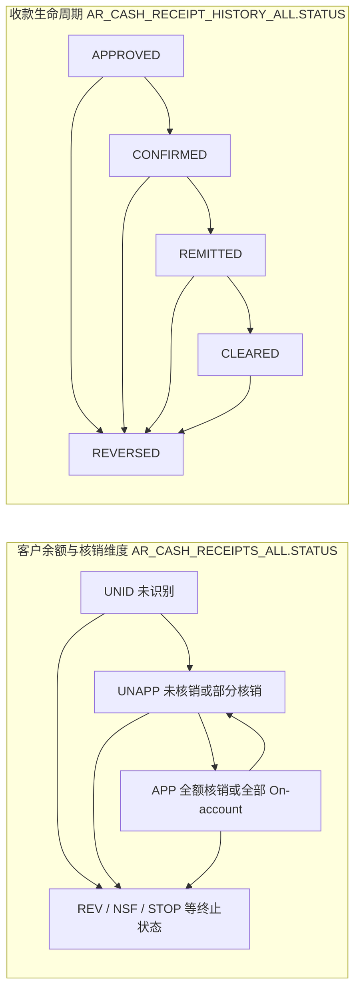

# 信用到收款（Credit to Cash，C2C）

> C2C 覆盖客户主数据、信用、订单/开票边界、应收交易、收款、核销、催收、争议、银行对账和收入/应收会计。

## 阅读导航

- [范围](#1-学习目标与范围) · [业务主链](#2-业务主链) · [对象与状态](#3-关键对象与状态) · [功能设计](#4-功能设计重点) · [会计对账](#5-会计与对账) · [接口排错](#6-技术与接口视角) · [页面与收款实操](#9-资深顾问实操开票收款与信用) · [专题详解](#10-专题详解)

## 模块业务架构与核心 ER 图

### C2C 业务架构图



### C2C 核心 ER 图



该逻辑模型把 TCA、交易、付款计划、收款核销和会计连接起来；客户账户与 Party 的实际表关系及本地化字段须以目标实例核对。

## 1. 学习目标与范围

应能区分 TCA 客户模型、Credit Management（信用管理）、Receivables（应收，AR）、Advanced Collections（高级催收）、iReceivables（客户自助应收）、Order Management（订单管理，OM）与 CE 的边界，并能设计 AutoInvoice、Lockbox（自动收款箱）、收款核销和 AR-GL 对账。

## 2. 业务主链

```text
客户/信用评估 → 订单与履约 → AutoInvoice/手工开票 → 收入与应收
→ 到期与催收 → 收款/Lockbox → 核销/On-account/Unapplied
→ 银行清算与对账 → 调整/贷项/坏账 → GL
```

## 3. 关键对象与状态

TCA 中 Party（参与方）是现实主体，Customer Account（客户账户）是商业关系，Account Site/Site Use（账户地点/用途）承载 Bill-to、Ship-to 等用途。Transaction Type（交易类型）影响会计、余额和后续处理；Receipt Class/Method（收款分类/方法）控制确认、汇款和清算路径。

收款不能简单分为“已收/未收”，也不能把核销状态和银行处理状态串成一条状态链。`AR_CASH_RECEIPTS_ALL.STATUS` 反映客户余额/核销维度（如 `UNID`、`UNAPP`、`APP`、`REV`、`NSF`、`STOP`）；`AR_CASH_RECEIPT_HISTORY_ALL.STATUS` 反映收款生命周期（如 `APPROVED`、`CONFIRMED`、`REMITTED`、`CLEARED`、`REVERSED`）。`APP` 还可能表示全部转为 On-account；部分核销后通常仍为 `UNAPP`。两类状态应分别查询和解释。

## 4. 功能设计重点

### 4.1 信用与争议

信用额度、评分、检查规则、订单 Hold 和人工复核要有明确责任边界。Deduction（扣款）与 Dispute（争议）必须记录原因、所有者、证据、处理时限和最终的贷项/调整/收回结果，避免长期停留在未核销收款。

### 4.2 AutoInvoice

AutoInvoice（自动开票）把 OM、Projects 或外部来源送入 AR。设计时确定 Transaction Source、Transaction Type、Line/Tax/Freight 关联、分组规则、会计日期、销售人员和收入账户来源。接口成功标准应包括业务数量、金额、税额、拒绝数和生成交易号。

### 4.3 Lockbox 与收款

Lockbox 处理银行收款文件、客户识别和自动核销。匹配规则应有优先级与置信度；无法可靠识别的款项进入例外队列，不应为了自动率牺牲错误核销风险。

## 5. 会计与对账

常见分录（以 SLA 为准）：

```text
开票：Dr Receivables   Cr Revenue/Tax/Freight
收款：Dr Cash/Clearing Cr Receivables 或 Unapplied/On-account
清算：Dr Cash          Cr Cash Clearing
调整/贷项：按交易类型和活动规则冲减应收、收入或费用
```

月结依次清理 AutoInvoice 拒绝、未完成交易、未会计收款/调整、未传 GL 分录、未核销/未识别款项，再核对 Aging（账龄）、AR Trial Balance、收款清算和 GL 应收控制账户。

## 6. 技术与接口视角

常用对象：`HZ_PARTIES`、`HZ_CUST_ACCOUNTS`、`HZ_CUST_ACCT_SITES_ALL`、`RA_CUSTOMER_TRX_ALL`、`RA_CUSTOMER_TRX_LINES_ALL`、`AR_PAYMENT_SCHEDULES_ALL`、`AR_CASH_RECEIPTS_ALL`、`AR_RECEIVABLE_APPLICATIONS_ALL` 和 XLA 表。

接口必须保留来源业务键、原始单据号、批次、行关联、币种、金额、会计日期和处理状态。对 AutoInvoice 和 Lockbox 的重跑，应先判断接口记录、已生成业务单据和部分成功情况，确保幂等。

## 7. 高频问题定位

| 现象 | 优先检查 |
| --- | --- |
| AutoInvoice 拒绝 | 来源/类型、客户用途、行关联、会计日期、币种和分配 |
| 收款无法自动核销 | 客户/交易识别、金额容差、核销规则和币种 |
| 账龄与 GL 不符 | 截止日期、未会计/未传输、手工 GL、账户和期间 |
| 信用 Hold 不符合预期 | 信用配置、客户层级、订单条件、并发评估和人工覆盖 |
| 银行已到账但 AR 未清 | Lockbox、汇款、清算和 CE 对账状态 |

## 8. 建议练习

- 完成外部订单经 AutoInvoice 开票、部分收款、扣款和最终核销案例。
- 设计 Lockbox 匹配优先级和例外队列。
- 从账龄差异反向定位到交易、核销、XLA 和 GL。

## 9. 资深顾问实操：开票、收款与信用

### 9.1 C2C 时序图



### 9.2 页面剧本：创建应收交易

**常见职责与导航**：`Receivables Manager（应收经理） → Transactions（交易） → Transactions`，进入 Transactions Workbench（交易工作台）。

1. 确认 OU、Customer Account、Bill-to/Ship-to Site Use、Transaction Source 和 Transaction Type。
2. 输入 Transaction Date、GL Date、Currency、Payment Terms、Reference 和必要 DFF。
3. 录入 Lines：项目/说明、数量、单价；核对税分类、税额和收入规则。
4. 查看 Distributions，确认 Receivable、Revenue、Tax、Freight、Unearned/Unbilled 等账户来源。
5. Complete（完成）交易；若不能完成，检查客户用途、AutoAccounting、期间、税和借贷平衡。
6. 运行 Create Accounting，并从 View Accounting 验证 SLA/GL。
7. 打印/交付发票并保留版本；打印后变更受 System Options 和内控约束。

### 9.3 页面剧本：录入并核销收款

**常见职责与导航**：`Receivables Manager → Receipts（收款） → Receipts`，进入 Receipts Workbench（收款工作台）。

1. 输入 Receipt Method、Receipt Number、Customer、Receipt Date、GL Date、Currency 和 Amount。
2. 保存后进入 Applications，按交易号或客户未结项查询。
3. 核销到 Invoice/Debit Memo，或按批准原因保留 Unapplied/On-account；核对余额和折扣。
4. 需要撤销核销时使用 Unapply，并记录业务原因；不能删除已形成会计或银行链的结果。
5. 根据 Receipt Class 完成 Confirmation、Remittance 和 Clearing；与 CE 银行对账状态保持一致。
6. 运行 Create Accounting，验证 Cash/Clearing、Receivable、Unapplied/On-account 会计。

### 9.4 AutoInvoice 操作与验收

1. 在来源系统/接口暂存层核对批次、交易头/行/分配、客户、币种、日期和控制总额。
2. 提交 AutoInvoice Import（自动开票导入），参数至少记录 Transaction Source、日期范围和 Batch Source。
3. 查看 AutoInvoice Execution/Validation Report，区分接口拒绝与已生成交易。
4. 对拒绝行按 Interface Line ID 和错误原因修正；重跑前排除已成功生成的交易。
5. 对生成交易抽样检查 Grouping Rule、Transaction Number、Tax、AutoAccounting、Complete 状态和会计日期。
6. 用来源数量/金额/税额 = 成功交易 + 拒绝记录建立批次平衡。

### 9.5 收款的两个状态维度



两条轴可以并行变化：收款可在未完全核销时进入汇款/清算流程，并不要求先变为 `APP`。实际生命周期受 Receipt Class、Method、确认/汇款方式和本地化影响；逆向处理前必须同时判断核销、银行清算、会计过账及下游催收/退款状态。

### 9.6 信用与催收高级控制

| 场景 | 资深顾问的设计问题 | 验收证据 |
| --- | --- | --- |
| 信用检查 | 检查层级、额度、风险类别、到期余额、人工覆盖 | 通过/失败/覆盖三类订单 |
| 逾期催收 | Aging Bucket、评分、策略工作项、承诺付款 | 策略执行与活动历史 |
| 争议与扣款 | 原因、所有者、审批、贷项/调整/收回路径 | 争议账龄和结案会计 |
| 退款 | 原收款、贷项、最低金额、支付方式和 IBY/AP 边界 | 退款审批、付款和核销 |
| 坏账 | 资格、核销账户、税务影响和追收 | 审批、会计、后续收回 |

### 9.7 月结页面检查

检查未完成交易、AutoInvoice 拒绝、未核销/未识别收款、未确认/汇款/清算收款、未会计事件和未传 GL 分录；运行 Aging、AR Reconciliation/Trial Balance 及 Create Accounting。差异按 Transaction/Receipt、Schedule、Application、XLA 和 GL 分层定位。

### 9.8 官方操作依据

- [Oracle Receivables User Guide — Contents](https://docs.oracle.com/cd/E26401_01/doc.122/f10570/toc.htm)
- [Oracle Receivables User Guide — AutoAccounting](https://docs.oracle.com/cd/E26401_01/doc.122/f10570/T355475T355481.htm)

## 10. 专题详解


<!-- source: docs/03-ar/README.md -->
<a id="src-docs-03-ar-readme"></a>
### Oracle Receivables（AR / Credit to Cash）


本目录覆盖客户主数据、应收交易、收款与核销、信用/催收、AutoInvoice/Lockbox、子账会计和关账。订单管理、Shipping 与税务并不属于 AR 的独立账簿边界，但会决定交易来源、开票时点和收入/税务结果。

<a id="src-docs-03-ar-readme--专题导航"></a>
#### 专题导航

- [O2C 子账流程](#src-docs-03-ar-process)
- [客户、地点与信用](#src-docs-03-ar-customers-credit)
- [交易、贷项通知单与调整](#src-docs-03-ar-transactions)
- [收款、Lockbox 与退款](#src-docs-03-ar-receipts)
- [催收、账龄与核销](#src-docs-03-ar-collections-aging)
- [信用、催收、争议与客户自助](#src-docs-03-ar-credit-collections-ireceivables)
- [会计、月结与报表](#src-docs-03-ar-accounting-close-reports)
- [表结构](#src-docs-03-ar-tables)
- [AutoInvoice/Lockbox 实现](#src-docs-03-ar-interfaces)
- [接口排错](#src-docs-03-ar-interfaces-troubleshooting)

<a id="src-docs-03-ar-readme--核心业务链"></a>
#### 核心业务链

```text
TCA Party / Account / Site
  → Transaction Source / Type / Line
  → Complete → Create Accounting → Transfer/Post
  → Payment Schedule（未结余额）
  → Receipt → Application / Unapplication / Reversal
  → CE 对账 → Aging、AR Trial Balance、GL 对账
```

<a id="src-docs-03-ar-readme--关键控制"></a>
#### 关键控制

- 客户、客户账户、地点和付款地点必须分层治理；不要仅以显示名称作为唯一业务键。
- AutoInvoice 必须具备来源系统业务键、接口批次、幂等策略与拒绝行回写；重传前先确认原交易是否已成功创建。
- 收款应用、核销、退款、调整、坏账和催收策略都可能影响账龄和会计，需保留批准与对账证据。
- 交易、收款、SLA 与 GL 的断点应按 `CUSTOMER_TRX_ID`、`CASH_RECEIPT_ID`、`EVENT_ID` 和 `GL_SL_LINK_ID` 分层定位。

<a id="src-docs-03-ar-readme--官方依据"></a>
#### 官方依据

- [Oracle Receivables Documentation](https://docs.oracle.com/cd/E26401_01/nav/financials.htm)
- [Oracle Advanced Collections Documentation](https://docs.oracle.com/cd/E26401_01/nav/financials.htm)


<!-- source: docs/03-ar/accounting-close-reports.md -->
<a id="src-docs-03-ar-accounting-close-reports"></a>
### AR 会计、过账、月结与报表


<a id="src-docs-03-ar-accounting-close-reports--会计流"></a>
#### 会计流

```text
Transaction/Receipt/Adjustment Event
→ Create Accounting → XLA → Transfer to GL
→ Journal Import → Post → Reconcile
```

典型分录（以实际 AutoAccounting/SLA 为准）：Invoice 借 Receivable/贷 Revenue+Tax；Receipt 借 Cash/Remittance/未核销、贷 Receivable；Clear 在 Cash Clearing 与 Cash 间转换；Adjustment 在 Receivable 与 Adjustment Account 间转换。

<a id="src-docs-03-ar-accounting-close-reports--月结"></a>
#### 月结

1. 完成 AutoInvoice/Lockbox，处理未完成交易、未识别/未核销收款、待批调整。
2. 检查发票/收款 GL Date、交易税、外币和未处理接口。
3. 运行 Create Accounting Final、Transfer to GL、Journal Import/Post。
4. 运行 Aging、Transaction/Receipt Register、Journal Entries Report、Unaccounted Transactions、AR to GL Reconciliation。
5. 对账 Receivable、Revenue、Tax、Unapplied/Unidentified、Cash/Clearing 账户，再关闭 AR 期间。

<a id="src-docs-03-ar-accounting-close-reports--sql"></a>
#### SQL

```sql
-- 未会计/未转 GL 的 AR SLA 头
SELECT xah.ledger_id, xah.accounting_entry_status_code,
       xah.gl_transfer_status_code, COUNT(*) cnt
  FROM xla_ae_headers xah
 WHERE xah.application_id = 222
   AND xah.accounting_date BETWEEN :p_start_date AND :p_end_date
 GROUP BY xah.ledger_id, xah.accounting_entry_status_code,
          xah.gl_transfer_status_code;

-- 交易 GL 分配
SELECT customer_trx_id, account_class, latest_rec_flag,
       code_combination_id, gl_date, amount, acctd_amount,
       account_set_flag
  FROM ra_cust_trx_line_gl_dist_all
 WHERE customer_trx_id = :p_customer_trx_id
 ORDER BY cust_trx_line_gl_dist_id;

-- 当前开放余额汇总，不替代历史 Trial Balance
SELECT org_id, class, invoice_currency_code,
       SUM(amount_due_remaining) amount_remaining
  FROM ar_payment_schedules_all
 WHERE status = 'OP'
   AND org_id = :p_org_id
 GROUP BY org_id, class, invoice_currency_code;
```

<a id="src-docs-03-ar-accounting-close-reports--差异排查"></a>
#### 差异排查

- 统一 Ledger/OU、As-of Date、Currency、Account Range 和 Posted 参数。
- 分别检查未会计、未转 GL、未 Import、未 Post、GL 手工调整。
- 使用 AR to GL Reconciliation 标准报表区分 Receivables/Revenue/Tax 差异，不用当前 `AMOUNT_DUE_REMAINING` 替代历史快照。
- 收款差异应同时跟踪 Receipt History、Application、CE Reconciliation 和 SLA。

<a id="src-docs-03-ar-accounting-close-reports--关联"></a>
#### 关联

- [SLA](01-foundation.md#src-docs-01-common-sla)
- [GL 结账](02-record-to-report.md#src-docs-04-gl-close-reports)


<!-- source: docs/03-ar/collections-aging.md -->
<a id="src-docs-03-ar-collections-aging"></a>
### AR 催收、账龄、坏账准备与核销


<a id="src-docs-03-ar-collections-aging--原理"></a>
#### 原理

Aging 以 `AR_PAYMENT_SCHEDULES_ALL` 的 Due Date、Amount Due Remaining 和截止日计算，必须正确纳入发票、Debit Memo、Credit Memo、Chargeback 及收款。当前余额不等于历史截止日余额；历史 Aging 需考虑截止日后的核销/调整。

Collections 可使用 Dunning Letters/Statements 或 Advanced Collections 的 Scoring、Strategy、Work Item、Promise to Pay、Dispute。坏账准备可通过 SLA/GL 调整流程实现；核销通常使用 Adjustment/Receivables Activity，需保留审批与税务证据。

<a id="src-docs-03-ar-collections-aging--配置"></a>
#### 配置

- Aging Buckets、Statement Cycle、Dunning/Collections Profile、Collector、Customer Profile Class。
- Adjustment Activity、Approval Limit、Reason、Write-off Account/SLA。
- Advanced Collections 的 Scoring Engine、Strategy Template、Work Items、Territory/Collector 分配。
- 信用损失政策需与会计准则、账龄、历史回收率和管理审批一致。

<a id="src-docs-03-ar-collections-aging--sql"></a>
#### SQL

```sql
-- 当前开放应收简表，历史 Aging 请使用标准报表
SELECT aps.org_id, aps.customer_id, aps.customer_site_use_id,
       aps.class, aps.trx_number, aps.due_date,
       TRUNC(:p_as_of_date) - TRUNC(aps.due_date) days_past_due,
       aps.invoice_currency_code, aps.amount_due_original,
       aps.amount_due_remaining
  FROM ar_payment_schedules_all aps
 WHERE aps.status = 'OP'
   AND aps.gl_date <= :p_as_of_date
   AND aps.org_id = :p_org_id
 ORDER BY aps.customer_id, aps.due_date;

SELECT customer_id, SUM(amount_due_remaining) open_amount
  FROM ar_payment_schedules_all
 WHERE org_id = :p_org_id
   AND status = 'OP'
 GROUP BY customer_id
 ORDER BY open_amount DESC;
```

<a id="src-docs-03-ar-collections-aging--排查"></a>
#### 排查

- Aging 与交易查询不一致：检查 As-of Date、GL Date、Currency、Open/Closed、截止日后 Application/Adjustment 和报表参数。
- Statement 漏单：查 Customer/Site Profile、Statement Flag/Cycle、Minimum Amount、Site Use 和交易完成状态。
- Collector 不正确：查 Profile Class/Account/Site 覆盖、Collector 有效期和 Collections 分配同步。
- Write-off 不能审批：查限额、Activity、Reason、Amount/Percentage、Period 和职责权限。

<a id="src-docs-03-ar-collections-aging--关联"></a>
#### 关联

- [Customer/Credit](#src-docs-03-ar-customers-credit)
- [AR 会计](#src-docs-03-ar-accounting-close-reports)


<!-- source: docs/03-ar/credit-collections-ireceivables.md -->
<a id="src-docs-03-ar-credit-collections-ireceivables"></a>
### 信用管理、催收、争议与客户自助


<a id="src-docs-03-ar-credit-collections-ireceivables--产品边界"></a>
#### 产品边界

Oracle Receivables 保存交易、收款和未结余额；Credit Management 对客户信用审核/额度提供决策；Advanced Collections 管理逾期、策略、承诺付款和催收工作；iReceivables/Bill Presentment 提供客户自助查询、在线付款等能力。它们均依赖 TCA 与 AR 的准确客户层级和账龄。

<a id="src-docs-03-ar-credit-collections-ireceivables--业务流程"></a>
#### 业务流程

```text
TCA Party / Account / Site
  → Credit Profile / Credit Review（可选）
  → AR Transaction / Payment Schedule
  → Aging / Delinquency
  → Strategy / Work Item / Dunning / Promise to Pay（可选）
  → Dispute / Adjustment / Write-off（审批）
  → Receipt / Application / Recovery / Reporting
```

<a id="src-docs-03-ar-credit-collections-ireceivables--配置与治理清单"></a>
#### 配置与治理清单

- 明确信用额度的层级（客户、账户、地点或业务单元）和审批责任，避免 OM/AR 使用不同的信用口径。
- 定义账龄桶、逾期日、催收等级、策略、工作项、信函模板和承诺付款的到期跟踪。
- 争议、扣款、坏账、核销、重分类和追回必须区分业务原因、审批权限、会计事件和审计证据。
- 客户自助/在线支付仅在已部署产品、DMZ/SSO、安全证书和隐私要求均满足时启用。

<a id="src-docs-03-ar-credit-collections-ireceivables--常用诊断-sql"></a>
#### 常用诊断 SQL

```sql
-- AR 未结余额是账龄和催收的基础；金额字段须按报表口径核实。
select aps.customer_id,
       aps.customer_trx_id,
       aps.payment_schedule_id,
       aps.due_date,
       aps.amount_due_original,
       aps.amount_due_remaining,
       aps.status
  from ar_payment_schedules_all aps
 where aps.org_id = :p_org_id
   and aps.status = 'OP'
   and aps.amount_due_remaining <> 0
   and aps.due_date < :p_as_of_date
 order by aps.customer_id, aps.due_date;

-- 客户账户与地点的有效性必须从 TCA 维度确认，避免仅按显示名称处理。
select hca.account_number,
       hp.party_name,
       hca.status
  from hz_cust_accounts hca
  join hz_parties hp
    on hp.party_id = hca.party_id
 where hca.cust_account_id = :p_cust_account_id;
```

<a id="src-docs-03-ar-credit-collections-ireceivables--排错方法"></a>
#### 排错方法

1. 先确认客户/账户/地点、交易与收款应用是否处于预期状态；账龄异常常由未应用、反应用、冲销或错误截止日期引起。
2. 再检查信用/催收产品是否已安装且数据同步/并发程序正常，不将未部署产品的对象误作基础 AR 缺陷。
3. 对争议和坏账先核对批准、原因码、原交易/收款关系和 SLA，再核查 GL 差异。

<a id="src-docs-03-ar-credit-collections-ireceivables--官方参考"></a>
#### 官方参考

- [Oracle Credit Management Documentation](https://docs.oracle.com/cd/E26401_01/nav/financials.htm)
- [Oracle Advanced Collections Documentation](https://docs.oracle.com/cd/E26401_01/nav/financials.htm)
- [Oracle iReceivables Documentation](https://docs.oracle.com/cd/E26401_01/nav/financials.htm)


<!-- source: docs/03-ar/customers-credit.md -->
<a id="src-docs-03-ar-customers-credit"></a>
### 客户、客户地点、付款条件与信用管理


<a id="src-docs-03-ar-customers-credit--tca-模型"></a>
#### TCA 模型

```text
HZ_PARTIES（主体）
 → HZ_CUST_ACCOUNTS（客户账户）
   → HZ_CUST_ACCT_SITES_ALL（账户地点）
     → HZ_CUST_SITE_USES_ALL（Bill-To / Ship-To / Dunning）
HZ_PARTY_SITES → HZ_LOCATIONS（地址）
```

Party 表示真实世界主体，Customer Account 表示交易账户，Site Use 表示 OU 下的 Bill-To/Ship-To 用途。Profile 可在系统、Profile Class、Account、Site 层级默认，包括 Payment Terms、Credit Limit、Statement/Dunning、AutoCash 等。

<a id="src-docs-03-ar-customers-credit--设置与数据治理"></a>
#### 设置与数据治理

- 统一 Party/Account 命名、注册号/税号、地址标准化和重复防护。
- 明确 Bill-To 与 Ship-To 关系、Primary Use、OU、Tax、Price List、Sales Territory。
- 信用检查还可受 OM Credit Check Rule、Order Type、Payment Terms、Credit Exposure 和外部信用数据影响。
- Merge 必须用 TCA Customer Merge 标准流程，并先评估 OM、AR、IBY、Tax、Install Base 等下游。

<a id="src-docs-03-ar-customers-credit--sql"></a>
#### SQL

```sql
SELECT hp.party_id, hp.party_number, hp.party_name,
       hca.cust_account_id, hca.account_number,
       hca.status account_status, hca.customer_type
  FROM hz_parties hp
  JOIN hz_cust_accounts hca ON hca.party_id = hp.party_id
 WHERE hca.account_number = :p_account_number;

SELECT hcasa.cust_acct_site_id, hcasa.cust_account_id,
       hcasa.org_id, hcasa.status site_status,
       hcsua.site_use_id, hcsua.site_use_code,
       hcsua.status use_status, hcsua.primary_flag,
       hcsua.payment_term_id, hcsua.location
  FROM hz_cust_acct_sites_all hcasa
  JOIN hz_cust_site_uses_all hcsua
    ON hcsua.cust_acct_site_id = hcasa.cust_acct_site_id
 WHERE hcasa.cust_account_id = :p_cust_account_id
 ORDER BY hcasa.org_id, hcsua.site_use_code;
```

<a id="src-docs-03-ar-customers-credit--排查"></a>
#### 排查

- Customer/Site LOV 缺失：检查 Account/Site/Site Use 状态、OU、用途、有效日期和职责 MOAC。
- Bill-To 不可用：检查 Site Use `BILL_TO`、Primary、Payment Term、Currency/Tax 必要数据。
- Credit Hold：分析 Credit Limit、Open AR、Open Orders、未入账交易、客户层级和 OM 规则，不直接更新 Hold Flag。
- 重复客户：同时比较名称、税号、地址、电话/邮箱，避免仅按名称误合并。

<a id="src-docs-03-ar-customers-credit--关联"></a>
#### 关联

- [AR 交易](#src-docs-03-ar-transactions)
- [收款](#src-docs-03-ar-receipts)


<!-- source: docs/03-ar/interfaces-troubleshooting.md -->
<a id="src-docs-03-ar-interfaces-troubleshooting"></a>
### AutoInvoice、Lockbox 接口与排错


> 需要 AutoInvoice、收入分配、AutoLockbox 和 ISG REST 的完整代码，请先读 [AR 接口实现案例](#src-docs-03-ar-interfaces)。

<a id="src-docs-03-ar-interfaces-troubleshooting--autoinvoice"></a>
#### AutoInvoice

```text
OM/Projects/External System
→ RA_INTERFACE_LINES_ALL (+ DISTRIBUTIONS/SALESCREDITS)
→ AutoInvoice Import
→ RA_CUSTOMER_TRX_ALL / Lines / GL Distributions
```

`INTERFACE_LINE_CONTEXT + INTERFACE_LINE_ATTRIBUTE1..15` 应组成稳定的外部唯一键和 Drilldown 键。Grouping Rule 决定哪些行合并到同一交易；Transaction Source 决定自动编号、字段验证和引用规则。

<a id="src-docs-03-ar-interfaces-troubleshooting--lockbox"></a>
#### Lockbox

```text
Bank File → SQL*Loader/Transmission
→ AR_PAYMENTS_INTERFACE_ALL / Interim Tables
→ Validate Lockbox → Post QuickCash
→ Cash Receipt + Applications
```

<a id="src-docs-03-ar-interfaces-troubleshooting--sql"></a>
#### SQL

```sql
SELECT interface_line_id, interface_line_context,
       interface_line_attribute1, batch_source_name,
       line_type, amount, currency_code, trx_date, gl_date,
       orig_system_bill_customer_id,
       orig_system_bill_address_id, org_id, request_id
  FROM ra_interface_lines_all
 WHERE interface_line_context = :p_context
   AND interface_line_attribute1 = :p_external_key;

SELECT ril.interface_line_id, rie.message_text,
       rie.invalid_value
  FROM ra_interface_lines_all ril
  JOIN ra_interface_errors_all rie
    ON rie.interface_line_id = ril.interface_line_id
 WHERE ril.request_id = :p_request_id
 ORDER BY ril.interface_line_id;

SELECT transmission_record_id, transmission_id, record_type,
       status, amount, item_number, customer_number,
       invoice1, org_id
  FROM ar_payments_interface_all
 WHERE transmission_id = :p_transmission_id
 ORDER BY transmission_record_id;
```

<a id="src-docs-03-ar-interfaces-troubleshooting--排查"></a>
#### 排查

- AutoInvoice 无数据：检查 Source/Group ID/ORG_ID 参数、`REQUEST_ID`、已处理标志和 MOAC。
- Invalid Bill-to：检查 TCA Account/Site Use、OU、Status、Orig System Reference 和 ID/Reference 使用方式。
- Grouping 异常：输出 Grouping Rule 字段，比较 Currency、Terms、Bill-to、Source、Trx Date、Reference。
- Invalid Tax/Account：分别检查 EBTax 确定因素和 AutoAccounting/SLA，不通过接口硬塞一个无效 CCID。
- Lockbox 控制总数错：对比 Header/Trailer 记录数、金额、小数位、正负号和 Transmission Format。
- Lockbox 无法识别客户/发票：检查 Matching Order、Customer/Invoice/Bank Account 引用和 AutoCash Rules。

<a id="src-docs-03-ar-interfaces-troubleshooting--关联"></a>
#### 关联

- [AR 交易](#src-docs-03-ar-transactions)
- [AR 收款](#src-docs-03-ar-receipts)
- [集成设计](10-technical.md#src-docs-09-technical-integration)

<a id="src-docs-03-ar-interfaces-troubleshooting--官方参考"></a>
#### 官方参考

- [Oracle Receivables Implementation Guide R12.2](https://docs.oracle.com/cd/E26401_01/doc.122/f10310/)


<!-- source: docs/03-ar/interfaces.md -->
<a id="src-docs-03-ar-interfaces"></a>
### Oracle Receivables 接口实现案例


<a id="src-docs-03-ar-interfaces--1-业界常用场景"></a>
#### 1. 业界常用场景

| 场景 | 推荐接口 | 说明 |
| --- | --- | --- |
| 电商/计费系统导入销售发票 | AutoInvoice Interface | 支持 Invoice/Debit Memo/Credit Memo/On-account Credit |
| OM/Shipping 开票 | Invoice Interface Workflow + AutoInvoice | 保留 `ORDER ENTRY` Transaction Flexfield |
| 银行收款文件 | AutoLockbox | Import → Validate → QuickCash/Post |
| POS/支付平台实时收款 | 公开 Receipt API 或 IBY Funds Capture | 以当前 Integration Repository 签名为准 |
| 客户主数据同步 | TCA Customer Interface/公开 TCA API | 避免直接 DML `HZ_*` |

<a id="src-docs-03-ar-interfaces--2-autoinvoice-实现"></a>
#### 2. AutoInvoice 实现

<a id="src-docs-03-ar-interfaces--21-最小非-po-销售发票行"></a>
##### 2.1 最小非 PO 销售发票行

```sql
DECLARE
  l_interface_line_id NUMBER := ra_customer_trx_lines_s.NEXTVAL;
BEGIN
  INSERT INTO ra_interface_lines_all (
    interface_line_id,
    interface_line_context,
    interface_line_attribute1,
    interface_line_attribute2,
    batch_source_name,
    line_type,
    description,
    currency_code,
    amount,
    cust_trx_type_name,
    term_name,
    trx_date,
    gl_date,
    quantity,
    unit_selling_price,
    orig_system_bill_customer_id,
    orig_system_bill_address_id,
    org_id,
    created_by,
    creation_date,
    last_updated_by,
    last_update_date
  ) VALUES (
    l_interface_line_id,
    'XX_BILLING',
    :p_external_invoice_id,
    :p_external_line_id,
    'XX BILLING SOURCE',
    'LINE',
    :p_description,
    :p_currency_code,
    :p_line_amount,
    'Invoice',
    :p_payment_term_name,
    :p_trx_date,
    :p_gl_date,
    :p_quantity,
    :p_unit_selling_price,
    :p_cust_account_id,
    :p_bill_to_address_id,
    :p_org_id,
    fnd_global.user_id,
    SYSDATE,
    fnd_global.user_id,
    SYSDATE
  );

  COMMIT;
  dbms_output.put_line('INTERFACE_LINE_ID=' || l_interface_line_id);
END;
/
```

`ORIG_SYSTEM_BILL_ADDRESS_ID` 的目标对象与 Batch Source 的 ID/Reference 验证方式必须在目标实例中确认。如使用 `*_REF` 字段，不应同时传入互相矛盾的 ID。

<a id="src-docs-03-ar-interfaces--22-指定收入账户autoaccounting-可派生时不必传"></a>
##### 2.2 指定收入账户（AutoAccounting 可派生时不必传）

```sql
INSERT INTO ra_interface_distributions_all (
  interface_line_id,
  interface_line_context,
  interface_line_attribute1,
  interface_line_attribute2,
  account_class,
  code_combination_id,
  percent,
  org_id,
  created_by,
  creation_date,
  last_updated_by,
  last_update_date
) VALUES (
  :p_interface_line_id,
  'XX_BILLING',
  :p_external_invoice_id,
  :p_external_line_id,
  'REV',
  :p_revenue_ccid,
  100,
  :p_org_id,
  fnd_global.user_id,
  SYSDATE,
  fnd_global.user_id,
  SYSDATE
);
```

在多数实施中，建议由 AutoAccounting/SLA 统一派生账户；仅在有明确业务要求、Batch Source 允许且 CCID 经验证时由源系统传账户。

<a id="src-docs-03-ar-interfaces--23-税务实现"></a>
##### 2.3 税务实现

推荐传送 Tax Determining Factors（如 Product Fiscal Classification/Tax Classification、Ship-to/Bill-to），由 EBTax 计算；不推荐源系统直接传 Tax Amount 覆盖 EBTax。必须传税行时，`LINE_TYPE='TAX'` 的必填/禁填字段以 Receivables Reference Guide 为准。

<a id="src-docs-03-ar-interfaces--3-提交-autoinvoice"></a>
#### 3. 提交 AutoInvoice

```sql
DECLARE
  l_request_id NUMBER;
BEGIN
  fnd_global.apps_initialize(:p_user_id, :p_resp_id, :p_resp_appl_id);
  mo_global.init('AR');
  mo_global.set_policy_context('S', :p_org_id);

  l_request_id := fnd_request.submit_request(
    application => 'AR',
    program     => 'RAXTRX',
    description => NULL,
    start_time  => NULL,
    sub_request => FALSE,
    argument1   => TO_CHAR(:p_org_id),
    argument2   => 'XX BILLING SOURCE',
    argument3   => :p_default_date
  );

  IF l_request_id = 0 THEN
    raise_application_error(-20020, fnd_message.get);
  END IF;
  COMMIT;
  dbms_output.put_line('REQUEST_ID=' || l_request_id);
END;
/
```

> `RAXTRX` 参数位置随程序定义和补丁级别可变。在目标实例核对 Program Parameters 后再封装；也可将 AutoInvoice Concurrent Program 作为 ISG REST 服务部署。

<a id="src-docs-03-ar-interfaces--4-autoinvoice-错误与成功对账"></a>
#### 4. AutoInvoice 错误与成功对账

```sql
-- 错误
SELECT ril.interface_line_id,
       ril.interface_line_context,
       ril.interface_line_attribute1,
       ril.interface_line_attribute2,
       rie.message_text,
       rie.invalid_value
  FROM ra_interface_lines_all ril
  JOIN ra_interface_errors_all rie
    ON rie.interface_line_id = ril.interface_line_id
 WHERE ril.interface_line_context = 'XX_BILLING'
   AND ril.interface_line_attribute1 = :p_external_invoice_id;

-- 成功生成的 AR 行
SELECT rctl.customer_trx_id,
       rcta.trx_number,
       rctl.customer_trx_line_id,
       rctl.line_number,
       rctl.extended_amount
  FROM ra_customer_trx_lines_all rctl
  JOIN ra_customer_trx_all rcta
    ON rcta.customer_trx_id = rctl.customer_trx_id
 WHERE rctl.interface_line_context = 'XX_BILLING'
   AND rctl.interface_line_attribute1 = :p_external_invoice_id
 ORDER BY rctl.line_number;
```

Transaction Flexfield 必须在 AR 中定义并设置唯一性，才能成为可靠的幂等/Drilldown 键。

<a id="src-docs-03-ar-interfaces--5-autolockbox-银行收款案例"></a>
#### 5. AutoLockbox 银行收款案例

```text
Bank statement/lockbox file
→ SFTP landing + checksum/archive
→ SQL*Loader control file
→ AR_PAYMENTS_INTERFACE_ALL
→ AutoLockbox Import
→ Validate
→ QuickCash/Post
→ AR_CASH_RECEIPTS_ALL + AR_RECEIVABLE_APPLICATIONS_ALL
```

业界常用于银行代收、零售门店汇总收款、B2B 虚拟账号收款。文件必须保存 Bank Account + File Sequence + File Hash，防止同一文件被重复 Import/Apply。Oracle 官方也提醒 AutoLockbox 需建立操作控制避免重复处理银行文件。

<a id="src-docs-03-ar-interfaces--6-isg-autoinvoice-rest-调用方式"></a>
#### 6. ISG AutoInvoice REST 调用方式

Oracle 官方以 Open Interface `RAXMTR` 作为 REST 示例。管理员在 Integration Repository 部署后，必须从当前实例 WADL 取得真实 endpoint/operation/payload schema。

```bash
curl --fail-with-body \
  --request POST \
  --url 'https://ebs.example.com/webservices/rest/<alias>/<operation>/' \
  --user '<EBS_USER>' \
  --header 'Content-Type: application/json' \
  --header 'X-Correlation-ID: BILLING-20260822-0001' \
  --data @autoinvoice-line.json
```

示例采用 ISG 原生支持的 HTTPS Basic Authentication，`curl` 会交互提示密码；不要把密码写入命令行历史、源码或日志。也可调用 Login Service 取得 EBS Security Token，并按官方方式作为会话 Cookie 传递；它不是 OAuth Bearer Token。应用上下文参数须以当前实例 WADL 的 `RESTHeader` 定义为准。Open Interface REST 只负责写入接口数据，仍需调用 AutoInvoice Concurrent Program 完成业务导入。

<a id="src-docs-03-ar-interfaces--7-关联文档"></a>
#### 7. 关联文档

- [AutoInvoice/Lockbox 排错](#src-docs-03-ar-interfaces-troubleshooting)
- [AR 常用表](#src-docs-03-ar-tables)
- [EBTax](06-cash-tax.md#src-docs-07-ce-tax-ebtax)

<a id="src-docs-03-ar-interfaces--8-官方参考"></a>
#### 8. 官方参考

- [Oracle Receivables Reference Guide: Interface Tables](https://docs.oracle.com/cd/E26401_01/doc.122/f10312/T447348T383863.htm)
- [Oracle Receivables User Guide: AutoInvoice](https://docs.oracle.com/cd/E26401_01/doc.122/f10570/T355475T382065.htm)
- [Oracle Receivables User Guide: AutoLockbox](https://docs.oracle.com/cd/E26401_01/doc.122/f10570/T355475T382159.htm)
- [ISG Developer's Guide: Open Interface REST Services](https://docs.oracle.com/cd/E26401_01/doc.122/e20927/T511473T669558.htm)
- [ISG Implementation Guide: Authentication Types](https://docs.oracle.com/cd/E26401_01/doc.122/e20925/T511175T513091.htm)


<!-- source: docs/03-ar/process.md -->
<a id="src-docs-03-ar-process"></a>
### Oracle Receivables 业务流程（O2C 子账视角）


<a id="src-docs-03-ar-process--主流程"></a>
#### 主流程

```text
Customer/Account/Site → Order → Ship → AutoInvoice/Manual Transaction
→ Complete → Revenue/Tax → Create Accounting
→ Receipt/Lockbox → Apply/Unapply/Adjust/Refund
→ Transfer/Post GL → Reconcile → Close
```

AR 发票头/行为 `RA_CUSTOMER_TRX_ALL/RA_CUSTOMER_TRX_LINES_ALL`，会计分配为 `RA_CUST_TRX_LINE_GL_DIST_ALL`，未收分期为 `AR_PAYMENT_SCHEDULES_ALL`，收款为 `AR_CASH_RECEIPTS_ALL`，核销历史为 `AR_RECEIVABLE_APPLICATIONS_ALL`。客户主数据使用 TCA，AR 交易以 OU 隔离。

<a id="src-docs-03-ar-process--配置主线"></a>
#### 配置主线

1. 完成 Ledger/OU/MOAC、AR System Options、Receivables Activities、AutoAccounting。
2. 定义 Transaction Source/Type、Payment Terms、Memo Lines、Salesperson、Document Sequence。
3. 定义 Receipt Class/Method、Remittance Bank、Lockbox、AutoCash Rule Set、Application Rule Set。
4. 配置 TCA Customer、Account/Site Use、Profile/Credit、Tax、Revenue Scheduling/SLA。
5. 测试手工/AutoInvoice、Credit Memo、Receipt/Application、Chargeback、Adjustment、Refund、Unidentified/Unapplied 及外币。

<a id="src-docs-03-ar-process--sql"></a>
#### SQL

```sql
SELECT rcta.customer_trx_id, rcta.trx_number, rcta.org_id,
       rcta.cust_trx_type_id, rcta.bill_to_customer_id,
       rcta.trx_date, rcta.invoice_currency_code,
       rcta.complete_flag, rcta.previous_customer_trx_id
  FROM ra_customer_trx_all rcta
 WHERE rcta.org_id = :p_org_id
   AND rcta.trx_number = :p_trx_number;

SELECT aps.payment_schedule_id, aps.class, aps.status,
       aps.due_date, aps.amount_due_original,
       aps.amount_due_remaining, aps.amount_applied,
       aps.amount_credited, aps.amount_adjusted
  FROM ar_payment_schedules_all aps
 WHERE aps.customer_trx_id = :p_customer_trx_id;
```

<a id="src-docs-03-ar-process--排查"></a>
#### 排查

- 交易不能 Complete：查 Line/Tax/Freight、GL Distribution、AutoAccounting、Payment Terms、Salesperson、Currency/Rate。
- 不能会计：查 Complete Flag、GL Date、Period、Revenue Contingency/Scheduling、XLA Event 和 CCID。
- 收款不能核销：查 Customer/Account/Site、Currency、Receipt Status、Open Balance、Application Date/GL Date。
- AR/GL 不平：按 Transaction/Receipt/Adjustment 分类，对比 SLA Transfer/Post、GL 手工分录和截止日。

<a id="src-docs-03-ar-process--关联"></a>
#### 关联

- [AR/TCA 常用表结构与字段含义](#src-docs-03-ar-tables)
- [O2C 端到端](09-end-to-end.md#src-docs-08-e2e-order-to-cash)
- [AR 会计结账](#src-docs-03-ar-accounting-close-reports)


<!-- source: docs/03-ar/receipts.md -->
<a id="src-docs-03-ar-receipts"></a>
### AR 收款、Lockbox、自动核销与退款


<a id="src-docs-03-ar-receipts--生命周期"></a>
#### 生命周期

```text
Receipt Enter/Lockbox → Confirm → Remit → Clear
             └→ Identify Customer → Apply / Unapply / On-account
                                      └→ Refund / Reverse
```

Receipt Class 定义 Confirmation/Remittance/Clearing 步骤，Receipt Method 关联账户和活动，AutoCash Rule Set 定义自动核销顺序。Receipt History 记录确认、托收、清算和反冲状态；Application 表中同一收款可有 Applied/Unapplied/On-account 等多行历史。

<a id="src-docs-03-ar-receipts--配置"></a>
#### 配置

- Receipt Class/Method、Remittance Bank Account、Receivables Activities、AutoCash Rule Set。
- Lockbox、Transmission Format、Data Record Mapping、Receipt Batch Source、AutoAssociate、Post QuickCash。
- Cross Currency Rate/Account、Unidentified/Unapplied/On-account、Bank Charges、Refund Activity。
- IBY 退款、CE 银行对账、SLA Cash/Clearing/Remittance 账户。

<a id="src-docs-03-ar-receipts--sql"></a>
#### SQL

```sql
SELECT acr.cash_receipt_id, acr.receipt_number, acr.org_id,
       acr.receipt_date, acr.gl_date, acr.currency_code,
       acr.amount, acr.status, acr.type,
       acr.pay_from_customer, acr.customer_site_use_id,
       acr.receipt_method_id, acr.reversal_date
  FROM ar_cash_receipts_all acr
 WHERE acr.cash_receipt_id = :p_cash_receipt_id;

SELECT ara.receivable_application_id, ara.status,
       ara.display, ara.apply_date, ara.gl_date,
       ara.amount_applied, ara.amount_applied_from,
       ara.applied_customer_trx_id, ara.applied_payment_schedule_id,
       ara.code_combination_id
  FROM ar_receivable_applications_all ara
 WHERE ara.cash_receipt_id = :p_cash_receipt_id
 ORDER BY ara.receivable_application_id;

SELECT cash_receipt_history_id, status, current_record_flag,
       trx_date, gl_date, amount, acctd_amount,
       first_posted_record_flag
  FROM ar_cash_receipt_history_all
 WHERE cash_receipt_id = :p_cash_receipt_id
 ORDER BY cash_receipt_history_id;
```

<a id="src-docs-03-ar-receipts--排查"></a>
#### 排查

- Lockbox 拒绝：查 Transmission Format/记录类型、金额控制总数、收款方法/银行、Customer/Invoice 引用和重复项。
- AutoCash 不核销：查 Rule Set 顺序、Customer Profile、折扣/容差、到期余额、参考匹配和币种。
- Receipt 状态不对：以 `AR_CASH_RECEIPT_HISTORY_ALL` 的 Current Record 和日期链路判断，不只看 Header Status。
- 无法 Reverse：检查后续 Refund/Chargeback、已核销交易、关闭期间和反冲日期。

<a id="src-docs-03-ar-receipts--关联"></a>
#### 关联

- [Cash Management](06-cash-tax.md#src-docs-07-ce-tax-cash-management)
- [AR 结账](#src-docs-03-ar-accounting-close-reports)


<!-- source: docs/03-ar/tables.md -->
<a id="src-docs-03-ar-tables"></a>
### Oracle Receivables 常用表结构


<a id="src-docs-03-ar-tables--业务说明"></a>
#### 业务说明

AR 由 TCA 客户主数据、交易头/行/会计分配、Payment Schedule 余额、Receipt 状态历史与 Application 历史组成。查当前余额可使用 Payment Schedules；查历史截止日余额必须纳入截止日后核销/反核销/调整，优先使用标准 Aging/Trial Balance。

<a id="src-docs-03-ar-tables--表级速查"></a>
#### 表级速查

| 表 | 中文名 | 粒度/用途 | 关键字段 |
| --- | --- | --- | --- |
| `HZ_PARTIES` | TCA 主体 | 组织/个人主体 | `PARTY_ID`, `PARTY_NUMBER`, `PARTY_TYPE` |
| `HZ_CUST_ACCOUNTS` | 客户账户 | Party 下的交易账户 | `CUST_ACCOUNT_ID`, `PARTY_ID`, `ACCOUNT_NUMBER` |
| `HZ_CUST_ACCT_SITES_ALL` | 客户账户地点 | Account+Party Site+OU | `CUST_ACCT_SITE_ID`, `CUST_ACCOUNT_ID`, `ORG_ID` |
| `HZ_CUST_SITE_USES_ALL` | 客户地点用途 | Bill-To/Ship-To 等 | `SITE_USE_ID`, `SITE_USE_CODE`, `ORG_ID` |
| `RA_CUSTOMER_TRX_ALL` | AR 交易头 | 发票/贷项/借项头 | `CUSTOMER_TRX_ID`, `TRX_NUMBER`, `ORG_ID` |
| `RA_CUSTOMER_TRX_LINES_ALL` | AR 交易行 | Line/Tax/Freight/Charges | `CUSTOMER_TRX_LINE_ID`, `CUSTOMER_TRX_ID`, `LINE_TYPE` |
| `RA_CUST_TRX_LINE_GL_DIST_ALL` | AR 交易 GL 分配 | 交易行会计/收入计划 | `CUST_TRX_LINE_GL_DIST_ID`, `ACCOUNT_CLASS`, `CODE_COMBINATION_ID` |
| `AR_PAYMENT_SCHEDULES_ALL` | AR 应收分期/余额 | 交易或收款的到期项 | `PAYMENT_SCHEDULE_ID`, `CLASS`, `STATUS` |
| `AR_CASH_RECEIPTS_ALL` | AR 收款头 | 每笔收款 | `CASH_RECEIPT_ID`, `RECEIPT_NUMBER`, `ORG_ID` |
| `AR_CASH_RECEIPT_HISTORY_ALL` | 收款状态历史 | Confirm/Remit/Clear/Reverse 历史 | `CASH_RECEIPT_HISTORY_ID`, `CURRENT_RECORD_FLAG` |
| `AR_RECEIVABLE_APPLICATIONS_ALL` | 收款/贷项核销 | 每次 Apply/Unapply 历史 | `RECEIVABLE_APPLICATION_ID`, `STATUS`, `DISPLAY` |
| `AR_ADJUSTMENTS_ALL` | AR 调整 | 每笔应收调整 | `ADJUSTMENT_ID`, `TYPE`, `STATUS`, `AMOUNT` |
| `RA_INTERFACE_LINES_ALL` | AutoInvoice 接口行 | 待导入头/行信息 | `INTERFACE_LINE_ID`, `INTERFACE_LINE_CONTEXT`, `ORG_ID` |
| `RA_INTERFACE_ERRORS_ALL` | AutoInvoice 错误 | 每个接口错误 | `INTERFACE_LINE_ID`, `MESSAGE_TEXT`, `INVALID_VALUE` |

<a id="src-docs-03-ar-tables--tca-主数据字段"></a>
#### TCA 主数据字段

| 字段 | 中文名 | 业务说明 |
| --- | --- | --- |
| `HZ_PARTIES.PARTY_TYPE` | 主体类型 | 常见 `ORGANIZATION`、`PERSON`、`GROUP`、`RELATIONSHIP`；交易客户通常使用组织/个人 Party |
| `HZ_CUST_ACCOUNTS.STATUS` | 客户账户状态 | 常见 `A`有效、`I`无效 |
| `HZ_CUST_ACCT_SITES_ALL.STATUS` | 账户地点状态 | 地点失效不等于 Party/Account 失效 |
| `HZ_CUST_SITE_USES_ALL.SITE_USE_CODE` | 地点用途 | 常见 `BILL_TO`、`SHIP_TO`、`STATEMENT`、`DUN`；以 TCA/AR Lookup 为准 |
| `PRIMARY_FLAG` | 主要用途 | `Y/N`；同一账户/OU/用途的主要地点应受业务约束 |

<a id="src-docs-03-ar-tables--racustomertrxall-交易头"></a>
#### `RA_CUSTOMER_TRX_ALL` — 交易头

| 字段 | 中文名 | 业务含义 |
| --- | --- | --- |
| `CUSTOMER_TRX_ID` | AR 交易 ID | 头主键，关联 Lines/Payment Schedule/XLA 源交易 |
| `TRX_NUMBER` | 交易编号 | 由 Transaction Source/文档序列控制 |
| `CUST_TRX_TYPE_ID` | 交易类型 ID | 关联 `RA_CUST_TRX_TYPES_ALL`，决定 Invoice/Credit Memo/Debit Memo 等业务性质 |
| `BATCH_SOURCE_ID` | 交易来源 ID | 关联 `RA_BATCH_SOURCES_ALL`，控制自动编号与 AutoInvoice 验证 |
| `TRX_DATE` | 交易日期 | 发票/税务业务日期 |
| `COMPLETE_FLAG` | 是否完成 | `Y/N`；未完成交易通常不进入正常会计/收款链 |
| `BILL_TO_CUSTOMER_ID` | Bill-To 客户账户 | 关联 `HZ_CUST_ACCOUNTS.CUST_ACCOUNT_ID` |
| `BILL_TO_SITE_USE_ID` | Bill-To 地点用途 | 应属于相同 OU 且有效 |
| `PREVIOUS_CUSTOMER_TRX_ID` | 原交易 ID | Credit Memo/关联交易追溯线索 |
| `ORG_ID` | OU ID | AR 交易数据边界 |

<a id="src-docs-03-ar-tables--racustomertrxlinesalllinetype"></a>
#### `RA_CUSTOMER_TRX_LINES_ALL.LINE_TYPE`

| 常见值 | 中文含义 | 关联说明 |
| --- | --- | --- |
| `LINE` | 商品/服务行 | 主交易行 |
| `TAX` | 税行 | `LINK_TO_CUST_TRX_LINE_ID` 可指向对应 LINE |
| `FREIGHT` | 运费 | 可为头级或关联具体 LINE |
| `CHARGES` | 其他收费 | 受交易来源/业务规则影响 |

<a id="src-docs-03-ar-tables--payment-schedule-和收款"></a>
#### Payment Schedule 和收款

<a id="src-docs-03-ar-tables--arpaymentschedulesall"></a>
##### `AR_PAYMENT_SCHEDULES_ALL`

| 字段/值 | 中文含义 | 说明 |
| --- | --- | --- |
| `CLASS='INV'` | 发票 | 应收正向交易 |
| `CLASS='CM'` | 贷项通知单 | 减少应收 |
| `CLASS='DM'` | 借项通知单 | 增加应收 |
| `CLASS='CB'` | Chargeback | 从收款短款/争议产生的新应收 |
| `CLASS='PMT'` | 收款 | 收款 Payment Schedule |
| `STATUS='OP'` | 开放 | `AMOUNT_DUE_REMAINING` 通常非零 |
| `STATUS='CL'` | 关闭 | 当前余额已处理完，不表示历史上从未反核销 |

<a id="src-docs-03-ar-tables--arreceivableapplicationsall"></a>
##### `AR_RECEIVABLE_APPLICATIONS_ALL`

| 字段 | 中文含义 | 常见含义 |
| --- | --- | --- |
| `STATUS` | 核销状态 | 常见 `APP`已核销、`UNAPP`未核销、`ACC`在账、`UNID`未识别；以 AR Lookup 为准 |
| `DISPLAY` | 当前有效标志 | 常见 `Y/N`；Apply/Unapply 会留下历史行，当前状态必须结合该标志 |
| `AMOUNT_APPLIED` | 核销金额 | 通常为被核销交易币金额 |
| `AMOUNT_APPLIED_FROM` | 来源币核销金额 | 跨币种核销时与 `AMOUNT_APPLIED` 可不同 |
| `APPLIED_CUSTOMER_TRX_ID` | 被核销交易 | APP 行指向发票/借项等 |

`AR_CASH_RECEIPTS_ALL.STATUS` 是头快照；Confirmed/Remitted/Cleared/Reversed 的完整变化应查 `AR_CASH_RECEIPT_HISTORY_ALL`，当前行通常以 `CURRENT_RECORD_FLAG='Y'` 识别。

<a id="src-docs-03-ar-tables--autoinvoice-重要字段"></a>
#### AutoInvoice 重要字段

| 字段 | 中文名 | 官方规则要点 |
| --- | --- | --- |
| `INTERFACE_LINE_CONTEXT` | 交易弹性域上下文 | 与 Attribute1..15 一起唯一标识来源交易 |
| `LINE_TYPE` | 接口行类型 | `LINE`、`TAX`、`FREIGHT`、`CHARGES` 的必填/禁填字段不同 |
| `CUST_TRX_TYPE_ID/NAME` | 交易类型 | 使用 ID 还是 Name 受 Batch Source 验证选项影响 |
| `GL_DATE` | GL 日期 | 必须在 Open/Future 可用期间，并与 Accounting Rule 周期兼容 |
| `PAYMENT_TRXN_EXTENSION_ID` | IBY 付款扩展 ID | R12 不应继续使用已废弃的客户银行账号接口列 |

<a id="src-docs-03-ar-tables--官方参考"></a>
#### 官方参考

- [Oracle Receivables Reference Guide: AutoInvoice Tables and Columns](https://docs.oracle.com/cd/E26401_01/doc.122/f10312/T447348T383863.htm)
- [Oracle Receivables Implementation Guide](https://docs.oracle.com/cd/E26401_01/doc.122/f10310/)
- [Oracle E-Business Suite eTRM User's Guide](https://docs.oracle.com/cd/E26401_01/doc.122/f53031/)


<!-- source: docs/03-ar/transactions.md -->
<a id="src-docs-03-ar-transactions"></a>
### AR 交易类型、发票、贷项通知单与调整


<a id="src-docs-03-ar-transactions--原理"></a>
#### 原理

Transaction Source 控制编号、批次、自动发票和参考字段；Transaction Type 控制类别、Open Receivable、Post to GL、Natural Application、Accounting 和 Credit Memo 关系；AutoAccounting 从 Transaction Type、Memo Line、Salesperson、Standard Line、Tax 等来源派生账户。

发票完成后建立 Payment Schedule。Credit Memo 可对原交易的行/税/运费或余额贷记；Adjustment 直接调整应收、费用、运费或税，需审批限额和 Receivables Activity。

<a id="src-docs-03-ar-transactions--配置"></a>
#### 配置

1. 定义 Transaction Source/Type、AutoAccounting、Payment Terms、Memo Lines、Salesperson。
2. 配置 EBTax、Revenue Scheduling/Contingency、Invoicing/Accounting Rules、SLA。
3. 定义 Adjustment Activity、Approval Limit、Credit Memo Reason/Method、Document Sequence。
4. 对 AutoInvoice 测试唯一性、Grouping Rule、Line Ordering、Reference 和 OM 退货/贷项链路。

<a id="src-docs-03-ar-transactions--sql"></a>
#### SQL

```sql
SELECT rcta.customer_trx_id, rcta.trx_number, rcta.org_id,
       rctta.name trx_type, rbsa.name source,
       rcta.trx_date, rcta.complete_flag,
       rcta.bill_to_customer_id, rcta.invoice_currency_code
  FROM ra_customer_trx_all rcta
  JOIN ra_cust_trx_types_all rctta
    ON rctta.cust_trx_type_id = rcta.cust_trx_type_id
   AND rctta.org_id = rcta.org_id
  JOIN ra_batch_sources_all rbsa
    ON rbsa.batch_source_id = rcta.batch_source_id
   AND rbsa.org_id = rcta.org_id
 WHERE rcta.customer_trx_id = :p_customer_trx_id;

SELECT customer_trx_line_id, line_number, line_type,
       inventory_item_id, quantity_invoiced, unit_selling_price,
       extended_amount, tax_line_id, link_to_cust_trx_line_id,
       interface_line_context
  FROM ra_customer_trx_lines_all
 WHERE customer_trx_id = :p_customer_trx_id
 ORDER BY line_number;
```

<a id="src-docs-03-ar-transactions--排查"></a>
#### 排查

- AutoAccounting 失败：按 Receivable/Revenue/Tax/Freight/AutoInvoice Clearing 账户类型检查来源、CCID 和必需设置。
- 不能 Complete：检查行、GL Distribution、Tax、Terms、Salesperson、Exchange Rate 和原交易引用。
- Credit Memo 金额不允许：查原单剩余行/税/运费/应收、Natural Application 和已有 CM/Adjustment。
- Adjustment 待批准：查 Approval Limit、Adjustment Type/Activity、Reason、Amount 和审批人职责。

<a id="src-docs-03-ar-transactions--关联"></a>
#### 关联

- [AutoInvoice](#src-docs-03-ar-interfaces-troubleshooting)
- [AR 会计](#src-docs-03-ar-accounting-close-reports)

<!-- 兼容旧版目录与学习材料的定位锚点；正文已按主题重编。 -->
<a id="src-docs-04-credit-to-cash-advanced-collections-readme"></a>
<a id="src-docs-04-credit-to-cash-advanced-collections-readme--业务定位"></a>
<a id="src-docs-04-credit-to-cash-advanced-collections-readme--关联与官方依据"></a>
<a id="src-docs-04-credit-to-cash-advanced-collections-readme--实施边界"></a>
<a id="src-docs-04-credit-to-cash-advanced-collections-readme--常见问题与排查"></a>
<a id="src-docs-04-credit-to-cash-advanced-collections-readme--数据接口与会计追溯"></a>
<a id="src-docs-04-credit-to-cash-advanced-collections-readme--设计与配置"></a>
<a id="src-docs-04-credit-to-cash-credit-management-readme"></a>
<a id="src-docs-04-credit-to-cash-credit-management-readme--业务定位"></a>
<a id="src-docs-04-credit-to-cash-credit-management-readme--关联与官方依据"></a>
<a id="src-docs-04-credit-to-cash-credit-management-readme--实施边界"></a>
<a id="src-docs-04-credit-to-cash-credit-management-readme--常见问题与排查"></a>
<a id="src-docs-04-credit-to-cash-credit-management-readme--数据接口与会计追溯"></a>
<a id="src-docs-04-credit-to-cash-credit-management-readme--设计与配置"></a>
<a id="src-docs-04-credit-to-cash-credit-to-cash-controls-readme"></a>
<a id="src-docs-04-credit-to-cash-credit-to-cash-controls-readme--业务定位"></a>
<a id="src-docs-04-credit-to-cash-credit-to-cash-controls-readme--关联与官方依据"></a>
<a id="src-docs-04-credit-to-cash-credit-to-cash-controls-readme--实施边界"></a>
<a id="src-docs-04-credit-to-cash-credit-to-cash-controls-readme--常见问题与排查"></a>
<a id="src-docs-04-credit-to-cash-credit-to-cash-controls-readme--数据接口与会计追溯"></a>
<a id="src-docs-04-credit-to-cash-credit-to-cash-controls-readme--设计与配置"></a>
<a id="src-docs-04-credit-to-cash-deductions-and-disputes-readme"></a>
<a id="src-docs-04-credit-to-cash-deductions-and-disputes-readme--业务定位"></a>
<a id="src-docs-04-credit-to-cash-deductions-and-disputes-readme--关联与官方依据"></a>
<a id="src-docs-04-credit-to-cash-deductions-and-disputes-readme--实施边界"></a>
<a id="src-docs-04-credit-to-cash-deductions-and-disputes-readme--常见问题与排查"></a>
<a id="src-docs-04-credit-to-cash-deductions-and-disputes-readme--数据接口与会计追溯"></a>
<a id="src-docs-04-credit-to-cash-deductions-and-disputes-readme--设计与配置"></a>
<a id="src-docs-04-credit-to-cash-ireceivables-and-bill-presentment-readme"></a>
<a id="src-docs-04-credit-to-cash-ireceivables-and-bill-presentment-readme--业务定位"></a>
<a id="src-docs-04-credit-to-cash-ireceivables-and-bill-presentment-readme--关联与官方依据"></a>
<a id="src-docs-04-credit-to-cash-ireceivables-and-bill-presentment-readme--实施边界"></a>
<a id="src-docs-04-credit-to-cash-ireceivables-and-bill-presentment-readme--常见问题与排查"></a>
<a id="src-docs-04-credit-to-cash-ireceivables-and-bill-presentment-readme--数据接口与会计追溯"></a>
<a id="src-docs-04-credit-to-cash-ireceivables-and-bill-presentment-readme--设计与配置"></a>
<a id="src-docs-04-credit-to-cash-loans-readme"></a>
<a id="src-docs-04-credit-to-cash-loans-readme--业务定位"></a>
<a id="src-docs-04-credit-to-cash-loans-readme--关联与官方依据"></a>
<a id="src-docs-04-credit-to-cash-loans-readme--实施边界"></a>
<a id="src-docs-04-credit-to-cash-loans-readme--常见问题与排查"></a>
<a id="src-docs-04-credit-to-cash-loans-readme--数据接口与会计追溯"></a>
<a id="src-docs-04-credit-to-cash-loans-readme--设计与配置"></a>
<a id="src-docs-04-credit-to-cash-order-shipping-boundary-readme"></a>
<a id="src-docs-04-credit-to-cash-order-shipping-boundary-readme--业务定位"></a>
<a id="src-docs-04-credit-to-cash-order-shipping-boundary-readme--关联与官方依据"></a>
<a id="src-docs-04-credit-to-cash-order-shipping-boundary-readme--实施边界"></a>
<a id="src-docs-04-credit-to-cash-order-shipping-boundary-readme--常见问题与排查"></a>
<a id="src-docs-04-credit-to-cash-order-shipping-boundary-readme--数据接口与会计追溯"></a>
<a id="src-docs-04-credit-to-cash-order-shipping-boundary-readme--设计与配置"></a>
<a id="src-docs-04-credit-to-cash-readme"></a>
<a id="src-docs-04-credit-to-cash-readme--与既有知识的关系"></a>
<a id="src-docs-04-credit-to-cash-readme--官方依据"></a>
<a id="src-docs-04-credit-to-cash-readme--核心数据对象"></a>
<a id="src-docs-04-credit-to-cash-readme--范围与目标"></a>
<a id="src-docs-04-credit-to-cash-readme--运行与实施控制"></a>
<a id="src-docs-04-credit-to-cash-receivables-readme"></a>
<a id="src-docs-04-credit-to-cash-receivables-readme--业务定位"></a>
<a id="src-docs-04-credit-to-cash-receivables-readme--关联与官方依据"></a>
<a id="src-docs-04-credit-to-cash-receivables-readme--实施边界"></a>
<a id="src-docs-04-credit-to-cash-receivables-readme--常见问题与排查"></a>
<a id="src-docs-04-credit-to-cash-receivables-readme--数据接口与会计追溯"></a>
<a id="src-docs-04-credit-to-cash-receivables-readme--设计与配置"></a>
<a id="src-docs-04-credit-to-cash-tca-customer-master-readme"></a>
<a id="src-docs-04-credit-to-cash-tca-customer-master-readme--业务定位"></a>
<a id="src-docs-04-credit-to-cash-tca-customer-master-readme--关联与官方依据"></a>
<a id="src-docs-04-credit-to-cash-tca-customer-master-readme--实施边界"></a>
<a id="src-docs-04-credit-to-cash-tca-customer-master-readme--常见问题与排查"></a>
<a id="src-docs-04-credit-to-cash-tca-customer-master-readme--数据接口与会计追溯"></a>
<a id="src-docs-04-credit-to-cash-tca-customer-master-readme--设计与配置"></a>
