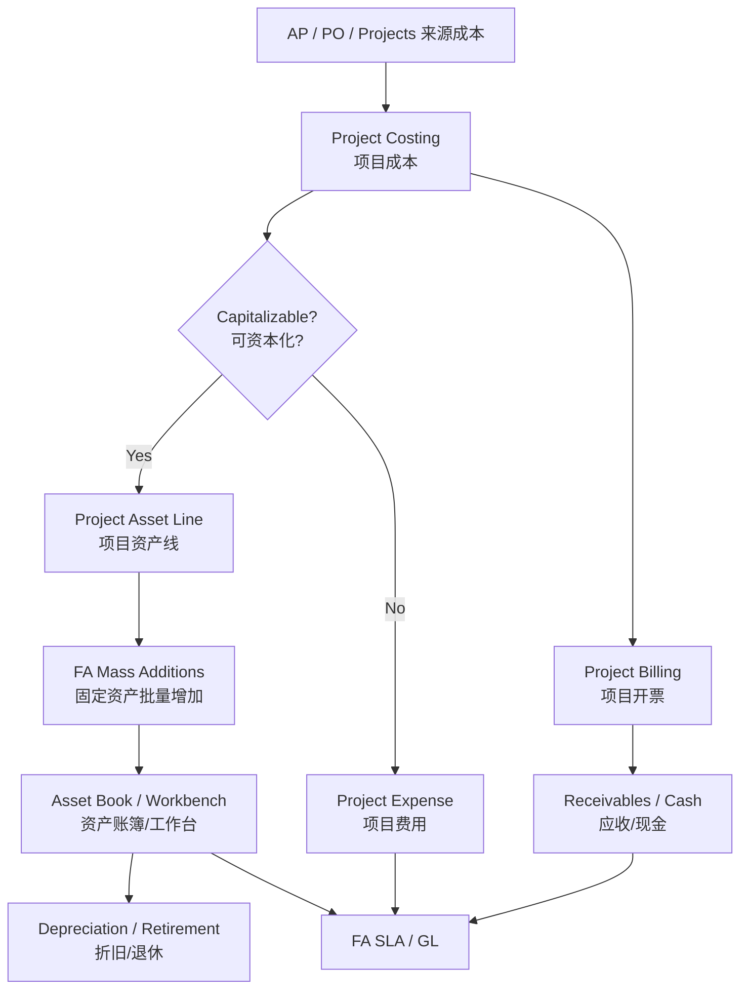
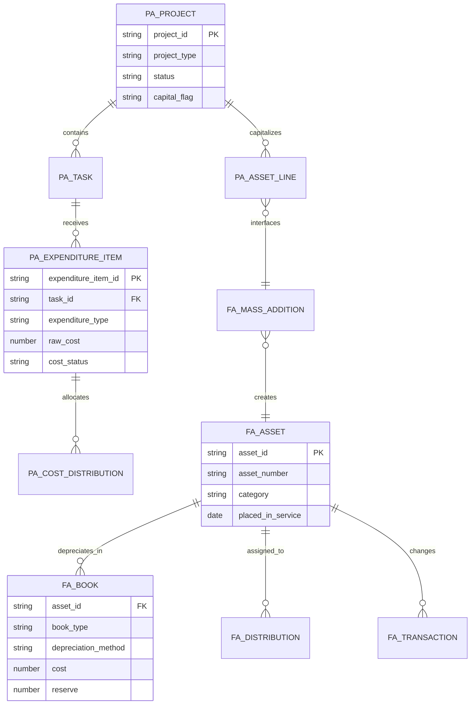
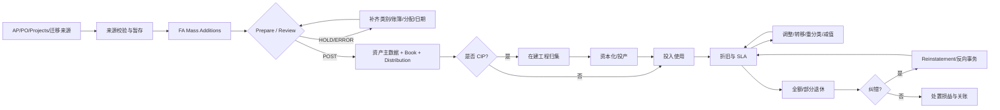
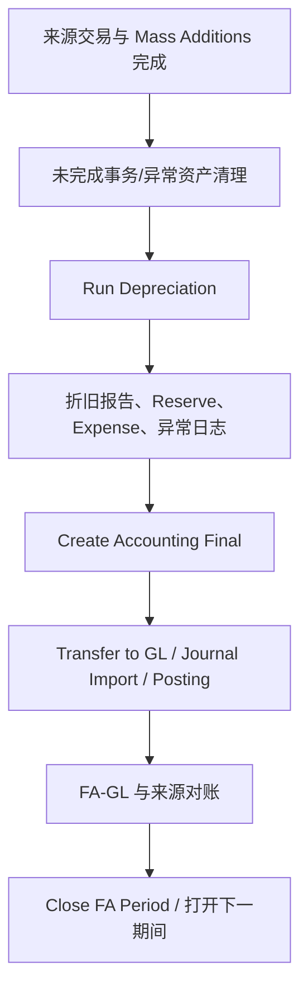
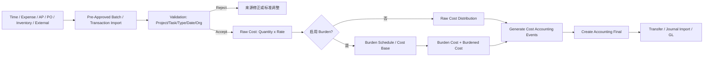
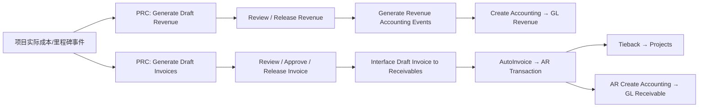
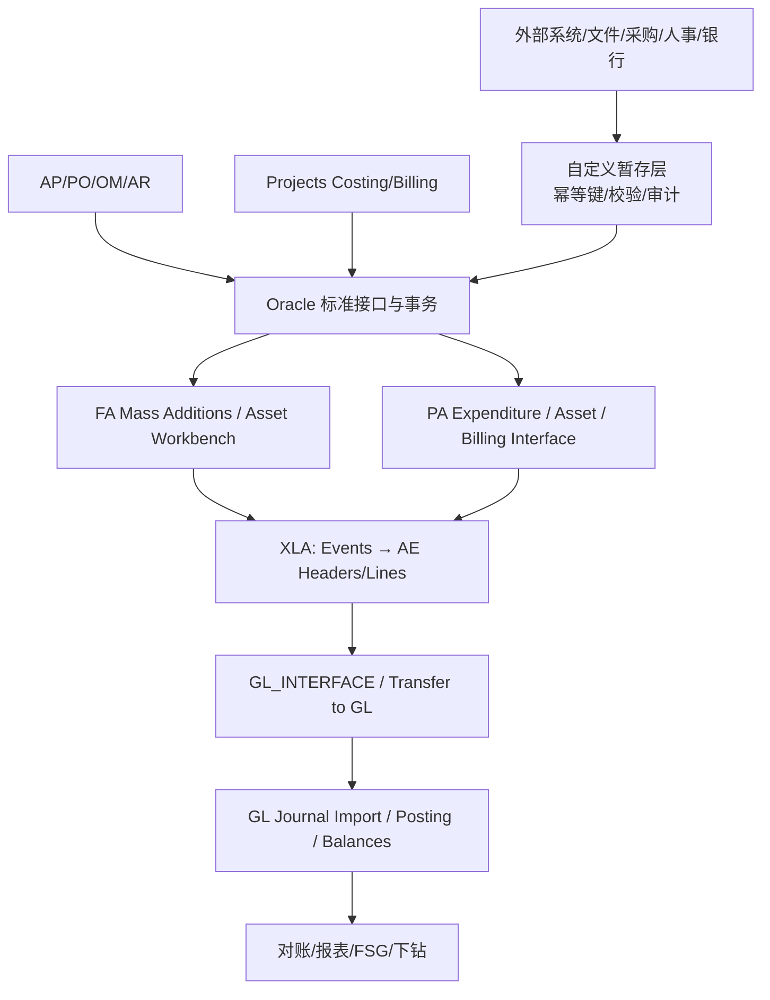
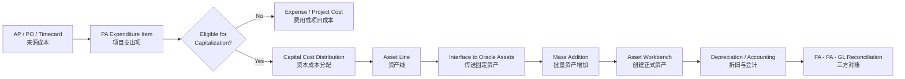

# 资产与项目（Assets and Projects）

> 本模块连接项目支出、资本化、固定资产全生命周期、项目收入与跨模块会计。Fixed Assets（固定资产，FA）与 Projects（项目，PA）既可独立运行，也可通过 Project to Asset（项目转资产）形成资本化闭环。

## 阅读导航

- [范围](#1-学习目标与边界) · [核心链路](#2-两条核心链路) · [固定资产](#3-fixed-assets-设计重点) · [项目](#4-projects-设计重点) · [会计对账](#5-会计和对账) · [技术排错](#6-技术视角) · [页面与资本化实操](#9-资深顾问实操资产项目与资本化) · [专题详解](#10-专题详解)

## 模块数据字典与名词解释

本模块速查见[统一数据字典](data-dictionary.md#dict-05)。

## 模块业务架构与核心 ER 图

### 资产与项目业务架构图



### 资产与项目核心 ER 图



项目资产线到 FA Mass Addition 是关键接口边界；金额、日期、类别、账簿和来源行必须可回溯，实际表关系以 Projects/Assets eTRM 为准。

## 1. 学习目标与边界

应能解释 Asset Book（资产账簿）、类别、折旧、资产交易和 FA-GL 对账；理解 Projects Foundation、Project Costing（项目成本）、Project Billing（项目开票）和资本化；区分 Property Manager、iAssets、EAM、Grants 等可选产品。

## 2. 两条核心链路

### 2.1 资产取得到退出（Acquire to Retire，A2R）

```text
AP/采购/手工来源 → Mass Additions（批量资产增加） → 创建资产
→ 投产/折旧 → 调拨/调整/重分类 → 减值（如适用） → 退休/处置 → GL
```

### 2.2 项目到资产/现金

```text
项目与任务 → 支出导入/归集 → 成本分配与负担成本
→ 资本项目资产线 → 传送 FA → 创建资产/折旧
或：合同/事件 → 收入生成 → 项目开票 → AR → 收款
```

## 3. Fixed Assets 设计重点

Fixed Assets（FA）不是一张“资产清单”，而是由资产主数据、每本账簿的价值历史、分配历史和事务历史共同组成。设计时先区分“实物身份”和“账簿价值”，再确定来源、审批、会计和盘点责任。

### 3.1 资产主数据、账簿和分配层次

| 层次 | 主要对象/概念 | 业务职责 | 典型控制 |
| --- | --- | --- | --- |
| 资产身份 | Asset Number、Tag Number、Description、Asset Key | 确认是哪一项实物或软件资产 | 编号唯一；标签、序列号和父子资产关系可追溯 |
| 类别 | Asset Category、Asset Type | 决定默认账户、折旧方法和资本化属性 | 类别按政策审批；不要用描述文本代替类别 |
| 账簿 | Corporate Book、Tax Book、其他 Book | 在不同会计/税务口径保存成本、折旧和处置结果 | 一项资产通常只归属一个 Corporate Book，可按当地政策配置一个或多个 Tax Book；通过 Mass Copy 传递允许的交易 |
| 价值 | Cost、Original Cost、Salvage、Life、Method、DPIS | 计算可折旧基础、累计折旧和账面净值 | 变更必须有生效日期和事务来源，禁止覆盖历史值 |
| 分配 | Location、Employee、Expense Account、Units | 说明资产在哪、谁负责以及折旧费用归属 | 当前分配单位合计 = 资产当前单位数；地点、员工和 CCID 在生效日期有效 |
| 来源 | AP Invoice/Distribution、PO、Project/Task/Asset Line、迁移批次 | 追溯取得成本和资本化依据 | 保存外部单据号、来源系统、批次和接口行号 |

Corporate Book 用于企业核算，Tax Book 用于税务折旧或其他法定口径；两者的折旧方法、寿命、残值、日历和调整并不必然相同。资产类别在各 Book 中有独立的 Category-Book 设置，不能只检查类别名称就认定账户一致。

### 3.2 A2R 全生命周期和状态转换



| 事务 | 何时使用 | 需要同时核对的对象 | 常见后续 |
| --- | --- | --- | --- |
| Addition | 新资产进入 FA | 来源行、类别、Book、成本、DPIS、分配 | 运行折旧、创建会计 |
| Cost Adjustment | 发票/项目补充成本或冲减成本 | 原资产、调整金额、调整日期、摊销策略 | 重算折旧、检查 CIP/成本账户 |
| Transfer | 地点、员工、成本中心或单位责任变化 | 当前单位、Location、Employee、Expense CCID | 分配历史和折旧费用归属变化 |
| Reclassification | 资产类别或资产类型错误 | 原/新类别的账户、折旧规则、有效日期 | 账户重分类、必要时重跑折旧 |
| Retirement | 出售、报废、丢失、退回或停止使用 | 退休数量/成本、日期、收入、移除成本、Book | 计算处置损益、生成会计 |
| Reinstatement | 取消错误退休 | 原退休状态、期间是否已关、重算范围 | 重新折旧并复核损益 |

### 3.3 Mass Additions：从来源行到正式资产

Mass Additions 是受控暂存区，不是最终资产表。AP、Projects 或外部迁移程序把来源行放入队列后，由资产会计在工作台补充和确认资产属性，再执行 Post Mass Additions。

```text
来源单据/项目资产线
  → 生成 Mass Addition（来源、金额、类别、账簿、日期）
  → Prepare/Review（补齐分配和折旧参数）
  → POST（创建 FA Addition/Book/Distribution）
  → Asset Number + Source Line 可下钻
```

| 处理动作 | 适用情形 | 控制要求 |
| --- | --- | --- |
| Post | 一行对应一项或一组正式资产 | 过账前检查总额、类别、账簿、DPIS 和分配 |
| Merge | 多个来源行实际属于同一资产 | 保存所有来源行；合并后核对成本、单位和描述 |
| Split | 一行需拆成多个资产或分配 | 拆分金额/单位之和必须等于原行，记录拆分依据 |
| Hold | 信息不完整或等待业务决定 | 说明原因和责任人，避免无限期挂起 |
| Delete/Expense | 错误来源或不应资本化 | 先确认来源系统已完成反向/更正，不可只在 FA 删除 |

Mass Additions 过账前建议建立控制总额：`来源可资本化金额 = Post 金额 + Hold/Error 金额 + 明确排除金额`。跨系统重试必须使用“来源系统 + 外部单据号 + 来源行号 + Book”作为幂等键，不能以描述或金额近似去重。Oracle Assets 会从类别、账簿和 DPIS 默认折旧规则，人工覆盖后必须保留审批证据。

### 3.4 折旧、CIP 与资本化

折旧结果由以下输入共同决定，而不是只由“年限”决定：

| 输入 | 作用 | 审核问题 |
| --- | --- | --- |
| Cost/Original Cost | 当前/原始成本 | 是否包含运费、税、安装和后续资本化成本；是否重复导入 |
| DPIS（Date Placed in Service） | 投入使用日期 | 验收、可使用和会计期间是否一致；是否允许追溯 |
| Prorate Convention/Calendar | 首期、末期折旧起算规则 | 月初、月末、日折旧或半月规则是否符合政策 |
| Method/Life/Rate | 折旧算法和寿命 | 账簿及类别默认是否正确；变更是否需要摊销 |
| Salvage/Ceiling/Bonus | 可折旧基础和特殊折旧 | 残值、上限、奖励折旧是否适用该 Book |
| Depreciate Flag/Asset Type | 是否参与折旧 | CIP/Expensed/退休资产是否被错误折旧 |

CIP（Construction in Progress，在建工程）用于在达到可使用状态前归集成本；通常不在 CIP 阶段计提普通折旧。项目成本完成、验收通过并确定实际投产日期后，Projects 生成资产线，传入 FA Mass Additions，再由 FA 资本化/投产并开始折旧；具体起算规则仍以 Book 的 Convention 和实例配置为准。

**项目资本化最小控制链**：

1. 项目/任务允许的交易控制明确哪些员工、支出类别、支出类型和资源可资本化。
2. 所有成本完成分配并在 SLA 以 Final 模式创建会计；未成功会计的成本不能生成有效资产线。
3. 设定 Asset Date Through、PA Through Date、资产分组级别和共同成本分配规则，运行 Generate Asset Lines。
4. 审核资产线明细、CIP 账户、类别、单位、资本化日期和项目追溯，再运行 Interface Assets。
5. 在 FA Prepare/Post Mass Additions 接收；资产成本、项目资产线、CIP 清理和 GL 必须四方相等（允许明确的舍入/排除项）。

### 3.5 退休、减值和实物盘点

- **全额/部分退休**：按单位退休时系统按单位比例计算成本；按成本退休时单位数可不变而成本按分配行分摊。税务账簿的退休能力和单位/成本限制可能与公司账簿不同，必须按 Book 验证。
- **处置损益**：至少核对 `Cost Retired`、`Reserve Retired`、`Proceeds of Sale` 和 `Cost of Removal`；不要用“收款金额”单独推断 Gain/Loss。
- **退休状态**：新退休通常先为 Pending，运行折旧或计算损益后转为 Processed；已处理退休的恢复需要重算并检查会计。状态和值以目标实例 Lookup 为准。
- **减值/重估**：若启用相关功能，先确认会计政策、审批和 Book 支持，再核对资产账面价值、减值损失、累计折旧和后续折旧基础。
- **实物盘点**：使用 Tag/序列号、Location、Employee 和资产状态生成盘点清单；差异先由业务确认，再以标准转移、调整或退休事务更正，不能直接更新 `FA_DISTRIBUTION_HISTORY`。

### 3.6 FA 期间关账检查



折旧前不要直接关闭期间；先跑测试/正式折旧并复核报表。若当前期间又发生允许的成本、调整或退休，系统可能需要回滚相关折旧并重跑。关账证据至少包括并发请求 ID、折旧汇总、失败资产清单、SLA/GL 批次和对账签核。

## 4. Projects 设计重点

Oracle Projects 要同时管理“项目结构、实际成本、承诺、资本化、收入和开票”。项目成本可以来自时间、费用、库存/使用量、AP/采购和外部系统；合同项目还要维护客户、协议、资金、费率、事件和账单周期。

### 4.1 项目、任务和控制属性

| 对象 | 作用 | 实施时要明确 |
| --- | --- | --- |
| Project Type | 决定项目类别（间接、资本、合同等）及成本/计费默认 | 是否启用 Burden、资本化、收入/开票、跨组织和预算 |
| Project | 成本、收入、客户和资金的管理单元 | 项目功能币、开始/结束日期、客户、协议、项目状态 |
| Task/WBS | 将工作拆成可执行和可归集节点 | 任务层级、可收费/可资本化、Billable/Chargeable、组织和责任人 |
| Expenditure Type/Category | 对支出进行业务分类 | Labor、Material、Expense、Burden Transaction 等及费率/资本化规则 |
| Expenditure Organization | 承担成本或执行工作的组织 | 员工、供应商、库存组织与项目组织的跨组织规则 |
| Transaction Controls | 限制允许的人员、资源、日期和类型 | 防止把不可资本化、不可收费或跨组织交易送入项目 |
| Agreement/Funding | 合同项目的额度与资金来源 | 客户、资金金额、有效期、优先级和提前收款 |

项目状态与任务状态是成本、调整、资本化和开票的门禁。不要因为“项目看起来已完成”就直接关闭：先确认所有支出已导入/分配/会计，资本项目已生成资产线，合同项目已生成收入/发票且 AR 已回写。

### 4.2 支出到成本会计的处理链



Expenditure Item 至少包含 Project、Task、Expenditure Organization、Expenditure Type、Expenditure Date、Quantity、Transaction Currency、来源和外部参考。处理后要区分：

| 成本口径 | 定义 | 用途 |
| --- | --- | --- |
| Raw Cost | 直接交易成本，例如小时 × 成本率 | 基础成本、成本控制和部分计费 |
| Burden Cost | 按负担结构/费率计算的间接成本 | 福利、场地、管理费等间接成本 |
| Burdened Cost | Raw + Burden 的总成本 | 项目 WIP、资本化或合同成本 |
| Commitment | 采购申请、采购订单等未来成本 | 预算/承诺控制，不等同已发生支出 |

Oracle Projects 的成本程序还负责交易币到项目功能币/报告币的转换、默认账户（AutoAccounting）和成本事件生成。出现 `Imported but Uncosted`、`Cost Distributed`、`Event Generated but Unaccounted`、`Accounted but Not Posted` 时，要按状态推进，不能通过更新状态列“补过账”。

### 4.3 Burdening（负担成本）

Burdening 是对每一笔 Raw Cost 应用一个或多个负担成本组件。常见公式为：`Burdened Cost = Raw Cost + Σ(Raw Cost × Burden Multiplier)`。Burden Structure 定义成本基础，Burden Schedule 按组织、期间或项目类型提供有效费率；成本、收入和开票可以使用不同 multiplier。

- 可选择把 Burden 存在同一 Expenditure Item、作为独立负担支出项，或只用于管理报表而不产生额外 GL 影响。
- 若资本项目按 Burdened Cost 资本化，必须先运行 `PRC: Distribute Total Burdened Cost`、`PRC: Generate Cost Accounting Events` 和 Final `PRC: Create Accounting`，然后才能生成资产线。
- 费率修订要确定生效日期和追溯范围；重算后检查成本、收入、发票和资产线是否需要同步再生成。
- 计费时所有参与计算的 Expenditure Type（含 Burden Transaction）必须包含在适用的 Bill Rate Schedule，否则会出现收入/发票生成错误。

### 4.4 资本项目、资产分组与资产线

资本项目通过 WBS、Grouping Level、Asset Assignment 和 Capital Event 将 CIP 成本汇总到一个或多个资产。共同成本可以按当前成本、预计成本、标准单位成本或平均分摊分配；如果 Allocation Method 为 None，则产生未分配资产线，需要人工分配。

```text
资本任务/共同成本
  → 成本分配 + Final SLA
  → 定义资产、Grouping Level、Actual Date In Service
  → Generate Asset Lines（按分组级别/方法/CIP 账户汇总）
  → Review Asset Line Details
  → Interface Assets to Oracle Assets
  → FA Prepare/Post → 资产折旧
```

| 参数 | 影响 |
| --- | --- |
| Asset Date Through | 只处理实际投产/退休日期不晚于该日期的资产 |
| PA Through Date | 成本考虑到哪个 PA 期间；落在期间中间时通常按前一期间期末处理 |
| Grouping Level/Method | 决定按项目、任务、共同成本、支出类别、支出类型或全部汇总 |
| Include Common Tasks | 是否把共同成本纳入资产线 |
| Asset Allocation Method | 多资产之间按当前成本、估算、标准单位成本或平均分摊 |
| CIP/RWIP Account | 资产成本或退休调整成本的来源账户；不同账户可能拆分资产线 |

资产线生成前必须已完成成本 Final Accounting；接口后不能随意改项目/任务关联。接口后的追加发票或费用应作为新的成本调整资产线；错误资本化则在 Projects 反向资本化并再次传送反向行。

### 4.5 合同项目：收入与开票分离

合同项目常见类型包括 Time and Materials、Fixed Price 和 Cost Plus；每个项目/任务配置客户、联系人、协议/资金、收入确认方法、开票方法、费率、币种、Bill Through Date 和事件。



收入与发票可以不同日期、不同批次运行：

| 概念 | 说明 | 不能混淆的点 |
| --- | --- | --- |
| Draft Revenue | 按成本/事件和收入规则计算的草稿收入 | Released Revenue 不等于已开票 |
| Revenue Accounting Event | 把收入、未开票应收（UBR）或递延收入（UER）送入 SLA 的事件 | 需要独立 Create Accounting |
| Draft Invoice | 可审核的项目发票草稿 | 释放后不能直接覆盖，需贷项/取消/重开 |
| AutoInvoice | AR 接收 Projects 发票接口并生成应收交易 | 接口成功、AR 会计和 Tieback 是不同状态 |
| Tieback | 将 AR 交易号、错误或状态回写 Projects | AutoInvoice 拒绝时先修复接口，不要重复生成草稿 |

预收款/协议资金会影响可用资金和发票余额；UBR/UER 账户取决于收入先于发票还是发票先于收入。多币种项目还要分别核对项目币、项目功能币、资金币和发票交易币及各自汇率日期。

### 4.6 项目调整、关闭和跨组织

调整已批准支出项后，通常需要重新运行成本分配；若成本已资本化、计费或确认收入，还需按影响范围重新生成资产线、收入或发票。以下是最小影响矩阵：

| 调整 | 成本分配 | 资产线 | 草稿收入 | 草稿发票 |
| --- | --- | --- | --- | --- |
| 修正已批准支出 | 是 | 是（若资本项目） | 是 | 是 |
| Billable ↔ Non-Billable | 是（按配置） | 否 | 是 | 是 |
| Capitalizable ↔ Non-Capitalizable | 是 | 是 | 否 | 否 |
| 重算 Raw/Burden Cost | 是 | 是 | 是 | 是 |
| Billing Hold / Release | 否 | 否 | 否 | 是 |

跨组织或跨法人交易还要检查 Intercompany/Cross Charge、借方/贷方组织、交易币、项目功能币、税和清算账户。项目关闭前应取得：来源交易已处理、未分配/拒绝项为零或有批准例外、承诺已关闭、资产线/收入/发票已完成、AR Tieback 完成、项目余额与 GL 对账。

## 5. 会计和对账

### 5.1 会计链路和控制总额

| 业务链路 | 子账会计关注 | 对账控制 |
| --- | --- | --- |
| AP/PO → FA | 资产成本、清算、应付来源 | AP 资本化分配 = Mass Additions Post = FA Cost |
| Projects CIP → FA | CIP、资产成本、项目资产线、追加成本 | PA Capitalizable Cost = Asset Lines = FA Cost（按 CIP 账户/Book 分层） |
| FA 折旧 | 折旧费用、累计折旧、资产净值 | FA Depreciation/Reserve = SLA = GL 过账 |
| FA 退休 | 资产成本、累计折旧、处置收入/移除成本、Gain/Loss | Retirement Report = FA SLA = GL 处置账户 |
| Projects Costing | Raw、Burden、Burdened、成本账户 | 来源交易 = 成功 + 拒绝 + 未处理；Raw + Burden = Burdened |
| Projects Revenue | 收入、UBR/UER、调整 | Released Revenue = Revenue Events = SLA = GL Revenue |
| Projects Billing → AR | 发票、税、UBR/UER、应收 | Released Invoice = AR Interface Success = AR Transaction = Tieback |

金额对账必须统一四个口径：交易币/功能币/报告币、借贷方向、会计日期/服务日期、明细/汇总传送粒度。舍入、汇率差、税和跨期间调整要单独列示，不能用“总账余额差异”笼统冲销。

### 5.2 建议关账顺序

```text
来源交易与审批完成
→ AP/Projects/外部接口导入并清理拒绝
→ Project Costing 分配、Burden、成本会计
→ 资本项目生成/接口资产线，处理 FA Mass Additions
→ Projects Revenue / Invoice 生成、释放、AutoInvoice、Tieback
→ FA 资产事务完成并运行折旧
→ 各子账 Create Accounting Final
→ Transfer to GL → Journal Import → Posting
→ FA/PA/AR/GL 对账与签核
→ 按产品顺序关闭期间
```

在关账清单中记录每个程序的参数、请求 ID、开始/结束时间、日志首个错误和重跑范围。FA 期间关闭不等同于 PA/AR/GL 期间关闭；必须按产品和 Ledger 的 `GL_PERIOD_STATUSES` 分别确认。

### 5.3 失败处理原则

- **来源失败**：在 AP、采购、时间或外部系统修正后按原外部键重送，保留原失败记录。
- **Projects 成本失败**：修正项目/任务、组织、费率、期间或 AutoAccounting 后重新分配；不要手工改写成本分配行。
- **资产接口失败**：先处理 Mass Additions 队列和错误，再只重送失败行；已 Post 行不得整批重送。
- **SLA 失败**：按事件状态和错误消息修正账户、期间、汇率或规则；Draft 只能检查，Final 才能传 GL。
- **AutoInvoice/Tieback 失败**：区分未进接口、被 AR 拒绝、AR 已成功但回写未完成，先查询外部交易键再决定是否重跑。

## 6. 技术视角

### 6.1 技术架构



EBS 接口应优先采用标准并发程序、公开 API、Open Interface 或 Integration Repository 中登记的 Web Service；接口表是暂存边界，不代表可以直接 DML 推动业务状态。定制程序要把“接收、校验、导入、业务处理、会计、回写”分为可重跑阶段。

### 6.2 接口矩阵

| 来源 → 目标 | 标准实现边界 | 最小必传字段/键 | 成功证据 |
| --- | --- | --- | --- |
| AP → FA | Create Mass Additions / Mass Additions Workbench | Invoice、Supplier、Distribution、Book、Category、Cost、Units、DPIS、外部行号 | Mass Addition 已 Post，生成 Asset Number |
| Projects → FA | Generate Asset Lines → Interface Assets | Project/Task、Asset、Grouping、CIP Account、Cost、Units、Asset Date、PA Through Date | Projects 资产线状态完成，FA 队列可追溯 |
| 外部成本 → Projects | Pre-Approved Expenditure / Transaction Import | Project、Task、Expenditure Type、Org、Date、Qty、币种、来源键 | 支出项已验证且 Cost Distributed |
| Projects → AR | Generate Draft Invoice → Interface Draft Invoice | Customer/Site、Agreement/Funding、Bill Through、金额、税、币种、外部发票键 | AutoInvoice 交易号、Projects Tieback 完成 |
| Projects → GL | Generate Cost/Revenue Accounting Events → Create Accounting | Event、Ledger、Accounting Date、Source/Accounting Attributes | XLA Final、GL Journal Import/Posting |
| FA → GL | Create Accounting → Transfer/Journal Import | Book、Transaction Event、Accounting Date、CCID、借贷金额 | FA SLA 与 GL 批次可下钻 |

外部接口建议使用如下幂等键：`source_system + source_document + source_line + business_date + book_or_ledger`。接口日志至少保存 `request_id`、外部键、EBS 主键、处理状态、错误码、重试次数、最后更新时间和原始报文哈希。部分成功时只重送失败行；重送前先按外部键查询是否已经生成资产、支出、AR 交易或 GL 批次。

### 6.3 关键表和追溯路径

| 业务对象 | 常见表/视图 | 追溯路径 |
| --- | --- | --- |
| 资产身份 | `FA_ADDITIONS_B` / `FA_ADDITIONS_TL` | `ASSET_ID → FA_BOOKS / FA_DISTRIBUTION_HISTORY` |
| 资产账簿 | `FA_BOOK_CONTROLS`、`FA_BOOKS`、`FA_CATEGORY_BOOKS` | `BOOK_TYPE_CODE + ASSET_ID + DATE_EFFECTIVE` |
| 资产事务 | `FA_TRANSACTION_HEADERS`、`FA_RETIREMENTS` | 事务头 → Books/Distribution/折旧结果 |
| 折旧 | `FA_DEPRN_PERIODS`、`FA_DEPRN_SUMMARY`、`FA_DEPRN_DETAIL` | Book + Period + Asset + Distribution |
| 资产暂存 | `FA_MASS_ADDITIONS` | 来源键/批次 → Prepare/Post → Asset Number |
| 项目结构 | `PA_PROJECTS_ALL`、`PA_TASKS` | `PROJECT_ID → TASK_ID → Expenditure/Asset/Billing` |
| 项目成本 | `PA_EXPENDITURE_ITEMS_ALL`、`PA_COST_DISTRIBUTION_LINES_ALL` | Expenditure Item → Distribution → XLA |
| 项目资产 | `PA_PROJECT_ASSET_LINES_ALL`（按实例 eTRM 核对） | Project/Task/Asset → FA Mass Addition |
| 项目收入/发票 | 常见 `PA_EVENTS`、Draft Revenue/Draft Invoice 对象及分配视图 | Event/Expenditure → Revenue/Invoice → AR/Tieback |
| 会计 | `XLA_EVENTS`、`XLA_AE_HEADERS/LINES`、`GL_IMPORT_REFERENCES` | 业务主键 → Event → SLA → GL Journal |

表名、状态值和列在 R12.2 补丁、本地化和客户扩展下可能变化。生产 SQL 先用 eTRM、`ALL_TAB_COLUMNS`、Integration Repository 和目标实例日志核对；只读诊断也要按 `ORG_ID`、Book、Ledger 和安全上下文过滤。

### 6.4 性能、安全和运维

- 大批量导入按 Book/OU/项目和业务日期分片，避免多个请求同时锁定同一 Mass Additions 或期间。
- 接口暂存表建立外部键唯一索引、状态索引和错误索引；原始报文与业务表分离，定期归档但保留可审计摘要。
- 并发程序使用标准参数和请求集，记录父/子请求关系；长事务拆分为验证、导入和会计阶段。
- 查询 FA/PA/AR 时遵守 MOAC、Data Access Set、Security by Book 和职责权限，报表 SQL 不得绕过组织安全。
- 生产环境禁止直接更新 `FA_*`、`PA_*`、`XLA_*`、`GL_*` 业务表；修正必须使用标准表单、API 或 Oracle 支持的接口。

## 7. 高频问题定位

| 问题 | 检查顺序 |
| --- | --- |
| Mass Addition 无法过账 | 来源状态、类别、账簿、成本、地点/员工和错误信息 |
| 折旧金额异常 | 投产日期、方法、寿命、惯例、成本调整和追溯设置 |
| FA 与 GL 不符 | 未会计交易、期间、账户、手工 GL 和折旧运行 |
| 项目成本无法资本化 | 项目/任务状态、资本属性、成本分配、资产线和传送状态 |
| 项目开票未进 AR | 合同/客户、事件、开票生成、接口和 AutoInvoice |

## 8. 建议练习

- 从 AP 发票创建资产，运行折旧、调拨并部分退休。
- 从项目支出生成资产线并传入 FA，核对 CIP 清理。
- 为公司账簿与税务账簿设计差异和对账方案。

## 9. 资深顾问实操：资产、项目与资本化

### 9.1 Project to Asset UML



### 9.2 页面剧本：QuickAdditions 创建资产

**常见职责与导航**：`Fixed Assets Manager（固定资产经理） → Assets（资产） → Asset Workbench（资产工作台） → QuickAdditions（快速增加）`。

1. 选择 Corporate Book（公司账簿），输入 Asset Category、Description、Cost 和 Date Placed in Service（投产日期）。
2. 核对默认 Depreciation Method、Life/Rate、Prorate Convention、Salvage Value 和 Depreciate 标志。
3. 维护 Assignment：Units、Employee（如适用）、Expense Account 和 Location。
4. 保存并记录 Asset Number；在 Asset Workbench 查询 Books、Assignments 和 Source Lines。
5. 运行或查看 Create Accounting 前，确认类别账户、成本和折旧参数符合批准政策。

QuickAdditions 适合默认规则完整的简单资产。需要多来源行、复杂账簿信息或逐项控制时使用 Detail Additions；批量来源优先使用 Mass Additions。

### 9.3 页面剧本：处理 Mass Additions

**常见职责与导航**：`Fixed Assets Manager → Mass Additions → Prepare Mass Additions`，菜单名称可能因职责而异。

1. 按 Source Batch、Invoice、Supplier 或 Queue 查询来自 AP/Projects 的行。
2. 检查 Queue Name（队列）、Posting Status、Asset Category、Book、Cost、Units 和来源行。
3. 判断行应 Post、Merge、Split、Hold、Delete 还是作为 Expense；所有决定保留业务依据。
4. 对合并/拆分后的金额执行控制总额，确保来源行总额不变。
5. 提交 Post Mass Additions，查看请求日志和错误；查询生成的 Asset Number。
6. 从资产 Source Lines 反查 AP Invoice Distribution 或 PA Asset Line，完成来源对账。

### 9.4 页面剧本：运行折旧与关期

**常见职责与导航**：`Fixed Assets Manager → Depreciation → Run Depreciation`。

1. 选择资产 Book，确认当前期间、未完成增加/调整/转移/退休和异常资产已处理。
2. 第一次运行时通常不要立即选择 Close Period，先执行折旧并复核结果。
3. 记录并发请求，检查 Depreciation 日志、Journal Entry Reserve Ledger/Tax Reserve Ledger 等输出。
4. 对失败资产按 Asset Number、Category、Method、Life、投产日期和账簿设置修复后重跑。
5. 核对 Cost、Reserve、YTD Depreciation、Depreciation Expense 与 GL 控制账户。
6. 获得签核后再选择 Close Period 运行；成功后确认本期关闭且下一期间打开。

Oracle Assets 在折旧运行期间限制相关资产交易。未关闭期间发生允许的资产调整时，系统可能自动回滚相关资产折旧；资深顾问必须评估重跑范围和报表版本。

### 9.5 页面剧本：资产调整、转移与退休

在 `Assets → Asset Workbench` 按唯一 Asset Number/Tag Number 查询：

- **Books**：调整成本、残值、方法、寿命等，并选择 Amortize（摊销调整）或 Expense（当期费用）策略。
- **Assignments**：在成本中心、地点或员工间转移数量；确认分配总单位数等于资产单位数。
- **Retirements**：输入退休日期、数量/成本、处置收入和成本；计算并复核 Gain/Loss（处置损益）。
- **Reclassification**：变更类别后复核成本/累计折旧账户迁移及折旧规则是否需要人工调整。

逆向操作前确认期间、折旧、会计和税务账簿影响。已完全退休或已关期间的处理限制必须以目标实例验证。

### 9.6 页面剧本：项目成本到资本化

1. 在 Projects 责任下查询 Project/Task，核对 Project Type、Capital 标志、组织、状态和关键日期。
2. 在 Expenditure Inquiry 查看员工工时、费用、AP 发票、采购承诺等支出项及 Cost Distribution 状态。
3. 运行成本分配/会计，清理 Uncosted、Rejected 和跨期支出。
4. 生成或维护 Capital Asset、Asset Assignment 和 Asset Lines，检查资本化日期、类别、单位和成本分组。
5. 执行 Interface Assets/Asset Lines to Oracle Assets，记录请求 ID 和接口批次。
6. 在 FA Mass Additions 接收并过账；用项目资产线金额 = FA 来源行/资产成本建立控制总额。

### 9.7 资深顾问决策矩阵

| 决策 | 关键问题 | 必测场景 |
| --- | --- | --- |
| 资产类别 | 账户、折旧规则、实物分类是否稳定 | 新增、重分类、退休 |
| 投产日期/惯例 | 首期和末期折旧如何处理 | 月初/月末、追溯投产 |
| 调整方式 | 当期费用还是剩余寿命摊销 | 折旧前后、已关期间 |
| 公司/税务账簿 | 复制规则和差异来源是什么 | 成本、寿命、方法差异 |
| 项目资本化 | 哪些成本可资本化，何时停止资本化 | 部分资本化、冲销、跨期 |
| 项目开票 | 收入与开票是否同步、如何进 AR | 预付款、里程碑、贷项 |

### 9.8 页面剧本：资本项目到正式资产

**适用场景**：厂房、设备、软件实施等需要先在项目中累计 CIP，再在验收/可使用后转入 FA 的项目。以下步骤对应 Oracle Projects 的 Capital Projects/Asset Capitalization 与 Oracle Assets 的 Mass Additions；菜单名称可能因职责和补丁不同而变化。

1. **建立项目与任务**：选择 Capital 项目类型，定义项目功能币、组织、开始/结束日期；在 WBS 中区分资本任务、费用任务和 Common Cost 任务。
2. **设置交易控制**：按员工、Expenditure Category、Expenditure Type、Non-Labor Resource 和日期限制可资本化交易；明确哪些安装、运输、设计、培训和管理成本排除。
3. **导入并验证成本**：从 AP、采购、时间、费用、库存或外部系统导入支出，检查 Project/Task、组织、期间、币种、数量和来源键；对拒绝项在来源或 Review Transactions 中修正。
4. **运行成本程序**：按需运行 `PRC: Transaction Import`、对应的 Cost Distribution/Burden 程序、`PRC: Generate Cost Accounting Events` 和 Final `PRC: Create Accounting`。只有 Final SLA 成功的 CIP/RWIP 成本才可生成有效资产线。
5. **定义资产与分组**：在 Capital Projects 中维护资产、类别、Grouping Level、Asset Assignment 和 Actual Date In Service；共同成本按项目政策选择自动分配或保留未分配。
6. **生成资产线**：运行 `PRC: Generate Asset Lines for a Single Project`（或范围程序），设置 Asset Date Through、PA Through Date 和 Include Common Tasks；查看 Generate Asset Lines Report。
7. **处理未分配/拆分行**：在 Asset Lines/Asset Line Details 中把未分配行指定到资产，必要时按金额或百分比 Split；核对分配金额 = 原始资产线金额。
8. **传送到 FA**：运行 `PRC: Interface Asset Lines to Fixed Assets`（实例中可能显示为 `PRC: Interface Assets to Oracle Assets`），记录请求 ID；在 FA Prepare Mass Additions 检查 Queue、来源、类别、Book、成本、单位、DPIS 和地点。
9. **FA 过账与折旧**：Post Mass Additions 后查询 Asset Number、Books 和 Source Lines；确认 CIP 清理、资产成本和投产日期，再按 FA 期间运行折旧。
10. **追加成本/反向资本化**：接口后发生的发票/贷项作为新的成本调整资产线；放弃或错误资本化时先在 Projects 反向资本化，再生成反向行传回 FA，不直接删除历史记录。

**验收证据**：项目资产资本化报告、资产线明细、Mass Additions Report、FA Asset/Book 查询、SLA/GL 批次和四方对账表（PA CIP、Asset Lines、FA Cost、GL）。

### 9.9 页面剧本：合同项目收入与开票到 AR

1. **合同与资金**：维护客户和 Bill-to/Ship-to、Agreement、Funding、金额、有效期、优先级及预收款；检查项目/任务的收入和开票贡献比例。
2. **计费配置**：选择 Time and Materials、Fixed Price 或 Cost Plus 等适用方法，定义 Bill Rate/Cost Rate、Revenue/Invoice Currency、Bill Through Date、Invoice Format、Payment Terms 和税属性。
3. **记录事件与成本**：导入已批准支出，或在 Events 窗口录入里程碑、进度、预付款、Invoice Reduction 等事件；检查事件日期、金额、Billable/Revenue 资格。
4. **生成草稿收入**：运行 `PRC: Generate Draft Revenue for a Single Project` 或范围程序；在 Revenue Review 查看成本/事件、费率、资金、币种和 UBR/UER，发现错误时在未释放状态重新生成。
5. **释放收入并会计**：审批并 Release Draft Revenue，运行 Generate Revenue Accounting Events 和 Final Create Accounting；确认收入、UBR/UER 与 GL 账户。
6. **生成草稿发票**：运行 `PRC: Generate Draft Invoices for a Single Project`，核对 Bill Through Date、Invoice Date、GL Date、税估算、Expenditure Bill Group 和合并规则。
7. **审批、释放和接口**：Review/Adjust → Approve → Release；释放后不能直接改写，差异用 Credit Invoice/Credit Memo 或重新生成未释放草稿处理。
8. **进 AR 并回写**：运行 `PRC: Interface Invoices to Receivables`，再运行 AutoInvoice Import Program，最后运行 `PRC: Tieback Invoices from Receivables`；核对 AR Transaction Number、税、付款计划和 Projects 状态。
9. **异常分层**：Projects 草稿错误、释放但未接口、AutoInvoice 拒绝、AR 已成功但 Tieback 待完成分别处理；按外部发票键查询后再重跑，避免重复应收。

**验收证据**：Revenue/Invoice Review、AutoInvoice 错误报告、AR 交易号、Tieback 状态、Projects-to-AR 对账和 UBR/UER/Revenue SLA 批次。

### 9.10 页面剧本：月末项目与资产关账

| 顺序 | 操作 | 完成条件 |
| --- | --- | --- |
| 1 | 检查 AP、采购、时间、费用、库存和外部接口 | 无未解释的导入/拒绝批次；保留失败清单 |
| 2 | 运行 Projects 成本分配和 Burden | Uncosted、Rejected、Unprocessed 有批准例外或为零 |
| 3 | 生成成本和收入会计 | 成本/收入事件 Final，账户和期间有效 |
| 4 | 处理资本项目 | 该投产的资产线已生成/传 FA，未分配线已处理 |
| 5 | 处理项目发票 | 草稿已审核、释放，AutoInvoice 和 Tieback 完成 |
| 6 | 处理 FA 事务 | Mass Additions 已过账；调整、转移、退休无未完成错误 |
| 7 | 运行 FA 折旧 | 折旧、Reserve、异常资产报告已复核 |
| 8 | Transfer/Journal Import/Posting | 子账批次与 GL 批次可下钻，借贷平衡 |
| 9 | 执行对账并关期 | PA/FA/AR/GL 差异有解释和签核；再关闭各产品期间 |

### 9.11 官方操作依据

- [Oracle Assets User Guide](https://docs.oracle.com/cd/E26401_01/doc.122/e48755/T293142T293144.htm)
- [Oracle Assets User Guide — Mass Additions](https://docs.oracle.com/cd/E26401_01/doc.122/e48755/T293142T293157.htm)
- [Oracle Assets User Guide — Depreciation](https://docs.oracle.com/cd/E26401_01/doc.122/e48755/T293142T301315.htm)
- [Oracle Project Costing User Guide — Costing Overview](https://docs.oracle.com/cd/E26401_01/doc.122/e48918/T188094T188096.htm)
- [Oracle Project Costing User Guide — Burdening](https://docs.oracle.com/cd/E26401_01/doc.122/e48918/T188094T188098.htm)
- [Oracle Project Costing User Guide — Asset Capitalization](https://docs.oracle.com/cd/E26401_01/doc.122/e48918/T188094T188100.htm)
- [Oracle Project Billing User Guide — Revenue Generation](https://docs.oracle.com/cd/E26401_01/doc.122/e49079/T178714T178720.htm)
- [Oracle Project Billing User Guide — Invoicing](https://docs.oracle.com/cd/E26401_01/doc.122/e49079/T178714T178721.htm)
- [Oracle EBS R12.2 Projects Documentation](https://docs.oracle.com/cd/E26401_01/nav/projects.htm)

## 10. 专题详解


<!-- source: docs/05-fa/README.md -->
<a id="src-docs-05-fa-readme"></a>
### Oracle Assets（FA / Acquire to Retire）


本目录覆盖资产账簿、类别、增加、资本化、折旧、调整、转移、处置、Mass Additions、会计与关账。资产来源可来自 AP、Projects/CIP、iAssets 或外部迁移；不同来源需要保留来源单据和资产编号之间的可追溯链。

<a id="src-docs-05-fa-readme--专题导航"></a>
#### 专题导航

- [资产生命周期](#src-docs-05-fa-process)
- [账簿、类别、位置与配置](#src-docs-05-fa-setup)
- [增加、调整、转移、重分类与盘点](#src-docs-05-fa-asset-transactions)
- [折旧、税务折旧、处置与会计](#src-docs-05-fa-depreciation-accounting)
- [月结、报表、Mass Additions 与排错](#src-docs-05-fa-close-reports-interfaces)
- [Projects 到 Assets：CIP 与资本化](#src-docs-05-fa-projects-capitalization)
- [表结构](#src-docs-05-fa-tables)
- [Mass Additions 与迁移接口](#src-docs-05-fa-interfaces)

<a id="src-docs-05-fa-readme--会计与控制重点"></a>
#### 会计与控制重点

| 业务动作 | 需确认的决定因素 | 常见遗漏 |
| --- | --- | --- |
| Capitalize | Asset Book、Category、Date Placed in Service、成本、资产来源 | 将 CIP、费用化和可资本化支出混在同一规则中 |
| Depreciate | Method、Life、Convention、Prorate、Period | 忘记先处理资产交易或未关闭前序模块期间 |
| Transfer/Adjust | Distribution、Location、Expense Account、Cost/Reserve | 只看资产头，遗漏分配行历史和会计影响 |
| Retire | Proceeds、Removal Cost、Partial Units、Gain/Loss | 处置日期/期间不一致，或遗漏 AP/AR/CE 清算链 |

<a id="src-docs-05-fa-readme--r122-边界"></a>
#### R12.2 边界

使用 Mass Additions 或 Oracle 公开 API 处理集成与迁移；不直接更新 `FA_ADDITIONS_B`、`FA_BOOKS` 或 `FA_DISTRIBUTION_HISTORY`。资产账簿、税务账簿和折旧规则变更应完成影响分析并留存审批。

<a id="src-docs-05-fa-readme--官方依据"></a>
#### 官方依据

- [Oracle Assets Documentation](https://docs.oracle.com/cd/E26401_01/nav/financials.htm)


<!-- source: docs/05-fa/asset-transactions.md -->
<a id="src-docs-05-fa-asset-transactions"></a>
### FA 资产增加、调整、转移、重分类与盘点


<a id="src-docs-05-fa-asset-transactions--交易类型"></a>
#### 交易类型

- Addition/CIP Addition：建立资产、Book 和 Distribution；CIP 通过 Capitalization 开始折旧。
- Cost/Book Adjustment：调整 Cost、Salvage、Life、Method、Rate、DPIS，可产生 Catch-up/Expensed Adjustment。
- Transfer：在 Employee/Expense Account/Location 间分配数量转移，总 Units 需平衡。
- Reclassification：改变 Category，可引起账户转移和折旧属性改变。
- Physical Inventory：将现场盘点与 FA Location/Employee 对比，差异审批后执行转移/处置。

<a id="src-docs-05-fa-asset-transactions--sql"></a>
#### SQL

```sql
-- 当前分配（DATE_INEFFECTIVE 为空）
SELECT fdh.distribution_id, fdh.asset_id, fdh.book_type_code,
       fdh.units_assigned, fdh.code_combination_id,
       fdh.location_id, fdh.assigned_to,
       fdh.date_effective, fdh.date_ineffective
  FROM fa_distribution_history fdh
 WHERE fdh.asset_id = :p_asset_id
 ORDER BY fdh.date_effective, fdh.distribution_id;

SELECT fat.transaction_header_id, fat.transaction_type_code,
       fat.book_type_code, fat.transaction_date_entered,
       fat.date_effective, fat.transaction_name,
       fat.source_transaction_header_id
  FROM fa_transaction_headers fat
 WHERE fat.asset_id = :p_asset_id
 ORDER BY fat.date_effective, fat.transaction_header_id;
```

<a id="src-docs-05-fa-asset-transactions--排查"></a>
#### 排查

- Transfer 不平：比较 Transfer Out/In Units，检查当前 Distribution 行、Location/Employee/CCID 有效性。
- Adjustment 不可做：查 Asset/Book Status、Period、已运行折旧、Retirement 和源交易限制。
- Reclass 后会计异常：比较新旧 Category Book 账户、交易日期和 SLA 行。
- Physical Inventory 差异太多：先统一 Asset Number/Tag/Location 映射与盘点截止日，再处理已退役/在途转移。

<a id="src-docs-05-fa-asset-transactions--关联"></a>
#### 关联

- [FA Setup](#src-docs-05-fa-setup)
- [Depreciation](#src-docs-05-fa-depreciation-accounting)


<!-- source: docs/05-fa/close-reports-interfaces.md -->
<a id="src-docs-05-fa-close-reports-interfaces"></a>
### FA 月结、报表、Mass Additions 与排错


> `FA_MASS_ADDITIONS`、遗留资产迁移、Prepare/Post 和资产对账代码见 [FA 接口实现案例](#src-docs-05-fa-interfaces)。

<a id="src-docs-05-fa-close-reports-interfaces--mass-additions"></a>
#### Mass Additions

```text
AP/Projects/External Source
→ FA_MASS_ADDITIONS
→ Prepare Mass Additions
→ Review/Merge/Split/Assign Category
→ Post Mass Additions
→ Asset/Book/Distribution
```

`POSTING_STATUS` 表示 New/On Hold/Posted/Delete/Error 等处理状态（具体 lookup 以实例为准）。一条 AP 分配是否进入 FA 取决于 Asset Tracking/Category/Account、Transfer to GL/FA 和接口程序。

<a id="src-docs-05-fa-close-reports-interfaces--月结"></a>
#### 月结

1. 完成 Mass Additions、CIP Capitalization、Adjustments/Transfers/Retirements。
2. 运行并复核 Depreciation，处理异常资产和未完交易。
3. 运行 Create Accounting Final、Transfer to GL、Journal Import/Post。
4. 对账 Asset Cost、CIP、Reserve、Depreciation Expense、Retirement Gain/Loss、Clearing。
5. 运行 Asset Register、Reserve Ledger、Cost Detail、CIP Detail、Retirement 和 Account Reconciliation 报表，关闭 FA 期间。

<a id="src-docs-05-fa-close-reports-interfaces--sql"></a>
#### SQL

```sql
SELECT mass_addition_id, book_type_code, description,
       fixed_assets_cost, payables_cost, posting_status,
       queue_name, asset_category_id, expense_code_combination_id,
       feeder_system_name, invoice_number, po_number,
       invoice_distribution_id, request_id
  FROM fa_mass_additions
 WHERE book_type_code = :p_book_type_code
   AND posting_status <> 'POSTED'
 ORDER BY mass_addition_id;

SELECT fdp.book_type_code, fdp.period_name, fdp.period_counter,
       fdp.period_open_date, fdp.period_close_date,
       fdp.deprn_run
  FROM fa_deprn_periods fdp
 WHERE fdp.book_type_code = :p_book_type_code
 ORDER BY fdp.period_counter DESC;

SELECT xah.gl_transfer_status_code, COUNT(*) cnt
  FROM xla_ae_headers xah
 WHERE xah.application_id = 140
   AND xah.accounting_date BETWEEN :p_start_date AND :p_end_date
 GROUP BY xah.gl_transfer_status_code;
```

<a id="src-docs-05-fa-close-reports-interfaces--排查"></a>
#### 排查

- AP 行未进 FA：查 Track as Asset、Asset Clearing Account、AP 会计/转 GL、Create Mass Additions 参数和已转标志。
- Mass Addition 不能 Post：查 Category/Book、DPIS、Cost、Units、Location/Employee/Expense Account、Posting Status/Error。
- FA/GL 不平：区分未会计、未转/未过账、GL 手工分录、日期错位和 Asset Category 账户变更。
- 期间无法关闭：检查 Depreciation Run、Pending Transactions、Mass Additions、Accounting 和当期报表。

<a id="src-docs-05-fa-close-reports-interfaces--关联"></a>
#### 关联

- [FA Process](#src-docs-05-fa-process)
- [Projects to Assets](09-end-to-end.md#src-docs-08-e2e-projects-assets)

<a id="src-docs-05-fa-close-reports-interfaces--官方参考"></a>
#### 官方参考

- [Oracle E-Business Suite R12.2 Documentation Library](https://docs.oracle.com/cd/E26401_01/index.htm)


<!-- source: docs/05-fa/depreciation-accounting.md -->
<a id="src-docs-05-fa-depreciation-accounting"></a>
### FA 折旧、税务折旧、资产处置与会计


<a id="src-docs-05-fa-depreciation-accounting--折旧原理"></a>
#### 折旧原理

折旧由 Cost Basis、Method/Rate/Life、Salvage Value、Depreciation Ceiling、Prorate Convention、DPIS、Calendar 和已提折旧决定。Run Depreciation 对当期资产计算，关期后结果进入 SLA/GL。Rollback 仅在标准程序允许的未关闭场景使用。

处置可为 Full/Partial Retirement，根据 Proceeds、Cost of Removal、Net Book Value 计算 Gain/Loss；Reinstatement 撤销处置并重建折旧/会计影响。

<a id="src-docs-05-fa-depreciation-accounting--sql"></a>
#### SQL

```sql
SELECT fds.asset_id, fds.book_type_code, fds.period_counter,
       fds.deprn_amount, fds.ytd_deprn, fds.deprn_reserve,
       fds.deprn_adjustment_amount, fds.bonus_deprn_amount,
       fds.impairment_amount, fds.system_deprn_amount
  FROM fa_deprn_summary fds
 WHERE fds.asset_id = :p_asset_id
   AND fds.book_type_code = :p_book_type_code
 ORDER BY fds.period_counter;

SELECT retirement_id, asset_id, book_type_code,
       date_retired, cost_retired, proceeds_of_sale,
       cost_of_removal, status, gain_loss_amount,
       units, transaction_header_id_in,
       transaction_header_id_out
  FROM fa_retirements
 WHERE asset_id = :p_asset_id
 ORDER BY date_retired;
```

<a id="src-docs-05-fa-depreciation-accounting--排查"></a>
#### 排查

- 资产未折旧：查 `DEPRECIATE_FLAG`、DPIS/Prorate Date、Asset Type、Cost、Method/Life、Fully Reserved/Retired 状态。
- 折旧金额不对：比较 Book/Method/Calendar、Cost Adjustments、Catch-up、Salvage/Ceiling、Bonus/Impairment 和舍入。
- Depreciation 请求失败：查日志中首个 Asset ID/Error，检查未完成 Mass Transaction、无效账户和并发冲突。
- Gain/Loss 异常：核对 Cost Retired、Reserve Retired、Proceeds/Removal、Retirement Convention 和处置日期。
- Tax Book 折旧差异：确认是政策差异而非 Mass Copy 遗漏，比较 Corporate/Tax Book 交易链。

<a id="src-docs-05-fa-depreciation-accounting--关联"></a>
#### 关联

- [FA Transactions](#src-docs-05-fa-asset-transactions)
- [FA Close/Interface](#src-docs-05-fa-close-reports-interfaces)


<!-- source: docs/05-fa/interfaces.md -->
<a id="src-docs-05-fa-interfaces"></a>
### Oracle Assets 接口实现案例


<a id="src-docs-05-fa-interfaces--1-业界常用场景"></a>
#### 1. 业界常用场景

| 场景 | 推荐接口 | 业务说明 |
| --- | --- | --- |
| AP 采购发票资本化 | Create Mass Additions | AP 已核算资产行进入 FA 待处理队列，保留 Invoice/PO 追溯 |
| Projects CIP 转固 | PRC: Interface Assets + Mass Additions | 项目资产线按 Project/Task/Asset Line 追溯 |
| 遗留资产迁移 | `FA_MASS_ADDITIONS` + Prepare/Post Mass Additions | 按 Book 分批导入成本、累计折旧和启用日 |
| 租赁/资产管理系统新增资产 | 自定义暂存层 + `FA_MASS_ADDITIONS` | 先做类别、地点、责任人、成本账户校验 |
| 大批量资产调整/转移/处置 | Oracle Assets 公共 API/标准批处理 | 以当前 Integration Repository/API 文档签名为准，不直接改 FA 历史表 |

<a id="src-docs-05-fa-interfaces--2-mass-additions-业务状态"></a>
#### 2. Mass Additions 业务状态

外部来源通常只创建 `NEW` 待处理行，由资产会计在 Mass Additions Workbench 完善并置为可过账，再运行 Post Mass Additions。典型过程如下：

```text
Source/Staging → NEW → Review/Prepare → POST → Posted Asset
                       ↘ HOLD / MERGED / SPLIT / ERROR
```

状态代码、Queue 名称和允许转换必须以目标实例 FA Lookup 和标准界面为准。不要通过 `UPDATE FA_MASS_ADDITIONS` 人工推动状态。

<a id="src-docs-05-fa-interfaces--3-导入前校验"></a>
#### 3. 导入前校验

```sql
-- 资产账簿和当前期间
SELECT fbc.book_type_code,
       fbc.set_of_books_id,
       fdp.period_name,
       fdp.period_open_date,
       fdp.period_close_date
  FROM fa_book_controls fbc
  LEFT JOIN fa_deprn_periods fdp
    ON fdp.book_type_code = fbc.book_type_code
   AND fdp.period_close_date IS NULL
 WHERE fbc.book_type_code = :p_book_type_code;

-- 类别在该 Book 的默认账户/折旧设置是否存在
SELECT fcb.category_id,
       fcb.book_type_code,
       fcb.asset_cost_acct,
       fcb.asset_clearing_acct,
       fcb.deprn_expense_acct
  FROM fa_category_books fcb
 WHERE fcb.category_id = :p_asset_category_id
   AND fcb.book_type_code = :p_book_type_code;

-- 位置键是否有效；段数按实例 Location KFF 调整
SELECT fl.location_id, fl.segment1, fl.segment2, fl.enabled_flag
  FROM fa_locations fl
 WHERE fl.location_id = :p_location_id;
```

员工、地点、类别、费用 CCID 都存在并不代表在启用日有效；接口程序应按 `DATE_PLACED_IN_SERVICE` 做有效期校验。

<a id="src-docs-05-fa-interfaces--4-famassadditions-具体实现"></a>
#### 4. `FA_MASS_ADDITIONS` 具体实现

<a id="src-docs-05-fa-interfaces--41-外部资产新增"></a>
##### 4.1 外部资产新增

```sql
DECLARE
  l_mass_addition_id NUMBER := fa_mass_additions_s.NEXTVAL;
BEGIN
  INSERT INTO fa_mass_additions (
    mass_addition_id,
    asset_number,
    tag_number,
    description,
    asset_category_id,
    book_type_code,
    date_placed_in_service,
    accounting_date,
    depreciate_flag,
    fixed_assets_cost,
    payables_cost,
    payables_units,
    fixed_assets_units,
    payables_code_combination_id,
    expense_code_combination_id,
    location_id,
    assigned_to,
    feeder_system_name,
    posting_status,
    queue_name,
    invoice_number,
    created_by,
    creation_date,
    last_updated_by,
    last_update_date,
    last_update_login
  ) VALUES (
    l_mass_addition_id,
    NULL,                             -- 由 FA 自动编号时留空
    :p_tag_number,
    :p_description,
    :p_asset_category_id,
    :p_book_type_code,
    :p_date_placed_in_service,
    :p_accounting_date,
    'YES',
    :p_asset_cost,
    :p_asset_cost,
    1,
    1,
    :p_asset_clearing_ccid,
    :p_deprn_expense_ccid,
    :p_location_id,
    :p_employee_id,
    'XX ASSET HUB',
    'NEW',
    'NEW',
    :p_external_document_number,
    fnd_global.user_id,
    SYSDATE,
    fnd_global.user_id,
    SYSDATE,
    fnd_global.login_id
  );

  COMMIT;
  dbms_output.put_line('MASS_ADDITION_ID=' || l_mass_addition_id);
END;
/
```

示例把 `PAYABLES_UNITS` 与 `FIXED_ASSETS_UNITS` 设为相同值，并在进入 Post 阶段前提供 `ACCOUNTING_DATE`、`DEPRECIATE_FLAG` 等关键属性。Oracle 明确不应使用 `VENDOR_NUMBER`；若业务需要供应商追溯，应按目标实例规则使用 `PO_VENDOR_ID`。`FA_MASS_ADDITIONS` 的列和必填规则会受来源、Book、功能和补丁影响，上线前须用目标实例 eTRM/`ALL_TAB_COLUMNS` 复核，并以标准 AP/Projects 生成的 Mass Addition 作为字段映射样本。

<a id="src-docs-05-fa-interfaces--42-运行前核对目标列"></a>
##### 4.2 运行前核对目标列

```sql
SELECT column_id,
       column_name,
       data_type,
       data_length,
       nullable
  FROM all_tab_columns
 WHERE owner = 'FA'
   AND table_name = 'FA_MASS_ADDITIONS'
 ORDER BY column_id;
```

自定义程序应将源系统主键保存在自定义暂存/映射表中，并以唯一约束保证幂等。不要依赖 `DESCRIPTION`、`INVOICE_NUMBER` 或 `TAG_NUMBER` 单列作为全局唯一键。

<a id="src-docs-05-fa-interfaces--5-遗留资产迁移的成本和累计折旧"></a>
#### 5. 遗留资产迁移的成本和累计折旧

遗留迁移不只是插入当前成本。至少要确认：

- Corporate/Tax Book 的启用日、原始成本、当前成本和净残值；
- 折旧方法、年限、Prorate Convention 和累计折旧；
- 本年累计折旧（YTD）和迁移期间；
- 当前地点、责任人、单位数和折旧费用账户；
- 资产类别默认值是否允许被源数据覆盖。

先用少量样本在关闭的测试环境走完 Prepare/Post/Depreciation，再核对剩余价值和下一期折旧。不要用 DML 直接补 `FA_BOOKS`、`FA_DEPRN_SUMMARY` 或 `FA_DISTRIBUTION_HISTORY`。

<a id="src-docs-05-fa-interfaces--6-mass-additions-处理与监控"></a>
#### 6. Mass Additions 处理与监控

标准流程通常为：

1. 运行 Create Mass Additions 或外部受控接口写入 Mass Additions。
2. 在 Mass Additions Workbench 合并、拆分、指定类别/地点/员工并处理异常。
3. 运行 Prepare Mass Additions，检查可过账条件。
4. 运行 Post Mass Additions，生成资产和 FA 交易历史。
5. 按 `MASS_ADDITION_ID`、资产号、Request ID 对账。

```sql
-- 队列与状态监控
SELECT feeder_system_name,
       book_type_code,
       posting_status,
       queue_name,
       COUNT(*) line_count,
       SUM(NVL(fixed_assets_cost, 0)) total_cost
  FROM fa_mass_additions
 WHERE feeder_system_name = 'XX ASSET HUB'
 GROUP BY feeder_system_name, book_type_code, posting_status, queue_name
 ORDER BY book_type_code, posting_status, queue_name;

-- 单笔接口追踪
SELECT mass_addition_id,
       posting_status,
       queue_name,
       asset_number,
       description,
       fixed_assets_cost,
       invoice_number,
       vendor_number
  FROM fa_mass_additions
 WHERE mass_addition_id = :p_mass_addition_id;
```

<a id="src-docs-05-fa-interfaces--7-成功结果对账"></a>
#### 7. 成功结果对账

```sql
SELECT fma.mass_addition_id,
       fma.posting_status,
       fab.asset_id,
       fab.asset_number,
       fat.description,
       fb.book_type_code,
       fb.cost,
       fb.date_placed_in_service
  FROM fa_mass_additions fma
  JOIN fa_additions_b fab
    ON fab.asset_number = fma.asset_number
  LEFT JOIN fa_additions_tl fat
    ON fat.asset_id = fab.asset_id
   AND fat.language = USERENV('LANG')
  JOIN fa_books fb
    ON fb.asset_id = fab.asset_id
   AND fb.book_type_code = fma.book_type_code
   AND fb.date_ineffective IS NULL
 WHERE fma.mass_addition_id = :p_mass_addition_id;
```

部分来源/流程可能不会回写可直接关联的 `ASSET_NUMBER`。生产映射表应在 Posting 后保存 `MASS_ADDITION_ID → ASSET_ID/ASSET_NUMBER`，并以标准报表结果核验。

<a id="src-docs-05-fa-interfaces--8-常见问题与实现方法"></a>
#### 8. 常见问题与实现方法

| 问题 | 常见原因 | 排查/处理 |
| --- | --- | --- |
| 行一直停留在 NEW | 类别、Book、启用日、地点或账户未准备 | 用 Workbench/Prepare Mass Additions 查看错误，不手工改状态 |
| 无法 Post | 期间、类别账簿设置、资产号、单位数或成本无效 | 校验 FA 当前期间和 Category Book Defaults |
| 重复资产 | 源消息重放、缺少幂等键 | 暂存表对 `SOURCE_SYSTEM + EXTERNAL_ASSET_ID + BOOK` 建唯一约束 |
| 折旧金额不符 | 方法、年限、Prorate、YTD/Reserve 映射错误 | 用标准资产样本模拟下一期折旧后再批量迁移 |
| 地点/员工无法选 | KFF/HR 有效期或 Security Profile 不匹配 | 按启用日查询有效记录，并核对职责权限 |

<a id="src-docs-05-fa-interfaces--9-关联文档"></a>
#### 9. 关联文档

- [FA 增加、调整、转移与处置](#src-docs-05-fa-asset-transactions)
- [FA 折旧与会计](#src-docs-05-fa-depreciation-accounting)
- [FA 常用表](#src-docs-05-fa-tables)
- [项目与资产资本化](09-end-to-end.md#src-docs-08-e2e-projects-assets)

<a id="src-docs-05-fa-interfaces--10-官方参考"></a>
#### 10. 官方参考

- [Oracle Assets User Guide: Mass Additions](https://docs.oracle.com/cd/E26401_01/doc.122/e48755/T293142T293157.htm)
- [Oracle Assets User Guide R12.2](https://docs.oracle.com/cd/E26401_01/doc.122/e48755/)
- [Oracle E-Business Suite eTRM User's Guide](https://docs.oracle.com/cd/E26401_01/doc.122/f53031/)


<!-- source: docs/05-fa/process.md -->
<a id="src-docs-05-fa-process"></a>
### Oracle Assets 资产全生命周期


<a id="src-docs-05-fa-process--流程"></a>
#### 流程

```text
AP/CIP/Projects/Manual/Legacy
→ Mass Additions → Prepare/Post
→ Asset + Book + Distribution
→ Depreciation / Adjustment / Transfer / Reclass
→ Retirement/Reinstatement
→ Create Accounting → GL → Close
```

`FA_ADDITIONS_B` 保存资产主数据，`FA_BOOKS` 保存每个 Book 的成本/折旧属性历史，`FA_DISTRIBUTION_HISTORY` 保存责任人/费用账户/位置，`FA_TRANSACTION_HEADERS` 记录业务事件，`FA_DEPRN_SUMMARY/DETAIL` 保存折旧结果。

<a id="src-docs-05-fa-process--控制点"></a>
#### 控制点

- Asset Category 决定默认账户和折旧属性，Asset Book 决定会计/税务表述。
- Corporate Book 与 Tax Book 通过 Mass Copy/Initial Mass Copy 关联，不应把税务调整直接混入公司账簿。
- 资产交易按 FA 期间和 Date Placed in Service 生效，回溯交易可引起 Catch-up Depreciation。

<a id="src-docs-05-fa-process--sql"></a>
#### SQL

```sql
SELECT fab.asset_id, fab.asset_number, fab.description,
       fab.asset_category_id, fab.asset_type,
       fb.book_type_code, fb.date_placed_in_service,
       fb.cost, fb.original_cost, fb.salvage_value,
       fb.life_in_months, fb.deprn_method_code,
       fb.depreciate_flag, fb.date_ineffective
  FROM fa_additions_b fab
  JOIN fa_books fb ON fb.asset_id = fab.asset_id
 WHERE fab.asset_number = :p_asset_number
 ORDER BY fb.book_type_code, fb.date_effective;

SELECT transaction_header_id, asset_id, book_type_code,
       transaction_type_code, transaction_date_entered,
       date_effective, transaction_name, mass_reference_id
  FROM fa_transaction_headers
 WHERE asset_id = :p_asset_id
 ORDER BY date_effective, transaction_header_id;
```

<a id="src-docs-05-fa-process--排查"></a>
#### 排查

- Asset Workbench 找不到：查 Book、Asset Number、Security by Book、有效历史行和职责。
- 交易日期不允许：查 FA Period、DPIS、已运行折旧、账簿开放期间和未完成批处理。
- 成本/分配不一致：沿 Transaction Header 查 Books/Distribution History，区分当前行与历史行。

<a id="src-docs-05-fa-process--关联"></a>
#### 关联

- [FA 常用表结构与字段含义](#src-docs-05-fa-tables)
- [FA Setup](#src-docs-05-fa-setup)
- [Depreciation/Accounting](#src-docs-05-fa-depreciation-accounting)


<!-- source: docs/05-fa/projects-capitalization.md -->
<a id="src-docs-05-fa-projects-capitalization"></a>
### Projects 到 Assets：CIP 与资本化


<a id="src-docs-05-fa-projects-capitalization--业务边界"></a>
#### 业务边界

资本项目通常由 Oracle Projects 累积成本、生成项目资产和资产行，再由 Oracle Assets 的 Mass Additions/资产增加流程资本化。不是所有项目成本均可资本化；资本化政策、项目类型、任务、资产分类和 In Service 日期必须由财务/项目控制共同治理。

<a id="src-docs-05-fa-projects-capitalization--推荐流程"></a>
#### 推荐流程

```text
Project / Task / Expenditure Item
  → Cost Distribution / Burdening
  → Capital Project / Project Asset
  → Generate Asset Lines
  → Interface to FA Mass Additions
  → Prepare / Post Mass Additions
  → FA Asset / Depreciation / SLA / GL
```

<a id="src-docs-05-fa-projects-capitalization--配置与控制点"></a>
#### 配置与控制点

- 定义可资本化项目类型、资产分类、CIP Clearing/Asset Clearing 账户、资产账簿、折旧方法及资产来源规则。
- 项目资产必须有唯一资产分组/来源追溯逻辑；避免按描述文本将同一项目资产重复送入 FA。
- 明确何时转固：达到可使用状态、相关成本冻结、验收完成和会计期间允许。生成资产行前确认成本分配和调整已完成。
- 建立 Projects 成本、CIP、FA Mass Additions、FA Asset Cost 和 GL 的四方对账，分别处理舍入、排除成本、未资本化成本和失败行。

<a id="src-docs-05-fa-projects-capitalization--只读诊断-sql"></a>
#### 只读诊断 SQL

```sql
-- FA 侧以 Mass Additions 状态追踪项目/外部来源资产行；列和值以目标实例 eTRM 为准。
select fma.mass_addition_id,
       fma.asset_number,
       fma.description,
       fma.fixed_assets_cost,
       fma.posting_status,
       fma.queue_name,
       fma.creation_date
  from fa_mass_additions fma
 where fma.asset_number = :p_asset_number
 order by fma.creation_date desc;

-- 已资本化资产应同时检查资产头和账簿成本，而非只依据资产编号。
select fab.asset_id,
       fab.asset_number,
       fb.book_type_code,
       fb.cost,
       fb.date_placed_in_service
  from fa_additions_b fab
  join fa_books fb
    on fb.asset_id = fab.asset_id
 where fab.asset_number = :p_asset_number
   and fb.date_ineffective is null;
```

<a id="src-docs-05-fa-projects-capitalization--排错顺序"></a>
#### 排错顺序

1. 在 Projects 确认项目/任务、成本分配、资本化资格和资产行是否生成。
2. 在 Mass Additions 确认状态、错误信息、资产分类、账簿、位置和资产来源字段。
3. 在 FA 确认 Prepare/Post、资产增加、折旧期间和会计创建；最后与项目/CIP/GL 对账。

<a id="src-docs-05-fa-projects-capitalization--官方参考"></a>
#### 官方参考

- [Oracle Projects Documentation](https://docs.oracle.com/cd/E26401_01/nav/projects.htm)
- [Oracle Assets Documentation](https://docs.oracle.com/cd/E26401_01/nav/financials.htm)


<a id="src-docs-05-projects-costing-standard-flow"></a>
### Project Costing 标准处理链

Project Costing 负责把已批准/导入的 Expenditure Item 归集到 Project/Task，计算 Raw/Burden/Burdened Cost，生成成本分配和会计事件；它不等同于 FA 资本化。

```text
Source Transaction / Approved Expenditure
  → Transaction Import / Validation
  → Raw Cost Distribution
  → Burden Cost Distribution（如启用）
  → Generate Cost Accounting Events
  → Create Accounting
  → Transfer / Journal Import / GL Posting
```

关键控制：

1. 每笔支出追溯 Project、Task、Expenditure Type、组织、日期、数量、币种和来源业务键。
2. 接口拒绝在来源或标准接口层修正，不直接更新 Projects 业务表或状态列。
3. 按来源运行适用的 Distribute Labor/Usage/Miscellaneous/Supplier Costs 程序；Burdening 按有效 Burden Schedule 计算。
4. 生成会计事件前确认成本分配无错误、GL Date 有效且 PA/GL 期间开放；生产会计使用 Final 模式。
5. 已分配或已会计的支出通过标准调整生成反向行和新行，不能覆盖原分配。

| 阶段 | 典型含义 | 恢复方式 |
| --- | --- | --- |
| Imported but Uncosted | 已生成支出项但未分配成本 | 修正成本规则/费率/期间后重跑分配 |
| Cost Distributed | 已有 Raw/Burden 分配行 | 复核金额、账户、币种和 GL Date |
| Event Generated but Unaccounted | 已有事件但 SLA 未成功 | 修正账户/期间/SLA 后重跑 Create Accounting |
| Accounted but Not Posted | SLA 完成但 GL 未过账 | 完成 Transfer、Journal Import 和 Posting |

对账至少满足：来源金额 = Projects 成功 + 拒绝 + 未处理；Raw Cost + Burden Cost = Burdened Cost；Projects 分配 = PA 事件 = SLA = GL 过账（统一期间、币种和汇率口径）。

<a id="src-docs-05-projects-billing-standard-flow"></a>
### Project Billing 标准处理链

Draft Revenue 与 Draft Invoice 是两条独立链路。“收入已确认”不等于“发票已生成”，发票接口成功也不等于 AR 会计已完成。

Revenue 链：

```text
Approved Budget/Funding + Eligible Expenditure/Event
  → Generate Draft Revenue → Review → Release
  → Generate Revenue Accounting Events → Create Accounting → GL
```

Invoice 链：

```text
Agreement/Funding + Billable Expenditure/Event
  → Generate Draft Invoice → Review/Adjust → Approve → Release
  → Interface Draft Invoice to Receivables → AutoInvoice
  → Tieback → AR Create Accounting → GL
```

实施时分别复核 Project Customer、Agreement/Funding、Billing Method、Distribution Rule、Bill Through Date、币种、付款条款、税务属性和 AutoAccounting。释放后的发票不能直接改写；通过 Credit Invoice/Credit Memo 或取消/重开形成审计调整。重跑接口前区分“未送 AR”“AutoInvoice 拒绝”和“AR 成功但 Tieback 待完成”，避免重复开票。

至少建立三组对账：Projects Released Revenue = Revenue Events = PA SLA = GL Revenue；Projects Released Invoice = AR Interface Success = AR Transaction = Tieback Success；AR Transaction = AR SLA = GL 应收控制账户。Revenue 与 Invoice 可在不同批次产生，不要求同期相等。

#### 官方依据

- [Oracle Project Costing User Guide — Overview](https://docs.oracle.com/cd/E26401_01/doc.122/e48918/T188094T188096.htm)
- [Oracle Project Billing User Guide — Overview and Accounting](https://docs.oracle.com/cd/E26401_01/doc.122/e49079/T178714T178716.htm)
- [Oracle Project Billing User Guide — Invoicing and Receivables](https://docs.oracle.com/cd/E26401_01/doc.122/e49079/T178714T178721.htm)


<!-- source: docs/05-fa/setup.md -->
<a id="src-docs-05-fa-setup"></a>
### FA 资产账簿、类别、位置与关键配置


<a id="src-docs-05-fa-setup--核心设置"></a>
#### 核心设置

- **Asset Book**：Corporate/Tax，关联 Ledger、Calendar、Prorate Calendar、Deprn Calendar、SLA 和账户规则。
- **Category**：Major/Minor 弹性域组合，按 Book 默认 Asset Cost、Reserve、Expense、CIP、Clearing、Gain/Loss 账户。
- **Location**：Location KFF 用于实物位置与盘点，与 HR Location/Inventory Locator 不是同一对象。
- **Depreciation Method**：Straight Line/Table/Calculated/Production 等，结合 Life、Rate、Prorate Convention、Salvage/Ceiling。
- **Key Flexfields**：Category、Location、Asset Key；分配行还使用 GL Expense CCID 和 Employee。

<a id="src-docs-05-fa-setup--实施顺序"></a>
#### 实施顺序

1. 定义 FA Calendar/Prorate Calendar、Fiscal Year、Methods/Conventions。
2. 定义 Category/Location/Asset Key KFF 及值，编译后创建 Category。
3. 定义 Corporate Book，分配 Category 账户和折旧默认。
4. 定义 Tax Book 与复制规则，配置 System Controls、Security by Book、Mass Additions、SLA。
5. 使用少量资产测试增加、折旧、调整、转移、处置和会计。

<a id="src-docs-05-fa-setup--sql"></a>
#### SQL

```sql
SELECT book_type_code, book_class, set_of_books_id,
       initial_date, last_period_counter,
       deprn_calendar, prorate_calendar,
       current_fiscal_year, allow_mass_changes
  FROM fa_book_controls
 ORDER BY book_type_code;

SELECT fcb.category_id, fcb.segment1, fcb.segment2,
       fcb.enabled_flag, fcb.start_date_active, fcb.end_date_active,
       fcbt.description
  FROM fa_categories_b fcb
  LEFT JOIN fa_categories_tl fcbt
    ON fcbt.category_id = fcb.category_id
   AND fcbt.language = USERENV('LANG')
 ORDER BY fcb.segment1, fcb.segment2;

SELECT book_type_code, category_id,
       asset_cost_acct, asset_clearing_acct,
       deprn_reserve_acct, deprn_expense_acct,
       cip_cost_acct, cip_clearing_acct
  FROM fa_category_books
 WHERE book_type_code = :p_book_type_code;
```

<a id="src-docs-05-fa-setup--排查"></a>
#### 排查

- Category 不可选：查 KFF 组合/值有效性、Category Enabled/Date、Book Assignment。
- 默认账户不对：查 Category Book 账户、Asset Type（Capitalized/CIP/Expense）和 SLA 覆盖。
- Tax Book 无数据：查 Corporate Book 关联、Initial/Mass Copy 参数、交易类型可复制性和请求日志。

<a id="src-docs-05-fa-setup--关联"></a>
#### 关联

- [COA](01-foundation.md#src-docs-01-common-coa)
- [FA Process](#src-docs-05-fa-process)


<!-- source: docs/05-fa/tables.md -->
<a id="src-docs-05-fa-tables"></a>
### Oracle Assets 常用表结构


<a id="src-docs-05-fa-tables--业务说明"></a>
#### 业务说明

FA 数据不能只查资产主表。一项资产的名称/类别在 Addition，成本/折旧属性按 Book 保存在 Books 历史，位置/责任人/费用账户在 Distribution History，每次业务变更在 Transaction Headers。当前行通常用 `DATE_INEFFECTIVE IS NULL` 识别，历史报表必须以业务截止日选取有效行。

<a id="src-docs-05-fa-tables--表级速查"></a>
#### 表级速查

| 表 | 中文名 | 业务粒度 | 关键字段 |
| --- | --- | --- | --- |
| `FA_ADDITIONS_B` | 资产主数据 | 每项资产 | `ASSET_ID`, `ASSET_NUMBER`, `ASSET_CATEGORY_ID`, `ASSET_TYPE` |
| `FA_ADDITIONS_TL` | 资产多语言说明 | Asset+语言 | `ASSET_ID`, `LANGUAGE`, `DESCRIPTION` |
| `FA_BOOK_CONTROLS` | 资产账簿控制 | 每个 Asset Book | `BOOK_TYPE_CODE`, `SET_OF_BOOKS_ID`, Calendar/Period |
| `FA_BOOKS` | 资产账簿历史 | Asset+Book+有效期 | `ASSET_ID`, `BOOK_TYPE_CODE`, `TRANSACTION_HEADER_ID_IN/OUT` |
| `FA_CATEGORIES_B` | 资产类别 | 每个 Category KFF 组合 | `CATEGORY_ID`, `SEGMENT1..N` |
| `FA_CATEGORY_BOOKS` | 类别账簿设置 | Category+Book | 资产成本/折旧/CIP/处置账户 |
| `FA_DISTRIBUTION_HISTORY` | 资产分配历史 | Asset+Book+分配有效期 | `DISTRIBUTION_ID`, `LOCATION_ID`, `ASSIGNED_TO`, `CODE_COMBINATION_ID` |
| `FA_TRANSACTION_HEADERS` | 资产交易头 | 每次资产交易 | `TRANSACTION_HEADER_ID`, `TRANSACTION_TYPE_CODE`, `ASSET_ID` |
| `FA_DEPRN_PERIODS` | FA 折旧期间 | Book+Period | `BOOK_TYPE_CODE`, `PERIOD_COUNTER`, `PERIOD_OPEN/CLOSE_DATE` |
| `FA_DEPRN_SUMMARY` | 资产折旧汇总 | Asset+Book+Period | `ASSET_ID`, `BOOK_TYPE_CODE`, `PERIOD_COUNTER` |
| `FA_DEPRN_DETAIL` | 资产折旧分配明细 | Asset+Distribution+Period | `DISTRIBUTION_ID`, `DEPRN_AMOUNT`, `DEPRN_RESERVE` |
| `FA_RETIREMENTS` | 资产处置 | 每次 Full/Partial Retirement | `RETIREMENT_ID`, `ASSET_ID`, `STATUS` |
| `FA_MASS_ADDITIONS` | 批量资产增加接口 | 每个待处理资产行 | `MASS_ADDITION_ID`, `POSTING_STATUS`, `BOOK_TYPE_CODE` |

<a id="src-docs-05-fa-tables--faadditionsb-资产主数据"></a>
#### `FA_ADDITIONS_B` — 资产主数据

| 字段 | 中文名 | 业务含义/常见值 |
| --- | --- | --- |
| `ASSET_ID` | 资产 ID | 所有 FA 历史表的核心关联键 |
| `ASSET_NUMBER` | 资产编号 | 可手工/自动生成，展示键 |
| `TAG_NUMBER` | 资产标签号 | 实物盘点常用，不一定所有资产都必填 |
| `ASSET_CATEGORY_ID` | 资产类别 ID | 决定各 Book 默认账户/折旧属性 |
| `ASSET_TYPE` | 资产类型 | 常见 `CAPITALIZED`、`CIP`、`EXPENSED`、`GROUP`；以 FA Lookup/已启用功能为准 |
| `CURRENT_UNITS` | 当前单位数 | 应与当前 Distribution History 单位合计一致 |
| `PARENT_ASSET_ID` | 父资产 ID | 组件/附属资产层级 |

<a id="src-docs-05-fa-tables--fabooks-资产账簿历史"></a>
#### `FA_BOOKS` — 资产账簿历史

| 字段 | 中文名 | 业务说明 |
| --- | --- | --- |
| `BOOK_TYPE_CODE` | 资产账簿 | Corporate/Tax Book 关键键 |
| `DATE_EFFECTIVE/DATE_INEFFECTIVE` | 历史有效期 | `DATE_INEFFECTIVE IS NULL` 通常为当前账簿行 |
| `TRANSACTION_HEADER_ID_IN/OUT` | 生效/失效交易 | 将 Books 历史变化连回 Transaction Header |
| `COST` | 当前成本 | 当前历史行的 Book Cost |
| `ORIGINAL_COST` | 原始成本 | 不随普通成本调整同步表示“当前成本” |
| `SALVAGE_VALUE` | 净残值 | 影响 Depreciable Basis，受 Book 规则限制 |
| `DATE_PLACED_IN_SERVICE` | 启用日期 | 与 Prorate Convention 共同决定开始折旧日 |
| `DEPRN_METHOD_CODE` | 折旧方法 | 结合 `LIFE_IN_MONTHS`、Rate/Table 和 Convention |
| `DEPRECIATE_FLAG` | 是否计提折旧 | `YES/NO` 或实例对应标准值，以 FA Lookup/eTRM 为准 |
| `PERIOD_COUNTER_FULLY_RESERVED` | 完全折旧期 | 用于判断 Fully Reserved 时点 |
| `PERIOD_COUNTER_FULLY_RETIRED` | 完全处置期 | 用于判断 Full Retirement 时点 |

<a id="src-docs-05-fa-tables--fadistributionhistory-分配历史"></a>
#### `FA_DISTRIBUTION_HISTORY` — 分配历史

| 字段 | 中文名 | 业务说明 |
| --- | --- | --- |
| `UNITS_ASSIGNED` | 分配单位数 | 当前所有分配行合计应与 Asset Current Units 一致 |
| `CODE_COMBINATION_ID` | 折旧费用账户 | 资产分配到的 GL Expense CCID，不是 Asset Cost Account |
| `LOCATION_ID` | FA 位置 ID | 关联 Asset Location KFF，不等于 HR Location/Inventory Locator |
| `ASSIGNED_TO` | 责任员工 ID | 通常关联 HR Person，需按有效日查员工名 |
| `DATE_INEFFECTIVE` | 失效日 | NULL 通常为当前分配；转移会关闭旧行并建新行 |

<a id="src-docs-05-fa-tables--fadeprnsummary-折旧汇总"></a>
#### `FA_DEPRN_SUMMARY` — 折旧汇总

| 字段 | 中文名 | 说明 |
| --- | --- | --- |
| `DEPRN_AMOUNT` | 本期折旧 | 包含当期计算/调整影响，分析时还需查调整列 |
| `YTD_DEPRN` | 本年累计折旧 | Fiscal Year-to-Date，不是从启用日累计 |
| `DEPRN_RESERVE` | 累计折旧 | 至该期的折旧准备 |
| `DEPRN_ADJUSTMENT_AMOUNT` | 折旧调整 | 回溯 Cost/Life/Method 变更可产生 |
| `BONUS_DEPRN_AMOUNT` | 奖励折旧 | 只在相关税务/折旧功能启用时有业务意义 |
| `IMPAIRMENT_AMOUNT` | 减值金额 | 受资产减值功能和会计规则影响 |

<a id="src-docs-05-fa-tables--famassadditionspostingstatus"></a>
#### `FA_MASS_ADDITIONS.POSTING_STATUS`

常见业务含义包括 New、On Hold、Posted、Delete、Merge/Split 过程和 Error。内部代码会随处理阶段改变，应通过 Mass Additions Queue/Posting Status Lookup 解码，不直接更新 `POSTING_STATUS` 推进数据。

<a id="src-docs-05-fa-tables--官方参考"></a>
#### 官方参考

- [Oracle E-Business Suite R12.2 Documentation Library](https://docs.oracle.com/cd/E26401_01/index.htm)
- [Oracle E-Business Suite eTRM User's Guide](https://docs.oracle.com/cd/E26401_01/doc.122/f53031/)

<!-- 兼容旧版目录与学习材料的定位锚点；正文已按主题重编。 -->
<a id="src-docs-05-assets-projects-asset-tracking-and-eam-readme"></a>
<a id="src-docs-05-assets-projects-asset-tracking-and-eam-readme--业务定位"></a>
<a id="src-docs-05-assets-projects-asset-tracking-and-eam-readme--关联与官方依据"></a>
<a id="src-docs-05-assets-projects-asset-tracking-and-eam-readme--实施边界"></a>
<a id="src-docs-05-assets-projects-asset-tracking-and-eam-readme--常见问题与排查"></a>
<a id="src-docs-05-assets-projects-asset-tracking-and-eam-readme--数据接口与会计追溯"></a>
<a id="src-docs-05-assets-projects-asset-tracking-and-eam-readme--设计与配置"></a>
<a id="src-docs-05-assets-projects-fixed-assets-readme"></a>
<a id="src-docs-05-assets-projects-fixed-assets-readme--业务定位"></a>
<a id="src-docs-05-assets-projects-fixed-assets-readme--关联与官方依据"></a>
<a id="src-docs-05-assets-projects-fixed-assets-readme--实施边界"></a>
<a id="src-docs-05-assets-projects-fixed-assets-readme--常见问题与排查"></a>
<a id="src-docs-05-assets-projects-fixed-assets-readme--数据接口与会计追溯"></a>
<a id="src-docs-05-assets-projects-fixed-assets-readme--设计与配置"></a>
<a id="src-docs-05-assets-projects-grants-accounting-readme"></a>
<a id="src-docs-05-assets-projects-grants-accounting-readme--业务定位"></a>
<a id="src-docs-05-assets-projects-grants-accounting-readme--关联与官方依据"></a>
<a id="src-docs-05-assets-projects-grants-accounting-readme--实施边界"></a>
<a id="src-docs-05-assets-projects-grants-accounting-readme--常见问题与排查"></a>
<a id="src-docs-05-assets-projects-grants-accounting-readme--数据接口与会计追溯"></a>
<a id="src-docs-05-assets-projects-grants-accounting-readme--设计与配置"></a>
<a id="src-docs-05-assets-projects-iassets-readme"></a>
<a id="src-docs-05-assets-projects-iassets-readme--业务定位"></a>
<a id="src-docs-05-assets-projects-iassets-readme--关联与官方依据"></a>
<a id="src-docs-05-assets-projects-iassets-readme--实施边界"></a>
<a id="src-docs-05-assets-projects-iassets-readme--常见问题与排查"></a>
<a id="src-docs-05-assets-projects-iassets-readme--数据接口与会计追溯"></a>
<a id="src-docs-05-assets-projects-iassets-readme--设计与配置"></a>
<a id="src-docs-05-assets-projects-lease-and-finance-management-readme"></a>
<a id="src-docs-05-assets-projects-lease-and-finance-management-readme--业务定位"></a>
<a id="src-docs-05-assets-projects-lease-and-finance-management-readme--关联与官方依据"></a>
<a id="src-docs-05-assets-projects-lease-and-finance-management-readme--实施边界"></a>
<a id="src-docs-05-assets-projects-lease-and-finance-management-readme--常见问题与排查"></a>
<a id="src-docs-05-assets-projects-lease-and-finance-management-readme--数据接口与会计追溯"></a>
<a id="src-docs-05-assets-projects-lease-and-finance-management-readme--设计与配置"></a>
<a id="src-docs-05-assets-projects-project-billing-readme"></a>
<a id="src-docs-05-assets-projects-project-billing-readme--业务定位"></a>
<a id="src-docs-05-assets-projects-project-billing-readme--关联与官方依据"></a>
<a id="src-docs-05-assets-projects-project-billing-readme--实施边界"></a>
<a id="src-docs-05-assets-projects-project-billing-readme--常见问题与排查"></a>
<a id="src-docs-05-assets-projects-project-billing-readme--数据接口与会计追溯"></a>
<a id="src-docs-05-assets-projects-project-billing-readme--设计与配置"></a>
<a id="src-docs-05-assets-projects-project-contracts-readme"></a>
<a id="src-docs-05-assets-projects-project-contracts-readme--业务定位"></a>
<a id="src-docs-05-assets-projects-project-contracts-readme--关联与官方依据"></a>
<a id="src-docs-05-assets-projects-project-contracts-readme--实施边界"></a>
<a id="src-docs-05-assets-projects-project-contracts-readme--常见问题与排查"></a>
<a id="src-docs-05-assets-projects-project-contracts-readme--数据接口与会计追溯"></a>
<a id="src-docs-05-assets-projects-project-contracts-readme--设计与配置"></a>
<a id="src-docs-05-assets-projects-project-costing-readme"></a>
<a id="src-docs-05-assets-projects-project-costing-readme--业务定位"></a>
<a id="src-docs-05-assets-projects-project-costing-readme--关联与官方依据"></a>
<a id="src-docs-05-assets-projects-project-costing-readme--实施边界"></a>
<a id="src-docs-05-assets-projects-project-costing-readme--常见问题与排查"></a>
<a id="src-docs-05-assets-projects-project-costing-readme--数据接口与会计追溯"></a>
<a id="src-docs-05-assets-projects-project-costing-readme--设计与配置"></a>
<a id="src-docs-05-assets-projects-project-planning-control-readme"></a>
<a id="src-docs-05-assets-projects-project-planning-control-readme--业务定位"></a>
<a id="src-docs-05-assets-projects-project-planning-control-readme--关联与官方依据"></a>
<a id="src-docs-05-assets-projects-project-planning-control-readme--实施边界"></a>
<a id="src-docs-05-assets-projects-project-planning-control-readme--常见问题与排查"></a>
<a id="src-docs-05-assets-projects-project-planning-control-readme--数据接口与会计追溯"></a>
<a id="src-docs-05-assets-projects-project-planning-control-readme--设计与配置"></a>
<a id="src-docs-05-assets-projects-project-to-asset-readme"></a>
<a id="src-docs-05-assets-projects-project-to-asset-readme--业务定位"></a>
<a id="src-docs-05-assets-projects-project-to-asset-readme--关联与官方依据"></a>
<a id="src-docs-05-assets-projects-project-to-asset-readme--实施边界"></a>
<a id="src-docs-05-assets-projects-project-to-asset-readme--常见问题与排查"></a>
<a id="src-docs-05-assets-projects-project-to-asset-readme--数据接口与会计追溯"></a>
<a id="src-docs-05-assets-projects-project-to-asset-readme--设计与配置"></a>
<a id="src-docs-05-assets-projects-projects-foundation-readme"></a>
<a id="src-docs-05-assets-projects-projects-foundation-readme--业务定位"></a>
<a id="src-docs-05-assets-projects-projects-foundation-readme--关联与官方依据"></a>
<a id="src-docs-05-assets-projects-projects-foundation-readme--实施边界"></a>
<a id="src-docs-05-assets-projects-projects-foundation-readme--常见问题与排查"></a>
<a id="src-docs-05-assets-projects-projects-foundation-readme--数据接口与会计追溯"></a>
<a id="src-docs-05-assets-projects-projects-foundation-readme--设计与配置"></a>
<a id="src-docs-05-assets-projects-property-manager-readme"></a>
<a id="src-docs-05-assets-projects-property-manager-readme--业务定位"></a>
<a id="src-docs-05-assets-projects-property-manager-readme--关联与官方依据"></a>
<a id="src-docs-05-assets-projects-property-manager-readme--实施边界"></a>
<a id="src-docs-05-assets-projects-property-manager-readme--常见问题与排查"></a>
<a id="src-docs-05-assets-projects-property-manager-readme--数据接口与会计追溯"></a>
<a id="src-docs-05-assets-projects-property-manager-readme--设计与配置"></a>
<a id="src-docs-05-assets-projects-readme"></a>
<a id="src-docs-05-assets-projects-readme--与既有知识的关系"></a>
<a id="src-docs-05-assets-projects-readme--官方依据"></a>
<a id="src-docs-05-assets-projects-readme--核心数据对象"></a>
<a id="src-docs-05-assets-projects-readme--范围与目标"></a>
<a id="src-docs-05-assets-projects-readme--运行与实施控制"></a>
