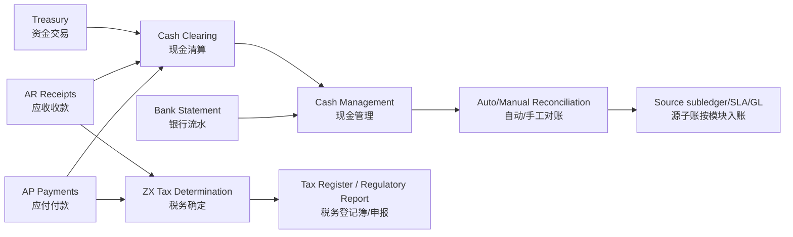
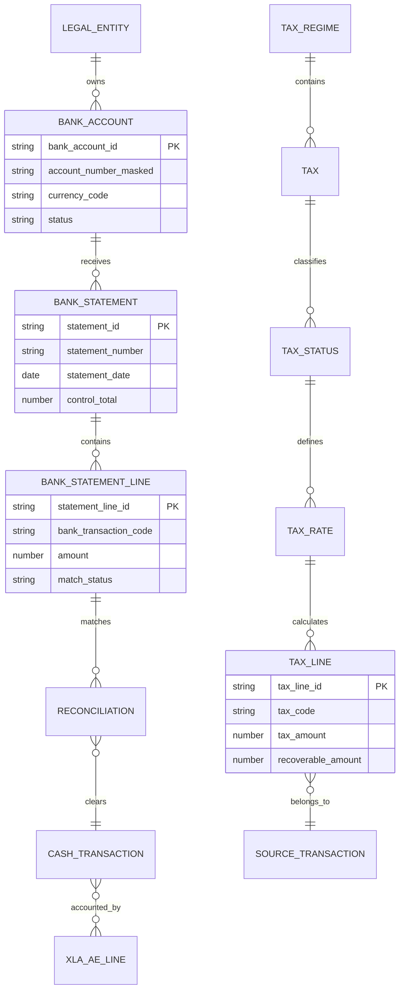
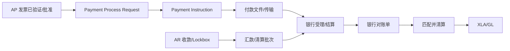
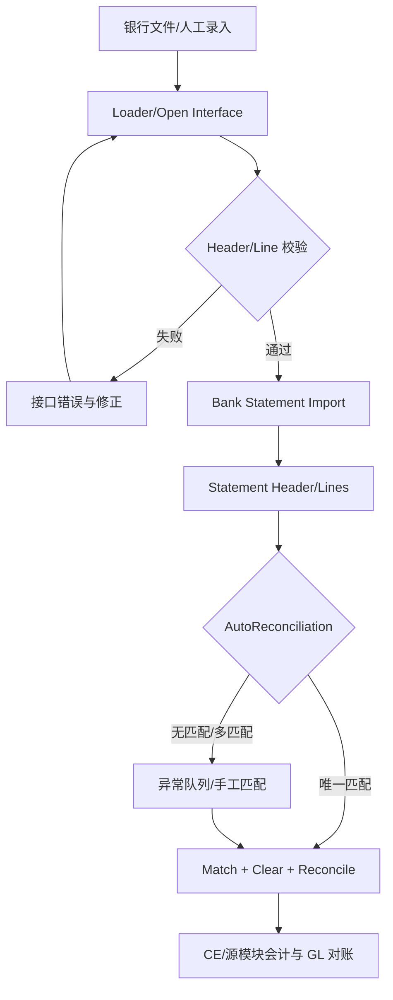
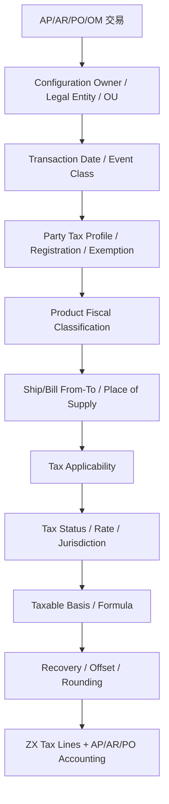
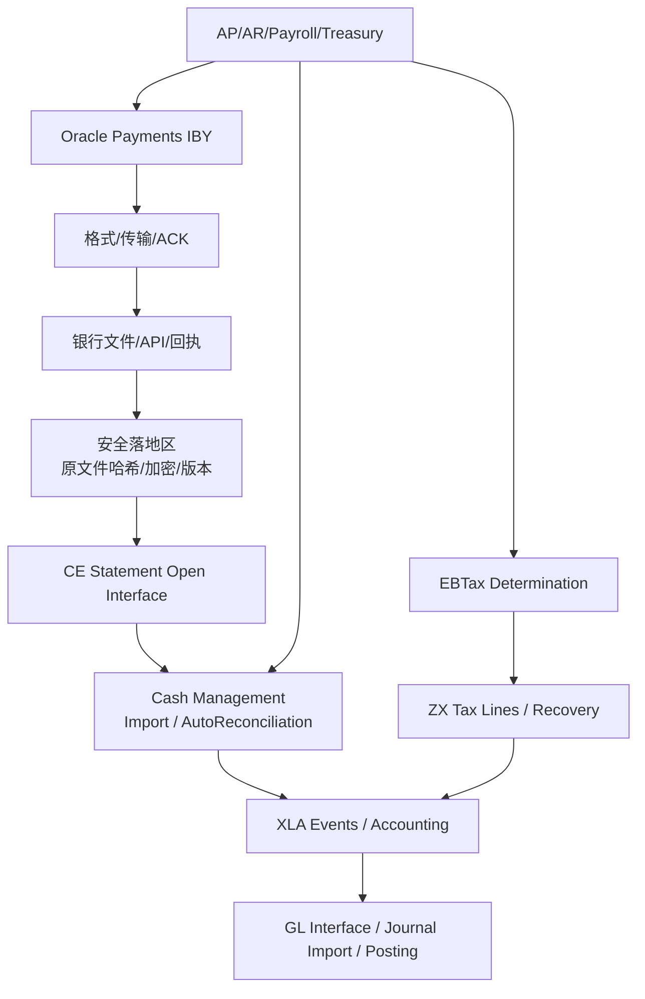
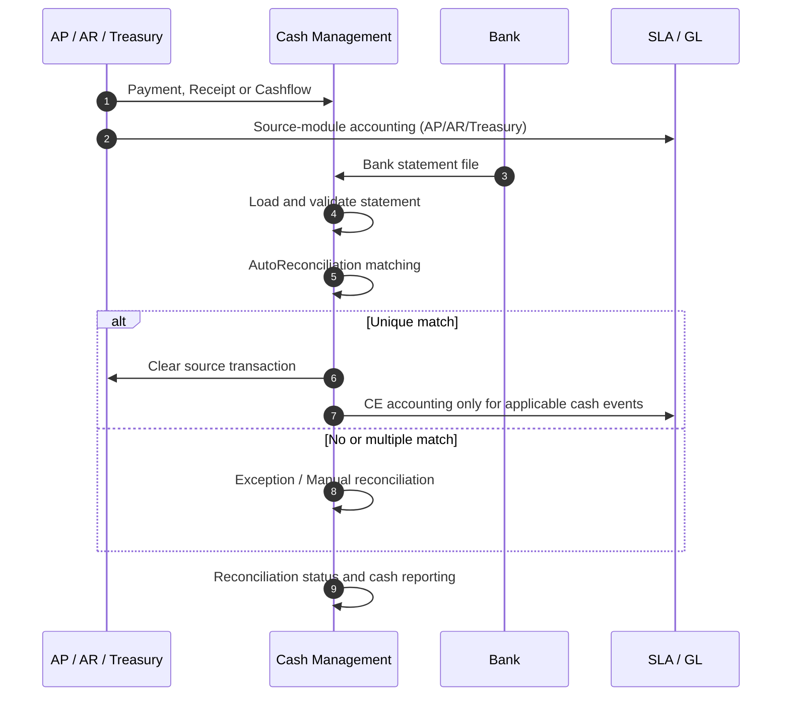
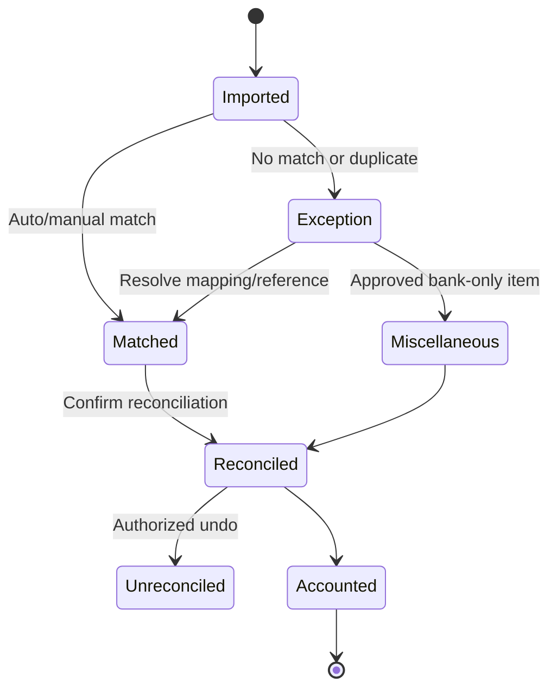
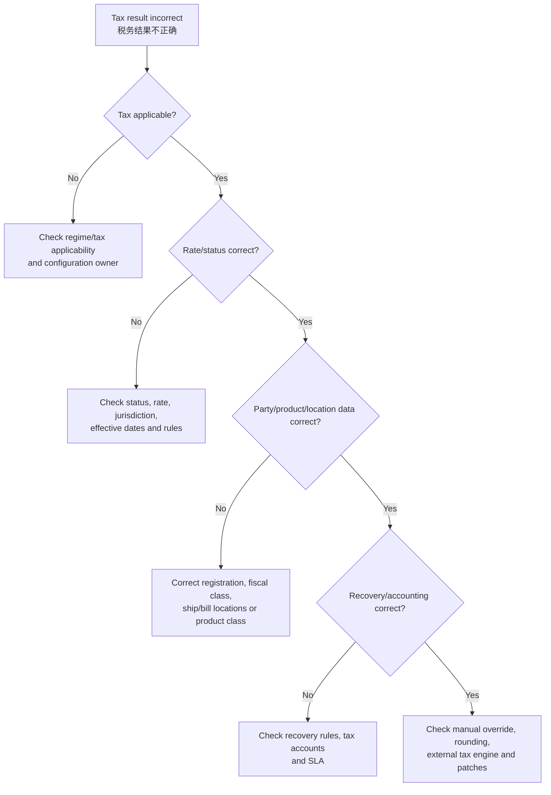

# 现金、资金与税务（Cash, Treasury and Tax）

> 本模块覆盖银行账户、银行流水、现金头寸、对账、资金交易以及 E-Business Tax（电子商务税务，EBTax/ZX）。现金事实以银行回执和对账为准，税务事实以税制、税状态、税率、辖区和产品税属性为准。

## 阅读导航

- [范围](#1-学习目标与边界) · [实施配置](#implementation) · [现金主链](#2-银行与现金主链) · [银行对账](#3-银行流水接口与对账) · [资金管理](#4-现金头寸与资金管理) · [税务确定](#5-e-business-tax-税务确定) · [会计技术](#6-会计和对账) · [页面与税务实操](#9-资深顾问实操银行对账与税务) · [专题详解](#10-专题详解)

## 模块数据字典与名词解释

本模块速查见[统一数据字典](data-dictionary.md#dict-06)。

## 模块业务架构与核心 ER 图

### 现金与税务业务架构图



### 现金与税务核心 ER 图



银行账户号在知识库和日志中应脱敏；税务实体名称是逻辑模型，具体 ZX/CE 表及清算关系必须按版本、本地化和外部银行格式确认。

## 1. 学习目标与边界

应能设计集中式银行账户、AP/AR 与 CE 的清算链、银行流水接口和自动对账；理解现金预测、内部转账和资金产品边界；能够解释 ZX 税务确定流程、恢复税和税务报告。

<a id="implementation"></a>

## 实施配置手册：银行、对账与 EBTax

银行账户和税务规则均属高风险主数据。配置必须由经授权的财务/税务角色执行，并把银行证明、税务解释、规则版本、生效日期和测试交易一起归档。以下导航为常见 R12.2 功能名；Bank Account 管理可能因权限转到 Cash Management 或 Payments 管理职责。

| 顺序 | 配置项 | 预置职责 / 导航（功能名） | 关键配置内容 | 验收动作 |
| --- | --- | --- | --- | --- |
| 1 | 银行、分行与内部账户 | `Cash Management Setup > Setup > Banks > Banks / Bank Accounts` | 维护 Bank/Branch、Internal Bank Account、账户所有法人、币种、有效日期、账号保护和账户控制人 | 创建测试账户（非生产账号）；核对法人、币种、账户掩码和无越权的查询权限 |
| 2 | 账户用途和支付/收款方法 | 银行账户的 `Account Uses`；`Payments Administrator > Setup > Payment Methods`；AR Receipt Method | 分别定义 AP/AR/CE/Treasury Use、OU 权限、付款方法、收款方法、清算账户和格式；账户所有者不等于所有 OU 都可用 | 在 AP PPR、AR Receipt、CE 对账三处查询同一账户，确认可见范围和用途一致 |
| 3 | 银行交易码与对账规则 | `Cash Management Setup > Setup > Transaction Codes`；`Setup > Reconciliation` 功能 | 将银行代码映射为交易类型、现金账户、处理优先级；定义自动匹配条件、容差、日期窗口和例外队列 | 导入包含精确匹配、金额差异、日期差异和未知代码的流水，检查每种结果 |
| 4 | 对账单接口与处理 | `Cash Management > Bank Statements > Import`；`View > Requests` | 确定 BAI/MT940/本地格式或 Bank Statement Open Interface、文件唯一标识、Header/Line 控制总额、拒绝行和重放规则 | 同一文件重复导入必须被识别；测试部分错误文件并保留导入报告与恢复步骤 |
| 5 | 现金预测（如适用） | `Cash Management > Cash Forecasts > Define / Generate` | 定义 Forecast Template、来源、日期范围、币种、预测层级及与已清算事实的边界 | 将预测与已知 AP 付款、AR 收款、GL 余额做小样本桥接；标注实际/预测口径 |
| 6 | 税务框架 | `Tax Manager > Tax Configuration > Tax Regimes / Taxes / Tax Statuses / Tax Rates` | 按 Regime → Tax → Status → Rate 的层级建立税种；维护税率、生效期、税务账户和法规依据 | 创建一笔适用税率与一笔不适用税率交易，确认税行、税额和会计 |
| 7 | 税务确定规则与例外 | `Tax Manager > Tax Configuration > Tax Rules`；适用性/确定性/计算/恢复税规则功能 | 明确决定因素（法人、BU/OU、客户/供应商、地点、产品、交易类型）、规则优先级、免税和恢复税；避免重叠规则 | 对规则边界两侧各测试一笔交易，并记录预期税务状态、税率、例外证书和账户 |
| 8 | 税务报告与变更控制 | Tax Manager 的税务报告/查询功能及受控 BI Publisher 报表 | 指定申报口径、期间、税务登记号、调整处理、报表负责人和锁定/更正流程 | 把税务报表总额与 AP/AR 税行、GL 税务账户做一次三方对账 |

### 生产启用前检查

- 付款文件传输、银行账户激活和自动对账规则必须分阶段启用：测试账户/测试文件通过后，再由双人复核开启生产用途。
- 税务规则每次变更均以生效日期发布；不得覆盖历史税率或靠修改已完成交易修复申报差异。
- 对账差异区分“银行流水未到、账面交易未清算、匹配规则不足、金额/币种错误”四类；先保留原始流水和请求日志，再做更正。

## 2. 银行与现金主链

```text
AP 付款 / AR 收款 / 资金交易
→ Cash Clearing（现金清算）
→ 银行流水导入
→ 自动/人工匹配
→ Reconciliation（银行对账）
→ 清算会计、现金头寸和差异处理
```

银行账户应由 Legal Entity 或组织按授权使用。账户、分行、签字权限、用途、币种和支付/收款方法变更都属于高风险主数据变更。

### 2.1 银行、分行、账户和使用权限

| 层次 | 业务对象 | 关键属性 | 控制重点 |
| --- | --- | --- | --- |
| 贸易社区 | Bank、Branch、Party/Supplier/Customer | 银行名称、分行、国家、地址、SWIFT/本地清算代码 | TCA 身份和银行证明；避免重复分行 |
| 内部账户 | Internal Bank Account | 账号、币种、账户所有者、开户/销户日期 | 账号脱敏、有效期、唯一性和法人所有权 |
| 应用用途 | Bank Account Use | AP、AR、Payroll、Treasury、Cash Management 用途及 OU | 只向获授权 OU/应用开放；不要把账户所有者和 OU 混为一层 |
| 支付配置 | Payment Method/Profile | 付款方式、Payment Process Profile、格式、传输 | 付款格式、银行账户、审批和权限分离 |
| 对账配置 | Reconciliation | 交易码、清算账户、匹配规则、容差、Value Date | 规则版本化；同一账户不同银行格式分别测试 |

账户变更要有申请、银行证明、双人复核、生效日期、旧值封存和下游通知。关闭账户前先完成未达付款/收款、未发送支付文件、未清算流水和税务/法定报表影响评估。

### 2.2 付款、收款到银行的两条清算链



**AP 付款**应区分 Invoice Validation、Payment Selection、PPR、Proposed Payment、Payment Instruction、文件传输、银行 ACK、Cleared 和 Reconciled；PPR 完成不代表银行已经受理。**AR 收款**应区分 Receipt 创建、确认、汇款、清算、核销和银行对账；Lockbox 导入成功不代表每笔收款都已应用到发票。

| 状态层 | AP 示例 | AR 示例 | 处理含义 |
| --- | --- | --- | --- |
| 业务批准 | 发票可付款 | 收款已录入/Lockbox 已验证 | 可进入付款或核销选择 |
| 资金指令 | PPR/Payment Instruction | Remittance Batch | 已生成待银行处理的指令/批次 |
| 银行回执 | Technical ACK/Accepted/Rejected | Deposit/Cleared/Returned | 外部银行事实，须保存 Message ID |
| EBS 清算 | Payment Cleared | Receipt Cleared | 源模块现金账户完成清算 |
| 银行对账 | Statement Line Matched | Statement Line Matched | CE 将银行行与源交易匹配并标记 Reconciled |

支付文件重发必须判断“文件未生成、已生成未传输、已传输未收到回执、银行已受理”四种情况。银行已受理的文件不能通过重新运行 PPR 生成第二笔付款；应使用标准重传/回执处理，并以 Payment Instruction、Transmission 和银行 Message ID 去重。

### 2.3 现金头寸、预测和内部资金调拨

Cash Position（现金头寸）回答“现在有多少可确认现金”；Cash Forecast（现金预测）回答“未来某个时间桶预计有多少现金”。二者都要按法人、银行账户、币种、价值日/到期日和数据来源分层，不能用预测值替代银行对账余额。

| 数据类别 | 典型来源 | 日期口径 | 置信度/用途 |
| --- | --- | --- | --- |
| 已确认余额 | 已导入银行对账单、已清算 AP/AR | Statement Date/Value Date | 最高；现金日报和对账 |
| 在途交易 | 已批准但未付款发票、已录入未清算收款 | Payment/Receipt Date、Maturity Date | 中高；短期头寸 |
| 承诺 | PO、Requisition、合同付款计划 | Need-by/Due Date | 中；资金计划 |
| 预测输入 | 工资、税款、利息、外部资金计划 | Forecast Date/Bucket | 需标注来源和置信度 |
| 内部调拨 | Bank Transfer、Sweep、Cash Pool | Initiation/Settlement/Value Date | 要区分授权、结算和银行到账 |

Cash Forecast Template 应定义来源、时间桶、币种、包含条件、重复消除和日期转换规则。若同时选入 AP Invoice 和 Payment、PO 和 Invoice，应明确是否只保留较确定的一层，避免把同一现金流计算两次。内部转账/归集要记录转出账户、转入账户、金额、币种、授权人、结算日期、银行参考号和两边的对账状态。

### 2.4 Treasury 可选边界

Oracle Treasury（如部署）负责借款、投资、外汇、利率、交易对手、限额、估值和结算；Cash Management 负责银行账户、银行流水、对账和现金预测。实施时应将前台交易、风险/限额、中台确认、后台结算、会计和对账职责分离。未部署 Treasury 时，外部资金系统可以通过 Reconciliation Open Interface 把可对账交易提供给 CE，但不能把外部余额直接写成 EBS 银行余额。

## 3. 银行流水接口与对账

接口契约至少包含账户标识、流水号、价值日、交易日、币种、金额、借贷标识、银行交易码、客户参考和文件控制总额。重复文件识别应组合文件 ID、账户、日期和哈希/控制总额。

### 3.1 导入、验证、对账的标准顺序



Oracle Cash Management 的电子对账单链路通常是：Bank Statement Loader 将文件加载到 Open Interface，Bank Statement Import 把接口行转为正式 Statement，再运行 AutoReconciliation；也可以在同一请求中导入并自动对账。每次运行保存 Request ID、文件哈希、Statement Number、账户、日期、币种、控制总额和错误报告。

### 3.2 文件级、对账单级和流水级控制

| 层级 | 必须校验 | 重复/异常处理 |
| --- | --- | --- |
| 文件 | 文件名、来源、编码、Checksum、账户数、总行数、借贷总额 | 同哈希拒绝；修正版保留版本关系 |
| Statement Header | Bank Account、Statement Number、Statement Date、Currency、Opening/Closing Balance、Control Total | 同账户同编号/日期不能重复导入；多账户文件拆成多个 Statement |
| Statement Line | Line Number、TRX Date、Value Date、TRX Code、Amount、Currency、Bank Reference | 行号重复、金额方向、日期、交易码或币种无效进入错误 |
| 对账结果 | 匹配对象、匹配规则、容差、清算状态、人工原因 | 多候选不自动匹配；撤销对账需授权和会计影响评估 |

Bank Transaction Code 必须按银行格式映射为 CE 交易码。不能仅根据银行文件的正负号推断 Debit/Credit，因为不同格式可能把借方、贷方和费用表示为不同字段。

### 3.3 自动/手工匹配规则

自动匹配优先使用业务上唯一且稳定的参考号，再使用账户、币种、金额和日期窗口。常见匹配组合如下：

| 交易 | 首选参考 | 辅助条件 | 典型容差/例外 |
| --- | --- | --- | --- |
| AP Payment | Payment Number、Payment Batch Name | 银行账户、金额、币种、Cleared Date | 银行费用/金额差异按规则进入 Bank Charges/Errors |
| AR Receipt | Receipt Number、Deposit Number | 客户、金额、币种、日期 | 一对多核销需先确认批次和应用金额 |
| Treasury Settlement | Settlement Number | 日期、金额、币种 | 可通过 Reconciliation Open Interface |
| GL Journal | Journal/External Reference | CCID、金额、日期 | 银行手续费等银行来源项可建 Miscellaneous Transaction |
| 外部交易 | External Transaction ID | 账户、交易码、Value Date | 需先在开放接口中提供可用状态 |

自动对账后应分组分析 Matched、Unmatched、Multiple Match、Error 和 External/Miscellaneous。手工对账要保存选择的源交易、金额差、银行参考、业务原因和审批人；不能用 Miscellaneous Transaction 隐藏尚未调查的差异。

### 3.4 多币种对账

| 场景 | 交易币种 | 银行账户币种 | 处理要点 |
| --- | --- | --- | --- |
| Domestic | 与账簿和账户相同 | 本位币 | 通常不需要交易汇率 |
| International | 与银行账户不同 | 本位币 | 可按清算日期/类型计算汇率并产生汇兑差异 |
| Foreign | 外币 | 同一外币 | 对账单行必须提供汇率信息或启用外币账户参数 |
| Foreign Translated | 外币 | 另一种外币 | AP/AR 场景通常不支持，必须按目标产品验证 |

外币流水需同时考虑 `Amount`、`Original Amount`、Currency、Exchange Rate、Rate Type 和 Rate Date。Cash Management 可能用清算日期计算汇率，但 AutoReconciliation 不一定回写所选汇率到对账单行；查询时要从 Reconciled 详情或会计分录确认实际使用的汇率。

### 3.5 银行错误、退票和撤销

银行可能报告 NSF/退票、止付、直接借记、银行手续费、利息或银行录入错误。先将原始错误行和更正行一起保留，再使用标准 Reversal、Unclear、Unreconcile 或 Miscellaneous Transaction 处理；已生成 SLA/GL 的交易必须评估冲销会计和报表影响。银行对账完成后运行 GL Reconciliation Report，区分账面现金、银行余额、未对账收款、未对账付款、未对账日记账和银行错误。

## 4. 现金头寸与资金管理

Cash Position（现金头寸）强调已发生或高确定性现金；Cash Forecast（现金预测）结合 AP、AR、采购、订单、工资和外部预测。必须标记来源、日期口径、置信度和重复消除规则。

### 4.1 头寸与预测的计算口径

```text
可用现金头寸
= 已对账/已清算银行余额
  + 可确认入账收款
  - 已授权未清算付款
  ± 已确认内部调拨

预测期末现金
= 期初已确认余额
  + 预测收款（按日期/置信度）
  - 预测付款（AP、工资、税、债务、投资）
  ± 内部资金调拨
  ± 汇率/利息假设
```

公式用于管理口径，不能替代 CE/GL 的正式余额。每个来源要带 `Source Type`、业务键、币种、日期、金额、是否已在另一来源出现以及可撤销/已结算标志。预测输出至少按法人、银行账户、币种、时间桶和来源分组，并能回溯到发票、收款、PO、工资或手工预测。

### 4.2 Cash Forecast Template 设计

| 配置 | 设计问题 | 验证场景 |
| --- | --- | --- |
| Source | AP、AR、PO、Requisition、Payroll、Cashflow、手工输入是否启用 | 同一发票同时被 Invoice 和 Payment 来源选取 |
| Date Type | Due Date、Maturity Date、Expected Date、Value Date 如何转换 | 周末/节假日、跨时区、跨期间 |
| Bucket | 日、周、月或自定义时间桶 | 月末截止、滚动 13 周、跨年 |
| Currency | 原币、账户币、法人币、报告币 | 外币汇率缺失/汇率日期不同 |
| Inclusion | 状态、OU/Ledger、账户、项目、最小金额 | 已取消、已付款、已核销交易排除 |
| Confidence | 已确认、承诺、预测、人工覆盖 | 管理层只查看高置信度头寸 |

每次预测运行保存模板版本、参数、汇率日期、生成时间和来源快照。预测差异应拆成实际发生、日期变化、金额变化、汇率变化、来源重复和手工覆盖，不要直接修改结果金额。

### 4.3 银行转账、Sweep 和 Cash Pool

银行转账至少有 Initiated、Authorized、In Transit、Settled、Reconciled、Cancelled/Failed 状态。Sweep 交易要先根据银行对账单生成对应的资金交易，再与转入/转出行匹配；同日多账户流水需依靠 Statement Number、Sequence、Value Date 和银行参考号区分。内部转账两端的金额、币种、价值日和清算账户必须成对核对。

## 5. E-Business Tax 税务确定

典型决定链：Tax Regime（税制）→ Tax（税种）→ Tax Status（税状态）→ Tax Rate（税率）→ Tax Jurisdiction（税务辖区）→ Tax Rule（税规则）。交易方税档案、产品税分类、地点、交易类型和日期共同影响结果。

### 5.1 EBTax 决定因素和规则顺序



| 税务决定因素 | 典型来源 | 影响 |
| --- | --- | --- |
| Configuration Owner | Legal Entity、OU、共享配置 | 哪一套 Tax Regime/规则可用 |
| Transaction/Event Class | AP Invoice、AR Transaction、PO、OM | 适用的事件模型、规则和税行层级 |
| Party Tax Profile | 法人登记、客户/客户地点、供应商/供应商地点 | 注册号、税务分类、免税和反向计税 |
| Product Fiscal Classification | 物料、服务、产品类别、税务分类码 | 税种适用、税率、免税和报告类型 |
| Place of Supply | 发货地、收货地、开票地、服务地点 | 税务辖区和跨境判断 |
| Transaction Date | 发票/收货/服务/税务日期 | 有效期、税率、登记和规则版本 |

EBTax 只有在规则或默认值完整时才应将 Tax 标记为 Available for Transactions：通常至少需要 Place of Supply、Tax Registration、Tax Status/Rate、Taxable Basis、Tax Calculation、Jurisdiction，并在启用 Recovery 时配置 Recovery Rate。规则优先级、默认值和手工覆盖必须在测试矩阵中明确。

### 5.2 税种、税率、辖区和抵扣

| 概念 | 说明 | 典型错误 |
| --- | --- | --- |
| Tax Regime | 某一国家/地区或业务税制容器 | 法人/OU 未关联或有效期错 |
| Tax | 税种，如 VAT/GST/Sales Tax | 税未启用、辖区未定义 |
| Tax Status | 税种下的状态，如 Standard/Zero/Exempt | 状态规则优先级或产品分类错误 |
| Tax Rate | 税率码、百分比/数量费率及有效期 | 只改当前税率而破坏历史交易 |
| Tax Jurisdiction | 地理辖区和辖区税率 | Place of Supply 无法确定 |
| Recovery Rate | 进项税全额/部分/不可抵扣比例 | Recovery Rule 未命中或账户错误 |
| Offset Tax | 反向计税/自计税的抵销税 | 把普通 Tax Rate 当 Offset Tax |

税额基本公式为 `Tax Amount = Taxable Basis × Tax Rate`，但 Inclusive Tax、Compound Tax、舍入、最低/最高阈值、数量费率和税务公式会改变计算。可抵扣金额、不可抵扣金额和税负成本需分别核对；税行金额正确不代表税务会计账户正确。

### 5.3 免税、人工税行和本地化边界

- 免税证书、客户/产品免税、特殊税率和有效期应由税务主数据维护；最具体的有效免税记录通常优先于泛化记录。
- 反向计税/自计税需要原税与 Offset Tax 成对设计，并按当地法规和会计要求确认 100% 抵扣等限制。
- AP/AR 手工税行只在产品允许且经过授权时使用；手工税行不会重新评估全部 Tax Rules，不能作为修复主数据的捷径。
- EBTax 负责交易税务确定和税行，不等于某国全部法定申报、电子发票、代扣税或本地化税务；国家/地区功能、补丁、外部税引擎和法规需单独验收。

## 6. 会计和对账

### 6.1 现金会计分层

| 层次 | 事实 | 典型凭证/结果 |
| --- | --- | --- |
| 源模块 | AP 付款、AR 收款、Treasury 结算 | Liability/Receivable 与 Cash Clearing |
| 银行事实 | Statement Header/Line、Value Date、Bank Reference | 银行余额、费用、利息、退票 |
| CE 对账 | Matched、Cleared、Reconciled、External | 清算状态和对账审计 |
| SLA/GL | 现金、清算、银行费用、汇兑损益 | XLA Event/AE → GL Journal/Balance |

对账状态和会计状态是两套独立状态：一笔交易可以已会计但未对账，也可以已与银行行匹配但会计仍失败。查询和关账必须分别检查两者。

### 6.1.1 默认标准会计分录与无会计边界

银行对账单的导入、查询、自动匹配和手工匹配主要记录银行事实与对账关系，**不是必然的新会计事件**。AP 付款、AR 收款的原始会计通常仍由各自子账生成；CE 对银行转账、外部现金流、对账差异或特定清算事件可通过 SLA 生成会计。标准经济方向如下：

| 业务事实 | 标准经济分录（借 / 贷） | 边界与核对 |
| --- | --- | --- |
| AP 付款使用清算账户 | 源 AP：借：AP Liability，贷：Cash Clearing<br>清算：借：Cash Clearing，贷：Cash | 清算会计来源可能是 AP/CE 集成设置；导入银行行或匹配本身不应重复贷记现金 |
| AR 收款使用清算账户 | 源 AR：借：Cash Clearing，贷：Receivables/Unapplied Cash<br>清算：借：Cash，贷：Cash Clearing | 收款核销状态与清算状态需分别核对；未核销款不可直接冲减指定应收 |
| 银行手续费/对账容差差额 | 借：Bank Charges/Bank Errors<br>贷：Cash | 仅当 CE 根据银行行创建外部交易或在容差内自动记账时适用；账户来自 Transaction Code/系统参数 |
| 银行利息收入 | 借：Cash<br>贷：Interest Income | 应以银行流水、交易码和税务处理为依据；不是所有银行文件行都会自动创建该交易 |
| 银行账户间转账 | 借：目标银行 Cash（或 Transfer Clearing）<br>贷：来源银行 Cash（或 Transfer Clearing） | 同账簿可直接或经清算账户；跨 Ledger/法人还需跨公司会计，不能以单一内部转账模板替代 |
| 外币清算/银行差额 | 损失：借：Exchange Loss；收益：贷：Exchange Gain | 由账簿金额、汇率日期/类型和银行行汇率决定；银行原币金额和功能币金额须分开对账 |
| 退票/NSF、支付退回 | 不在 CE 直接硬编码：按 AR/AP 标准撤销或退回流程恢复 Receivable/Liability，并冲回 Cash/Clearing | CE AutoReconciliation 可解除匹配/清算；后续会计必须回到来源交易和银行事实确认 |
| EBTax 税务确定、税务报告 | 无独立“税务确定”分录；交易税行在 AP/AR/其他来源交易会计时进入 Tax Recoverable/Tax Liability 等账户 | Tax Regime/Rate/Rule 的建立和税表输出不是总账凭证；可抵扣、不可抵扣、offset tax、预扣税及本地化需按规则单独测试 |

### 6.2 对账公式和报表

```text
银行期末余额
− 未达付款
＋ 未达收款
± 未达 GL 日记账/银行错误
= 调整后账面现金余额

税额控制
＝ 交易税行
＝ 税务登记簿/法定提取（按报告口径）
＝ 税务 SLA/GL 税账户（按会计口径）
```

银行余额与 GL 余额差异必须拆成未达付款、未达收款、未达日记账、银行手续费/利息、汇率差、银行错误和数据重复。Oracle Cash Management 的 GL Reconciliation Report 可按 Summary/Detail 查看 GL 现金账户、调整后银行余额和未对账项目；每个银行账户最好对应清晰、可独立对账的 GL Cash Account。

### 6.3 期间关闭顺序

```text
银行文件/付款/收款/税务交易全部导入
→ 清理接口错误和未完成回执
→ AP/AR/CE/Treasury 源模块会计 Final
→ AutoReconciliation + 手工异常签核
→ ZX 税行、税务登记簿、税账户对账
→ Transfer to GL / Journal Import / Posting
→ 银行余额、现金清算、税账户和 GL 对账
→ 关闭 CE/源子账/GL 期间并归档证据
```

税率或登记变更跨越期间时，保留旧版本和生效日期；不要通过更新历史税行或直接冲销税账户掩盖税务差异。

## 7. 技术视角

### 7.1 跨模块技术架构



银行文件、付款文件、税号、客户/供应商银行账户和税务登记均属敏感数据。落地层使用加密、访问控制、病毒扫描、Checksum、不可变归档和生命周期策略；日志只保留掩码账号、请求 ID、外部键、状态和错误摘要。

### 7.2 接口矩阵和幂等设计

| 来源 → 目标 | 推荐边界 | 关键输入/外部键 | 成功证据 |
| --- | --- | --- | --- |
| 银行 → CE | Bank Statement Loader/Open Interface | Account、Statement Number/Date、Line Number、TRX Code、Amount、Value Date、Hash | 正式 Statement Header/Lines、Import Report |
| 外部资金系统 → CE | Reconciliation Open Interface | External Transaction ID、Account、Date、Currency、Amount、状态 | CE 可用交易可被匹配/清算 |
| AP → IBY | PPR/Payment Process Profile | Invoice、Supplier、Payee Bank、Payment Method、PPR ID | Payment Instruction、Transmission、ACK |
| AR/外部收款 → AR/CE | AutoLockbox/Receipt/Open Interface | Receipt/Deposit/Batch、Customer、Amount、银行参考 | Receipt、Application、Cleared/Reconciled |
| AP/AR/PO → ZX | 标准交易接口传 Determining Factors | Tax Classification、Party/Location、Tax Date、Regime | ZX Tax Line、Recovery/Accounting |
| CE/IBY/ZX → GL | Create Accounting/Transfer/Journal Import | Event、Ledger、Accounting Date、CCID、借贷金额 | XLA Final、GL Journal/Posting |

推荐幂等键：`source_system + bank_account_or_legal_entity + statement_or_document + line_or_sequence + currency + business_date`。同一文件修正版使用版本号和父文件键，不能覆盖原始文件。接口日志保存 `request_id`、父/子请求、外部键、EBS 主键、状态、错误码、重试次数、文件哈希和银行 Message ID。

### 7.3 接口状态与重放

```text
RECEIVED → VALIDATED → LOADED/IMPORTED → RECONCILED/ACCOUNTED
        ↘ REJECTED → CORRECTED → RETRIED
        ↘ DUPLICATE → ARCHIVED
        ↘ ACK_PENDING → ACCEPTED/REJECTED/UNKNOWN
```

重放前先查询 EBS 主键和外部键：银行文件看 Statement Number/Hash，付款看 Payment Instruction/Transmission，收款看 Receipt/Deposit，税务看源交易/行和 Tax Line。部分成功时只重送失败行；对 `UNKNOWN` 回执先向银行查询，不要直接新建付款。

### 7.4 性能、安全和版本

- 大批量银行文件按账户/日期分片，Loader、Import 和 AutoReconciliation 分阶段运行，避免同一账户并发锁定。
- 对账查询按 Statement Header、账户、日期和状态过滤；税行查询必须带 Application、Entity/Event Class 和 `TRX_ID`，避免跨产品误连。
- 不直接更新 `CE_*`、`IBY_*`、`ZX_*`、`XLA_*` 业务表；使用标准程序、Open Interface、API 或 Integration Repository 服务。
- 银行格式、税务规则和本地化补丁纳入版本管理；以真实文件和代表性交易回放自动化回归测试。

## 8. 高频问题与练习

### 8.1 高频问题定位矩阵

| 症状 | 先查什么 | 常见根因 | 正确修复 |
| --- | --- | --- | --- |
| 银行流水未导入 | 文件哈希、账户、Statement Number、接口错误 | 文件格式/编码、账号映射、控制总额或重复 | 修正 Loader/映射后只重跑失败文件 |
| 银行流水未匹配 | 交易码、Reference、金额、币种、日期窗口 | 银行代码未映射、参考号截断、容差不合适 | 调整规则或人工匹配并留证，不伪造源交易 |
| 自动对账金额差异 | Bank Amount、Original Amount、Charges、汇率 | 银行费用、汇率、正负号或 Value Date | 按 Bank Charges/Errors 或标准调整处理 |
| 付款文件状态未知 | Payment Instruction、Transmission、ACK/Message ID | 只有技术回执、业务回执延迟或传输重试 | 先查银行和 IBY 状态，再决定重传 |
| 现金预测偏高/重复 | Template Source、日期、状态和来源键 | Invoice+Payment、PO+Invoice 重复计入 | 明确选择规则，保留来源快照后重算 |
| 税未计算 | Owner、Regime、Tax、Party Registration、Place | 税不可用、登记/地点缺失、日期不在有效期 | 修正配置/主数据并重新计算交易 |
| 税率错误 | Status、Rate、Jurisdiction、Fiscal Class | 规则优先级、免税、产品分类或辖区不符 | 对比确定因素，不直接改最终税额 |
| 税额正确但账户错误 | ZX Tax Line、Recovery、SLA/AutoAccounting | 抵扣率、税账户或会计规则错误 | 修正 Recovery/账户规则并重做会计 |
| CE 与 GL 不符 | Clearing/Reconciliation、会计事件和期间 | 未清算、未会计、手工 GL、重复或汇兑 | 按银行-CE-源子账-SLA-GL 链路逐层对账 |

### 8.2 最小端到端测试矩阵

| 场景 | 必测变体 | 预期控制点 |
| --- | --- | --- |
| AP 付款 | 本币/外币、银行费用、退票、重传 | PPR、IBY 状态、银行 ACK、清算和对账 |
| AR 收款 | 单发票、多发票、On-account、Unidentified、退回 | Receipt、Application、Remittance、Cleared、Lockbox 错误 |
| 银行对账 | 唯一匹配、多匹配、无匹配、Misc、银行错误 | 规则优先级、容差、人工原因、GL Reconciliation |
| 现金预测 | Invoice+Payment、PO+Invoice、工资/税款、内部转账 | 来源去重、时间桶、币种、置信度和版本 |
| 税务 | 标准、零税率、免税、反向计税、部分抵扣、贷项 | Regime→Rate、Place、Registration、Recovery、税行和报告 |
| 多组织/多币种 | 跨 OU/法人、外币账户、跨辖区 | 安全上下文、账户用途、汇率日期、税务登记和清算账户 |

建议完成一笔 AP 付款至银行清算、一笔 AR Lockbox 至对账，以及一笔含可抵扣/不可抵扣税的采购交易。

## 9. 资深顾问实操：银行对账与税务

### 9.1 银行对账时序图



### 9.2 页面剧本：导入银行流水

**常见职责与导航**：`Cash Management（现金管理） → Bank Statements（银行对账单） → Bank Statement Interface/Import`，也可通过 Standard Request Submission 提交银行流水导入程序。

1. 接收文件时验证文件名、银行账户、Statement Number/Date、币种、行数、借贷金额和控制总额。
2. 把文件载入 Bank Statement Open Interface；记录文件 ID、接口批次和原始文件哈希。
3. 提交 Bank Statement Import，检查请求日志、接口错误和成功生成的 Statement Header/Lines。
4. 查询 Bank Statement，核对 Opening/Closing Balance、Control Total、行数和 Bank Transaction Code。
5. 对失败行修正映射或主数据；重跑前排除已成功导入的 Statement/Line。

银行为一个文件提供多个账户时，EBS 通常按账户和对账单日期分别建立 Statement。接口设计不要仅用文件名作为唯一键。

### 9.3 页面剧本：自动与手工对账

1. 在 `Bank Statements → Reconcile Bank Statements` 查询账户和 Statement。
2. 先运行 AutoReconciliation，记录规则、日期/金额容差和请求 ID。
3. 复核 Matched、Unmatched 和多重候选；检查 Transaction Number、Amount、Currency、Date 和 Bank Transaction Code。
4. 对唯一且证据充分的异常行执行 Manual Reconciliation；选择 AP Payment、AR Receipt、Cashflow、Payroll、GL Journal 或 Open Interface Transaction。
5. 需要建立 Miscellaneous Transaction 时，使用批准的 Receivable Activity/账户和原因，不用杂项行掩盖未知差异。
6. 完成后运行对账报表，核对银行余额、账面余额、未达项和 GL Cash/Clearing。

### 9.4 银行异常恢复状态图



撤销对账前评估源交易 Clearing 状态、SLA/GL 分录、下游现金头寸和已发布报表。银行已结算但 EBS 未识别时，先建立调查项，不应直接重建付款或收款。

### 9.5 页面剧本：设置税率

**常见职责与导航**：`Tax Managers（税务经理） → Tax Configuration（税务配置） → Tax Regimes（税制）`，从 Regime to Rate Flow（税制到税率流程）进入 Tax、Status、Jurisdiction 和 Rate。

1. 选择 Configuration Owner、Tax Regime、Tax 和 Tax Status，确认适用法人/配置所有者。
2. 新增 Tax Rate Code，选择 Percentage/Quantity 等 Rate Type，输入税率和有效期。
3. 若为辖区税率，选择 Tax Jurisdiction；确认币种、舍入和税包含/不含价规则。
4. 配置 Recovery Rate/Rule（抵扣率/规则）和 Reporting Type（报告类型，如适用）。
5. 不覆盖历史有效记录；用新生效日期管理税率变化，并评估未完成交易。
6. 在 AP 与 AR 各测试一笔标准、免税/零税率、贷项和跨有效期交易，核对税行、会计和税务报表。

### 9.6 税务确定诊断树



### 9.7 资深顾问控制重点

- 银行主数据变更实行双人审批、账号脱敏和生效日期控制。
- 对账规则按唯一性优先于自动率设计；多候选不自动匹配。
- 税率变更保留旧有效记录，提前测试未完成 PO、发票、订单和贷项。
- 外部税引擎需记录请求/响应、超时、降级和重放策略；禁止日志泄露敏感信息。
- 现金与税务月结分别建立 CE-GL、银行-CE、ZX 子账-税务报表-GL 对账。

### 9.8 页面剧本：AP 付款到银行对账

1. **付款前**：确认发票已验证、无付款挂起，供应商/收款人银行账户、付款方法、币种、到期日和 Payment Process Profile 有效。
2. **创建 PPR**：在 Payments Manager 选择模板、付款日期、账簿/OU、付款账户、选择规则和付款文件格式；保存 PPR 编号。
3. **审核 Proposed Payments**：核对供应商、发票、金额、折扣、预付款应用和付款组；发现异常时从 PPR 排除而不是删除发票。
4. **生成 Payment Instruction**：检查格式化日志、付款指令金额、文件哈希和收款人数量；审批人与文件生成/传输人分离。
5. **传输与回执**：发送到银行，分别记录传输成功、技术 ACK、业务接受/拒绝、结算和退票；未知状态先查询银行 Message ID。
6. **导入银行对账单**：按账户和 Statement Date 导入，检查付款号/批次号、银行金额、费用和 Value Date。
7. **自动/手工对账**：AutoReconciliation 唯一匹配后确认 Cleared/Reconciled；银行费用按批准的 Cash Management Activity 处理。
8. **会计与归档**：确认 AP/IBY/CE SLA、GL 批次、付款文件、银行回执和对账报告可相互下钻。

### 9.9 页面剧本：AR 收款与 Lockbox 对账

1. 接收银行 Lockbox 文件，验证 Transmission、Batch、Deposit、账户、币种、总额和文件哈希。
2. 运行 Lockbox 导入/验证；按 Receipt、客户、发票参考和金额检查已应用、On-account、Unidentified 与拒绝行。
3. 修正客户/发票匹配或建立调查队列；不要把不明收款强制应用到相似金额发票。
4. 确认 Receipt、Application、Remittance、Cleared 状态，再导入对应银行 Statement。
5. AutoReconciliation 匹配 Deposit/Receipt；退票或短款使用标准 Reversal/调整并复核 AR 余额。
6. 对账完成后核对 AR Receipt、CE 清算、银行余额、SLA/GL 和 Lockbox Exception Report。

### 9.10 页面剧本：现金预测与资金调拨

1. 复制并版本化 Cash Forecast Template，确认来源、时间桶、币种、日期类型、OU/Ledger 和状态过滤。
2. 运行 Forecast，分层查看已确认余额、AP/AR 在途、PO/合同承诺、工资/税款和手工预测。
3. 检查 Invoice+Payment、PO+Invoice 等重复来源，记录排除规则与来源快照。
4. 发现短缺时创建 Bank Transfer/Sweep/Cash Pool 计划，指定转出/转入账户、授权人、币种、Value Date 和清算账户。
5. 结算后导入银行流水，匹配两端转账；将预测值与实际银行余额按“金额/日期/汇率/来源”拆分差异。

### 9.11 页面剧本：EBTax 税务配置与交易验证

1. 在 Tax Managers 职责中确认 Configuration Owner、Legal Entity/OU、Tax Regime 与 Party Tax Profile。
2. 按 Regime to Rate Flow 配置 Tax、Tax Status、Tax Rate、Jurisdiction、有效期、Recovery Rate 和 Reporting Type。
3. 配置确定因素：Party Registration/Exemption、产品 Fiscal Classification、Place of Supply、交易类型和税务日期。
4. 用 AP、AR、PO/Receipt 和 Credit/Return 各测试标准、免税、零税率、反向计税、部分抵扣和外币交易。
5. 查询 ZX Tax Lines，核对 Taxable Basis、Tax Rate、Tax Amount、Recoverable/Nonrecoverable、税币/功能币和舍入。
6. 运行源模块 Create Accounting，核对税账户、应付/应收、税务登记簿和法定报表；保留规则命中和人工覆盖证据。

### 9.12 页面剧本：现金与税务月结

| 顺序 | 操作 | 验收证据 |
| --- | --- | --- |
| 1 | 完成银行文件、付款、收款、Lockbox、Treasury 和税务接口导入 | 文件/批次控制总额、哈希、请求 ID |
| 2 | 清理接口错误、未知回执、未匹配和重复 | Exception Report、调查项、重放记录 |
| 3 | 完成 AP/AR/CE/IBY/Treasury 会计 | SLA Final、GL Import/Posting |
| 4 | 完成 AutoReconciliation 和人工异常审批 | 银行余额、未达项、清算状态 |
| 5 | 核对 ZX 税行、登记簿、Recovery 和税账户 | 税务报表/GL 对账、税务负责人签核 |
| 6 | 关闭期间并归档 | 参数、日志、输出、回执、对账和版本化配置 |

### 9.13 官方操作依据

- [Oracle Cash Management User Guide — Bank Reconciliation](https://docs.oracle.com/cd/E26401_01/doc.122/e48900/T359831T359834.htm)
- [Oracle Cash Management User Guide — Automatic Reconciliation and Multi-Currency](https://docs.oracle.com/cd/E26401_01/doc.122/e48900/T359831T359837.htm)
- [Oracle Cash Management User Guide — Reconciliation Open Interface](https://docs.oracle.com/cd/E26401_01/doc.122/e48900/T359831T359835.htm)
- [Oracle Cash Management User Guide](https://docs.oracle.com/cd/E26401_01/doc.122/e48900/toc.htm)
- [Oracle E-Business Tax User Guide — Tax Regimes and Rates](https://docs.oracle.com/cd/E26401_01/doc.122/e48751/T439959T439962.htm)
- [Oracle E-Business Tax User Guide — Tax Registrations and Recovery](https://docs.oracle.com/cd/E26401_01/doc.122/e48751/T439959T439963.htm)
- [Oracle E-Business Tax User Guide — Tax Transactions and Manual Tax Lines](https://docs.oracle.com/cd/E26401_01/doc.122/e48751/T439959T470305.htm)
- [Oracle Payables User Guide — Payment Process Requests](https://docs.oracle.com/cd/E26401_01/doc.122/e48760/T295436T369088.htm)

## 10. 专题详解


<!-- source: docs/07-ce-tax/README.md -->
<a id="src-docs-07-ce-tax-readme"></a>
### 现金管理、付款与税务（CE / IBY / EBTax）


本目录覆盖银行账户与用途、银行对账单、自动核对、现金预测、Oracle Payments 支付链和 E-Business Tax 税务确定。银行账户是跨 AP、AR、CE、IBY、Treasury 和 GL 的公共主数据，权限、加密、审批、回执与对账不可分割。

<a id="src-docs-07-ce-tax-readme--专题导航"></a>
#### 专题导航

- [银行、账户、对账单与自动核对](#src-docs-07-ce-tax-cash-management)
- [现金预测、清算与银行接口](#src-docs-07-ce-tax-cash-forecast-interfaces)
- [Treasury、现金头寸与银行主数据治理](#src-docs-07-ce-tax-treasury-bank-governance)
- [税种、税率、规则与排错](#src-docs-07-ce-tax-ebtax)
- [税务报告、本地化与合规控制](#src-docs-07-ce-tax-tax-reporting-localization)
- [表结构](#src-docs-07-ce-tax-tables)
- [银行对账单、支付、税务接口实现](#src-docs-07-ce-tax-interfaces)

<a id="src-docs-07-ce-tax-readme--运行控制"></a>
#### 运行控制

| 领域 | 必须对账的对象 | 关键例外 |
| --- | --- | --- |
| CE | 银行对账单余额、已核对/未核对 AP/AR/Treasury/GL 交易 | 重复导入、日期错位、银行交易代码映射错误 |
| IBY | PPR、付款指令、支付文件、传输、ACK、作废/重发 | 文件已发出但状态未回写、回执与付款状态不一致 |
| EBTax | 交易税行、税务登记、税率、Recoverability、税务报告 | 税务决定因素缺失、Tax Regime/Status/Rate 不适用、反向计税错误 |

<a id="src-docs-07-ce-tax-readme--安全边界"></a>
#### 安全边界

银行账号、证书、密钥、支付文件和税务身份信息不得写入示例或日志。接口只保存必要的掩码、哈希、外部业务键和审计相关号；敏感明细的查询权限应受职责和数据库最小授权约束。

<a id="src-docs-07-ce-tax-readme--官方依据"></a>
#### 官方依据

- [Oracle Cash Management Documentation](https://docs.oracle.com/cd/E26401_01/nav/financials.htm)
- [Oracle E-Business Tax Documentation](https://docs.oracle.com/cd/E26401_01/nav/financials.htm)


<!-- source: docs/07-ce-tax/cash-forecast-interfaces.md -->
<a id="src-docs-07-ce-tax-cash-forecast-interfaces"></a>
### 付款/收款清算、现金预测与银行接口


> 银行对账单两张接口表、IBY 付款/回执和 EBTax 传参代码见 [CE/IBY/EBTax 接口实现案例](#src-docs-07-ce-tax-interfaces)。

<a id="src-docs-07-ce-tax-cash-forecast-interfaces--现金预测"></a>
#### 现金预测

Cash Forecast Template 定义来源、时间桶、币种和包含条件。来源可包括 AP Invoices/Payments、AR Transactions/Receipts、PO/Requisitions、Payroll、Cashflows 和手工预测。Forecast 是预期流动性，不是 GL 实际现金余额。

<a id="src-docs-07-ce-tax-cash-forecast-interfaces--银行接口设计"></a>
#### 银行接口设计

- 入站：Bank Statement/Lockbox/Acknowledgement，保存原始文件、Checksum、Bank/Account、Sequence、批次和重复键。
- 出站：Payment File/Positive Pay/Remittance，使用 IBY Format/PPP/Transmission，实施加密、签名、安全传输和回执。
- 不将银行账号、个人信息或私钥写入并发日志；设置文件保留/脱敏/归档策略。

<a id="src-docs-07-ce-tax-cash-forecast-interfaces--sql"></a>
#### SQL

```sql
-- 未对账银行流水汇总
SELECT csh.bank_account_id, csl.trx_type, csl.status,
       COUNT(*) line_count, SUM(csl.amount) amount
  FROM ce_statement_headers csh
  JOIN ce_statement_lines csl
    ON csl.statement_header_id = csh.statement_header_id
 WHERE csh.statement_date BETWEEN :p_start_date AND :p_end_date
 GROUP BY csh.bank_account_id, csl.trx_type, csl.status;

-- 请求参数和日志线索
SELECT request_id, phase_code, status_code,
       actual_start_date, actual_completion_date,
       argument_text, logfile_name, outfile_name
  FROM fnd_concurrent_requests
 WHERE request_id = :p_request_id;
```

<a id="src-docs-07-ce-tax-cash-forecast-interfaces--排查"></a>
#### 排查

- Forecast 为空：检查 Template Source、Cutoff Date/Bucket、OU/Ledger/Bank Account、Currency 和源单据状态。
- Forecast 重复：检查多来源是否同时包含 Invoice+Payment/Order+Invoice，理解预测选择规则。
- Bank File 重复：使用 Bank Account + Statement/File ID + Sequence + Checksum 幂等，不仅依赖文件名。
- 传输失败：查证书/密钥有效期、SFTP/HTTPS 连通、目录权限、文件编码、银行回执和 IBY/OPP 日志。

<a id="src-docs-07-ce-tax-cash-forecast-interfaces--关联"></a>
#### 关联

- [Cash Management](#src-docs-07-ce-tax-cash-management)
- [Integration](10-technical.md#src-docs-09-technical-integration)


<!-- source: docs/07-ce-tax/cash-management.md -->
<a id="src-docs-07-ce-tax-cash-management"></a>
### 现金管理：银行、银行账户、对账单与自动核对


<a id="src-docs-07-ce-tax-cash-management--模型与流程"></a>
#### 模型与流程

R12 银行/分行基于 TCA，内部银行账户由 CE 管理，账户所有者/用途决定 AP/AR/Payroll/Treasury 在哪个 Legal Entity/OU 下可用。

```text
Bank Statement Import/Manual Entry
→ Header/Lines → AutoReconciliation Matching
→ Reconciled/Unreconciled/Errors
→ Cash Position + Accounting/Close
```

AutoReconciliation 根据 Transaction Code Mapping、Reference、Amount/Date Tolerance、Receipt/Payment Number 等规则匹配 AP Payment、AR Receipt、Cashflow、Bank Transfer 和手工现金交易。

<a id="src-docs-07-ce-tax-cash-management--sql"></a>
#### SQL

```sql
SELECT cba.bank_account_id, cba.bank_account_name,
       cba.bank_account_num, cba.currency_code,
       cba.start_date, cba.end_date,
       cba.account_owner_org_id
  FROM ce_bank_accounts cba
 WHERE cba.bank_account_id = :p_bank_account_id;

SELECT csh.statement_header_id, csh.bank_account_id,
       csh.statement_number, csh.statement_date,
       csh.currency_code, csh.control_begin_balance,
       csh.control_end_balance
  FROM ce_statement_headers csh
 WHERE csh.bank_account_id = :p_bank_account_id
 ORDER BY csh.statement_date DESC;

SELECT csl.statement_line_id, csl.line_number,
       csl.trx_date, csl.trx_type, csl.trx_code,
       csl.amount, csl.status, csl.bank_trx_number,
       csl.invoice_text
  FROM ce_statement_lines csl
 WHERE csl.statement_header_id = :p_statement_header_id
 ORDER BY csl.line_number;
```

<a id="src-docs-07-ce-tax-cash-management--排查"></a>
#### 排查

- 银行账户不可选：查 Owner Legal Entity、OU Use、Application Use、Currency、有效期和用户权限。
- Statement Import 错：检查 Bank Account/Number、Currency、Statement Number 唯一性、Control Balance、Transaction Code 和文件格式。
- AutoReconciliation 匹配不到：比较 Transaction Type/Code、Reference、Amount/Date/Currency、原交易状态和容差。
- 对账后 GL 不对：跟踪 AP/AR/CE 原交易、Clearing Event、SLA 和 GL Post，区分对账状态与会计状态。

<a id="src-docs-07-ce-tax-cash-management--关联"></a>
#### 关联

- [CE/IBY/EBTax 常用表结构与字段含义](#src-docs-07-ce-tax-tables)
- [AP Payments](03-procure-to-pay.md#src-docs-02-ap-payments)
- [AR Receipts](04-credit-to-cash.md#src-docs-03-ar-receipts)


<!-- source: docs/07-ce-tax/ebtax.md -->
<a id="src-docs-07-ce-tax-ebtax"></a>
### Oracle E-Business Tax（EBTax）税种、税率、规则与排错


<a id="src-docs-07-ce-tax-ebtax--税务确定模型"></a>
#### 税务确定模型

```text
Configuration Owner / Legal Entity / OU
→ Tax Regime → Tax → Tax Status → Tax Rate / Jurisdiction
→ Party Tax Profile / Registration / Exemption
→ Determining Factors + Rules
→ Tax Lines / Recoverability / Accounting
```

EBTax 是一套中央税引擎。应用产品（AP/AR/PO/OM）传入交易日期、法人/OU、交易业务类别、产品财政分类、交易方税务分类、Ship From/To/Bill From/To 等确定因素；规则按优先级确定 Applicable Tax、Place of Supply、Status、Rate、Taxable Basis、Recovery 等。

范围边界必须写入方案：Oracle E-Business Tax 不提供 Payables 代扣税服务，也不覆盖 Latin American Receivables 与 India transaction taxes 等本地化税务功能。需要这些场景时，应按目标国家/地区的本地化产品、补丁和法定申报方案单独设计，不能把“代扣税”直接当作通用 EBTax 规则测试项。

<a id="src-docs-07-ce-tax-ebtax--配置"></a>
#### 配置

1. 确定 Configuration Owner Tax Options 和 Party Tax Profile/Registrations。
2. 定义 Regime/Tax/Status/Rate/Jurisdiction，检查有效期与地理范围。
3. 定义 Fiscal Classifications、Tax Zones、Determining Factor Sets/Conditions/Rules。
4. 定义 Tax Accounts、Recovery Rates、Exemptions、Thresholds、Inclusive/Compound Tax。
5. 按 AP/AR/PO/OM、手工/接口、Credit/Return、预付、外币、不同地址组合建立测试矩阵。

<a id="src-docs-07-ce-tax-ebtax--sql"></a>
#### SQL

```sql
-- 税行与源单据；ENTITY/EVENT_CLASS 按产品解读
SELECT zxl.tax_line_id, zxl.application_id,
       zxl.entity_code, zxl.event_class_code,
       zxl.trx_id, zxl.trx_line_id, zxl.trx_level_type,
       zxl.tax_regime_code, zxl.tax, zxl.tax_status_code,
       zxl.tax_rate_code, zxl.tax_rate, zxl.taxable_amt,
       zxl.tax_amt, zxl.tax_amt_funcl_curr,
       zxl.cancel_flag, zxl.delete_flag
  FROM zx_lines zxl
 WHERE zxl.application_id = :p_application_id
   AND zxl.trx_id = :p_trx_id
 ORDER BY zxl.tax_line_id;

SELECT tax_regime_code, tax, tax_status_code,
       tax_rate_code, percentage_rate,
       effective_from, effective_to, active_flag
  FROM zx_rates_b
 WHERE tax_regime_code = :p_tax_regime_code
   AND tax = :p_tax
 ORDER BY effective_from;
```

<a id="src-docs-07-ce-tax-ebtax--排查方法"></a>
#### 排查方法

1. 锁定 Application/Entity/Event Class/Trx ID/Line ID，不只用发票号查 ZX。
2. 重建税确定因素快照：Owner/LE/OU、Date、Party Registrations、Locations、Product/Party Fiscal Classification。
3. 按 Applicable Tax → Place of Supply → Status → Rate → Basis → Recovery 的顺序查规则、优先级和默认。
4. 比较正常/异常单据的所有确定因素，而不是直接比较最终 Tax Rate。

常见问题：税不计算通常是 Owner/Regime Applicability/Date/Place of Supply 不匹配；税率错通常是 Status/Rate Rule 优先级或 Registration/Class 不同；进项税不可抵扣要检查 Recovery Rule/Rate/Account；会计错要区分 ZX Tax Line 正确但 SLA 账户派生错的情况。

<a id="src-docs-07-ce-tax-ebtax--关联"></a>
#### 关联

- [AP Invoices](03-procure-to-pay.md#src-docs-02-ap-invoices)
- [AR Transactions](04-credit-to-cash.md#src-docs-03-ar-transactions)
- [SLA](01-foundation.md#src-docs-01-common-sla)

<a id="src-docs-07-ce-tax-ebtax--官方参考"></a>
#### 官方参考

- [Oracle Financials Implementation Guide R12.2](https://docs.oracle.com/cd/E26401_01/doc.122/e48783/T348488T348491.htm)


<!-- source: docs/07-ce-tax/interfaces.md -->
<a id="src-docs-07-ce-tax-interfaces"></a>
### Oracle Cash Management、Payments 与 E-Business Tax 接口实现案例


<a id="src-docs-07-ce-tax-interfaces--1-业界常用场景"></a>
#### 1. 业界常用场景

| 场景 | 推荐接口 | 实施方法 |
| --- | --- | --- |
| 银行对账单 MT940/BAI2/CAMT.053 | Bank Statement Loader/Open Interface | 原始文件归档 → 映射 → Header/Line Interface → Import/Reconcile |
| 银行日内流水 CAMT.052 | Intra-Day Bank Statement Loader | 使用 Statement Timestamp/Sequence 区分同日多批 |
| 银行代收/虚拟账号 | AR AutoLockbox | 银行文件进入 `AR_PAYMENTS_INTERFACE_ALL`，再 Validate/Post |
| 付款文件与银行回执 | Oracle Payments（IBY）Format/Transmission | 使用 Payment Process Profile、BI Publisher 格式、SFTP/HTTPS 和 ACK |
| 外部资金系统交易参与对账 | Reconciliation Open Interface | 实现 `CE_999_INTERFACE_V`，供 CE 自动/手工匹配 |
| AP/AR 交易计税 | EBTax Tax Determining Factors | 从 AP/AR 标准接口传税务分类和地点，不直接 DML `ZX_*` |

<a id="src-docs-07-ce-tax-interfaces--2-银行文件落地与幂等"></a>
#### 2. 银行文件落地与幂等

银行原始文件应保存为不可变归档，并记录哈希：

```sql
CREATE TABLE xxce_bank_files (
  bank_file_id       NUMBER        NOT NULL,
  bank_account_key   VARCHAR2(100) NOT NULL,
  statement_number   VARCHAR2(100),
  file_name          VARCHAR2(255) NOT NULL,
  file_sha256        VARCHAR2(64)  NOT NULL,
  file_date          DATE,
  status             VARCHAR2(30)  NOT NULL,
  request_id         NUMBER,
  error_message      VARCHAR2(2000),
  creation_date      DATE          DEFAULT SYSDATE NOT NULL,
  last_update_date   DATE          DEFAULT SYSDATE NOT NULL,
  CONSTRAINT xxce_bank_files_pk PRIMARY KEY (bank_file_id),
  CONSTRAINT xxce_bank_files_u1 UNIQUE (bank_account_key, file_sha256)
);
```

文件名不是可靠重复键。常用重复判断是 Bank Account + Statement Number/Sequence + File Hash；同一银行重新发送修正版时应保留版本关系，不覆盖原文件。

<a id="src-docs-07-ce-tax-interfaces--3-bank-statement-open-interface"></a>
#### 3. Bank Statement Open Interface

Oracle 官方接口由 `CE_STATEMENT_HEADERS_INT` 和 `CE_STATEMENT_LINES_INTERFACE` 组成。Header 的关键字段包括 Statement Number、Bank Account Number 和 Statement Date。多组织自定义装载器可提供 `ORG_ID`；标准 Bank Statement Loader 会根据银行账户填充组织，因此不要把 `ORG_ID` 写成所有场景都必须由调用方传入。

<a id="src-docs-07-ce-tax-interfaces--31-写入对账单头"></a>
##### 3.1 写入对账单头

```sql
INSERT INTO ce_statement_headers_int (
  statement_number,
  bank_account_num,
  statement_date,
  currency_code,
  control_begin_balance,
  control_end_balance,
  control_total_dr,
  control_total_cr,
  record_status_flag,
  org_id
) VALUES (
  :p_statement_number,
  :p_bank_account_number,
  :p_statement_date,
  :p_currency_code,
  :p_opening_balance,
  :p_closing_balance,
  :p_total_debit,
  :p_total_credit,
  'N',
  :p_org_id
);
```

<a id="src-docs-07-ce-tax-interfaces--32-写入对账单行"></a>
##### 3.2 写入对账单行

```sql
INSERT INTO ce_statement_lines_interface (
  statement_number,
  bank_account_num,
  line_number,
  trx_date,
  effective_date,
  trx_code,
  bank_trx_number,
  amount,
  currency_code,
  trx_text
) VALUES (
  :p_statement_number,
  :p_bank_account_number,
  :p_line_number,
  :p_transaction_date,
  :p_value_date,
  :p_bank_transaction_code,
  :p_bank_reference,
  :p_signed_amount,
  :p_currency_code,
  :p_remittance_information
);
```

`CE_STATEMENT_LINES_INTERFACE` 不包含 Header 的 `ORG_ID` 和 `RECORD_STATUS_FLAG`；组织由 Header/Bank Account 确定。不同文件格式对金额正负、Debit/Credit 和交易码的定义不同。必须通过 Bank Transaction Codes 映射验证，不能直接用银行原始符号猜测 EBS 金额方向。

<a id="src-docs-07-ce-tax-interfaces--33-上线前校准字段"></a>
##### 3.3 上线前校准字段

```sql
SELECT table_name,
       column_id,
       column_name,
       data_type,
       nullable
  FROM all_tab_columns
 WHERE owner = 'CE'
   AND table_name IN ('CE_STATEMENT_HEADERS_INT',
                      'CE_STATEMENT_LINES_INTERFACE')
 ORDER BY table_name, column_id;
```

若使用 Oracle 提供的 BAI2、SWIFT940、CAMT Loader，应优先复用标准 Mapping/Loader。只有银行专有格式才开发 Custom Loader；直接插表代码也应封装在 Loader 内，并接受目标实例列校验。

<a id="src-docs-07-ce-tax-interfaces--4-importreconcile-与错误对账"></a>
#### 4. Import、Reconcile 与错误对账

```text
Interface N
→ Bank Statement Import validation
→ CE_STATEMENT_HEADERS / CE_STATEMENT_LINES
→ AutoReconciliation
→ Matched/Cleared/Reconciled
```

```sql
-- 接口状态
SELECT h.statement_number,
       h.bank_account_num,
       h.statement_date,
       h.record_status_flag,
       COUNT(l.line_number) line_count,
       SUM(l.amount) line_amount
  FROM ce_statement_headers_int h
  LEFT JOIN ce_statement_lines_interface l
    ON l.statement_number = h.statement_number
   AND l.bank_account_num = h.bank_account_num
 WHERE h.statement_number = :p_statement_number
   AND h.bank_account_num = :p_bank_account_number
 GROUP BY h.statement_number, h.bank_account_num,
          h.statement_date, h.record_status_flag;

-- 导入后的 Statement
SELECT csh.statement_header_id,
       csh.statement_number,
       csh.statement_date,
       csh.control_begin_balance,
       csh.control_end_balance,
       COUNT(csl.statement_line_id) line_count,
       SUM(csl.amount) line_amount
  FROM ce_statement_headers csh
  LEFT JOIN ce_statement_lines csl
    ON csl.statement_header_id = csh.statement_header_id
 WHERE csh.statement_number = :p_statement_number
   AND csh.bank_account_id = :p_bank_account_id
 GROUP BY csh.statement_header_id, csh.statement_number,
          csh.statement_date, csh.control_begin_balance,
          csh.control_end_balance;
```

Bank Statement Import 以整张 Statement 验证；任一行失败可能导致该 Statement 不导入。错误应从 Bank Statement Interface 页面、AutoReconciliation Execution Report 和请求日志联合定位。

<a id="src-docs-07-ce-tax-interfaces--5-外部资金交易参与-ce-对账"></a>
#### 5. 外部资金交易参与 CE 对账

当交易仍保存在外部 Treasury/支付平台、但需要和 EBS Bank Statement 匹配时，实现 `CE_999_INTERFACE_V`：

```sql
CREATE OR REPLACE VIEW ce_999_interface_v AS
SELECT x.external_transaction_id row_id,
       x.bank_account_id,
       x.transaction_number,
       x.transaction_date,
       x.currency_code,
       x.amount,
       x.status
  FROM xxtreasury_open_transactions x
 WHERE x.status IN ('AVAILABLE', 'CLEARED', 'RECONCILED');
```

上例只说明 View 封装方式，真实 View 必须严格实现 Oracle Cash Management User Guide 列出的全部列、数据类型和状态语义。目标银行账户还需启用 Use Reconciliation Open Interfaces 并配置 Matching Criteria、Float Status、Clear Status。

<a id="src-docs-07-ce-tax-interfaces--6-oracle-payments-出站文件"></a>
#### 6. Oracle Payments 出站文件

生产付款链路应使用 IBY 标准对象：

```text
AP Selected Invoices
→ Payment Process Request
→ Payment Instruction
→ BI Publisher Payment Format
→ Transmission Configuration
→ Bank/SWIFT
→ Technical ACK + Business ACK
→ Payment/Clearing/Reconciliation
```

不要直接插入或更新 `IBY_*` 业务表生成付款。常用实施控制：

- 每个 Payment Instruction 只生成一个版本化文件，重传不重新付款；
- 文件使用 PGP/银行签名，SFTP/HTTPS 凭据进入 Wallet/Secrets，不写源码；
- 保存 File Hash、Instruction ID、Transmission ID、银行 Message ID 和 ACK 状态；
- 区分“文件传输成功”“银行接收”“银行受理”“资金结算”四种状态；
- Positive Pay、付款回执和退票文件独立建消息类型及幂等键。

```sql
SELECT ppr.payment_service_request_id,
       ppr.calling_app_doc_unique_ref1,
       ppr.payment_service_request_status,
       pi.payment_instruction_id,
       pi.payment_instruction_status,
       pi.generate_sep_remit_advice_flag
  FROM iby_pay_service_requests ppr
  LEFT JOIN iby_pay_instructions_all pi
    ON pi.payment_service_request_id = ppr.payment_service_request_id
 WHERE ppr.payment_service_request_id = :p_payment_service_request_id;
```

具体列应在目标实例 eTRM 复核；排查时还要查 Payments/Format/Transmission 并发日志和银行 ACK。

<a id="src-docs-07-ce-tax-interfaces--7-ebtax-接口实现"></a>
#### 7. EBTax 接口实现

税由 EBTax 根据 Regime、Tax、Status、Rate、Party/Place、Product、Fiscal Classification 和税务日期判定。外部系统通常只传 Tax Determining Factors：

```sql
-- AP 发票接口行示例片段
INSERT INTO ap_invoice_lines_interface (
  invoice_id,
  invoice_line_id,
  line_number,
  line_type_lookup_code,
  amount,
  tax_classification_code,
  ship_to_location_id,
  org_id
) VALUES (
  :p_invoice_id,
  :p_invoice_line_id,
  :p_line_number,
  'ITEM',
  :p_amount,
  :p_tax_classification_code,
  :p_ship_to_location_id,
  :p_org_id
);

-- AR AutoInvoice 行可传相同思想的税分类
UPDATE ra_interface_lines_all
   SET tax_classification_code = :p_tax_classification_code
 WHERE interface_line_id = :p_interface_line_id;
```

是否允许源系统传税额、税率或手工税行取决于产品规则、Batch Source、Configuration Owner Tax Options 和法规。不要直接写 `ZX_LINES`、`ZX_DETAIL_TAX_LINES_GT` 等 EBTax 业务/临时表。

<a id="src-docs-07-ce-tax-interfaces--8-常见问题"></a>
#### 8. 常见问题

| 症状 | 常见原因 | 排查方法 |
| --- | --- | --- |
| Bank Statement Import Error | Bank Account 不唯一/未定义、币种/交易码/金额无效 | 查 Interface 页面和 Import Validation Report |
| 同日对账单重复 | 未使用 Statement Number/Timestamp/File Hash | 在 Landing 层做银行账户范围唯一约束 |
| 自动对账率低 | Transaction Code、匹配规则、Reference/日期容差不合理 | 按银行交易类型分组分析未匹配原因 |
| 付款文件已传但状态未知 | 只处理技术 ACK、缺业务 ACK | 建四级状态并用银行 Message ID 查询 |
| AP/AR 税未计算或错误 | Tax Classification、Party/Place、日期、Registration 缺失 | 查 EBTax Determining Factors，不手改 ZX 行 |

<a id="src-docs-07-ce-tax-interfaces--9-关联文档"></a>
#### 9. 关联文档

- [现金管理和银行接口](#src-docs-07-ce-tax-cash-forecast-interfaces)
- [EBTax](#src-docs-07-ce-tax-ebtax)
- [CE/EBTax 常用表](#src-docs-07-ce-tax-tables)
- [AR AutoLockbox](04-credit-to-cash.md#src-docs-03-ar-interfaces)

<a id="src-docs-07-ce-tax-interfaces--10-官方参考"></a>
#### 10. 官方参考

- [Oracle Cash Management User Guide: Bank Statement Open Interface](https://docs.oracle.com/cd/E26401_01/doc.122/e48900/T359831T359835.htm)
- [Oracle Cash Management User Guide: Bank Statement Validation](https://docs.oracle.com/cd/E26401_01/doc.122/e48900/T359831T359836.htm)
- [Oracle Cash Management User Guide R12.2](https://docs.oracle.com/cd/E26401_01/doc.122/e48900/)
- [Oracle E-Business Tax Implementation Guide R12.2](https://docs.oracle.com/cd/E26401_01/doc.122/e48750/)
- [Oracle E-Business Tax User Guide R12.2](https://docs.oracle.com/cd/E26401_01/doc.122/e48751/)


<!-- source: docs/07-ce-tax/tables.md -->
<a id="src-docs-07-ce-tax-tables"></a>
### Cash Management / Payments / EBTax 常用表结构


<a id="src-docs-07-ce-tax-tables--业务说明"></a>
#### 业务说明

R12 银行与分行是 TCA Party，内部银行账户在 CE，账户所有者与 OU/应用用途决定 AP/AR 可见性，支付指令/文件在 IBY，银行对账单在 CE。EBTax 以 Application+Entity+Event Class+Transaction/Line 标识税务交易，不能仅按 `TRX_ID` 跨模块查税行。

<a id="src-docs-07-ce-tax-tables--表级速查"></a>
#### 表级速查

| 表 | 中文名 | 粒度/用途 | 关键字段 |
| --- | --- | --- | --- |
| `CE_BANK_ACCOUNTS` | 内部银行账户 | 每个银行账户 | `BANK_ACCOUNT_ID`, `BANK_ACCOUNT_NUM`, `CURRENCY_CODE` |
| `CE_BANK_ACCT_USES_ALL` | 银行账户 OU 用途 | Account+OU+Application Use | `BANK_ACCT_USE_ID`, `BANK_ACCOUNT_ID`, `ORG_ID` |
| `CE_STATEMENT_HEADERS` | 银行对账单头 | Account+Statement | `STATEMENT_HEADER_ID`, `BANK_ACCOUNT_ID`, `STATEMENT_NUMBER` |
| `CE_STATEMENT_LINES` | 银行对账单行 | 每条银行流水 | `STATEMENT_LINE_ID`, `TRX_TYPE`, `TRX_CODE`, `STATUS` |
| `CE_STATEMENT_HEADERS_INT` | 银行对账单头接口 | 待导入 Statement | 银行账户/对账单标识与控制金额 |
| `CE_STATEMENT_LINES_INTERFACE` | 银行对账单行接口 | 待导入流水 | 交易编码、日期、金额、参考 |
| `IBY_PAY_SERVICE_REQUESTS` | 付款服务请求/PPR | 每个 Payment Process Request | `PAYMENT_SERVICE_REQUEST_ID`, `CALL_APP_PAY_SERVICE_REQ_CODE`, `PAYMENT_SERVICE_REQUEST_STATUS` |
| `IBY_PAY_INSTRUCTIONS_ALL` | 付款指令 | 每个银行/格式/支付分组 | `PAYMENT_INSTRUCTION_ID`, `PAYMENT_STATUS` |
| `IBY_PAYMENTS_ALL` | IBY 付款 | 每笔支付 | `PAYMENT_ID`, `PAYMENT_INSTRUCTION_ID`, `PAYMENT_STATUS` |
| `IBY_EXT_BANK_ACCOUNTS` | 外部收款人银行账户 | 每个外部账户 | `EXT_BANK_ACCOUNT_ID`, Country/Bank/Branch/Account |
| `ZX_LINES` | EBTax 税行 | 源交易行的每个税 | `TAX_LINE_ID`, `APPLICATION_ID`, `TRX_ID`, `TRX_LINE_ID` |
| `ZX_LINES_DET_FACTORS` | 税确定因素 | 交易/行的税务输入快照 | Entity/Event/Trx/Line 组合 |
| `ZX_RATES_B` | 税率 | Regime+Tax+Status+Rate+有效期 | `TAX_RATE_ID`, `TAX_RATE_CODE`, `PERCENTAGE_RATE` |
| `ZX_PARTY_TAX_PROFILE` | 交易方税务档案 | Party/Party Site/LE/OU 税务属性 | `PARTY_TAX_PROFILE_ID`, `PARTY_ID`, `PARTY_TYPE_CODE` |
| `ZX_REGISTRATIONS` | 税务登记 | Party Tax Profile+Regime/Tax/Jurisdiction | `REGISTRATION_ID`, `REGISTRATION_NUMBER`, Effective Dates |

<a id="src-docs-07-ce-tax-tables--ce-银行账户与对账单"></a>
#### CE 银行账户与对账单

<a id="src-docs-07-ce-tax-tables--cebankaccounts"></a>
##### `CE_BANK_ACCOUNTS`

| 字段 | 中文名 | 说明 |
| --- | --- | --- |
| `BANK_ACCOUNT_ID` | 内部银行账户 ID | AP/AR/CE/IBY 关联的核心键 |
| `BANK_ACCOUNT_NUM` | 银行账号 | 敏感数据，报表/日志应脱敏 |
| `CURRENCY_CODE` | 账户币种 | 多币种能力还受 Account Setup 影响 |
| `ACCOUNT_OWNER_ORG_ID` | 账户所有者组织 | 通常为 Legal Entity/Legal Context，不等于具体 OU Use |
| `START_DATE/END_DATE` | 有效期 | 应与付款/收款/对账业务日期比较 |

<a id="src-docs-07-ce-tax-tables--cestatementlines"></a>
##### `CE_STATEMENT_LINES`

| 字段 | 中文名 | 业务含义 |
| --- | --- | --- |
| `TRX_TYPE` | 银行交易类型 | Debit/Credit、Payment/Receipt 等高层类型，以 CE Lookup 为准 |
| `TRX_CODE` | 银行交易代码 | 应映射 CE Bank Transaction Code，决定 AutoReconciliation 行为 |
| `AMOUNT` | 流水金额 | 正负号与 Debit/Credit 规则由文件格式/交易编码定义 |
| `STATUS` | 对账状态 | Unreconciled/Reconciled/Error 等含义，用 CE Lookup 解码 |
| `BANK_TRX_NUMBER` | 银行交易号 | 自动匹配和重复检查的重要参考，但不应单独作为全局唯一键 |

<a id="src-docs-07-ce-tax-tables--iby-支付状态"></a>
#### IBY 支付状态

PPR → Proposed Payments → Payment Instruction → Payment File/Transmission 是分层模型。`PAYMENT_SERVICE_REQUEST_STATUS`、`PAYMENT_STATUS` 会出现 Submitted、Assigning/Validation、Formatting、Formatted、Transmitted、Confirmed、Failed/Terminated 等业务含义，必须使用 IBY Lookup 和 PPR 日志解码。上层 PPR 完成不代表每笔 Payment 都已被银行接受。

<a id="src-docs-07-ce-tax-tables--zxlines-税行"></a>
#### `ZX_LINES` — 税行

| 字段 | 中文名 | 业务说明 |
| --- | --- | --- |
| `APPLICATION_ID` | 源应用 ID | AP、AR、PO 等，决定 `TRX_ID` 指向哪个产品对象 |
| `ENTITY_CODE/EVENT_CLASS_CODE` | 实体/事件类 | 如 AP Invoice/AR Transaction 中的具体事件模型 |
| `TRX_ID/TRX_LINE_ID/TRX_LEVEL_TYPE` | 源交易/行/层级 | 必须结合 Application/Entity 解读 |
| `TAX_REGIME_CODE/TAX` | 税制/税 | 税务设置主线 |
| `TAX_STATUS_CODE/TAX_RATE_CODE` | 税状态/税率码 | 规则确定结果，受有效期和 Owner 影响 |
| `TAX_RATE` | 税率数值 | 不等于 Tax Rate Code；税额还受 Basis/Rounding/Inclusive 影响 |
| `TAXABLE_AMT/TAX_AMT` | 计税基础/税额 | 注意交易币、税币与本位币列的区别 |
| `CANCEL_FLAG/DELETE_FLAG` | 取消/删除标志 | 历史行可保留，当前税查询应正确过滤 |

<a id="src-docs-07-ce-tax-tables--官方参考"></a>
#### 官方参考

- [Oracle Cash Management User Guide R12.2](https://docs.oracle.com/cd/E26401_01/doc.122/e48900/)
- [Oracle Financials Implementation Guide R12.2](https://docs.oracle.com/cd/E26401_01/doc.122/e48783/)
- [Oracle E-Business Suite eTRM User's Guide](https://docs.oracle.com/cd/E26401_01/doc.122/f53031/)


<!-- source: docs/07-ce-tax/tax-reporting-localization.md -->
<a id="src-docs-07-ce-tax-tax-reporting-localization"></a>
### EBTax 税务报告、本地化与合规控制


<a id="src-docs-07-ce-tax-tax-reporting-localization--原则"></a>
#### 原则

EBTax 负责交易税务确定，不等于自动满足某一国家/地区的全部申报、电子发票或归档要求。税务报告、本地化功能和外部税引擎均应按部署国家、法规版本、许可证、补丁和法定顾问意见实施。

<a id="src-docs-07-ce-tax-tax-reporting-localization--从交易到申报的控制链"></a>
#### 从交易到申报的控制链

```text
Legal Entity / Registration / Party Tax Profile
  → Tax Regime / Tax / Status / Rate / Jurisdiction
  → Determining Factors / Applicability / Recovery
  → ZX Tax Line / AP-AR-PO-OM 交易
  → SLA / GL / Tax Reporting Ledger（如适用）
  → 法定报表、电子申报/外部系统、归档与对账
```

<a id="src-docs-07-ce-tax-tax-reporting-localization--实施清单"></a>
#### 实施清单

- 每个法人/登记主体明确税号、注册地址、税务管辖、有效期、开票主体和报表责任人。
- 对标准、免税、零税率、反向计税、自行计税、可抵扣/不可抵扣和复合税建立可测试的 EBTax 矩阵；代扣税及国家/地区本地化税务另建产品专项矩阵。
- 外部税引擎或本地化适配器应设计超时/不可用时的业务策略、版本控制、审计请求/响应摘要和日终对账。
- 税务申报前按交易、税行、税率、登记、会计期间和 GL 口径交叉核对；由税务负责人签字确认。

<a id="src-docs-07-ce-tax-tax-reporting-localization--sql税务行范围校验"></a>
#### SQL：税务行范围校验

```sql
-- ZX_LINES 的对象/字段需按目标补丁级别复核；查询必须按来源交易或日期收缩。
select zl.trx_id,
       zl.trx_line_id,
       zl.tax_regime_code,
       zl.tax,
       zl.tax_status_code,
       zl.tax_rate_code,
       zl.tax_amt,
       zl.taxable_amt
  from zx_lines zl
 where zl.trx_id = :p_trx_id
 order by zl.trx_line_id, zl.tax_line_id;
```

<a id="src-docs-07-ce-tax-tax-reporting-localization--常见问题"></a>
#### 常见问题

- 税率未命中：按交易日期、注册、地点、产品/税分类、客户/供应商税务档案和确定因素逐层检查。
- 税务金额正确但申报不一致：检查报告口径、会计/申报期间、取消/冲销交易、税务登记有效期和外部提取批次。
- 国家本地化需求：不要以通用 EBTax 设置替代法定评估；需同步核对 Oracle 本地化文档、MOS 补丁和当地法规。

<a id="src-docs-07-ce-tax-tax-reporting-localization--官方参考"></a>
#### 官方参考

- [Oracle E-Business Tax Documentation](https://docs.oracle.com/cd/E26401_01/nav/financials.htm)
- [Oracle Financials Localizations Documentation](https://docs.oracle.com/cd/E26401_01/nav/financials.htm)


<!-- source: docs/07-ce-tax/treasury-bank-governance.md -->
<a id="src-docs-07-ce-tax-treasury-bank-governance"></a>
### Treasury、现金头寸与银行主数据治理


<a id="src-docs-07-ce-tax-treasury-bank-governance--适用范围"></a>
#### 适用范围

Oracle Treasury 是可选产品，处理资金交易、交易对手、限额、结算、估值和风险暴露；Cash Management 处理银行对账、现金头寸及预测。即使未部署 Treasury，内部银行账户、账户用途、签字权限、支付文件和外部对账单也必须作为跨财务模块的受控主数据。

<a id="src-docs-07-ce-tax-treasury-bank-governance--治理模型"></a>
#### 治理模型

| 对象 | 数据所有者 | 变更控制 | 对账责任 |
| --- | --- | --- | --- |
| Bank / Branch | 财资主数据团队 | 银行证明、双人复核、有效期 | 银行档案与账户清单 |
| Internal Account / Use | 法人财务与资金 | 所有者、用途、币种、模块授权 | AP/AR/CE/IBY 使用范围 |
| Counterparty / Limit | 财资风险团队 | KYC/信用审批、额度与有效期 | 敞口与限额报表 |
| Statement / Transaction Code | 资金运营 | 文件格式、代码映射、测试回放 | 银行余额、未达项、自动核对率 |

<a id="src-docs-07-ce-tax-treasury-bank-governance--现金头寸与预测"></a>
#### 现金头寸与预测

- 区分已确认银行余额、预计收款/付款、Treasury 结算、未达项和内部资金归集；不可将预测值当作已核对可用余额。
- 预测数据应携带来源、日期、币种、账户、置信状态和相关业务键，支持按账户/法人/币种/日期重算。
- 银行文件接口需要文件级哈希或唯一标识、防重复导入、原始文件受控留存、解析错误隔离和可审计重放。

<a id="src-docs-07-ce-tax-treasury-bank-governance--只读诊断-sql"></a>
#### 只读诊断 SQL

```sql
-- 银行账户对象的可用列在不同补丁级别可能不同；先校验数据字典。
select cba.bank_account_id,
       cba.bank_account_name,
       cba.currency_code,
       cba.start_date,
       cba.end_date
  from ce_bank_accounts cba
 where cba.bank_account_id = :p_bank_account_id;

-- 对账单行诊断必须缩小到账户、日期或对账单，避免全表扫描。
select csl.statement_line_id,
       csl.trx_date,
       csl.amount,
       csl.trx_code,
       csl.reconciliation_status
  from ce_statement_lines csl
 where csl.statement_header_id = :p_statement_header_id
 order by csl.line_number;
```

<a id="src-docs-07-ce-tax-treasury-bank-governance--官方参考"></a>
#### 官方参考

- [Oracle Treasury Documentation](https://docs.oracle.com/cd/E26401_01/nav/financials.htm)
- [Oracle Cash Management Documentation](https://docs.oracle.com/cd/E26401_01/nav/financials.htm)

<!-- 兼容旧版目录与学习材料的定位锚点；正文已按主题重编。 -->
<a id="src-docs-06-cash-tax-bank-account-transfer-and-pooling-readme"></a>
<a id="src-docs-06-cash-tax-bank-account-transfer-and-pooling-readme--业务定位"></a>
<a id="src-docs-06-cash-tax-bank-account-transfer-and-pooling-readme--关联与官方依据"></a>
<a id="src-docs-06-cash-tax-bank-account-transfer-and-pooling-readme--实施边界"></a>
<a id="src-docs-06-cash-tax-bank-account-transfer-and-pooling-readme--常见问题与排查"></a>
<a id="src-docs-06-cash-tax-bank-account-transfer-and-pooling-readme--数据接口与会计追溯"></a>
<a id="src-docs-06-cash-tax-bank-account-transfer-and-pooling-readme--设计与配置"></a>
<a id="src-docs-06-cash-tax-bank-statement-integration-readme"></a>
<a id="src-docs-06-cash-tax-bank-statement-integration-readme--业务定位"></a>
<a id="src-docs-06-cash-tax-bank-statement-integration-readme--关联与官方依据"></a>
<a id="src-docs-06-cash-tax-bank-statement-integration-readme--实施边界"></a>
<a id="src-docs-06-cash-tax-bank-statement-integration-readme--常见问题与排查"></a>
<a id="src-docs-06-cash-tax-bank-statement-integration-readme--数据接口与会计追溯"></a>
<a id="src-docs-06-cash-tax-bank-statement-integration-readme--设计与配置"></a>
<a id="src-docs-06-cash-tax-cash-management-readme"></a>
<a id="src-docs-06-cash-tax-cash-management-readme--业务定位"></a>
<a id="src-docs-06-cash-tax-cash-management-readme--关联与官方依据"></a>
<a id="src-docs-06-cash-tax-cash-management-readme--实施边界"></a>
<a id="src-docs-06-cash-tax-cash-management-readme--常见问题与排查"></a>
<a id="src-docs-06-cash-tax-cash-management-readme--数据接口与会计追溯"></a>
<a id="src-docs-06-cash-tax-cash-management-readme--设计与配置"></a>
<a id="src-docs-06-cash-tax-cash-position-and-forecast-readme"></a>
<a id="src-docs-06-cash-tax-cash-position-and-forecast-readme--业务定位"></a>
<a id="src-docs-06-cash-tax-cash-position-and-forecast-readme--关联与官方依据"></a>
<a id="src-docs-06-cash-tax-cash-position-and-forecast-readme--实施边界"></a>
<a id="src-docs-06-cash-tax-cash-position-and-forecast-readme--常见问题与排查"></a>
<a id="src-docs-06-cash-tax-cash-position-and-forecast-readme--数据接口与会计追溯"></a>
<a id="src-docs-06-cash-tax-cash-position-and-forecast-readme--设计与配置"></a>
<a id="src-docs-06-cash-tax-e-business-tax-readme"></a>
<a id="src-docs-06-cash-tax-e-business-tax-readme--业务定位"></a>
<a id="src-docs-06-cash-tax-e-business-tax-readme--关联与官方依据"></a>
<a id="src-docs-06-cash-tax-e-business-tax-readme--实施边界"></a>
<a id="src-docs-06-cash-tax-e-business-tax-readme--常见问题与排查"></a>
<a id="src-docs-06-cash-tax-e-business-tax-readme--数据接口与会计追溯"></a>
<a id="src-docs-06-cash-tax-e-business-tax-readme--设计与配置"></a>
<a id="src-docs-06-cash-tax-readme"></a>
<a id="src-docs-06-cash-tax-readme--与既有知识的关系"></a>
<a id="src-docs-06-cash-tax-readme--官方依据"></a>
<a id="src-docs-06-cash-tax-readme--核心数据对象"></a>
<a id="src-docs-06-cash-tax-readme--范围与目标"></a>
<a id="src-docs-06-cash-tax-readme--运行与实施控制"></a>
<a id="src-docs-06-cash-tax-tax-engines-and-external-services-readme"></a>
<a id="src-docs-06-cash-tax-tax-engines-and-external-services-readme--业务定位"></a>
<a id="src-docs-06-cash-tax-tax-engines-and-external-services-readme--关联与官方依据"></a>
<a id="src-docs-06-cash-tax-tax-engines-and-external-services-readme--实施边界"></a>
<a id="src-docs-06-cash-tax-tax-engines-and-external-services-readme--常见问题与排查"></a>
<a id="src-docs-06-cash-tax-tax-engines-and-external-services-readme--数据接口与会计追溯"></a>
<a id="src-docs-06-cash-tax-tax-engines-and-external-services-readme--设计与配置"></a>
<a id="src-docs-06-cash-tax-tax-reporting-ledger-readme"></a>
<a id="src-docs-06-cash-tax-tax-reporting-ledger-readme--业务定位"></a>
<a id="src-docs-06-cash-tax-tax-reporting-ledger-readme--关联与官方依据"></a>
<a id="src-docs-06-cash-tax-tax-reporting-ledger-readme--实施边界"></a>
<a id="src-docs-06-cash-tax-tax-reporting-ledger-readme--常见问题与排查"></a>
<a id="src-docs-06-cash-tax-tax-reporting-ledger-readme--数据接口与会计追溯"></a>
<a id="src-docs-06-cash-tax-tax-reporting-ledger-readme--设计与配置"></a>
<a id="src-docs-06-cash-tax-treasury-readme"></a>
<a id="src-docs-06-cash-tax-treasury-readme--业务定位"></a>
<a id="src-docs-06-cash-tax-treasury-readme--关联与官方依据"></a>
<a id="src-docs-06-cash-tax-treasury-readme--实施边界"></a>
<a id="src-docs-06-cash-tax-treasury-readme--常见问题与排查"></a>
<a id="src-docs-06-cash-tax-treasury-readme--数据接口与会计追溯"></a>
<a id="src-docs-06-cash-tax-treasury-readme--设计与配置"></a>
