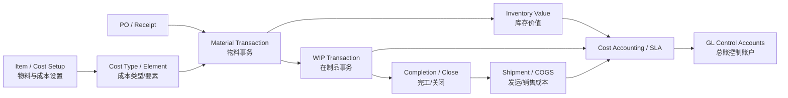
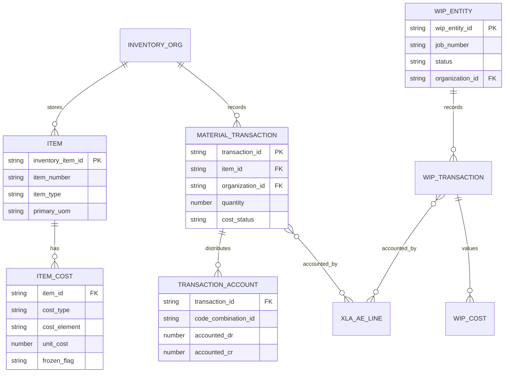
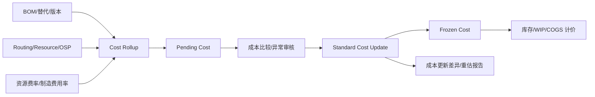
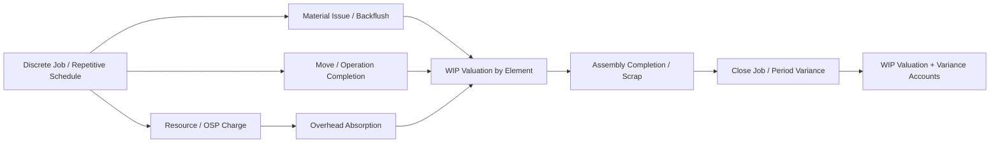
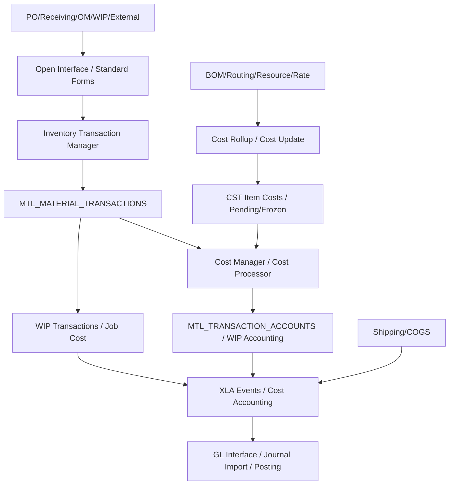
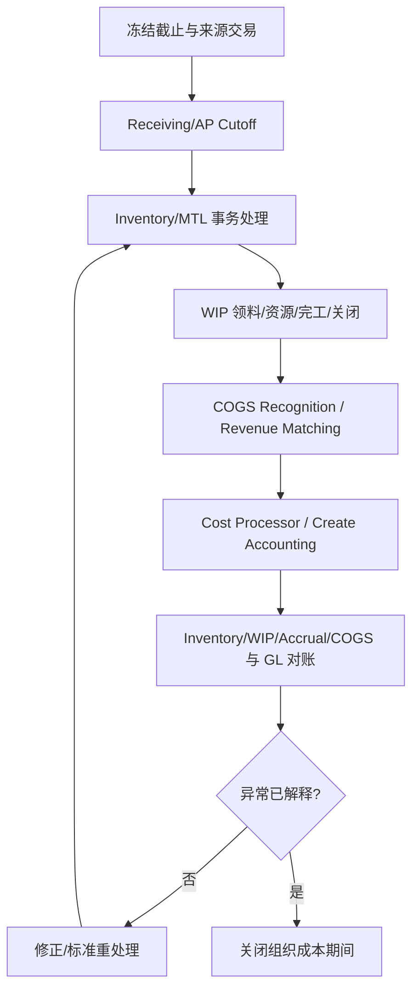
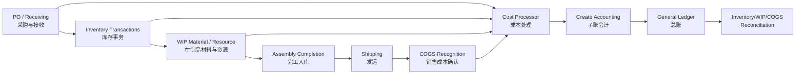
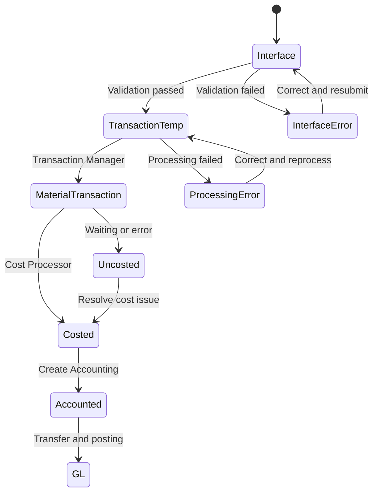

# 成本核算（Cost Accounting）

> 成本核算把采购、库存、在制品、制造、发货和收入事件转换为存货价值、制造差异、销售成本及 GL 分录。诊断必须同时看业务数量流与价值流。

## 阅读导航

- [范围](#1-学习目标与范围) · [实施配置](#implementation) · [数量与价值流](#2-数量流与价值流) · [成本方法](#3-成本方法与要素) · [业务会计](#4-关键业务会计) · [功能实施](#5-功能顾问实施重点) · [接口月结](#6-技术与接口视角) · [页面与关账实操](#9-资深顾问实操成本事务与关账) · [专题详解](#10-专题详解)

## 模块数据字典与名词解释

本模块速查见[统一数据字典](data-dictionary.md#dict-07)。

## 模块业务架构与核心 ER 图

### 成本业务架构图



### 成本核算核心 ER 图



成本方法、库存组织、成本类型和会计期间共同决定价值结果；图中名称为业务逻辑实体，实际 `MTL_*`、`WIP_*`、`CST_*` 和 XLA 关联需在目标实例确认。

## 1. 学习目标与范围

应能区分 Standard Costing（标准成本）、Average Costing（平均成本）等成本方法；理解成本要素、物料交易、接收、WIP（在制品）、销售成本/收入匹配、到岸成本及 SLA/GL；能完成库存价值和成本差异对账。

<a id="implementation"></a>

## 实施配置手册：库存、WIP 与成本

成本实施的先后关系不能倒置：先有 Ledger、库存组织、物料和事务控制，再建立成本类型/要素/账户，最后启用 WIP、LCM 或周期成本等扩展。成本方法切换、成本更新和期间重开均会影响存货估值，必须走独立变更控制。

| 顺序 | 配置项 | 预置职责 / 导航（功能名） | 配置重点 | 验收动作 |
| --- | --- | --- | --- | --- |
| 1 | 库存组织与组织参数 | `Inventory > Setup > Organizations > Organization Parameters` | 指定库存组织、Ledger、成本方法、成本组/会计选项、物料事务和负库存控制；确认组织与 OU/法人关系 | 以测试物料完成入库和子库存转移，确认组织、会计期间和事务来源 |
| 2 | 物料、类别、UOM 与事务类型 | `Inventory > Items > Master Items / Organization Items`；`Setup > Items` | 定义库存属性、成本属性、主单位、物料类别、可交易组织和事务控制；物料不能靠描述区分成本策略 | 对库存、可购、可制造物料各创建一笔事务，验证允许/禁止行为 |
| 3 | 成本类型、要素和子要素 | `Cost Management > Setup > Cost Types / Cost Elements / Sub-elements` | 定义 Frozen/Pending/模拟成本类型，材料/材料管理/资源/外协/间接费要素及子要素；明确每项所有者 | 查询成本类型和要素；为一个物料按要素维护成本并复核汇总 |
| 4 | 成本账户与组织间规则 | `Cost Management > Setup > Organization > Costing Information`；`Setup > Inter-Organization Options` | 定义库存、接收应计、在制品、差异、成本更新、组织间转移等账户及来源；配置组织间转移/内部利润规则 | 创建跨子库存/跨组织测试事务，核对数量、价值和借贷账户 |
| 5 | 标准成本卷积与更新（标准成本组织） | `Cost Management > Item Costs > Item Costs / Rollup Costs / Update Costs` | 维护 Pending 成本、资源/间接费、BOM/Routing；批准后执行 Update，指定调整账户和生效控制 | 用一个 BOM 样例进行 Rollup、Compare、Update；复核库存重估和差异分录 |
| 6 | WIP 与制造成本（如适用） | `WIP > Setup > WIP Parameters / Accounting Classes`；资源、部门、工艺路线功能 | 定义 WIP 参数、离散工单类型、Accounting Class、资源、费率、部门和间接费；与成本要素映射 | 建立工单、发料、资源计费、完工、关闭，比较预期与实际差异 |
| 7 | 接收应计、发票价差与 COGS | PO/Receiving 选项、Cost Management 处理器、OM/Shipping 的 COGS 设置 | 明确收货点/交付点应计、Accrual Reconciliation、AP 发票匹配及 COGS Recognition 的责任边界 | 完成 PO 收货—AP 发票—库存—发运—COGS 全链，核对期间和控制账户 |
| 8 | 成本期间与处理器 | `Cost Management > Accounting Close Cycle > Inventory Accounting Periods`；`View > Requests` | 定义/打开期间，监控 Transaction Processor、Cost Manager、成本分配和接口请求；建立未处理事务清单 | 故意制造一笔待处理事务，验证可定位、修正、重跑且不重复计价 |

### 验收与上线门禁

1. 对每种成本方法至少测试采购接收、库存移动、退货、盘点调整、WIP（如启用）、发运与成本会计。
2. 每次成本更新要保存旧/新成本、物料范围、影响库存数量、调整账户和批准人；不可直接改成本表绕过更新过程。
3. 关期间先解决 Pending Transactions、未成本化事务、收货应计和 WIP 未关闭差异，再做库存价值—成本分配—SLA/GL 的三层对账。

## 2. 数量流与价值流

```text
采购/接收 → 入库 → 转移/领料 → WIP 投料/资源/完工
→ 成品库存 → 发运 → COGS Recognition（销售成本确认）
                     ↘ 成本分录 → SLA/GL
```

数量正确不代表价值正确。每个断点需同时确认：交易数量、计量单位、组织/子库存、成本层或标准成本、会计事件、分配账户和期间。

## 3. 成本方法与要素

成本方法由 Inventory Organization/Cost Organization 层的配置决定；成本类型（Cost Type）是成本版本/模拟版本，不是成本方法。生产环境更换方法或组织成本组会影响历史估值、WIP、COGS 和报表，必须按期间、物料范围和会计影响单独立项。

### 3.1 成本方法比较

| 方法 | 存货计价逻辑 | 制造/WIP特点 | 适用与风险 |
| --- | --- | --- | --- |
| Standard Costing | 按冻结标准成本计价；实际与标准的差额记入价格、用量、费率或成本更新差异 | WIP 按标准/实际投入和完工规则计算，工单关闭时确认差异 | 适合成本控制和预算；标准更新会重估库存并产生调整 |
| Average Costing | 按数量加权的移动平均成本；接收和实际制造成本更新单位成本 | 采购成本和制造资源/材料逐步进入平均成本；WIP 不因平均成本更新而自动重估 | 适合成本波动频繁行业；需控制负库存、回溯交易和平均成本调整 |
| FIFO/LIFO Layer Costing | 按收发顺序维护成本层，出库消耗特定层 | 成本层和制造交易会影响出库成本及层结转 | 受法规、版本和组织选项限制；层维护和负库存风险较高 |
| Periodic Average Costing | 在期间内累计成本和数量，期末以期间平均成本计价 | 期间结束才计算成本和差异，不能作为普通 Perpetual Costing 替代 | 适合按期吸收实际采购/制造成本；需额外 Periodic Rates/Cost Type 设置 |
| Periodic Incremental LIFO | 以期间层和增量方式计算库存 | 期末计算层和增量差异 | 适用范围窄，必须由法规和实施文档确认 |

“平均成本”不是“实际成本完全正确”：平均成本仍受成本更新、发票价差、负库存、回溯日期和调整账户影响；“标准成本”也不是只维护一个单价，需按五类成本要素和层级维护。FIFO/LIFO、周期成本和重复制造场景要以目标版本的 Cost Management 文档、许可证和本地化功能为准。

平均成本组织的核心计算可用下式复核：`新平均成本 =（现有库存价值 + 本次事务价值）÷（现有数量 + 本次事务数量）`。采购接收进入 Receiving Inspection 通常不更新平均成本，交付到库存才进入加权计算；同一组织内各子库存通常共享同一物料平均单位成本。Average Cost Update 支持新单位成本、百分比变化或现有库存价值变化三种方式，必须指定 Adjustment Account；若错误来源于 WIP 发料，应先退回库存、修正平均成本后再发回 WIP。

### 3.2 成本类型、要素和子要素

| 成本层 | 示例 | 业务用途 |
| --- | --- | --- |
| Cost Type | Frozen、Pending、Average、Simulation、Periodic Rates | 冻结生产成本、待发布成本、模拟/对比和周期费率 |
| Cost Element | Material、Material Overhead、Resource、Outside Processing、Overhead | 分析库存/WIP 构成、定义账户和差异来源 |
| Cost Sub-element | Item、Activity、Resource、Overhead Rate | 细化材料项目、资源费率、作业和间接费 |
| Cost Level | This Level、Previous Level | 区分当前装配层成本与下层子装配成本 |

五类 Cost Element 的边界：

- **Material**：采购件、库存件或组件的材料成本；制造装配可能同时包含 Previous Level Material。
- **Material Overhead**：按材料基础或活动费率吸收的材料间接费用。
- **Resource**：人工、机器、外包资源等，按单位、批次、金额或实际费率计费。
- **Outside Processing（OSP）**：外协采购服务或外协资源，通常与采购订单/接收关联。
- **Overhead**：按资源、作业、完工或其他基础吸收的制造间接费用。

每个成本要素可以分配不同的 Valuation、Absorption、Variance 和 Adjustment 账户；相同账户可汇总多个要素，但会牺牲差异分析粒度。资源和制造费用要同时维护 Department、Resource、Rate、Basis、有效期和组织，不能只在物料成本表中查单价。

### 3.3 成本卷积、待定成本和冻结成本



标准成本卷积应先检查 BOM、Routing、资源、OSP、间接费用、替代件、组织共享成本和生效日期，再比较 Pending 与 Frozen 的要素/层级差异。发布前冻结采购、生产和发运窗口，保存更新前后成本、库存数量/价值、WIP 余额和差异账户控制总额。标准成本更新只适用于符合组织/主成本组织条件的配置，不能在任意组织随意执行。

平均成本更新则直接改变指定物料/成本要素的平均单位成本，并以 Adjustment Account 对冲库存价值变化；更新会重估组织拥有的现有库存和在途库存，但不按同样方式重估 WIP。更新失败行应通过标准 Material Transactions/Cost 窗口修正重提交。

标准成本更新从指定 Cost Type 复制成本到 Frozen，可按物料、类别、范围或零成本项选择更新范围；Oracle 会生成 Inventory、Intransit 和（启用 WIP 时）WIP Standard Cost Adjustment 报告及成本历史。标准成本更新只能从使用 Standard Costing 的主成本组织执行；成本更新期间可以继续业务事务，但相关会计处理会等待成本更新完成，期间关闭、工单关闭或 GL 传送运行时更新也可能排队。

### 3.4 差异分类与解释

| 差异 | 典型原因 | 责任和证据 |
| --- | --- | --- |
| Purchase Price Variance（PPV） | PO 价格/接收价格与标准成本不同 | 采购订单、供应商发票、接收日期和标准成本 |
| Invoice Price Variance（IPV） | 发票价格与采购接收/订单价格不同 | AP 发票验证、匹配、汇率和税 |
| Material Usage Variance | 实际领料数量与 BOM/标准用量不同 | 领料、退料、替代件、废品和 WIP 工单 |
| Resource Rate/Efficiency Variance | 资源实际费率或用量与标准不同 | Resource、Department、工时、效率和 Routing |
| Overhead Variance | 间接费用率、吸收基础或实际池不同 | Overhead、Activity、费率和制造费用池 |
| Standard Cost Adjustment | Frozen 标准成本更新导致库存/WIP 重估 | Cost Update、Pending/Frozen 比较和调整报表 |
| Job Close/Period Variance | 工单关闭或期间结算时投入与完工/报废不平 | WIP Value、完工数量、废品、状态和关闭日期 |

差异分析要同时说明“数量差、费率差、结构差、期间差和汇率差”，并关联事务号、工单号、采购单号或成本更新批次；只按 GL 差异账户汇总无法支持改善行动。

## 4. 关键业务会计

### 4.1 采购接收与应计

采购链要区分 Receive、Inspect、Deliver、Return、Correct 和 Invoice Match 的事实与会计时点。典型标准成本分录可能为：

| 业务事件 | 借方（示例） | 贷方（示例） | 对账依据 |
| --- | --- | --- | --- |
| Receive 到 Receiving | Receiving Inspection/库存接收 | PO Accrual | PO、接收数量、价格和接收事务 |
| Deliver 到库存 | Inventory Valuation | Receiving Inspection | 交付数量、子库存、物料成本 |
| AP 发票验证 | PO/应付分配、税 | AP Liability、Accrual/PPV/IPV | 发票、匹配、税和汇率 |
| Return to Supplier | Receiving/Accrual 冲回 | Inventory/Receiving | 退货原因、数量和原接收 |

实际账户由成本方法、Receiving Options、Accrual Method、组织参数和 SLA 决定。应计未清不等于库存差异：收货与发票截止、价格差和税要分别建立控制总额。

### 4.2 库存事务与成本层

库存事务包括杂项接收/发出、子库存转移、组织间转移、在途交接、周期盘点、调整、Lot/Serial 事务和账户别名。每笔事务至少核对 Item、Organization、Subinventory、Locator、Lot/Serial、Quantity、UOM、Transaction Date、Source 和成本状态。

| 事务类型 | 数量流 | 价值流/风险 |
| --- | --- | --- |
| 子库存转移 | 同组织位置变更 | 可能只变更费用/库存账户，需核对转出/转入账户 |
| 组织间转移 | 发出组织减少、接收组织增加或在途 | 发运与接收跨期间时出现 Intransit 余额 |
| 杂项接收/发出 | 直接增加/减少现有量 | Account Alias、原因和权限决定对冲账户 |
| 盘点调整 | 账面量调整为盘点量 | 差异账户和盘点审批必须可追溯 |
| Lot/Serial | 数量附加批次/序列属性 | 负库存、失效日期和追溯要求更高 |

成本层取决于 Standard、Average、FIFO/LIFO 等方法。跨组织共享成本时，确认是共享 Frozen Cost 还是各组织独立成本；在途交易要按发出/接收组织和会计期间分别核对。

### 4.3 WIP 工单、资源和制造费用



WIP Accounting Class 为每类工单定义 Valuation、Absorption 和 Variance 账户；可按成本要素分别显示，也可把多个要素汇总。工单状态控制可否领料、移动、资源、完工、废品、成本更新和关闭，常见状态包括 Unreleased、Released、Complete、Complete-No Charges、On Hold、Closed（具体值以 WIP Lookup 为准）。

- **材料**：手工发料、倒冲、退料、替代件和批次/序列发料；需要与 BOM/实际用量对比。
- **资源**：按资源费率、员工实际费率或标准费率计费；区分单位基础和批次固定费用。
- **OSP**：外协采购订单、接收和发票可能跨越 WIP 期间；需核对 OSP 资源和应计。
- **Overhead**：按资源值、资源事务或工序完工吸收；费率池、基础和有效期必须可解释。
- **完工/废品**：成品成本从 WIP 转入库存，废品和报废根据设置进入差异/废品账户。

工单关闭时计算最终成本和差异；若未完成必需领料、资源或完工事务，差异可能被低估。关闭前应先确认 Pending Move、Pending Material、Pending Resource、未计成本和跨期间事务。

### 4.4 发运、COGS 与收入匹配

销售出库包含 Pick Release、Ship Confirm、Inventory Issue、COGS Recognition 和 AR/收入事件。发运后库存数量减少不等于 COGS 已确认；COGS Recognition 会按收入确认比例把 Deferred COGS 转入 COGS，具体时点取决于 OM/AR、成本方法和配置。

```text
订单/发运
→ Inventory Issue（库存减少/Deferred COGS）
→ AR 发票/收入确认
→ COGS Recognition（按收入比例）
→ COGS / Inventory SLA
→ GL 与收入匹配对账
```

发运截止要按 Ship Date、Invoice Date、Revenue Date 和 GL Date 分别检查；退货、贷项、部分发运、跨组织发运和收入延迟需验证 COGS/Revenue Matching 不重复或遗漏。

### 4.4.1 默认标准会计分录速查

下表按标准库存/离散 WIP 的常见经济方向编排。具体账户由组织参数、物料/类别、成本组、WIP Accounting Class、成本方法和 SLA 决定；同一事务在不同成本方法或组织间选项下可有不同的中间账户。纯查询、BOM/Routing 维护、Pick Release、Move 但尚未产生成本事务等动作不一定即时产生会计。

| 业务事实 | 标准经济分录（借 / 贷） | 产生时点与边界 |
| --- | --- | --- |
| 杂项接收 | 借：Inventory Valuation<br>贷：Miscellaneous Receipt/Offset Account | 对冲账户由 Account Alias 或事务来源控制；不是采购收货应计 |
| 杂项发出 | 借：Miscellaneous Issue/Offset Account<br>贷：Inventory Valuation | 需审批原因和账户；不得用杂项发出代替销售发运或报废流程 |
| 同组织子库存转移 | 通常无净额会计；若转出/转入子库存设置不同账户，则借：目标库存账户，贷：来源库存账户 | 数量一定变化，是否会计取决于子库存/事务设置 |
| 组织间在途转移 | 发运：借：Intransit Inventory，贷：来源 Inventory<br>接收：借：目标 Inventory，贷：Intransit Inventory | 内部利润、运费、跨账簿/跨法人会计和 Transfer Price 需按组织间规则另测 |
| WIP 发料/倒冲 | 借：WIP Valuation（按成本要素）<br>贷：Inventory Valuation | 退料时反向；倒冲的会计时点取决于完工/移动设置 |
| WIP 资源、外协、制造费用吸收 | 借：WIP Valuation<br>贷：Resource/OSP/Overhead Absorption | 账户按 WIP Accounting Class 与成本要素派生；外协的采购应计/发票链还需与 PO/AP 对账 |
| 工单完工入库 | 借：Finished Goods Inventory<br>贷：WIP Valuation | 完工成本由标准/实际/期间成本及工单已吸收成本决定 |
| 工单关闭/期间差异 | 差异不利：借：WIP Variance，贷：WIP Valuation；有利差异方向相反 | 差异类别与金额随标准/平均/周期成本、关闭规则和剩余 WIP 而变 |
| 销售发运且启用 COGS Matching | 发运：借：Deferred COGS，贷：Inventory<br>收入确认：借：COGS，贷：Deferred COGS | 如未启用延迟 COGS，系统可直接借 COGS、贷 Inventory；AR 收入分录属于 C2C 模块，需和本表匹配但不重复记账 |
| 盘点差异/报废 | 数量增加：借：Inventory，贷：Physical Inventory/Adjustment Offset；数量减少反向 | 差异账户、原因码和审批由库存控制定义；需防止与实际报废/质量流程重复 |

### 4.5 Landed Cost Management（LCM）

LCM 可在收货前估计、收货后服务或针对任意单据/事务计算预计和实际到岸成本。常见成本因素包括运费、保险、处理费、仓储费、集装箱费、关税和进出口费用。

| 阶段 | 业务动作 | 成本控制 |
| --- | --- | --- |
| 估计 | 按 PO/装运/数量预测费用 | 估计因子、分摊基础、供应商和币种 |
| 收货 | 将估计成本随收货记录 | 库存价值、接收应计和在途 |
| 实际 | AP 发票/费用单匹配并更新 | 估计-实际差异、税和汇率 |
| 结算 | 将成本分摊到库存、在途或费用 | 项目、组织、成本要素和 GL 账户 |

LCM 分摊可按数量、金额、重量、体积、装运或自定义因子；估计与实际必须可并列查询，不应直接用手工库存调整替代 LCM 事务。

具体分录取决于组织参数、成本方法和 SLA，示例不可替代实例验证。

## 5. 功能顾问实施重点

### 5.1 基础组织和成本架构

1. **企业与组织**：确认 Legal Entity、Ledger、Operating Unit、Inventory Organization、成本组织和组织 Cost Group 的关系；共享成本时明确主成本组织和复制范围。
2. **成本方法**：为每个库存组织选择 Standard、Average、FIFO/LIFO 或 Periodic 选项；记录成本方法、成本期间、库存会计期间和 GL 期间的边界。
3. **成本类型**：定义 Frozen、Pending、Simulation、Average 或 Periodic Rates 等 Cost Type；限制谁可以创建、更新和发布生产成本。
4. **成本要素**：定义 Material、Material Overhead、Resource、OSP、Overhead 及子要素；为每个要素配置库存、WIP、吸收、差异、调整和清算账户。
5. **制造基础**：维护 BOM、Routing、Department、Resource、Resource Rate、OSP Item/供应商和 Overhead Rate，并校验生效日期及版本。

### 5.2 采购、库存和 WIP 配置

| 领域 | 关键设置 | 验收问题 |
| --- | --- | --- |
| Receiving | Receipt Routing、Accrual、Inspection、Invoice Match | 接收/交付/退货是否在正确期间和账户 |
| Inventory | Subinventory、Locator、Lot/Serial、Negative Balance、Account Alias | 数量、安全库存、批次和账户是否受控 |
| WIP | Accounting Class、Job Type、Job Status、BOM/Routing、Move/Resource | 哪些状态允许领料、移动、完工和关闭 |
| Shipping/COGS | Pick/Ship、COGS Recognition、Revenue Matching | 发运和收入不同步时 COGS 如何确认 |
| LCM | Cost Factor、分摊基础、估计/实际、AP 匹配 | 到岸成本是否进入正确库存/在途/费用 |
| SLA/GL | Event Class、Accounting Class、账户规则、传送粒度 | 成本事务能否下钻到 GL，是否保留明细 |

### 5.3 成本发布与变更控制

标准成本发布前执行 Cost Rollup、Cost Type Comparison、Pending Cost Review、Inventory/WIP Standard Cost Adjustment 报告；冻结生产、采购和发运窗口，取得财务批准后再运行 Standard Cost Update。平均成本更新要指定 Adjustment Account，说明是单位成本、百分比还是库存价值调整，并评估现有库存和在途重估。

成本方法、成本组织、COA、WIP Accounting Class 和 COGS 账户属于高风险变更。每次变更建立旧值/新值、有效日期、影响物料和组织、预期分录、回退方案和测试证据，禁止在生产直接修改成本表。

### 5.4 关账与报表设计

成本期间通常按库存组织独立开关，并与 GL 使用同一财务日历。建议至少提供：

- Inventory Valuation（按物料、组织、子库存、成本要素和期间）；
- Intransit/Receiving Accrual 与 AP 截止；
- WIP Value、Job Value、Period/Job Close Variance；
- Standard Cost Update/Adjustment、PPV/IPV、资源/制造费用差异；
- COGS 与收入匹配、退货和未确认 COGS；
- Cost Manager/Transaction Manager 异常、未计成本和未会计事务。

测试需覆盖负库存、退货、跨组织转移、外币采购、成本更新、工单取消/关闭、追溯交易、跨期发运、Lot/Serial、OSP 跨期和估计/实际到岸成本。

## 6. 技术与接口视角

### 6.1 技术架构与处理器



接口表有记录不代表物料事务、成本处理或会计已完成。排错要按 `interface_id → transaction_id → cost status → accounting event → GL journal` 追踪，并同时确认 Inventory Organization、Cost Organization、Period 和请求 ID。

### 6.2 接口矩阵

| 来源 → 目标 | 推荐边界 | 关键输入/幂等键 | 成功证据 |
| --- | --- | --- | --- |
| PO/Receiving → Inventory | 标准接收/交付/退货流程 | PO/Receipt/Shipment/Line、Item、Org、Qty、UOM、Lot/Serial | `RCV_TRANSACTIONS`、`MTL_MATERIAL_TRANSACTIONS` |
| 外部库存 → Inventory | `MTL_TRANSACTIONS_INTERFACE` + Transaction Manager | Source System/Document/Line、Item/Org/Subinventory/Locator、Qty/UOM、Date | 接口状态成功、MMT 事务号和错误为空 |
| BOM/Routing/费率 → Cost | Cost Rollup/Cost Type/Standard Cost Update | Cost Type、Item/Org、BOM/Routing 版本、生效日 | Pending/Frozen 成本、比较和调整报告 |
| WIP → Cost/GL | WIP Material/Move/Resource/Completion/Close | Job、Operation、Resource、Qty、事务日期和会计分类 | WIP Value、Variance、XLA/GL |
| OM/Shipping → COGS | Inventory Issue + COGS Recognition | Order/Delivery/Line、Item、Qty、收入事件 | COGS/Inventory 分录、收入匹配状态 |
| LCM/AP → Inventory | Landed Cost 因子/实际费用匹配 | Shipment/Receipt、Cost Factor、分摊基础、币种 | 估计/实际 LCM 成本和库存价值 |

自定义暂存表至少保存来源唯一键、批次控制总额、物料、组织、子库存/货位、Lot/Serial、数量/UOM、事务日期、成本类型、账户、状态、错误码、请求 ID、EBS 主键和原始报文哈希。重跑前先查询是否已生成 MMT、WIP 事务或 XLA 事件，处理“事务已成功但回写失败”的情况。

### 6.3 关键对象与追溯路径

| 业务对象 | 常见对象 | 追溯关系 |
| --- | --- | --- |
| 物料主数据 | `MTL_SYSTEM_ITEMS_B`、`MTL_PARAMETERS` | Item + Inventory Organization + Cost Group |
| 物料事务 | `MTL_MATERIAL_TRANSACTIONS`、`MTL_TRANSACTION_ACCOUNTS` | `TRANSACTION_ID → 成本账户/批次/来源` |
| 接收事务 | `RCV_TRANSACTIONS`、`RCV_SHIPMENT_HEADERS/LINES` | Receipt → PO → MMT/应计 |
| 物料成本 | `CST_ITEM_COSTS`、成本类型/成本要素视图 | Item + Org + Cost Type + Element/Level |
| WIP | `WIP_ENTITIES`、`WIP_OPERATIONS`、`WIP_TRANSACTIONS`、WIP 成本/值视图 | Job → Material/Move/Resource/Completion/Close |
| COGS | COGS/收入匹配事务和 XLA | Delivery/Order Line → Inventory Issue → COGS Recognition |
| LCM | LCM 成本因子、分摊和实际费用对象 | Receipt/Shipment → Estimated/Actual Landed Cost |
| 会计 | `XLA_EVENTS`、`XLA_AE_HEADERS/LINES`、`GL_IMPORT_REFERENCES` | 事务 → Event → SLA → GL Journal |

表名、状态值和成本列会随 R12.2 补丁、制造模块和本地化变化；生产 SQL 先用 eTRM、`ALL_TAB_COLUMNS`、Integration Repository 和请求日志核对。查询必须按组织、期间、物料或事务范围过滤，并遵守职责和数据访问权限。

### 6.4 异步处理、性能和安全

- Cost Manager、Transaction Manager、WIP 处理、COGS Recognition 和 Create Accounting 分阶段运行；同一组织/物料/期间避免并发重算或重放。
- 大批量事务按组织、日期、Item 或来源批次分片；接口表建外部键、状态、错误和批次索引，成功数据按策略归档。
- Lot/Serial、UOM、子库存/货位和负库存校验必须在进入标准接口前完成；错误行隔离，不能因一行错误整批无限重试。
- 成本更新和期间关闭期间控制后台重试；配置、费率、BOM/Routing 和成本发布均需版本化。
- 生产环境禁止直接更新 `MTL_*`、`CST_*`、`WIP_*`、`XLA_*`、`GL_*` 业务表；使用标准表单、Open Interface、公开 API 或支持的并发程序。

## 7. 月结与排错

### 7.1 月结顺序与关期门禁



建议顺序：

1. 冻结截止时间，完成 PO/Receiving、AP 发票、库存、WIP、发运和外部接口导入。
2. 清理 Material/Receiving/WIP Interface、Transaction Manager、Cost Manager 和未计成本事务。
3. 完成接收与应计截止，核对 Receipt Accrual、AP Liability、PPV/IPV 和在途。
4. 处理 WIP 未计费/未关闭工单、资源/OSP、完工、废品和 Job Close Variance。
5. 完成发运、COGS Recognition 和收入匹配，处理退货、贷项和跨期发运。
6. 运行成本处理与 Create Accounting，确认 XLA Final、Transfer、Journal Import 和 Posting。
7. 对账库存/WIP/接收/COGS 与 GL，保存控制总额、异常清单和签核。
8. 只在无未解释门禁项后关闭 Inventory/Costing 期间；成本期间和 GL 期间分别确认状态。

| 现象 | 优先检查 |
| --- | --- |
| 交易卡在接口 | 必填字段、组织/UOM、期间、事务管理器和错误说明 |
| 库存数量对但价值错 | 成本方法、成本层/标准、追溯交易和账户分配 |
| WIP 差异异常 | BOM/工艺路线、领料、资源费率、完工和关闭时点 |
| COGS 未确认 | 发运、AR 收入、匹配程序和事件状态 |
| 库存与 GL 不符 | 未会计交易、截止期间、账户、手工 GL 和报表口径 |

### 7.2 排错路径

| 层级 | 诊断问题 | 处理方式 |
| --- | --- | --- |
| 接口 | 是否缺 Item/Org/UOM/Subinventory/Lot/Serial/Date/Source | 通过接口错误报告修正后只重送失败行 |
| 事务管理器 | 是否停留在 Pending/Processing/Error | 查 Manager 日志、锁、期间和并发请求 |
| 成本 | 是否 Uncosted、成本为零或成本层不符 | 查 Cost Method、Cost Type、Item Cost、负库存和回溯 |
| WIP | 工单是否允许事务、完工/废品/资源是否完整 | 查 Job Status、BOM/Routing、Accounting Class 和 WIP Value |
| COGS | Inventory Issue 是否完成、收入是否确认 | 查 Delivery/AR/COGS Recognition 和跨期规则 |
| 会计 | Event 是否生成、SLA 是否 Final、GL 是否过账 | 查 XLA、Transfer、Journal Import、CCID 和期间 |

每个错误记录 `request_id`、组织、物料/工单、事务号、处理状态、错误码、修复人、修复时间和重跑范围。修复后用同一业务键验证“原错误关闭 + 新结果唯一”，不要通过手工 GL 或杂项库存事务掩盖根因。

## 8. 建议练习

### 8.1 高频问题定位矩阵

| 现象 | 先确认的事实 | 可能根因 | 标准修复与验证 |
| --- | --- | --- | --- |
| 接口行一直 Pending/Error | 接口批次、来源唯一键、处理状态、错误码和请求 ID | Item/Org/UOM/Locator 无效、期间关闭、事务类型或 Lot/Serial 校验失败 | 修正来源或接口字段后只重送失败行；确认接口成功且生成唯一 MMT/WIP 事务 |
| 数量正确但库存价值为零 | 事务是否已 costed、物料 Cost Type、成本要素和生效日期 | 成本未发布、成本处理器失败、成本层缺失或负库存 | 通过标准成本/平均成本窗口和 Cost Manager 重处理；以库存价值、事务账户和 XLA 复核 |
| 采购接收与 AP 应计不符 | Receive/Deliver、发票匹配、币种/汇率和截止日期 | 接收路由、Accrual Method、价格/汇率、跨期间接收或退货 | 按 PO-Receipt-Invoice 逐行核对，使用采购/AP 标准更正；不得用杂项库存调整掩盖应计差异 |
| WIP 工单差异异常大 | BOM 用量、替代件、资源工时/费率、OSP、Overhead、完工和废品 | Routing/费率版本错误、倒冲重复、漏报工、工单状态或跨期事务 | 先修正业务事务和费率，再重跑成本处理；按 Usage、Rate、Efficiency、Scrap 和 Job Close Variance 解释 |
| COGS 未确认或重复确认 | Ship Confirm、Inventory Issue、AR/收入事件、COGS Recognition 状态 | 发运和开票跨期、收入未确认、接口重放或退货未匹配 | 依订单行和交货行重跑匹配程序；核对 Deferred COGS、COGS、收入和退货方向 |
| 标准成本更新后 GL 波动 | 更新批次、Pending/Frozen 要素、库存数量、WIP 和调整账户 | BOM/Routing/费率变化、成本层级错误、更新窗口未冻结交易 | 审批成本比较和调整报告，确认库存重估控制总额及 XLA/GL 传送；失败行用标准程序重处理 |
| 平均成本突然异常 | 更新前后数量、平均单位成本、调整账户、负库存和回溯日期 | 大批量接收/退货、负库存、错误成本更新或外币换算 | 按 Item/Org/Date 重建移动平均；确认库存和在途重估，WIP 不应被错误重估 |
| 库存期间无法关闭 | Pending Material/WIP、Uncosted、Receiving Interface、GL 传送状态 | 旧日期事务、锁、并发请求失败或跨组织未完成 | 使用 Close Diagnostics 和管理器日志定位，完成标准重处理并保留请求证据后再关期 |
| 到岸成本估计与实际差异无法解释 | Cost Factor、分摊基础、装运/收货关联、发票和汇率 | 估计因子过期、分摊舍入、服务发票未匹配或重复计费 | 按装运/收货及费用行比较 Estimated/Actual，调整 LCM 因子或 AP 匹配后重算 |

### 8.2 最小端到端验收矩阵

| 编号 | 场景 | 必测变体 | 主要断言与证据 |
| --- | --- | --- | --- |
| COST-01 | PO → Receive → Deliver → AP Invoice | 标准成本、平均成本；含退货和价格差 | 数量、接收应计、库存价值、PPV/IPV、AP 负债和 SLA/GL 可追溯 |
| COST-02 | 库存事务 | 子库存转移、组织间转移、杂项、盘点、Lot/Serial | 转出/转入数量与价值平衡，在途余额和账户别名正确 |
| COST-03 | WIP 离散工单 | 手工发料/退料、倒冲、替代件、资源、OSP、Overhead | WIP 各成本要素、完工/废品、Job Close Variance 与会计分录一致 |
| COST-04 | 成本卷积与发布 | 多层 BOM、替代件、无效费率、循环 BOM、版本生效日 | Pending/Frozen 成本、异常清单、更新前后库存重估和批准链完整 |
| COST-05 | 平均成本更新 | 接收、退货、负库存、在途、追溯日期 | 移动平均计算、库存/在途重估和 Adjustment Account 正确，WIP 不被误重估 |
| COST-06 | 发运到 COGS | 部分发运、部分开票、延迟收入、退货/贷项 | Inventory Issue、Deferred COGS、COGS Recognition、收入和 AR 行级匹配 |
| COST-07 | LCM | 收货前估计、收货后估计、实际费用、数量/金额/重量分摊 | 估计/实际到岸成本、库存/在途/费用去向、税和汇率可解释 |
| COST-08 | 月结 | 跨期事务、未计成本、接口失败、WIP 未关闭、GL 未过账 | 关期门禁项全部清零或有批准例外；库存/WIP/应计/COGS 与 GL 控制总额一致 |
| COST-09 | 接口幂等 | 超时重试、重复报文、部分成功、回写失败 | 同一来源唯一键只生成一笔业务事务；重试不会重复数量、成本或 XLA 事件 |
| COST-10 | 权限与审计 | 成本维护、关期、接口重处理、生产只读查询 | 职责只能执行授权动作，审批、请求 ID、旧值/新值和日志可审计 |

每个用例至少保留：测试数据、组织/期间、来源唯一键、请求 ID、页面或报表输出、事务号、会计事件、GL 凭证号、预期/实际控制总额和缺陷结论。涉及成本发布、平均成本更新或关期的用例必须在非生产环境先验证，并在生产执行前重新确认物料范围与期间。

### 8.3 练习题

1. **成本方法对比**：用同一物料建立两笔不同采购价格和一笔退货，分别在标准成本与平均成本下计算库存价值、PPV/IPV 和调整账户，说明负库存或回溯日期会怎样改变结果。
2. **全链追溯**：完成采购接收、WIP 生产、完工、发运、开票和 COGS 确认，从业务单据追到 MMT/WIP 事务、成本账户、XLA 和 GL，并标注每个期间截止点。
3. **工单差异**：故意制造 BOM 用量、资源费率和废品数量差异，使用 WIP Value、Job Value 和 Variance 报表将差异拆成 Usage、Rate、Efficiency、Scrap 和 Close 五类。
4. **月结演练**：制造一笔未计成本事务、一笔跨期间接收和一笔收入延迟发运，按本章 7.1 顺序清理，提交关期前后数量、价值、会计三层对账表。
5. **LCM 分摊**：同一装运同时发生运费、保险和关税，分别按数量、金额和重量分摊，比较舍入、币种和估计-实际差异对库存价值的影响。

## 9. 资深顾问实操：成本事务与关账

### 9.1 库存与制造成本流程图



### 9.2 页面剧本：查询物料事务与会计

**常见职责与导航**：`Inventory（库存） → Transactions（事务处理） → Material Transactions（物料事务）`；账户分配可从 Tools/View Accounting 或 Cost Management 的 Material Account Distribution 查询。

1. 按 Organization、Item、Transaction Date/Type、Source 或 Transaction ID 限定查询。
2. 核对数量、UOM、Subinventory/Locator、Transfer Organization 和 Transaction Action。
3. 查看 Costed Flag/成本状态、Actual Cost、Variance 和 Accounting Line。
4. 记录 `transaction_id`，追踪到成本分配、SLA Event 和 GL Journal。
5. 若数量已更新但成本未完成，检查 Cost Manager、事务处理器、期间和错误表；不要补录杂项事务抵消未知错误。

### 9.3 页面剧本：查看和更新标准成本

**常见导航**：`Cost Management → Item Costs → Item Costs` 查询；标准成本更新通常从 `Item Costs → Standard Cost Update` 相关菜单执行。

1. 选择 Inventory Organization、Cost Type 和 Item，查看 Material/Overhead/Resource/OSP 等成本要素。
2. 区分 Frozen（冻结）成本与 Pending/Simulation 成本；记录成本来源、BOM/Routing 和费率版本。
3. 运行 Cost Rollup（成本卷积）并审阅异常、零成本和大幅波动。
4. 在非生产环境执行 Standard Cost Update，验证库存重估和差异账户。
5. 生产更新前冻结业务窗口、保存更新前后成本、库存数量/价值和控制总额；更新后立即对账。

标准成本更新会影响现有库存价值和差异，必须有财务批准与回退/补偿方案，不能只由成本维护人员独立执行。

### 9.4 页面剧本：库存期间关闭

**常见职责与导航**：`Inventory → Accounting Close Cycle（会计关账周期） → Inventory Accounting Periods（库存会计期间）`。

1. 选择目标 Organization 和 Open Period，点击 Pending 查看待处理活动。
2. 清理必须解决项：未处理物料事务、未计成本事务、待处理 WIP 成本事务。
3. 评估建议解决项：Receiving Interface、Material Interface、Shop Floor Move 等；关闭后这些旧日期事务可能无法处理。
4. 运行 Period Close Diagnostics、Material Account Distribution、WIP Account Distribution 和库存价值报表。
5. 完成 AP/Purchasing 截止及接收应计；对账库存/WIP/接收/在途与 GL。
6. 提交 Create Accounting - Cost Management，并确认无错误且已传 GL。
7. 选择 Change Status → Closed；关闭不可逆，必须在执行前取得签核。
8. 运行 Period Close Reconciliation，保存期间、组织、请求 ID、差异和批准。

### 9.5 待处理事务状态图



不同层的失败必须使用对应的标准管理器或接口恢复。直接修改状态标志会破坏数量、成本和会计的一致性。

### 9.6 WIP 差异分析

关闭工单前核对标准/实际材料、资源、外协、制造费用、完工和废品。差异按 Usage（用量）、Rate（费率）、Efficiency（效率）、Method/Configuration 等业务原因解释，并映射到责任部门；不能只按 GL 差异科目汇总。

### 9.7 资深顾问的三层对账

| 层 | 对账对象 | 关键问题 |
| --- | --- | --- |
| 数量 | On-hand、在途、WIP 数量、发运数量 | 是否存在未处理/追溯/负库存交易 |
| 价值 | 库存价值、WIP 价值、接收应计、COGS | 成本方法、成本层和截止是否一致 |
| 会计 | 事务分配、XLA、GL 控制账户 | 是否未会计、未传输、手工 GL 或账户错误 |

### 9.8 页面剧本：采购接收、应计与库存入账

1. 在 Purchasing/Receiving 查询 PO、发运计划、接收路由、接收数量和交付目的地；确认 Item、Organization、UOM、Subinventory/Locator 和项目/费用分配。
2. 完成 Receive → Inspect（如启用）→ Deliver，记录 Receipt Number、Transaction ID、交易日期和会计日期。
3. 在 Inventory Material Transactions 查询 Delivery 事务，核对数量、成本方法、成本状态、Receiving Inspection、库存和应计账户。
4. AP 发票完成匹配和验证后，比较发票价格、接收价格、标准/平均成本、PPV/IPV、税和汇率；异常通过采购/AP 更正，不用库存杂项调整冲销。
5. 月末运行 Receiving Accrual、Inventory Valuation 和 AP 截止报表，按 PO/Receipt/Invoice 三条链核对数量和金额。

### 9.9 页面剧本：WIP 工单成本与关闭

1. 查询 Job Number、Assembly、Organization、Accounting Class、BOM/Routing 版本和 Job Status；确认工单处于允许领料、移动、资源或完工的状态。
2. 录入或导入材料发料/退料、替代件、批次/序列、Move、Resource、OSP、Overhead、Completion 和 Scrap。
3. 运行成本处理，查看 WIP Value、Material/Resource/OSP/Overhead 各要素以及 This/Previous Level。
4. 对比计划 BOM/Routing 与实际事务，按 Usage、Rate、Efficiency、Scrap、配置或期间原因解释差异。
5. 完工后执行 Close Job，确认最终成本和 Job Close Variance 已生成；不关闭仍有未处理事务、跨期 OSP 或不完整完工数量的工单。
6. 月结时运行 WIP Value/Discrete Job Value/Expense Job Value/Variance 报告，与 WIP 控制账户和 GL 对账。

### 9.10 页面剧本：标准成本卷积与更新

1. 锁定目标 Cost Organization、Inventory Organization、Cost Type、Item 范围和生效日期，备份 Frozen 成本、数量和库存价值。
2. 检查 BOM、替代件、Routing、资源、OSP、Material Overhead、Overhead Rate、Department 和 Cost Element 是否齐全且有效。
3. 运行 Cost Rollup，将结果写入 Pending Cost；查看 Cost Type Comparison、零成本、循环 BOM、无费率和大幅波动。
4. 由财务/成本负责人审批 Pending → Frozen 的差异，确认成本更新窗口、并发冲突和交易冻结策略。
5. 执行 Standard Cost Update，保存 Inventory/WIP Standard Cost Adjustment 报告、成本历史和请求日志。
6. 更新后按物料/组织核对库存重估、WIP、差异账户和 GL；对失败项使用标准成本窗口/事务报告重处理，不直接修改成本表。

### 9.11 页面剧本：到岸成本估计与实际结算

1. 定义 Cost Factors（运费、保险、处理、仓储、关税等）、供应商/服务商、币种、有效期和分摊基础。
2. 对 PO/装运/收货生成 Estimated Landed Cost，明确收货前、收货后或任意单据/事务模式。
3. 选择按数量、金额、重量、体积、装运或自定义因子分摊，检查各行分摊比例和舍入。
4. 收到 AP 实际费用后匹配原收货/装运，更新 Actual Landed Cost，比较估计-实际差异。
5. 核对 LCM 成本进入库存、在途、费用或项目的账户，避免重复通过 Miscellaneous Receipt/Cost Adjustment 计入。

### 9.12 页面剧本：发运到 COGS 确认

1. 查询订单、交货、发运确认和 Inventory Issue，确认数量、物料、组织、发运日期、会计日期和库存成本。
2. 检查销售收入/AR 事件是否已生成，按配置运行 COGS Recognition/Revenue Matching。
3. 对比 Deferred COGS、COGS、Inventory Relief、收入确认比例和 AR 发票；部分发运和部分开票要按行核对。
4. 处理退货、贷项、取消发运和跨期收入；确认 COGS 不重复确认、未确认余额有明确原因。
5. 将 COGS/Inventory SLA 与 GL 控制账户、销售收入和库存价值报表对账。

### 9.13 官方操作依据

- [Oracle Cost Management User's Guide](https://docs.oracle.com/cd/E26401_01/doc.122/e48829/toc.htm)：成本方法、成本要素、成本更新、事务处理和期间结算总目录。
- [Oracle Cost Management — Average Costing](https://docs.oracle.com/cd/E26401_01/doc.122/e48829/T372621T374058.htm)：移动加权平均成本、接收/制造成本更新及库存重估边界。
- [Oracle Cost Management — Standard Cost Update](https://docs.oracle.com/cd/E26401_01/doc.122/e48829/T372621T373688.htm)：Pending/Frozen 标准成本更新、库存调整和报告要求。
- [Oracle Cost Management User's Guide — Period Close](https://docs.oracle.com/cd/E26401_01/doc.122/e48829/T372621T378953.htm)：按库存组织关闭成本期间、未处理事务检查和与 GL 对账。
- [Oracle Inventory User's Guide](https://docs.oracle.com/cd/E26401_01/doc.122/e48820/toc.htm)：库存组织、物料事务、接收、账户分配和会计期间总目录。
- [Oracle Inventory User's Guide — Accounting Periods](https://docs.oracle.com/cd/E26401_01/doc.122/e48820/T291651T292307.htm)：库存会计期间开关和关期前待处理活动。
- [Oracle Work in Process User's Guide — WIP Costing](https://docs.oracle.com/cd/E26401_01/doc.122/e48905/T228107T228120.htm)：WIP 会计分类、成本要素、资源、外协、间接费用和差异。
- [Oracle Work in Process User's Guide — WIP Status](https://docs.oracle.com/cd/E26401_01/doc.122/e48905/T228107T228119.htm)：工单状态与可执行事务的控制关系。
- [Oracle Landed Cost Management User's Guide](https://docs.oracle.com/cd/E26401_01/doc.122/e48799/toc.htm)：到岸成本因子、估计/实际成本和分摊流程总目录。
- [Oracle Landed Cost Management — Cost Processing](https://docs.oracle.com/cd/E26401_01/doc.122/e48799/T528387T528392.htm)：收货前、收货后及任意单据/事务的预计和实际到岸成本处理。

## 10. 专题详解


<!-- source: docs/06-cost/README.md -->
<a id="src-docs-06-cost-readme"></a>
### 库存、WIP 与成本（INV / WIP / CST）


本目录覆盖收货、库存事务、WIP、成本计算和销售成本向 SLA/GL 的会计链。库存组织与成本方法属于高风险基础配置，任何成本重算、期间关闭或接口重传均应先界定组织、期间、物料和事务范围。

<a id="src-docs-06-cost-readme--专题导航"></a>
#### 专题导航

- [收货、库存、WIP 与销售成本会计流](#src-docs-06-cost-accounting-flow)
- [成本组织、成本类型与成本组设置](#src-docs-06-cost-setup)
- [标准、平均与周期成本](#src-docs-06-cost-costing-methods)
- [物料、资源与间接费](#src-docs-06-cost-cost-elements)
- [成本结转、关期与报表](#src-docs-06-cost-period-close-reports)
- [高级成本控制与差异](#src-docs-06-cost-advanced-costing-controls)
- [表结构](#src-docs-06-cost-tables)
- [Transaction Open Interface 实现](#src-docs-06-cost-interfaces)
- [处理器和接口排错](#src-docs-06-cost-interfaces-troubleshooting)

<a id="src-docs-06-cost-readme--必须控制的业务事件"></a>
#### 必须控制的业务事件

- 收货应计、发票价格/汇率差异、库存接收与 AP 负债须按采购、收货和发票三条链对账。
- 每笔物料事务必须可追溯到事务类型、来源类型、成本组织、成本期间和会计事件；库存余额不能仅用应用页面的当前数量替代会计分析。
- 标准成本更新、平均成本调整、WIP 完工/关闭和 COGS Recognition 需要在关期清单中设定顺序、冻结窗口和异常报告。
- 接口使用 `MTL_TRANSACTIONS_INTERFACE` 等标准入口，须设业务唯一键、批次控制、Lot/Serial 校验和失败行隔离。

<a id="src-docs-06-cost-readme--官方依据"></a>
#### 官方依据

- [Oracle Supply Chain Management Documentation](https://docs.oracle.com/cd/E26401_01/nav/scm.htm)


<!-- source: docs/06-cost/accounting-flow.md -->
<a id="src-docs-06-cost-accounting-flow"></a>
### 收货、库存、WIP 与销售成本会计流


<a id="src-docs-06-cost-accounting-flow--事件链"></a>
#### 事件链

```text
PO Receipt/Delivery/Return → Receiving/Inventory Accounting
Inventory Issue/Receipt/Transfer → Material Accounting
WIP Issue/Resource/Completion/Close → WIP Accounting/Variances
OM Ship Confirm → Inventory Issue → COGS Recognition
→ SLA → GL
```

典型标准成本分录（实际以 SLA/设置为准）：收货借 Receiving Inspection/贷 Accrual；Delivery 借 Inventory/贷 Receiving Inspection；领料借 WIP Valuation/贷 Inventory；完工借 Inventory/贷 WIP；销售出库借 Deferred COGS/贷 Inventory，按收入确认比例转至 COGS。

<a id="src-docs-06-cost-accounting-flow--sql"></a>
#### SQL

```sql
SELECT mmt.transaction_id, mmt.organization_id,
       mmt.inventory_item_id, mmt.transaction_date,
       mmt.transaction_type_id, mmt.transaction_action_id,
       mmt.transaction_source_type_id, mmt.transaction_source_id,
       mmt.transaction_quantity, mmt.primary_quantity,
       mmt.actual_cost, mmt.costed_flag
  FROM mtl_material_transactions mmt
 WHERE mmt.transaction_id = :p_transaction_id;

SELECT mta.transaction_id, mta.accounting_line_type,
       mta.reference_account, mta.base_transaction_value,
       mta.primary_quantity, mta.rate_or_amount,
       mta.gl_batch_id
  FROM mtl_transaction_accounts mta
 WHERE mta.transaction_id = :p_transaction_id
 ORDER BY mta.inv_sub_ledger_id;

SELECT wt.transaction_id, wt.wip_entity_id, wt.organization_id,
       wt.transaction_type, wt.transaction_date,
       wt.primary_quantity, wt.actual_resource_rate
  FROM wip_transactions wt
 WHERE wt.wip_entity_id = :p_wip_entity_id
 ORDER BY wt.transaction_date, wt.transaction_id;
```

<a id="src-docs-06-cost-accounting-flow--排查"></a>
#### 排查

- Material Transaction 未 Cost：查 `COSTED_FLAG`、Error Code/Explanation、Item Cost、Period、账户、前置交易和 Cost Manager。
- Receipt/AP Accrual 不平：按 PO Distribution/Receipt Transaction/Invoice Distribution 对比数量、价格、汇率、退货/更正和截止日。
- WIP Variance 异常：检查发料/退料、Resource Usage/Rate、Completion/Scrap、Standard Update 时间和 Job Close。
- COGS 未确认：跟踪 OM Line/Delivery/Material Transaction、AR Invoice/Revenue、COGS Recognition 请求和会计期间。

<a id="src-docs-06-cost-accounting-flow--关联"></a>
#### 关联

- [Inventory/WIP/Cost/GL E2E](09-end-to-end.md#src-docs-08-e2e-inventory-wip-cost-gl)
- [P2P](09-end-to-end.md#src-docs-08-e2e-procure-to-pay)


<!-- source: docs/06-cost/advanced-costing-controls.md -->
<a id="src-docs-06-cost-advanced-costing-controls"></a>
### 高级成本控制：差异、COGS、OPM/LCM 与关账风险


<a id="src-docs-06-cost-advanced-costing-controls--适用边界"></a>
#### 适用边界

本专题补充离散制造/库存成本中的差异和销售成本控制，并标识 OPM、Landed Cost Management（LCM）、项目制造等可选能力。是否安装产品、组织成本方法、估价账与会计规则均须以目标实例为准。

<a id="src-docs-06-cost-advanced-costing-controls--管理口径"></a>
#### 管理口径

| 主题 | 管理问题 | 关键数据链 |
| --- | --- | --- |
| 采购应计/价格差异 | 收货、发票与采购价格差异为何未清 | PO/RCV → AP → SLA/GL |
| WIP 差异 | 物料、资源、间接费、外协和产出差异是否合理 | WIP Job → 事务/成本 → 关闭/差异 → GL |
| COGS | 收入与销售成本是否在正确期间配比 | OM/Shipping → INV/COGS → SLA/GL |
| LCM/OPM | 附加成本或过程制造成本是否重复/遗漏分摊 | 业务交易 → 成本层/要素 → 会计事件 |

<a id="src-docs-06-cost-advanced-costing-controls--期间控制"></a>
#### 期间控制

1. 关闭前确认库存事务、接收、WIP 完工/关闭和成本处理器均已完成，先解决异常事务再关闭成本期间。
2. 分别审阅库存估值、在制品、收货应计、成本差异和 COGS；金额相等不代表事务数量、期间和科目均正确。
3. 标准成本更新、成本调整和追溯交易须有冻结期、批准、影响模拟和 GL 对账；避免在已签字期间直接重算。

<a id="src-docs-06-cost-advanced-costing-controls--sql成本事务定位"></a>
#### SQL：成本事务定位

```sql
-- 从物料事务开始定位；以组织、物料、日期/事务号缩小范围。
select mmt.transaction_id,
       mmt.organization_id,
       mmt.inventory_item_id,
       mmt.transaction_date,
       mmt.transaction_quantity,
       mmt.transaction_type_id,
       mmt.transaction_source_type_id,
       mmt.costed_flag
  from mtl_material_transactions mmt
 where mmt.organization_id = :p_organization_id
   and mmt.inventory_item_id = :p_inventory_item_id
   and mmt.transaction_date >= :p_from_date
   and mmt.transaction_date < :p_to_date + 1
 order by mmt.transaction_date, mmt.transaction_id;
```

<a id="src-docs-06-cost-advanced-costing-controls--排查原则"></a>
#### 排查原则

- `COSTED_FLAG` 或处理状态只能表明某一处理阶段，不能单独证明 SLA、GL 过账或报表已正确。
- 先按事务链检查来源与数量，再检查成本要素和会计，最后核对报表；不要通过直接更新成本/库存业务表处理异常。
- 对 OPM、LCM、项目制造等产品使用其官方指南、许可证与补丁级别验证对象和并发程序，避免将离散制造对象套用到不同成本模型。

<a id="src-docs-06-cost-advanced-costing-controls--官方参考"></a>
#### 官方参考

本专题复用成本模块总览中的 [Oracle Supply Chain Management Documentation](https://docs.oracle.com/cd/E26401_01/nav/scm.htm)，不再重复维护同一入口。


<!-- source: docs/06-cost/cost-elements.md -->
<a id="src-docs-06-cost-cost-elements"></a>
### 物料、资源、间接费与成本更新


<a id="src-docs-06-cost-cost-elements--成本构成"></a>
#### 成本构成

```text
Assembly Item Cost
= Material（Components）
+ Material Overhead（采购/收货/物料附加）
+ Resource（Routing Resource Usage × Rate）
+ Outside Processing（外协工序）
+ Overhead（Resource/Unit/Activity Basis）
```

Cost Rollup 从 BOM/Routing 底层向上计算，受 Alternate BOM/Routing、Yield/Scrap、Basis Type、Lot Size、Resource Units/Rate、Overhead Association 影响。成本更新前应冻结 BOM/Routing 版本截止点并保留 Rollup 输出。

<a id="src-docs-06-cost-cost-elements--sql"></a>
#### SQL

```sql
SELECT cicd.inventory_item_id, cicd.organization_id,
       cicd.cost_type_id, cicd.cost_element_id,
       cicd.level_type, cicd.resource_id,
       cicd.item_cost, cicd.basis_type,
       cicd.basis_factor, cicd.net_yield_or_shrinkage_factor
  FROM cst_item_cost_details cicd
 WHERE cicd.organization_id = :p_organization_id
   AND cicd.inventory_item_id = :p_inventory_item_id
   AND cicd.cost_type_id = :p_cost_type_id
 ORDER BY cicd.cost_element_id, cicd.level_type, cicd.resource_id;

SELECT resource_id, resource_code, description,
       cost_element_id, disable_date
  FROM bom_resources
 WHERE organization_id = :p_organization_id
 ORDER BY resource_code;
```

<a id="src-docs-06-cost-cost-elements--排查"></a>
#### 排查

- Rollup 漏组件：查 BOM Effectivity、Alternate、Include in Cost Rollup、Phantom、Supply Type、Yield 和组件成本。
- Resource Cost 为零：查 Routing Operation/Resource Usage、Costed Flag、Resource Rate/Cost Type、UOM 和基准。
- Overhead 未吸收：查 Department/Resource Association、Basis Type/Rate、Activity、交易是否触发。
- Update 产生过大差异：对比 Pending/Frozen 的 Element/Level Detail，分离 BOM、Rate、Yield、Lot Size 和手工成本变更。

<a id="src-docs-06-cost-cost-elements--关联"></a>
#### 关联

- [Costing Methods](#src-docs-06-cost-costing-methods)
- [Cost Accounting Flow](#src-docs-06-cost-accounting-flow)


<!-- source: docs/06-cost/costing-methods.md -->
<a id="src-docs-06-cost-costing-methods"></a>
### 标准成本、平均成本与周期成本


<a id="src-docs-06-cost-costing-methods--方法对比"></a>
#### 方法对比

| 方法 | 价值基础 | 主要差异 |
| --- | --- | --- |
| Standard | Frozen Standard Cost | Purchase Price、Invoice Price、Resource/Usage/Efficiency、Overhead 等差异 |
| Average | 交易后加权平均单价 | 接收/生产/调整改变平均成本，销售/发料通常按当前成本出库 |
| FIFO/LIFO | 成本层 | 按层消耗并保留层次 |
| Periodic | 期间货值/交易后计算 | 期末运行周期成本处理并生成差异/调整 |

<a id="src-docs-06-cost-costing-methods--关键原理"></a>
#### 关键原理

Standard Cost Update 将 Pending 成本更新到 Frozen，对现有库存/WIP 产生重估会计。Average Cost 受负库存、交易顺序和补录日期影响；回溯交易会在处理队列中按日期先于尚未处理交易计算，但不会回滚或重处理已经完成的交易。周期成本是独立的期末计算链，不等于简单查当前 Item Cost。

<a id="src-docs-06-cost-costing-methods--sql"></a>
#### SQL

```sql
SELECT cct.cost_type_id, cct.cost_type, cct.description,
       cct.default_cost_type_id, cct.allow_updates_flag,
       cct.multi_org_flag, cct.disable_date
  FROM cst_cost_types cct
 ORDER BY cct.cost_type;

SELECT inventory_item_id, organization_id, cost_type_id,
       item_cost, unburdened_cost, burden_cost,
       material_cost, material_overhead_cost,
       resource_cost, outside_processing_cost, overhead_cost
  FROM cst_item_costs
 WHERE organization_id = :p_organization_id
   AND inventory_item_id = :p_inventory_item_id;

SELECT inventory_item_id, organization_id, transaction_id,
       layer_id, layer_quantity, item_cost
  FROM cst_quantity_layers
 WHERE organization_id = :p_organization_id
   AND inventory_item_id = :p_inventory_item_id
 ORDER BY layer_id;
```

<a id="src-docs-06-cost-costing-methods--排查"></a>
#### 排查

- Standard Update 异常：先运行不更新的模拟/报表，审核成本差异、库存/WIP 重估和账户后再执行。
- Average Cost 跳变：按 Transaction ID/Date 跟踪 Receipt、Cost Update、Negative Balance 恢复和补录交易。
- 负库存差异：查允许负库存设置、交易时间顺序、成本层和恢复入库价格。
- 期间成本不完整：查所有交易已 Cost、期间范围、未处理接口、资源/间接费和处理日志。

<a id="src-docs-06-cost-costing-methods--关联"></a>
#### 关联

- [Cost Setup](#src-docs-06-cost-setup)
- [Period Close](#src-docs-06-cost-period-close-reports)


<!-- source: docs/06-cost/interfaces-troubleshooting.md -->
<a id="src-docs-06-cost-interfaces-troubleshooting"></a>
### 成本接口、Transaction Processor 与排错


> `MTL_TRANSACTIONS_INTERFACE`、Lot Interface、幂等和 Transaction Manager 处理代码见 [库存/WIP/成本接口实现案例](#src-docs-06-cost-interfaces)。

<a id="src-docs-06-cost-interfaces-troubleshooting--处理器链路"></a>
#### 处理器链路

```text
MTL_TRANSACTIONS_INTERFACE
 → Transaction Manager/Worker
 → MTL_MATERIAL_TRANSACTIONS_TEMP
 → Material Transaction
 → Cost Manager/Cost Worker
 → MTL_TRANSACTION_ACCOUNTS / SLA / GL
```

WIP Move/Cost、Receiving 和 Resource 还有各自接口/待处理表。排错应先确定卡在“导入、业务处理、成本计算、SLA、GL”哪一层。

<a id="src-docs-06-cost-interfaces-troubleshooting--sql"></a>
#### SQL

```sql
SELECT transaction_interface_id, source_code, source_header_id,
       source_line_id, process_flag, transaction_mode,
       lock_flag, error_code, error_explanation,
       organization_id, inventory_item_id,
       transaction_quantity, transaction_uom,
       transaction_date, transaction_type_id
  FROM mtl_transactions_interface
 WHERE organization_id = :p_organization_id
 ORDER BY transaction_interface_id;

SELECT transaction_temp_id, transaction_header_id,
       process_flag, lock_flag, organization_id,
       inventory_item_id, transaction_quantity,
       transaction_date, transaction_type_id
  FROM mtl_material_transactions_temp
 WHERE organization_id = :p_organization_id
 ORDER BY transaction_temp_id;

SELECT transaction_id, costed_flag, error_code, error_explanation
  FROM mtl_material_transactions
 WHERE organization_id = :p_organization_id
   AND NVL(costed_flag, 'N') <> 'Y'
 ORDER BY transaction_date, transaction_id;
```

<a id="src-docs-06-cost-interfaces-troubleshooting--排错"></a>
#### 排错

- `PROCESS_FLAG=3`/错误：根据 Error Code/Explanation 检查 Item/Org、UOM、Subinventory/Locator、Lot/Serial、Account、Date/Period。
- 长期 `PROCESS_FLAG=1/LOCK_FLAG=2`：检查 Transaction Manager/Worker 是否运行、并发冲突、失效 Worker 和数据库锁，不直接改 Flag。
- 交易已入 MMT 但未 Cost：检查 Cost Manager、Item Cost、前置 Transaction、期间、负库存和 Cost Worker 日志。
- 重复交易：使用 Source Code/Header/Line 幂等键，导入前同时查 Interface/Temp/Base 三层。
- Lot/Serial 错：接口头与 Lot/Serial Interface 子表的 Transaction Interface ID、数量和控制级别必须一致。

<a id="src-docs-06-cost-interfaces-troubleshooting--关联"></a>
#### 关联

- [Inventory Transactions](#src-docs-06-cost-accounting-flow)
- [Concurrent Programs](10-technical.md#src-docs-09-technical-concurrent-programs)

<a id="src-docs-06-cost-interfaces-troubleshooting--官方参考"></a>
#### 官方参考

- [Oracle Inventory User's Guide R12.2](https://docs.oracle.com/cd/E26401_01/doc.122/e48820/)


<!-- source: docs/06-cost/interfaces.md -->
<a id="src-docs-06-cost-interfaces"></a>
### Oracle Inventory、WIP 与成本接口实现案例


<a id="src-docs-06-cost-interfaces--1-业界常用场景"></a>
#### 1. 业界常用场景

| 场景 | 推荐接口 | 说明 |
| --- | --- | --- |
| WMS/3PL 入库、出库、调拨 | Inventory Transaction Open Interface | 写 `MTL_TRANSACTIONS_INTERFACE`，由 Transaction Manager 处理 |
| 批次/序列控制物料交易 | MTI + Lot/Serial Interface | 子表数量必须与主交易数量及物料控制属性一致 |
| MES 发料、退料、完工、报废 | WIP/Inventory 标准接口或公开 API | 按工单、工序、资源、组织分别验证 |
| 外部采购收货 | Receiving Open Interface | 使用 `RCV_HEADERS_INTERFACE`/`RCV_TRANSACTIONS_INTERFACE`，不要模拟库存 Misc Receipt |
| 盘点系统上传差异 | Physical/Cycle Count 标准接口 | 保留 Count Batch、Tag/Sequence、复点和审批状态 |
| 标准成本批量维护 | Item Cost Import/标准 Cost Update 流程 | 必须区分 Pending Cost、Cost Type 和组织成本法 |

<a id="src-docs-06-cost-interfaces--2-transaction-open-interface-状态模型"></a>
#### 2. Transaction Open Interface 状态模型

```text
WMS/MES
→ 自定义暂存（幂等、主数据校验）
→ MTL_TRANSACTIONS_INTERFACE
→ Transaction Manager/Worker
→ MTL_MATERIAL_TRANSACTIONS_TEMP
→ MTL_MATERIAL_TRANSACTIONS
→ Cost Manager
→ SLA/GL
```

常见接口初始值为 `PROCESS_FLAG=1`、`LOCK_FLAG=2`、`TRANSACTION_MODE=3`。这些值应按目标实例 eTRM 和标准样本核对；错误后优先通过 Transaction Open Interface 界面修正/重提，不直接批量改 Flag。

<a id="src-docs-06-cost-interfaces--3-导入前业务校验"></a>
#### 3. 导入前业务校验

```sql
SELECT msi.inventory_item_id,
       msi.segment1 item_number,
       msi.primary_uom_code,
       msi.inventory_item_status_code,
       msi.lot_control_code,
       msi.serial_number_control_code,
       msi.restrict_subinventories_code,
       msi.restrict_locators_code
  FROM mtl_system_items_b msi
 WHERE msi.organization_id = :p_organization_id
   AND msi.inventory_item_id = :p_inventory_item_id;

SELECT msi.secondary_inventory_name,
       msi.disable_date,
       msi.asset_inventory,
       msi.quantity_tracked
  FROM mtl_secondary_inventories msi
 WHERE msi.organization_id = :p_organization_id
   AND msi.secondary_inventory_name = :p_subinventory_code;

SELECT oap.organization_id,
       oap.open_flag,
       oap.period_name,
       oap.period_start_date,
       oap.schedule_close_date
  FROM org_acct_periods oap
 WHERE oap.organization_id = :p_organization_id
   AND :p_transaction_date BETWEEN oap.period_start_date
                               AND oap.schedule_close_date;
```

还应校验 UOM 转换、Locator、Lot/Serial、负库存策略、Transaction Type/Source、账户和项目制造属性。

<a id="src-docs-06-cost-interfaces--4-非批次物料的-miscellaneous-receipt"></a>
#### 4. 非批次物料的 Miscellaneous Receipt

```sql
DECLARE
  l_interface_id NUMBER := mtl_material_transactions_s.NEXTVAL;
  l_header_id    NUMBER := mtl_material_transactions_s.NEXTVAL;
  l_trx_type_id  NUMBER;
BEGIN
  SELECT transaction_type_id
    INTO l_trx_type_id
    FROM mtl_transaction_types
   WHERE transaction_type_name = 'Miscellaneous receipt';

  INSERT INTO mtl_transactions_interface (
    transaction_interface_id,
    transaction_header_id,
    source_code,
    source_header_id,
    source_line_id,
    process_flag,
    transaction_mode,
    lock_flag,
    organization_id,
    inventory_item_id,
    subinventory_code,
    locator_id,
    transaction_type_id,
    transaction_quantity,
    primary_quantity,
    transaction_uom,
    transaction_date,
    distribution_account_id,
    transaction_reference,
    last_update_date,
    last_updated_by,
    creation_date,
    created_by,
    last_update_login
  ) VALUES (
    l_interface_id,
    l_header_id,
    'XX_WMS',
    :p_external_header_id,
    :p_external_line_id,
    1,
    3,
    2,
    :p_organization_id,
    :p_inventory_item_id,
    :p_subinventory_code,
    :p_locator_id,
    l_trx_type_id,
    :p_transaction_quantity,
    :p_primary_quantity,
    :p_transaction_uom,
    :p_transaction_date,
    :p_distribution_ccid,
    :p_external_document_number,
    SYSDATE,
    fnd_global.user_id,
    SYSDATE,
    fnd_global.user_id,
    fnd_global.login_id
  );

  COMMIT;
  dbms_output.put_line('TRANSACTION_INTERFACE_ID=' || l_interface_id);
  dbms_output.put_line('TRANSACTION_HEADER_ID=' || l_header_id);
END;
/
```

正负号由 Transaction Type/Action 与业务方向共同决定。上线前必须用目标组织手工交易生成样本，确认数量方向、账户来源和 Cost Group；不要用负数量“猜测”所有出库场景。

<a id="src-docs-06-cost-interfaces--5-批次物料交易"></a>
#### 5. 批次物料交易

在写入主接口后，使用相同 `TRANSACTION_INTERFACE_ID` 写 Lot Interface：

```sql
INSERT INTO mtl_transaction_lots_interface (
  transaction_interface_id,
  lot_number,
  transaction_quantity,
  primary_quantity,
  last_update_date,
  last_updated_by,
  creation_date,
  created_by
) VALUES (
  :p_transaction_interface_id,
  :p_lot_number,
  :p_transaction_quantity,
  :p_primary_quantity,
  SYSDATE,
  fnd_global.user_id,
  SYSDATE,
  fnd_global.user_id
);
```

序列控制物料还需 `MTL_SERIAL_NUMBERS_INTERFACE`。一批多 Lot 或连续 Serial 时，所有子行数量汇总必须与主接口一致；组织间调拨还要同时校验 From/To Organization、Intransit 和接收路线。

<a id="src-docs-06-cost-interfaces--6-处理错误与重试"></a>
#### 6. 处理、错误与重试

Transaction Manager 可按后台周期处理，也可从标准 Transaction Open Interface 页面启动 Process Transactions Interface。不要在未核对并发程序参数的情况下硬编码内部程序签名。

```sql
-- 接口层错误
SELECT transaction_interface_id,
       transaction_header_id,
       source_code,
       source_header_id,
       source_line_id,
       process_flag,
       lock_flag,
       error_code,
       error_explanation
  FROM mtl_transactions_interface
 WHERE source_code = 'XX_WMS'
   AND source_header_id = :p_external_header_id
 ORDER BY source_line_id;

-- Temp 层等待/错误
SELECT transaction_temp_id,
       transaction_header_id,
       process_flag,
       lock_flag,
       error_code,
       error_explanation
  FROM mtl_material_transactions_temp
 WHERE transaction_header_id = :p_transaction_header_id;

-- 成功业务交易
SELECT transaction_id,
       organization_id,
       inventory_item_id,
       transaction_quantity,
       primary_quantity,
       transaction_date,
       transaction_type_id,
       costed_flag,
       transaction_reference
  FROM mtl_material_transactions
 WHERE transaction_source_name = :p_external_document_number
    OR transaction_reference = :p_external_document_number
 ORDER BY transaction_id;
```

成功后的稳定追溯应将 `TRANSACTION_INTERFACE_ID → TRANSACTION_ID` 写入自定义映射表；字段回写行为随交易类型而异，不能只依赖 `TRANSACTION_REFERENCE`。

<a id="src-docs-06-cost-interfaces--7-幂等与并发实现"></a>
#### 7. 幂等与并发实现

建议暂存表唯一键：

```sql
ALTER TABLE xxinv_txn_stg ADD CONSTRAINT xxinv_txn_stg_u1
  UNIQUE (source_system, external_header_id, external_line_id, action_code);
```

工作进程以 `FOR UPDATE SKIP LOCKED` 领取待处理行：

```sql
SELECT message_id
  FROM xxinv_txn_stg
 WHERE status = 'VALIDATED'
 ORDER BY message_id
 FOR UPDATE SKIP LOCKED;
```

每个源业务行只生成一个稳定幂等键。HTTP 超时、并发请求仍 Running 或 Transaction Manager 结果未知时，先查 Interface/Temp/Base 三层，不直接复制重放。

<a id="src-docs-06-cost-interfaces--8-wipmes-实施边界"></a>
#### 8. WIP/MES 实施边界

- 组件发料/退料可经标准 WIP/Inventory 交易处理，必须传工单、Operation Sequence 和 Supply Type 所需信息。
- 完工/退回要验证 Routing、Completion Subinventory/Locator、Lot/Serial 和 Backflush。
- 资源计费要验证 Department、Resource、UOM、实际/标准计费和时间。
- 工单状态、成本更新、关闭和差异计算使用标准流程；不直接写 `WIP_ENTITIES`、`WIP_DISCRETE_JOBS`、`WIP_TRANSACTIONS`。
- 如果 Integration Repository 提供匹配的公开 WIP API，以当前实例方法签名、消息栈和提交语义为准。

<a id="src-docs-06-cost-interfaces--9-常见问题"></a>
#### 9. 常见问题

| 症状 | 常见原因 | 处理 |
| --- | --- | --- |
| `PROCESS_FLAG=3` | Item/Org/UOM/Subinventory/Locator/Lot/Serial/Account 无效 | 查 `ERROR_CODE/ERROR_EXPLANATION` 并用标准页面修正 |
| 长时间 Locked | Worker 失效、数据库锁、并发管理器异常 | 查请求、Session 和 Worker 日志，不直接改 Lock Flag |
| 已交易但未成本化 | Cost Manager、Item Cost、前置交易、期间或负库存问题 | 查 `MMT.COSTED_FLAG` 和 Cost Worker 日志 |
| Lot 数量错误 | Lot 子行合计与主行不一致 | 重建整笔消息，不只修改一张子表 |
| 重复出入库 | 超时后无查询即重放 | 暂存唯一约束 + 三层查询 + 成功 ID 映射 |

<a id="src-docs-06-cost-interfaces--10-关联文档"></a>
#### 10. 关联文档

- [成本接口与排错](#src-docs-06-cost-interfaces-troubleshooting)
- [库存/WIP/成本会计流](#src-docs-06-cost-accounting-flow)
- [成本常用表](#src-docs-06-cost-tables)
- [库存、WIP、成本到 GL](09-end-to-end.md#src-docs-08-e2e-inventory-wip-cost-gl)

<a id="src-docs-06-cost-interfaces--11-官方参考"></a>
#### 11. 官方参考

- [Oracle Inventory User Guide: Transaction Open Interface](https://docs.oracle.com/cd/E26401_01/doc.122/e48820/T291651T292013.htm)
- [Oracle Inventory User Guide R12.2](https://docs.oracle.com/cd/E26401_01/doc.122/e48820/)
- [Oracle E-Business Suite eTRM User's Guide](https://docs.oracle.com/cd/E26401_01/doc.122/f53031/)


<!-- source: docs/06-cost/period-close-reports.md -->
<a id="src-docs-06-cost-period-close-reports"></a>
### 成本分配、差异、结转、期间关闭与报表


<a id="src-docs-06-cost-period-close-reports--关期顺序"></a>
#### 关期顺序

1. 停止当期补录，处理 Inventory/Receiving/WIP/Cost Interface 待处理和错误交易。
2. 确保 Material/Resource/Overhead/Receiving 交易已 Cost 并创建会计。
3. 处理 WIP Jobs：发料、完工、差异、Close；处理 COGS Recognition。
4. 对账 Inventory Valuation、Receiving Accrual、WIP Valuation、COGS、差异和 GL。
5. 运行 Period Close Reconciliation/估值/交易分布报表，再关闭 Inventory Period。

<a id="src-docs-06-cost-period-close-reports--sql"></a>
#### SQL

```sql
SELECT oap.organization_id, oap.acct_period_id,
       oap.period_name, oap.period_start_date,
       oap.schedule_close_date, oap.period_close_date,
       oap.open_flag, oap.summarized_flag
  FROM org_acct_periods oap
 WHERE oap.organization_id = :p_organization_id
 ORDER BY oap.period_start_date DESC;

SELECT costed_flag, transaction_source_type_id,
       transaction_action_id, COUNT(*) cnt
  FROM mtl_material_transactions
 WHERE organization_id = :p_organization_id
   AND transaction_date BETWEEN :p_start_date AND :p_end_date
 GROUP BY costed_flag, transaction_source_type_id,
          transaction_action_id;

SELECT accounting_line_type, reference_account,
       SUM(base_transaction_value) amount
  FROM mtl_transaction_accounts
 WHERE organization_id = :p_organization_id
   AND transaction_date BETWEEN :p_start_date AND :p_end_date
 GROUP BY accounting_line_type, reference_account;
```

<a id="src-docs-06-cost-period-close-reports--排查"></a>
#### 排查

- Period Close 不允许：运行 Pending Transactions 检查，分别处理 MTL Transactions Interface、Pending Material、WIP Move/Cost、Receiving 和未会计交易。
- Inventory/GL 不平：统一组织、截止时间、Cost Group/Subinventory、Currency，分析未转 GL、手工 GL、补录和负库存。
- 估值报表负数：按 Item/Subinventory/Locator/Cost Group 查 On-hand、Pending Transaction 和负库存原因。
- 关期后发现遗漏：Inventory 期间一旦正式关闭不能重开；不要直接更新期间表，按批准的更正/调整流程在当前开放期间处理，并保留审计链。

<a id="src-docs-06-cost-period-close-reports--关联"></a>
#### 关联

- [Cost Accounting Flow](#src-docs-06-cost-accounting-flow)
- [GL Close](02-record-to-report.md#src-docs-04-gl-close-reports)


<!-- source: docs/06-cost/setup.md -->
<a id="src-docs-06-cost-setup"></a>
### 成本组织、成本类型、成本要素与成本组


<a id="src-docs-06-cost-setup--核心模型"></a>
#### 核心模型

- Inventory Organization 是库存/制造交易边界，其 Costing Organization/Method 在库存组织参数中确定。
- Cost Type 是一套物料/资源/间接费成本表述；Frozen 常用于标准成本，Pending 或自定义类型用于模拟/更新。
- Cost Element 包括 Material、Material Overhead、Resource、Outside Processing、Overhead。
- Cost Group 在项目制造/WMS 等场景将同一组织库存按成本分区，不等于 Cost Type。
- Valuation Account 通常由 Organization/Subinventory/Cost Group/Item 和 SLA 共同决定。

<a id="src-docs-06-cost-setup--设置顺序"></a>
#### 设置顺序

1. 建立 Ledger/OU/Inventory Organization、物料主组织和会计信息。
2. 设置 Costing Method、Cost Organization、Transfer Detail、Negative Quantity 和账户。
3. 定义 Cost Types、Activities、Resources、Overheads、Departments/Resources 和 Absorption Rules。
4. 定义 Item Cost、Resource Rate、Overhead Rate，执行 Cost Rollup/Update 测试。
5. 测试 PO Receipt/Delivery、Misc/Transfer、WIP Issue/Completion、Sales Issue、Return 和月结。

<a id="src-docs-06-cost-setup--sql"></a>
#### SQL

```sql
SELECT organization_id, organization_code, organization_name,
       operating_unit, set_of_books_id, master_organization_id,
       legal_entity, disable_date
  FROM org_organization_definitions
 WHERE organization_id = :p_organization_id;

SELECT cic.inventory_item_id, cic.organization_id,
       cic.cost_type_id, cct.cost_type,
       cic.material_cost, cic.material_overhead_cost,
       cic.resource_cost, cic.outside_processing_cost,
       cic.overhead_cost, cic.item_cost, cic.based_on_rollup_flag
  FROM cst_item_costs cic
  JOIN cst_cost_types cct ON cct.cost_type_id = cic.cost_type_id
 WHERE cic.organization_id = :p_organization_id
   AND cic.inventory_item_id = :p_inventory_item_id;
```

<a id="src-docs-06-cost-setup--排查"></a>
#### 排查

- Item Cost 为零：检查 Cost Type、Buy/Make、BOM/Routing、Component Yield、Resource/Overhead Rate 和 Rollup 日志。
- 账户错：查 Organization/Subinventory/Item/Cost Group 默认及 SLA Account Derivation。
- 组织不能运行成本程序：查 Costing Method、Cost Organization Relationship、Period 和职责 Organization Access。
- 修改 Cost Method 需求：有交易后通常不能直接切换，应设计新组织/迁移方案并与 Oracle Support 确认。

<a id="src-docs-06-cost-setup--关联"></a>
#### 关联

- [INV/CST/WIP 常用表结构与字段含义](#src-docs-06-cost-tables)
- [Costing Methods](#src-docs-06-cost-costing-methods)
- [Inventory/WIP/Cost/GL](09-end-to-end.md#src-docs-08-e2e-inventory-wip-cost-gl)


<!-- source: docs/06-cost/tables.md -->
<a id="src-docs-06-cost-tables"></a>
### Inventory / Cost / WIP 常用表结构


<a id="src-docs-06-cost-tables--业务说明"></a>
#### 业务说明

库存数量、成本价值和会计分录是三个不同层次：On-hand 回答“现在有多少”，Material Transaction 回答“数量如何变化”，Item Cost/Cost Layer 回答“单价如何得出”，Transaction Accounts/SLA 回答“如何入账”。WIP 还需将工单、发退料、资源、移动/完工和差异结合。

<a id="src-docs-06-cost-tables--表级速查"></a>
#### 表级速查

| 表 | 中文名 | 粒度/用途 | 关键字段 |
| --- | --- | --- | --- |
| `MTL_SYSTEM_ITEMS_B` | 物料组织属性 | Item+Inventory Organization | `INVENTORY_ITEM_ID`, `ORGANIZATION_ID` |
| `MTL_PARAMETERS` | 库存组织参数 | 每个 IO | `ORGANIZATION_ID`, `MASTER_ORGANIZATION_ID`, Costing options |
| `MTL_ONHAND_QUANTITIES_DETAIL` | 现有量明细 | Item+Org+Subinventory+Locator+Lot+Receipt Layer | `ONHAND_QUANTITIES_ID`, `PRIMARY_TRANSACTION_QUANTITY` |
| `MTL_MATERIAL_TRANSACTIONS` | 库存物料交易 | 每笔已处理物料交易 | `TRANSACTION_ID`, `ORGANIZATION_ID`, `INVENTORY_ITEM_ID` |
| `MTL_TRANSACTION_ACCOUNTS` | 库存交易会计分布 | Transaction+会计行 | `INV_SUB_LEDGER_ID`, `TRANSACTION_ID`, `REFERENCE_ACCOUNT` |
| `MTL_TRANSACTIONS_INTERFACE` | 库存交易接口 | 待 Transaction Manager 处理 | `TRANSACTION_INTERFACE_ID`, `PROCESS_FLAG`, `ERROR_CODE` |
| `MTL_MATERIAL_TRANSACTIONS_TEMP` | 库存待处理交易 | Transaction Worker 工作层 | `TRANSACTION_TEMP_ID`, `TRANSACTION_HEADER_ID` |
| `CST_COST_TYPES` | 成本类型 | 每个 Cost Type | `COST_TYPE_ID`, `COST_TYPE`, `ALLOW_UPDATES_FLAG` |
| `CST_ITEM_COSTS` | 物料成本汇总 | Item+Org+Cost Type | `INVENTORY_ITEM_ID`, `ORGANIZATION_ID`, `COST_TYPE_ID` |
| `CST_ITEM_COST_DETAILS` | 物料成本明细 | Item+Cost Type+Element/Resource/Level | `COST_ELEMENT_ID`, `LEVEL_TYPE`, `ITEM_COST` |
| `CST_QUANTITY_LAYERS` | 数量/成本层 | Item+Org+Cost Group/Layer | `LAYER_ID`, `LAYER_QUANTITY`, `ITEM_COST` |
| `WIP_ENTITIES` | WIP 工单实体 | 每个 Job/Schedule Entity | `WIP_ENTITY_ID`, `WIP_ENTITY_NAME`, `ORGANIZATION_ID` |
| `WIP_DISCRETE_JOBS` | 离散工单 | 每个 Discrete Job | `WIP_ENTITY_ID`, `STATUS_TYPE`, `PRIMARY_ITEM_ID` |
| `WIP_TRANSACTIONS` | WIP 资源/成本交易 | 每笔 WIP Transaction | `TRANSACTION_ID`, `WIP_ENTITY_ID`, `TRANSACTION_TYPE` |
| `WIP_TRANSACTION_ACCOUNTS` | WIP 会计分布 | WIP Transaction+会计行 | `TRANSACTION_ID`, `ACCOUNTING_LINE_TYPE`, `REFERENCE_ACCOUNT` |
| `ORG_ACCT_PERIODS` | 库存会计期间 | Organization+Period | `ACCT_PERIOD_ID`, `OPEN_FLAG`, `PERIOD_CLOSE_DATE` |

<a id="src-docs-06-cost-tables--mtlmaterialtransactions-物料交易"></a>
#### `MTL_MATERIAL_TRANSACTIONS` — 物料交易

| 字段 | 中文名 | 业务说明 |
| --- | --- | --- |
| `TRANSACTION_ID` | 库存交易 ID | 连接 Lot/Serial、Cost Distribution、源单据的主线 |
| `TRANSACTION_TYPE_ID` | 交易类型 | 关联 `MTL_TRANSACTION_TYPES`，如 PO Receipt、Misc Issue、Sales Order Issue |
| `TRANSACTION_ACTION_ID` | 交易动作 | Issue/Receipt/Transfer/Cost Update 等底层动作 |
| `TRANSACTION_SOURCE_TYPE_ID` | 源类型 | PO、Sales Order、WIP Job、Account 等来源大类 |
| `TRANSACTION_SOURCE_ID` | 源单据 ID | 含义随 Source Type 改变，不能统一关联同一张表 |
| `TRANSACTION_QUANTITY` | 交易 UOM 数量 | UOM 见 `TRANSACTION_UOM` |
| `PRIMARY_QUANTITY` | 主单位数量 | On-hand/跨交易对账常用主 UOM |
| `SUBINVENTORY_CODE/LOCATOR_ID` | 子库/库位 | Transfer 交易还需检查 Transfer Subinventory/Locator |
| `COSTED_FLAG` | 成本处理状态 | 常见已成本/未成本/错误/不需成本等代码，必须结合 `ERROR_CODE/ERROR_EXPLANATION` 和 Cost Manager 日志 |
| `ACTUAL_COST` | 实际单位成本 | 对不同 Costing Method/交易类型含义不同，不能直接当标准成本 |

<a id="src-docs-06-cost-tables--mtltransactionsinterface-处理字段"></a>
#### `MTL_TRANSACTIONS_INTERFACE` 处理字段

| 字段 | 中文名 | 说明 |
| --- | --- | --- |
| `PROCESS_FLAG` | 处理状态 | 常见 `1`等待、`2`运行中、`3`错误；以 Inventory eTRM/Manager 逻辑为准 |
| `LOCK_FLAG` | 锁定状态 | 工作器选中与释放控制，不应手工改 Flag 解锁 |
| `TRANSACTION_MODE` | 处理模式 | Online/Concurrent/Background 等方式，具体代码用 Inventory Lookup 解码 |
| `SOURCE_CODE/HEADER_ID/LINE_ID` | 外部源键 | 应组成幂等键，避免超时重试造成重复交易 |
| `ERROR_CODE/ERROR_EXPLANATION` | 错误代码/说明 | 修正上游数据后按标准 Resubmit 流程重试 |

<a id="src-docs-06-cost-tables--成本字段"></a>
#### 成本字段

<a id="src-docs-06-cost-tables--cstitemcostdetails"></a>
##### `CST_ITEM_COST_DETAILS`

| 字段 | 中文名 | 常见值/业务含义 |
| --- | --- | --- |
| `COST_ELEMENT_ID` | 成本要素 | 标准要素通常为 Material、Material Overhead、Resource、Outside Processing、Overhead；用 `CST_COST_ELEMENTS` 解码 |
| `LEVEL_TYPE` | 本层/下层 | 区分 This Level 与 Previous Level，内部代码以 Cost Lookup 为准 |
| `RESOURCE_ID` | 子要素/资源 | Material Subelement、Resource、Overhead 的具体来源 |
| `BASIS_TYPE` | 计费基础 | Item/Lot/Resource Units/Resource Value/Total Value/Activity 等，按 Cost Element 与设置解码 |
| `ITEM_COST` | 成本明细金额 | 汇总后与 `CST_ITEM_COSTS` 要素成本对账，注意 Yield/Shrinkage/Basis Factor |

<a id="src-docs-06-cost-tables--wip-工单状态"></a>
#### WIP 工单状态

`WIP_DISCRETE_JOBS.STATUS_TYPE` 是数字 Lookup，常见业务含义包括 Unreleased、Released、Complete、Complete-No Charges、Closed、Cancelled、On Hold。不应在报表中手写不完整 `DECODE`，应关联 WIP Job Status Lookup；Complete 不等于 Closed，只有 Close 后才会按规则识别/结转差异。

<a id="src-docs-06-cost-tables--官方参考"></a>
#### 官方参考

- [Oracle Cost Management User's Guide R12.2](https://docs.oracle.com/cd/E26401_01/doc.122/e48829/)
- [Oracle Inventory User's Guide R12.2](https://docs.oracle.com/cd/E26401_01/doc.122/e48820/)
- [Oracle E-Business Suite eTRM User's Guide](https://docs.oracle.com/cd/E26401_01/doc.122/f53031/)

<!-- 兼容旧版目录与学习材料的定位锚点；正文已按主题重编。 -->
<a id="src-docs-07-cost-accounting-cogs-and-revenue-matching-readme"></a>
<a id="src-docs-07-cost-accounting-cogs-and-revenue-matching-readme--业务定位"></a>
<a id="src-docs-07-cost-accounting-cogs-and-revenue-matching-readme--关联与官方依据"></a>
<a id="src-docs-07-cost-accounting-cogs-and-revenue-matching-readme--实施边界"></a>
<a id="src-docs-07-cost-accounting-cogs-and-revenue-matching-readme--常见问题与排查"></a>
<a id="src-docs-07-cost-accounting-cogs-and-revenue-matching-readme--数据接口与会计追溯"></a>
<a id="src-docs-07-cost-accounting-cogs-and-revenue-matching-readme--设计与配置"></a>
<a id="src-docs-07-cost-accounting-discrete-cost-management-readme"></a>
<a id="src-docs-07-cost-accounting-discrete-cost-management-readme--业务定位"></a>
<a id="src-docs-07-cost-accounting-discrete-cost-management-readme--关联与官方依据"></a>
<a id="src-docs-07-cost-accounting-discrete-cost-management-readme--实施边界"></a>
<a id="src-docs-07-cost-accounting-discrete-cost-management-readme--常见问题与排查"></a>
<a id="src-docs-07-cost-accounting-discrete-cost-management-readme--数据接口与会计追溯"></a>
<a id="src-docs-07-cost-accounting-discrete-cost-management-readme--设计与配置"></a>
<a id="src-docs-07-cost-accounting-eam-cost-and-capitalization-readme"></a>
<a id="src-docs-07-cost-accounting-eam-cost-and-capitalization-readme--业务定位"></a>
<a id="src-docs-07-cost-accounting-eam-cost-and-capitalization-readme--关联与官方依据"></a>
<a id="src-docs-07-cost-accounting-eam-cost-and-capitalization-readme--实施边界"></a>
<a id="src-docs-07-cost-accounting-eam-cost-and-capitalization-readme--常见问题与排查"></a>
<a id="src-docs-07-cost-accounting-eam-cost-and-capitalization-readme--数据接口与会计追溯"></a>
<a id="src-docs-07-cost-accounting-eam-cost-and-capitalization-readme--设计与配置"></a>
<a id="src-docs-07-cost-accounting-inventory-accounting-readme"></a>
<a id="src-docs-07-cost-accounting-inventory-accounting-readme--业务定位"></a>
<a id="src-docs-07-cost-accounting-inventory-accounting-readme--关联与官方依据"></a>
<a id="src-docs-07-cost-accounting-inventory-accounting-readme--实施边界"></a>
<a id="src-docs-07-cost-accounting-inventory-accounting-readme--常见问题与排查"></a>
<a id="src-docs-07-cost-accounting-inventory-accounting-readme--数据接口与会计追溯"></a>
<a id="src-docs-07-cost-accounting-inventory-accounting-readme--设计与配置"></a>
<a id="src-docs-07-cost-accounting-landed-cost-management-readme"></a>
<a id="src-docs-07-cost-accounting-landed-cost-management-readme--业务定位"></a>
<a id="src-docs-07-cost-accounting-landed-cost-management-readme--关联与官方依据"></a>
<a id="src-docs-07-cost-accounting-landed-cost-management-readme--实施边界"></a>
<a id="src-docs-07-cost-accounting-landed-cost-management-readme--常见问题与排查"></a>
<a id="src-docs-07-cost-accounting-landed-cost-management-readme--数据接口与会计追溯"></a>
<a id="src-docs-07-cost-accounting-landed-cost-management-readme--设计与配置"></a>
<a id="src-docs-07-cost-accounting-process-manufacturing-costing-readme"></a>
<a id="src-docs-07-cost-accounting-process-manufacturing-costing-readme--业务定位"></a>
<a id="src-docs-07-cost-accounting-process-manufacturing-costing-readme--关联与官方依据"></a>
<a id="src-docs-07-cost-accounting-process-manufacturing-costing-readme--实施边界"></a>
<a id="src-docs-07-cost-accounting-process-manufacturing-costing-readme--常见问题与排查"></a>
<a id="src-docs-07-cost-accounting-process-manufacturing-costing-readme--数据接口与会计追溯"></a>
<a id="src-docs-07-cost-accounting-process-manufacturing-costing-readme--设计与配置"></a>
<a id="src-docs-07-cost-accounting-project-manufacturing-readme"></a>
<a id="src-docs-07-cost-accounting-project-manufacturing-readme--业务定位"></a>
<a id="src-docs-07-cost-accounting-project-manufacturing-readme--关联与官方依据"></a>
<a id="src-docs-07-cost-accounting-project-manufacturing-readme--实施边界"></a>
<a id="src-docs-07-cost-accounting-project-manufacturing-readme--常见问题与排查"></a>
<a id="src-docs-07-cost-accounting-project-manufacturing-readme--数据接口与会计追溯"></a>
<a id="src-docs-07-cost-accounting-project-manufacturing-readme--设计与配置"></a>
<a id="src-docs-07-cost-accounting-purchasing-receiving-accounting-readme"></a>
<a id="src-docs-07-cost-accounting-purchasing-receiving-accounting-readme--业务定位"></a>
<a id="src-docs-07-cost-accounting-purchasing-receiving-accounting-readme--关联与官方依据"></a>
<a id="src-docs-07-cost-accounting-purchasing-receiving-accounting-readme--实施边界"></a>
<a id="src-docs-07-cost-accounting-purchasing-receiving-accounting-readme--常见问题与排查"></a>
<a id="src-docs-07-cost-accounting-purchasing-receiving-accounting-readme--数据接口与会计追溯"></a>
<a id="src-docs-07-cost-accounting-purchasing-receiving-accounting-readme--设计与配置"></a>
<a id="src-docs-07-cost-accounting-readme"></a>
<a id="src-docs-07-cost-accounting-readme--与既有知识的关系"></a>
<a id="src-docs-07-cost-accounting-readme--官方依据"></a>
<a id="src-docs-07-cost-accounting-readme--核心数据对象"></a>
<a id="src-docs-07-cost-accounting-readme--范围与目标"></a>
<a id="src-docs-07-cost-accounting-readme--运行与实施控制"></a>
<a id="src-docs-07-cost-accounting-scm-to-sla-gl-readme"></a>
<a id="src-docs-07-cost-accounting-scm-to-sla-gl-readme--业务定位"></a>
<a id="src-docs-07-cost-accounting-scm-to-sla-gl-readme--关联与官方依据"></a>
<a id="src-docs-07-cost-accounting-scm-to-sla-gl-readme--实施边界"></a>
<a id="src-docs-07-cost-accounting-scm-to-sla-gl-readme--常见问题与排查"></a>
<a id="src-docs-07-cost-accounting-scm-to-sla-gl-readme--数据接口与会计追溯"></a>
<a id="src-docs-07-cost-accounting-scm-to-sla-gl-readme--设计与配置"></a>
<a id="src-docs-07-cost-accounting-work-in-process-accounting-readme"></a>
<a id="src-docs-07-cost-accounting-work-in-process-accounting-readme--业务定位"></a>
<a id="src-docs-07-cost-accounting-work-in-process-accounting-readme--关联与官方依据"></a>
<a id="src-docs-07-cost-accounting-work-in-process-accounting-readme--实施边界"></a>
<a id="src-docs-07-cost-accounting-work-in-process-accounting-readme--常见问题与排查"></a>
<a id="src-docs-07-cost-accounting-work-in-process-accounting-readme--数据接口与会计追溯"></a>
<a id="src-docs-07-cost-accounting-work-in-process-accounting-readme--设计与配置"></a>
