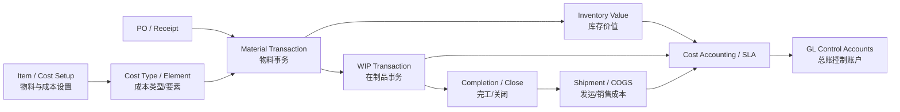
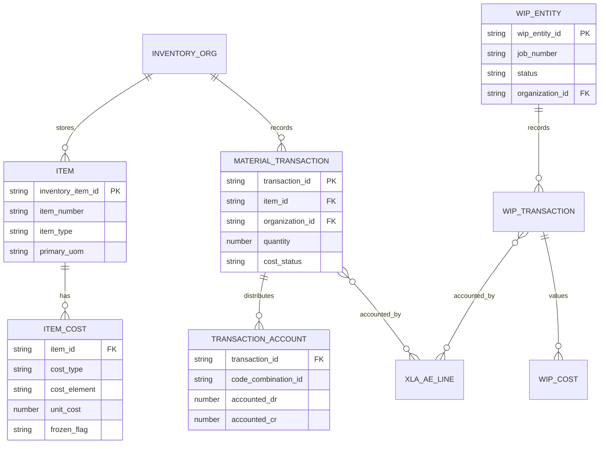
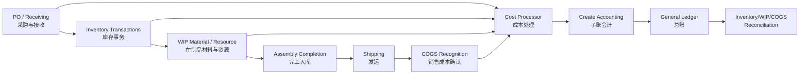
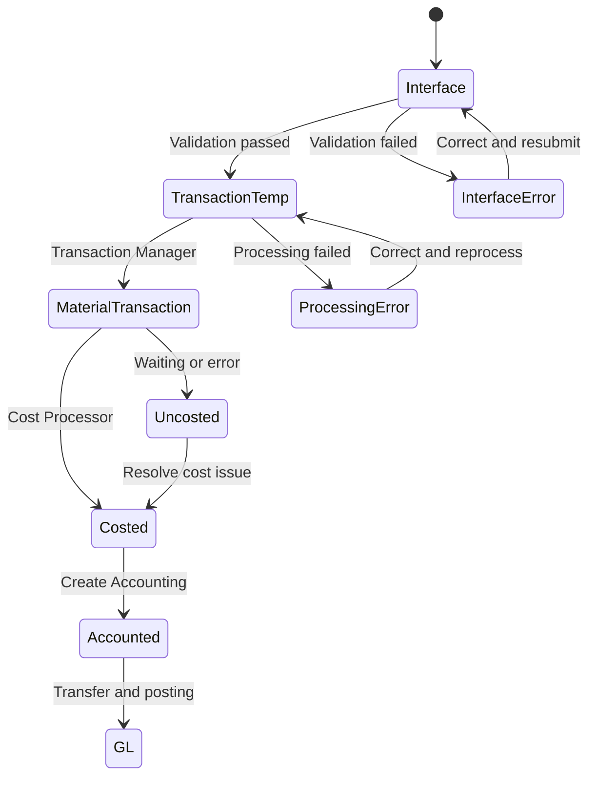

# 成本核算（Cost Accounting）

> 成本核算把采购、库存、在制品、制造、发货和收入事件转换为存货价值、制造差异、销售成本及 GL 分录。诊断必须同时看业务数量流与价值流。

## 阅读导航

- [范围](#1-学习目标与范围) · [数量与价值流](#2-数量流与价值流) · [成本方法](#3-成本方法与要素) · [业务会计](#4-关键业务会计) · [功能实施](#5-功能顾问实施重点) · [接口月结](#6-技术与接口视角) · [页面与关账实操](#9-资深顾问实操成本事务与关账) · [专题详解](#10-专题详解)

## 模块业务架构与核心 ER 图

### 成本业务架构图



### 成本核算核心 ER 图



成本方法、库存组织、成本类型和会计期间共同决定价值结果；图中名称为业务逻辑实体，实际 `MTL_*`、`WIP_*`、`CST_*` 和 XLA 关联需在目标实例确认。

## 1. 学习目标与范围

应能区分 Standard Costing（标准成本）、Average Costing（平均成本）等成本方法；理解成本要素、物料交易、接收、WIP（在制品）、销售成本/收入匹配、到岸成本及 SLA/GL；能完成库存价值和成本差异对账。

## 2. 数量流与价值流

```text
采购/接收 → 入库 → 转移/领料 → WIP 投料/资源/完工
→ 成品库存 → 发运 → COGS Recognition（销售成本确认）
                     ↘ 成本分录 → SLA/GL
```

数量正确不代表价值正确。每个断点需同时确认：交易数量、计量单位、组织/子库存、成本层或标准成本、会计事件、分配账户和期间。

## 3. 成本方法与要素

Standard Cost（标准成本）以预设标准计价，实际差异进入采购价差、材料/资源/制造费用差异等账户；Average Cost（平均成本）随接收和交易更新单位成本。成本方法通常在组织层决定，变更影响重大，不能当作普通参数调整。

常见 Cost Element（成本要素）包括 Material（材料）、Material Overhead（材料间接费）、Resource（资源）、Outside Processing（外协加工）和 Overhead（制造费用）。要素既服务分析，也影响账户和差异解释。

## 4. 关键业务会计

- 采购接收：接收价值、接收应计、检验/入库和采购价差。
- 库存交易：组织/子库存转移、杂项收发、账户别名和在途库存。
- WIP：材料领退、资源计费、外协、完工、废品和工单关闭差异。
- 销售成本：发运后暂估 COGS，并按收入确认比例进行 COGS/Revenue Matching（销售成本与收入匹配）。
- Landed Cost Management（到岸成本管理，LCM）：把运费、关税等附加费用分摊到库存成本。

具体分录取决于组织参数、成本方法和 SLA，示例不可替代实例验证。

## 5. 功能顾问实施重点

1. 确认库存组织、成本组织/方法和会计日历。
2. 定义成本要素、子要素、资源、制造费用和账户。
3. 建立物料成本、成本更新与冻结流程。
4. 配置采购接收、库存、WIP、发运及 COGS 规则。
5. 设计关账顺序、差异阈值、库存价值报表和 GL 对账。

测试需覆盖负库存、退货、跨组织转移、外币采购、成本更新、工单取消/关闭、追溯交易和跨期发运。

## 6. 技术与接口视角

常见对象涉及 `MTL_MATERIAL_TRANSACTIONS`、`MTL_TRANSACTION_ACCOUNTS`、成本表、接收表、WIP 交易/成本表及 XLA。成本接口通常异步处理；接口表有记录不代表物料交易或会计已完成。应按 `transaction_id`、组织、请求 ID、处理状态和错误码追踪。

批量接口须保存来源唯一键、物料、组织、子库存/货位、数量/UOM、日期、交易类型、账户和批次控制总额。重跑要识别事务管理器已处理但回写未完成的情况。

## 7. 月结与排错

建议顺序：清理接口和未处理物料交易 → 完成接收与应计 → 处理 WIP 未计费/未关闭工单 → 完成发运和 COGS → 运行成本处理与会计 → 对账库存/WIP/接收/COGS 与 GL → 关闭库存和成本期间。

| 现象 | 优先检查 |
| --- | --- |
| 交易卡在接口 | 必填字段、组织/UOM、期间、事务管理器和错误说明 |
| 库存数量对但价值错 | 成本方法、成本层/标准、追溯交易和账户分配 |
| WIP 差异异常 | BOM/工艺路线、领料、资源费率、完工和关闭时点 |
| COGS 未确认 | 发运、AR 收入、匹配程序和事件状态 |
| 库存与 GL 不符 | 未会计交易、截止期间、账户、手工 GL 和报表口径 |

## 8. 建议练习

- 比较同一采购价格变化在标准成本和平均成本下的结果。
- 完成采购接收、WIP 生产、发运、开票和 COGS 确认的全链追溯。
- 为月结设计数量、价值、会计三层对账表。

## 9. 资深顾问实操：成本事务与关账

### 9.1 库存与制造成本流程图



### 9.2 页面剧本：查询物料事务与会计

**常见职责与导航**：`Inventory（库存） → Transactions（事务处理） → Material Transactions（物料事务）`；账户分配可从 Tools/View Accounting 或 Cost Management 的 Material Account Distribution 查询。

1. 按 Organization、Item、Transaction Date/Type、Source 或 Transaction ID 限定查询。
2. 核对数量、UOM、Subinventory/Locator、Transfer Organization 和 Transaction Action。
3. 查看 Costed Flag/成本状态、Actual Cost、Variance 和 Accounting Line。
4. 记录 `transaction_id`，追踪到成本分配、SLA Event 和 GL Journal。
5. 若数量已更新但成本未完成，检查 Cost Manager、事务处理器、期间和错误表；不要补录杂项事务抵消未知错误。

### 9.3 页面剧本：查看和更新标准成本

**常见导航**：`Cost Management → Item Costs → Item Costs` 查询；标准成本更新通常从 `Item Costs → Standard Cost Update` 相关菜单执行。

1. 选择 Inventory Organization、Cost Type 和 Item，查看 Material/Overhead/Resource/OSP 等成本要素。
2. 区分 Frozen（冻结）成本与 Pending/Simulation 成本；记录成本来源、BOM/Routing 和费率版本。
3. 运行 Cost Rollup（成本卷积）并审阅异常、零成本和大幅波动。
4. 在非生产环境执行 Standard Cost Update，验证库存重估和差异账户。
5. 生产更新前冻结业务窗口、保存更新前后成本、库存数量/价值和控制总额；更新后立即对账。

标准成本更新会影响现有库存价值和差异，必须有财务批准与回退/补偿方案，不能只由成本维护人员独立执行。

### 9.4 页面剧本：库存期间关闭

**常见职责与导航**：`Inventory → Accounting Close Cycle（会计关账周期） → Inventory Accounting Periods（库存会计期间）`。

1. 选择目标 Organization 和 Open Period，点击 Pending 查看待处理活动。
2. 清理必须解决项：未处理物料事务、未计成本事务、待处理 WIP 成本事务。
3. 评估建议解决项：Receiving Interface、Material Interface、Shop Floor Move 等；关闭后这些旧日期事务可能无法处理。
4. 运行 Period Close Diagnostics、Material Account Distribution、WIP Account Distribution 和库存价值报表。
5. 完成 AP/Purchasing 截止及接收应计；对账库存/WIP/接收/在途与 GL。
6. 提交 Create Accounting - Cost Management，并确认无错误且已传 GL。
7. 选择 Change Status → Closed；关闭不可逆，必须在执行前取得签核。
8. 运行 Period Close Reconciliation，保存期间、组织、请求 ID、差异和批准。

### 9.5 待处理事务状态图



不同层的失败必须使用对应的标准管理器或接口恢复。直接修改状态标志会破坏数量、成本和会计的一致性。

### 9.6 WIP 差异分析

关闭工单前核对标准/实际材料、资源、外协、制造费用、完工和废品。差异按 Usage（用量）、Rate（费率）、Efficiency（效率）、Method/Configuration 等业务原因解释，并映射到责任部门；不能只按 GL 差异科目汇总。

### 9.7 资深顾问的三层对账

| 层 | 对账对象 | 关键问题 |
| --- | --- | --- |
| 数量 | On-hand、在途、WIP 数量、发运数量 | 是否存在未处理/追溯/负库存交易 |
| 价值 | 库存价值、WIP 价值、接收应计、COGS | 成本方法、成本层和截止是否一致 |
| 会计 | 事务分配、XLA、GL 控制账户 | 是否未会计、未传输、手工 GL 或账户错误 |

### 9.8 官方操作依据

- [Oracle Cost Management User's Guide — Period Close](https://docs.oracle.com/cd/E26401_01/doc.122/e48829/T372621T378953.htm)
- [Oracle Inventory User's Guide — Accounting Periods](https://docs.oracle.com/cd/E26401_01/doc.122/e48820/T291651T292307.htm)
- [Oracle Landed Cost Management User's Guide](https://docs.oracle.com/cd/E26401_01/doc.122/e48799/T528387T528392.htm)

## 10. 专题详解


<!-- source: docs/06-cost/README.md -->
<a id="src-docs-06-cost-readme"></a>
### 库存、WIP 与成本（INV / WIP / CST）


本目录覆盖收货、库存事务、WIP、成本计算和销售成本向 SLA/GL 的会计链。库存组织与成本方法属于高风险基础配置，任何成本重算、期间关闭或接口重传均应先界定组织、期间、物料和事务范围。

<a id="src-docs-06-cost-readme--专题导航"></a>
#### 专题导航

- [收货、库存、WIP 与销售成本会计流](#src-docs-06-cost-accounting-flow)
- [成本组织、成本类型与成本组设置](#src-docs-06-cost-setup)
- [标准、平均与周期成本](#src-docs-06-cost-costing-methods)
- [物料、资源与间接费](#src-docs-06-cost-cost-elements)
- [成本结转、关期与报表](#src-docs-06-cost-period-close-reports)
- [高级成本控制与差异](#src-docs-06-cost-advanced-costing-controls)
- [表结构](#src-docs-06-cost-tables)
- [Transaction Open Interface 实现](#src-docs-06-cost-interfaces)
- [处理器和接口排错](#src-docs-06-cost-interfaces-troubleshooting)

<a id="src-docs-06-cost-readme--必须控制的业务事件"></a>
#### 必须控制的业务事件

- 收货应计、发票价格/汇率差异、库存接收与 AP 负债须按采购、收货和发票三条链对账。
- 每笔物料事务必须可追溯到事务类型、来源类型、成本组织、成本期间和会计事件；库存余额不能仅用应用页面的当前数量替代会计分析。
- 标准成本更新、平均成本调整、WIP 完工/关闭和 COGS Recognition 需要在关期清单中设定顺序、冻结窗口和异常报告。
- 接口使用 `MTL_TRANSACTIONS_INTERFACE` 等标准入口，须设业务唯一键、批次控制、Lot/Serial 校验和失败行隔离。

<a id="src-docs-06-cost-readme--官方依据"></a>
#### 官方依据

- [Oracle Supply Chain Management Documentation](https://docs.oracle.com/cd/E26401_01/nav/scm.htm)


<!-- source: docs/06-cost/accounting-flow.md -->
<a id="src-docs-06-cost-accounting-flow"></a>
### 收货、库存、WIP 与销售成本会计流


<a id="src-docs-06-cost-accounting-flow--事件链"></a>
#### 事件链

```text
PO Receipt/Delivery/Return → Receiving/Inventory Accounting
Inventory Issue/Receipt/Transfer → Material Accounting
WIP Issue/Resource/Completion/Close → WIP Accounting/Variances
OM Ship Confirm → Inventory Issue → COGS Recognition
→ SLA → GL
```

典型标准成本分录（实际以 SLA/设置为准）：收货借 Receiving Inspection/贷 Accrual；Delivery 借 Inventory/贷 Receiving Inspection；领料借 WIP Valuation/贷 Inventory；完工借 Inventory/贷 WIP；销售出库借 Deferred COGS/贷 Inventory，按收入确认比例转至 COGS。

<a id="src-docs-06-cost-accounting-flow--sql"></a>
#### SQL

```sql
SELECT mmt.transaction_id, mmt.organization_id,
       mmt.inventory_item_id, mmt.transaction_date,
       mmt.transaction_type_id, mmt.transaction_action_id,
       mmt.transaction_source_type_id, mmt.transaction_source_id,
       mmt.transaction_quantity, mmt.primary_quantity,
       mmt.actual_cost, mmt.costed_flag
  FROM mtl_material_transactions mmt
 WHERE mmt.transaction_id = :p_transaction_id;

SELECT mta.transaction_id, mta.accounting_line_type,
       mta.reference_account, mta.base_transaction_value,
       mta.primary_quantity, mta.rate_or_amount,
       mta.gl_batch_id
  FROM mtl_transaction_accounts mta
 WHERE mta.transaction_id = :p_transaction_id
 ORDER BY mta.inv_sub_ledger_id;

SELECT wt.transaction_id, wt.wip_entity_id, wt.organization_id,
       wt.transaction_type, wt.transaction_date,
       wt.primary_quantity, wt.actual_resource_rate
  FROM wip_transactions wt
 WHERE wt.wip_entity_id = :p_wip_entity_id
 ORDER BY wt.transaction_date, wt.transaction_id;
```

<a id="src-docs-06-cost-accounting-flow--排查"></a>
#### 排查

- Material Transaction 未 Cost：查 `COSTED_FLAG`、Error Code/Explanation、Item Cost、Period、账户、前置交易和 Cost Manager。
- Receipt/AP Accrual 不平：按 PO Distribution/Receipt Transaction/Invoice Distribution 对比数量、价格、汇率、退货/更正和截止日。
- WIP Variance 异常：检查发料/退料、Resource Usage/Rate、Completion/Scrap、Standard Update 时间和 Job Close。
- COGS 未确认：跟踪 OM Line/Delivery/Material Transaction、AR Invoice/Revenue、COGS Recognition 请求和会计期间。

<a id="src-docs-06-cost-accounting-flow--关联"></a>
#### 关联

- [Inventory/WIP/Cost/GL E2E](09-end-to-end.md#src-docs-08-e2e-inventory-wip-cost-gl)
- [P2P](09-end-to-end.md#src-docs-08-e2e-procure-to-pay)


<!-- source: docs/06-cost/advanced-costing-controls.md -->
<a id="src-docs-06-cost-advanced-costing-controls"></a>
### 高级成本控制：差异、COGS、OPM/LCM 与关账风险


<a id="src-docs-06-cost-advanced-costing-controls--适用边界"></a>
#### 适用边界

本专题补充离散制造/库存成本中的差异和销售成本控制，并标识 OPM、Landed Cost Management（LCM）、项目制造等可选能力。是否安装产品、组织成本方法、估价账与会计规则均须以目标实例为准。

<a id="src-docs-06-cost-advanced-costing-controls--管理口径"></a>
#### 管理口径

| 主题 | 管理问题 | 关键数据链 |
| --- | --- | --- |
| 采购应计/价格差异 | 收货、发票与采购价格差异为何未清 | PO/RCV → AP → SLA/GL |
| WIP 差异 | 物料、资源、间接费、外协和产出差异是否合理 | WIP Job → 事务/成本 → 关闭/差异 → GL |
| COGS | 收入与销售成本是否在正确期间配比 | OM/Shipping → INV/COGS → SLA/GL |
| LCM/OPM | 附加成本或过程制造成本是否重复/遗漏分摊 | 业务交易 → 成本层/要素 → 会计事件 |

<a id="src-docs-06-cost-advanced-costing-controls--期间控制"></a>
#### 期间控制

1. 关闭前确认库存事务、接收、WIP 完工/关闭和成本处理器均已完成，先解决异常事务再关闭成本期间。
2. 分别审阅库存估值、在制品、收货应计、成本差异和 COGS；金额相等不代表事务数量、期间和科目均正确。
3. 标准成本更新、成本调整和追溯交易须有冻结期、批准、影响模拟和 GL 对账；避免在已签字期间直接重算。

<a id="src-docs-06-cost-advanced-costing-controls--sql成本事务定位"></a>
#### SQL：成本事务定位

```sql
-- 从物料事务开始定位；以组织、物料、日期/事务号缩小范围。
select mmt.transaction_id,
       mmt.organization_id,
       mmt.inventory_item_id,
       mmt.transaction_date,
       mmt.transaction_quantity,
       mmt.transaction_type_id,
       mmt.transaction_source_type_id,
       mmt.costed_flag
  from mtl_material_transactions mmt
 where mmt.organization_id = :p_organization_id
   and mmt.inventory_item_id = :p_inventory_item_id
   and mmt.transaction_date >= :p_from_date
   and mmt.transaction_date < :p_to_date + 1
 order by mmt.transaction_date, mmt.transaction_id;
```

<a id="src-docs-06-cost-advanced-costing-controls--排查原则"></a>
#### 排查原则

- `COSTED_FLAG` 或处理状态只能表明某一处理阶段，不能单独证明 SLA、GL 过账或报表已正确。
- 先按事务链检查来源与数量，再检查成本要素和会计，最后核对报表；不要通过直接更新成本/库存业务表处理异常。
- 对 OPM、LCM、项目制造等产品使用其官方指南、许可证与补丁级别验证对象和并发程序，避免将离散制造对象套用到不同成本模型。

<a id="src-docs-06-cost-advanced-costing-controls--官方参考"></a>
#### 官方参考

- [Oracle Supply Chain Management Documentation](https://docs.oracle.com/cd/E26401_01/nav/scm.htm)


<!-- source: docs/06-cost/cost-elements.md -->
<a id="src-docs-06-cost-cost-elements"></a>
### 物料、资源、间接费与成本更新


<a id="src-docs-06-cost-cost-elements--成本构成"></a>
#### 成本构成

```text
Assembly Item Cost
= Material（Components）
+ Material Overhead（采购/收货/物料附加）
+ Resource（Routing Resource Usage × Rate）
+ Outside Processing（外协工序）
+ Overhead（Resource/Unit/Activity Basis）
```

Cost Rollup 从 BOM/Routing 底层向上计算，受 Alternate BOM/Routing、Yield/Scrap、Basis Type、Lot Size、Resource Units/Rate、Overhead Association 影响。成本更新前应冻结 BOM/Routing 版本截止点并保留 Rollup 输出。

<a id="src-docs-06-cost-cost-elements--sql"></a>
#### SQL

```sql
SELECT cicd.inventory_item_id, cicd.organization_id,
       cicd.cost_type_id, cicd.cost_element_id,
       cicd.level_type, cicd.resource_id,
       cicd.item_cost, cicd.basis_type,
       cicd.basis_factor, cicd.net_yield_or_shrinkage_factor
  FROM cst_item_cost_details cicd
 WHERE cicd.organization_id = :p_organization_id
   AND cicd.inventory_item_id = :p_inventory_item_id
   AND cicd.cost_type_id = :p_cost_type_id
 ORDER BY cicd.cost_element_id, cicd.level_type, cicd.resource_id;

SELECT resource_id, resource_code, description,
       cost_element_id, disable_date
  FROM bom_resources
 WHERE organization_id = :p_organization_id
 ORDER BY resource_code;
```

<a id="src-docs-06-cost-cost-elements--排查"></a>
#### 排查

- Rollup 漏组件：查 BOM Effectivity、Alternate、Include in Cost Rollup、Phantom、Supply Type、Yield 和组件成本。
- Resource Cost 为零：查 Routing Operation/Resource Usage、Costed Flag、Resource Rate/Cost Type、UOM 和基准。
- Overhead 未吸收：查 Department/Resource Association、Basis Type/Rate、Activity、交易是否触发。
- Update 产生过大差异：对比 Pending/Frozen 的 Element/Level Detail，分离 BOM、Rate、Yield、Lot Size 和手工成本变更。

<a id="src-docs-06-cost-cost-elements--关联"></a>
#### 关联

- [Costing Methods](#src-docs-06-cost-costing-methods)
- [Cost Accounting Flow](#src-docs-06-cost-accounting-flow)


<!-- source: docs/06-cost/costing-methods.md -->
<a id="src-docs-06-cost-costing-methods"></a>
### 标准成本、平均成本与周期成本


<a id="src-docs-06-cost-costing-methods--方法对比"></a>
#### 方法对比

| 方法 | 价值基础 | 主要差异 |
| --- | --- | --- |
| Standard | Frozen Standard Cost | Purchase Price、Invoice Price、Resource/Usage/Efficiency、Overhead 等差异 |
| Average | 交易后加权平均单价 | 接收/生产/调整改变平均成本，销售/发料通常按当前成本出库 |
| FIFO/LIFO | 成本层 | 按层消耗并保留层次 |
| Periodic | 期间货值/交易后计算 | 期末运行周期成本处理并生成差异/调整 |

<a id="src-docs-06-cost-costing-methods--关键原理"></a>
#### 关键原理

Standard Cost Update 将 Pending 成本更新到 Frozen，对现有库存/WIP 产生重估会计。Average Cost 受负库存、交易顺序和补录日期影响；回溯交易会在处理队列中按日期先于尚未处理交易计算，但不会回滚或重处理已经完成的交易。周期成本是独立的期末计算链，不等于简单查当前 Item Cost。

<a id="src-docs-06-cost-costing-methods--sql"></a>
#### SQL

```sql
SELECT cct.cost_type_id, cct.cost_type, cct.description,
       cct.default_cost_type_id, cct.allow_updates_flag,
       cct.multi_org_flag, cct.disable_date
  FROM cst_cost_types cct
 ORDER BY cct.cost_type;

SELECT inventory_item_id, organization_id, cost_type_id,
       item_cost, unburdened_cost, burden_cost,
       material_cost, material_overhead_cost,
       resource_cost, outside_processing_cost, overhead_cost
  FROM cst_item_costs
 WHERE organization_id = :p_organization_id
   AND inventory_item_id = :p_inventory_item_id;

SELECT inventory_item_id, organization_id, transaction_id,
       layer_id, layer_quantity, item_cost
  FROM cst_quantity_layers
 WHERE organization_id = :p_organization_id
   AND inventory_item_id = :p_inventory_item_id
 ORDER BY layer_id;
```

<a id="src-docs-06-cost-costing-methods--排查"></a>
#### 排查

- Standard Update 异常：先运行不更新的模拟/报表，审核成本差异、库存/WIP 重估和账户后再执行。
- Average Cost 跳变：按 Transaction ID/Date 跟踪 Receipt、Cost Update、Negative Balance 恢复和补录交易。
- 负库存差异：查允许负库存设置、交易时间顺序、成本层和恢复入库价格。
- 期间成本不完整：查所有交易已 Cost、期间范围、未处理接口、资源/间接费和处理日志。

<a id="src-docs-06-cost-costing-methods--关联"></a>
#### 关联

- [Cost Setup](#src-docs-06-cost-setup)
- [Period Close](#src-docs-06-cost-period-close-reports)


<!-- source: docs/06-cost/interfaces-troubleshooting.md -->
<a id="src-docs-06-cost-interfaces-troubleshooting"></a>
### 成本接口、Transaction Processor 与排错


> `MTL_TRANSACTIONS_INTERFACE`、Lot Interface、幂等和 Transaction Manager 处理代码见 [库存/WIP/成本接口实现案例](#src-docs-06-cost-interfaces)。

<a id="src-docs-06-cost-interfaces-troubleshooting--处理器链路"></a>
#### 处理器链路

```text
MTL_TRANSACTIONS_INTERFACE
 → Transaction Manager/Worker
 → MTL_MATERIAL_TRANSACTIONS_TEMP
 → Material Transaction
 → Cost Manager/Cost Worker
 → MTL_TRANSACTION_ACCOUNTS / SLA / GL
```

WIP Move/Cost、Receiving 和 Resource 还有各自接口/待处理表。排错应先确定卡在“导入、业务处理、成本计算、SLA、GL”哪一层。

<a id="src-docs-06-cost-interfaces-troubleshooting--sql"></a>
#### SQL

```sql
SELECT transaction_interface_id, source_code, source_header_id,
       source_line_id, process_flag, transaction_mode,
       lock_flag, error_code, error_explanation,
       organization_id, inventory_item_id,
       transaction_quantity, transaction_uom,
       transaction_date, transaction_type_id
  FROM mtl_transactions_interface
 WHERE organization_id = :p_organization_id
 ORDER BY transaction_interface_id;

SELECT transaction_temp_id, transaction_header_id,
       process_flag, lock_flag, organization_id,
       inventory_item_id, transaction_quantity,
       transaction_date, transaction_type_id
  FROM mtl_material_transactions_temp
 WHERE organization_id = :p_organization_id
 ORDER BY transaction_temp_id;

SELECT transaction_id, costed_flag, error_code, error_explanation
  FROM mtl_material_transactions
 WHERE organization_id = :p_organization_id
   AND NVL(costed_flag, 'N') <> 'Y'
 ORDER BY transaction_date, transaction_id;
```

<a id="src-docs-06-cost-interfaces-troubleshooting--排错"></a>
#### 排错

- `PROCESS_FLAG=3`/错误：根据 Error Code/Explanation 检查 Item/Org、UOM、Subinventory/Locator、Lot/Serial、Account、Date/Period。
- 长期 `PROCESS_FLAG=1/LOCK_FLAG=2`：检查 Transaction Manager/Worker 是否运行、并发冲突、失效 Worker 和数据库锁，不直接改 Flag。
- 交易已入 MMT 但未 Cost：检查 Cost Manager、Item Cost、前置 Transaction、期间、负库存和 Cost Worker 日志。
- 重复交易：使用 Source Code/Header/Line 幂等键，导入前同时查 Interface/Temp/Base 三层。
- Lot/Serial 错：接口头与 Lot/Serial Interface 子表的 Transaction Interface ID、数量和控制级别必须一致。

<a id="src-docs-06-cost-interfaces-troubleshooting--关联"></a>
#### 关联

- [Inventory Transactions](#src-docs-06-cost-accounting-flow)
- [Concurrent Programs](10-technical.md#src-docs-09-technical-concurrent-programs)

<a id="src-docs-06-cost-interfaces-troubleshooting--官方参考"></a>
#### 官方参考

- [Oracle Inventory User's Guide R12.2](https://docs.oracle.com/cd/E26401_01/doc.122/e48820/)


<!-- source: docs/06-cost/interfaces.md -->
<a id="src-docs-06-cost-interfaces"></a>
### Oracle Inventory、WIP 与成本接口实现案例


<a id="src-docs-06-cost-interfaces--1-业界常用场景"></a>
#### 1. 业界常用场景

| 场景 | 推荐接口 | 说明 |
| --- | --- | --- |
| WMS/3PL 入库、出库、调拨 | Inventory Transaction Open Interface | 写 `MTL_TRANSACTIONS_INTERFACE`，由 Transaction Manager 处理 |
| 批次/序列控制物料交易 | MTI + Lot/Serial Interface | 子表数量必须与主交易数量及物料控制属性一致 |
| MES 发料、退料、完工、报废 | WIP/Inventory 标准接口或公开 API | 按工单、工序、资源、组织分别验证 |
| 外部采购收货 | Receiving Open Interface | 使用 `RCV_HEADERS_INTERFACE`/`RCV_TRANSACTIONS_INTERFACE`，不要模拟库存 Misc Receipt |
| 盘点系统上传差异 | Physical/Cycle Count 标准接口 | 保留 Count Batch、Tag/Sequence、复点和审批状态 |
| 标准成本批量维护 | Item Cost Import/标准 Cost Update 流程 | 必须区分 Pending Cost、Cost Type 和组织成本法 |

<a id="src-docs-06-cost-interfaces--2-transaction-open-interface-状态模型"></a>
#### 2. Transaction Open Interface 状态模型

```text
WMS/MES
→ 自定义暂存（幂等、主数据校验）
→ MTL_TRANSACTIONS_INTERFACE
→ Transaction Manager/Worker
→ MTL_MATERIAL_TRANSACTIONS_TEMP
→ MTL_MATERIAL_TRANSACTIONS
→ Cost Manager
→ SLA/GL
```

常见接口初始值为 `PROCESS_FLAG=1`、`LOCK_FLAG=2`、`TRANSACTION_MODE=3`。这些值应按目标实例 eTRM 和标准样本核对；错误后优先通过 Transaction Open Interface 界面修正/重提，不直接批量改 Flag。

<a id="src-docs-06-cost-interfaces--3-导入前业务校验"></a>
#### 3. 导入前业务校验

```sql
SELECT msi.inventory_item_id,
       msi.segment1 item_number,
       msi.primary_uom_code,
       msi.inventory_item_status_code,
       msi.lot_control_code,
       msi.serial_number_control_code,
       msi.restrict_subinventories_code,
       msi.restrict_locators_code
  FROM mtl_system_items_b msi
 WHERE msi.organization_id = :p_organization_id
   AND msi.inventory_item_id = :p_inventory_item_id;

SELECT msi.secondary_inventory_name,
       msi.disable_date,
       msi.asset_inventory,
       msi.quantity_tracked
  FROM mtl_secondary_inventories msi
 WHERE msi.organization_id = :p_organization_id
   AND msi.secondary_inventory_name = :p_subinventory_code;

SELECT oap.organization_id,
       oap.open_flag,
       oap.period_name,
       oap.period_start_date,
       oap.schedule_close_date
  FROM org_acct_periods oap
 WHERE oap.organization_id = :p_organization_id
   AND :p_transaction_date BETWEEN oap.period_start_date
                               AND oap.schedule_close_date;
```

还应校验 UOM 转换、Locator、Lot/Serial、负库存策略、Transaction Type/Source、账户和项目制造属性。

<a id="src-docs-06-cost-interfaces--4-非批次物料的-miscellaneous-receipt"></a>
#### 4. 非批次物料的 Miscellaneous Receipt

```sql
DECLARE
  l_interface_id NUMBER := mtl_material_transactions_s.NEXTVAL;
  l_header_id    NUMBER := mtl_material_transactions_s.NEXTVAL;
  l_trx_type_id  NUMBER;
BEGIN
  SELECT transaction_type_id
    INTO l_trx_type_id
    FROM mtl_transaction_types
   WHERE transaction_type_name = 'Miscellaneous receipt';

  INSERT INTO mtl_transactions_interface (
    transaction_interface_id,
    transaction_header_id,
    source_code,
    source_header_id,
    source_line_id,
    process_flag,
    transaction_mode,
    lock_flag,
    organization_id,
    inventory_item_id,
    subinventory_code,
    locator_id,
    transaction_type_id,
    transaction_quantity,
    primary_quantity,
    transaction_uom,
    transaction_date,
    distribution_account_id,
    transaction_reference,
    last_update_date,
    last_updated_by,
    creation_date,
    created_by,
    last_update_login
  ) VALUES (
    l_interface_id,
    l_header_id,
    'XX_WMS',
    :p_external_header_id,
    :p_external_line_id,
    1,
    3,
    2,
    :p_organization_id,
    :p_inventory_item_id,
    :p_subinventory_code,
    :p_locator_id,
    l_trx_type_id,
    :p_transaction_quantity,
    :p_primary_quantity,
    :p_transaction_uom,
    :p_transaction_date,
    :p_distribution_ccid,
    :p_external_document_number,
    SYSDATE,
    fnd_global.user_id,
    SYSDATE,
    fnd_global.user_id,
    fnd_global.login_id
  );

  COMMIT;
  dbms_output.put_line('TRANSACTION_INTERFACE_ID=' || l_interface_id);
  dbms_output.put_line('TRANSACTION_HEADER_ID=' || l_header_id);
END;
/
```

正负号由 Transaction Type/Action 与业务方向共同决定。上线前必须用目标组织手工交易生成样本，确认数量方向、账户来源和 Cost Group；不要用负数量“猜测”所有出库场景。

<a id="src-docs-06-cost-interfaces--5-批次物料交易"></a>
#### 5. 批次物料交易

在写入主接口后，使用相同 `TRANSACTION_INTERFACE_ID` 写 Lot Interface：

```sql
INSERT INTO mtl_transaction_lots_interface (
  transaction_interface_id,
  lot_number,
  transaction_quantity,
  primary_quantity,
  last_update_date,
  last_updated_by,
  creation_date,
  created_by
) VALUES (
  :p_transaction_interface_id,
  :p_lot_number,
  :p_transaction_quantity,
  :p_primary_quantity,
  SYSDATE,
  fnd_global.user_id,
  SYSDATE,
  fnd_global.user_id
);
```

序列控制物料还需 `MTL_SERIAL_NUMBERS_INTERFACE`。一批多 Lot 或连续 Serial 时，所有子行数量汇总必须与主接口一致；组织间调拨还要同时校验 From/To Organization、Intransit 和接收路线。

<a id="src-docs-06-cost-interfaces--6-处理错误与重试"></a>
#### 6. 处理、错误与重试

Transaction Manager 可按后台周期处理，也可从标准 Transaction Open Interface 页面启动 Process Transactions Interface。不要在未核对并发程序参数的情况下硬编码内部程序签名。

```sql
-- 接口层错误
SELECT transaction_interface_id,
       transaction_header_id,
       source_code,
       source_header_id,
       source_line_id,
       process_flag,
       lock_flag,
       error_code,
       error_explanation
  FROM mtl_transactions_interface
 WHERE source_code = 'XX_WMS'
   AND source_header_id = :p_external_header_id
 ORDER BY source_line_id;

-- Temp 层等待/错误
SELECT transaction_temp_id,
       transaction_header_id,
       process_flag,
       lock_flag,
       error_code,
       error_explanation
  FROM mtl_material_transactions_temp
 WHERE transaction_header_id = :p_transaction_header_id;

-- 成功业务交易
SELECT transaction_id,
       organization_id,
       inventory_item_id,
       transaction_quantity,
       primary_quantity,
       transaction_date,
       transaction_type_id,
       costed_flag,
       transaction_reference
  FROM mtl_material_transactions
 WHERE transaction_source_name = :p_external_document_number
    OR transaction_reference = :p_external_document_number
 ORDER BY transaction_id;
```

成功后的稳定追溯应将 `TRANSACTION_INTERFACE_ID → TRANSACTION_ID` 写入自定义映射表；字段回写行为随交易类型而异，不能只依赖 `TRANSACTION_REFERENCE`。

<a id="src-docs-06-cost-interfaces--7-幂等与并发实现"></a>
#### 7. 幂等与并发实现

建议暂存表唯一键：

```sql
ALTER TABLE xxinv_txn_stg ADD CONSTRAINT xxinv_txn_stg_u1
  UNIQUE (source_system, external_header_id, external_line_id, action_code);
```

工作进程以 `FOR UPDATE SKIP LOCKED` 领取待处理行：

```sql
SELECT message_id
  FROM xxinv_txn_stg
 WHERE status = 'VALIDATED'
 ORDER BY message_id
 FOR UPDATE SKIP LOCKED;
```

每个源业务行只生成一个稳定幂等键。HTTP 超时、并发请求仍 Running 或 Transaction Manager 结果未知时，先查 Interface/Temp/Base 三层，不直接复制重放。

<a id="src-docs-06-cost-interfaces--8-wipmes-实施边界"></a>
#### 8. WIP/MES 实施边界

- 组件发料/退料可经标准 WIP/Inventory 交易处理，必须传工单、Operation Sequence 和 Supply Type 所需信息。
- 完工/退回要验证 Routing、Completion Subinventory/Locator、Lot/Serial 和 Backflush。
- 资源计费要验证 Department、Resource、UOM、实际/标准计费和时间。
- 工单状态、成本更新、关闭和差异计算使用标准流程；不直接写 `WIP_ENTITIES`、`WIP_DISCRETE_JOBS`、`WIP_TRANSACTIONS`。
- 如果 Integration Repository 提供匹配的公开 WIP API，以当前实例方法签名、消息栈和提交语义为准。

<a id="src-docs-06-cost-interfaces--9-常见问题"></a>
#### 9. 常见问题

| 症状 | 常见原因 | 处理 |
| --- | --- | --- |
| `PROCESS_FLAG=3` | Item/Org/UOM/Subinventory/Locator/Lot/Serial/Account 无效 | 查 `ERROR_CODE/ERROR_EXPLANATION` 并用标准页面修正 |
| 长时间 Locked | Worker 失效、数据库锁、并发管理器异常 | 查请求、Session 和 Worker 日志，不直接改 Lock Flag |
| 已交易但未成本化 | Cost Manager、Item Cost、前置交易、期间或负库存问题 | 查 `MMT.COSTED_FLAG` 和 Cost Worker 日志 |
| Lot 数量错误 | Lot 子行合计与主行不一致 | 重建整笔消息，不只修改一张子表 |
| 重复出入库 | 超时后无查询即重放 | 暂存唯一约束 + 三层查询 + 成功 ID 映射 |

<a id="src-docs-06-cost-interfaces--10-关联文档"></a>
#### 10. 关联文档

- [成本接口与排错](#src-docs-06-cost-interfaces-troubleshooting)
- [库存/WIP/成本会计流](#src-docs-06-cost-accounting-flow)
- [成本常用表](#src-docs-06-cost-tables)
- [库存、WIP、成本到 GL](09-end-to-end.md#src-docs-08-e2e-inventory-wip-cost-gl)

<a id="src-docs-06-cost-interfaces--11-官方参考"></a>
#### 11. 官方参考

- [Oracle Inventory User Guide: Transaction Open Interface](https://docs.oracle.com/cd/E26401_01/doc.122/e48820/T291651T292013.htm)
- [Oracle Inventory User Guide R12.2](https://docs.oracle.com/cd/E26401_01/doc.122/e48820/)
- [Oracle E-Business Suite eTRM User's Guide](https://docs.oracle.com/cd/E26401_01/doc.122/f53031/)


<!-- source: docs/06-cost/period-close-reports.md -->
<a id="src-docs-06-cost-period-close-reports"></a>
### 成本分配、差异、结转、期间关闭与报表


<a id="src-docs-06-cost-period-close-reports--关期顺序"></a>
#### 关期顺序

1. 停止当期补录，处理 Inventory/Receiving/WIP/Cost Interface 待处理和错误交易。
2. 确保 Material/Resource/Overhead/Receiving 交易已 Cost 并创建会计。
3. 处理 WIP Jobs：发料、完工、差异、Close；处理 COGS Recognition。
4. 对账 Inventory Valuation、Receiving Accrual、WIP Valuation、COGS、差异和 GL。
5. 运行 Period Close Reconciliation/估值/交易分布报表，再关闭 Inventory Period。

<a id="src-docs-06-cost-period-close-reports--sql"></a>
#### SQL

```sql
SELECT oap.organization_id, oap.acct_period_id,
       oap.period_name, oap.period_start_date,
       oap.schedule_close_date, oap.period_close_date,
       oap.open_flag, oap.summarized_flag
  FROM org_acct_periods oap
 WHERE oap.organization_id = :p_organization_id
 ORDER BY oap.period_start_date DESC;

SELECT costed_flag, transaction_source_type_id,
       transaction_action_id, COUNT(*) cnt
  FROM mtl_material_transactions
 WHERE organization_id = :p_organization_id
   AND transaction_date BETWEEN :p_start_date AND :p_end_date
 GROUP BY costed_flag, transaction_source_type_id,
          transaction_action_id;

SELECT accounting_line_type, reference_account,
       SUM(base_transaction_value) amount
  FROM mtl_transaction_accounts
 WHERE organization_id = :p_organization_id
   AND transaction_date BETWEEN :p_start_date AND :p_end_date
 GROUP BY accounting_line_type, reference_account;
```

<a id="src-docs-06-cost-period-close-reports--排查"></a>
#### 排查

- Period Close 不允许：运行 Pending Transactions 检查，分别处理 MTL Transactions Interface、Pending Material、WIP Move/Cost、Receiving 和未会计交易。
- Inventory/GL 不平：统一组织、截止时间、Cost Group/Subinventory、Currency，分析未转 GL、手工 GL、补录和负库存。
- 估值报表负数：按 Item/Subinventory/Locator/Cost Group 查 On-hand、Pending Transaction 和负库存原因。
- 关期后发现遗漏：Inventory 期间一旦正式关闭不能重开；不要直接更新期间表，按批准的更正/调整流程在当前开放期间处理，并保留审计链。

<a id="src-docs-06-cost-period-close-reports--关联"></a>
#### 关联

- [Cost Accounting Flow](#src-docs-06-cost-accounting-flow)
- [GL Close](02-record-to-report.md#src-docs-04-gl-close-reports)


<!-- source: docs/06-cost/setup.md -->
<a id="src-docs-06-cost-setup"></a>
### 成本组织、成本类型、成本要素与成本组


<a id="src-docs-06-cost-setup--核心模型"></a>
#### 核心模型

- Inventory Organization 是库存/制造交易边界，其 Costing Organization/Method 在库存组织参数中确定。
- Cost Type 是一套物料/资源/间接费成本表述；Frozen 常用于标准成本，Pending 或自定义类型用于模拟/更新。
- Cost Element 包括 Material、Material Overhead、Resource、Outside Processing、Overhead。
- Cost Group 在项目制造/WMS 等场景将同一组织库存按成本分区，不等于 Cost Type。
- Valuation Account 通常由 Organization/Subinventory/Cost Group/Item 和 SLA 共同决定。

<a id="src-docs-06-cost-setup--设置顺序"></a>
#### 设置顺序

1. 建立 Ledger/OU/Inventory Organization、物料主组织和会计信息。
2. 设置 Costing Method、Cost Organization、Transfer Detail、Negative Quantity 和账户。
3. 定义 Cost Types、Activities、Resources、Overheads、Departments/Resources 和 Absorption Rules。
4. 定义 Item Cost、Resource Rate、Overhead Rate，执行 Cost Rollup/Update 测试。
5. 测试 PO Receipt/Delivery、Misc/Transfer、WIP Issue/Completion、Sales Issue、Return 和月结。

<a id="src-docs-06-cost-setup--sql"></a>
#### SQL

```sql
SELECT organization_id, organization_code, organization_name,
       operating_unit, set_of_books_id, master_organization_id,
       legal_entity, disable_date
  FROM org_organization_definitions
 WHERE organization_id = :p_organization_id;

SELECT cic.inventory_item_id, cic.organization_id,
       cic.cost_type_id, cct.cost_type,
       cic.material_cost, cic.material_overhead_cost,
       cic.resource_cost, cic.outside_processing_cost,
       cic.overhead_cost, cic.item_cost, cic.based_on_rollup_flag
  FROM cst_item_costs cic
  JOIN cst_cost_types cct ON cct.cost_type_id = cic.cost_type_id
 WHERE cic.organization_id = :p_organization_id
   AND cic.inventory_item_id = :p_inventory_item_id;
```

<a id="src-docs-06-cost-setup--排查"></a>
#### 排查

- Item Cost 为零：检查 Cost Type、Buy/Make、BOM/Routing、Component Yield、Resource/Overhead Rate 和 Rollup 日志。
- 账户错：查 Organization/Subinventory/Item/Cost Group 默认及 SLA Account Derivation。
- 组织不能运行成本程序：查 Costing Method、Cost Organization Relationship、Period 和职责 Organization Access。
- 修改 Cost Method 需求：有交易后通常不能直接切换，应设计新组织/迁移方案并与 Oracle Support 确认。

<a id="src-docs-06-cost-setup--关联"></a>
#### 关联

- [INV/CST/WIP 常用表结构与字段含义](#src-docs-06-cost-tables)
- [Costing Methods](#src-docs-06-cost-costing-methods)
- [Inventory/WIP/Cost/GL](09-end-to-end.md#src-docs-08-e2e-inventory-wip-cost-gl)


<!-- source: docs/06-cost/tables.md -->
<a id="src-docs-06-cost-tables"></a>
### Inventory / Cost / WIP 常用表结构


<a id="src-docs-06-cost-tables--业务说明"></a>
#### 业务说明

库存数量、成本价值和会计分录是三个不同层次：On-hand 回答“现在有多少”，Material Transaction 回答“数量如何变化”，Item Cost/Cost Layer 回答“单价如何得出”，Transaction Accounts/SLA 回答“如何入账”。WIP 还需将工单、发退料、资源、移动/完工和差异结合。

<a id="src-docs-06-cost-tables--表级速查"></a>
#### 表级速查

| 表 | 中文名 | 粒度/用途 | 关键字段 |
| --- | --- | --- | --- |
| `MTL_SYSTEM_ITEMS_B` | 物料组织属性 | Item+Inventory Organization | `INVENTORY_ITEM_ID`, `ORGANIZATION_ID` |
| `MTL_PARAMETERS` | 库存组织参数 | 每个 IO | `ORGANIZATION_ID`, `MASTER_ORGANIZATION_ID`, Costing options |
| `MTL_ONHAND_QUANTITIES_DETAIL` | 现有量明细 | Item+Org+Subinventory+Locator+Lot+Receipt Layer | `ONHAND_QUANTITIES_ID`, `PRIMARY_TRANSACTION_QUANTITY` |
| `MTL_MATERIAL_TRANSACTIONS` | 库存物料交易 | 每笔已处理物料交易 | `TRANSACTION_ID`, `ORGANIZATION_ID`, `INVENTORY_ITEM_ID` |
| `MTL_TRANSACTION_ACCOUNTS` | 库存交易会计分布 | Transaction+会计行 | `INV_SUB_LEDGER_ID`, `TRANSACTION_ID`, `REFERENCE_ACCOUNT` |
| `MTL_TRANSACTIONS_INTERFACE` | 库存交易接口 | 待 Transaction Manager 处理 | `TRANSACTION_INTERFACE_ID`, `PROCESS_FLAG`, `ERROR_CODE` |
| `MTL_MATERIAL_TRANSACTIONS_TEMP` | 库存待处理交易 | Transaction Worker 工作层 | `TRANSACTION_TEMP_ID`, `TRANSACTION_HEADER_ID` |
| `CST_COST_TYPES` | 成本类型 | 每个 Cost Type | `COST_TYPE_ID`, `COST_TYPE`, `ALLOW_UPDATES_FLAG` |
| `CST_ITEM_COSTS` | 物料成本汇总 | Item+Org+Cost Type | `INVENTORY_ITEM_ID`, `ORGANIZATION_ID`, `COST_TYPE_ID` |
| `CST_ITEM_COST_DETAILS` | 物料成本明细 | Item+Cost Type+Element/Resource/Level | `COST_ELEMENT_ID`, `LEVEL_TYPE`, `ITEM_COST` |
| `CST_QUANTITY_LAYERS` | 数量/成本层 | Item+Org+Cost Group/Layer | `LAYER_ID`, `LAYER_QUANTITY`, `ITEM_COST` |
| `WIP_ENTITIES` | WIP 工单实体 | 每个 Job/Schedule Entity | `WIP_ENTITY_ID`, `WIP_ENTITY_NAME`, `ORGANIZATION_ID` |
| `WIP_DISCRETE_JOBS` | 离散工单 | 每个 Discrete Job | `WIP_ENTITY_ID`, `STATUS_TYPE`, `PRIMARY_ITEM_ID` |
| `WIP_TRANSACTIONS` | WIP 资源/成本交易 | 每笔 WIP Transaction | `TRANSACTION_ID`, `WIP_ENTITY_ID`, `TRANSACTION_TYPE` |
| `WIP_TRANSACTION_ACCOUNTS` | WIP 会计分布 | WIP Transaction+会计行 | `TRANSACTION_ID`, `ACCOUNTING_LINE_TYPE`, `REFERENCE_ACCOUNT` |
| `ORG_ACCT_PERIODS` | 库存会计期间 | Organization+Period | `ACCT_PERIOD_ID`, `OPEN_FLAG`, `PERIOD_CLOSE_DATE` |

<a id="src-docs-06-cost-tables--mtlmaterialtransactions-物料交易"></a>
#### `MTL_MATERIAL_TRANSACTIONS` — 物料交易

| 字段 | 中文名 | 业务说明 |
| --- | --- | --- |
| `TRANSACTION_ID` | 库存交易 ID | 连接 Lot/Serial、Cost Distribution、源单据的主线 |
| `TRANSACTION_TYPE_ID` | 交易类型 | 关联 `MTL_TRANSACTION_TYPES`，如 PO Receipt、Misc Issue、Sales Order Issue |
| `TRANSACTION_ACTION_ID` | 交易动作 | Issue/Receipt/Transfer/Cost Update 等底层动作 |
| `TRANSACTION_SOURCE_TYPE_ID` | 源类型 | PO、Sales Order、WIP Job、Account 等来源大类 |
| `TRANSACTION_SOURCE_ID` | 源单据 ID | 含义随 Source Type 改变，不能统一关联同一张表 |
| `TRANSACTION_QUANTITY` | 交易 UOM 数量 | UOM 见 `TRANSACTION_UOM` |
| `PRIMARY_QUANTITY` | 主单位数量 | On-hand/跨交易对账常用主 UOM |
| `SUBINVENTORY_CODE/LOCATOR_ID` | 子库/库位 | Transfer 交易还需检查 Transfer Subinventory/Locator |
| `COSTED_FLAG` | 成本处理状态 | 常见已成本/未成本/错误/不需成本等代码，必须结合 `ERROR_CODE/ERROR_EXPLANATION` 和 Cost Manager 日志 |
| `ACTUAL_COST` | 实际单位成本 | 对不同 Costing Method/交易类型含义不同，不能直接当标准成本 |

<a id="src-docs-06-cost-tables--mtltransactionsinterface-处理字段"></a>
#### `MTL_TRANSACTIONS_INTERFACE` 处理字段

| 字段 | 中文名 | 说明 |
| --- | --- | --- |
| `PROCESS_FLAG` | 处理状态 | 常见 `1`等待、`2`运行中、`3`错误；以 Inventory eTRM/Manager 逻辑为准 |
| `LOCK_FLAG` | 锁定状态 | 工作器选中与释放控制，不应手工改 Flag 解锁 |
| `TRANSACTION_MODE` | 处理模式 | Online/Concurrent/Background 等方式，具体代码用 Inventory Lookup 解码 |
| `SOURCE_CODE/HEADER_ID/LINE_ID` | 外部源键 | 应组成幂等键，避免超时重试造成重复交易 |
| `ERROR_CODE/ERROR_EXPLANATION` | 错误代码/说明 | 修正上游数据后按标准 Resubmit 流程重试 |

<a id="src-docs-06-cost-tables--成本字段"></a>
#### 成本字段

<a id="src-docs-06-cost-tables--cstitemcostdetails"></a>
##### `CST_ITEM_COST_DETAILS`

| 字段 | 中文名 | 常见值/业务含义 |
| --- | --- | --- |
| `COST_ELEMENT_ID` | 成本要素 | 标准要素通常为 Material、Material Overhead、Resource、Outside Processing、Overhead；用 `CST_COST_ELEMENTS` 解码 |
| `LEVEL_TYPE` | 本层/下层 | 区分 This Level 与 Previous Level，内部代码以 Cost Lookup 为准 |
| `RESOURCE_ID` | 子要素/资源 | Material Subelement、Resource、Overhead 的具体来源 |
| `BASIS_TYPE` | 计费基础 | Item/Lot/Resource Units/Resource Value/Total Value/Activity 等，按 Cost Element 与设置解码 |
| `ITEM_COST` | 成本明细金额 | 汇总后与 `CST_ITEM_COSTS` 要素成本对账，注意 Yield/Shrinkage/Basis Factor |

<a id="src-docs-06-cost-tables--wip-工单状态"></a>
#### WIP 工单状态

`WIP_DISCRETE_JOBS.STATUS_TYPE` 是数字 Lookup，常见业务含义包括 Unreleased、Released、Complete、Complete-No Charges、Closed、Cancelled、On Hold。不应在报表中手写不完整 `DECODE`，应关联 WIP Job Status Lookup；Complete 不等于 Closed，只有 Close 后才会按规则识别/结转差异。

<a id="src-docs-06-cost-tables--官方参考"></a>
#### 官方参考

- [Oracle Cost Management User's Guide R12.2](https://docs.oracle.com/cd/E26401_01/doc.122/e48829/)
- [Oracle Inventory User's Guide R12.2](https://docs.oracle.com/cd/E26401_01/doc.122/e48820/)
- [Oracle E-Business Suite eTRM User's Guide](https://docs.oracle.com/cd/E26401_01/doc.122/f53031/)

<!-- 兼容旧版目录与学习材料的定位锚点；正文已按主题重编。 -->
<a id="src-docs-07-cost-accounting-cogs-and-revenue-matching-readme"></a>
<a id="src-docs-07-cost-accounting-cogs-and-revenue-matching-readme--业务定位"></a>
<a id="src-docs-07-cost-accounting-cogs-and-revenue-matching-readme--关联与官方依据"></a>
<a id="src-docs-07-cost-accounting-cogs-and-revenue-matching-readme--实施边界"></a>
<a id="src-docs-07-cost-accounting-cogs-and-revenue-matching-readme--常见问题与排查"></a>
<a id="src-docs-07-cost-accounting-cogs-and-revenue-matching-readme--数据接口与会计追溯"></a>
<a id="src-docs-07-cost-accounting-cogs-and-revenue-matching-readme--设计与配置"></a>
<a id="src-docs-07-cost-accounting-discrete-cost-management-readme"></a>
<a id="src-docs-07-cost-accounting-discrete-cost-management-readme--业务定位"></a>
<a id="src-docs-07-cost-accounting-discrete-cost-management-readme--关联与官方依据"></a>
<a id="src-docs-07-cost-accounting-discrete-cost-management-readme--实施边界"></a>
<a id="src-docs-07-cost-accounting-discrete-cost-management-readme--常见问题与排查"></a>
<a id="src-docs-07-cost-accounting-discrete-cost-management-readme--数据接口与会计追溯"></a>
<a id="src-docs-07-cost-accounting-discrete-cost-management-readme--设计与配置"></a>
<a id="src-docs-07-cost-accounting-eam-cost-and-capitalization-readme"></a>
<a id="src-docs-07-cost-accounting-eam-cost-and-capitalization-readme--业务定位"></a>
<a id="src-docs-07-cost-accounting-eam-cost-and-capitalization-readme--关联与官方依据"></a>
<a id="src-docs-07-cost-accounting-eam-cost-and-capitalization-readme--实施边界"></a>
<a id="src-docs-07-cost-accounting-eam-cost-and-capitalization-readme--常见问题与排查"></a>
<a id="src-docs-07-cost-accounting-eam-cost-and-capitalization-readme--数据接口与会计追溯"></a>
<a id="src-docs-07-cost-accounting-eam-cost-and-capitalization-readme--设计与配置"></a>
<a id="src-docs-07-cost-accounting-inventory-accounting-readme"></a>
<a id="src-docs-07-cost-accounting-inventory-accounting-readme--业务定位"></a>
<a id="src-docs-07-cost-accounting-inventory-accounting-readme--关联与官方依据"></a>
<a id="src-docs-07-cost-accounting-inventory-accounting-readme--实施边界"></a>
<a id="src-docs-07-cost-accounting-inventory-accounting-readme--常见问题与排查"></a>
<a id="src-docs-07-cost-accounting-inventory-accounting-readme--数据接口与会计追溯"></a>
<a id="src-docs-07-cost-accounting-inventory-accounting-readme--设计与配置"></a>
<a id="src-docs-07-cost-accounting-landed-cost-management-readme"></a>
<a id="src-docs-07-cost-accounting-landed-cost-management-readme--业务定位"></a>
<a id="src-docs-07-cost-accounting-landed-cost-management-readme--关联与官方依据"></a>
<a id="src-docs-07-cost-accounting-landed-cost-management-readme--实施边界"></a>
<a id="src-docs-07-cost-accounting-landed-cost-management-readme--常见问题与排查"></a>
<a id="src-docs-07-cost-accounting-landed-cost-management-readme--数据接口与会计追溯"></a>
<a id="src-docs-07-cost-accounting-landed-cost-management-readme--设计与配置"></a>
<a id="src-docs-07-cost-accounting-process-manufacturing-costing-readme"></a>
<a id="src-docs-07-cost-accounting-process-manufacturing-costing-readme--业务定位"></a>
<a id="src-docs-07-cost-accounting-process-manufacturing-costing-readme--关联与官方依据"></a>
<a id="src-docs-07-cost-accounting-process-manufacturing-costing-readme--实施边界"></a>
<a id="src-docs-07-cost-accounting-process-manufacturing-costing-readme--常见问题与排查"></a>
<a id="src-docs-07-cost-accounting-process-manufacturing-costing-readme--数据接口与会计追溯"></a>
<a id="src-docs-07-cost-accounting-process-manufacturing-costing-readme--设计与配置"></a>
<a id="src-docs-07-cost-accounting-project-manufacturing-readme"></a>
<a id="src-docs-07-cost-accounting-project-manufacturing-readme--业务定位"></a>
<a id="src-docs-07-cost-accounting-project-manufacturing-readme--关联与官方依据"></a>
<a id="src-docs-07-cost-accounting-project-manufacturing-readme--实施边界"></a>
<a id="src-docs-07-cost-accounting-project-manufacturing-readme--常见问题与排查"></a>
<a id="src-docs-07-cost-accounting-project-manufacturing-readme--数据接口与会计追溯"></a>
<a id="src-docs-07-cost-accounting-project-manufacturing-readme--设计与配置"></a>
<a id="src-docs-07-cost-accounting-purchasing-receiving-accounting-readme"></a>
<a id="src-docs-07-cost-accounting-purchasing-receiving-accounting-readme--业务定位"></a>
<a id="src-docs-07-cost-accounting-purchasing-receiving-accounting-readme--关联与官方依据"></a>
<a id="src-docs-07-cost-accounting-purchasing-receiving-accounting-readme--实施边界"></a>
<a id="src-docs-07-cost-accounting-purchasing-receiving-accounting-readme--常见问题与排查"></a>
<a id="src-docs-07-cost-accounting-purchasing-receiving-accounting-readme--数据接口与会计追溯"></a>
<a id="src-docs-07-cost-accounting-purchasing-receiving-accounting-readme--设计与配置"></a>
<a id="src-docs-07-cost-accounting-readme"></a>
<a id="src-docs-07-cost-accounting-readme--与既有知识的关系"></a>
<a id="src-docs-07-cost-accounting-readme--官方依据"></a>
<a id="src-docs-07-cost-accounting-readme--核心数据对象"></a>
<a id="src-docs-07-cost-accounting-readme--范围与目标"></a>
<a id="src-docs-07-cost-accounting-readme--运行与实施控制"></a>
<a id="src-docs-07-cost-accounting-scm-to-sla-gl-readme"></a>
<a id="src-docs-07-cost-accounting-scm-to-sla-gl-readme--业务定位"></a>
<a id="src-docs-07-cost-accounting-scm-to-sla-gl-readme--关联与官方依据"></a>
<a id="src-docs-07-cost-accounting-scm-to-sla-gl-readme--实施边界"></a>
<a id="src-docs-07-cost-accounting-scm-to-sla-gl-readme--常见问题与排查"></a>
<a id="src-docs-07-cost-accounting-scm-to-sla-gl-readme--数据接口与会计追溯"></a>
<a id="src-docs-07-cost-accounting-scm-to-sla-gl-readme--设计与配置"></a>
<a id="src-docs-07-cost-accounting-work-in-process-accounting-readme"></a>
<a id="src-docs-07-cost-accounting-work-in-process-accounting-readme--业务定位"></a>
<a id="src-docs-07-cost-accounting-work-in-process-accounting-readme--关联与官方依据"></a>
<a id="src-docs-07-cost-accounting-work-in-process-accounting-readme--实施边界"></a>
<a id="src-docs-07-cost-accounting-work-in-process-accounting-readme--常见问题与排查"></a>
<a id="src-docs-07-cost-accounting-work-in-process-accounting-readme--数据接口与会计追溯"></a>
<a id="src-docs-07-cost-accounting-work-in-process-accounting-readme--设计与配置"></a>
