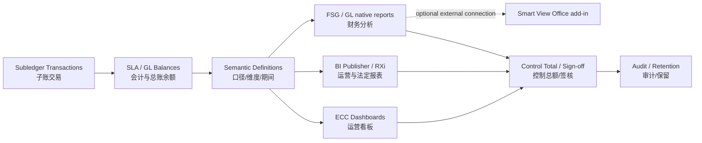
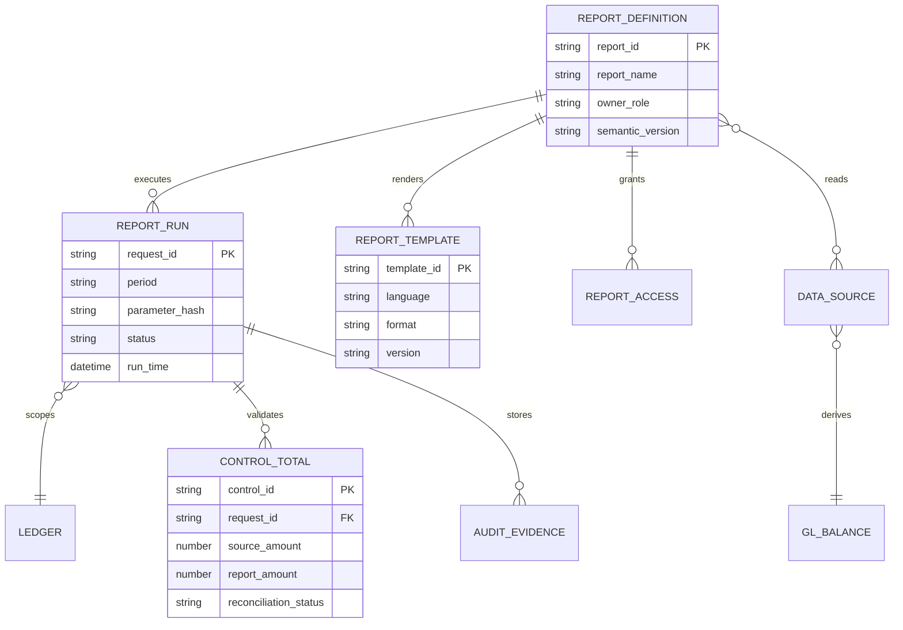
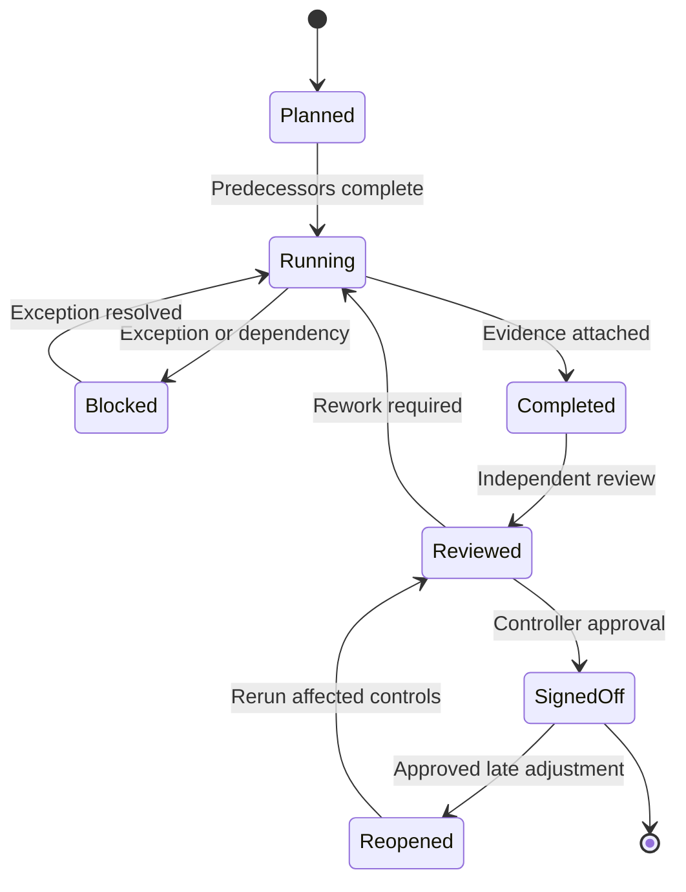

# 报表、关账与治理（Reporting and Governance）

> 报表不是项目末期的格式工作，而是会计口径、权限、数据血缘、关账证据和内控的最终呈现。本模块建立报表选型、治理和验证方法。

## 阅读导航

- [工具选型](#2-报表工具选型) · [报表治理](#3-报表治理最小模型) · [关账内控](#4-关账与对账治理) · [架构性能](#6-报表架构开发与性能) · [对账矩阵](#7-关账日历与对账设计) · [审计排错](#8-审计数据保留与隐私) · [验证练习](#10-验证清单) · [页面与关账实操](#13-资深顾问实操报表与关账)

## 模块数据字典与名词解释

本模块速查见[统一数据字典](data-dictionary.md#dict-08)。

## 模块业务架构与核心 ER 图

### 报表与治理业务架构图

### 报表治理核心 ER 图

报表定义、数据模型、模板、请求和控制总额应分别治理；这些名称是逻辑实体，不等同于所有 EBS 版本中的具体 FSG/BI Publisher/ECC 表。

## 1. 学习目标

应能根据实时性、数据粒度、交互方式、审计要求和用户规模选择 FSG、BI Publisher、RXi、Web ADI 或 Enterprise Command Center（企业指挥中心，ECC），并把 Smart View 作为需单独部署和授权的数据连接插件评估；能够建立报表目录、口径字典、访问控制、关账签核和变更治理。

## 2. 报表工具选型

| 工具 | 中文说明与适用场景 | 主要优点 | 主要控制点 |
| --- | --- | --- | --- |
| FSG | 财务报表生成器；基于 GL 余额的法定/管理报表 | 与 GL 维度紧密、口径稳定 | Row/Column Set、Content Set、期间和币种 |
| BI Publisher | BI 发布器；像素级模板、批量输出和分发 | 多数据源、多格式、调度 | Data Model、模板版本、数据权限、输出敏感性 |
| RXi | 可扩展报表交换；部分 EBS 标准报表布局 | 标准程序集成 | 属性集、版本和产品适用性 |
| Smart View（可选） | Office 插件；连接已部署的数据源进行分析和钻取 | 财务用户熟悉、交互强 | 不属于 EBS 原生报表；连接、成员选择、刷新口径和本地文件安全需单独治理 |
| Web ADI | Web 应用桌面集成器；Excel 上传/下载 | 受控批量录入 | Integrator、验证、上传权限和错误回滚 |
| ECC | 企业指挥中心；运营搜索和可视化 | 取决于数据加载计划的运营洞察 | Full/Incremental/Push 加载、补丁依赖、访问角色、索引新鲜度 |

工具选择先问：数据来自余额还是交易？需要实时还是批处理？是否需写回？是否含敏感明细？谁负责口径和签核？

## 3. 报表治理最小模型

每张关键报表应登记：业务名称、中英文名、用途、所有者、数据来源、过滤条件、维度口径、币种、期间、刷新频率、访问角色、模板版本、验证基准和保留期限。相似报表先比较口径再决定是否合并，不能只按名称去重。

### 3.1 数据血缘

关键财务数字至少能追溯：报表单元格 → GL 余额/日记账 → XLA 分录 → 来源交易。管理报表若使用数据仓库，还要记录抽取时间、转换规则和与 EBS 控制总额的对账。

### 3.2 口径控制

- 维度：Ledger、法人、平衡段、成本中心、产品、项目等。
- 时间：会计期间、交易日期、会计日期、截止时点。
- 币种：交易币、账簿币、报告币和汇率类型。
- 余额：期初、期间发生、期末；实际、预算、保留或统计余额。
- 范围：已过账/未过账、完成/未完成、有效/冲销交易。

## 4. 关账与对账治理

关账任务应有前置依赖、执行角色、计划时间、完成条件、证据、差异阈值和升级路径。签核不能只记录“已完成”，应附控制报表、参数、请求 ID、输出版本和例外批准。

对账采用三层结构：业务数量/金额控制总额；子账与 SLA 会计总额；SLA/子账与 GL 控制账户。差异必须落到业务键、期间和责任人。

## 5. 内控、审计与合规

### 5.1 职责分离与访问复核

定期复核用户、职责、菜单、请求组、配置文件和数据访问。高风险冲突包括主数据与付款、交易与审批、日记账与过账、开发与生产发布。紧急权限要限时、审批并复盘。

### 5.2 变更与证据

配置、报表模板、SQL、接口和补丁都应有需求、影响分析、测试、批准、迁移记录和回退方案。审计证据要可重复取得，保留参数与时间点，且遵守隐私与数据保留政策。

### 5.3 本地化和法定报告

Localizations（本地化）与 Regulatory Reporting（监管报告）依赖国家/地区、法人注册、税制、补丁和法定格式。项目必须以目标司法辖区和实例补丁为准，不能将其他国家模板直接复用。

## 6. 报表架构、开发与性能

### 6.1 分层设计

报表架构宜分为四层：**来源层**保存 EBS 交易和会计事实；**语义层**统一科目、组织、期间和状态口径；**展现层**负责 FSG、BI Publisher、Excel 或仪表板格式；**分发层**负责调度、Bursting（按规则拆分分发）、归档和访问。把复杂业务规则全部写进版式模板，会导致口径无法复用，也难以测试。

报表数据集至少保留业务主键和钻取字段。汇总报表要能下钻到明细，明细要能回到 EBS 页面或业务键；因隐私而隐藏字段时，仍需由授权支持人员完成追溯。

### 6.2 SQL 与容量

- SQL 先限定 Ledger、期间、组织和业务键，避免在大表上无界扫描。
- 报表查询优先使用稳定视图/数据模型，并记录来源表和连接逻辑。
- 批量报表控制并发、内存、输出大小和保留期限；敏感输出加访问与加密控制。
- BI Publisher 将数据模型与版式分离测试；大数据量使用分批或 bursting 前先验证容量。
- ECC 数据新鲜度由加载程序决定；页面数字与交易页面不一致时先核对最后加载时间。

性能验收不能只测单用户。应覆盖月末数据量、并发调度、最大输出、Bursting 收件人数量和归档空间；记录基准运行时间、峰值资源与可接受服务窗口。

## 7. 关账日历与对账设计

### 7.1 关账任务模型

每项任务登记 `task_id`、Ledger/OU、期间、前置任务、计划起止、实际起止、执行人、复核人、请求 ID、输出位置、状态和例外。状态至少区分 Not Started（未开始）、In Progress（进行中）、Blocked（受阻）、Completed（已完成）和 Completed with Exception（带例外完成）。

关账依赖通常按“来源接口 → 子账业务完成 → 子账会计 → 子账对账 → GL 导入/过账 → 重估/折算/合并 → 报表与签核”推进。可并行任务应在依赖图中明确，避免所有工作机械串行。

### 7.2 对账矩阵

| 对账 | 左侧证据 | 右侧证据 | 常见差异 |
| --- | --- | --- | --- |
| AP 负债 | AP Trial Balance | GL Liability | 未会计、未传输、手工 GL、期间错位 |
| AR 应收 | AR Trial Balance/Aging | GL Receivables | 未完成交易、核销截止、手工 GL |
| FA | Asset Cost/Reserve | GL Asset/Reserve | 未过账交易、折旧、账户或期间 |
| 库存/WIP | 价值报表 | GL Inventory/WIP | 未处理交易、成本更新、截止差异 |
| 现金 | CE 账面与银行对账 | GL Cash/Clearing | 在途、未清算、未会计或银行遗漏 |
| 税务 | 税务登记簿 | GL Tax Accounts | 税行状态、恢复比例、调整或期间 |

对账差异记录需包含期初差异、本期新增、本期解决、期末差异、账龄、金额、根因、所有者和预计解决日期。长期调节项必须升级，不能每月机械滚动。

## 8. 审计、数据保留与隐私

审计范围根据法规和风险确定，不应无差别开启所有表审计。对配置、供应商银行、用户权限、日记账、付款和关键报表模板等高风险对象，明确谁改了什么、何时修改、修改前后值和批准依据。

Data Retention（数据保留）策略同时覆盖数据库交易、并发输出、日志、接口文件、银行报文、报表归档和审计记录。保留期限取法定、税务、合同和诉讼保全要求的较严格者；到期清理应可审计，并使用 Oracle 支持的归档/清理能力。

非生产克隆后需要屏蔽个人、银行、税务和商业敏感信息，并禁用真实邮件、银行传输和外部服务。下载到 Excel/PDF 的报表也属于受控数据，访问控制不能止于 EBS 页面。

## 9. 常见问题诊断

| 现象 | 诊断顺序 |
| --- | --- |
| 报表与 GL 不一致 | Ledger/期间/币种、过账状态、余额类型、科目范围、刷新时间 |
| 同名报表数字不同 | 参数默认值、截止日期、数据源、模板/数据模型版本和权限 |
| BI Publisher 无输出或超时 | 请求日志、数据集行数、SQL 计划、模板、内存和输出格式 |
| FSG 行缺失 | Row Set、账户范围、显示选项、零余额、Content Set 和币种 |
| ECC 与交易页面不同 | 数据加载请求、最后加载时间、增量范围、访问角色和索引错误 |
| 用户看到越权数据 | 职责、数据访问集、MOAC、报表参数、数据模型过滤和分发列表 |

排错必须保留请求 ID、参数、模板/数据模型版本、输出样本、控制总额和正常对比样本。不要用修改报表 SQL 去掩盖来源数据或会计错误。

## 10. 验证清单

1. 与标准报表或经批准的 GL 余额建立控制总额。
2. 验证正常、零数据、负数、外币、跨期、冲销和权限边界。
3. 验证导出、调度、分发和不同模板格式。
4. 记录请求参数、版本、运行时间、行数和总额。
5. 验证用户只能看到授权 Ledger、OU、法人或敏感字段。

## 11. 建议练习

- 为资产负债表设计 FSG 行列集，并说明余额、币种与期间口径。
- 为 AP Aging 设计 BI Publisher 数据模型、模板、权限和控制总额。
- 建立一份“报表—来源—所有者—验证基准—访问角色”目录。
- 模拟月结差异，形成包含请求 ID、参数、数据证据和签核的审计包。
- 为六类控制账户建立对账矩阵和差异账龄看板。
- 评审一次非生产克隆，列出报表、日志和外发渠道的数据泄露风险。

## 12. 名词速查

- **FSG — Financial Statement Generator（财务报表生成器）**
- **RXi — Reports eXchange（可扩展报表交换）**
- **SoD — Segregation of Duties（职责分离）**
- **Data Lineage（数据血缘）**：数据从来源到报表的转换与追溯关系。
- **Control Total（控制总额）**：用于证明批次数量和金额完整性的独立汇总。

## 13. 资深顾问实操：报表与关账

### 13.1 关账治理状态图

带例外完成必须记录差异金额、风险、临时控制、所有者和解决日期。迟到调整导致重新开期时，只重跑受影响报表是不够的，还要重跑关联子账、对账、重估/折算和签核。

### 13.2 页面剧本：定义并运行 FSG

**常见职责与导航**：`General Ledger Super User → Reports（报表） → Define（定义） → Row Set/Column Set/Content Set/Report`；运行入口通常在 `Reports → Request → Financial`。

1. 先在报表口径文档定义 Ledger、期间、币种、余额类型、科目范围、符号和舍入。
2. 定义 Row Set：行号、说明、账户范围、计算行和显示格式。
3. 定义 Column Set：期间、金额类型、币种、预算/实际和计算列。
4. 需要按公司/成本中心拆分时定义 Content Set；需要排序/显示控制时配置 Row Order/Display Set。
5. 组合成 Financial Report，提交运行并记录参数和 Request ID。
6. 用 GL Trial Balance/Account Inquiry 验证关键行，测试零余额、负数、外币、调整期间和层级变更。

### 13.3 页面剧本：BI Publisher 报表变更

1. 确认 Data Definition/Data Model、Template、Language/Territory 和并发程序映射。
2. 在测试环境导出旧模板并纳入版本控制；数据模型与版式分别变更。
3. 使用小数据、月末最大数据、零数据、特殊字符、分页和多语言样本测试。
4. 验证 PDF/Excel/XML 输出、Bursting 分发、权限、敏感字段和文件大小。
5. 与批准的控制总额对账；由业务所有者确认格式和口径。
6. 按配置迁移工具/受控发布流程推广，生产运行后保存 Request ID、版本和输出校验。

### 13.4 页面剧本：月结签核

1. 在关账任务表检查每项前置任务、执行人、Request ID 和证据链接。
2. 对 AP、AR、FA、CE、Inventory/WIP、Projects、Tax 分别确认业务完成、SLA 和 GL 对账。
3. 检查 GL 未过账、Suspense、Intercompany、Revaluation、Translation 和 Consolidation。
4. 运行批准的报表集，锁定参数、模板版本和输出文件。
5. 对所有差异更新 Roll-forward：期初 + 新增 - 解决 = 期末。
6. Controller 独立复核后签核；开期/关期和迟到调整由不同角色批准。

### 13.5 报表变更影响矩阵

| 变更 | 必查对象 | 回归重点 |
| --- | --- | --- |
| 科目值/层级 | FSG、已连接的 Smart View 数据源、接口映射、预算 | 历史比较、父值汇总、权限 |
| Ledger/OU | Data Access Set、MOAC、报表参数 | 应见/不应见数据、默认值 |
| SLA 账户规则 | 子账报表、GL 控制账户、对账 | 新旧事件、冲销、跨期 |
| BI Publisher 模板 | Data Model、并发程序、Bursting | 多语言、分页、敏感分发 |
| 补丁/ECC | 数据加载、索引、Dashboard | 新鲜度、角色、性能、数字一致性 |

### 13.6 高级异常演练

- 报表在最后一分钟改变：冻结版本，比较数据模型/模板/参数，不覆盖已签核输出。
- 子账对账通过但 FSG 不符：核对余额类型、币种、Summary Account、Row/Content Set 和未过账日记账。
- ECC 与交易页面不符：先核对最后加载时间和增量请求，再检查安全与索引，不直接修改交易数据。
- 敏感报表误发：停止分发、保留审计证据、按事件响应处理，不通过删除日志掩盖事故。

## 11. 官方依据与边界

- [Oracle General Ledger User's Guide R12.2](https://docs.oracle.com/cd/E26401_01/doc.122/e48748/toc.htm)：FSG、余额和 GL 报表。
- [Oracle E-Business Suite Report Manager User's Guide R12.2](https://docs.oracle.com/cd/E26401_01/doc.122/e22006/toc.htm)：EBS 原生报表提交、查看和安全。
- [Oracle E-Business Suite Concepts — BI Publisher](https://docs.oracle.com/cd/E26401_01/doc.122/e22949/T120505T120508.htm)：BI Publisher 在 EBS 中的集成边界。
- [Oracle Enterprise Command Center Framework Administrator's Guide](https://docs.oracle.com/cd/E26401_01/doc.122/f34732/toc.htm)：数据加载和 ECC 管理。
- [Oracle Enterprise Command Center Framework Implementation Guide](https://docs.oracle.com/cd/E26401_01/doc.122/f21671/T673609T673614.htm)：Full/Incremental/Push 加载模式。

<!-- 兼容旧版目录与学习材料的定位锚点；正文已按主题重编。 -->

