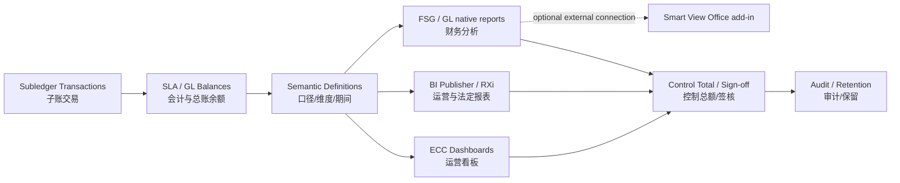
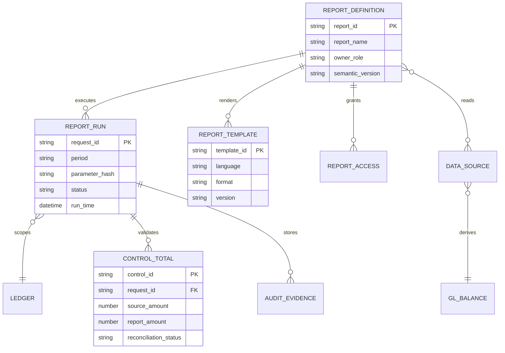
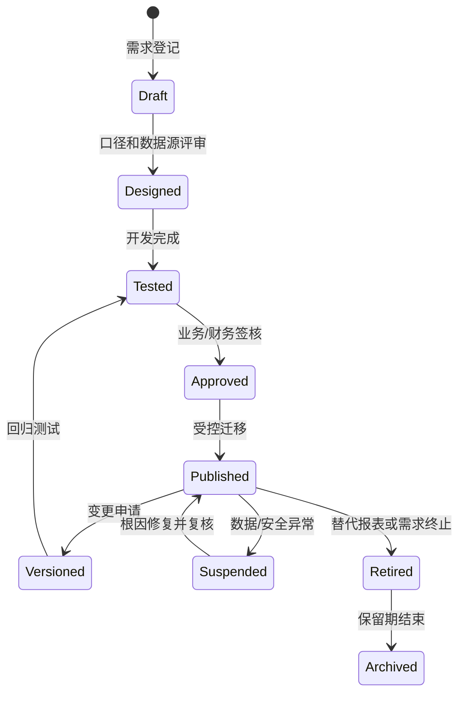
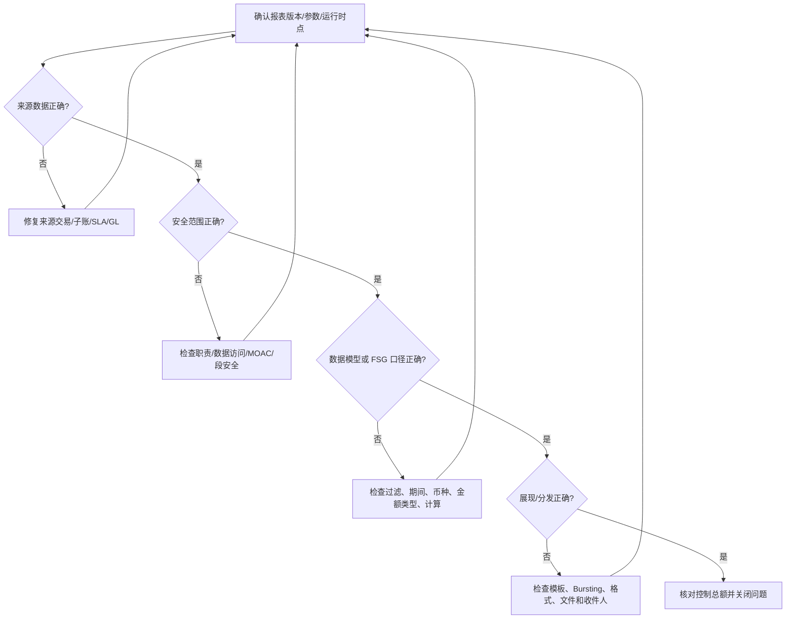
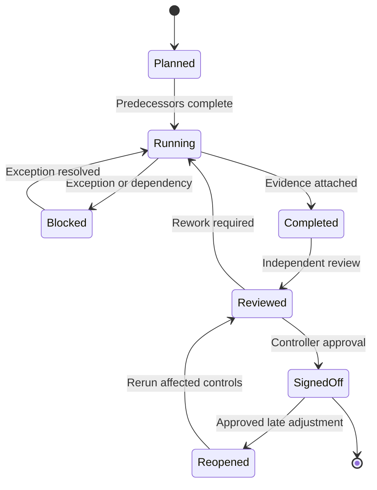

# 报表、关账与治理（Reporting and Governance）

> 报表不是项目末期的格式工作，而是会计口径、权限、数据血缘、关账证据和内控的最终呈现。本模块建立报表选型、治理和验证方法。

## 阅读导航

- [工具选型](#2-报表工具选型) · [报表治理](#3-报表治理最小模型) · [关账内控](#4-关账与对账治理) · [架构性能](#6-报表架构开发与性能) · [对账矩阵](#7-关账日历与对账设计) · [审计排错](#8-审计数据保留与隐私) · [验证练习](#10-验证清单) · [页面与关账实操](#13-资深顾问实操报表与关账)

## 模块数据字典与名词解释

本模块速查见[统一数据字典](data-dictionary.md#dict-08)。

## 模块业务架构与核心 ER 图

### 报表与治理业务架构图

### 报表治理核心 ER 图

报表定义、数据模型、模板、请求和控制总额应分别治理；这些名称是逻辑实体，不等同于所有 EBS 版本中的具体 FSG/BI Publisher/ECC 表。

## 1. 学习目标

应能根据实时性、数据粒度、交互方式、审计要求和用户规模选择 FSG、BI Publisher、RXi、Web ADI 或 Enterprise Command Center（企业指挥中心，ECC），并把 Smart View 作为需单独部署和授权的数据连接插件评估；能够建立报表目录、口径字典、访问控制、关账签核和变更治理。

## 2. 报表工具选型

| 工具 | 中文说明与适用场景 | 主要优点 | 主要控制点 |
| --- | --- | --- | --- |
| FSG | 财务报表生成器；基于 GL 余额的法定/管理报表 | 与 GL 维度紧密、口径稳定 | Row/Column Set、Content Set、期间和币种 |
| BI Publisher | BI 发布器；像素级模板、批量输出和分发 | 多数据源、多格式、调度 | Data Model、模板版本、数据权限、输出敏感性 |
| RXi | 可扩展报表交换；部分 EBS 标准报表布局 | 标准程序集成 | 属性集、版本和产品适用性 |
| Smart View（可选） | Office 插件；连接已部署的数据源进行分析和钻取 | 财务用户熟悉、交互强 | 不属于 EBS 原生报表；连接、成员选择、刷新口径和本地文件安全需单独治理 |
| Web ADI | Web 应用桌面集成器；Excel 上传/下载 | 受控批量录入 | Integrator、验证、上传权限和错误回滚 |
| ECC | 企业指挥中心；运营搜索和可视化 | 取决于数据加载计划的运营洞察 | Full/Incremental/Push 加载、补丁依赖、访问角色、索引新鲜度 |

工具选择先问：数据来自余额还是交易？需要实时还是批处理？是否需写回？是否含敏感明细？谁负责口径和签核？

### 2.1 按业务目的选型

| 报表类别 | 典型用户/时效 | 首选工具 | 权威数据源与控制 |
| --- | --- | --- | --- |
| 法定财务报表 | CFO/财务、月结/季结 | FSG 或 GL 标准报表；必要时用 BI Publisher 排版 | 已过账 GL 余额、Ledger、法定科目映射、版本锁定和控制总额 |
| 管理损益/经营分析 | 管理层、日/周/月 | FSG、Smart View 或受控 BI Publisher | GL 余额 + 批准的管理维度；定义预算、实际、同比和滚动期间 |
| 子账与对账报表 | 财务运营、日结/月结 | 子账标准报表、Account Analysis、BI Publisher | AP/AR/FA/CE/INV/WIP 子账、SLA、GL 控制账户和业务键 |
| 交易明细/运营清单 | 业务部门、近实时/批处理 | BI Publisher、标准报表或 ECC | 交易表/标准视图；保留状态、请求 ID、刷新时间和分页控制 |
| 预算、承诺和资金 | 预算负责人、月度/实时 | GL 预算/资金检查、FSG、Web ADI | Budget、Encumbrance、Funds Check 状态；禁止与 Actual 混列而不标识 |
| 交互式检索/异常看板 | 运营和支持、近实时 | ECC | 数据集、加载请求、索引新鲜度、职责和页面安全 |
| 受控批量上传 | 财务录入、月结 | Web ADI 或标准接口 | Integrator、Layout、值集校验、上传批次和错误回滚 |
| 临时分析 | 授权分析人员 | Smart View/受控导出 | 只读连接、刷新时间、成员选择和本地文件加密；结果不能替代签核报表 |

### 2.2 报表立项决策门

报表立项评审至少回答八个问题：

1. **权威性**：数字是以已过账 GL、SLA、子账还是运营交易为准；若允许未过账数据，必须在标题和过滤条件中明确。
2. **粒度**：只要余额、日记账行、子账事件还是业务单据明细；是否需要从单元格下钻到来源交易。
3. **期间**：运行期间、会计日期、交易日期、截止时点和调整期间是否一致；是否允许跨 Ledger Set。
4. **币种**：Entered、Ledger、Reporting、Statistical、Translated 还是固定报告币种；汇率类型和日期如何确定。
5. **安全**：按职责、Data Access Set、MOAC、Ledger、法人、OU、成本中心或敏感字段控制到哪一级。
6. **性能**：最大行数、并发用户、运行窗口、输出格式、Bursting 收件人和归档容量。
7. **责任**：业务所有者、数据所有者、技术维护者、运行人员、独立复核人和最终签核人分别是谁。
8. **生命周期**：如何测试、批准、发布、版本化、迁移、暂停、归档和退役；异常期间谁有权重跑或重开。

## 3. 报表治理最小模型

每张关键报表应登记：业务名称、中英文名、用途、所有者、数据来源、过滤条件、维度口径、币种、期间、刷新频率、访问角色、模板版本、验证基准和保留期限。相似报表先比较口径再决定是否合并，不能只按名称去重。

### 3.1 数据血缘

关键财务数字至少能追溯：报表单元格 → GL 余额/日记账 → XLA 分录 → 来源交易。管理报表若使用数据仓库，还要记录抽取时间、转换规则和与 EBS 控制总额的对账。

### 3.2 口径控制

- 维度：Ledger、法人、平衡段、成本中心、产品、项目等。
- 时间：会计期间、交易日期、会计日期、截止时点。
- 币种：交易币、账簿币、报告币和汇率类型。
- 余额：期初、期间发生、期末；实际、预算、保留或统计余额。
- 范围：已过账/未过账、完成/未完成、有效/冲销交易。

### 3.3 报表目录与生命周期

报表目录是治理入口，不只是文件名清单。每个条目至少包含 `report_id`、业务名称、中英文标题、报表类别、Owner、Data Steward、技术维护者、来源/目标表、参数定义、Ledger/OU 范围、币种和期间规则、刷新 SLA、输出格式、保留期限、访问角色、控制总额、版本和退役日期。

状态变更必须保留申请单、旧/新版本、测试证据、批准人、迁移请求和生效时间。相同数据源但不同口径的报表不能仅因名称相似而合并；相同口径的重复报表应指定一个主版本，其余设置别名或退役。

### 3.4 语义层与指标定义

| 指标/术语 | 正确口径 | 必须固定的参数 |
| --- | --- | --- |
| PTD | 运行期间从期间起始日至当前期间的发生额 | Ledger、期间、余额类型、是否含调整期 |
| QTD/YTD | 当前季度/年度累计发生额或余额 | 财务日历、年度起点、调整期间处理 |
| 期初/期末余额 | 期间开始/结束的 GL 余额；不是简单取报表运行日余额 | 期间状态、过账截止、年结/结转规则 |
| Actual | 已过账实际日记账或经批准的子账实际 | Journal Source/Category、Posting Status、冲销处理 |
| Budget/Encumbrance | 预算或承诺余额 | Budget Name、预算版本、Funds Check、是否含保留 |
| 变动/差异 | 当前值减基准值；百分比需明确分母为绝对值或基准值 | 比较期间、零值处理、四舍五入、符号规则 |
| 余额方向 | 借方、贷方或报表显示正负号 | Natural Account 类型、FSG Change Sign、格式掩码 |
| 组织汇总 | 平衡段/法人/成本中心等段的合计 | 段层级、父子值、跨 Ledger/OU 是否允许 |
| 报告币种 | Ledger Currency 或转换后的目标币种 | Conversion Rate Type、Rate Date、Translation/Reporting Currency |

定义必须用一个可复算的示例说明：输入账户、期间、金额类型、汇率、过滤条件、预期结果和舍入方式。展示层不得自行改变会计口径；需要例外时应在语义定义中注册而不是埋在模板表达式里。

### 3.5 控制总额与报表证据

控制总额至少分为四层：

1. **来源层**：接口/交易批次的行数、数量、Entered Amount 和来源系统总额。
2. **子账层**：AP/AR/FA/CE/INV/WIP 等子账的已完成事务、未完成事务和会计金额。
3. **SLA/GL 层**：XLA 借贷平衡、传送金额、GL Journal Import 和 Posting 总额。
4. **展现层**：报表行数、金额、币种、正负方向和过滤后的总计。

对账公式示例：`来源总额 - 子账总额 = 0`、`SLA 借方 - SLA 贷方 = 0`、`子账控制账户 - GL 控制账户 = 0`、`报表合计 - GL 查询合计 = 0`。允许差异时登记金额阈值、币种、舍入、账龄、根因、责任人和批准的临时控制，不能只写“系统舍入”。

报表证据包应包含参数快照、运行时间、Request ID、数据模型/模板/FSG 版本、控制总额、输出文件校验值、复核记录、差异说明和签核。相同报表重跑后若结果变化，应解释期间内新增过账、汇率、数据加载或权限变化。

## 4. 关账与对账治理

关账任务应有前置依赖、执行角色、计划时间、完成条件、证据、差异阈值和升级路径。签核不能只记录“已完成”，应附控制报表、参数、请求 ID、输出版本和例外批准。

对账采用三层结构：业务数量/金额控制总额；子账与 SLA 会计总额；SLA/子账与 GL 控制账户。差异必须落到业务键、期间和责任人。

### 4.1 关账依赖与门禁

每个门禁至少定义以下完成条件：

| 门禁 | 完成条件 | 例外处理 |
| --- | --- | --- |
| 来源截止 | PO/AR/FA/INV/WIP/CE/Projects/Tax 交易已导入，接口错误行有处置 | 记录批次、金额、预计解决时间和临时控制 |
| 子账完成 | 交易状态 Complete/Costed，未完成清单为零或有批准例外 | 不得用手工 GL 抵消未完成子账 |
| SLA 完成 | 事件已处理、借贷平衡、会计状态 Final，无错误 | 仅对失败事件按标准程序重处理 |
| GL 完成 | Journal Import 成功、批次已过账、Suspense/Invalid 账户已解释 | 过账失败批次单独隔离，不修改来源金额 |
| 对账完成 | 子账/控制账户/GL/报表四层控制总额一致 | 例外需账龄、责任人、复核和截止日期 |
| 签核完成 | 输出版本和参数锁定，复核人独立于制表人 | 迟到调整须定义重跑范围和重签机制 |

### 4.2 关账日历与运行批次

将月结拆成来源截止、子账关闭、SLA、GL、重估/折算、报表和签核批次；每批次登记开始/结束时间、并发请求、依赖关系、失败重跑范围和通知渠道。可并行的 AP/AR/FA/INV 任务应在依赖图中明确，避免因“默认串行”拉长窗口；涉及同一控制账户的任务仍须串行或加锁。

建议用批次控制表保存：`batch_id`、业务日期、会计期间、Ledger/OU、来源系统、输入行数/金额、输出事务数/金额、错误数、重跑次数、最后成功时间、操作人、复核人和附件位置。批次成功不能只看并发状态为 Normal，还要核对业务控制总额和 GL 过账结果。

### 4.3 迟到调整与重开期间

迟到发票、退货、汇率变化、资产折旧重算或子账补录可能改变已签核报表。处理流程应包括：识别影响期间和报表、冻结当前版本、评估是否重开、按受影响子账/控制账户重跑、生成新版本、更新差异说明并重新签核。禁止直接覆盖原 PDF 或删除旧请求；旧版本和新版本必须可比较。

## 5. 内控、审计与合规

### 5.1 职责分离与访问复核

定期复核用户、职责、菜单、请求组、配置文件和数据访问。高风险冲突包括主数据与付款、交易与审批、日记账与过账、开发与生产发布。紧急权限要限时、审批并复盘。

### 5.2 变更与证据

配置、报表模板、SQL、接口和补丁都应有需求、影响分析、测试、批准、迁移记录和回退方案。审计证据要可重复取得，保留参数与时间点，且遵守隐私与数据保留政策。

### 5.3 本地化和法定报告

Localizations（本地化）与 Regulatory Reporting（监管报告）依赖国家/地区、法人注册、税制、补丁和法定格式。项目必须以目标司法辖区和实例补丁为准，不能将其他国家模板直接复用。

### 5.4 报表职责与职责分离矩阵

| 角色 | 可以做什么 | 不应独立完成什么 | 交付证据 |
| --- | --- | --- | --- |
| Business Owner | 定义用途、口径、阈值和签核标准 | 不应直接修改生产 SQL/模板 | 需求、口径、验收签字 |
| Data Steward | 维护科目、组织、期间、币种和来源解释 | 不应批准自己维护的数据结果 | 数据字典、映射和质量报告 |
| Report Developer | 开发 SQL、数据模型、FSG 对象、模板和测试 | 不应同时执行生产发布和最终签核 | 版本、代码审查、测试输出 |
| Report Operator | 按批准参数提交、监控并归档请求 | 不应改变报表定义或绕过审批 | Request ID、日志、输出校验值 |
| Finance Reviewer | 对账、抽样、检查异常和控制总额 | 不应由制表人代替独立复核 | 复核清单、差异签注 |
| Controller/Approver | 批准报表、例外和迟到调整 | 不应直接维护技术对象 | 签核、例外批准、重跑决定 |
| System/Security Admin | 用户、职责、菜单、请求组和数据访问 | 不应审批业务金额或报表口径 | 权限变更、访问复核、审计日志 |

高风险组合包括“开发 + 生产发布”“制表 + 最终签核”“来源数据维护 + 对账复核”“用户授权 + 权限审批”。小团队无法完全分离时，需采用补偿控制，例如独立日志复核、只读生产权限和控制人抽样。

### 5.5 配置文件、职责和数据访问

报表安全是多层叠加：用户/职责决定菜单和请求组，Data Access Set 或 MOAC 决定 Ledger/OU/组织范围，FSG Segment Value Security 决定段值，数据模型 SQL/视图决定明细过滤，Bursting 收件人决定外发范围。任何一层放宽都可能造成越权，不能只测试页面是否可见。

权限验收应使用至少四个角色（制表、复核、运营、只读）和两个组织/法人，测试“应能看、应不能看、应能运行、应不能修改、应能下钻、应不能下载敏感字段”。定期回顾失效用户、临时职责、职责继承、请求集和数据访问集，删除不再需要的授权并保留复核记录。

## 6. 报表架构、开发与性能

### 6.1 分层设计

报表架构宜分为四层：**来源层**保存 EBS 交易和会计事实；**语义层**统一科目、组织、期间和状态口径；**展现层**负责 FSG、BI Publisher、Excel 或仪表板格式；**分发层**负责调度、Bursting（按规则拆分分发）、归档和访问。把复杂业务规则全部写进版式模板，会导致口径无法复用，也难以测试。

报表数据集至少保留业务主键和钻取字段。汇总报表要能下钻到明细，明细要能回到 EBS 页面或业务键；因隐私而隐藏字段时，仍需由授权支持人员完成追溯。

### 6.2 SQL 与容量

- SQL 先限定 Ledger、期间、组织和业务键，避免在大表上无界扫描。
- 报表查询优先使用稳定视图/数据模型，并记录来源表和连接逻辑。
- 批量报表控制并发、内存、输出大小和保留期限；敏感输出加访问与加密控制。
- BI Publisher 将数据模型与版式分离测试；大数据量使用分批或 bursting 前先验证容量。
- ECC 数据新鲜度由加载程序决定；页面数字与交易页面不一致时先核对最后加载时间。

性能验收不能只测单用户。应覆盖月末数据量、并发调度、最大输出、Bursting 收件人数量和归档空间；记录基准运行时间、峰值资源与可接受服务窗口。

### 6.3 报表对象与运行链

| 层/对象 | 主要职责 | 版本和依赖 |
| --- | --- | --- |
| FSG Row Set | 定义行序号、账户范围、显示类型、计算行和格式 | COA、Ledger/段值、Definition Access Set、FSG 安全配置 |
| FSG Column Set | 定义金额类型、期间偏移、币种、预算/实际、标题和计算列 | 会计日历、Balance Type、Currency Control Value |
| FSG Content Set/Row Order/Display Set | 按段值拆分、排序、显示或隐藏行列 | 段层级、权限和输出格式 |
| FSG Report/Report Set | 组合 Row/Column Set 并批量运行多个报表 | 运行期间、Ledger/Ledger Set、请求参数和调度 |
| Concurrent Program/SRS | 注册参数、执行文件、可执行方式和请求组 | 应用、职责、参数值集、并发管理器 |
| BI Publisher Data Definition/Data Model | 生成 XML/数据集、参数、SQL、事件触发和数据权限 | Concurrent Program/Web Service、数据源、版本 |
| BI Publisher Template | 将 XML 数据渲染为 RTF/PDF/XSL/Excel 等输出 | Data Definition、语言/地区、分页、Bursting |
| Web ADI Integrator/Layout | 定义 Excel 下载/上传字段、默认值、值集和校验 | Desktop Integration Framework、职责和上传权限 |
| ECC Data Set/Page/Region | 将业务数据索引为搜索、指标、图表和动作 | Full/Incremental/Push 加载、索引、角色和补丁 |
| Report Manager/请求输出 | 统一提交、监控、查看和下载标准/自定义报表 | FND 并发请求、请求组、输出保留和访问控制 |

标准链路是“来源交易/余额 → 数据模型或标准视图 → 参数与安全过滤 → 并发请求/加载 → 模板或页面渲染 → 输出/分发 → 控制总额与归档”。自定义报表应优先接入 SRS/Report Manager，保留请求日志和标准监控能力，而不是绕过 EBS 直接访问数据库后自行发送文件。

### 6.4 接口、下钻与数据血缘实现

| 需求 | 推荐实现 | 需要记录的键 |
| --- | --- | --- |
| GL 余额到日记账 | FSG/Account Inquiry 标准下钻或 GL 余额/日记账视图 | Ledger、CCID、期间、Journal Header/Line |
| SLA 到来源交易 | XLA 下钻、子账标准报表或受控 BI Publisher 数据模型 | `AE_HEADER_ID`、`AE_LINE_NUM`、`EVENT_ID`、来源主键 |
| 交易明细到报表 | BI Publisher 数据模型/标准报表；保留业务主键 | 业务单据、行号、组织、状态、会计日期 |
| 批量报表到外部系统 | SRS/BI Publisher 输出、受控文件传输或 API | Request ID、文件名、校验值、传输批次、接收确认 |
| 外部系统写回 | Web ADI、标准 Open Interface、公开 API 或受支持 Web Service | 外部唯一键、EBS 主键、处理状态、错误码和重试次数 |
| ECC 看板 | 标准数据集加载或扩展框架 | Load Request、数据集、抽取时点、最后成功水位 |

每个数据集都应有“来源字段 → 转换规则 → 输出字段 → 控制总额 → 下钻链接”的映射。若 SQL 需要自定义换算、过滤或汇总，必须在数据模型说明中写出公式和例外；不要在 RTF/XSL 模板中隐藏关键业务逻辑。直接查询 `GL_*`、`XLA_*` 或子账表时，应使用最小权限、只读账号和参数化过滤。

对需要近实时看板的场景，可评估 ECC Push Load：由交易完成后触发异步 HTTP POST，将指定 `ECC_SPEC_ID` 记录推送到数据集；官方 ECC Client Java API 支持 `INSERT`、`UPDATE`、`DELETE`、`UPSERT`、`REPLACE` 等操作。实现必须保存 `externalRequestId`、数据集键、操作类型、批次大小和返回的 Job ID，并通过加载状态接口确认成功；超时重试前先按业务键查询，避免重复索引。Push、Full、Incremental 的可用性及 API 包版本需以目标 ECC Framework 补丁和官方扩展指南为准。

### 6.5 调度、并发与容量控制

按优先级建立请求组：在线查询、日批、月结批、监管报表和后台加载分开配置。依赖关系用 Request Set、调度链或外部编排登记；后置任务只能在前置请求 Normal 且控制总额通过后执行。对同一 Ledger/期间的重估、折算、合并和签核报表设置互斥窗口。

容量基线至少包括：最大明细行数、单次输出 MB、并发请求数、Bursting 收件人数、数据库执行时间、应用层内存、临时空间和归档增长。超时处理应先拆分组织/期间/科目、优化数据集和索引，再考虑提高并发或延长超时；不可通过无限重试掩盖全表扫描。

### 6.6 输出、分发与归档

输出分为交互查看、内部共享、法定归档和外部发送四类。每类指定格式、加密、命名、收件人白名单、传输渠道、下载权限、校验值、保留期限和销毁方式。Bursted 报表按组织/法人分发时，分割键必须与安全规则一致，并用测试收件箱验证“不该收到的数据不会出现”。

## 7. 关账日历与对账设计

### 7.1 关账任务模型

每项任务登记 `task_id`、Ledger/OU、期间、前置任务、计划起止、实际起止、执行人、复核人、请求 ID、输出位置、状态和例外。状态至少区分 Not Started（未开始）、In Progress（进行中）、Blocked（受阻）、Completed（已完成）和 Completed with Exception（带例外完成）。

关账依赖通常按“来源接口 → 子账业务完成 → 子账会计 → 子账对账 → GL 导入/过账 → 重估/折算/合并 → 报表与签核”推进。可并行任务应在依赖图中明确，避免所有工作机械串行。

### 7.2 对账矩阵

| 对账 | 左侧证据 | 右侧证据 | 常见差异 |
| --- | --- | --- | --- |
| AP 负债 | AP Trial Balance | GL Liability | 未会计、未传输、手工 GL、期间错位 |
| AR 应收 | AR Trial Balance/Aging | GL Receivables | 未完成交易、核销截止、手工 GL |
| FA | Asset Cost/Reserve | GL Asset/Reserve | 未过账交易、折旧、账户或期间 |
| 库存/WIP | 价值报表 | GL Inventory/WIP | 未处理交易、成本更新、截止差异 |
| 现金 | CE 账面与银行对账 | GL Cash/Clearing | 在途、未清算、未会计或银行遗漏 |
| 税务 | 税务登记簿 | GL Tax Accounts | 税行状态、恢复比例、调整或期间 |

对账差异记录需包含期初差异、本期新增、本期解决、期末差异、账龄、金额、根因、所有者和预计解决日期。长期调节项必须升级，不能每月机械滚动。

### 7.3 对账控制公式与抽样

| 控制点 | 建议公式 | 抽样/佐证 |
| --- | --- | --- |
| 批次完整性 | 输入行数/金额 − 成功行数/金额 − 失败行数/金额 = 0 | 批次控制表、接口错误报告、重跑清单 |
| 子账借贷平衡 | 子账借方 − 子账贷方 = 0 | SLA 日记账头/行、事件状态、会计日期 |
| AP/AR/FA/INV/CE 控制账户 | 子账余额 − GL 控制账户余额 = 0（允许登记的舍入例外除外） | Trial Balance、Account Analysis、GL 余额和过账状态 |
| 报表总额 | 报表合计 − 独立 GL/子账查询合计 = 0 | 相同参数、币种、期间、输出版本和校验值 |
| 期间滚动 | 期初 + 本期发生 − 期末 = 0 | 上期签核输出、本期明细、年结/结转日志 |
| 分发完整性 | 应收件数 − 成功发送件数 − 失败件数 = 0 | Burst 日志、收件确认、失败重发记录 |

抽样同时覆盖大额、零值、负值、外币、调整期间、冲销、跨组织、权限边界和人工调整。独立复核人应能用不同查询或标准报表重算关键总额，而不是只检查模板外观。

### 7.4 差异阈值和升级

差异阈值同时按绝对金额、相对比例、账龄和风险等级设定。例如，小额四舍五入可自动关闭；超过金额阈值、连续三期未解决、涉及法定账户或敏感数据的差异必须升级到 Controller/财务主管。阈值版本、批准人和生效期间纳入治理，不应写死在不可追踪的 SQL 条件中。

## 8. 审计、数据保留与隐私

审计范围根据法规和风险确定，不应无差别开启所有表审计。对配置、供应商银行、用户权限、日记账、付款和关键报表模板等高风险对象，明确谁改了什么、何时修改、修改前后值和批准依据。

Data Retention（数据保留）策略同时覆盖数据库交易、并发输出、日志、接口文件、银行报文、报表归档和审计记录。保留期限取法定、税务、合同和诉讼保全要求的较严格者；到期清理应可审计，并使用 Oracle 支持的归档/清理能力。

非生产克隆后需要屏蔽个人、银行、税务和商业敏感信息，并禁用真实邮件、银行传输和外部服务。下载到 Excel/PDF 的报表也属于受控数据，访问控制不能止于 EBS 页面。

### 8.1 审计对象与证据字段

| 审计对象 | 重点字段/动作 | 频率与证据 |
| --- | --- | --- |
| FSG 定义 | Row/Column/Content Set、Report、Report Set、Segment Security、Access Set | 每次变更；保留旧/新定义、对象 Owner、批准和迁移请求 |
| BI Publisher | Data Definition/Data Model、Template、参数、语言、Bursting、数据源 | 每次发布；保留模板文件校验值、版本、测试输出和审批 |
| ECC | Data Set、Page/Region、加载模式、索引、Personalization、角色 | 发布/补丁/加载异常；保留 Load Request、版本和诊断日志 |
| 并发处理 | 程序、参数、请求组、调度、输出访问、重跑/取消 | 日批/月批；保留 Request ID、日志、输出和操作人 |
| 权限 | User、Responsibility、Menu、Data Access Set、MOAC、临时职责 | 定期复核和离职事件；保留授权单、复核结果和回收记录 |
| 数据与会计 | GL/SLA/子账、手工日记账、冲销、汇率、期间开关 | 月结/季度；保留控制总额、下钻样本和签核 |

审计日志应覆盖“谁、何时、从哪里、改了什么、改前值、改后值、原因、批准人、请求 ID”。日志的读取权限也要受控；排错时可提供脱敏副本，不能为方便而关闭审计或清除失败记录。

### 8.2 数据分类与外发控制

建议至少分为公开、内部、机密、严格受限四级。供应商银行账号、员工薪酬、客户税号、未披露财务结果、付款文件和法定申报底稿通常属于机密或严格受限。每个报表目录条目记录分类、允许输出格式、收件人、加密方式、跨境限制、下载期限和销毁责任。

邮件、SFTP、文件共享、BI Publisher Bursting、Smart View 下载和 ECC 导出都属于外发渠道，应有白名单、传输加密、到达确认和撤回/事件响应方案。测试环境不得使用真实收件人、生产 SMTP、银行端点或真实税务数据。

### 8.3 备份、归档与恢复演练

报表归档至少保留“定义/数据模型/模板版本 + 参数 + 原始输出 + 控制总额 + 签核”，不能只存 PDF。按法定期限、税务期限、合同期限和诉讼保全要求取较长者，并区分在线可查、离线归档和到期销毁。

每年至少演练一次从归档中恢复一份法定报表：验证文件完整性、版本、参数、数据源快照、权限和可读性。数据库清理、并发输出清理和 ECC 加载日志清理都应使用 Oracle 支持的程序，并先做备份和抽样恢复验证。

## 9. 常见问题诊断

| 现象 | 诊断顺序 |
| --- | --- |
| 报表与 GL 不一致 | Ledger/期间/币种、过账状态、余额类型、科目范围、刷新时间 |
| 同名报表数字不同 | 参数默认值、截止日期、数据源、模板/数据模型版本和权限 |
| BI Publisher 无输出或超时 | 请求日志、数据集行数、SQL 计划、模板、内存和输出格式 |
| FSG 行缺失 | Row Set、账户范围、显示选项、零余额、Content Set 和币种 |
| ECC 与交易页面不同 | 数据加载请求、最后加载时间、增量范围、访问角色和索引错误 |
| 用户看到越权数据 | 职责、数据访问集、MOAC、报表参数、数据模型过滤和分发列表 |
| 报表显示旧数据 | 来源事务是否已完成、SLA/GL 是否过账、数据模型缓存、ECC 最后加载水位 |
| FSG 总额与明细不平 | Row/Column Calculation、Expand/Total/Both、父子段值、Change Sign 和舍入 |
| FSG 多 Ledger 结果异常 | Ledger Set、Reporting Currency、余额类型、段覆盖和定义访问集 |
| BI Publisher 分发错误 | Bursting 查询、分割键、收件人映射、语言/地区和安全上下文 |
| Web ADI 上传部分成功 | Integrator/Layout、值集校验、批次控制总额、接口状态和错误行 |
| Smart View 刷新差异 | 连接环境、POV/成员选择、刷新时间、报告币种和本地缓存 |
| 并发请求排队 | 请求组、Manager、优先级、互斥程序、参数范围和应用服务器容量 |
| 归档文件不可读 | 文件校验值、模板/字体、权限、加密密钥和保留介质 |
| 报表被未授权修改 | 对象 Owner、Definition Access Set、版本库、迁移日志和审计记录 |

排错必须保留请求 ID、参数、模板/数据模型版本、输出样本、控制总额和正常对比样本。不要用修改报表 SQL 去掩盖来源数据或会计错误。

### 9.1 分层排错路径

每一步只修复对应层：来源错误回到业务或子账流程，数据模型错误回到 SQL/参数，模板错误回到展现层，权限错误回到职责/数据访问。修复后必须用相同参数重跑，并确认原问题关闭而没有引入越权或总额差异。

## 10. 验证清单

1. 与标准报表或经批准的 GL 余额建立控制总额。
2. 验证正常、零数据、负数、外币、跨期、冲销和权限边界。
3. 验证导出、调度、分发和不同模板格式。
4. 记录请求参数、版本、运行时间、行数和总额。
5. 验证用户只能看到授权 Ledger、OU、法人或敏感字段。

### 10.1 功能与控制验收矩阵

| 编号 | 场景 | 必测变体 | 通过标准 |
| --- | --- | --- | --- |
| RPT-01 | FSG 财务报表 | PTD/QTD/YTD、Actual/Budget、Ledger Set、Content Set | 行列金额与 GL 查询一致，公式、符号和期间偏移正确 |
| RPT-02 | FSG 安全 | 不同职责、段值安全、Definition Access Set、无数据用户 | 只能运行/查看/修改授权对象和段值，越权请求被拒绝 |
| RPT-03 | BI Publisher | RTF/PDF/Excel/XML、多语言、零数据、大数据、分页 | 数据模型结果不变，模板格式、总额和敏感字段正确 |
| RPT-04 | BI Publisher 分发 | Bursting 分割键、收件人白名单、失败重发 | 每个收件人只收到授权范围，成功/失败件数可对账 |
| RPT-05 | Web ADI | 值集、必填、重复键、部分失败、重试 | 错误行可定位，成功行不重复，批次输入/输出总额平衡 |
| RPT-06 | ECC | Full/Incremental/Push、加载失败、索引新鲜度、角色 | 页面数据与来源控制总额一致，加载状态和最后成功水位可见 |
| RPT-07 | 关账报表 | 子账、SLA、GL、重估/折算、调整期间 | 门禁项、差异、签核和版本均可追溯 |
| RPT-08 | 性能容量 | 月末数据量、并发请求、最大输出、归档恢复 | 在批准服务窗口内完成，无全表扫描/内存溢出/丢文件 |
| RPT-09 | 审计隐私 | 配置变更、权限变更、脱敏克隆、误发事件 | 记录前后值和操作人，非生产无真实外发，事件可响应 |

### 10.2 发布前检查

- 口径文档、数据字典、对象 Owner、访问角色和控制总额已更新。
- SQL/数据模型通过代码审查，参数有默认值、值集和最大范围；没有未授权动态 SQL 或硬编码账号。
- FSG/BI Publisher/ECC/Web ADI 对象已在测试环境验证，模板和定义版本可回退。
- 并发程序、请求组、调度和分发收件人已由运行人员演练；日志、输出、校验值和归档位置已确认。
- 业务 Owner 和独立 Reviewer 已签字；生产迁移、监控、告警和回退窗口已安排。

## 11. 建议练习

- 为资产负债表设计 FSG 行列集，并说明余额、币种与期间口径。
- 为 AP Aging 设计 BI Publisher 数据模型、模板、权限和控制总额。
- 建立一份“报表—来源—所有者—验证基准—访问角色”目录。
- 模拟月结差异，形成包含请求 ID、参数、数据证据和签核的审计包。
- 为六类控制账户建立对账矩阵和差异账龄看板。
- 评审一次非生产克隆，列出报表、日志和外发渠道的数据泄露风险。

## 12. 名词速查

- **FSG — Financial Statement Generator（财务报表生成器）**
- **RXi — Reports eXchange（可扩展报表交换）**
- **SoD — Segregation of Duties（职责分离）**
- **Data Lineage（数据血缘）**：数据从来源到报表的转换与追溯关系。
- **Control Total（控制总额）**：用于证明批次数量和金额完整性的独立汇总。
- **Row Set（行集）**：FSG 报表行定义的可复用集合，包含账户范围、显示类型和计算。
- **Column Set（列集）**：FSG 报表列定义的可复用集合，包含金额类型、期间偏移和币种。
- **Content Set（内容集）**：按一个或多个账户段值拆分同一 FSG 报表输出的规则。
- **Amount Type（金额类型）**：PTD/QTD/YTD、Actual/Budget/Encumbrance 等余额取数方式。
- **Period of Interest（POI）**：FSG 运行时的关注期间；期间偏移以该期间为基准。
- **Constant Period of Interest（CPOI）**：固定引用某期间，不随每次运行期间改变。
- **Segment Override（段覆盖）**：运行时或报表定义覆盖某账户段范围的过滤条件。
- **Definition Access Set（定义访问集）**：控制 FSG 对象可 Use、View 或 Modify 的权限。
- **Data Access Set（数据访问集）**：限制用户可访问的 Ledger、平衡段或管理账簿数据。
- **MOAC — Multi-Org Access Control**：按职责/安全配置控制多个 Operating Unit 数据访问。
- **SRS — Standard Request Submission**：统一提交、监控和查看 EBS 并发程序的框架。
- **Concurrent Program/Request**：注册的执行程序与一次带参数的运行实例。
- **Request Set**：按顺序或条件组合多个并发请求的批处理定义。
- **BI Publisher Data Definition/Data Model**：生成 XML/数据集并定义参数、SQL 和数据权限。
- **BI Publisher Template**：将 XML 数据渲染为 RTF、PDF、XSL、Excel 等输出的版式。
- **Bursting**：按分割键把一个数据集拆成多个文件并按收件人规则分发。
- **Web ADI Integrator/Layout**：定义 Excel 下载/上传字段、值集、默认值和校验的元数据。
- **ECC Data Set/Page/Region**：ECC 的索引数据、页面和可视化区域逻辑对象。
- **Full/Incremental/Push Load**：ECC 全量、增量和推送加载模式；新鲜度和性能不同。
- **Drilldown**：从报表单元格/余额下钻到日记账、SLA、子账或业务单据的链路。
- **Report Catalog**：报表名称、用途、Owner、来源、参数、版本、权限和保留期登记册。
- **Semantic Definition**：指标、期间、币种、维度、过滤和计算的业务口径定义。
- **Report Version**：数据模型、模板、FSG 对象、SQL 和参数共同组成的可追踪版本。
- **Reconciliation**：用独立控制总额证明来源、子账、SLA、GL 和报表之间的一致性。
- **Exception / Compensating Control**：批准的差异及其临时控制、责任人和解决期限。
- **Audit Trail**：记录用户、时间、前后值、原因、请求和批准关系的审计证据。
- **Retention**：按法规、税务、合同和诉讼保全要求保留定义、输出、日志和签核。

## 13. 资深顾问实操：报表与关账

### 13.1 关账治理状态图

带例外完成必须记录差异金额、风险、临时控制、所有者和解决日期。迟到调整导致重新开期时，只重跑受影响报表是不够的，还要重跑关联子账、对账、重估/折算和签核。

### 13.2 页面剧本：定义并运行 FSG

**常见职责与导航**：`General Ledger Super User → Reports（报表） → Define（定义） → Row Set/Column Set/Content Set/Report`；运行入口通常在 `Reports → Request → Financial`。

1. 先在报表口径文档定义 Ledger、期间、币种、余额类型、科目范围、符号和舍入。
2. 定义 Row Set：行号、说明、账户范围、计算行和显示格式。
3. 定义 Column Set：期间、金额类型、币种、预算/实际和计算列。
4. 需要按公司/成本中心拆分时定义 Content Set；需要排序/显示控制时配置 Row Order/Display Set。
5. 组合成 Financial Report，提交运行并记录参数和 Request ID。
6. 用 GL Trial Balance/Account Inquiry 验证关键行，测试零余额、负数、外币、调整期间和层级变更。

### 13.3 页面剧本：BI Publisher 报表变更

1. 确认 Data Definition/Data Model、Template、Language/Territory 和并发程序映射。
2. 在测试环境导出旧模板并纳入版本控制；数据模型与版式分别变更。
3. 使用小数据、月末最大数据、零数据、特殊字符、分页和多语言样本测试。
4. 验证 PDF/Excel/XML 输出、Bursting 分发、权限、敏感字段和文件大小。
5. 与批准的控制总额对账；由业务所有者确认格式和口径。
6. 按配置迁移工具/受控发布流程推广，生产运行后保存 Request ID、版本和输出校验。

### 13.4 页面剧本：月结签核

1. 在关账任务表检查每项前置任务、执行人、Request ID 和证据链接。
2. 对 AP、AR、FA、CE、Inventory/WIP、Projects、Tax 分别确认业务完成、SLA 和 GL 对账。
3. 检查 GL 未过账、Suspense、Intercompany、Revaluation、Translation 和 Consolidation。
4. 运行批准的报表集，锁定参数、模板版本和输出文件。
5. 对所有差异更新 Roll-forward：期初 + 新增 - 解决 = 期末。
6. Controller 独立复核后签核；开期/关期和迟到调整由不同角色批准。

### 13.5 报表变更影响矩阵

| 变更 | 必查对象 | 回归重点 |
| --- | --- | --- |
| 科目值/层级 | FSG、已连接的 Smart View 数据源、接口映射、预算 | 历史比较、父值汇总、权限 |
| Ledger/OU | Data Access Set、MOAC、报表参数 | 应见/不应见数据、默认值 |
| SLA 账户规则 | 子账报表、GL 控制账户、对账 | 新旧事件、冲销、跨期 |
| BI Publisher 模板 | Data Model、并发程序、Bursting | 多语言、分页、敏感分发 |
| 补丁/ECC | 数据加载、索引、Dashboard | 新鲜度、角色、性能、数字一致性 |

### 13.6 高级异常演练

- 报表在最后一分钟改变：冻结版本，比较数据模型/模板/参数，不覆盖已签核输出。
- 子账对账通过但 FSG 不符：核对余额类型、币种、Summary Account、Row/Content Set 和未过账日记账。
- ECC 与交易页面不符：先核对最后加载时间和增量请求，再检查安全与索引，不直接修改交易数据。
- 敏感报表误发：停止分发、保留审计证据、按事件响应处理，不通过删除日志掩盖事故。

### 13.7 页面剧本：BI Publisher 数据模型与模板

1. 在 Report Manager/BI Publisher 中确认 Data Definition 或 Data Model、数据源、参数、语言/地区和目标并发程序。
2. 先用 SQL/数据模型输出 XML 或结构化数据，验证字段、行数、总额、币种和安全上下文；不要先在模板里硬编码合计。
3. 上传新模板前保存旧模板、版本号、校验值和回退文件；分别测试 RTF/PDF/Excel/XML 的分页、格式掩码、负数、零数据和特殊字符。
4. 如使用 Bursting，明确分割键、收件人映射、文件命名、语言和组织过滤；使用测试邮箱确认没有跨法人/跨 OU 数据。
5. 通过 SRS 提交并记录 Request ID、参数、Data Model/Template 版本和输出校验值，与批准的控制总额对账。
6. 业务 Owner 和独立 Reviewer 完成签核后再迁移生产；生产首跑保留日志、输出和回退窗口。

### 13.8 页面剧本：ECC 数据加载与看板验证

1. 确认 ECC Page/Region/Data Set、安装补丁、职责角色和来源组织/期间范围。
2. 选择 Full、Incremental 或 Push 加载模式；保存 Load Request、批次水位、开始/结束时间和错误数。
3. 检查数据加载跟踪、索引状态、最后成功时间和失败明细；失败时按数据集/批次重跑，不盲目全量重复。
4. 用来源标准报表或受控 SQL 抽样比较记录数、金额、状态和关键维度；核对页面筛选、钻取和动作权限。
5. 验证不同职责只能查看授权页面和数据，确认增量水位覆盖迟到/更正事务，不产生重复索引记录。

### 13.9 页面剧本：Web ADI 受控上传

1. 选择批准的 Integrator 和 Layout，核对字段顺序、默认值、值集、必填规则、职责和上传目标。
2. 下载模板时记录用户、环境、Ledger/OU、模板版本和下载时间；禁止复制未脱敏的生产文件到测试环境。
3. 先在 Excel 中执行值列表和本地校验，再提交小批量；保存输入行数、借贷金额、来源唯一键和批次号。
4. 检查返回的错误行、接口状态和并发请求；只修正失败行，确认成功行不会因重试重复创建日记账或事务。
5. 上传完成后核对 GL_INTERFACE/标准请求、Journal Import、过账和控制总额；保留文件、日志、请求 ID 和复核记录。

### 13.10 页面剧本：GL 账户查询与下钻

1. 选择 Ledger/Ledger Set、期间、币种、余额类型、科目段和过账状态；记录所有筛选条件。
2. 从余额查询到日记账批次/行，再通过 SLA 或子账下钻到来源交易；抽取借贷、币种、汇率、会计日期和来源。
3. 比较标准 Trial Balance、FSG 和管理报表的同口径合计；若不一致，先判断是过账截止、过滤、币种还是报表缓存。
4. 对调整、冲销、Suspense、跨期间和手工日记账保留业务说明、批准和重跑影响范围。

### 13.11 页面剧本：审计包与报表归档

1. 建立期间目录：需求/口径、数据字典、配置/模板、测试、运行参数、请求日志、输出、控制总额、差异和签核。
2. 为每个输出保存文件校验值、生成时间、Request ID、数据模型/FSG/模板版本和适用 Ledger/期间。
3. 对压缩包和脱敏副本设置访问期限、加密和下载日志；审计抽样时可复现相同查询和版本。
4. 期间结束后将工作目录转为只读；任何重跑或迟到调整建立新版本并链接旧版本，不覆盖原始签核文件。

### 13.12 页面剧本：报表退役与替代

1. 在报表目录标记退役候选，列出使用者、调度、下游接口、Smart View 连接、审计引用和替代报表。
2. 业务 Owner 比较新旧口径、历史可比性、控制总额和权限；确认替代报表已通过完整回归测试。
3. 停止新调度和外发，保留定义、模板、最后输出和保留期；保留别名或重定向说明，避免用户误用旧版本。
4. 仅在保留期和审计要求满足后清理对象/输出，并记录清理程序、批准和恢复方式。

## 14. 官方依据与边界

- [Oracle General Ledger User's Guide R12.2](https://docs.oracle.com/cd/E26401_01/doc.122/e48748/toc.htm)：FSG、余额和 GL 报表。
- [Oracle General Ledger — Financial Reporting and FSG](https://docs.oracle.com/cd/E26401_01/doc.122/e48748/T312864T313620.htm)：FSG 行/列/内容集、金额类型、期间偏移、段值安全、报表集和调度。
- [Oracle E-Business Suite Report Manager User's Guide R12.2](https://docs.oracle.com/cd/E26401_01/doc.122/e22006/toc.htm)：EBS 原生报表提交、查看和安全。
- [Oracle E-Business Suite Concepts — Web ADI and BI Publisher](https://docs.oracle.com/cd/E26401_01/doc.122/e22949/T120505T120508.htm)：SRS、职责安全、Web ADI Integrator/Layout、BI Publisher 数据定义与模板，以及 EBS 集成边界。
- [Oracle Enterprise Command Center Framework Administrator's Guide](https://docs.oracle.com/cd/E26401_01/doc.122/f34732/toc.htm)：数据加载和 ECC 管理。
- [Oracle Enterprise Command Center Framework Implementation Guide](https://docs.oracle.com/cd/E26401_01/doc.122/f21671/T673609T673614.htm)：Full/Incremental/Push 加载模式、数据集和扩展框架。
- [Oracle ECC Push Load and Java API](https://docs.oracle.com/cd/E26401_01/doc.122/f21671/T673609T676700.htm)：异步 Push Load、记录操作类型、批次和加载状态查询。

以上链接是 Oracle E-Business Suite R12.2 官方基线；具体导航、并发程序、状态码、补丁能力、法定模板和可用安全功能必须以目标实例的产品安装、责任配置、eTRM、Lookup、Oracle Support 说明和当地法规为准。本文的分录、SQL、参数和阈值示例用于实施讨论，不替代实例验证或财务政策。

<!-- 兼容旧版目录与学习材料的定位锚点；正文已按主题重编。 -->

