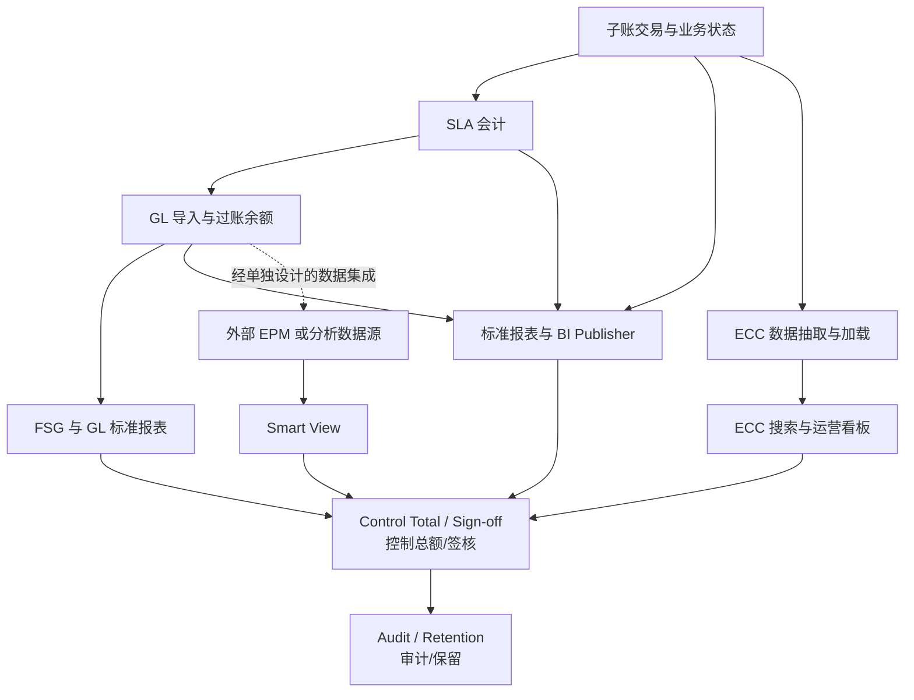
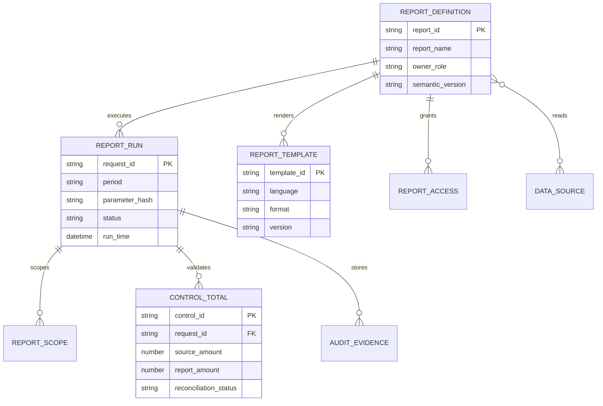
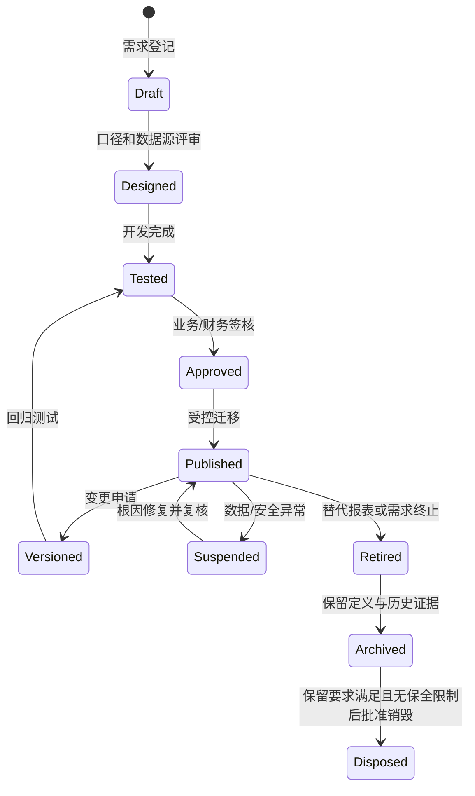
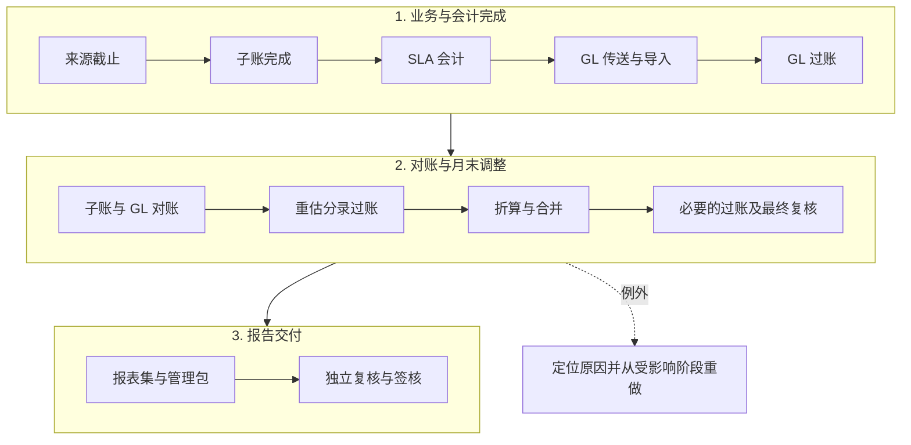
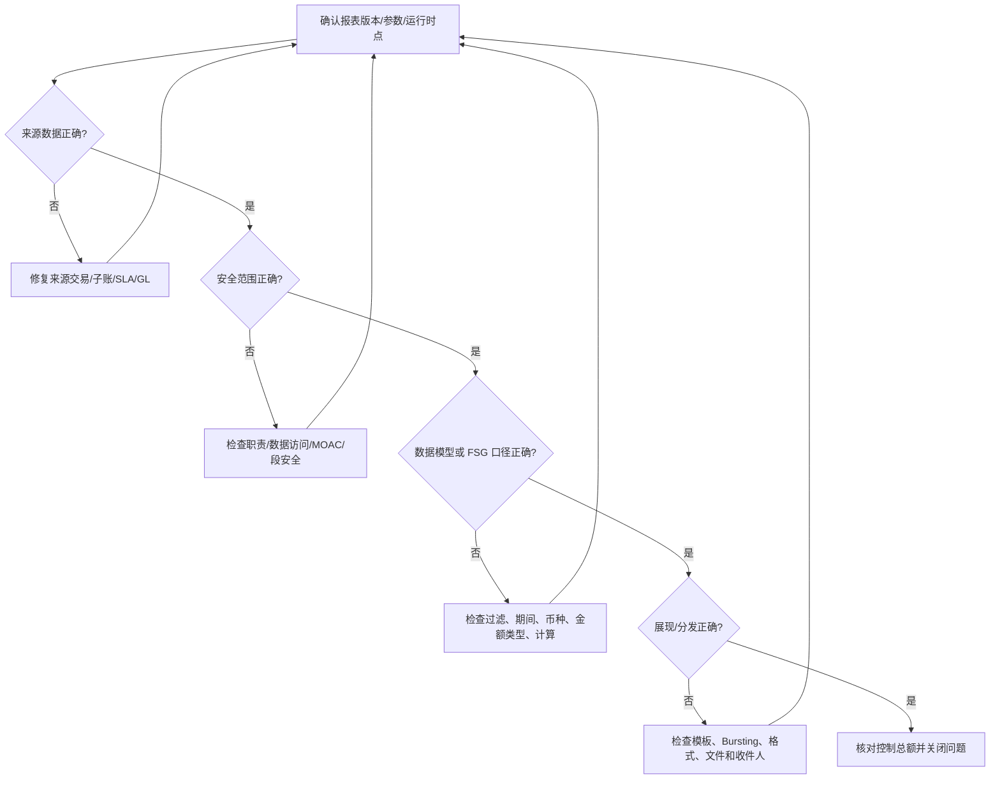
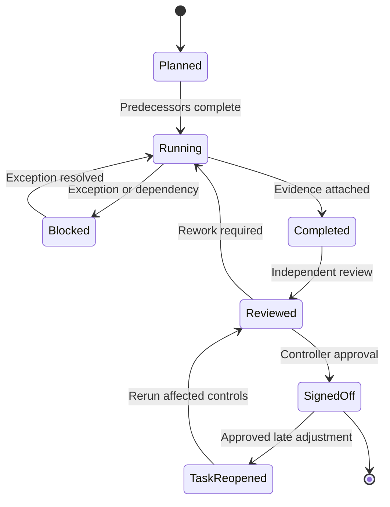
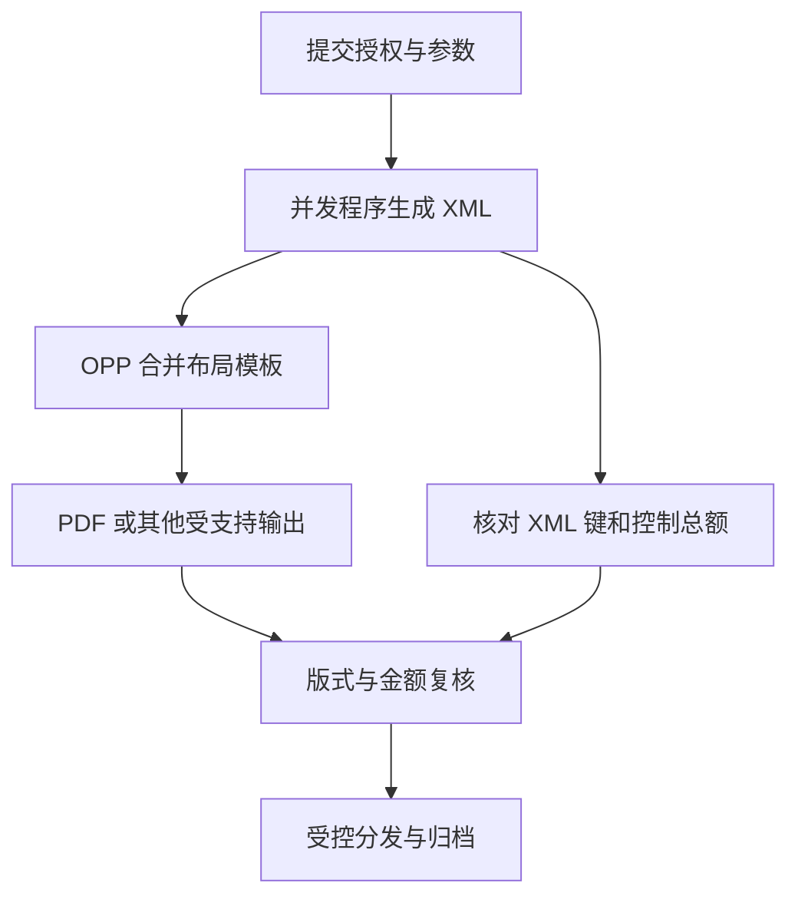

# 报表、关账与治理（Reporting and Governance）

> 报表不是项目末期的格式工作，而是会计口径、权限、数据血缘、关账证据和内控的最终呈现。本模块建立报表选型、治理和验证方法。

本文以 **EBS R12.2 的报表与关账治理**为范围，不把 Fusion Cloud、独立 BI Publisher 或 EPM 功能当作 EBS 默认能力。文中的角色矩阵、批次台账、阈值、示例金额和签核状态是实施设计示例，不是 Oracle 预置配置或强制制度。FSG 完整定义及汇率维护见 [R2R 专题](02-record-to-report.md#fsg-定义组件与运行)；这里重点说明运行、对账、权限、发布和证据闭环。

## 阅读导航

- [工具选型](#2-报表工具选型) · [报表治理](#3-报表治理最小模型) · [关账内控](#4-关账与对账治理) · [架构性能](#6-报表架构开发与性能) · [对账矩阵](#7-关账日历与对账设计) · [审计排错](#8-审计数据保留与隐私) · [验证练习](#10-验证清单) · [页面与关账实操](#13-资深顾问实操报表与关账)
- 实施重点：[参数契约](#36-一张可验收的报表参数契约) · [AP 差异算例](#75-案例一ap-负债为何差-10000) · [XML Publisher 与 OPP](#137-页面剧本bi-publisher-数据模型与模板) · [ECC 加载](#138-页面剧本ecc-数据加载与看板验证) · [Web ADI 提交](#139-页面剧本web-adi-受控上传) · [Report Manager 发布](#1313-页面剧本report-manager-发布审批与下钻)

## 模块数据字典与名词解释

本模块速查见[统一数据字典](data-dictionary.md#dict-08)。

## 模块业务架构与核心 ER 图

### 报表与治理业务架构图

### 报表治理核心 ER 图

报表定义、数据模型、模板、请求和控制总额应分别治理；这些名称是逻辑实体，不等同于所有 EBS 版本中的具体 FSG/BI Publisher/ECC 表。`REPORT_SCOPE` 可登记多个 Ledger、OU、资产账簿或库存组织；不是每张运营报表都以 GL 余额为来源。跨工具统一的是口径和证据要求，不是一个预置的通用“语义层”产品。

## 1. 学习目标

应能根据实时性、数据粒度、交互方式、审计要求和用户规模选择 FSG、BI Publisher、RXi、Web ADI 或 Enterprise Command Center（企业指挥中心，ECC），并把 Smart View 作为需单独部署和授权的数据连接插件评估；能够建立报表目录、口径字典、访问控制、关账签核和变更治理。

## 2. 报表工具选型

| 工具 | 中文说明与适用场景 | 主要优点 | 主要控制点 |
| --- | --- | --- | --- |
| FSG | 财务报表生成器；基于 GL 余额的法定/管理报表 | 与 GL 维度紧密、口径稳定 | Row/Column Set、Content Set、期间和币种 |
| BI Publisher（EBS 内嵌 XML Publisher） | 将程序产生的 XML 与布局模板组合，输出业务单据和报表 | 数据与版式分离、多格式 | Data Definition、数据抽取程序或 Data Template、布局模板、OPP 和输出安全 |
| RXi | 可扩展报表交换；部分 EBS 标准报表布局 | 标准程序集成 | 属性集、版本和产品适用性 |
| Smart View（可选） | Office 插件；连接已部署的数据源进行分析和钻取 | 财务用户熟悉、交互强 | 不属于 EBS 原生报表；连接、成员选择、刷新口径和本地文件安全需单独治理 |
| Web ADI | Web 应用桌面集成器；Excel 上传/下载 | 受控批量录入 | Integrator、服务端验证、上传权限、部分成功及重试去重 |
| ECC | 企业指挥中心；运营搜索和可视化 | 取决于数据加载计划的运营洞察 | Full/Incremental/Push 加载、补丁依赖、访问角色、索引新鲜度 |

工具选择先问：数据来自余额还是交易？需要实时还是批处理？是否需写回？是否含敏感明细？谁负责口径和签核？

### 2.1 按业务目的选型

| 报表类别 | 典型用户/时效 | 首选工具 | 权威数据源与控制 |
| --- | --- | --- | --- |
| 法定财务报表 | CFO/财务、月结/季结 | FSG 或 GL 标准报表；必要时用 BI Publisher 排版 | 已过账 GL 余额、Ledger、法定科目映射、版本锁定和控制总额 |
| 管理损益/经营分析 | 管理层、日/周/月 | FSG、Smart View 或受控 BI Publisher | GL 余额 + 批准的管理维度；定义预算、实际、同比和滚动期间 |
| 子账与对账报表 | 财务运营、日结/月结 | 子账标准报表、Account Analysis、BI Publisher | AP/AR/FA/CE/INV/WIP 子账、SLA、GL 控制账户和业务键 |
| 交易明细/运营清单 | 业务部门、近实时/批处理 | BI Publisher、标准报表或 ECC | 交易表/标准视图；保留状态、请求 ID、刷新时间和分页控制 |
| 预算、承诺和资金 | 预算负责人、月度/实时 | GL 预算/资金检查、FSG、Web ADI | Budget、Encumbrance、Funds Check 状态；禁止与 Actual 混列而不标识 |
| 交互式检索/异常看板 | 运营和支持、近实时 | ECC | 数据集、加载请求、索引新鲜度、职责和页面安全 |
| 受控批量上传 | 财务录入、月结 | Web ADI 或标准接口 | Integrator、Layout、值集校验、上传批次和错误行处置；不假设整批自动回滚 |
| 临时分析 | 授权分析人员 | Smart View/受控导出 | 只读连接、刷新时间、成员选择和本地文件加密；结果不能替代签核报表 |

### 2.2 报表立项决策门

报表立项评审至少回答八个问题：

1. **权威性**：数字是以已过账 GL、SLA、子账还是运营交易为准；若允许未过账数据，必须在标题和过滤条件中明确。
2. **粒度**：只要余额、日记账行、子账事件还是业务单据明细；是否需要从单元格下钻到来源交易。
3. **期间**：运行期间、会计日期、交易日期、截止时点和调整期间是否一致；是否允许跨 Ledger Set。
4. **币种**：Entered、Ledger、Reporting、Statistical、Translated 还是固定报告币种；汇率类型和日期如何确定。
5. **安全**：按职责、Data Access Set、MOAC、Ledger、法人、OU、成本中心或敏感字段控制到哪一级。
6. **性能**：最大行数、并发用户、运行窗口、输出格式、Bursting 收件人和归档容量。
7. **责任**：业务所有者、数据所有者、技术维护者、运行人员、独立复核人和最终签核人分别是谁。
8. **生命周期**：如何测试、批准、发布、版本化、迁移、暂停、归档和退役；异常期间谁有权重跑或重开。

## 3. 报表治理最小模型

每张关键报表应登记：业务名称、中英文名、用途、所有者、数据来源、过滤条件、维度口径、币种、期间、刷新频率、访问角色、模板版本、验证基准和保留期限。相似报表先比较口径再决定是否合并，不能只按名称去重。

### 3.1 数据血缘

来源于子账的关键财务数字应能追溯：报表单元格 → GL 余额/日记账 → XLA 分录 → 来源交易。手工 GL 日记账没有对应 XLA 业务链，应追溯到录入、审批与附件；运营报表则从数据集直接追溯交易。静态 PDF/Excel 不会自动获得标准页面的下钻能力。管理报表若使用数据仓库，还要记录抽取时间、转换规则和与 EBS 控制总额的对账。

### 3.2 口径控制

- 维度：Ledger、法人、平衡段、成本中心、产品、项目等。
- 时间：会计期间、交易日期、会计日期、截止时点。
- 币种：交易币、账簿币、报告币和汇率类型。
- 余额：期初、期间发生、期末；Actual、Budget、Encumbrance 分开，统计量另按 `STAT` 币种口径识别。
- 范围：已过账/未过账、完成/未完成、有效/冲销交易。

### 3.3 报表目录与生命周期

报表目录是治理入口，不只是文件名清单。每个条目至少包含 `report_id`、业务名称、中英文标题、报表类别、Owner、Data Steward、技术维护者、来源/目标表、参数定义、Ledger/OU 范围、币种和期间规则、刷新 SLA、输出格式、保留期限、访问角色、控制总额、版本和退役日期。

状态变更必须保留申请单、旧/新版本、测试证据、批准人、迁移请求和生效时间。相同数据源但不同口径的报表不能仅因名称相似而合并；相同口径的重复报表应指定一个主版本，其余设置别名或退役。

### 3.4 语义层与指标定义

| 指标/术语 | 正确口径 | 必须固定的参数 |
| --- | --- | --- |
| PTD | 所选会计期间的发生额；未关闭期间随新增过账变化，不等于当天发生额 | Ledger、期间、余额类型、取数时点 |
| QTD/YTD | 按所选 Amount Type 取季度/年度累计；损益发生额与资产负债账户期末余额不能混称 | 财务日历、账户类型、金额类型、调整期间处理 |
| 期初/期末余额 | 期间开始/结束的 GL 余额；不是简单取报表运行日余额 | 期间状态、过账截止、年结/结转规则 |
| Actual | 实际金额类型，本身不表示已过账；GL 余额报表与未过账日记账清单不同 | Journal Source/Category、Posting Status、冲销处理 |
| Budget/Encumbrance | 预算与承诺/保留资金会计金额，属于不同余额类型 | Budget、Encumbrance Type、Funds Check 口径；不要把采购订单总额直接当 Encumbrance |
| 变动/差异 | 自定义管理差异可约定实际减预算；FSG 内置 Variance 金额类型为预算减实际，不能混用 | 比较期间、分母、预算为零、符号与有利/不利含义 |
| 余额方向 | 借方、贷方或报表显示正负号 | Natural Account 类型、FSG Change Sign、格式掩码 |
| 组织汇总 | 平衡段/法人/成本中心等段的合计 | 段层级、父子值、跨 Ledger/OU 是否允许 |
| 报告币种 | Ledger Currency 或转换后的目标币种 | Conversion Rate Type、Rate Date、Translation/Reporting Currency |

定义必须用一个可复算的示例说明：输入账户、期间、金额类型、汇率、过滤条件、预期结果和舍入方式。展示层不得自行改变会计口径；需要例外时应在语义定义中注册而不是埋在模板表达式里。

### 3.5 控制总额与报表证据

控制总额至少分为四层：

1. **来源层**：接口/交易批次的行数、数量、Entered Amount 和来源系统总额。
2. **子账层**：AP/AR/FA/CE/INV/WIP 等子账的已完成事务、未完成事务和会计金额。
3. **SLA/GL 层**：XLA 借贷平衡、传送金额、GL Journal Import 和 Posting 总额。
4. **展现层**：报表行数、金额、币种、正负方向和过滤后的总计。

比较前先固定 **粒度、币种、正负号、日期、状态与账户范围**。来源发票含税金额不能直接减去全部 SLA 行金额；每张发票可能有税、费用、负债等多行，全分录借贷净额为零也不能证明没有漏单。控制账户比较其净额，完整分录才检查借贷平衡。具体公式和可复算案例见第 7 节。

报表证据包应包含参数快照、运行时间、Request ID、数据模型/模板/FSG 版本、控制总额、输出文件校验值、复核记录、差异说明和签核。相同报表重跑后若结果变化，应解释期间内新增过账、汇率、数据加载或权限变化。

### 3.6 一张可验收的报表参数契约

以下为“月末应付负债对账包”的设计示例。参数契约既用于开发，也用于比较两次运行是否真的同口径。

| 项目 | 示例约定 | 不满足时的处理 |
| --- | --- | --- |
| 范围 | 主 Ledger L1、OU A/B、批准的负债账户集合 | 不能把一个 OU 的 AP 与整个 Ledger 的 GL 比较；先证明覆盖关系 |
| 日期 | 2026-08 会计期间、截至 8 月 31 日；另记录实际抽取时间及其时区 | 发票日期、到期日、付款日不替代 Accounting/GL Date |
| 状态 | 财务口径为 Final SLA、传送和 GL 过账分别列示 | 未验证、未会计、未传送、未过账不得被一个“有效”标志掩盖 |
| 币种 | CNY 账簿金额；外币原币明细按币种单列 | 不合计 USD 与 EUR；不将本位币总余额与外币折合额重复相加 |
| 粒度 | 最终对账按 Ledger + 账户 + 期间；调查明细保留 OU、单据及会计行键 | 供应商名称相同不是同一供应商主键；多分配行不能重复计发票头金额 |
| 借贷与显示 | 应付负债以贷减借为正；GL 查询借减贷结果需显式反号 | 正负规则不能仅靠 Excel 人工调整 |
| 金额与舍入 | 先以原精度对账，再显示单位及小数；比较金额不取绝对值 | 负余额和贷项单独分析，不用绝对值消除真实差异 |
| 异常输出 | 零结果仍打印参数及“无符合记录”；权限不足与无业务数据分开 | 不能把失败或越权过滤后的空白文件当作零余额证明 |
| 可重跑性 | 保存报告版本、抽取时点、请求、明细证据及输出 | 历史参数相同不保证现在的数据相同；需要原始证据或受控快照 |

对“截至某日”的报表应进一步说明：是按该日业务/会计日期选择当前可见数据，还是使用当时冻结的快照。前者会被后续补录、冲销、核销和映射变更影响；除非已有受支持快照机制，不能承诺任意时间点都能重建完全相同的历史结果。

## 4. 关账与对账治理

关账任务应有前置依赖、执行角色、计划时间、完成条件、证据、差异阈值和升级路径。签核不能只记录“已完成”，应附控制报表、参数、请求 ID、输出版本和例外批准。

对账采用三层结构：业务数量/金额控制总额；子账与 SLA 会计总额；SLA/子账与 GL 控制账户。差异必须落到业务键、期间和责任人。

### 4.1 关账依赖与门禁

每个门禁至少定义以下完成条件：

上图按实际业务需要启用相关步骤：重估生成的分录需先过账再进行依赖其结果的折算；余额折算不应一概当作新日记账。合并/调整如产生目标账簿分录，还须完成导入、过账与抵销复核后才出最终报表。依据：[GL 多币种处理](https://docs.oracle.com/cd/E26401_01/doc.122/e48748/T312864T314328.htm)。

| 门禁 | 完成条件 | 例外处理 |
| --- | --- | --- |
| 来源截止 | PO/AR/FA/INV/WIP/CE/Projects/Tax 交易已导入，接口错误行有处置 | 记录批次、金额、预计解决时间和临时控制 |
| 子账完成 | 按产品检查 AP Validation、AR Complete、成本处理等状态，待处理清单已处置 | 状态名并非各模块通用；不得用手工 GL 掩盖未完成子账 |
| SLA 完成 | 事件已处理、借贷平衡、会计状态 Final，无错误 | 仅对失败事件按标准程序重处理 |
| GL 完成 | Journal Import 成功、批次已过账；暂记/替代账户分录已复核，无效账户错误已处理 | 暂记账户不是无效账户的统称；按导入/过账错误报告处理 |
| 对账完成 | 子账/控制账户/GL/报表四层控制总额一致 | 例外需账龄、责任人、复核和截止日期 |
| 签核完成 | 输出版本和参数锁定，复核人独立于制表人 | 迟到调整须定义重跑范围和重签机制 |

### 4.2 关账日历与运行批次

将月结拆成来源截止、子账检查、SLA、GL、重估/折算、报表和签核批次；每批次登记开始/结束时间、并发请求、依赖关系、失败重跑范围和通知渠道。可并行的 AP/AR/FA/INV 任务应在依赖图中明确。是否串行取决于数据写入冲突、标准程序互斥和业务依赖，不由“同一个控制账户”单独决定；普通只读报表可并行，不应人为锁定业务基表。子账实际关闭时点按产品规则和对账完成情况安排。

建议用批次控制表保存：`batch_id`、业务日期、会计期间、Ledger/OU、来源系统、输入行数/金额、输出事务数/金额、错误数、重跑次数、最后成功时间、操作人、复核人和附件位置。批次成功不能只看并发状态为 Normal，还要核对业务控制总额和 GL 过账结果。

### 4.3 迟到调整与重开期间

迟到发票、退货、汇率变化、资产折旧重算或子账补录可能改变已签核报表。处理流程应包括：识别影响期间和报表、冻结当前版本、评估是否重开、按受影响子账/控制账户重跑、生成新版本、更新差异说明并重新签核。禁止直接覆盖原 PDF 或删除旧请求；旧版本和新版本必须可比较。

“重新打开签核任务”不等于“数据库期间可以重新打开”。GL 的 Closed 与 Permanently Closed、各子账的期间控制，以及资产账簿/库存组织的期间均要分别判断；不能发布一条通用“重开所有期间”的操作指令。无法重开的期间，按产品支持的当期调整与财务政策处理，并在桥接表解释原期间影响，禁止改基表状态强行开期。

| 对象 | 关键限制 | 报表治理影响 |
| --- | --- | --- |
| GL 期间 | Closed 可重新打开；Permanently Closed 不可重开，操作还涉及此前期间 | 关闭或永久关闭均不等于历史报表不可查询；永久关闭前审查全部影响 |
| Inventory/WIP 成本期间 | 关闭为永久关闭，不能按 GL 方式重开 | 更正按允许的后续期间流程处理，并解释库存/成本跨期差异 |
| FA 折旧期间 | 已关闭期间不能重开；运行折旧与选择关闭期间是不同决策 | 关期前完成调整复核；不得承诺通过重开已关期间重算 |

依据：[GL 期间控制](https://docs.oracle.com/cd/E26401_01/doc.122/e48747/T450006T450009.htm)、[成本期间关闭](https://docs.oracle.com/cd/E26401_01/doc.122/e48829/T372621T378953.htm)、[Assets 折旧](https://docs.oracle.com/cd/E26401_01/doc.122/e48755/T293142T301315.htm)。其他子账应使用各自关期指南，不能据此类推。

### 4.4 月结排程、关账与签核不是同一个动作

以下 D 为月末日、D+N 为企业批准的工作日计划，仅为示例；不预设所有企业都使用同一关账天数。

| 窗口 | 任务与责任人 | 进入下一步所需证据 |
| --- | --- | --- |
| D 前 | 业务负责人检查未收货、待导入、待开票、未处理成本、未核销款 | 待办清单、截止通知、系统及银行接口时间 |
| D/D+1 | 各模块完成来源截止及子账内部对账 | 批次控制总额、失败/待处理明细及负责人 |
| D+1/D+2 | 子账会计与 GL 导入、过账；并行调查异常 | Final/Transfer/Import/Posting 各阶段证据，不能只留父请求 |
| D+2 | 财务复核控制账户及跨模块余额 | 对账桥接表、手工调整清单、差异账龄及处理结果 |
| D+2/D+3 | 按需要完成重估、折算、公司间核对及合并 | 汇率/映射版本、相关调整与抵销分录已过账，折算结果与最终余额已复核 |
| D+3 | 制表人生成最终管理包，独立复核人及 Controller 签核 | 已冻结版本、报表总额、复核记录、受控分发清单 |

**重跑范围判断**：版式分页错误且 XML 已冻结时，可只重排版；数据抽取过滤错误需重新抽取并对账；来源补录或账户规则修正需从受影响业务/会计阶段重做。对已产生有效会计分录的请求，不得把“重跑整个请求集”当作无副作用操作。签核暂停、恢复或带例外批准不能绕过系统本身的关期阻断条件。

## 5. 内控、审计与合规

### 5.1 职责分离与访问复核

定期复核用户、职责、菜单、请求组、配置文件和数据访问。高风险冲突包括主数据与付款、交易与审批、日记账与过账、开发与生产发布。紧急权限要限时、审批并复盘。

### 5.2 变更与证据

配置、报表模板、SQL、接口和补丁都应有需求、影响分析、测试、批准、迁移记录和回退方案。审计证据要可重复取得，保留参数与时间点，且遵守隐私与数据保留政策。

### 5.3 本地化和法定报告

Localizations（本地化）与 Regulatory Reporting（监管报告）依赖国家/地区、法人注册、税制、补丁和法定格式。项目必须以目标司法辖区和实例补丁为准，不能将其他国家模板直接复用。

### 5.4 报表职责与职责分离矩阵

| 角色 | 可以做什么 | 不应独立完成什么 | 交付证据 |
| --- | --- | --- | --- |
| Business Owner | 定义用途、口径、阈值和签核标准 | 不应直接修改生产 SQL/模板 | 需求、口径、验收签字 |
| Data Steward | 维护科目、组织、期间、币种和来源解释 | 不应批准自己维护的数据结果 | 数据字典、映射和质量报告 |
| Report Developer | 开发 SQL、数据模型、FSG 对象、模板和测试 | 不应同时执行生产发布和最终签核 | 版本、代码审查、测试输出 |
| Report Operator | 按批准参数提交、监控并归档请求 | 不应改变报表定义或绕过审批 | Request ID、日志、输出校验值 |
| Finance Reviewer | 对账、抽样、检查异常和控制总额 | 不应由制表人代替独立复核 | 复核清单、差异签注 |
| Controller/Approver | 批准报表、例外和迟到调整 | 不应直接维护技术对象 | 签核、例外批准、重跑决定 |
| System/Security Admin | 用户、职责、菜单、请求组和数据访问 | 不应审批业务金额或报表口径 | 权限变更、访问复核、审计日志 |

高风险组合包括“开发 + 生产发布”“制表 + 最终签核”“来源数据维护 + 对账复核”“用户授权 + 权限审批”。小团队无法完全分离时，需采用补偿控制，例如独立日志复核、只读生产权限和控制人抽样。

### 5.5 配置文件、职责和数据访问

报表安全需要分别检查功能入口、定义维护、数据范围和历史输出。Data Access Set、Definition Access Set、MOAC 不是可互换的“组织权限”：各自的作用见下表。自定义 SQL 直接查询基表，不会仅因放入并发程序就自动继承全部数据安全；必须在受支持的应用上下文中实现并测试权限过滤，禁止只信任用户传入的 Ledger/OU 参数。

| 安全层 | 主要控制 | 不能代替什么 |
| --- | --- | --- |
| Responsibility、菜单、函数、Request Group | 页面/功能和可提交的并发程序、请求集 | 不等于 SQL 行级过滤，也不决定运行优先级 |
| GL Data Access Set | Ledger 及可配置的平衡段/管理段读写范围 | 不控制全部子账 OU，也不等于 FSG 定义修改权 |
| Definition Access Set | FSG 等受支持定义的 Use/View/Modify | 有权用定义不代表有权看所有账簿金额 |
| Segment Value Security | 账户段值范围；FSG 需核实 `FSG: Enforce Segment Value Security` | 不自动保护导出的本地副本 |
| MOAC / MO Security Profile | 适用多组织产品的 OU 数据访问 | OU、法人、Ledger 和库存组织不一一等同 |
| Report Manager repository/security | 已发布报告的查阅与分发范围 | 当前源数据权限变化，不代表旧输出已同步撤回 |
| ECC 数据集安全与页面/动作安全 | 数据访问规则以及页面和操作入口 | 能进入页面不等于有权看全部数据或执行全部动作 |

并发安全还需检查当前实例的 RBAC Submit Request / View Request 授权；R12.2 指南将 Request Security Groups 保留为兼容机制，不能把请求组视为唯一安全入口。不要依赖已不再使用的 `Concurrent: Report Access Level` 配置。依据：[Concurrent Processing 的安全与请求管理](https://docs.oracle.com/cd/E26401_01/doc.122/e22953/T174296T575591.htm)。Report Manager 内容安全有不同可选模式，并非所有安全规则总是叠加，具体发布验收见 13.13。

实施测试可从四个角色（制表、复核、运营、只读）和两个组织开始，再按真实授权矩阵扩展。这是测试设计示例，不是 Oracle 最低角色数量要求。覆盖“应能看、应不能看、应能运行、应不能修改、应能下钻、应不能下载敏感字段”，还要复测离职、职责失效、共享链接和已归档文件的访问。

## 6. 报表架构、开发与性能

### 6.1 分层设计

报表架构宜分为四层：**来源层**保存 EBS 交易和会计事实；**语义层**统一科目、组织、期间和状态口径；**展现层**负责 FSG、BI Publisher、Excel 或仪表板格式；**分发层**负责调度、Bursting（按规则拆分分发）、归档和访问。把复杂业务规则全部写进版式模板，会导致口径无法复用，也难以测试。

报表数据集至少保留业务主键和钻取字段。汇总报表要能下钻到明细，明细要能回到 EBS 页面或业务键；因隐私而隐藏字段时，仍需由授权支持人员完成追溯。

### 6.2 SQL 与容量

- SQL 先限定 Ledger、期间、组织和业务键，避免在大表上无界扫描。
- 报表查询优先使用稳定视图/数据模型，并记录来源表和连接逻辑。
- 批量报表控制并发、内存、输出大小和保留期限；敏感输出加访问与加密控制。
- BI Publisher 将数据模型与版式分离测试；大数据量使用分批或 bursting 前先验证容量。
- ECC 数据新鲜度由加载程序决定；页面数字与交易页面不一致时先核对最后加载时间。

性能验收不能只测单用户。应覆盖月末数据量、并发调度、最大输出、Bursting 收件人数量和归档空间；记录基准运行时间、峰值资源与可接受服务窗口。

### 6.3 报表对象与运行链

| 层/对象 | 主要职责 | 版本和依赖 |
| --- | --- | --- |
| FSG Row Set | 定义行序号、账户范围、显示类型、计算行和格式 | COA、Ledger/段值、Definition Access Set、FSG 安全配置 |
| FSG Column Set | 定义金额类型、期间偏移、币种、预算/实际、标题和计算列 | 会计日历、Balance Type、Currency Control Value |
| FSG Content Set/Row Order/Display Set | 按段值拆分、排序、显示或隐藏行列 | 段层级、权限和输出格式 |
| FSG Report/Report Set | 组合 Row/Column Set 并批量运行多个报表 | 运行期间、Ledger/Ledger Set、请求参数和调度 |
| Concurrent Program/SRS | 注册参数、执行文件、可执行方式和请求组 | 应用、职责、参数值集、并发管理器 |
| BI Publisher Data Definition | 登记数据定义并关联数据模板和布局模板 | 应用、Code、并发程序短名、有效性 |
| 抽取程序 / Data Template | 生成 XML；Data Template 可描述参数、SQL、分组与触发器 | 程序参数、安全上下文、XML 结构、版本 |
| BI Publisher Layout Template | 用 RTF、PDF 表单、XSL 等受支持模板类型排版 | 输出格式另行选择；模板类型不等于输出格式 |
| Web ADI Integrator/Layout | 定义 Excel 下载/上传字段、默认值、值集和校验 | Desktop Integration Framework、职责和上传权限 |
| ECC Data Set/Page/Region | 将业务数据索引为搜索、指标、图表和动作 | Full/Incremental/Push 加载、索引、角色和补丁 |
| Report Manager / SRS 请求输出 | Report Manager 管理报表发布和库中内容；SRS 管理请求运行及日志/输出 | 两者入口和安全不同，不是所有并发输出都自动进入报告库 |

标准链路是“来源交易/余额 → 数据模型或标准视图 → 参数与安全过滤 → 并发请求/加载 → 模板或页面渲染 → 输出/分发 → 控制总额与归档”。自定义报表应优先接入 SRS/Report Manager，保留请求日志和标准监控能力，而不是绕过 EBS 直接访问数据库后自行发送文件。

### 6.4 接口、下钻与数据血缘实现

| 需求 | 推荐实现 | 需要记录的键 |
| --- | --- | --- |
| GL 余额到日记账 | GL Account Inquiry；Report Manager 的 Financial Drilldown 需满足其配置要求 | Ledger、CCID、期间、Journal Header/Line；FSG 静态输出本身不提供通用下钻 |
| SLA 到来源交易 | XLA 下钻、子账标准报表或受控 BI Publisher 数据模型 | `AE_HEADER_ID`、`AE_LINE_NUM`、`EVENT_ID`、来源主键 |
| 交易明细到报表 | BI Publisher 数据模型/标准报表；保留业务主键 | 业务单据、行号、组织、状态、会计日期 |
| 批量报表到外部系统 | SRS/BI Publisher 输出、受控文件传输或 API | Request ID、文件名、校验值、传输批次、接收确认 |
| 外部系统写回 | Web ADI、标准 Open Interface、公开 API 或受支持 Web Service | 外部唯一键、EBS 主键、处理状态、错误码和重试次数 |
| ECC 看板 | 标准数据集加载或扩展框架 | Load Request、数据集、抽取时点、最后成功水位 |

每个数据集都应有“来源字段 → 转换规则 → 输出字段 → 控制总额 → 下钻链接”的映射。若 SQL 需要自定义换算、过滤或汇总，必须在数据模型说明中写出公式和例外；不要在 RTF/XSL 模板中隐藏关键业务逻辑。直接查询 `GL_*`、`XLA_*` 或子账表时，应使用最小权限、只读账号和参数化过滤。

对需要近实时看板的场景，可评估 ECC Push Load 的异步 HTTP POST/Java API 路径。接口支持 `INSERT`、`UPDATE`、`DELETE`、`UPSERT`、`REPLACE` 等操作，具体语义与数据集及补丁版本一并确认；不能把 REPLACE 当作无风险的通用重试操作。保存 `externalRequestId`、数据集键、操作类型、批次和 Job ID，并查询最终加载结果。`externalRequestId` 是来源追踪标识，不应声称 Oracle 自动保证其幂等性。

项目设计应保证来源交易成功提交后才进入可重试推送流程；数据库提交与 ECC 异步加载不是同一个原子事务。超时先查任务状态、来源版本与 `ECC_SPEC_ID`，避免重复、乱序或旧记录覆盖新记录；业务键和投递去重策略属于扩展实现责任。不得为了失败重推而修改已正确入账的业务交易。依据：[ECC Push Load 与 Java API](https://docs.oracle.com/cd/E26401_01/doc.122/f21671/T673609T676700.htm)。

### 6.5 调度、并发与容量控制

Request Group 负责提交权限，**不是优先级队列**。容量与优先级通过并发管理器工作班次、目标进程数、Specialization Rules、请求优先级及程序 Incompatibility 配置管理。按在线、日批、月结和加载负载制定调度窗口，不能仅靠增加请求组解决排队。

Request Set 可按阶段结果连接后续阶段；请求的 Completed/Normal、Warning、Error 与阶段的 Success、Warning、Error 要区分，均不会自动证明财务总额正确。需要业务门禁时，应有明确的人工复核或受控校验程序及失败分支。重估、折算、合并和签核报表按目标 Ledger/期间的实际依赖排序；不要给互不冲突的只读报表设置不必要的全局互斥。

容量基线至少包括：最大明细行数、单次输出 MB、并发请求数、Bursting 收件人数、数据库执行时间、应用层内存、临时空间和归档增长。超时先区分数据库抽取、XML 生成、OPP 排版和分发阶段，再评估参数范围、连接基数、分批和容量。全表扫描有时是合理执行计划，不应将“没有全表扫描”设为验收目标；新增索引或改变标准对象需 DBA 审查及支持性评估。

### 6.6 输出、分发与归档

输出分为交互查看、内部共享、法定归档和外部发送四类。每类指定格式、加密、命名、收件人白名单、传输渠道、下载权限、校验值、保留期限和销毁方式。Bursted 报表按组织/法人分发时，分割键必须与安全规则一致，并用测试收件箱验证“不该收到的数据不会出现”。

### 6.7 数据粒度与重复取数防线

| 常见连接/汇总 | 错误结果 | 正确设计与验证 |
| --- | --- | --- |
| 发票头连接发票分配行 | 同一头金额被每条分配行重复累计 | 金额与粒度一致：头金额只在头层汇总；分配层用分配金额 |
| GL 行连接多个来源引用 | 一条汇总日记账行金额按来源数量放大 | GL 总额先在 GL 行层计算；下钻明细独立计算并与对应会计金额对账 |
| XLA 行连接事件、实体 | 漏掉应用或行键后跨应用错误关联 | 使用目标实例确认的复合键，保留 `APPLICATION_ID` 等上下文 |
| 明细账户与 Summary Account 混算 | 同一经济金额计入两次 | 明确选择明细或汇总口径，不无条件加总两类余额 |
| 父科目范围与子科目范围重叠 | FSG 财务报表重计 | 逐行登记账户范围，验证重复覆盖和未覆盖账户 |
| 期间余额直接跨月求和 | 资产负债余额被重复累计 | 期末余额取目标期；期间流量才按选定期间累加，年结另检查 |
| 一对多多语言描述表 | 每种语言重复一遍金额 | 固定语言或使用受支持的语言视图，验证连接前后业务键数量 |
| 数据权限过滤在汇总之后 | 明细隐藏但总额泄露 | 在授权范围内取数和汇总；总计、导出、下钻使用一致权限 |

开发复核至少输出连接前后的记录数、业务键去重数和金额。`DISTINCT` 不能作为不明连接重复的通用补丁：它可能掩盖错误，也可能删除金额相同但真实不同的交易。空值、作废、冲销、负数、合并供应商/客户和组织转移都应有明确规则。

GL 来源追溯常用 `GL_IMPORT_REFERENCES` 的日记账头/行定位，再用 `GL_SL_LINK_ID` **及** `GL_SL_LINK_TABLE` 对接 SLA 行；不是只用单据号连接。需检查来源的 Import Journal References、传送汇总方式及链接是否实际生成。手工日记账、汇总传送或历史迁移数据可能缺少同样的明细路径，此时记录限制并使用标准报表/附件补证，不能通过猜测连接制造下钻。

## 7. 关账日历与对账设计

### 7.1 关账任务模型

每项任务登记 `task_id`、Ledger/OU、期间、前置任务、计划起止、实际起止、执行人、复核人、请求 ID、输出位置、状态和例外。状态至少区分 Not Started（未开始）、In Progress（进行中）、Blocked（受阻）、Completed（已完成）和 Completed with Exception（带例外完成）。

关账依赖通常按“来源接口 → 子账业务完成 → 子账会计 → 子账对账 → GL 导入/过账 → 重估/折算/合并 → 报表与签核”推进。可并行任务应在依赖图中明确，避免所有工作机械串行。

### 7.2 对账矩阵

| 对账 | 左侧证据 | 右侧证据 | 常见差异 |
| --- | --- | --- | --- |
| AP 负债 | AP Trial Balance | GL Liability | 未会计、未传输、手工 GL、期间错位 |
| AR 应收 | AR Trial Balance/Aging | GL Receivables | 未完成交易、核销截止、手工 GL |
| FA | Asset Cost/Reserve | GL Asset/Reserve | 未过账交易、折旧、账户或期间 |
| 库存/WIP | 价值报表 | GL Inventory/WIP | 未处理交易、成本更新、截止差异 |
| 现金 | CE 账面与银行对账 | GL Cash/Clearing | 在途、未清算、未会计或银行遗漏 |
| 税务 | 税务登记簿 | GL Tax Accounts | 税行状态、恢复比例、调整或期间 |

对账差异记录需包含期初差异、本期新增、本期解决、期末差异、账龄、金额、根因、所有者和预计解决日期。长期调节项必须升级，不能每月机械滚动。

### 7.3 对账控制公式与抽样

| 控制点 | 建议公式 | 抽样/佐证 |
| --- | --- | --- |
| 批次完整性 | 唯一输入业务项 = 成功 + 失败 + 待处理 + 按规则拒绝/排除 | 各桶互斥且覆盖全集；重试次数不能算成新业务项，金额按币种复核 |
| 子账借贷平衡 | 完整 SLA 分录账簿币借方 − 贷方 = 0 | 会计头/行、Final 状态、Ledger；不能拿单个控制账户要求借贷为零 |
| AP/AR/FA/INV/CE 控制账户 | 子账余额 + 已识别桥接项 − GL 对应余额 = 0 | Trial Balance、Account Analysis、GL 余额和过账状态；桥接项逐笔证明 |
| 报表总额 | 报表合计 − 独立 GL/子账查询合计 = 0 | 相同参数、币种、期间、输出版本和校验值 |
| 期间滚动 | 期初 + 本期发生 − 期末 = 0 | 上期签核输出、本期明细、年结/结转日志 |
| 分发完整性 | 唯一应发件 = 成功 + 失败 + 待发送 + 经批准取消 | 分发台账、投递状态、失败重发；邮件服务器接受不等于人已阅读 |

抽样同时覆盖大额、零值、负值、外币、调整期间、冲销、跨组织、权限边界和人工调整。独立复核人应能用不同查询或标准报表重算关键总额，而不是只检查模板外观。

### 7.4 差异阈值和升级

差异阈值同时按绝对金额、相对比例、账龄和风险等级设定。只有根因已被规则验证、在授权范围内且保留证据的舍入差异，才可按批准政策自动处置；“金额小”不证明是舍入，更不能隐藏重复、漏单或越权。三期升级等期限属于企业策略示例。阈值版本、批准人和生效期间纳入治理，不应写死在不可追踪的 SQL 条件中。

### 7.5 案例一：AP 负债为何差 10,000

**假设**：同一 Ledger、全部相关 OU、同一负债账户范围，CNY、贷方余额为正；本例无汇兑、预付款、票据和其他特殊调整。相关 AP 分录均已 Final、传送并导入 GL，Open Account Balances Data Manager 已成功处理，但其中一个 GL 批次未过账。使用 AP Trial Balance 的明确截止日期，不能以发票账龄表替代会计负债余额。

| AP 本期变动 | 金额 | 说明 |
| --- | ---: | --- |
| 期初会计负债 | 100,000 | 上期已签核余额 |
| 本期增加负债的发票 | 60,000 | 本例均已 Final Accounting |
| 本期贷项减少负债 | -5,000 | 不再重复计入发票增加额 |
| 本期付款冲减负债 | -45,000 | 比较负债释放金额，不拿银行实际支付额替代 |
| AP 期末会计负债 | **110,000** | 100,000 + 60,000 − 5,000 − 45,000 |

GL 查得贷方余额 100,000，不能直接做 10,000 的手工“补平”。追查发现其中 12,000 的 AP 负债增加额所在批次已导入但未过账，另有 2,000 手工 GL 贷记误入该账户：

`AP 110,000 − 尚未 GL 过账的 AP 12,000 + 非 AP 手工贷记 2,000 = GL 100,000`。

处理时完成上述 GL 批次过账，GL 变为 112,000；再经审批冲销错误手工分录，GL 变为 110,000。重新取得 AP/GL 输出及请求证据，差异归零后复核。若期间限制阻止修正，记录当期受支持调整路径及跨期桥接，不修改旧输出。未传送等系统关期例外必须按产品流程处理，不能仅靠签核人批准跳过。

**数据前提**：标准 Open Account Balances Data Manager 处理已传送 GL 的分录，以及特定已在 GL 体现而标为 No Transfer 的 Final 分录；不能假定任何未传送的 Final 分录都已进入 AP Trial Balance。未传送项要另用会计明细和 Period Close Exceptions 检查。依据：[Open Account Balances Listing 与 Data Manager](https://docs.oracle.com/cd/E26401_01/doc.122/e48771/T149412T398308.htm)。

EBS 标准基线是 Accounts Payable Trial Balance、Posted Invoice Register、Posted Payment Register 及 Period Close Exceptions Report；其中 AP Trial Balance 基于 Open Account Balances Listing 机制，应核对报表定义及账户覆盖。不要误用 Fusion Cloud 的报表/准备程序名称作为 EBS 菜单。参见 [Payables 会计与对账报表](https://docs.oracle.com/cd/E26401_01/doc.122/e48760/T295436T368343.htm)。

### 7.6 案例二：客户余额、应收控制账户与银行收款不相等

**测试口径**：单一 CNY Ledger，只计算贸易应收未结借项净额；不含汇兑和其他调整。本例收款方法/SLA 将未核销款记入单独的未核销账户。

| 变动 | 金额 |
| --- | ---: |
| 期初应收借方余额 | 80,000 |
| 本期开票 | 50,000 |
| 贷项通知单 | -4,000 |
| 已批准核减 | -2,000 |
| 已应用于发票的收款 | -30,000 |
| 期末贸易应收 | **94,000** |

若实际收到 35,000，其中 5,000 尚未核销，不能把 35,000 全部作为发票应收减少额。纳入未核销贷项的客户净余额可能是 89,000，而上述贸易应收账户为 94,000；5,000 必须能追溯到未核销款及其会计账户。账龄报表是否包含未核销款、On-account、贷项和争议，不同选项会改变结果；本例不是所有 Aging 报表的固定公式。

先用 **AR Reconciliation Report / Potential Reconciling Items** 核对业务与会计，再核对传送、Journal Import 和 GL Posting，最后使用 **AR to GL Reconciliation Report** 调查来源及账户差异。AR 某些报表中的 Posted 指已传送给 GL，并不证明 GL 已过账，应另取 GL 证据。现金收款生命周期的核对使用 Receipt Register/Receipt Journal 及 CE 银行对账，不能以客户余额相等代替现金已到账。参见 [Receivables 对账流程](https://docs.oracle.com/cd/E26401_01/doc.122/f10570/T355475T355481.htm)及[报表与参数](https://docs.oracle.com/cd/E26401_01/doc.122/f10570/T355475T355482.htm)。

### 7.7 案例三：银行与账面余额的双向桥接

以下是管理复核算例，具体 CE 匹配、清算和会计动作见[现金与税务模块](06-cash-tax.md)。同一银行账户、同一币种、同一截止日：

| 银行侧 | 金额 | 账面侧 | 金额 |
| --- | ---: | --- | ---: |
| 银行对账单期末余额 | 97,000 | GL 现金账面余额 | 100,500 |
| 加：企业已记、银行未入账存款 | 8,000 | 减：银行已扣、企业未记手续费 | -500 |
| 减：企业已记、银行未付付款 | -5,000 | 其他调整 | 0 |
| 调整后余额 | **100,000** | 调整后余额 | **100,000** |

8,000 与 5,000 属于有凭据的时间差，应跟踪后续银行流水及账龄；500 是待完成的账面会计事项，不因桥接平衡就免除处理。若使用 Cash Clearing，需另列清算账户和收付款状态；也不能把“已匹配银行行”理解为全部子账会计已 Final、已传送且已过账。

### 7.8 案例四：FSG 缩放、舍入与重复账户

假设三条 GL 明细分别为 CNY 1,004，报表按“千元、两位小数”显示：每行 1.00，显示行相加为 3.00；原始总额 3,012 缩放并舍入后为 3.01。两种显示规则相差 0.01 千元，不代表底账差 10 元。须决定“总计按未舍入数计算”还是“显示行相加”，并在报表注明单位和舍入；底账对账仍用 CNY 3,012。

另一个负向测试：父科目范围已包含子科目，又把同一子科目作为独立合计项加进总计，结果即使借贷平衡也可能翻倍。验收应分别证明账户覆盖完整、各可加总行互斥，以及计算行不再次参与明细总和。金额相同不能作为报表无重复的证据。

### 7.9 差异台账如何关闭

差异台账建议包含：对账 ID、期间、币种、账户、业务键、左/右金额、差异方向、发现时间、根因、责任人、到期日、修复请求、受影响报表版本、复核人和关闭证据。

- **时间差**：保存后续入账/清算证据；不能只改状态为已解决。
- **错误账户/重复入账**：按标准业务或审批调整处理，并核查其他期间和同类交易是否受影响。
- **权限或取数范围差异**：纠正授权或报表口径，不通过修改交易迎合错误报表。
- **舍入差异**：保存原精度数、显示单位、舍入规则及可复算结果。
- **带例外签核**：明确属于“本期报表获准发布但差异仍未解决”，不能冒充差异关闭。

滚动关系按带符号差异计算：`期初未解决 + 本期新增 − 本期已解决 = 期末未解决`；另按正/负方向或根因分别展示，避免两笔反向错误相互抵销后看似为零。

## 8. 审计、数据保留与隐私

审计范围根据法规和风险确定，不应无差别开启所有表审计。对配置、供应商银行、用户权限、日记账、付款和关键报表模板等高风险对象，明确谁改了什么、何时修改、修改前后值和批准依据。

Data Retention（数据保留）策略同时覆盖数据库交易、并发输出、日志、接口文件、银行报文、报表归档和审计记录。保留期限取法定、税务、合同和诉讼保全要求的较严格者；到期清理应可审计，并使用 Oracle 支持的归档/清理能力。

非生产克隆后需要屏蔽个人、银行、税务和商业敏感信息，并禁用真实邮件、银行传输和外部服务。下载到 Excel/PDF 的报表也属于受控数据，访问控制不能止于 EBS 页面。

### 8.1 审计对象与证据字段

| 审计对象 | 重点字段/动作 | 频率与证据 |
| --- | --- | --- |
| FSG 定义 | Row/Column/Content Set、Report、Report Set、Segment Security、Access Set | 每次变更；保留旧/新定义、对象 Owner、批准和迁移请求 |
| BI Publisher | Data Definition、抽取程序/Data Template、布局、参数、语言、Bursting | 每次发布；保留模板文件校验值、版本、测试输出和审批 |
| ECC | Data Set、Page/Region、加载模式、索引、Personalization、角色 | 发布/补丁/加载异常；保留 Load Request、版本和诊断日志 |
| 并发处理 | 程序、参数、请求组、调度、输出访问、重跑/取消 | 日批/月批；保留 Request ID、日志、输出和操作人 |
| 权限 | User、Responsibility、Menu、Data Access Set、MOAC、临时职责 | 定期复核和离职事件；保留授权单、复核结果和回收记录 |
| 数据与会计 | GL/SLA/子账、手工日记账、冲销、汇率、期间开关 | 月结/季度；保留控制总额、下钻样本和签核 |

审计日志应覆盖“谁、何时、从哪里、改了什么、改前值、改后值、原因、批准人、请求 ID”。日志的读取权限也要受控；排错时可提供脱敏副本，不能为方便而关闭审计或清除失败记录。

上述是**证据需求**，不是说单一 EBS 日志天然拥有全部字段。应按机制划分能力：

| 机制 | 能提供的证据 | 不能据此推定 |
| --- | --- | --- |
| WHO 列 | 创建人/时间、最后更新人/时间等 | 不保留每次变更历史，也不自动保存全部前后值 |
| Sign-On Audit / 会话与页面跟踪 | 按配置记录登录、职责、Forms 或相应 Web 活动 | Forms 登录审计不能替代全部 OAF/JTF 页面轨迹或业务金额历史 |
| 数据库审计 | 按启用策略记录数据库操作、对象及会话信息 | 不天然提供所有业务行前后值、操作原因和业务审批结论 |
| 存量 EBS Audit Trail | 对已配置的表列，通过触发器和影子表保留变化 | 未启用的列或启用前的历史不能事后自动恢复 |
| ECC Activity Audit | 按配置记录页面访问、搜索、筛选、导出等活动 | 不等于 AP/GL 基表变更历史，不证明 SLA 会计正确 |
| 请求、Workflow 与发布记录 | 执行、审批及对象版本等对应环节 | Request ID、WHO 用户或文件校验值单独不能证明审批有效 |

Oracle 现行安全指南将旧 EBS Audit Trail 章节作为历史机制保留，并建议评估 Database Unified Auditing；不应把旧机制当作新项目默认方案，也不能声称存量已不可用。Unified Auditing 的配置路线取决于 EBS System Schema Migration 等补丁前提，应由 DBA 按目标实例版本确认。依据：[审计概览](https://docs.oracle.com/cd/E26401_01/doc.122/e22952/T156458T663758.htm)、[数据库审计](https://docs.oracle.com/cd/E26401_01/doc.122/e22952/T156458T663770.htm)、[存量 Audit Trail 边界](https://docs.oracle.com/cd/E26401_01/doc.122/e22952/T156458T663771.htm)、[ECC Activity Audit](https://docs.oracle.com/cd/E26401_01/doc.122/f34732/T676250T676672.htm)。

建议用一条脱敏测试业务执行“创建 → 修改 → 审批 → 报表输出”，逐项核验能否取回各环节证据；无法取得的原因/批准信息由对应流程记录补足。审计内容本身可能含敏感参数或搜索词，同样需要权限和保留控制。

### 8.2 数据分类与外发控制

建议至少分为公开、内部、机密、严格受限四级。供应商银行账号、员工薪酬、客户税号、未披露财务结果、付款文件和法定申报底稿通常属于机密或严格受限。每个报表目录条目记录分类、允许输出格式、收件人、加密方式、跨境限制、下载期限和销毁责任。

邮件、SFTP、文件共享、BI Publisher Bursting、Smart View 下载和 ECC 导出都属于外发渠道，应有白名单、传输加密、到达确认和撤回/事件响应方案。测试环境不得使用真实收件人、生产 SMTP、银行端点或真实税务数据。

### 8.3 备份、归档与恢复演练

报表归档至少保留“定义/数据模型/模板版本 + 参数 + 原始输出 + 控制总额 + 签核”，不能只存 PDF。按法定期限、税务期限、合同期限和诉讼保全要求取较长者，并区分在线可查、离线归档和到期销毁。

可将“每年一次恢复抽查”作为企业策略示例，实际频率按风险和制度批准：从归档恢复一份法定报表，验证文件完整性、版本、参数、已留存的数据证据、权限和可读性。数据库清理、并发输出清理和 ECC 加载日志清理都应采用对应支持流程，先确认范围、保留要求、保全限制及已验证的恢复材料。

备份用于恢复系统，归档用于保存可检索证据，两者不能互相替代。不能假设清理请求日志只删除文件、不影响请求历史；应审查所用程序的参数及影响对象。输出校验值应与受控清单分开保护：文件和校验清单一起被替换时，单纯校验一致并不能证明真实性。归档后的再次运行应形成新版本；法律保全期间暂停适用对象的到期销毁。

## 9. 常见问题诊断

| 现象 | 诊断顺序 |
| --- | --- |
| 报表与 GL 不一致 | Ledger/期间/币种、过账状态、余额类型、科目范围、刷新时间 |
| 同名报表数字不同 | 参数默认值、截止日期、数据源、模板/数据模型版本和权限 |
| BI Publisher 无输出或超时 | 请求日志、数据集行数、SQL 计划、模板、内存和输出格式 |
| FSG 行缺失 | Row Set、账户范围、显示选项、零余额、Content Set 和币种 |
| ECC 与交易页面不同 | 数据加载请求、最后加载时间、增量范围、访问角色和索引错误 |
| 用户看到越权数据 | 职责、数据访问集、MOAC、报表参数、数据模型过滤和分发列表 |
| 报表显示旧数据 | 来源是否完成、SLA 是否 Final/已传送、GL 是否过账、是否复用旧 XML/输出、ECC 最后成功水位 |
| FSG 总额与明细不平 | Row/Column Calculation、Expand/Total/Both、父子段值、Change Sign 和舍入 |
| FSG 多 Ledger 结果异常 | Ledger Set、Reporting Currency、余额类型、段覆盖和定义访问集 |
| BI Publisher 分发错误 | Bursting 查询、分割键、收件人映射、语言/地区和安全上下文 |
| Web ADI 上传部分成功 | Integrator/Layout、值集校验、批次控制总额、接口状态和错误行 |
| Smart View 刷新差异 | 连接环境、POV/成员选择、刷新时间、报告币种和本地缓存 |
| 并发请求排队 | Phase/Status、计划时间、Hold、Manager 适配/进程数、优先级、互斥规则；请求组不是运行队列 |
| 归档文件不可读 | 文件校验值、模板/字体、权限、加密密钥和保留介质 |
| 报表被未授权修改 | 对象 Owner、Definition Access Set、版本库、迁移日志和审计记录 |

排错必须保留请求 ID、参数、模板/数据模型版本、输出样本、控制总额和正常对比样本。不要用修改报表 SQL 去掩盖来源数据或会计错误。

### 9.1 分层排错路径

每一步只修复对应层：来源错误回到业务或子账流程，数据模型错误回到 SQL/参数，模板错误回到展现层，权限错误回到职责/数据访问。修复后必须用相同参数重跑，并确认原问题关闭而没有引入越权或总额差异。

## 10. 验证清单

1. 与标准报表或经批准的 GL 余额建立控制总额。
2. 验证正常、零数据、负数、外币、跨期、冲销和权限边界。
3. 验证导出、调度、分发和不同模板格式。
4. 记录请求参数、版本、运行时间、行数和总额。
5. 验证用户只能看到授权 Ledger、OU、法人或敏感字段。

### 10.1 功能与控制验收矩阵

| 编号 | 场景 | 必测变体 | 通过标准 |
| --- | --- | --- | --- |
| RPT-01 | FSG 财务报表 | PTD/QTD/YTD、Actual/Budget、Ledger Set、Content Set | 行列金额与 GL 查询一致，公式、符号和期间偏移正确 |
| RPT-02 | FSG 安全 | 不同职责、段值安全、Definition Access Set、无数据用户 | 只能运行/查看/修改授权对象和段值，越权请求被拒绝 |
| RPT-03 | BI Publisher | XML 数据与 RTF 等输入模板分测；PDF/Excel 等受支持输出、多语言、零/大数据 | 源 XML 与控制总额一致，版式、OPP 和敏感字段正确 |
| RPT-04 | BI Publisher 分发 | Bursting 分割键、收件人白名单、失败重发 | 每个收件人只收到授权范围，成功/失败件数可对账 |
| RPT-05 | Web ADI | 值集、必填、提交粒度、重复键、部分失败、重试 | 按 Integrator 支持的提交模式验收，错误可定位且重试不重单 |
| RPT-06 | ECC | 已实现的 Full/Incremental/Push 路径、失败、删除/更正、角色 | 相同粒度下来源与索引一致，加载与查询安全分别验证 |
| RPT-07 | 关账报表 | 子账、SLA、GL、重估/折算、调整期间 | 门禁项、差异、签核和版本均可追溯 |
| RPT-08 | 性能容量 | 月末数据量、并发请求、最大输出、归档恢复 | 在批准服务窗口内完成，无丢行、溢出或输出缺失；执行计划与容量合理 |
| RPT-09 | 审计隐私 | 配置变更、权限变更、脱敏克隆、误发事件 | 按设计取回可证明的审计字段及审批证据，非生产无真实外发 |
| RPT-10 | 对账桥接 | 未传送、未过账、手工 GL、不同币种及方向 | 能逐笔还原差异，不用净额抵销掩盖两个错误 |
| RPT-11 | 截止与重跑 | 补录、核销、期间关闭、不可重开期间 | 旧证据保留，新版本明确来源变化及受影响签核 |
| RPT-12 | 输出分发 | 两组织同名报表、审批、旧输出访问、失败重发 | 不跨组织泄露、不覆盖应保留的签核证据，重发不重复污染 |

### 10.2 发布前检查

- 口径文档、数据字典、对象 Owner、访问角色和控制总额已更新。
- SQL/数据模型通过代码审查，参数有默认值、值集和最大范围；没有未授权动态 SQL 或硬编码账号。
- FSG/BI Publisher/ECC/Web ADI 对象已在测试环境验证，模板和定义版本可回退。
- 并发程序、请求组、调度和分发收件人已由运行人员演练；日志、输出、校验值和归档位置已确认。
- 业务 Owner 和独立 Reviewer 已签字；生产迁移、监控、告警和回退窗口已安排。

## 11. 建议练习

- 为资产负债表设计 FSG 行列集，并说明余额、币种与期间口径。
- 为 AP Aging 设计 BI Publisher 数据模型、模板、权限和控制总额。
- 建立一份“报表—来源—所有者—验证基准—访问角色”目录。
- 模拟月结差异，形成包含请求 ID、参数、数据证据和签核的审计包。
- 为六类控制账户建立对账矩阵和差异账龄看板。
- 评审一次非生产克隆，列出报表、日志和外发渠道的数据泄露风险。

## 12. 名词速查

完整术语及核心对象统一维护在[本模块数据字典](data-dictionary.md#dict-08)，此处只保留阅读时最容易混淆的区别，避免两份释义独立漂移。

| 不要混同 | 区别 |
| --- | --- |
| Data Definition / Data Template / Layout Template | EBS 数据登记、可选抽取定义、版式模板；不是同一个对象 |
| Request Group / Request Set / Manager | 可提交权限集合、请求执行编排、实际执行资源 |
| Data Access Set / Definition Access Set | 数据范围权限与定义对象权限 |
| Accounting / Transfer / Import / Posting | 会计生成、传送、导入、更新 GL 余额四个不同阶段 |
| Period Closed / Signed Off | 系统期间状态与业务复核结论 |
| WHO / Audit Trail / Evidence Package | 最后更新元数据、按机制记录的审计轨迹、多来源的完整证据包 |

## 13. 资深顾问实操：报表与关账

### 13.1 关账治理状态图

图中 TaskReopened 仅表示重新开启关账任务，不保证产品期间可重开。带例外完成必须记录差异金额、风险、临时控制、所有者和解决日期。迟到调整影响会计时，还要评估关联子账、对账、重估/折算和签核，不能只重跑最终报表。

### 13.2 页面剧本：定义并运行 FSG

**常见职责与导航**：`General Ledger Super User → Reports（报表） → Define（定义） → Row Set/Column Set/Content Set/Report`；运行入口通常在 `Reports → Request → Financial`。

1. 先在报表口径文档定义 Ledger、期间、币种、余额类型、科目范围、符号和舍入。
2. 定义 Row Set：行号、说明、账户范围、计算行和显示格式。
3. 定义 Column Set：期间、金额类型、币种、预算/实际和计算列。
4. 需要按公司/成本中心拆分时定义 Content Set；需要排序/显示控制时配置 Row Order/Display Set。
5. 组合成 Financial Report，提交运行并记录参数和 Request ID。
6. 用 GL Trial Balance/Account Inquiry 验证关键行，测试零余额、负数、外币、调整期间和层级变更。

### 13.3 页面剧本：BI Publisher 报表变更

首次注册与排错见 13.7；本节专门处理既有报表变更。

1. **分类**：仅标题/字体/分页，还是 XML 字段、参数、安全或会计口径改变；后者不能按纯版式变更审批。
2. **基线**：保存旧抽取定义、模板、样例 XML、版本及控制总额，列明共享同一 Data Definition 的其他模板。
3. **比较**：同一冻结 XML 分别套用新旧模板；抽取逻辑有变更时，再对同一业务样本逐键比较两版 XML。
4. **回归**：零数据、负数、外币、多语言、特殊字符、分页、最大数据和权限边界；新增敏感字段即使未展示，也要检查原始 XML 下载权限。
5. **批准与迁移**：记录支持的迁移方法、依赖、有效期、默认模板、回退材料；生产首跑先验证控制总额，再开放分发。
6. **回退边界**：恢复旧模板只能回退版式，不能撤销已发送文件或已运行的业务写入。处理这些副作用需独立措施和记录。

### 13.4 页面剧本：月结签核

1. 在关账任务表检查每项前置任务、执行人、Request ID 和证据链接。
2. 对 AP、AR、FA、CE、Inventory/WIP、Projects、Tax 分别确认业务完成、SLA 和 GL 对账。
3. 检查 GL 未过账、Suspense、Intercompany、Revaluation、Translation 和 Consolidation。
4. 运行批准的报表集，锁定参数、模板版本和输出文件。
5. 对所有差异更新 Roll-forward：期初 + 新增 - 解决 = 期末。
6. Controller 独立复核后签核；开期/关期和迟到调整由不同角色批准。

### 13.5 报表变更影响矩阵

| 变更 | 必查对象 | 回归重点 |
| --- | --- | --- |
| 科目值/层级 | FSG、已连接的 Smart View 数据源、接口映射、预算 | 历史比较、父值汇总、权限 |
| Ledger/OU | Data Access Set、MOAC、报表参数 | 应见/不应见数据、默认值 |
| SLA 账户规则 | 子账报表、GL 控制账户、对账 | 新旧事件、冲销、跨期 |
| BI Publisher 模板 | Data Definition、抽取/XML、并发程序、Bursting | 多语言、分页、敏感分发 |
| 补丁/ECC | 数据加载、索引、Dashboard | 新鲜度、角色、性能、数字一致性 |

### 13.6 高级异常演练

- 报表在最后一分钟改变：冻结版本，比较数据模型/模板/参数，不覆盖已签核输出。
- 子账对账通过但 FSG 不符：核对余额类型、币种、Summary Account、Row/Content Set 和未过账日记账。
- ECC 与交易页面不符：先核对最后加载时间和增量请求，再检查安全与索引，不直接修改交易数据。
- 敏感报表误发：停止分发、保留审计证据、按事件响应处理，不通过删除日志掩盖事故。

### 13.7 页面剧本：BI Publisher 数据模型与模板

本节的“数据模型”是业务取数设计的泛称。EBS 内嵌路径常用 `XML Publisher Administrator → Data Definitions / Templates`；**Report Manager 不是独立 BI Publisher 的 Web Data Model 编辑器**。导航随职责定制变化。依据：[EBS 模板与数据定义](https://docs.oracle.com/cd/E26401_01/doc.122/e22949/T120505T120508.htm)、[R12.2 数据定义/模板操作示例](https://docs.oracle.com/cd/E26401_01/doc.122/e48858/T202901T202907.htm)。

#### A. 注册与取数

下面用只读“应付对账明细”作为客制报表示例，名称 `XXAP_RECON_DETAIL` 是项目自定义名，不是 Oracle 标准程序。

| 对象 | 登记内容 | 验证 |
| --- | --- | --- |
| 并发程序 | 应用、短名、执行文件、输出 XML、参数和值集 | 运行得到有效 XML；参数顺序和取数逻辑一致 |
| Data Definition | 应用、Code、名称及关联内容 | 常见并发集成以 Code 对应程序短名；核对目标实例映射 |
| 数据产生方式 | 既有标准程序输出 XML，或客制抽取；采用 Data Template 时另登记其参数和结构 | Data Template 是可选实现路径，不要求所有报表都用同一个执行器 |
| Layout Template | 关联 Data Definition，选择模板类型、语言/地区、文件、有效期和默认输出格式 | 模板输入类型与最终 PDF/Excel 等输出格式分开确认 |
| 提交及查看授权 | 职责功能、请求权限/RBAC、输出查看权限 | 非授权用户不能通过参数、历史请求或 XML 下载越权 |

先验证抽取结果，再设计版式：一张发票多分配、多付款计划、贷项和跨 OU 数据是否保持正确粒度；参数值集只是输入约束，不代替服务端数据授权。不要修改 Oracle 标准抽取程序来实现一个新的管理口径，优先使用受支持扩展并保留版本边界。

#### B. 一次运行的可观察链路

OPP（Output Post Processor）处理并发输出后处理。排查时同时读取 **Phase 与 Status**，例如 Pending/Normal 不表示已完成；需要 OPP 的请求在 OPP 不可用时可能以 Warning 完成。应查看输出和后处理日志，不能只看请求已结束。依据：[Output Post Processor](https://docs.oracle.com/cd/E26401_01/doc.122/e22953/T174296T575591.htm)。

| 故障阶段 | 先检查 | 重跑决策 |
| --- | --- | --- |
| 尚未执行 | 计划时间、Hold、互斥、可处理的 Manager 及资源 | 先查排队原因，避免反复提交同样请求 |
| XML 无数据/不完整 | 参数、安全上下文、XML 格式、业务键及抽取日志 | 分清真实零数据、权限过滤和抽取错误 |
| XML 正确但输出失败 | 模板关联、有效期、语言/地区、字体、格式及 OPP | 已留存 XML 时按支持路径重新排版；不重复执行有写入副作用的业务程序 |
| 文件正确但投递失败 | 渠道、收件人映射、附件大小、目的端确认 | 对已确认失败项重发；结果不明先查询，不能把超时当成未发送 |
| 文件金额不一致 | XML 与版式分别比对，检查模板过滤/小计/舍入 | 修正责任层，重新出具版本及复核证据 |

#### C. 分拆分发验收

Bursting 的分割键应稳定对应一个授权内容单元，不能仅按可能重名的法人显示名称拆分。保留“分割键 → 输出文件 → 收件人 → 发送状态”的明细台账；多收件人、零数据、空地址、重复映射和附件超限分别测试。实施时区分 EBS XML Publisher 的分发定义/程序与独立 BI Publisher 的 Bursting 配置界面，不照搬后者的向导。

测试示例：A/B 两个组织各应收到一份对账单，总额分别 110,000/90,000。既要验证合计 200,000，也要验证 A 文件不含 B 单据、B 不含 A 单据。总额正确不能证明分发正确。若 A 已成功而 B 失败，重发 B 时保存原发送关联，不重新向 A 发送“新最终版”。

### 13.8 页面剧本：ECC 数据加载与看板验证

1. 确认应用、Page/Data Set、来源粒度、业务键、安装补丁以及授权组织范围。
2. 常规加载使用对应产品实际支持的 ECC 并发程序。Full/Incremental 的参数以该程序为准；Administration 的 Data Load Submission 用于诊断，不是日常业务加载的替代入口。Push 若已实施，按独立接口手册执行，不作为每个并发程序都有的第三个下拉选项。
3. Incremental 前确认数据集和元数据已初始化，并记录上次成功 Full/Incremental 水位。区分 EBS Concurrent Request ID、ECC Run ID 和 Push Job ID，不能拿同一个编号假定三者等价。
4. 检查成功水位、加载时间、错误和数据集范围；按来源取数逻辑测试迟到更新、状态变更、删除、冲销及主键变化。失败后按官方支持的路径恢复，不修改水位来跳过错误。
5. 比较同一时点、筛选和粒度的来源数据与 ECC，验证搜索、下钻和动作。Full、Incremental 与 Push 混用时，测试乱序及覆盖风险，制定一致性恢复方案。

加载和运行依据：[加载定义](https://docs.oracle.com/cd/E26401_01/doc.122/f21671/T673609T673614.htm)、[管理与跟踪](https://docs.oracle.com/cd/E26401_01/doc.122/f34732/T676250T676671.htm)。

**业务案例：两张发票为何是三条记录？** Oracle 的 Payables `ap-trx` 是开放供应商发票的付款分期数据集，其 `ECC_SPEC_ID` 采用 `invoice_id` 与 `payment_num` 组合。假设同一时点、同一币种，两张测试发票均开放且未付款，无折扣、预付款等调整：A 为 6,000，分两期各 3,000；B 为 3,000，安排一期付款计划。此时有三条分期记录、两张发票，分期未付金额合计 9,000；若重复汇总发票头金额会误得 15,000。实际运行应区分原始金额与剩余未付金额，发票数按键去重；Hold 数据集又是不同粒度。依据：[Data Sets and ECC_SPEC_ID Structures](https://docs.oracle.com/cd/E26401_01/doc.122/f21671/T673609T673696.htm)。

**安全验收**：分别测试页面函数/RBAC、数据集 privilege 以及查询时 security handler 对 OU、库存组织或资产账簿等的过滤；自定义 handler 应遵循扩展框架与已有规则的组合方式。仅隐藏页面组件或默认筛选条件不是行级安全；不要把 ECC Developer 配给普通看板用户。依据：[ECC Security](https://docs.oracle.com/cd/E26401_01/doc.122/f21671/T673609T673615.htm)。

### 13.9 页面剧本：Web ADI 受控上传

1. 选择批准的 Integrator 和 Layout，确认模板下载环境、职责、字段、默认值、上传目标及服务端业务验证规则；Layout 不独自拥有所有校验。
2. 确认是允许上传的工作表还是 Reporting-only 文档，并保留未上传数据。刷新下载内容前评估是否覆盖工作表上的修改。
3. 分别核对 Rows to Upload（All/Flagged）、Commit Rows（由 Integrator 决定可用选项）以及 Upload/Upload All 的工作表范围。
4. 提交小样本，保存输入业务键、金额和批次；检查返回消息与目标端实际提交结果，区分未提交、已提交和结果不明。
5. 依据提交粒度修正与重试。以 GL Journals 集成为例，还需检查 `GL_INTERFACE`、Journal Import 及 Posting；其他集成器按其目标接口/后处理验证，不假定都写入 GL。

| 10 行中 1 行无效的测试 | 预期提交 | 重试控制 |
| --- | --- | --- |
| Commit Rows = All Rows | 整批不提交 | 修正后重新提交原批，仍先核对实际状态 |
| Commit Rows = Each Row，且 Integrator 提供该选项 | 9 行有效记录可提交，1 行失败 | 只重传失败业务项，防止成功行重复写入 |
| 网络超时，结果未知 | 不能从超时推定为零提交 | 先按来源键/批次和接口日志查询，再决定重试 |

自动提交 Journal Import 也不意味着已过账；服务端返回成功与后续业务完成分别验收。Web ADI 面向受控工作表交易，大规模迁移应评估对应产品开放接口，不简单放大 Excel 批次。依据：[Web ADI 文档创建与上传](https://docs.oracle.com/cd/E26401_01/doc.122/e22007/T443182T443187.htm)、[Layouts](https://docs.oracle.com/cd/E26401_01/doc.122/e22007/T443182T443186.htm)、[GL Web ADI](https://docs.oracle.com/cd/E26401_01/doc.122/e48748/T312864T451269.htm)。

### 13.10 页面剧本：GL 账户查询与下钻

1. 在 Account Inquiry 选择 Ledger/Ledger Set、期间、币种、余额类型和科目段；GL 余额与未过账日记账清单分开核对，后者使用 Journal Inquiry/相应标准报表。
2. 从余额查询到日记账批次/行，再通过 SLA 或子账下钻到来源交易；抽取借贷、币种、汇率、会计日期和来源。
3. 比较标准 Trial Balance、FSG 和管理报表的同口径合计；若不一致，先判断是过账截止、过滤、币种还是报表缓存。
4. 对调整、冲销、Suspense、跨期间和手工日记账保留业务说明、批准和重跑影响范围。

**金额验收样本**：CNY 资产账户期初借方 1,000，本期已过账 CNY 借方 200、USD 借方 100（账簿金额 CNY 700），另有未过账 CNY 借方 50。预期账簿币 PTD 为 900、期末为 1,900；USD Entered 为 100、对应 Converted 为 CNY 700，该 700 已在账簿币总额内，不能再加一次。50 过账后，PTD 为 950、期末为 1,950。另有 `STAT` 数量也不能和金额相加。若预算 1,000、实际 900，FSG 内置 Variance 为 100；自定义“实际减预算”则是 −100，列标题必须表明区别。依据：[GL 在线查询](https://docs.oracle.com/cd/E26401_01/doc.122/e48748/T312864T313560.htm)与 [FSG 金额类型](https://docs.oracle.com/cd/E26401_01/doc.122/e48748/T312864T313620.htm)。

### 13.11 页面剧本：审计包与报表归档

1. 建立期间目录：需求/口径、数据字典、配置/模板、测试、运行参数、请求日志、输出、控制总额、差异和签核。
2. 为每个输出保存文件校验值、生成时间、Request ID、数据模型/FSG/模板版本和适用 Ledger/期间。
3. 对压缩包和脱敏副本设置访问期限、加密和下载日志；审计抽样时可复现相同查询和版本。
4. 期间结束后将工作目录转为只读；任何重跑或迟到调整建立新版本并链接旧版本，不覆盖原始签核文件。

### 13.12 页面剧本：报表退役与替代

1. 在报表目录标记退役候选，列出使用者、调度、下游接口、Smart View 连接、审计引用和替代报表。
2. 业务 Owner 比较新旧口径、历史可比性、控制总额和权限；确认替代报表已通过完整回归测试。
3. 停止新调度和外发，保留定义、模板、最后输出和保留期；保留别名或重定向说明，避免用户误用旧版本。
4. 仅在保留期和审计要求满足后清理对象/输出，并记录清理程序、批准和恢复方式。

### 13.13 页面剧本：Report Manager 发布、审批与下钻

1. 确认报表来源是 FSG、标准/可变报表还是上传文件，选择报告库位置和受控名称；不要把报告库当作 XML 数据定义维护入口。
2. 登记 Timeframe、报表参数、输出模板、Expansion Value（适用时）、可用时间和审核人。产品允许相同名称/Timeframe 的输出覆盖，因此“不覆盖已签核版本”必须由命名、权限和归档策略实现。
3. 分别配置 Repository Security 与内容安全。User to Value、Flexfield Segment Security 等是不同选项；选 User to Value 时不能假定扩展值又受到 Flexfield Segment Security 的双重限制。FSG User to Value 需要 Content Set 且恰有一段 PE（Page/Expand）。
4. 对扩展报表测试“当前用户可看的扩展值”与“审批实际覆盖的值”。Oracle 的审核动作可以覆盖审核人看不到的其他 expansion values，治理上应取得相应范围的复核证据，不能把按钮权限当作全部内容已检查。
5. 若要求 Financial Drilldown，确认模板启用 Drilldown Links、职责具有相关 GL/Report Manager/Web ADI 功能并测试来源追溯；普通 PDF 不自动具备这些能力。保留一条成功和一条被拒绝访问的下钻样本。

官方说明：[提交与发布的安全、Timeframe、审批](https://docs.oracle.com/cd/E26401_01/doc.122/e22006/T219421T219426.htm)、[Report Manager 功能与下钻前提](https://docs.oracle.com/cd/E26401_01/doc.122/e22006/T219421T219424.htm)、[模板中的 Drilldown Links](https://docs.oracle.com/cd/E26401_01/doc.122/e22006/T219421T219427.htm)。

### 13.14 操作截图与验收证据采集

本文使用流程图、参数表与文字剧本，没有虚构目标实例操作截图。实际 UAT 可按下表采集脱敏画面；一张“请求成功”截图不足以替代完整验证。

| 画面 | 应显示 | 脱敏与配套证据 |
| --- | --- | --- |
| FSG 定义/运行 | 行列集、期间、金额类型、币种和请求 | 隐去商业科目描述，附独立 GL 对账 |
| XML Publisher | 数据定义映射、模板类型、语言/地区和有效期 | 不展示连接密码、完整业务 XML 或真实个人信息 |
| 请求详情 | Request ID、参数、Phase/Status、后处理结果 | 配套保存日志、输出版本和金额核验 |
| Report Manager | Timeframe、扩展值、安全选项、审核状态 | 分别用有权/无权角色演示，不能暴露其他组织明细 |
| ECC 加载/页面 | 数据集、加载状态/时间、筛选和样本记录 | 记录来源粒度和数据时点；Token、Cookie 不入截图 |
| Web ADI 上传 | 提交模式、选择范围、成功/错误消息 | 使用虚拟单据，配套目标端实际提交数与金额 |

## 14. 官方依据与边界

- [Oracle General Ledger User's Guide R12.2](https://docs.oracle.com/cd/E26401_01/doc.122/e48748/toc.htm)：FSG、余额和 GL 报表。
- [Oracle General Ledger — Financial Reporting and FSG](https://docs.oracle.com/cd/E26401_01/doc.122/e48748/T312864T313620.htm)：FSG 行/列/内容集、金额类型、期间偏移、段值安全、报表集和调度。
- [Oracle E-Business Suite Report Manager User's Guide R12.2](https://docs.oracle.com/cd/E26401_01/doc.122/e22006/toc.htm)：EBS 原生报表提交、查看和安全。
- [Oracle E-Business Suite Concepts — Web ADI and BI Publisher](https://docs.oracle.com/cd/E26401_01/doc.122/e22949/T120505T120508.htm)：SRS、职责安全、Web ADI Integrator/Layout、BI Publisher 数据定义与模板，以及 EBS 集成边界。
- [Oracle E-Business Suite Administering Enterprise Command Centers](https://docs.oracle.com/cd/E26401_01/doc.122/f34732/toc.htm)：数据加载、审计和 ECC 管理。
- [Oracle E-Business Suite Extending Enterprise Command Centers — Data Load](https://docs.oracle.com/cd/E26401_01/doc.122/f21671/T673609T673614.htm)：Full/Incremental 加载与数据集扩展框架；Push 见下一项。
- [Oracle ECC Push Load and Java API](https://docs.oracle.com/cd/E26401_01/doc.122/f21671/T673609T676700.htm)：异步 Push Load、记录操作类型、批次和加载状态查询。

以上及各小节就近链接构成 Oracle E-Business Suite R12.2 官方依据。具体导航、并发程序、状态码、补丁能力、法定模板和安全功能以目标实例的安装、职责配置、eTRM、Lookup、Oracle Support 说明及当地法规为准。本文参数、金额、排程和阈值示例用于实施讨论，不替代实例验证或财务政策；本次资料核对未连接真实 EBS 实例执行 UAT。

<!-- 兼容旧版目录与学习材料的定位锚点；正文已按主题重编。 -->

