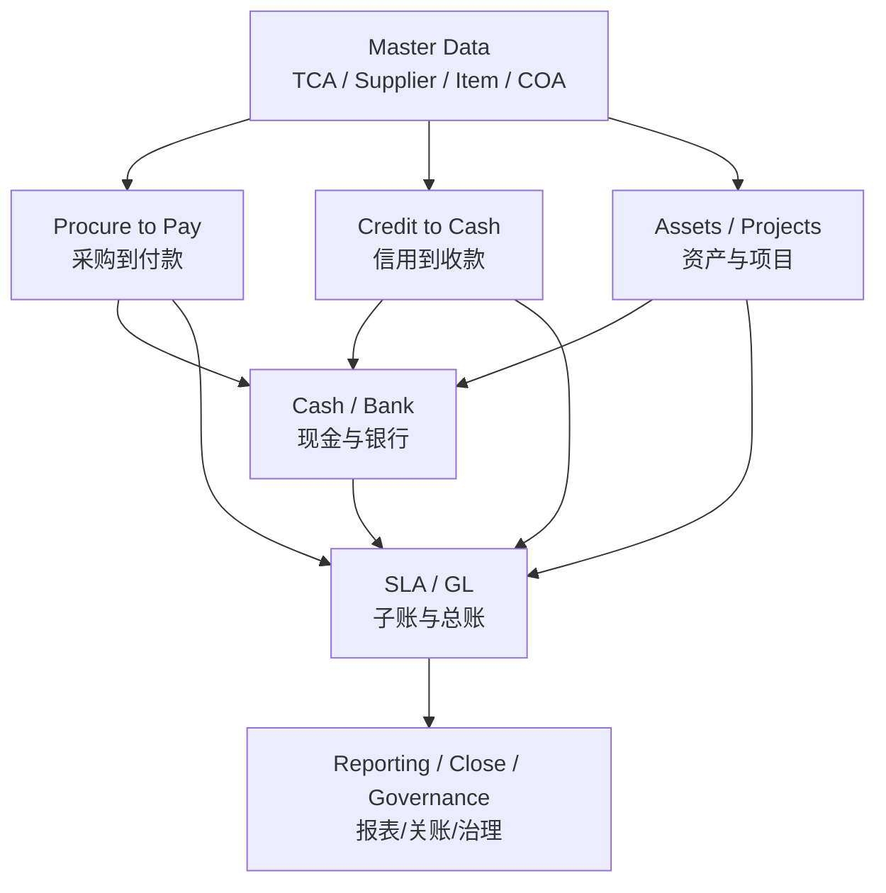
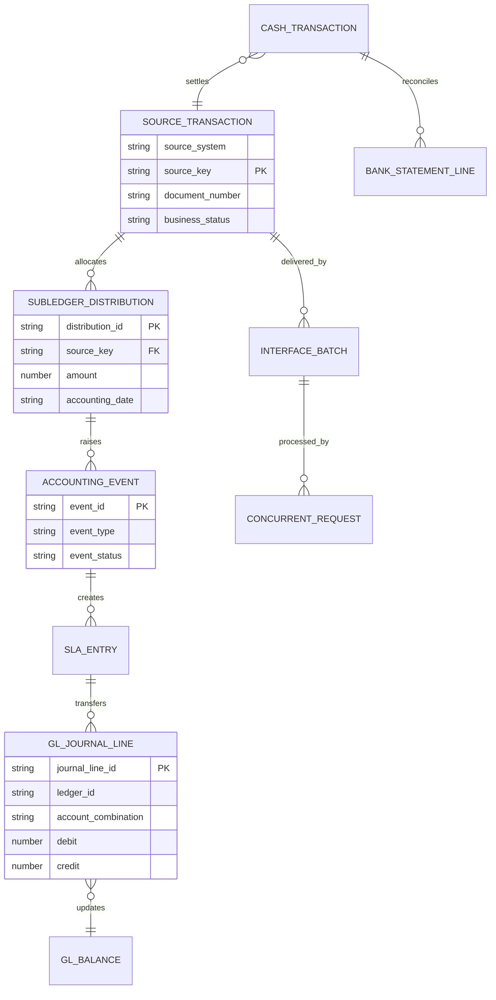
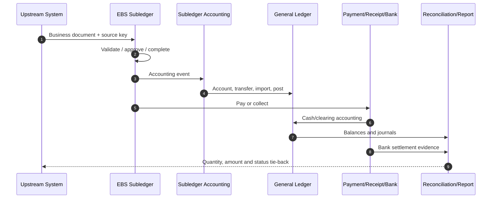
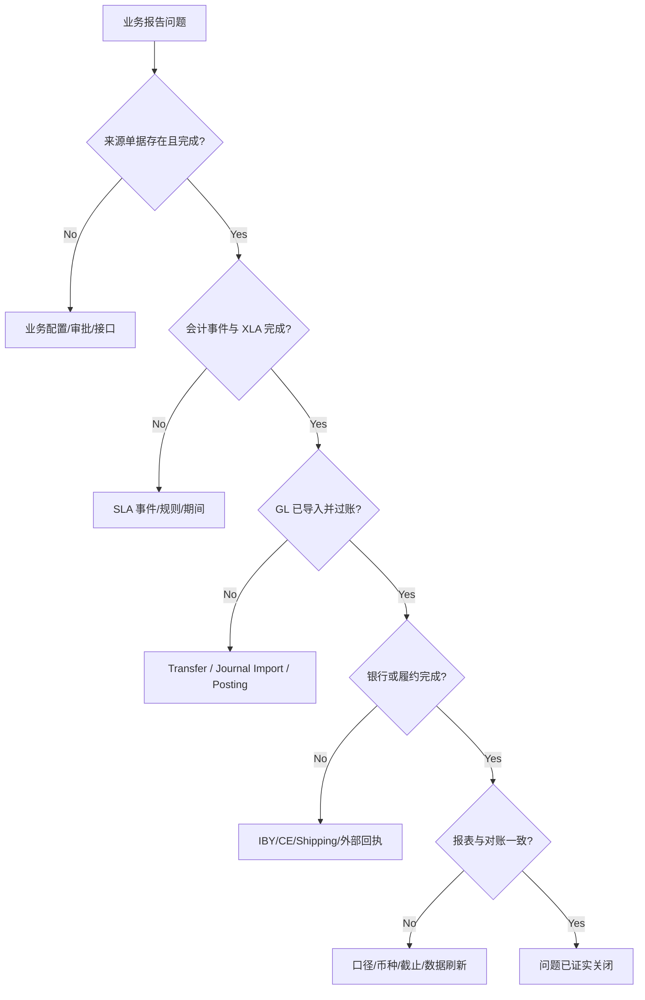

# 端到端业务流程（End-to-End Processes）

> 端到端视角把跨模块的单据、接口、会计、资金和控制连接起来。学习目标不是记住更多菜单，而是能在任何断点判断当前系统、对象、状态和责任人。

## 阅读导航

- [分析框架](#1-通用分析框架) · [实施编排](#implementation) · [流程地图](#2-核心流程地图) · [跨模块主键](#3-跨模块相关键) · [会计追溯](#4-会计追溯标准) · [状态重跑](#5-状态与重跑) · [故障定位](#7-故障定位顺序) · [跨模块实战](#10-资深顾问实战跨模块追溯与恢复) · [流程专题](#11-流程专题与实现细节)

## 模块数据字典与名词解释

本模块速查见[统一数据字典](data-dictionary.md#dict-09)。

## 企业业务架构与跨模块 ER 图

### EBS 财务业务架构图



### 跨模块核心 ER 图



用 `source_key`、批次和请求号连接跨模块对象，避免依赖描述、金额或日期的模糊匹配。实现时把业务键落在接口、分配、XLA 和 GL 引用中。

## 1. 通用分析框架

对每条流程制作一张“七列流程表”：步骤、责任角色、EBS 产品、业务单据/主键、状态、会计事件、控制证据。跨系统时再加入接口批次、相关号、控制总额和重跑规则。

<a id="implementation"></a>

## 实施配置手册：跨模块方案落地与验收

本章不重复各子模块的字段配置，而把它们组织为可实施、可切换、可恢复的端到端控制面。任何流程上线前均应有一个“流程负责人”统筹业务、会计、接口和运维责任；不能把跨模块失败简单转交给某个单一模块。

### 1. 端到端配置编排

| 波次 | 要配置/冻结的对象 | 主要模块与入口 | 必须形成的交付物 | 完成判定 |
| --- | --- | --- | --- | --- |
| 0 | 作用域、主键与责任矩阵 | 项目设计库；`System Administrator` 职责安全设置 | 流程图、七列流程表、RACI、外部业务键、批次命名、错误归属 | 每个系统边界都有唯一键、控制总额和重跑所有者 |
| 1 | 企业结构与安全 | Accounting Setup Manager、HR/组织、MOAC、Data Access Set | Ledger/法人/OU 映射、COA、期间、职责和数据权限基线 | 同一用户按授权范围可处理/查询，越权操作被拒绝 |
| 2 | 子账业务规则 | PO/AP/AR/FA/PA/INV/WIP/CE/Tax 对应 Setup 菜单 | 单据类型、状态、容差、账户来源、税、银行、成本/资产规则 | 每条流程的业务单据可从起点走至可会计状态 |
| 3 | 会计与报表规则 | AMB、GL、FSG/BI Publisher | 事件—借贷—账户矩阵、转总账策略、控制账户和对账报表 | 可从来源交易下钻到 XLA、GL 与报表数字 |
| 4 | 接口、调度与恢复 | 各模块 Open Interface、`View > Requests`、并发程序定义 | 接口契约、映射、文件控制总额、请求链、告警、幂等/补偿设计 | 成功、业务拒绝、技术失败、重复传输四类情形均有证据和处理结果 |
| 5 | 切换与运营 | 月结日历、关期功能、服务台/运行手册 | 期初余额方案、未结单据迁移、冻结窗口、回退边界、日结/月结 Runbook | 完成模拟切换、至少一轮模拟月结和关键角色演练 |

### 2. 流程级配置核对表

| 流程 | 关键配置依赖 | 穿透测试的最小路径 | 必须保留的关联键/证据 |
| --- | --- | --- | --- |
| P2P | Supplier/Site、PO 类型/审批、接收、AP 匹配、付款方法、银行用途 | PO → Receipt → Invoice Validate → PPR → Bank/CE → SLA/GL | PO/Receipt/Invoice/Payment 编号、PPR、Statement Line、Event/Request ID |
| C2C | Customer/Site Use、交易来源/类型、AutoInvoice、Receipt Method、AutoCash/Lockbox | Invoice → Receipt → Application → Remittance/Clearing → CE → SLA/GL | 接口行外部键、Transaction/Receipt/Batch、收款历史、Statement Line |
| A2R/Project | Asset Book/Category、项目类型/支出、资本化规则、FA 资产线 | AP/PA Cost → Mass Addition/Asset Line → FA Additions → Depreciation → GL | Invoice/Expenditure Item、Asset Line/Asset Number、Depreciation Request |
| 库存/WIP | 物料/组织、成本类型/要素、WIP 类别、期间、COGS | Receipt → Inventory/WIP → Completion/Shipment → Cost → SLA/GL | Transaction ID、WIP Job、Cost Distribution、Accounting Event |
| 现金与税 | 银行账户用途、交易码/匹配规则、税制/税率/规则 | AP Payment 或 AR Receipt → Statement Import → Reconcile → Tax/GL 抽查 | 文件/Batch、Statement Header/Line、规则版本、对账状态 |

### 3. 切换的执行顺序与停止条件

1. **冻结**：冻结主数据和配置变更，记录最后成功接口批次、GL/子账余额和开放期间。
2. **迁移与校验**：按批准范围迁移期初余额、未结单据和主数据；每批做记录数、金额、唯一键和错误行对账。
3. **试运行**：由关键用户执行每条最小路径，取得会计、银行/税（如适用）和报表的证据。
4. **Go/No-Go**：若控制账户不平、接口不可幂等重跑、关键用户越权或期间/账簿错误，停止切换并按批准回退方案处理；不得通过直接改表消除差异。
5. **稳定期**：日结监控请求、接口、未处理事务和银行/子账差异；每个异常记录业务影响、临时控制、根因、补偿及关闭人。

## 2. 核心流程地图

| 流程 | 中文说明 | 主要产品 | 最终控制目标 |
| --- | --- | --- | --- |
| P2P | 采购到付款 | PO/RCV/AP/IBY/CE/ZX/GL | 合规采购、完整负债、安全付款 |
| O2C/C2C | 订单/信用到收款 | OM/Shipping/AR/CE/ZX/GL | 完整收入应收、信用与现金回收 |
| R2R | 记录到报告 | SLA/GL/FAH/AGIS | 会计完整、余额正确、报告可审计 |
| A2R | 资产取得到退出 | AP/PO/FA/GL | 资产完整、折旧正确、处置受控 |
| Project to Asset | 项目到资产 | PA/AP/FA/GL | 项目成本与资本化可追溯 |
| Project to Cash | 项目到现金 | PA/AR/CE/GL | 合同、收入、开票和回款一致 |
| Inventory/WIP to GL | 库存/在制品到总账 | PO/INV/WIP/CST/SLA/GL | 数量、价值和会计一致 |
| Bank to Reconciliation | 银行流水到对账 | AP/AR/IBY/CE/GL | 银行事实与账面现金一致 |

## 3. 跨模块相关键

不要仅靠描述字段关联。优先使用来源系统、业务主键、批次/接口行、Document/Transaction Number（单据号）、Request ID（请求 ID）、Accounting Event ID（会计事件 ID）和 GL Import Reference（总账导入引用）。接口契约应从源系统到 EBS 业务表持续保存相关号。

## 4. 会计追溯标准

```text
业务单据及分配行
  → Accounting Event
  → XLA Header/Line + Distribution Link
  → GL Import Reference
  → GL Journal Header/Line
  → GL Balance / Financial Report
```

正向追溯用于证明完整性，反向追溯用于解释报表数字。每条关键流程都应各验证一次。

## 5. 状态与重跑

状态至少分为来源接收、接口校验、业务导入、业务完成、会计、传 GL、过账和下游确认。批次“成功”只能说明本阶段完成。重跑前回答：是否完全失败、部分成功还是成功但回执丢失？是否存在可识别的业务唯一键？补偿动作是撤销、冲销、重传还是人工处理？

## 6. 跨期和截止

跨模块最常见差异来自交易日期、会计日期、价值日和 GL 期间不一致。流程设计要定义截止时间、迟到交易、关闭期间、自动顺延、汇率取值和跨期调整。月结时以未完成交易清单和控制总额管理，而不是等待所有系统“看起来没报错”。

## 7. 故障定位顺序

1. 取得业务影响、单据号、批次、时间、组织和用户。
2. 找一个同类正常样本进行差异比较。
3. 确认当前状态及最近一次成功步骤。
4. 检查接口/并发请求、日志和下游回执。
5. 检查会计事件、XLA、传输、导入和过账。
6. 量化受影响数量和金额，评估跨期、付款、收入或合规风险。
7. 选择标准恢复动作，验证幂等和对账后再关闭问题。

## 8. 控制与验收矩阵

每条流程至少验证：主数据唯一性、审批、金额/数量容差、职责分离、接口控制总额、异常队列、会计完整性、子账-GL 对账、撤销/冲销、跨期、外币、重跑和审计证据。

## 9. 建议练习

- 选一笔 P2P 与一笔 O2C 交易，绘制从业务单据到银行和 GL 的状态图。
- 模拟“接口部分成功”，设计检测、重跑和控制总额。
- 从 GL 日记账行反向定位到来源单据，并记录每层关联键。
- 制作跨模块月结依赖图，标注可并行任务和阻塞条件。

## 10. 资深顾问实战：跨模块追溯与恢复

### 10.1 业务、会计与现金三链合一



资深顾问必须同时回答三件事：业务是否履行、会计是否完整、现金是否真实结算。只证明其中一条链成功，不能关闭端到端问题。

### 10.2 页面驱动的双向追溯方法

**从业务到 GL**：

1. 在子账 Workbench 查询单据，记录 Header/Line/Distribution、状态、OU、金额、会计日期。
2. 通过 View Accounting 查看 Event、XLA Header/Line、Accounting Class 和账户。
3. 确认 Transfer to GL、Journal Import 和 Posting，记录 GL Batch/Header/Line。
4. 在 Account Inquiry/FSG/控制报表验证余额和期间。

**从 GL 到业务**：

1. 在 GL Journal Inquiry 按 Ledger、Period、Source、Category、Batch 查询。
2. 从 Journal Line/Import Reference 下钻 SLA。
3. 通过 Distribution Link 找到子账分配，再打开来源业务页面。
4. 若下钻丢失，检查自定义接口 Reference 字段、Summary Transfer、数据权限和归档。

### 10.3 跨模块故障分诊 UML



### 10.4 部分成功恢复剧本

1. 冻结批次，不让源系统自动重发。
2. 用业务唯一键把记录分为未接收、接口错误、业务成功、会计成功、下游成功五组。
3. 对每组统计数量、金额和税额，验证合计等于来源控制总额。
4. 仅重放未成功且满足幂等条件的记录；业务已成功但回执丢失时补发回执，不重建交易。
5. 若已产生付款、收款、发运或 GL 过账，使用标准撤销/冲销/补偿，不删除业务数据。
6. 重跑后再次完成业务、会计、现金三链对账并解除冻结。

### 10.5 跨期事故演练

假设来源系统在子账关期后发送旧会计日期交易：

- 明确接口是拒绝、自动顺延到下一开放期间，还是进入人工审批队列。
- 同时记录原交易日期、原会计日期、实际会计日期和汇率日期。
- 评估税务、收入/费用截止、重估、合并和管理报表影响。
- 只有在产品文档明确支持且经批准时才评估期间重开；Inventory 期间正式关闭后不能重开，应在当前开放期间走更正/调整流程。任何获准的期间更正都要评估子账、SLA、GL、重估/折算、报表和签核影响。
- 形成 Root Cause（根因）和预防措施：截止协议、监控、接口校验或源端日历同步。

### 10.6 端到端验收包

| 证据 | 必含信息 |
| --- | --- |
| 流程证据 | 页面状态、审批、业务主键、责任角色 |
| 接口证据 | 批次、唯一键、控制总额、错误与重跑 |
| 会计证据 | Event、XLA、GL Journal、期间、币种 |
| 现金/履约证据 | 银行 ACK/Settlement、清算或发运/验收 |
| 对账证据 | 来源 = 成功 + 拒绝；子账 = GL；账面 = 银行 |
| 审计证据 | 参数、Request ID、时间、版本、批准和例外 |

## 11. 流程专题与实现细节


<!-- source: docs/08-e2e/README.md -->
<a id="src-docs-08-e2e-readme"></a>
### 端到端财务流程


本目录不复制各模块的设置或表结构，而是维护跨模块业务状态、业务键、接口点、会计事件、关账依赖和对账责任。每一条 E2E 链必须定义来源系统业务键、EBS 主键、批次号、重试/补偿策略和最终财务签字口径。

<a id="src-docs-08-e2e-readme--专题导航"></a>
#### 专题导航

- [采购到付款（P2P）](#src-docs-08-e2e-procure-to-pay)
- [订单到收款（O2C）](#src-docs-08-e2e-order-to-cash)
- [库存、WIP、成本到 GL](#src-docs-08-e2e-inventory-wip-cost-gl)
- [项目、费用与资产资本化](#src-docs-08-e2e-projects-assets)
- [Record to Report 关账编排](#src-docs-08-e2e-record-to-report-close)
- [跨模块表链](#src-docs-08-e2e-tables)
- [端到端接口编排案例](#src-docs-08-e2e-interfaces)

<a id="src-docs-08-e2e-readme--标准追溯方法"></a>
#### 标准追溯方法

```text
来源业务键 / 外部相关号
  → EBS 接口批次与接口行
  → 业务单据主键
  → SLA TRANSACTION_ENTITY / EVENT / AE_HEADER
  → GL_IMPORT_REFERENCES / GL_JE_LINES
  → 银行、报表、对账和签字证据
```

<a id="src-docs-08-e2e-readme--设计原则"></a>
#### 设计原则

- 采用补偿和状态推进，而非试图跨 EBS、银行和外部系统执行分布式回滚。
- 以可重放、幂等、可审计的批次为最小运维单元；每次重跑均需先判定原批次的成功/部分成功/失败状态。
- 月结控制按依赖而非组织习惯排期：业务模块完成、子账会计完成、GL 过账完成后才允许形成最终报表和余额签字。

<a id="src-docs-08-e2e-readme--官方依据"></a>
#### 官方依据

- [Oracle Financials Documentation](https://docs.oracle.com/cd/E26401_01/nav/financials.htm)
- [Oracle Projects Documentation](https://docs.oracle.com/cd/E26401_01/nav/projects.htm)


<!-- source: docs/08-e2e/interfaces.md -->
<a id="src-docs-08-e2e-interfaces"></a>
### Oracle EBS 端到端接口编排案例


<a id="src-docs-08-e2e-interfaces--1-业界常用集成蓝图"></a>
#### 1. 业界常用集成蓝图

| 业务链路 | 上游/下游系统 | 推荐实现 |
| --- | --- | --- |
| P2P | 采购平台、供应商门户、OCR、银行 | Supplier/PO 标准接口 → Receiving → AP Invoice Interface → IBY |
| O2C | 电商、CRM、OMS、3PL、计费平台 | OM API/Order Import → Shipping → AutoInvoice → Receipt/Lockbox |
| 库存制造 | WMS、3PL、MES、PLM | Item/On-hand 同步 + Inventory/WIP Interface + 事件回传 |
| 项目资产化 | PPM、工时费用、工程系统 | Projects Transaction Import → Capitalization → FA Mass Additions |
| Record-to-Report | 薪资、资金、海外 ERP | GL Interface → Journal Import → Approval/Post → Balance 回传 |

端到端集成不是把多个接口顺序调用完即可；必须统一业务相关号、状态语义、金额/数量控制、回调和补偿策略。

<a id="src-docs-08-e2e-interfaces--2-统一业务相关号映射表"></a>
#### 2. 统一业务相关号映射表

```sql
CREATE TABLE xxint_business_links (
  link_id              NUMBER        NOT NULL,
  correlation_id       VARCHAR2(100) NOT NULL,
  business_flow        VARCHAR2(30)  NOT NULL,
  source_system        VARCHAR2(30)  NOT NULL,
  source_object_type   VARCHAR2(30)  NOT NULL,
  source_object_key    VARCHAR2(240) NOT NULL,
  ebs_object_type      VARCHAR2(30)  NOT NULL,
  ebs_object_id        NUMBER,
  ebs_object_number    VARCHAR2(240),
  org_id               NUMBER,
  status_code          VARCHAR2(30)  NOT NULL,
  request_id           NUMBER,
  creation_date        DATE          DEFAULT SYSDATE NOT NULL,
  last_update_date     DATE          DEFAULT SYSDATE NOT NULL,
  CONSTRAINT xxint_business_links_pk PRIMARY KEY (link_id),
  CONSTRAINT xxint_business_links_u1 UNIQUE
    (source_system, source_object_type, source_object_key,
     ebs_object_type)
);

CREATE INDEX xxint_business_links_n1
  ON xxint_business_links (correlation_id, business_flow);
```

例：同一 O2C `CORRELATION_ID` 下可以分别保存 External Order、EBS Order Header、Delivery、AR Customer Trx 和 Receipt ID。业务编号只用于展示，稳定关联使用 ID。

<a id="src-docs-08-e2e-interfaces--3-transactional-outbox-实现"></a>
#### 3. Transactional Outbox 实现

当 EBS 业务完成后需要可靠通知 CRM/WMS/Data Lake，推荐先在同一数据库事务写 Outbox，再由异步 Worker/MQ 发布，避免业务交易等待外部 HTTP。

```sql
CREATE TABLE xxint_outbox (
  event_id          NUMBER        NOT NULL,
  event_name        VARCHAR2(100) NOT NULL,
  event_key         VARCHAR2(240) NOT NULL,
  correlation_id    VARCHAR2(100),
  aggregate_type    VARCHAR2(30)  NOT NULL,
  aggregate_id      VARCHAR2(240) NOT NULL,
  payload_clob      CLOB,
  status_code       VARCHAR2(20)  DEFAULT 'NEW' NOT NULL,
  attempt_count     NUMBER        DEFAULT 0 NOT NULL,
  next_attempt_date DATE,
  published_date    DATE,
  error_message     VARCHAR2(2000),
  creation_date     DATE          DEFAULT SYSDATE NOT NULL,
  CONSTRAINT xxint_outbox_pk PRIMARY KEY (event_id),
  CONSTRAINT xxint_outbox_u1 UNIQUE (event_name, event_key)
);
```

写入示例：

```sql
INSERT INTO xxint_outbox (
  event_id,
  event_name,
  event_key,
  correlation_id,
  aggregate_type,
  aggregate_id,
  payload_clob
) VALUES (
  xxint_outbox_s.NEXTVAL,
  'oracle.apps.xxint.ar.invoice.completed',
  'AR_INVOICE:' || :p_customer_trx_id,
  :p_correlation_id,
  'CUSTOMER_TRX',
  TO_CHAR(:p_customer_trx_id),
  :p_json_payload
);
```

只有在业务 API/Open Interface Import 确认成功、且业务 ID 已取得后才生成“completed”事件。事务回滚时 Outbox 必须同时回滚。

<a id="src-docs-08-e2e-interfaces--4-outbox-worker-与安全重试"></a>
#### 4. Outbox Worker 与安全重试

```sql
DECLARE
  CURSOR c_event IS
    SELECT event_id, event_name, event_key, payload_clob
      FROM xxint_outbox
     WHERE status_code IN ('NEW', 'RETRY')
       AND NVL(next_attempt_date, SYSDATE) <= SYSDATE
     ORDER BY event_id
     FOR UPDATE SKIP LOCKED;
BEGIN
  FOR r IN c_event LOOP
    SAVEPOINT one_event;
    BEGIN
      -- Adapter 将消息写入企业 MQ/Kafka/API Gateway；不要在业务触发器中直连外部 HTTP。
      xxint_event_adapter.publish(
        p_event_name => r.event_name,
        p_event_key  => r.event_key,
        p_payload    => r.payload_clob
      );

      UPDATE xxint_outbox
         SET status_code = 'SUCCESS',
             published_date = SYSDATE,
             error_message = NULL
       WHERE event_id = r.event_id;
      COMMIT;
    EXCEPTION
      WHEN OTHERS THEN
        ROLLBACK TO one_event;
        UPDATE xxint_outbox
           SET status_code = CASE
                               WHEN attempt_count + 1 >= 8 THEN 'DEAD'
                               ELSE 'RETRY'
                             END,
               attempt_count = attempt_count + 1,
               next_attempt_date = SYSDATE
                 + (POWER(2, LEAST(attempt_count + 1, 8)) / 1440),
               error_message = SUBSTR(SQLERRM, 1, 2000)
         WHERE event_id = r.event_id;
        COMMIT;
    END;
  END LOOP;
END;
/
```

`XXINT_EVENT_ADAPTER` 是企业适配层扩展点，可实现为 AQ、Workflow Business Event、ISG Service Invocation Framework 或中间件代理。消费者必须以 `EVENT_NAME + EVENT_KEY` 去重，因为“至少一次”投递可能重复。

<a id="src-docs-08-e2e-interfaces--5-o2c电商订单到发票回传"></a>
#### 5. O2C：电商订单到发票回传

```text
E-commerce Order
→ Order Import / OM Public API
→ Booking
→ Pick Release / Ship Confirm
→ Workflow Interface Trip Stop
→ AutoInvoice
→ AR Invoice Event
→ CRM/E-commerce Callback
```

<a id="src-docs-08-e2e-interfaces--51-跨模块追踪-sql"></a>
##### 5.1 跨模块追踪 SQL

```sql
SELECT ooha.header_id,
       ooha.order_number,
       oola.line_id,
       oola.line_number,
       wnd.delivery_id,
       rcta.customer_trx_id,
       rcta.trx_number,
       rctl.customer_trx_line_id
  FROM oe_order_headers_all ooha
  JOIN oe_order_lines_all oola
    ON oola.header_id = ooha.header_id
  LEFT JOIN wsh_delivery_details wdd
    ON wdd.source_code = 'OE'
   AND wdd.source_line_id = oola.line_id
  LEFT JOIN wsh_delivery_assignments wda
    ON wda.delivery_detail_id = wdd.delivery_detail_id
  LEFT JOIN wsh_new_deliveries wnd
    ON wnd.delivery_id = wda.delivery_id
  LEFT JOIN ra_customer_trx_lines_all rctl
    ON rctl.interface_line_context = 'ORDER ENTRY'
   AND rctl.interface_line_attribute6 = TO_CHAR(oola.line_id)
  LEFT JOIN ra_customer_trx_all rcta
    ON rcta.customer_trx_id = rctl.customer_trx_id
 WHERE ooha.header_id = :p_order_header_id
 ORDER BY oola.line_number;
```

Transaction Flexfield 属性位置由 OM/AR 标准配置决定，必须在目标实例核对。订单“已发运”但未开票时，应定位 Workflow、Interface Trip Stop、AutoInvoice 三个断点，不能立即重建订单或发票。

<a id="src-docs-08-e2e-interfaces--6-p2pocr-发票到付款"></a>
#### 6. P2P：OCR 发票到付款

```text
OCR/Portal Invoice
→ XX Staging + duplicate check
→ AP Invoice Open Interface
→ Validation / Matching / Holds
→ Create Accounting
→ Payment Process Request
→ Bank File/ACK
→ CE Reconciliation
```

<a id="src-docs-08-e2e-interfaces--61-端到端状态查询"></a>
##### 6.1 端到端状态查询

```sql
SELECT aia.invoice_id,
       aia.invoice_num,
       aia.invoice_amount,
       aia.payment_status_flag,
       aia.approval_status,
       apsa.due_date,
       apsa.amount_remaining,
       aca.check_id,
       aca.check_number,
       aca.status_lookup_code payment_status
  FROM ap_invoices_all aia
  JOIN ap_payment_schedules_all apsa
    ON apsa.invoice_id = aia.invoice_id
  LEFT JOIN ap_invoice_payments_all aipa
    ON aipa.invoice_id = aia.invoice_id
  LEFT JOIN ap_checks_all aca
    ON aca.check_id = aipa.check_id
 WHERE aia.invoice_id = :p_invoice_id
 ORDER BY apsa.payment_num, aca.check_id;
```

接口 ACK 应分别报告 Imported、Validated、Accounted、Approved、Paid、Cleared，而不是用一个“SUCCESS”掩盖后续业务状态。Invoice 已导入但被 Hold 属于业务待办，不是技术重试。

<a id="src-docs-08-e2e-interfaces--7-projects-到-assets-资本化"></a>
#### 7. Projects 到 Assets 资本化

关键追溯链：Project/Task/Expenditure Item → Cost Distribution → Asset Line → Mass Addition → Asset ID → FA Accounting。

```sql
SELECT ppa.segment1 project_number,
       ppa.project_id,
       pt.task_id,
       pt.task_number,
       pal.project_asset_line_id,
       pal.project_asset_id,
       fma.mass_addition_id,
       fma.posting_status,
       fma.asset_number
  FROM pa_projects_all ppa
  JOIN pa_tasks pt
    ON pt.project_id = ppa.project_id
  LEFT JOIN pa_project_asset_lines_all pal
    ON pal.project_id = ppa.project_id
   AND pal.task_id = pt.task_id
  LEFT JOIN fa_mass_additions fma
    ON fma.project_asset_line_id = pal.project_asset_line_id
 WHERE ppa.project_id = :p_project_id
 ORDER BY pt.task_number, pal.project_asset_line_id;
```

列名/关联键会受 Projects/Assets 补丁和功能影响，目标实例需用 eTRM 校准。资本化失败时分别检查可资本化成本、Asset Line、Interface Assets、Mass Additions 和 Post Mass Additions。

<a id="src-docs-08-e2e-interfaces--8-批次控制与对账签字"></a>
#### 8. 批次控制与对账签字

每个批次至少保存以下控制数据：

| 控制维度 | 示例 |
| --- | --- |
| 输入 | 文件数、消息数、Header/Line 数、金额、数量、币种 |
| 接口 | Validated/Rejected/Submitted 数，Request ID |
| 业务 | EBS 创建、Hold、取消、部分成功数 |
| 会计 | Accounted、Transferred、Imported、Posted 金额 |
| 输出 | ACK/Callback 成功、重试、Dead Letter 数 |

```sql
SELECT business_flow,
       status_code,
       COUNT(*) object_count,
       COUNT(DISTINCT correlation_id) flow_count
  FROM xxint_business_links
 WHERE creation_date >= :p_start_date
   AND creation_date < :p_end_date + 1
 GROUP BY business_flow, status_code
 ORDER BY business_flow, status_code;
```

<a id="src-docs-08-e2e-interfaces--9-补偿而非回滚所有系统"></a>
#### 9. 补偿而非回滚所有系统

- AP 发票已验证：使用标准 Cancel/Debit Memo 流程，不删除发票。
- AR 发票已完成：使用 Credit Memo/Cancel（按 Transaction Type 规则），不删 AR 基表。
- 库存已交易：用相反方向的标准交易，不删除 MMT。
- Journal 已过账：创建 Reversal Journal，不改 GL Balance。
- 付款已发送银行：先查询银行状态；必要时按银行和 IBY 标准 Stop/Void 流程。

<a id="src-docs-08-e2e-interfaces--10-关联文档"></a>
#### 10. 关联文档

- [P2P](#src-docs-08-e2e-procure-to-pay)
- [O2C](#src-docs-08-e2e-order-to-cash)
- [库存、WIP、成本到 GL](#src-docs-08-e2e-inventory-wip-cost-gl)
- [项目到资产](#src-docs-08-e2e-projects-assets)
- [技术接口实现](10-technical.md#src-docs-09-technical-interfaces)

<a id="src-docs-08-e2e-interfaces--11-官方参考"></a>
#### 11. 官方参考

- [Oracle E-Business Suite Integrated SOA Gateway Developer's Guide](https://docs.oracle.com/cd/E26401_01/doc.122/e20927/)
- [Oracle E-Business Suite Concepts: Integration Repository](https://docs.oracle.com/cd/E26401_01/doc.122/e22949/T120505T120507.htm)
- [Oracle Workflow Administrator's Guide R12.2](https://docs.oracle.com/cd/E26401_01/doc.122/e22008/)
- [Oracle Workflow Developer's Guide R12.2](https://docs.oracle.com/cd/E26401_01/doc.122/e22011/)


<!-- source: docs/08-e2e/inventory-wip-cost-gl.md -->
<a id="src-docs-08-e2e-inventory-wip-cost-gl"></a>
### 库存、WIP、成本与 GL 衔接


<a id="src-docs-08-e2e-inventory-wip-cost-gl--主键与断点"></a>
#### 主键与断点

```text
Inventory/WIP Source Transaction
→ MTL_MATERIAL_TRANSACTIONS / WIP_TRANSACTIONS
→ Cost Processor
→ MTL_TRANSACTION_ACCOUNTS / WIP_TRANSACTION_ACCOUNTS
→ SLA Event/AE Lines
→ GL Import References / Journal / Balance
```

Inventory Transaction ID 是物料交易与成本分录的主线；WIP Entity ID + Transaction ID 追踪工单发料、资源、完工和差异。需区分业务交易已处理、Costed、Accounted、Transferred、Imported、Posted 六个状态。

<a id="src-docs-08-e2e-inventory-wip-cost-gl--sql"></a>
#### SQL

```sql
SELECT mmt.transaction_id, mmt.organization_id,
       mmt.inventory_item_id, mmt.transaction_date,
       mmt.transaction_quantity, mmt.costed_flag,
       mmt.transaction_source_type_id,
       mmt.transaction_source_id, mmt.trx_source_line_id,
       mta.accounting_line_type, mta.reference_account,
       mta.base_transaction_value, mta.gl_batch_id
  FROM mtl_material_transactions mmt
  LEFT JOIN mtl_transaction_accounts mta
    ON mta.transaction_id = mmt.transaction_id
 WHERE mmt.transaction_id = :p_transaction_id
 ORDER BY mta.inv_sub_ledger_id;

SELECT wta.wip_entity_id, wta.transaction_id,
       wta.accounting_line_type, wta.base_transaction_value,
       wta.reference_account, wta.gl_batch_id
  FROM wip_transaction_accounts wta
 WHERE wta.wip_entity_id = :p_wip_entity_id
 ORDER BY wta.transaction_id, wta.accounting_line_type;
```

<a id="src-docs-08-e2e-inventory-wip-cost-gl--对账框架"></a>
#### 对账框架

- Quantity：On-hand = 期初 + Receipts + Completions + Transfers In - Issues - Sales - Transfers Out ± Adjustments。
- Value：按 Organization/Cost Group/Subinventory/Item 比较估值报表与成本分录。
- WIP：期初 WIP + Material/Resource/OSP/Overhead - Completion/Return - Variance = 期末 WIP。
- GL：成本子账 + SLA 未转 + GL 未过账 + GL 手工调整 = GL 相关账户余额。

<a id="src-docs-08-e2e-inventory-wip-cost-gl--排错"></a>
#### 排错

- 有数量无价值：查 Item Cost、Costed Flag、Cost Manager、Transaction Date/Period、负库存。
- WIP 账户不平：查工单状态、发退料/完工/退库、Resource、Scrap、Close/Variance 是否在同一期。
- Cost/GL 差异：按 `GL_BATCH_ID`/SLA Link 追踪，检查未转/未过账、Period Cutoff、Account Mapping 和 Manual Journal。
- 性能：对 MMT/MTA 查询必须限定 Organization+Date/Transaction ID，避免生产全表汇总。

<a id="src-docs-08-e2e-inventory-wip-cost-gl--关联"></a>
#### 关联

- [Cost Methods](07-cost-accounting.md#src-docs-06-cost-costing-methods)
- [Cost Close](07-cost-accounting.md#src-docs-06-cost-period-close-reports)


<!-- source: docs/08-e2e/order-to-cash.md -->
<a id="src-docs-08-e2e-order-to-cash"></a>
### 订单到收款（O2C）端到端


<a id="src-docs-08-e2e-order-to-cash--业务与数据链"></a>
#### 业务与数据链

```text
Customer/TCA → OE_ORDER_HEADERS/LINES
→ WSH_DELIVERY_DETAILS/ASSIGNMENTS/DELIVERIES
→ MTL_MATERIAL_TRANSACTIONS（Sales Order Issue）
→ RA_INTERFACE_LINES → RA_CUSTOMER_TRX/LINES
→ AR_PAYMENT_SCHEDULES → AR_CASH_RECEIPTS/APPLICATIONS
→ Revenue + COGS Recognition → XLA → GL
```

OM Line Workflow 控制 Book、Schedule、Pick、Ship、Invoice Interface、Close。Shipping 生成 Inventory Sales Order Issue；Invoice Interface 将 OM 行推到 AutoInvoice；AR 发票/收款进入 SLA。R12 COGS 可先记录 Deferred COGS，再按 AR Revenue Recognition 比例转为 COGS。

<a id="src-docs-08-e2e-order-to-cash--sql"></a>
#### SQL

```sql
SELECT ooh.order_number, ool.line_id, ool.line_number,
       ool.flow_status_code, ool.ordered_item,
       ool.ordered_quantity, ool.shipped_quantity,
       ool.invoiced_quantity, ool.org_id,
       wdd.delivery_detail_id, wdd.released_status,
       wdd.shipped_quantity wsh_shipped_quantity,
       ril.interface_line_id, ril.request_id,
       rctl.customer_trx_id, rcta.trx_number
  FROM oe_order_headers_all ooh
  JOIN oe_order_lines_all ool ON ool.header_id = ooh.header_id
  LEFT JOIN wsh_delivery_details wdd
    ON wdd.source_code = 'OE'
   AND wdd.source_line_id = ool.line_id
  LEFT JOIN ra_interface_lines_all ril
    ON ril.interface_line_context = 'ORDER ENTRY'
   AND ril.interface_line_attribute6 = TO_CHAR(ool.line_id)
  LEFT JOIN ra_customer_trx_lines_all rctl
    ON rctl.interface_line_context = 'ORDER ENTRY'
   AND rctl.interface_line_attribute6 = TO_CHAR(ool.line_id)
  LEFT JOIN ra_customer_trx_all rcta
    ON rcta.customer_trx_id = rctl.customer_trx_id
 WHERE ooh.header_id = :p_order_header_id
 ORDER BY ool.line_number, wdd.delivery_detail_id;
```

> `ORDER ENTRY` 上下文的 Attribute 映射可受实施/补丁影响，先查实际 AutoInvoice Line 的 Context/Attributes 再固化查询。

<a id="src-docs-08-e2e-order-to-cash--排错"></a>
#### 排错

- Order Line 卡住：查 `FLOW_STATUS_CODE`、Workflow Status Monitor、Holds、Credit Check、Scheduling/ATP、Inventory Reservation。
- Pick/Ship 失败：查 Release Status、On-hand/Reservation、Subinventory/Locator、Lot/Serial、Shipping Parameters 和 Delivery Assignment。
- Interface Trip Stop/Inventory 卡住：查 Shipping/Inventory 并发日志、Pending Material Transaction、Period、COGS Account。
- AutoInvoice 拒绝：查 Interface Error、Transaction Source/Type、Customer Bill-to、Tax、UOM、Currency、Grouping Rule。
- 收入已确认但 COGS 未转：跟踪 OM Line、Material Transaction、AR Revenue Schedule、COGS Recognition 请求与 SLA。

<a id="src-docs-08-e2e-order-to-cash--关联"></a>
#### 关联

- [AR Process](04-credit-to-cash.md#src-docs-03-ar-process)
- [Cost Accounting](07-cost-accounting.md#src-docs-06-cost-accounting-flow)


<!-- source: docs/08-e2e/procure-to-pay.md -->
<a id="src-docs-08-e2e-procure-to-pay"></a>
### 采购到付款（P2P）端到端


<a id="src-docs-08-e2e-procure-to-pay--业务与数据链"></a>
#### 业务与数据链

```text
Requisition
→ PO_HEADERS/PO_LINES/PO_LINE_LOCATIONS/PO_DISTRIBUTIONS
→ RCV_SHIPMENT_HEADERS/LINES → RCV_TRANSACTIONS
→ AP_INVOICES/LINES/DISTRIBUTIONS
→ AP_INVOICE_PAYMENTS → AP_CHECKS + IBY
→ XLA → GL
```

<a id="src-docs-08-e2e-procure-to-pay--关键关联"></a>
##### 关键关联

- Requisition Distribution → PO Distribution：自动创建采购单时保留来源分配。
- PO Distribution → Receipt：`RCV_TRANSACTIONS.PO_DISTRIBUTION_ID`。
- Receipt → AP Distribution：`AP_INVOICE_DISTRIBUTIONS_ALL.RCV_TRANSACTION_ID/PO_DISTRIBUTION_ID`。
- Invoice → Payment：`AP_INVOICE_PAYMENTS_ALL.INVOICE_ID/CHECK_ID`。
- Subledger → GL：XLA Entity/Event/AE Header/Line → `GL_IMPORT_REFERENCES.GL_SL_LINK_ID/TABLE`。

<a id="src-docs-08-e2e-procure-to-pay--典型会计"></a>
#### 典型会计

```text
Receipt:       Dr Receiving Inspection   Cr AP Accrual
Deliver:       Dr Inventory/Expense      Cr Receiving Inspection
AP Invoice:   Dr AP Accrual/Expense/Tax Cr Liability
Payment:      Dr Liability              Cr Cash/Clearing
```

Expense Destination 可在 Receipt/Period End 应计；Inventory Destination 通常在收货交付时进入库存会计。具体分录以 Accrual Option、Destination、SLA 和税设置为准。

<a id="src-docs-08-e2e-procure-to-pay--跟踪-sql"></a>
#### 跟踪 SQL

```sql
SELECT pha.segment1 po_number, pla.line_num, plla.shipment_num,
       pda.po_distribution_id, pda.org_id,
       pda.quantity_ordered, pda.quantity_delivered,
       pda.quantity_billed, pda.quantity_cancelled,
       rt.transaction_id rcv_transaction_id,
       rt.transaction_type rcv_type, rt.quantity rcv_quantity,
       aid.invoice_id, aid.invoice_distribution_id,
       aid.amount invoice_dist_amount, aid.match_status_flag
  FROM po_headers_all pha
  JOIN po_lines_all pla ON pla.po_header_id = pha.po_header_id
  JOIN po_line_locations_all plla ON plla.po_line_id = pla.po_line_id
  JOIN po_distributions_all pda
    ON pda.line_location_id = plla.line_location_id
  LEFT JOIN rcv_transactions rt
    ON rt.po_distribution_id = pda.po_distribution_id
  LEFT JOIN ap_invoice_distributions_all aid
    ON aid.po_distribution_id = pda.po_distribution_id
 WHERE pha.po_header_id = :p_po_header_id
 ORDER BY pla.line_num, plla.shipment_num,
          pda.distribution_num, rt.transaction_id;
```

<a id="src-docs-08-e2e-procure-to-pay--排错与对账"></a>
#### 排错与对账

- **PO/Receipt**：查 Approval/Authorization Status、Shipment/Distribution Open Quantity、Receiving Control/Tolerance、Return/Correction 链。
- **Receipt/AP**：对比 Ordered/Received/Delivered/Billed 数量，注意 UOM Conversion、Price Correction、Exchange Rate 和税。
- **Accrual Reconciliation**：按 PO Distribution 对比 Receipt Accrual、AP Invoice、Return/Correction、Write-off，使用同一截止日。
- **重复付款**：核查 Supplier+Invoice Number+OU、PPR 状态、IBY Instruction、Check Status 和银行回执。
- 排错时优先使用 `PO_DISTRIBUTION_ID` 和 `RCV_TRANSACTION_ID`，不仅用单据号做字符串关联。

<a id="src-docs-08-e2e-procure-to-pay--关联"></a>
#### 关联

- [端到端常用表与跨模块关联](#src-docs-08-e2e-tables)
- [AP Process](03-procure-to-pay.md#src-docs-02-ap-process)
- [Cost Accounting](07-cost-accounting.md#src-docs-06-cost-accounting-flow)


<!-- source: docs/08-e2e/projects-assets.md -->
<a id="src-docs-08-e2e-projects-assets"></a>
### 项目、费用与资产资本化


<a id="src-docs-08-e2e-projects-assets--流程"></a>
#### 流程

```text
Project/Task + Expenditure Items
→ Cost Distribution / Burdening / Accounting
→ Capital Project + Asset Lines
→ Generate/Interface Assets
→ FA_MASS_ADDITIONS
→ Post Mass Additions / CIP Asset
→ Capitalize → Depreciate → XLA/GL
```

项目资本化将符合条件的 Expenditure Item 汇集为 Project Asset Line，按 Asset Assignment/Grouping 传至 FA。需明确 Project/Task Capitalizable Flag、Asset Category/Book、CIP Cost Account、Date Placed in Service、Common/Specific Cost Allocation 和冲销规则。

<a id="src-docs-08-e2e-projects-assets--sql"></a>
#### SQL

```sql
SELECT ppa.project_id, ppa.segment1 project_number,
       ppa.name project_name, ppa.project_status_code,
       ppa.project_type, ppa.carrying_out_organization_id,
       ppa.org_id
  FROM pa_projects_all ppa
 WHERE ppa.project_id = :p_project_id;

SELECT peia.expenditure_item_id, peia.project_id, peia.task_id,
       peia.expenditure_item_date, peia.expenditure_type,
       peia.quantity, peia.raw_cost, peia.burdened_cost,
       peia.cost_distributed_flag, peia.billable_flag,
       peia.denom_currency_code
  FROM pa_expenditure_items_all peia
 WHERE peia.project_id = :p_project_id
 ORDER BY peia.expenditure_item_date, peia.expenditure_item_id;

SELECT mass_addition_id, feeder_system_name, description,
       fixed_assets_cost, posting_status, book_type_code,
       asset_category_id, project_id, task_id
  FROM fa_mass_additions
 WHERE project_id = :p_project_id
 ORDER BY mass_addition_id;
```

<a id="src-docs-08-e2e-projects-assets--排错"></a>
#### 排错

- Cost 未分配：查 Expenditure Type/Organization、Cost Rate、Burden Schedule、Period、Account Generation 和 Distribution 日志。
- 未生成 Asset Line：查 Project/Task Capitalizable、Expenditure Item 可资本化、已分配成本、Asset Assignment、Cutoff Date。
- 未进 FA：查 Interface Assets 请求、Book/Category、FA Period、Mass Addition Posting Status/Error。
- PA CIP/FA CIP/GL 不平：统一截止日，区分未分配、未生成 Asset Line、未 Interface、未 Post、已 Capitalize 和未过账。
- 调整已资本化成本：使用 PA/FA 标准冲销、调整和追加流程，不直接更新资产成本。

<a id="src-docs-08-e2e-projects-assets--关联"></a>
#### 关联

- [FA Process](05-assets-projects.md#src-docs-05-fa-process)
- [FA Interface/Close](05-assets-projects.md#src-docs-05-fa-close-reports-interfaces)


<!-- source: docs/08-e2e/record-to-report-close.md -->
<a id="src-docs-08-e2e-record-to-report-close"></a>
### Record to Report：子账到总账的关账编排


<a id="src-docs-08-e2e-record-to-report-close--关账不是单一模块动作"></a>
#### 关账不是单一模块动作

月结需要把业务截止、接口处理、子账会计、GL 导入/过账、重估/折算/合并、报表、对账和签字作为有依赖的受控流程。各组织、Ledger、币种和产品可有不同日历；应以关账日历和责任矩阵明确顺序。

<a id="src-docs-08-e2e-record-to-report-close--推荐依赖图"></a>
#### 推荐依赖图

```text
业务交易截止与接口冻结
  → AP / AR / FA / Projects / Cost / CE 等子账处理完成
  → Create Accounting（Final）与 SLA 例外清零
  → Transfer to GL → Journal Import → Post
  → Revaluation / Translation / Consolidation（如适用）
  → 子账-GL 对账、银行/库存/资产/项目对账
  → 管理/法定报表 → 业务与财务签字 → 关闭期间
```

<a id="src-docs-08-e2e-record-to-report-close--控制矩阵"></a>
#### 控制矩阵

| 控制 | 责任方 | 合格证据 | 失败处理 |
| --- | --- | --- | --- |
| 业务截止 | 业务模块负责人 | 截止时间、未处理业务清单、接口批次状态 | 延后、隔离或按政策进入下一期间 |
| SLA 完整性 | 财务系统负责人 | 未会计事件、错误、Draft/Final、传输状态 | 纠正规则/交易后受控重跑 |
| GL 完整性 | 总账负责人 | Import/Posting 例外、未过账批次、余额报表 | 修复来源或批准手工调整并保留追溯 |
| 对账 | 模块控制人 | AP/AR/FA/CST/CE/PA 与 GL 差异说明 | 按主键、事件、分录、期间逐层定位 |
| 签字与锁期 | 财务负责人 | 关账包、例外批准、报表版本 | 禁止绕过流程直接开关已签字期间 |

<a id="src-docs-08-e2e-record-to-report-close--跨模块诊断-sql"></a>
#### 跨模块诊断 SQL

```sql
-- GL 未过账批次应按 Ledger/期间审查，避免扫描全部历史数据。
select gjh.je_header_id,
       gjh.name,
       gjh.period_name,
       gjh.status,
       gjh.posted_date,
       gjb.name batch_name
  from gl_je_headers gjh
  join gl_je_batches gjb
    on gjb.je_batch_id = gjh.je_batch_id
 where gjh.ledger_id = :p_ledger_id
   and gjh.period_name = :p_period_name
   and nvl(gjh.status, 'U') <> 'P';
```

<a id="src-docs-08-e2e-record-to-report-close--排错原则"></a>
#### 排错原则

先确认差异属于业务、会计、传输、导入、过账、汇率/折算还是报告口径；再按交易主键、`EVENT_ID`、`AE_HEADER_ID`、`GL_SL_LINK_ID` 和 `JE_HEADER_ID` 分层定位。禁止用总账手工分录长期遮蔽子账问题。

<a id="src-docs-08-e2e-record-to-report-close--官方参考"></a>
#### 官方参考

- [Oracle Financials Concepts Guide](https://docs.oracle.com/cd/E26401_01/doc.122/e48836/toc.htm)
- [Oracle Financials Implementation Guide](https://docs.oracle.com/cd/E26401_01/doc.122/e48783/toc.htm)


<!-- source: docs/08-e2e/tables.md -->
<a id="src-docs-08-e2e-tables"></a>
### 端到端流程常用表与跨模块关联


<a id="src-docs-08-e2e-tables--业务说明"></a>
#### 业务说明

端到端排查不应只靠单据号。同一业务单据可拆成多个 Line、Shipment、Distribution、Receipt Transaction、Invoice Distribution、SLA Event 和 GL Line。应使用每个模块保留的源 ID，同时检查 OU/Inventory Organization/Ledger 边界。

<a id="src-docs-08-e2e-tables--p2p-表链"></a>
#### P2P 表链

| 表 | 中文名 | 关键关联/业务粒度 |
| --- | --- | --- |
| `PO_REQUISITION_HEADERS_ALL` | 采购申请头 | `REQUISITION_HEADER_ID`, `SEGMENT1` 申请号 |
| `PO_REQUISITION_LINES_ALL` | 采购申请行 | `REQUISITION_LINE_ID`, Item/Quantity/Destination Org |
| `PO_REQ_DISTRIBUTIONS_ALL` | 采购申请分配 | `DISTRIBUTION_ID`, `CODE_COMBINATION_ID`, Project/Task |
| `PO_HEADERS_ALL` | 采购订单头 | `PO_HEADER_ID`, `SEGMENT1`, `ORG_ID`, `AUTHORIZATION_STATUS` |
| `PO_LINES_ALL` | 采购订单行 | `PO_LINE_ID`, `LINE_NUM`, Item/Category/Unit Price |
| `PO_LINE_LOCATIONS_ALL` | PO 发运/价格行 | `LINE_LOCATION_ID`, `SHIPMENT_NUM`, Ship-to/Need-by/Quantity |
| `PO_DISTRIBUTIONS_ALL` | PO 分配 | `PO_DISTRIBUTION_ID`, Charge/Accrual/Variance Account, Destination |
| `RCV_SHIPMENT_HEADERS` | 收货批/送货头 | `SHIPMENT_HEADER_ID`, `RECEIPT_NUM` |
| `RCV_SHIPMENT_LINES` | 收货送货行 | `SHIPMENT_LINE_ID`, PO Line/Item/Quantity |
| `RCV_TRANSACTIONS` | 收货交易 | `TRANSACTION_ID`, `PARENT_TRANSACTION_ID`, `PO_DISTRIBUTION_ID` |
| `AP_INVOICE_DISTRIBUTIONS_ALL` | AP 发票分配 | `PO_DISTRIBUTION_ID`, `RCV_TRANSACTION_ID`, Amount/Accounting Date |
| `AP_INVOICE_PAYMENTS_ALL` | AP 发票付款核销 | `INVOICE_ID`, `CHECK_ID`, `AMOUNT` |

<a id="src-docs-08-e2e-tables--po-常用状态"></a>
##### PO 常用状态

`PO_HEADERS_ALL.AUTHORIZATION_STATUS` 常见业务含义包括 Incomplete、In Process、Pre-Approved、Approved、Rejected、Requires Reapproval。同时检查 `CANCEL_FLAG`、`CLOSED_CODE`、`FROZEN_FLAG`、`USER_HOLD_FLAG`：

| 字段/值 | 业务含义 |
| --- | --- |
| `CANCEL_FLAG='Y'` | 单据/行/发运已取消，剩余可收/可开票数量受影响 |
| `CLOSED_CODE='OPEN'` | 业务上开放，仍需结合数量和取消标志 |
| `CLOSED_CODE='CLOSED FOR RECEIVING'` | 已关闭收货 |
| `CLOSED_CODE='CLOSED FOR INVOICE'` | 已关闭开票 |
| `CLOSED_CODE='FINALLY CLOSED'` | 最终关闭，通常不允许新增收货/开票 |

`RCV_TRANSACTIONS.TRANSACTION_TYPE` 常见 `RECEIVE`、`DELIVER`、`ACCEPT`、`REJECT`、`RETURN TO RECEIVING`、`RETURN TO VENDOR`、`CORRECT`。收货是事件链，应通过 `PARENT_TRANSACTION_ID` 跟踪原收货、交付、更正与退货，不只汇总所有正数行。

<a id="src-docs-08-e2e-tables--o2c-表链"></a>
#### O2C 表链

| 表 | 中文名 | 关键关联/业务粒度 |
| --- | --- | --- |
| `OE_ORDER_HEADERS_ALL` | 销售订单头 | `HEADER_ID`, `ORDER_NUMBER`, `FLOW_STATUS_CODE`, `ORG_ID` |
| `OE_ORDER_LINES_ALL` | 销售订单行 | `LINE_ID`, `HEADER_ID`, `LINE_NUMBER`, `FLOW_STATUS_CODE` |
| `WSH_DELIVERY_DETAILS` | 发运交付明细 | `DELIVERY_DETAIL_ID`, `SOURCE_LINE_ID`, `RELEASED_STATUS` |
| `WSH_DELIVERY_ASSIGNMENTS` | 交付明细分组 | Detail 与 Delivery 关联 |
| `WSH_NEW_DELIVERIES` | 交货/发运 | `DELIVERY_ID`, `STATUS_CODE`, Initial Pick-up/Ultimate Drop-off |
| `MTL_RESERVATIONS` | 库存保留 | Demand Source+Item+Org+Supply |
| `MTL_MATERIAL_TRANSACTIONS` | 销售出库交易 | OM Line 通过 Source Line/Transaction Source 关联 |
| `RA_INTERFACE_LINES_ALL` | AutoInvoice 接口 | OM Line ID 通过 Transaction Flexfield Attributes 传递 |
| `RA_CUSTOMER_TRX_LINES_ALL` | AR 发票行 | 保留 Interface Line Context/Attributes 用于 Drilldown |
| `AR_RECEIVABLE_APPLICATIONS_ALL` | AR 收款核销 | Receipt 到 Invoice/Payment Schedule 关联 |

<a id="src-docs-08-e2e-tables--omshipping-常用状态"></a>
##### OM/Shipping 常用状态

- `OE_ORDER_HEADERS_ALL.FLOW_STATUS_CODE` 常见 Entered、Booked、Closed、Cancelled 等头状态。
- `OE_ORDER_LINES_ALL.FLOW_STATUS_CODE` 更细，可包括 Entered、Awaiting Shipping、Picked、Shipped、Interfaced、Closed、Cancelled。实际 Workflow Activity Status 应在 Workflow Status Monitor/WF 表中验证。
- `WSH_DELIVERY_DETAILS.RELEASED_STATUS` 是单字母 Shipping Lookup，常见业务含义有 Ready to Release、Released to Warehouse、Staged/Pick Confirmed、Shipped、Backordered、Cancelled。必须关联 Shipping Lookup，不建议在定制中只写不完整 `DECODE`。

<a id="src-docs-08-e2e-tables--projects-assets-表链"></a>
#### Projects → Assets 表链

| 表 | 中文名 | 关键关联 |
| --- | --- | --- |
| `PA_PROJECTS_ALL` | 项目 | `PROJECT_ID`, `SEGMENT1`, `ORG_ID` |
| `PA_TASKS` | 项目任务 | `TASK_ID`, `PROJECT_ID`, `TOP_TASK_ID` |
| `PA_EXPENDITURE_ITEMS_ALL` | 项目支出项 | `EXPENDITURE_ITEM_ID`, `PROJECT_ID`, `TASK_ID`, Cost Distribution Flags |
| `PA_PROJECT_ASSETS_ALL` | 项目资产 | `PROJECT_ASSET_ID`, `PROJECT_ID`, FA Book/Category/Asset 关联 |
| `PA_PROJECT_ASSET_LINES_ALL` | 项目资产行 | 归集到资产的项目成本 |
| `FA_MASS_ADDITIONS` | FA 批量增加 | `PROJECT_ID`, `TASK_ID`, `POSTING_STATUS` |

<a id="src-docs-08-e2e-tables--跨模块跟踪原则"></a>
#### 跨模块跟踪原则

1. 首先记录源单据的内部 ID 和组织，再查下游外键/接口 Attribute。
2. 一对多链路应分层汇总，避免把 PO→Receipt→Invoice 直接多对多 Join 后重复计数/金额。
3. 反冲/更正/退货不会删除原交易；应沿 Parent/Reversal ID 链计算净额。
4. 业务完成、子账会计、SLA Final、Transfer GL、Journal Import、Post 是独立状态。

<a id="src-docs-08-e2e-tables--官方参考"></a>
#### 官方参考

- [Oracle E-Business Suite R12.2 Documentation Library](https://docs.oracle.com/cd/E26401_01/index.htm)
- [Oracle E-Business Suite eTRM User's Guide](https://docs.oracle.com/cd/E26401_01/doc.122/f53031/)

<!-- 兼容旧版目录与学习材料的定位锚点；正文已按主题重编。 -->
<a id="src-docs-09-end-to-end-acquire-to-retire"></a>
<a id="src-docs-09-end-to-end-acquire-to-retire--支持边界"></a>
<a id="src-docs-09-end-to-end-acquire-to-retire--流程目标"></a>
<a id="src-docs-09-end-to-end-acquire-to-retire--设计与控制"></a>
<a id="src-docs-09-end-to-end-acquire-to-retire--诊断顺序"></a>
<a id="src-docs-09-end-to-end-bank-statement-to-reconciliation"></a>
<a id="src-docs-09-end-to-end-bank-statement-to-reconciliation--支持边界"></a>
<a id="src-docs-09-end-to-end-bank-statement-to-reconciliation--流程目标"></a>
<a id="src-docs-09-end-to-end-bank-statement-to-reconciliation--设计与控制"></a>
<a id="src-docs-09-end-to-end-bank-statement-to-reconciliation--诊断顺序"></a>
<a id="src-docs-09-end-to-end-budget-to-control"></a>
<a id="src-docs-09-end-to-end-budget-to-control--支持边界"></a>
<a id="src-docs-09-end-to-end-budget-to-control--流程目标"></a>
<a id="src-docs-09-end-to-end-budget-to-control--设计与控制"></a>
<a id="src-docs-09-end-to-end-budget-to-control--诊断顺序"></a>
<a id="src-docs-09-end-to-end-close-to-report"></a>
<a id="src-docs-09-end-to-end-close-to-report--支持边界"></a>
<a id="src-docs-09-end-to-end-close-to-report--流程目标"></a>
<a id="src-docs-09-end-to-end-close-to-report--设计与控制"></a>
<a id="src-docs-09-end-to-end-close-to-report--诊断顺序"></a>
<a id="src-docs-09-end-to-end-credit-to-cash"></a>
<a id="src-docs-09-end-to-end-credit-to-cash--支持边界"></a>
<a id="src-docs-09-end-to-end-credit-to-cash--流程目标"></a>
<a id="src-docs-09-end-to-end-credit-to-cash--设计与控制"></a>
<a id="src-docs-09-end-to-end-credit-to-cash--诊断顺序"></a>
<a id="src-docs-09-end-to-end-expense-to-reimbursement"></a>
<a id="src-docs-09-end-to-end-expense-to-reimbursement--支持边界"></a>
<a id="src-docs-09-end-to-end-expense-to-reimbursement--流程目标"></a>
<a id="src-docs-09-end-to-end-expense-to-reimbursement--设计与控制"></a>
<a id="src-docs-09-end-to-end-expense-to-reimbursement--诊断顺序"></a>
<a id="src-docs-09-end-to-end-external-subledger-to-fah"></a>
<a id="src-docs-09-end-to-end-external-subledger-to-fah--支持边界"></a>
<a id="src-docs-09-end-to-end-external-subledger-to-fah--流程目标"></a>
<a id="src-docs-09-end-to-end-external-subledger-to-fah--设计与控制"></a>
<a id="src-docs-09-end-to-end-external-subledger-to-fah--诊断顺序"></a>
<a id="src-docs-09-end-to-end-intercompany-to-elimination"></a>
<a id="src-docs-09-end-to-end-intercompany-to-elimination--支持边界"></a>
<a id="src-docs-09-end-to-end-intercompany-to-elimination--流程目标"></a>
<a id="src-docs-09-end-to-end-intercompany-to-elimination--设计与控制"></a>
<a id="src-docs-09-end-to-end-intercompany-to-elimination--诊断顺序"></a>
<a id="src-docs-09-end-to-end-inventory-wip-to-gl"></a>
<a id="src-docs-09-end-to-end-inventory-wip-to-gl--支持边界"></a>
<a id="src-docs-09-end-to-end-inventory-wip-to-gl--流程目标"></a>
<a id="src-docs-09-end-to-end-inventory-wip-to-gl--设计与控制"></a>
<a id="src-docs-09-end-to-end-inventory-wip-to-gl--诊断顺序"></a>
<a id="src-docs-09-end-to-end-order-to-cash"></a>
<a id="src-docs-09-end-to-end-order-to-cash--支持边界"></a>
<a id="src-docs-09-end-to-end-order-to-cash--流程目标"></a>
<a id="src-docs-09-end-to-end-order-to-cash--设计与控制"></a>
<a id="src-docs-09-end-to-end-order-to-cash--诊断顺序"></a>
<a id="src-docs-09-end-to-end-payroll-to-gl"></a>
<a id="src-docs-09-end-to-end-payroll-to-gl--支持边界"></a>
<a id="src-docs-09-end-to-end-payroll-to-gl--流程目标"></a>
<a id="src-docs-09-end-to-end-payroll-to-gl--设计与控制"></a>
<a id="src-docs-09-end-to-end-payroll-to-gl--诊断顺序"></a>
<a id="src-docs-09-end-to-end-procure-to-pay"></a>
<a id="src-docs-09-end-to-end-procure-to-pay--支持边界"></a>
<a id="src-docs-09-end-to-end-procure-to-pay--流程目标"></a>
<a id="src-docs-09-end-to-end-procure-to-pay--设计与控制"></a>
<a id="src-docs-09-end-to-end-procure-to-pay--诊断顺序"></a>
<a id="src-docs-09-end-to-end-project-to-asset"></a>
<a id="src-docs-09-end-to-end-project-to-asset--支持边界"></a>
<a id="src-docs-09-end-to-end-project-to-asset--流程目标"></a>
<a id="src-docs-09-end-to-end-project-to-asset--设计与控制"></a>
<a id="src-docs-09-end-to-end-project-to-asset--诊断顺序"></a>
<a id="src-docs-09-end-to-end-project-to-cash"></a>
<a id="src-docs-09-end-to-end-project-to-cash--支持边界"></a>
<a id="src-docs-09-end-to-end-project-to-cash--流程目标"></a>
<a id="src-docs-09-end-to-end-project-to-cash--设计与控制"></a>
<a id="src-docs-09-end-to-end-project-to-cash--诊断顺序"></a>
<a id="src-docs-09-end-to-end-readme"></a>
<a id="src-docs-09-end-to-end-readme--共同标准"></a>
<a id="src-docs-09-end-to-end-record-to-report"></a>
<a id="src-docs-09-end-to-end-record-to-report--支持边界"></a>
<a id="src-docs-09-end-to-end-record-to-report--流程目标"></a>
<a id="src-docs-09-end-to-end-record-to-report--设计与控制"></a>
<a id="src-docs-09-end-to-end-record-to-report--诊断顺序"></a>
<a id="src-docs-09-end-to-end-tax-determination-to-reporting"></a>
<a id="src-docs-09-end-to-end-tax-determination-to-reporting--支持边界"></a>
<a id="src-docs-09-end-to-end-tax-determination-to-reporting--流程目标"></a>
<a id="src-docs-09-end-to-end-tax-determination-to-reporting--设计与控制"></a>
<a id="src-docs-09-end-to-end-tax-determination-to-reporting--诊断顺序"></a>
