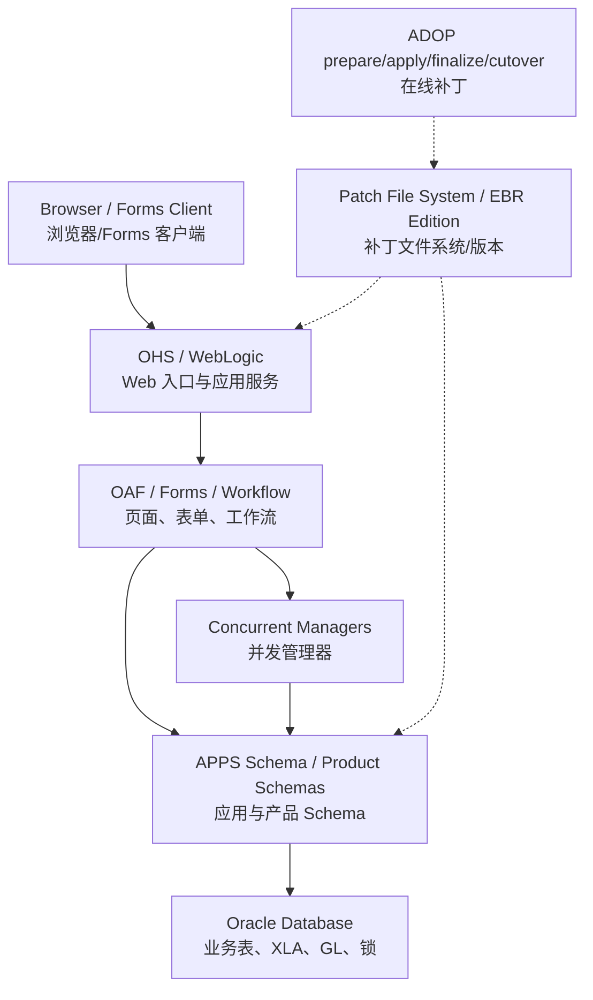
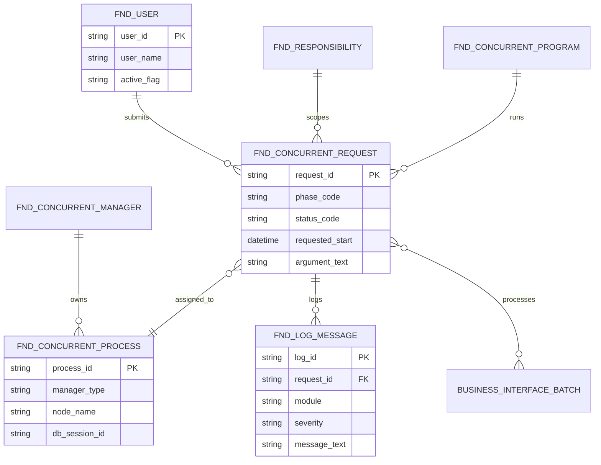
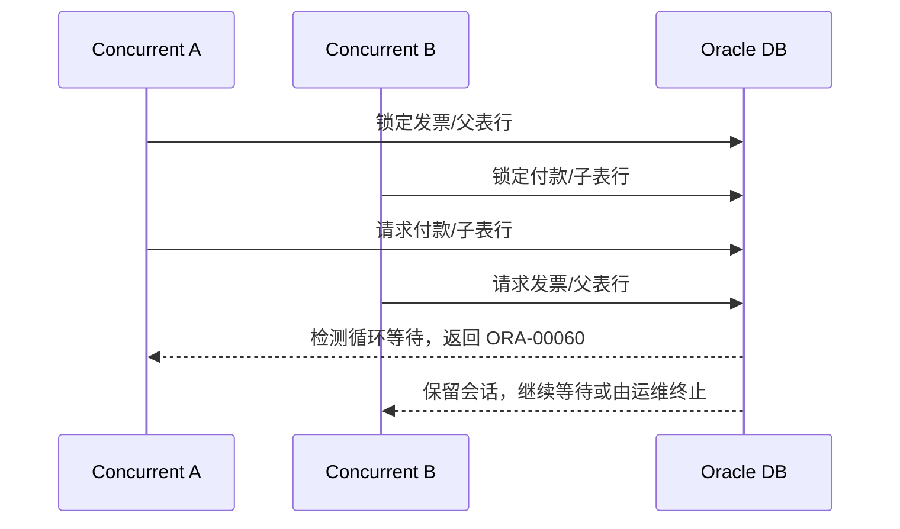
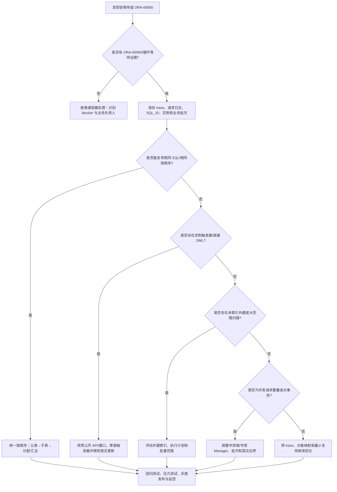

# 技术架构、开发与集成（Technical Architecture, Development and Integration）

> 技术顾问需要同时理解 EBS 三层架构、R12.2 在线补丁、数据模型、标准扩展点、接口状态机、安全和可运维性。

## 阅读导航

- [架构](#2-r122-架构心智模型) · [扩展与数据](#3-扩展方案优先级) · [接口 API](#5-接口与-api-设计) · [并发与页面](#6-concurrent-processing) · [ADOP 发布](#8-adop-发布周期) · [性能安全](#9-性能与故障证据包) · [死锁排查](#11-死锁排查与解决方法) · [技术专题](#13-技术专题详解)

## 技术架构图与技术对象 ER 图

### R12.2 三层及发布架构



### 技术对象 ER 图



该 ER 图用于并发、日志和权限追溯；具体列、状态值和 OAM 页面字段须以目标 R12.2 补丁级别确认。

## 1. 学习目标

应能判断请求运行在哪一层，选择标准接口/API/页面扩展方案，设计可重跑集成，定位 Concurrent、Workflow、OAF 和数据库问题，并按 ADOP/EBR 要求安全发布。

## 2. R12.2 架构心智模型

| 层 | 主要组件 | 诊断证据 |
| --- | --- | --- |
| 客户端 | 浏览器、Java Web Start/Forms 客户端（依实例） | 浏览器/Java 日志、URL、用户与职责 |
| 应用层 | Oracle HTTP Server、WebLogic、OAF、Forms、Concurrent Managers | 服务日志、请求日志、配置、节点状态 |
| 数据库层 | Oracle Database、APPS schema、产品 schema、EBR editions | 会话、对象、SQL、无效对象、警报日志 |

R12.2 使用 Online Patching（在线补丁）和 Edition-Based Redefinition。应用文件系统通常有 run/patch 双文件系统；数据库对象要遵守 editioned/non-editioned 对象规则。不要把传统单文件系统发布方式直接用于 R12.2。

## 3. 扩展方案优先级

1. 标准配置、Profile Option（配置文件选项）和 Personalization（个性化）。
2. 标准 Open Interface、Public API、Business Event 或 Integration Repository 服务。
3. BI Publisher、FSG、Web ADI 等标准工具。
4. 受控的 OAF/Forms/Workflow 扩展。
5. 自定义程序和对象，采用自定义前缀、独立 schema/目录、版本控制和发布包。

禁止直接修改 Oracle 标准代码或直接 DML 业务基表。任何扩展都要说明升级影响、权限、审计、性能、回退和支持边界。

## 4. 数据模型与查询方法

先从业务主键和文档号定位交易，再到分配、会计和 GL；不要从大表无条件扫描。R12 常见 `_ALL` 表含 `ORG_ID`，但数据隔离方式因产品而异。视图可能应用安全上下文；技术诊断要明确是查基表、视图还是公开 API。

安全查询原则：只读、绑定变量、限制 Ledger/OU/期间/主键、先看执行计划、避免在生产高峰运行重查询、输出敏感字段脱敏。表名和列需由目标实例数据字典确认。

## 5. 接口与 API 设计

### 5.1 标准接口状态机

```text
Received → Validated → Staged → Submitted → Imported
         ↘ Rejected                 ↘ Partially Succeeded
→ Accounted → Reconciled → Archived
```

接口表、业务导入和会计是不同阶段。设计需包含业务唯一键、批次/行号、控制总额、原始载荷引用、状态、错误码、请求 ID、重试次数和下游业务主键。

### 5.2 幂等与重放

Idempotency（幂等）表示同一业务消息重复到达不会产生重复业务结果。使用来源系统 + 来源业务键 + 版本作为唯一性依据；重跑应处理完全失败、部分成功和回执丢失三种情况。不要把清空接口表作为恢复策略。

## 6. Concurrent Processing

Concurrent Program（并发程序）由可执行文件、程序定义、参数、请求组和 Manager 共同运行。排查按请求状态、实际开始/结束时间、Manager、日志/输出、参数、数据库会话和后续请求顺序进行。Pending 不等于程序错误；可能是 Manager 未启用、专业化规则、冲突域或资源等待。

自定义程序应正确设置 completion status，记录批次和关键统计，不在日志输出凭据/完整敏感数据，并支持明确的重跑边界。

## 7. Workflow、AME、OAF 与 Forms

Workflow（工作流）处理业务流程和通知；Approvals Management Engine（审批管理引擎，AME）计算审批规则；Oracle Application Framework（Oracle 应用框架，OAF）构建 HTML 页面；Forms 服务传统表单。排查审批需区分规则未生成审批人、工作流活动错误、通知投递失败和用户权限问题。

个性化应记录页面/功能、触发条件、层级和版本；高复杂逻辑不要堆在 Personalization 中。OAF/Forms 扩展必须验证升级和在线补丁兼容性。

## 8. ADOP 发布周期

典型阶段为 `prepare → apply → finalize → cutover → cleanup`，必要时包含 abort/actualize_all 等受控操作，具体命令和参数以实例运维标准及 Oracle 文档为准。发布前确认补丁文件系统同步、磁盘、无效对象、服务和备份/回退；cutover 是业务影响点，应有窗口、监控和验收。

自定义数据库变更需评估 EBR：editioned 对象、cross-edition trigger、同义词和授权。发布包必须可重复、可审计并区分 run/patch 文件系统。

## 9. 性能与故障证据包

证据至少包括实例/节点、时间、用户/职责、业务主键、请求 ID、错误原文、日志路径、相关 SQL ID/会话、影响数量和最近变更。性能问题先量化响应时间和资源，再判断 SQL、锁、并发配置、应用服务或外部依赖；不要先重启服务掩盖证据。

## 10. 安全基线

- 最小权限、职责分离、凭据集中管理和定期访问复核。
- 不在代码、参数、日志或仓库保存密码和完整银行/个人信息。
- 自定义对象授权给受控角色，不直接广泛授权 APPS。
- 输入验证、绑定变量、输出编码和文件路径白名单。
- 生产变更需批准、测试、备份/回退和审计记录。

## 11. 死锁排查与解决方法

### 11.1 死锁与普通阻塞的区别

`ORA-00060: deadlock detected while waiting for resource` 表示数据库检测到会话之间形成循环等待。Oracle 会回滚触发错误的那条语句（不是自动回滚整个业务事务），并在诊断 trace 中记录涉及的事务和资源；应先保留 trace，再判断是否需要重试。官方错误说明要求检查 trace 文件以确认冲突事务和资源，见 [Oracle Database Error Help — ORA-00060](https://docs.oracle.com/en/error-help/db/ora-00060/?r=19c)。

| 类型 | 典型形态 | 处理重点 |
| --- | --- | --- |
| 普通阻塞（blocking） | 一个会话持有锁，其他会话排队等待；提交/回滚后通常可继续 | 找出 blocker、业务负责人和预计结束时间；不要把所有等待都判定为死锁 |
| 死锁（deadlock） | A 等 B 持有的锁，同时 B 等 A 持有的锁，形成闭环 | 保留 ORA-00060 trace、请求日志和 SQL；修复锁顺序、触发器、索引或并发调度 |
| 长事务（long transaction） | 没有循环，但锁持有时间过长，导致大量等待 | 缩小批次和事务范围，调整提交边界，优化 SQL 与批处理窗口 |

死锁不等于“某个会话很慢”。如果只有一个 blocker、没有等待环，优先按阻塞事件处理；如果日志中出现 ORA-00060 或 trace 显示循环资源，再进入死锁流程。

### 11.2 EBS 常见死锁模型

EBS 中的锁通常由标准 API、并发程序、Forms/OAF 页面、Workflow 活动、定制触发器或直接 SQL 共同产生。最常见的根因是两个程序以相反顺序更新同一业务对象的父子行、跨模块分配行或接口批次行。



常见模型包括：

- AP 发票验证、付款选择或自定义更新同时触碰发票、付款计划和分配行。
- AR AutoInvoice、收款核销、客户余额更新与自定义客户/订单触发器锁定顺序不一致。
- Inventory/WIP 成本处理、GL 导入和报表抽取同时更新接口批次或汇总控制行。
- 自定义触发器在更新主表时反查或更新另一张业务表，隐式改变锁顺序。
- 父表被更新/删除而子表外键无索引，导致更大范围的 TM 表锁等待；这可能表现为阻塞，也可能放大死锁概率。
- RAC（Real Application Clusters，集群）跨实例访问同一对象，出现全局缓存等待；必须记录实例号，不能只看单节点会话。

### 11.3 现场证据收集（先保留证据）

发生生产事件时先建立时间线，记录时区、数据库实例/节点、业务批次和最近发布。除非已经确认业务影响且完成最小证据采集，不要立即杀会话、重启数据库或盲目重跑。

1. 记录错误原文、首次/最近发生时间、用户、职责、模块、业务单号、批次号和影响数量。
2. 记录 Concurrent Request ID、程序名/短名、参数、父请求、请求集、Manager、节点、日志和输出文件路径。
3. 保存数据库会话的 `SID`、`SERIAL#`、实例号、`SQL_ID`、模块（`MODULE`）和动作（`ACTION`），以及 ORA-00060 trace/alert 日志位置。
4. 在 EBS 页面打开 **System Administrator → Concurrent → Requests**，按 Request ID 查看阶段/状态、日志和输出；必要时通过 OAM 的并发请求监控查看运行会话与诊断信息。R12.2 并发请求生命周期和 OAM 入口可参考 [Oracle E-Business Suite Setup Guide](https://docs.oracle.com/cd/E26401_01/doc.122/e22953/T174296T575591.htm) 与 [Oracle E-Business Suite Maintenance Guide](https://docs.oracle.com/cd/E26401_01/doc.122/e22954/T202991T221119.htm)。
5. 保存最近一次 ADOP、配置、触发器、索引、并发调度或接口版本变更，避免只根据单次重跑结果下结论。

### 11.4 只读诊断 SQL

以下 SQL 仅用于诊断，使用绑定变量并限制时间/对象范围。`GV$` 视图需要相应数据库权限；单实例可改用 `V$`。不同补丁级别的列可能略有差异，执行前用数据字典确认。不要把诊断 SQL 直接改造成生产 DML。

**1）当前等待与阻塞会话**

```sql
select s.inst_id,
       s.sid,
       s.serial#,
       s.username,
       s.status,
       s.event,
       s.seconds_in_wait,
       s.blocking_instance,
       s.blocking_session,
       s.sql_id,
       s.module,
       s.action
  from gv$session s
 where s.blocking_session is not null
    or s.event like 'enq: TX%'
    or s.event like 'enq: TM%';
```

`enq: TX` 常与行级事务锁相关，`enq: TM` 常与表级 DML 锁相关；等待事件本身不能证明已经形成死锁。

**2）锁模式与持有时间**

```sql
select l.inst_id,
       l.sid,
       l.type,
       l.id1,
       l.id2,
       l.lmode,
       l.request,
       l.ctime,
       l.block,
       s.serial#,
       s.sql_id
  from gv$lock l
  join gv$session s
    on s.inst_id = l.inst_id
   and s.sid = l.sid
 where l.request > 0
    or l.block = 1
 order by l.inst_id, l.ctime desc;
```

将 `ID1/ID2`、对象和会话对应起来，再回到业务单号和并发请求；不要只凭 `SID` 猜测业务归属。

**3）关联 EBS 并发请求**

```sql
select r.request_id,
       r.phase_code,
       r.status_code,
       r.concurrent_program_id,
       r.argument_text,
       r.oracle_session_id
  from fnd_concurrent_requests r
 where r.request_id in (:p_request_id_1, :p_request_id_2);
```

`ORACLE_SESSION_ID` 在部分环境可能为空或受配置影响；应结合 OAM、请求日志和数据库会话时间交叉确认，而不是把空值当成“没有数据库会话”。

**4）数据库级 blocker/waiter 快照**

```sql
select holding_session, mode_held
  from dba_blockers;
select waiting_session, holding_session, lock_type,
       mode_requested
  from dba_waiters;
```

这两个视图需要 DBA 权限，且主要反映当前快照；死锁已结束后应以 trace、ASH（如已授权）和应用日志为主。

**5）短时间历史（需确认许可与保留期）**

```sql
select sample_time,
       session_id,
       session_serial#,
       sql_id,
       event,
       blocking_session
  from v$active_session_history
 where sample_time >= systimestamp - interval '15' minute
   and event like 'enq:%'
 order by sample_time;
```

ASH/AWR/SQL Monitor 的可用性、许可和保留时间需由 DBA 确认；不能因为查询不到历史就认定事件没有发生。

### 11.5 解决决策树



### 11.6 生产止血与恢复

- 先判断影响范围和是否仍在扩大：暂停冲突的接口/请求集，保留请求日志和数据库证据。
- 由业务负责人和 DBA 共同确认 blocker；需要取消或终止请求时，优先使用 **Requests** 窗口的 `Cancel`/`Terminate`，并记录审批、Request ID 和回滚耗时。不要按用户名或 SID 随机终止会话。
- RAC 环境先确认实例，再在正确节点处理；跨实例锁等待不能只重启单个应用节点。
- 终止会话后等待 Oracle 回滚完成，再核对接口批次、控制总额、会计状态和下游回执；不要直接删除接口行或手工改状态。
- 重跑前确认程序是否幂等、失败语句是否只回滚了语句、业务事务是否已提交部分结果，并使用原业务唯一键防止重复单据。
- 数据库重启不是首选止血手段；只有在 DBA 按灾备/变更流程评估后才可使用。

### 11.7 根因修复与预防

1. **统一锁顺序**：为每个定制事务写明对象顺序（例如父表、明细、分配、汇总），所有 API、触发器和批处理遵守同一顺序。
2. **缩短事务**：缩小批次、减少无关查询和外部调用，设置合理提交边界；不要在通用 API 内部擅自 `COMMIT`，由事务所有者决定提交。
3. **优先标准入口**：使用公开 API、Open Interface、业务事件或标准并发程序；直接 DML 可能绕过校验、锁顺序和 SLA。
4. **审查触发器与索引**：识别隐式更新链；对经常参与父子更新/删除的外键评估索引，并用执行计划验证实际效果。
5. **调整并发调度**：为互斥程序设置 Incompatibility/Conflict Domain 或专用 Manager，避免同一业务键同时被多个请求处理；调度规则要能解释并可审计。
6. **设计可控重试**：只对可证明幂等的事务做有限次数、指数退避重试；每次重试记录原 Request ID、尝试次数和最终状态，禁止无限重试掩盖根因。
7. **按 ADOP 发布**：触发器、索引、PL/SQL、并发定义等变更纳入 R12.2 Online Patching/EBR 流程，在测试环境完成并发压力和回滚验证。
8. **建立监控基线**：监控 ORA-00060 次数、`enq: TX/TM` 等待、请求重试率、长事务时长和特定业务键冲突，设置阈值与责任人。

### 11.8 复盘模板

| 字段 | 应记录内容 |
| --- | --- |
| incident_id / 时间 | 事件编号、首次/恢复时间、时区、实例/节点 |
| 请求与会话 | Request ID、程序/短名、参数、SID/SERIAL#、SQL_ID、模块/动作 |
| 冲突对象 | 表/索引/事务资源、父子关系、锁模式、trace 文件 |
| 业务影响 | 单据/批次、数量、会计状态、接口状态、是否重复或漏处理 |
| 止血措施 | 暂停请求、取消/终止、回滚完成时间、数据核对结果 |
| 根因与修复 | 锁顺序、触发器、外键索引、长事务、调度冲突或产品缺陷 |
| 验证与预防 | 重现脚本、压力测试、发布版本、监控指标、责任人与截止日期 |

### 11.9 官方依据

- [Oracle Database Error Help — ORA-00060](https://docs.oracle.com/en/error-help/db/ora-00060/?r=19c)
- [Oracle E-Business Suite Setup Guide — Concurrent Processing](https://docs.oracle.com/cd/E26401_01/doc.122/e22953/T174296T575591.htm)
- [Oracle E-Business Suite Maintenance Guide — OAM 与会话监控](https://docs.oracle.com/cd/E26401_01/doc.122/e22954/T202991T221119.htm)

## 12. 建议练习

- 追踪一个 Concurrent Request 从提交到数据库会话和日志。
- 为 AP 发票接口设计状态、幂等键、部分成功恢复和监控指标。
- 把一个数据库对象和并发程序按 R12.2 ADOP 方式打包并在测试环境验证。
- 从业务单据追溯 XLA/GL，再从 GL 反查来源。

## 13. 技术专题详解


<!-- source: docs/09-technical/README.md -->
<a id="src-docs-09-technical-readme"></a>
### EBS R12.2 技术、集成与运维


本目录覆盖 R12.2 技术开发和生产运行的公共规范。业务模块接口文档描述产品入口；本目录定义接口选型、并发程序、PL/SQL、Workflow、OAF/Forms、迁移、EBR/ADOP、性能、安全和可观测性的共性边界。

<a id="src-docs-09-technical-readme--专题导航"></a>
#### 专题导航

- [开放接口、API、报表与迁移](#src-docs-09-technical-integration)
- [技术接口实现手册](#src-docs-09-technical-interfaces)
- [数据模型与元数据](#src-docs-09-technical-data-model)
- [Concurrent Program](#src-docs-09-technical-concurrent-programs)
- [PL/SQL、Forms、Personalization 与 OAF 定制](#src-docs-09-technical-customization)
- [性能、权限审计与生产运维](#src-docs-09-technical-operations)
- [R12.2 ADOP、EBR 与发布治理](#src-docs-09-technical-adop-ebr-release)
- [Workflow、AME、OAF/Forms 与迁移治理](#src-docs-09-technical-workflow-ame-oaf-governance)
- [FND、Concurrent、Workflow 表](#src-docs-09-technical-tables)

<a id="src-docs-09-technical-readme--r122-不可省略的边界"></a>
#### R12.2 不可省略的边界

1. 定制对象和部署必须遵循 Edition-Based Redefinition 与 Online Patching（ADOP）约束；不得以覆盖 Oracle 标准文件或直接修改标准对象作为常规交付方式。
2. 支持写入的路径依次为标准页面、公开 API、Open Interface、Integration Repository/ISG 和客户自定义对象；禁止直接 DML EBS 业务基表修复数据。
3. 接口应具备幂等键、状态机、错误分类、审计相关号、最小权限、监控、重试上限和人工补偿入口。
4. 性能问题先以并发请求、日志、SQL 执行计划和应用上下文定位；AWR、ASH、SQL Monitor 等能力须确认数据库许可证。

<a id="src-docs-09-technical-readme--官方依据"></a>
#### 官方依据

- [Oracle E-Business Suite Technology Documentation](https://docs.oracle.com/cd/E26401_01/nav/technology.htm)
- [Oracle E-Business Suite Maintenance Guide](https://docs.oracle.com/cd/E26401_01/doc.122/e22954/toc.htm)


<!-- source: docs/09-technical/adop-ebr-release.md -->
<a id="src-docs-09-technical-adop-ebr-release"></a>
### R12.2 Online Patching、EBR 与发布治理


<a id="src-docs-09-technical-adop-ebr-release--核心原则"></a>
#### 核心原则

R12.2 使用 Online Patching（ADOP）与 Edition-Based Redefinition（EBR）降低在线补丁对业务的影响，但并不意味着自定义对象可以任意创建、修改或直接在生产库修复。每次交付均应识别对象类型、Edition 属性、依赖、部署方式、回滚策略和验证证据。

<a id="src-docs-09-technical-adop-ebr-release--adop-生命周期"></a>
#### ADOP 生命周期

```text
Prepare → Apply → Finalize → Cutover → Cleanup
                         ↘ 必要时按 Oracle 受支持流程 Abort/Recover
```

| 阶段 | 目标 | 发布控制 |
| --- | --- | --- |
| Prepare | 建立 Patch 文件系统与同步前提 | 检查环境健康、磁盘、服务、已有会话和未完成周期 |
| Apply | 应用 Oracle/自定义补丁 | 记录 patch 日志、失败对象、依赖、重跑范围 |
| Finalize | 将耗时工作前置 | 评估业务窗口、并发请求、OPP/Workflow/接口影响 |
| Cutover | 切换运行文件系统/Edition | 设置冻结、变更窗口、健康检查、业务签字与回退判定 |
| Cleanup | 清理旧版定义 | 归档日志、更新基线、完成回归与配置对比 |

<a id="src-docs-09-technical-adop-ebr-release--自定义交付清单"></a>
#### 自定义交付清单

1. 源码、数据库对象、Forms/OAF、报表、FND 注册、Workflow、Profile/Lookup 分别建立受版本控制的迁移工件。
2. 自定义数据库对象使用独立 schema、最小授权和受支持 synonym/grant；不得直接修改 Oracle 标准对象。
3. 在开发、测试、预生产完成 ADOP 演练，验证在线/切换窗口、并发程序、接口、会计和核心报表。
4. 发布包应具有唯一版本、依赖清单、校验 SQL、回滚/补偿方案、日志位置和责任人。

<a id="src-docs-09-technical-adop-ebr-release--只读诊断-sql"></a>
#### 只读诊断 SQL

```sql
-- 检查自定义对象的有效性；不要在生产直接编译 Oracle 标准对象作为常规修复。
select owner,
       object_type,
       object_name,
       status,
       last_ddl_time
  from all_objects
 where owner = upper(:p_custom_schema)
   and status <> 'VALID'
 order by object_type, object_name;

-- 用数据字典复核对象/列，再决定补丁脚本的兼容性。
select owner, table_name, column_name, data_type, data_length
  from all_tab_columns
 where owner = upper(:p_owner)
   and table_name = upper(:p_table_name)
 order by column_id;
```

<a id="src-docs-09-technical-adop-ebr-release--常见问题"></a>
#### 常见问题

- 只在 Run 文件系统修改文件：下一个 ADOP 周期可能被覆盖，且无法形成可部署基线。
- 直接在生产补数据或编译：可能绕过 Edition、审计和回退设计；应改用受支持 API、补丁或 Oracle Support 方案。
- Cutover 后接口/并发异常：按发布清单检查服务、context、custom library/报表、注册定义、日志与依赖，而不是盲目重跑整批业务。

<a id="src-docs-09-technical-adop-ebr-release--官方参考"></a>
#### 官方参考

- [Oracle E-Business Suite Maintenance Guide](https://docs.oracle.com/cd/E26401_01/doc.122/e22954/toc.htm)
- [Oracle E-Business Suite Technology Documentation](https://docs.oracle.com/cd/E26401_01/nav/technology.htm)


<!-- source: docs/09-technical/concurrent-programs.md -->
<a id="src-docs-09-technical-concurrent-programs"></a>
### Concurrent Program、请求集与日志排错


<a id="src-docs-09-technical-concurrent-programs--架构"></a>
#### 架构

```text
Submit Request → FND_CONCURRENT_REQUESTS(Pending)
→ ICM/Service Manager → Target Manager
→ Worker Process → Executable
→ Log/Output → OPP（XML/PDF/Excel 后处理）
→ Completed Normal/Warning/Error
```

Concurrent Program 关联 Executable、Parameters/Value Sets、Incompatibility、Request Group、Output Format、Printer/Style。Request Set 用 Stage 和 Link 组合多程序，需考虑失败分支、参数默认和重启。

R12.2 在 Online Patching 时使用 `ADZDPATCH` 协调不兼容程序；不要为了让 adop 继续而随意终止 ICM/ADZDPATCH。

<a id="src-docs-09-technical-concurrent-programs--sql"></a>
#### SQL

```sql
SELECT r.request_id, r.parent_request_id,
       cp.user_concurrent_program_name,
       r.phase_code, r.status_code, r.hold_flag,
       r.requested_start_date, r.actual_start_date,
       r.actual_completion_date, r.argument_text,
       r.concurrent_process_id, r.oracle_process_id,
       r.logfile_name, r.outfile_name
  FROM fnd_concurrent_requests r
  JOIN fnd_concurrent_programs_vl cp
    ON cp.concurrent_program_id = r.concurrent_program_id
   AND cp.application_id = r.program_application_id
 WHERE r.request_id = :p_request_id;

SELECT q.concurrent_queue_name, q.user_concurrent_queue_name,
       q.node_name, q.running_processes, q.max_processes,
       q.enabled_flag, q.control_code
  FROM fnd_concurrent_queues_vl q
 ORDER BY q.user_concurrent_queue_name;

SELECT request_id, phase_code, status_code,
       requested_start_date, actual_start_date,
       actual_completion_date
  FROM fnd_concurrent_requests
 WHERE phase_code IN ('P','R')
 ORDER BY requested_start_date;
```

<a id="src-docs-09-technical-concurrent-programs--排错"></a>
#### 排错

- Pending/Standby：查 Requested Start、Hold、Manager Specialization、Incompatibility、Parent Request、Manager Processes、Node/Work Shift。
- Running 过久：查日志最后进度、DB Session/Wait/Blocking、参数数据量和子请求；先评估 Cancel/Terminate 业务后果。
- Completed Error：从日志第一个有意义的 ORA-/APP-/Exception 开始，不只看最后的通用错误。
- OPP 超时/无输出：查 Data Engine 输出大小、Template/Locale、OPP Service/Thread、Heap、Temporary Directory、Font 和巨大 XML。
- Manager 异常：通过 OAM/标准脚本管理，保留 ICM/Manager/Service Manager 日志，不直接改 FND Queue/Request 状态。

<a id="src-docs-09-technical-concurrent-programs--关联"></a>
#### 关联

- [Operations](#src-docs-09-technical-operations)
- [Integration](#src-docs-09-technical-integration)


<!-- source: docs/09-technical/customization.md -->
<a id="src-docs-09-technical-customization"></a>
### PL/SQL、Forms、Personalization 与 OAF 定制


<a id="src-docs-09-technical-customization--r122-定制原则"></a>
#### R12.2 定制原则

- 优先级：标准设置 > Personalization/Extension > Published API/Open Interface > 经评审的定制；禁止修改 Oracle seeded 源码和基表。
- 自定义对象使用客户前缀/Schema，通过 APPS Synonym/Grant 接入，所有 DDL 满足 Edition-Based Redefinition（EBR）。
- 数据库对象变更通过 `adop` Online Patching 周期发布，开发环境执行一致性/在线补丁检查。
- Forms Personalization 用于可见性、默认、验证和菜单动作；CUSTOM.pll 仅在 Personalization 无法实现时使用。
- OAF 使用 Personalization 或 Controller Extension，不修改 seeded XML/Java；扩展需评估升级/补丁兼容。

<a id="src-docs-09-technical-customization--plsql-标准"></a>
#### PL/SQL 标准

1. 公开 API 前初始化 FND/MOAC 上下文，传入 `p_api_version/p_init_msg_list/p_commit`。
2. 尊重 API 交易边界，默认由调用者 Commit/Rollback，不在底层工具函数隐式提交。
3. 读取 `x_return_status/x_msg_count/x_msg_data` 及 Message Stack，日志记录业务键而非敏感数据。
4. SQL 使用 Bind、明确组织/账簿条件、批量处理和可重启设计，避免 Row-by-row 大批量处理。

<a id="src-docs-09-technical-customization--诊断-sql"></a>
#### 诊断 SQL

```sql
SELECT owner, object_name, object_type, status, edition_name
  FROM all_objects
 WHERE object_name = UPPER(:p_object_name)
 ORDER BY owner, object_type;

SELECT owner, name, type, line, position, text
  FROM all_errors
 WHERE name = UPPER(:p_object_name)
 ORDER BY owner, type, sequence;

SELECT lookup_type, lookup_code, meaning, enabled_flag,
       start_date_active, end_date_active
  FROM fnd_lookup_values_vl
 WHERE lookup_type = :p_lookup_type
 ORDER BY lookup_code;
```

<a id="src-docs-09-technical-customization--排错"></a>
#### 排错

- 补丁后定制失效：检查 Invalid Objects、API Signature/View Columns 变更、Synonym/Grant、OAF Extension 兼容和 adop 日志。
- Personalization 不生效：查 Function/Form/Page Context、Level/Sequence/Condition、字段名、缓存，使用 Diagnostics 验证实际项。
- API 返回 Error：打印完整 Message Stack、输入 ID/OU/User/Responsibility、前置状态，不只记 `SQLERRM`。
- ORA-04061/4068：可能是 Package 重编译导致会话状态失效，重建会话并检查发布是否遵循 Online Patching。

<a id="src-docs-09-technical-customization--关联"></a>
#### 关联

- [Data Model](#src-docs-09-technical-data-model)
- [Operations](#src-docs-09-technical-operations)


<!-- source: docs/09-technical/data-model.md -->
<a id="src-docs-09-technical-data-model"></a>
### EBS R12.2 数据模型与常用表


<a id="src-docs-09-technical-data-model--建模约定"></a>
#### 建模约定

- `_ALL` 通常包含 OU 级数据并带 `ORG_ID`；`_B` 为基表，`_TL` 为翻译，`_VL` 常为基表+当前语言视图，`_F` 常为 DateTrack，`_INTERFACE` 为接口，`_TEMP/_GT` 可为临时数据。
- WHO 列：`CREATION_DATE/CREATED_BY/LAST_UPDATE_DATE/LAST_UPDATED_BY/LAST_UPDATE_LOGIN`。
- ID 应作为关联键，业务编号用于显示；多 OU 关联还要核对 `ORG_ID`。
- 历史表通常使用 Effective/Ineffective Date 或 Current Flag，不能在无日期条件时当作当前值。
- APPS 通过 Synonym/View/Package 访问产品 Schema。R12.2 定制对象必须遵循 Editioning/Online Patching 标准。

<a id="src-docs-09-technical-data-model--模块速查"></a>
#### 模块速查

| 模块 | 主要对象 |
| --- | --- |
| FND | `FND_USER`, `FND_RESPONSIBILITY_VL`, `FND_CONCURRENT_REQUESTS`, `FND_PROFILE_OPTION_VALUES` |
| HR/ORG | `HR_ALL_ORGANIZATION_UNITS`, `HR_OPERATING_UNITS`, `ORG_ORGANIZATION_DEFINITIONS` |
| TCA | `HZ_PARTIES`, `HZ_CUST_ACCOUNTS`, `HZ_PARTY_SITES`, `HZ_LOCATIONS` |
| GL | `GL_LEDGERS`, `GL_CODE_COMBINATIONS`, `GL_JE_*`, `GL_BALANCES`, `GL_INTERFACE` |
| XLA | `XLA_TRANSACTION_ENTITIES`, `XLA_EVENTS`, `XLA_AE_HEADERS`, `XLA_AE_LINES` |
| AP | `AP_SUPPLIERS`, `AP_INVOICES_ALL`, `AP_INVOICE_DISTRIBUTIONS_ALL`, `AP_CHECKS_ALL` |
| AR | `RA_CUSTOMER_TRX_ALL`, `AR_PAYMENT_SCHEDULES_ALL`, `AR_CASH_RECEIPTS_ALL` |
| PO/RCV | `PO_HEADERS_ALL`, `PO_DISTRIBUTIONS_ALL`, `RCV_TRANSACTIONS` |
| OM/WSH | `OE_ORDER_HEADERS_ALL`, `OE_ORDER_LINES_ALL`, `WSH_DELIVERY_DETAILS` |
| INV/CST/WIP | `MTL_SYSTEM_ITEMS_B`, `MTL_MATERIAL_TRANSACTIONS`, `CST_ITEM_COSTS`, `WIP_ENTITIES` |
| FA | `FA_ADDITIONS_B`, `FA_BOOKS`, `FA_DISTRIBUTION_HISTORY`, `FA_DEPRN_SUMMARY` |
| CE/Tax | `CE_BANK_ACCOUNTS`, `CE_STATEMENT_*`, `ZX_LINES` |

<a id="src-docs-09-technical-data-model--元数据-sql"></a>
#### 元数据 SQL

```sql
SELECT owner, object_name, object_type, status
  FROM all_objects
 WHERE object_name = UPPER(:p_object_name)
 ORDER BY owner, object_type;

SELECT owner, table_name, column_id, column_name,
       data_type, data_length, nullable
  FROM all_tab_columns
 WHERE table_name = UPPER(:p_object_name)
 ORDER BY owner, column_id;

SELECT owner, synonym_name, table_owner, table_name, db_link
  FROM all_synonyms
 WHERE synonym_name = UPPER(:p_object_name);

SELECT acc.owner, acc.constraint_name, acc.table_name,
       acc.column_name, ac.constraint_type,
       ac.r_owner, ac.r_constraint_name
  FROM all_cons_columns acc
  JOIN all_constraints ac
    ON ac.owner = acc.owner
   AND ac.constraint_name = acc.constraint_name
 WHERE acc.table_name = UPPER(:p_table_name)
 ORDER BY acc.constraint_name, acc.position;
```

<a id="src-docs-09-technical-data-model--原则与排错"></a>
#### 原则与排错

- 先用 eTRM/`ALL_*` 确认对象、列、同义词和约束，不凭记忆跨版本写 SQL。
- 查询必须包含组织/账簿、主键或日期范围，对大表先看执行计划。
- 不直接 DML 基表；使用标准 Form/OAF、Open Interface 或 Published API，数据修复走 Oracle Support。
- 不使用 `SELECT *`、隐式日期转换和字符串拼 SQL；使用显式列、绑定变量和 ANSI Join。

<a id="src-docs-09-technical-data-model--关联"></a>
#### 关联

- [FND、Concurrent、Workflow 与运维常用表](#src-docs-09-technical-tables)
- [Integration](#src-docs-09-technical-integration)
- [Operations](#src-docs-09-technical-operations)


<!-- source: docs/09-technical/integration.md -->
<a id="src-docs-09-technical-integration"></a>
### 开放接口、API、报表与数据迁移


> Concurrent Worker、标准 API 模板、ISG REST、重试与可观测性代码见 [技术接口实现手册](#src-docs-09-technical-interfaces)。

<a id="src-docs-09-technical-integration--选型原则"></a>
#### 选型原则

| 方式 | 适用场景 | 控制要点 |
| --- | --- | --- |
| Open Interface + Import | 高吞吐异步批量 | Group/Source、拒绝表、幂等、可重启 |
| Published PL/SQL API | 同步单笔/小批量 | FND/MOAC Context、Message Stack、Commit 边界 |
| Business Event/Workflow | 事件驱动 | Event Key、Subscription Phase、重试/错误队列 |
| Integrated SOA Gateway | SOAP/REST 暴露 EBS 接口 | Authentication、Grant、MOAC、限流/审计 |
| XML Gateway/EDI | B2B 标准消息 | Trading Partner、Map、Transaction Type、ACK |
| BI Publisher/Concurrent | 报表/文件 | Data Definition、Template、Locale、OPP/Output |

<a id="src-docs-09-technical-integration--接口分层"></a>
#### 接口分层

```text
Source → Landing（原始不可变）
→ Staging（标准化/验证/幂等）
→ EBS Interface/API（标准业务验证）
→ Base Transaction → Accounting
→ Reconciliation/Acknowledgement/Archive
```

每条数据保存 Source System、External Key、Batch/Correlation ID、ORG_ID/Ledger、Payload Hash、Status、Retry Count、Request ID、EBS Transaction ID、Error Code/Message。技术重试必须幂等，业务驳回需修正后重提，不应无限自动重试。

<a id="src-docs-09-technical-integration--sql"></a>
#### SQL

```sql
-- 并发请求跟踪
SELECT request_id, parent_request_id, phase_code, status_code,
       argument_text, actual_start_date, actual_completion_date,
       logfile_name, outfile_name
  FROM fnd_concurrent_requests
 WHERE request_id = :p_request_id;

-- Workflow 事件/活动跟踪；生产查询必须限定 Item Type/Key
SELECT item_type, item_key, begin_date, end_date,
       root_activity, root_activity_version
  FROM wf_items
 WHERE item_type = :p_item_type
   AND item_key = :p_item_key;

SELECT item_type, item_key, process_activity,
       activity_status, activity_result_code,
       begin_date, end_date, error_name, error_message
  FROM wf_item_activity_statuses
 WHERE item_type = :p_item_type
   AND item_key = :p_item_key
 ORDER BY begin_date;
```

<a id="src-docs-09-technical-integration--迁移清单"></a>
#### 迁移清单

1. 数据 Profile/清洗/映射，确定历史深度和未结业务边界。
2. 按主数据→期初余额→未结交易→历史的依赖顺序导入。
3. 多轮 Mock，每轮保存输入、拒绝、数量/金额对账、性能和时间。
4. Cutover 冻结、Delta、业务签字和回退标准必须事先定义。

<a id="src-docs-09-technical-integration--排错"></a>
#### 排错

- 先定位 Landing/Staging/EBS Interface/Import/Base/Accounting 断点，再查对应状态。
- 重复：检查 External Key/Hash、超时后重试、EBS 已成功但 ACK 失败的情况。
- 部分成功：对每条保存 EBS ID/Status，仅重试失败项，不重放整批成功数据。
- 性能：使用批次、Bind/Array Processing、合理 Commit Size、并发限流，避免过度 API 单行循环。

<a id="src-docs-09-technical-integration--关联"></a>
#### 关联

- [AP Interface](03-procure-to-pay.md#src-docs-02-ap-interfaces-troubleshooting)
- [AR Interface](04-credit-to-cash.md#src-docs-03-ar-interfaces-troubleshooting)
- [Concurrent Processing](#src-docs-09-technical-concurrent-programs)


<!-- source: docs/09-technical/interfaces.md -->
<a id="src-docs-09-technical-interfaces"></a>
### Oracle EBS 技术接口实现手册


<a id="src-docs-09-technical-interfaces--1-接口方式选型"></a>
#### 1. 接口方式选型

| 方式 | 适合场景 | 调用/处理特点 | 主要风险控制 |
| --- | --- | --- | --- |
| Open Interface + Import | 高吞吐异步批量 | 先写接口表，再跑标准 Import | 幂等、Group ID、错误表、对账 |
| Published PL/SQL API | 同步单笔/小批量 | 完整业务验证和 Message Stack | FND/MOAC Context、Commit 语义 |
| ISG REST/SOAP | 对外暴露 EBS 标准能力 | Integration Repository 部署与授权 | HTTPS、Grant、限流、WADL/WSDL 版本 |
| Concurrent Program REST | 长任务/报表/批处理 | REST 仅 POST，异步返回 Request ID | 参数位置、轮询、超时、并发队列 |
| Business Event | EBS 业务事件通知 | 本地/Deferred Subscription | Event Key 幂等、Error Queue |
| Service Invocation Framework | EBS 调外部 SOAP/REST | Workflow BES + Java Deferred Agent | 证书、凭据、回调、Invocation Monitor |
| XML Gateway/EDI | B2B 标准报文 | Trading Partner、Map、ACK | 版本、字符集、签名、重复报文 |

Oracle R12.2 官方说明：PL/SQL API、Concurrent Program、Business Service Object 可暴露为 SOAP/REST；Inbound Open Interface REST 支持 POST/GET/PUT/DELETE；Concurrent Program REST 只支持 POST。自定义 Open Interface 表/视图不能直接作为 Integration Repository 的 Custom Interface 类型发布，应使用自定义 PL/SQL API 或标准接口暂存层。

<a id="src-docs-09-technical-interfaces--2-自定义-concurrent-program-worker"></a>
#### 2. 自定义 Concurrent Program Worker

<a id="src-docs-09-technical-interfaces--21-package-specification"></a>
##### 2.1 Package Specification

```sql
CREATE OR REPLACE PACKAGE xxint_worker_pkg AUTHID DEFINER AS
  PROCEDURE main(
    errbuf           OUT VARCHAR2,
    retcode          OUT NUMBER,
    p_interface_code IN  VARCHAR2,
    p_batch_size     IN  NUMBER DEFAULT 500
  );
END xxint_worker_pkg;
/
```

<a id="src-docs-09-technical-interfaces--22-package-body"></a>
##### 2.2 Package Body

```sql
CREATE OR REPLACE PACKAGE BODY xxint_worker_pkg AS
  PROCEDURE main(
    errbuf           OUT VARCHAR2,
    retcode          OUT NUMBER,
    p_interface_code IN  VARCHAR2,
    p_batch_size     IN  NUMBER DEFAULT 500
  ) IS
    CURSOR c_message IS
      SELECT message_id
        FROM xxint_messages
       WHERE interface_code = p_interface_code
         AND status_code IN ('VALIDATED', 'RETRY')
         AND NVL(next_retry_date, SYSDATE) <= SYSDATE
       ORDER BY message_id
       FOR UPDATE SKIP LOCKED;

    l_ebs_transaction_id NUMBER;
    l_request_id         NUMBER;
    l_success_count      PLS_INTEGER := 0;
    l_error_count        PLS_INTEGER := 0;
    l_processed_count    PLS_INTEGER := 0;
  BEGIN
    errbuf := NULL;
    retcode := 0;

    fnd_file.put_line(fnd_file.log,
      'Start interface=' || p_interface_code ||
      ', batch_size=' || p_batch_size);

    FOR r IN c_message LOOP
      EXIT WHEN l_processed_count >= p_batch_size;
      l_processed_count := l_processed_count + 1;
      SAVEPOINT one_message;
      BEGIN
        UPDATE xxint_messages
           SET status_code = 'SUBMITTED',
               last_update_date = SYSDATE,
               last_updated_by = fnd_global.user_id
         WHERE message_id = r.message_id;

        -- Router 内部调用 AP/AR/GL/FA/INV 的标准 API 或 Open Interface。
        xxint_router.process_message(
          p_message_id         => r.message_id,
          x_ebs_transaction_id => l_ebs_transaction_id,
          x_request_id         => l_request_id
        );

        UPDATE xxint_messages
           SET status_code = CASE
                               WHEN l_request_id IS NULL THEN 'SUCCESS'
                               ELSE 'SUBMITTED'
                             END,
               ebs_transaction_id = l_ebs_transaction_id,
               request_id = l_request_id,
               error_code = NULL,
               error_message = NULL,
               last_update_date = SYSDATE,
               last_updated_by = fnd_global.user_id
         WHERE message_id = r.message_id;

        l_success_count := l_success_count + 1;
        COMMIT;
      EXCEPTION
        WHEN OTHERS THEN
          ROLLBACK TO one_message;
          UPDATE xxint_messages
             SET status_code = CASE
                                 WHEN retry_count + 1 >= 5 THEN 'DEAD'
                                 ELSE 'RETRY'
                               END,
                 retry_count = retry_count + 1,
                 next_retry_date = SYSDATE
                   + (POWER(2, LEAST(retry_count + 1, 8)) / 1440),
                 error_code = TO_CHAR(SQLCODE),
                 error_message = SUBSTR(SQLERRM, 1, 2000),
                 last_update_date = SYSDATE,
                 last_updated_by = fnd_global.user_id
           WHERE message_id = r.message_id;
          l_error_count := l_error_count + 1;
          COMMIT;
      END;
    END LOOP;

    IF l_error_count > 0 THEN
      retcode := 1; -- Warning
      errbuf := l_error_count || ' message(s) failed';
    END IF;

    fnd_file.put_line(fnd_file.output,
      'success=' || l_success_count || ', error=' || l_error_count);
  EXCEPTION
    WHEN OTHERS THEN
      ROLLBACK;
      retcode := 2;
      errbuf := SUBSTR(SQLERRM, 1, 240);
      fnd_file.put_line(fnd_file.log,
        'Fatal error: ' || DBMS_UTILITY.format_error_backtrace);
  END main;
END xxint_worker_pkg;
/
```

R12.2 自定义数据库对象应放在自定义 Schema/APPS 同义词策略下，并通过 ADOP/Edition-Based Redefinition 合规发布。Worker 使用 `FOR UPDATE SKIP LOCKED` 支持多并发实例，并在达到批次大小后停止领取。

<a id="src-docs-09-technical-interfaces--3-标准-plsql-api-调用模板"></a>
#### 3. 标准 PL/SQL API 调用模板

```sql
DECLARE
  l_return_status VARCHAR2(1);
  l_msg_count     NUMBER;
  l_msg_data      VARCHAR2(2000);
BEGIN
  fnd_global.apps_initialize(:p_user_id, :p_resp_id, :p_resp_appl_id);
  mo_global.init(:p_application_short_name);
  mo_global.set_policy_context('S', :p_org_id);

  fnd_msg_pub.initialize;

  xx_public_api.do_business_action(
    p_api_version      => 1.0,
    p_init_msg_list    => fnd_api.g_true,
    p_commit           => fnd_api.g_false,
    p_business_key     => :p_business_key,
    x_return_status    => l_return_status,
    x_msg_count        => l_msg_count,
    x_msg_data         => l_msg_data
  );

  IF l_return_status <> fnd_api.g_ret_sts_success THEN
    FOR i IN 1 .. l_msg_count LOOP
      dbms_output.put_line(
        fnd_msg_pub.get(p_msg_index => i, p_encoded => 'F'));
    END LOOP;
    ROLLBACK;
    raise_application_error(-20060,
      'API failed: ' || SUBSTR(l_msg_data, 1, 1800));
  END IF;

  COMMIT;
END;
/
```

`XX_PUBLIC_API` 只是调用模板占位符。实际 API 名、版本、Record Type、`G_MISS_*` 默认值、是否自动 Commit，必须从当前实例 Integration Repository/Package Specification 获取。

<a id="src-docs-09-technical-interfaces--4-isg-rest-服务部署与调用"></a>
#### 4. ISG REST 服务部署与调用

<a id="src-docs-09-technical-interfaces--41-管理端步骤"></a>
##### 4.1 管理端步骤

1. 在 Integration Repository 按 Internal Name 搜索标准 API/Concurrent/Open Interface。
2. 检查方法签名、方向、生命周期状态和产品补丁说明。
3. 在 REST Web Service 页设置唯一 Service Alias，仅勾选需要的方法/HTTP Verb。
4. 设置 Authentication Type，Deploy 后为专用用户建立 Grant。
5. 从当前实例下载 WADL/XSD，生成客户端契约测试。
6. 使用最小权限职责/MOAC/Data Access Set 验证不同组织的数据隔离。

<a id="src-docs-09-technical-interfaces--42-rest-调用"></a>
##### 4.2 REST 调用

```bash
curl --fail-with-body \
  --request POST \
  --url 'https://ebs.example.com/webservices/rest/<service-alias>/<operation>/' \
  --user '<EBS_USER>' \
  --header 'Content-Type: application/json' \
  --header 'X-Correlation-ID: P2P-20260822-000001' \
  --data @request.json
```

REST Endpoint、资源路径、Context Header 和 Payload 必须从已部署服务的 WADL/XSD 获得。示例使用 ISG 支持的 HTTPS Basic Authentication，`curl` 会交互提示密码；也可按实例配置使用 EBS Security Token Cookie。Token、密码和 Cookie 不写脚本、Git 或 Concurrent Log。

<a id="src-docs-09-technical-interfaces--43-带退避的客户端示例"></a>
##### 4.3 带退避的客户端示例

```bash
#!/usr/bin/env bash
set -euo pipefail

endpoint="$1"
payload_file="$2"
correlation_id="$3"

for attempt in 1 2 3 4 5; do
  http_code="$(curl --silent --show-error \
    --output response.json \
    --write-out '%{http_code}' \
    --request POST \
    --url "$endpoint" \
    --header 'Content-Type: application/json' \
    --user "${EBS_USER:?}" \
    --header "X-Correlation-ID: $correlation_id" \
    --data "@$payload_file")"

  case "$http_code" in
    200|201|202) exit 0 ;;
    408|429|500|502|503|504) sleep "$((2 ** attempt))" ;;
    *) exit 1 ;;
  esac
done
exit 2
```

客户端只能重试确认幂等的操作。连接超时不代表 EBS 未处理，应先以业务幂等键/Request ID 查询结果；HTTP 4xx 业务/权限错误不应自动重试。

<a id="src-docs-09-technical-interfaces--5-concurrent-program-异步状态-api"></a>
#### 5. Concurrent Program 异步状态 API

```sql
SELECT fcr.request_id,
       fcr.parent_request_id,
       fcr.phase_code,
       fcr.status_code,
       fcr.actual_start_date,
       fcr.actual_completion_date,
       fcr.logfile_name,
       fcr.outfile_name,
       fcr.completion_text
  FROM fnd_concurrent_requests fcr
 WHERE fcr.request_id = :p_request_id;
```

外部 REST 接口推荐返回：

```json
{
  "correlationId": "P2P-20260822-000001",
  "requestId": 12345678,
  "status": "SUBMITTED",
  "statusUrl": "/integrations/P2P-20260822-000001"
}
```

状态查询服务将 EBS `PHASE_CODE/STATUS_CODE` 映射为 Submitted/Running/Success/Warning/Error，不直接把内部单字符状态暴露给消费者。

<a id="src-docs-09-technical-interfaces--6-ebs-调用外部-rest"></a>
#### 6. EBS 调用外部 REST

Oracle 官方 Service Invocation Framework 使用 Workflow Business Event System；PL/SQL 通过 `WF_EVENT.RAISE` 触发，Java Deferred Agent Listener 调用服务，并可在 Service Invocation Monitor 监控。

```sql
DECLARE
  l_params wf_parameter_list_t := wf_parameter_list_t();
BEGIN
  wf_event.addparametertolist(
    p_name          => 'X-Correlation-ID',
    p_value         => :p_correlation_id,
    p_parameterlist => l_params
  );

  wf_event.raise(
    p_event_name => 'oracle.apps.xxint.rest.invoke',
    p_event_key  => :p_correlation_id,
    p_parameters => l_params,
    p_event_data => :p_json_payload
  );
END;
/
```

需要先定义 Event、REST Invocation Metadata 和带 Java Rule Function 的 Subscription。不要自行在数据库中保存明文密码或使用不受支持的网络 ACL 绕过框架。

<a id="src-docs-09-technical-interfaces--7-可观测性和错误分类"></a>
#### 7. 可观测性和错误分类

```sql
SELECT interface_code,
       status_code,
       COUNT(*) message_count,
       MIN(creation_date) oldest_message,
       MAX(retry_count) max_retry_count
  FROM xxint_messages
 WHERE creation_date >= SYSDATE - 1
 GROUP BY interface_code, status_code
 ORDER BY interface_code, status_code;
```

| 错误类型 | 示例 | 自动重试 |
| --- | --- | --- |
| Payload | JSON/XML 格式、必填字段缺失 | 否 |
| Master Data | Supplier/Customer/Item/CCID 无效 | 否，修数后重提 |
| Business Rule | Period Closed、Hold、Credit Limit | 通常否 |
| Authorization | ISG Grant、MOAC、Data Access Set | 否 |
| Technical | Timeout、429、临时网络/DB 资源 | 有上限地重试 |
| Unknown Result | 请求超时但 EBS 可能已成功 | 先查询，不直接重放 |

日志必须包含 Correlation ID、Interface Code、External Key、Request ID、EBS ID 和阶段，但要脱敏银行账户、税号、身份证、Token、密码和完整 Payload。

<a id="src-docs-09-technical-interfaces--8-测试矩阵"></a>
#### 8. 测试矩阵

- Contract：WADL/WSDL/XSD/JSON Schema 与客户端版本兼容。
- Functional：正常、缺字段、无效主数据、跨 OU、期间关闭、重复消息。
- Transaction：部分成功、API 回滚、Concurrent Warning/Error、超时结果未知。
- Performance：批量吞吐、Commit Size、并发 Worker、热点唯一键、大表查询计划。
- Security：最小 Grant、无权 OU/Ledger、Token 过期、TLS/证书轮换、日志脱敏。
- Recovery：Worker 中断、并发管理器重启、消息重放、Dead Letter 修复、灾备切换。
- Reconciliation：输入/接口/业务/SLA/GL/ACK 的数量和金额闭环。

<a id="src-docs-09-technical-interfaces--9-关联文档"></a>
#### 9. 关联文档

- [开放接口、API 与迁移](#src-docs-09-technical-integration)
- [Concurrent Program](#src-docs-09-technical-concurrent-programs)
- [技术常用表](#src-docs-09-technical-tables)
- [端到端接口编排](09-end-to-end.md#src-docs-08-e2e-interfaces)
- [通用接口治理](01-foundation.md#src-docs-01-common-interfaces)

<a id="src-docs-09-technical-interfaces--10-官方参考"></a>
#### 10. 官方参考

- [ISG Implementation Guide: Deploying REST Services](https://docs.oracle.com/cd/E26401_01/doc.122/e20925/T511175T513044.htm)
- [ISG Developer's Guide: Using PL/SQL APIs as Web Services](https://docs.oracle.com/cd/E26401_01/doc.122/e20927/T511473T522190.htm)
- [ISG Implementation Guide: Service Invocation Framework](https://docs.oracle.com/cd/E26401_01/doc.122/e20925/T511175T513090.htm)
- [Oracle E-Business Suite Concepts: Integration Repository](https://docs.oracle.com/cd/E26401_01/doc.122/e22949/T120505T120507.htm)


<!-- source: docs/09-technical/operations.md -->
<a id="src-docs-09-technical-operations"></a>
### 性能调优、权限审计与 R12.2 生产运维


<a id="src-docs-09-technical-operations--r122-运维边界"></a>
#### R12.2 运维边界

- 应用层管理节点、WebLogic/OHS、Forms、Concurrent Processing、Workflow Mailer、OPP 和集成服务。
- R12.2 使用 Online Patching（adop）的 Prepare、Apply、Finalize、Cutover、Cleanup 周期，并基于 Run/Patch File System 与 EBR。
- 管理脚本和环境文件必须在正确节点/文件系统执行；不在未确认的环境中混用 run/patch edition。
- 数据库、中间件、EBS Codelevel/ETCC、Java 和浏览器兼容性应按 Oracle 证证矩阵和 Support 建议维护。

<a id="src-docs-09-technical-operations--性能诊断法"></a>
#### 性能诊断法

```text
Business Symptom
→ User/Responsibility/Function/Request + Exact Time
→ Tier（Browser/OHS/OAF/Forms/Concurrent/DB/External）
→ Session/Request/SQL ID/Trace
→ Wait/Plan/Rows/Locks/IO/CPU
→ Reproduce → Fix → Regression → Baseline
```

1. 从用户、职责、功能/请求 ID、参数和精确时间段开始，避免“系统很慢”式无边界排查。
2. 使用 OAM/标准 Diagnostics/Trace 有限时间采样；AWR/ASH/SQL Monitor 使用需符合数据库许可。
3. 优先修正 SQL 选择性、Join、Bind、统计信息和数据倾斜，不盲目加 Hint/Index。
4. 对并发程序将性能与数据量、参数、Manager Queue/Processes、Incompatibility 和 OPP 分开分析。

<a id="src-docs-09-technical-operations--安全和审计"></a>
#### 安全和审计

- 定期复核用户、职责、失效日期、User-level Profile、特权职责、共享账号和服务账号。
- 实施 SoD：Supplier/Bank Change、Invoice Approval、Payment Creation/Release、Journal Create/Approve/Post、User Admin 分离。
- 保护 APPS/APPLSYS/SYSTEM 和 WebLogic 管理凭据，轮换密码并验证下游集成。
- 日志/报表脱敏银行账号、税号、个人信息和 Token；限制输出保留和下载权限。

<a id="src-docs-09-technical-operations--实用-sql"></a>
#### 实用 SQL

```sql
-- 失效对象；不要无差别全库重编译
SELECT owner, object_type, COUNT(*) invalid_count
  FROM dba_objects
 WHERE status = 'INVALID'
 GROUP BY owner, object_type
 ORDER BY owner, object_type;

-- 近期失败请求
SELECT request_id, program_application_id, concurrent_program_id,
       phase_code, status_code, actual_start_date,
       actual_completion_date, argument_text
  FROM fnd_concurrent_requests
 WHERE actual_start_date >= SYSDATE - :p_days
   AND status_code IN ('E','G')
 ORDER BY actual_start_date DESC;

-- 有效用户层 Profile 覆盖
SELECT fu.user_name, fpo.user_profile_option_name,
       fpov.profile_option_value
  FROM fnd_profile_option_values fpov
  JOIN fnd_profile_options_vl fpo
    ON fpo.application_id = fpov.application_id
   AND fpo.profile_option_id = fpov.profile_option_id
  JOIN fnd_user fu ON fu.user_id = fpov.level_value
 WHERE fpov.level_id = 10004
   AND NVL(fu.end_date, SYSDATE + 1) > SYSDATE
 ORDER BY fu.user_name, fpo.user_profile_option_name;
```

> `DBA_OBJECTS` 需 DBA 权限；普通账号使用 `ALL_OBJECTS`。生产性能诊断必须有时间范围，避免高成本全库查询。

<a id="src-docs-09-technical-operations--常见问题"></a>
#### 常见问题

- adop 卡住：从当前 Phase/Worker 日志和 adopscanlog 定位首个错误，检查节点、空间、ETCC、无效对象、ADZDPATCH/并发程序，不盲目 `abort/cleanup`。
- Forms/OAF 单点故障：比较用户/职责/功能和节点，查 OHS/WebLogic/Managed Server 日志、会话和近期变更。
- Workflow Mailer 不发信：查 Component Status、Inbound/Outbound Account、SMTP/IMAP/TLS、Notification Mail Status、Deferred/Error Queue 和日志。
- 补丁后性能回退：比较 SQL Plan/Stats/Codelevel、无效对象和定制兼容，使用可重现证据建 SR。

<a id="src-docs-09-technical-operations--关联"></a>
#### 关联

- [Security](01-foundation.md#src-docs-01-common-security)
- [Concurrent Processing](#src-docs-09-technical-concurrent-programs)
- [Customization](#src-docs-09-technical-customization)

<a id="src-docs-09-technical-operations--官方参考"></a>
#### 官方参考

- [Oracle E-Business Suite Concepts R12.2](https://docs.oracle.com/cd/E26401_01/doc.122/e22949/)
- [Oracle E-Business Suite R12.2 Documentation Library](https://docs.oracle.com/cd/E26401_01/index.htm)


<!-- source: docs/09-technical/tables.md -->
<a id="src-docs-09-technical-tables"></a>
### FND、Concurrent、Workflow 与运维常用表结构


<a id="src-docs-09-technical-tables--业务说明"></a>
#### 业务说明

FND 是 EBS 应用对象字典、用户/职责、Profile、菜单、并发处理和 Lookup 的共享基础。Workflow 保存 Item/Activity/Notification 状态与延迟队列。运维 SQL 应优先查询状态与日志证据，不通过直接更新 FND/WF 表来“修复”请求或流程。

<a id="src-docs-09-technical-tables--fnd-安全与设置表"></a>
#### FND 安全与设置表

| 表/视图 | 中文名 | 粒度/用途 | 关键字段 |
| --- | --- | --- | --- |
| `FND_USER` | EBS 用户 | 每个应用用户 | `USER_ID`, `USER_NAME`, `EMPLOYEE_ID`, `START_DATE/END_DATE` |
| `FND_RESPONSIBILITY` / `_TL` / `_VL` | 职责 | Responsibility+Application+语言 | `RESPONSIBILITY_ID`, `APPLICATION_ID`, `MENU_ID`, `REQUEST_GROUP_ID` |
| `FND_USER_RESP_GROUPS_DIRECT` | 用户直接职责分配 | User+Responsibility+有效期 | `USER_ID`, `RESPONSIBILITY_ID`, `RESPONSIBILITY_APPLICATION_ID` |
| `FND_MENUS` | 菜单 | 每个 Menu | `MENU_ID`, `MENU_NAME` |
| `FND_MENU_ENTRIES` | 菜单条目 | Menu+Sequence | `MENU_ID`, `ENTRY_SEQUENCE`, `SUB_MENU_ID`, `FUNCTION_ID` |
| `FND_FORM_FUNCTIONS` | 应用功能 | 每个 Function | `FUNCTION_ID`, `FUNCTION_NAME`, `FORM_ID`, `PARAMETERS` |
| `FND_PROFILE_OPTIONS` / `_TL` / `_VL` | Profile 定义 | 每个 Profile | `PROFILE_OPTION_ID`, `PROFILE_OPTION_NAME` |
| `FND_PROFILE_OPTION_VALUES` | Profile 设置值 | Profile+设置层级 | `LEVEL_ID`, `LEVEL_VALUE`, `LEVEL_VALUE_APPLICATION_ID` |
| `FND_LOOKUP_VALUES` / `_VL` | Lookup 代码与含义 | Lookup Type+Code+Language | `LOOKUP_TYPE`, `LOOKUP_CODE`, `MEANING` |
| `FND_APPLICATION` / `_TL` / `_VL` | EBS 应用 | 每个 Application | `APPLICATION_ID`, `APPLICATION_SHORT_NAME` |

<a id="src-docs-09-technical-tables--profile-levelid"></a>
##### Profile `LEVEL_ID`

| 值 | 层级 | `LEVEL_VALUE` 含义 |
| --- | --- | --- |
| `10001` | Site | 通常不使用具体业务 ID |
| `10002` | Application | `APPLICATION_ID` |
| `10003` | Responsibility | `RESPONSIBILITY_ID`，并结合 `LEVEL_VALUE_APPLICATION_ID` |
| `10004` | User | `USER_ID` |

最终 Profile 值优先级通常为 User > Responsibility > Application > Site。但 Profile 可更新层级受其定义限制；诊断时应同时查显式设置和 `FND_PROFILE.VALUE` 运行时最终值。

<a id="src-docs-09-technical-tables--concurrent-processing-表"></a>
#### Concurrent Processing 表

| 表/视图 | 中文名 | 粒度/用途 | 关键字段 |
| --- | --- | --- | --- |
| `FND_CONCURRENT_PROGRAMS` / `_TL` / `_VL` | 并发程序定义 | Program+Application+语言 | `CONCURRENT_PROGRAM_ID`, `EXECUTABLE_ID`, `OUTPUT_FILE_TYPE` |
| `FND_EXECUTABLES` | 可执行对象 | 每个 Executable | `EXECUTABLE_ID`, `EXECUTION_METHOD_CODE`, `EXECUTION_FILE_NAME` |
| `FND_CONCURRENT_REQUESTS` | 并发请求 | 每次请求 | `REQUEST_ID`, `PHASE_CODE`, `STATUS_CODE`, Program/Application IDs |
| `FND_CONCURRENT_QUEUES` / `_VL` | 并发管理器队列 | 每个 Manager Queue | `CONCURRENT_QUEUE_ID`, `RUNNING_PROCESSES`, `MAX_PROCESSES` |
| `FND_CONCURRENT_PROCESSES` | 并发 Worker 进程 | 每个 Manager Process | `CONCURRENT_PROCESS_ID`, `CONCURRENT_QUEUE_ID`, `PROCESS_STATUS_CODE` |
| `FND_REQUEST_SETS` | 请求集 | 每个 Request Set | `REQUEST_SET_ID`, `REQUEST_SET_NAME` |
| `FND_REQUEST_SET_STAGES` | 请求集阶段 | Set+Stage | `REQUEST_SET_STAGE_ID`, `STAGE_NAME` |
| `FND_RUN_REQUESTS` | 请求子请求关系/打印选项 | Parent Request 执行元数据 | `PARENT_REQUEST_ID` 等 |

<a id="src-docs-09-technical-tables--fndconcurrentrequests"></a>
##### `FND_CONCURRENT_REQUESTS`

| 字段 | 中文名 | 业务说明 |
| --- | --- | --- |
| `REQUEST_ID` | 请求 ID | 用户、日志、DB Session、子请求跟踪的核心键 |
| `PARENT_REQUEST_ID` | 父请求 ID | Request Set/父程序提交子请求时使用；根请求通常为特定默认值/NULL，以 eTRM 为准 |
| `PHASE_CODE` | 请求阶段 | 常见 `P`等待、`R`运行、`C`完成、`I`非活动；必须与 Status 组合解码 |
| `STATUS_CODE` | 请求状态 | Normal/Warning/Error/On Hold/No Manager/Cancelled/Terminated 等，单字母在不同 Phase 下解读，使用 `CP_STATUS_CODE` Lookup |
| `ARGUMENT_TEXT` | 参数文本 | 位置受 Program Parameter 定义决定，不可只凭逗号位置猜业务含义 |
| `ACTUAL_START/COMPLETION_DATE` | 实际开始/完成 | 计算运行时长；等待时长还要用 Requested Start Date |
| `CONCURRENT_PROCESS_ID` | Worker 进程 ID | 关联 Concurrent Process，用于定位 Manager/OS Process |
| `ORACLE_PROCESS_ID` | 数据库进程线索 | 值在 RAC/架构下需结合 Node/Session 使用 |
| `LOGFILE_NAME/OUTFILE_NAME` | 日志/输出路径 | 应通过 EBS 标准页面/授权访问，路径可受节点和迁移影响 |

<a id="src-docs-09-technical-tables--workflow-表"></a>
#### Workflow 表

| 表 | 中文名 | 粒度/用途 |
| --- | --- | --- |
| `WF_ITEMS` | Workflow 项实例 | `ITEM_TYPE + ITEM_KEY` 每个流程实例 |
| `WF_ITEM_ACTIVITY_STATUSES` | Workflow 活动状态历史 | Item+Process Activity+执行历史 |
| `WF_ITEM_ACTIVITY_STATUSES_H` | Workflow 已归档活动历史 | 已移入历史的活动状态 |
| `WF_NOTIFICATIONS` | Workflow 通知 | 每条审批/通知 |
| `WF_NOTIFICATION_ATTRIBUTES` | 通知属性 | Notification+Attribute |
| `WF_DEFERRED` | Workflow 延迟队列 | 等待 Background Engine/事件处理 |
| `WF_ERROR` | Workflow 错误队列 | 处理异常消息 |
| `WF_LOCAL_ROLES` / `WF_LOCAL_USER_ROLES` | Workflow 角色/成员 | 用户、职责、审批角色目录映射 |

`WF_ITEM_ACTIVITY_STATUSES.ACTIVITY_STATUS` 常见 Notified、Active、Complete、Error、Deferred、Suspended 等含义，必须结合 Activity Result、Error Name/Message、Begin/End Date 和归档表查询。`WF_NOTIFICATIONS.STATUS/MAIL_STATUS` 分别表示业务通知状态与邮件发送状态，Open 通知不等于邮件必然未发出。

<a id="src-docs-09-technical-tables--状态解码-sql"></a>
#### 状态解码 SQL

```sql
SELECT lookup_type, lookup_code, meaning, description
  FROM fnd_lookup_values_vl
 WHERE lookup_type IN ('CP_PHASE_CODE', 'CP_STATUS_CODE')
 ORDER BY lookup_type, lookup_code;

SELECT fcr.request_id,
       phase.meaning phase_name,
       status.meaning status_name,
       fcr.requested_start_date,
       fcr.actual_start_date,
       fcr.actual_completion_date
  FROM fnd_concurrent_requests fcr
  LEFT JOIN fnd_lookup_values_vl phase
    ON phase.lookup_type = 'CP_PHASE_CODE'
   AND phase.lookup_code = fcr.phase_code
  LEFT JOIN fnd_lookup_values_vl status
    ON status.lookup_type = 'CP_STATUS_CODE'
   AND status.lookup_code = fcr.status_code
 WHERE fcr.request_id = :p_request_id;
```

> Lookup 视图可包含多语言/多行有效性，如返回重复，增加 `LANGUAGE = USERENV('LANG')`、启用标志和有效日条件。

<a id="src-docs-09-technical-tables--官方参考"></a>
#### 官方参考

- [Oracle E-Business Suite eTRM User's Guide R12.2](https://docs.oracle.com/cd/E26401_01/doc.122/f53031/)
- [Oracle E-Business Suite Concepts R12.2](https://docs.oracle.com/cd/E26401_01/doc.122/e22949/)


<!-- source: docs/09-technical/workflow-ame-oaf-governance.md -->
<a id="src-docs-09-technical-workflow-ame-oaf-governance"></a>
### Workflow、AME、OAF/Forms 与配置迁移治理


<a id="src-docs-09-technical-workflow-ame-oaf-governance--分工"></a>
#### 分工

- Oracle Workflow 负责业务流程、通知、活动、Business Event 与后台引擎处理。
- AME 负责规则化审批人清单和条件；业务单据仍由各产品的审批集成点驱动。
- OAF/Forms Personalization 用于受支持的界面行为调整；复杂定制需要遵守 R12.2 EBR/ADOP、扩展点、安全和回归要求。

<a id="src-docs-09-technical-workflow-ame-oaf-governance--实施与发布顺序"></a>
#### 实施与发布顺序

1. 用业务流程图定义事件、状态、审批角色、超时、代理、拒绝/撤回和异常补偿。
2. 将 AME 条件、属性、规则、动作类型和测试样例纳入版本控制；覆盖金额、组织、币种、项目、税务等边界值。
3. 区分 Personalization 与代码扩展：优先使用页面/Forms Personalization；代码仅使用受支持扩展点。
4. 使用 FNDLOAD、WFLOAD、OAF/Forms 发布工件或 Oracle 受支持工具迁移，并在 ADOP 流程中完成多环境回归。

<a id="src-docs-09-technical-workflow-ame-oaf-governance--诊断-sql"></a>
#### 诊断 SQL

```sql
-- Workflow 项目状态按业务键收缩；敏感内容和通知正文不应随意导出。
select wi.item_type,
       wi.item_key,
       wi.root_activity,
       wi.begin_date,
       wi.end_date
  from wf_items wi
 where wi.item_type = :p_item_type
   and wi.item_key = :p_item_key;

-- 并发/Workflow 诊断前先确认请求和业务单据的关联，避免仅按用户名全库检索。
select wias.item_type,
       wias.item_key,
       wias.process_activity,
       wias.activity_status,
       wias.begin_date,
       wias.end_date
  from wf_item_activity_statuses wias
 where wias.item_type = :p_item_type
   and wias.item_key = :p_item_key
 order by wias.begin_date;
```

<a id="src-docs-09-technical-workflow-ame-oaf-governance--常见问题"></a>
#### 常见问题

- 审批人不正确：先检查交易属性和 AME 条件输入，再检查职责/人员/组织层级；不要直接修改已运行 Workflow 状态表。
- 通知未发：分辨 Workflow 状态、Background Engine、Mailer、邮件通道和外部 SMTP 断点。
- 页面修改在补丁后消失：检查是否使用受支持 Personalization/扩展及其迁移工件，避免运行文件系统临时改动。

<a id="src-docs-09-technical-workflow-ame-oaf-governance--官方参考"></a>
#### 官方参考

- [Oracle E-Business Suite Technology Documentation](https://docs.oracle.com/cd/E26401_01/nav/technology.htm)
- [Oracle E-Business Suite Maintenance Guide](https://docs.oracle.com/cd/E26401_01/doc.122/e22954/toc.htm)

<!-- 兼容旧版目录与学习材料的定位锚点；正文已按主题重编。 -->
<a id="src-docs-10-technical-adop-and-ebr-readme"></a>
<a id="src-docs-10-technical-adop-and-ebr-readme--r122-边界"></a>
<a id="src-docs-10-technical-adop-and-ebr-readme--实施要点"></a>
<a id="src-docs-10-technical-adop-and-ebr-readme--目标"></a>
<a id="src-docs-10-technical-adop-and-ebr-readme--诊断"></a>
<a id="src-docs-10-technical-architecture-readme"></a>
<a id="src-docs-10-technical-architecture-readme--r122-边界"></a>
<a id="src-docs-10-technical-architecture-readme--实施要点"></a>
<a id="src-docs-10-technical-architecture-readme--目标"></a>
<a id="src-docs-10-technical-architecture-readme--诊断"></a>
<a id="src-docs-10-technical-audit-and-compliance-readme"></a>
<a id="src-docs-10-technical-audit-and-compliance-readme--r122-边界"></a>
<a id="src-docs-10-technical-audit-and-compliance-readme--实施要点"></a>
<a id="src-docs-10-technical-audit-and-compliance-readme--目标"></a>
<a id="src-docs-10-technical-audit-and-compliance-readme--诊断"></a>
<a id="src-docs-10-technical-concurrent-processing-readme"></a>
<a id="src-docs-10-technical-concurrent-processing-readme--r122-边界"></a>
<a id="src-docs-10-technical-concurrent-processing-readme--实施要点"></a>
<a id="src-docs-10-technical-concurrent-processing-readme--目标"></a>
<a id="src-docs-10-technical-concurrent-processing-readme--诊断"></a>
<a id="src-docs-10-technical-configuration-migration-readme"></a>
<a id="src-docs-10-technical-configuration-migration-readme--r122-边界"></a>
<a id="src-docs-10-technical-configuration-migration-readme--实施要点"></a>
<a id="src-docs-10-technical-configuration-migration-readme--目标"></a>
<a id="src-docs-10-technical-configuration-migration-readme--诊断"></a>
<a id="src-docs-10-technical-data-model-readme"></a>
<a id="src-docs-10-technical-data-model-readme--r122-边界"></a>
<a id="src-docs-10-technical-data-model-readme--实施要点"></a>
<a id="src-docs-10-technical-data-model-readme--目标"></a>
<a id="src-docs-10-technical-data-model-readme--诊断"></a>
<a id="src-docs-10-technical-database-development-readme"></a>
<a id="src-docs-10-technical-database-development-readme--r122-边界"></a>
<a id="src-docs-10-technical-database-development-readme--实施要点"></a>
<a id="src-docs-10-technical-database-development-readme--目标"></a>
<a id="src-docs-10-technical-database-development-readme--诊断"></a>
<a id="src-docs-10-technical-database-platform-readme"></a>
<a id="src-docs-10-technical-database-platform-readme--r122-边界"></a>
<a id="src-docs-10-technical-database-platform-readme--实施要点"></a>
<a id="src-docs-10-technical-database-platform-readme--目标"></a>
<a id="src-docs-10-technical-database-platform-readme--诊断"></a>
<a id="src-docs-10-technical-forms-readme"></a>
<a id="src-docs-10-technical-forms-readme--r122-边界"></a>
<a id="src-docs-10-technical-forms-readme--实施要点"></a>
<a id="src-docs-10-technical-forms-readme--目标"></a>
<a id="src-docs-10-technical-forms-readme--诊断"></a>
<a id="src-docs-10-technical-integration-readme"></a>
<a id="src-docs-10-technical-integration-readme--r122-边界"></a>
<a id="src-docs-10-technical-integration-readme--实施要点"></a>
<a id="src-docs-10-technical-integration-readme--目标"></a>
<a id="src-docs-10-technical-integration-readme--诊断"></a>
<a id="src-docs-10-technical-middleware-readme"></a>
<a id="src-docs-10-technical-middleware-readme--r122-边界"></a>
<a id="src-docs-10-technical-middleware-readme--实施要点"></a>
<a id="src-docs-10-technical-middleware-readme--目标"></a>
<a id="src-docs-10-technical-middleware-readme--诊断"></a>
<a id="src-docs-10-technical-oaf-readme"></a>
<a id="src-docs-10-technical-oaf-readme--r122-边界"></a>
<a id="src-docs-10-technical-oaf-readme--实施要点"></a>
<a id="src-docs-10-technical-oaf-readme--目标"></a>
<a id="src-docs-10-technical-oaf-readme--诊断"></a>
<a id="src-docs-10-technical-performance-readme"></a>
<a id="src-docs-10-technical-performance-readme--r122-边界"></a>
<a id="src-docs-10-technical-performance-readme--实施要点"></a>
<a id="src-docs-10-technical-performance-readme--目标"></a>
<a id="src-docs-10-technical-performance-readme--诊断"></a>
<a id="src-docs-10-technical-readme"></a>
<a id="src-docs-10-technical-readme--r122-发布与运行"></a>
<a id="src-docs-10-technical-readme--专题导航"></a>
<a id="src-docs-10-technical-readme--业务与数据"></a>
<a id="src-docs-10-technical-readme--安全边界"></a>
<a id="src-docs-10-technical-readme--官方资料"></a>
<a id="src-docs-10-technical-readme--技术认知地图"></a>
<a id="src-docs-10-technical-readme--技术顾问的最低能力"></a>
<a id="src-docs-10-technical-readme--标准排障框架"></a>
<a id="src-docs-10-technical-readme--设计评审清单"></a>
<a id="src-docs-10-technical-readme--集成与批处理"></a>
<a id="src-docs-10-technical-release-engineering-readme"></a>
<a id="src-docs-10-technical-release-engineering-readme--r122-边界"></a>
<a id="src-docs-10-technical-release-engineering-readme--实施要点"></a>
<a id="src-docs-10-technical-release-engineering-readme--目标"></a>
<a id="src-docs-10-technical-release-engineering-readme--诊断"></a>
<a id="src-docs-10-technical-reporting-development-readme"></a>
<a id="src-docs-10-technical-reporting-development-readme--r122-边界"></a>
<a id="src-docs-10-technical-reporting-development-readme--实施要点"></a>
<a id="src-docs-10-technical-reporting-development-readme--目标"></a>
<a id="src-docs-10-technical-reporting-development-readme--诊断"></a>
<a id="src-docs-10-technical-security-readme"></a>
<a id="src-docs-10-technical-security-readme--r122-边界"></a>
<a id="src-docs-10-technical-security-readme--实施要点"></a>
<a id="src-docs-10-technical-security-readme--目标"></a>
<a id="src-docs-10-technical-security-readme--诊断"></a>
<a id="src-docs-10-technical-testing-and-automation-readme"></a>
<a id="src-docs-10-technical-testing-and-automation-readme--r122-边界"></a>
<a id="src-docs-10-technical-testing-and-automation-readme--实施要点"></a>
<a id="src-docs-10-technical-testing-and-automation-readme--目标"></a>
<a id="src-docs-10-technical-testing-and-automation-readme--诊断"></a>
<a id="src-docs-10-technical-workflow-and-ame-readme"></a>
<a id="src-docs-10-technical-workflow-and-ame-readme--r122-边界"></a>
<a id="src-docs-10-technical-workflow-and-ame-readme--实施要点"></a>
<a id="src-docs-10-technical-workflow-and-ame-readme--目标"></a>
<a id="src-docs-10-technical-workflow-and-ame-readme--诊断"></a>
