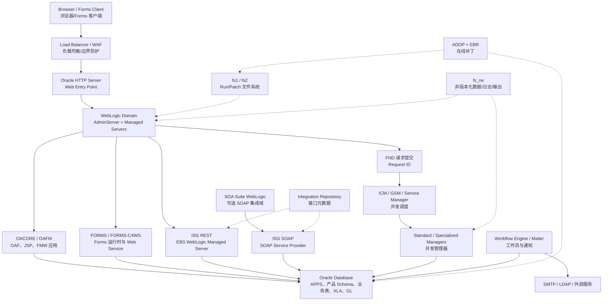
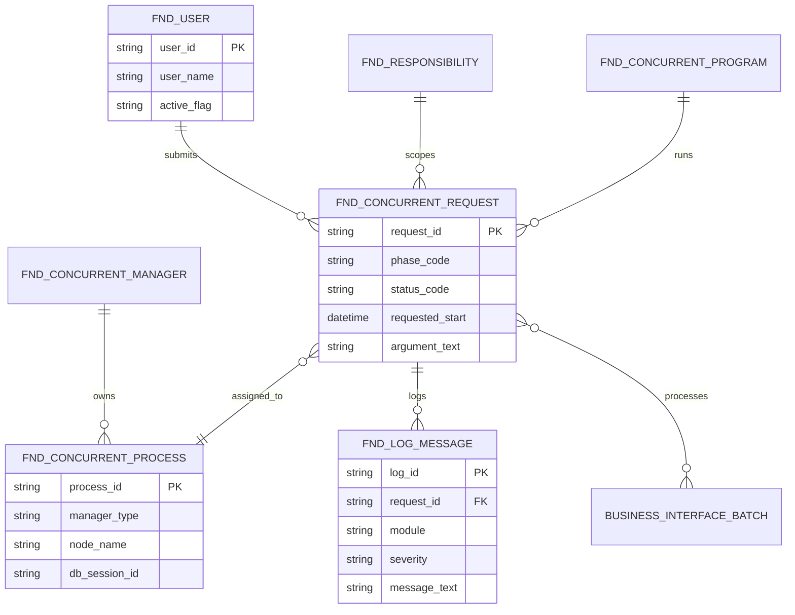
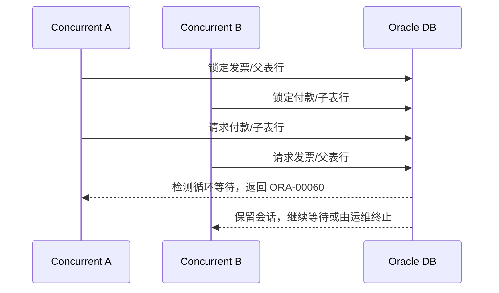
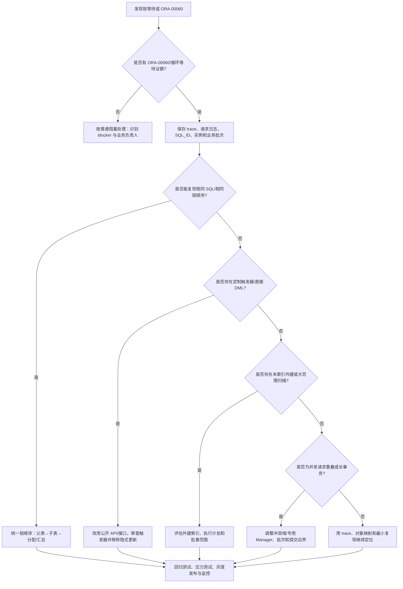

# 技术架构、开发与集成（Technical Architecture, Development and Integration）

> 技术顾问需要同时理解 EBS 三层架构、R12.2 在线补丁、数据模型、标准扩展点、接口状态机、安全和可运维性。

## 阅读导航

- [架构总览](#technical-architecture) · [选型与边界](#technical-design) · [安全与身份](#technical-security) · [诊断与死锁](#technical-diagnostics) · [实施案例](#technical-cases) · [并发程序](#src-docs-09-technical-concurrent-programs) · [Forms/OAF](#src-docs-09-technical-java-extensions) · [Workflow/AME](#src-docs-09-technical-workflow-ame-oaf-governance) · [报表与 Web ADI](#src-docs-09-technical-reporting-file-exchange) · [实施手册](#technical-handbook)

## 模块数据字典与名词解释

本模块速查见[统一数据字典](data-dictionary.md#dict-10)。

<a id="technical-architecture"></a>
## 1. 架构总览（Topology and Runtime）

### 1.1 R12.2 三层及发布架构



### 1.2 R12.2 整体技术架构分层

R12.2 的“节点角色”由启用的服务组决定，而不是由某台机器上是否安装了文件决定。同一应用层节点可以按需启用 Web、Forms、批处理或其他服务；Web Administration（WebLogic Admin Server）通常只在一个节点启用，其他节点运行受管 Managed Server 或批处理服务。服务组和控制脚本应以 AutoConfig 上下文及目标实例为准，不直接编辑生成后的配置文件。

#### 1.2.1 文件系统与版本边界

| 区域 | 主要内容 | 版本/共享规则 | 典型证据 |
| --- | --- | --- | --- |
| `fs1` / `fs2` | APPL_TOP、产品代码、Java/Forms/Reports 文件及相应 INST_TOP | 两套版本化文件系统；当前一套为 Run，另一套为 Patch，每次 ADOP Cutover 后角色互换 | `adop -status`、context 文件、文件系统版本 |
| `fs_ne` | 跨版本保留的业务文件、导入/导出文件、并发日志与输出、部分运行时数据 | 非版本化；不放应用代码，也不把它当作可随意共享的代码目录 | `s_ne_base`、`APPLCSF`、日志/输出目录 |
| `APPL_TOP` | EBS 核心技术文件和产品目录；每个 APPL_TOP 对应一个数据库 | R12.2 代码/配置随 fs1/fs2 受 ADOP 管理；禁止只修改 Run 文件系统 | `<EBSapps>/appl`、`*_TOP` 环境变量 |
| `COMMON_TOP` | 多个产品共用的脚本、模板、帮助和公共文件 | 依实例布局位于应用文件系统，不承担跨版本业务数据职责 | `<EBSapps>/comn`、`COMMON_TOP` |
| `INST_TOP` | 节点上下文、管理脚本、AutoConfig 及实例配置/日志入口 | 每个应用节点一份；服务脚本位于 `<INST_TOP>/admin/scripts` | `adstrtal.sh`、`adstpall.sh`、AutoConfig 日志 |
| FMW/Oracle Home | WebLogic、JRF、OHS 和 EBS 部署所需中间件二进制 | 与应用代码、补丁级别和节点克隆保持一致；不得手工覆盖受管文件 | FMW Inventory、OPatch、WLS/OHS 配置 |

`fs1` 和 `fs2` 本身不是固定的“生产”和“补丁”目录；应依据当前 Run/Patch 角色执行维护。并发日志和输出在 R12.2 中必须使用 `APPLCSF` 指向非版本化区域，避免因 Cutover 后路径变化而丢失运行证据。Oracle 对三文件系统的说明见 [EBS Concepts：Dual and Non-Editioned File Systems](https://docs.oracle.com/cd/E26401_01/doc.122/e22949/T120505T120509.htm) 与 [EBS Concepts：File System Implementation](https://docs.oracle.com/cd/E26401_01/doc.122/e22949/T120505T120512.htm)。

执行维护前先通过 `EBSapps.env RUN` 或 `EBSapps.env PATCH` 选择正确文件系统，并核对 `FILE_EDITION`、`RUN_BASE`、`PATCH_BASE`、`NE_BASE`、`INST_TOP` 和 `APPLCSF`。`INST_TOP` 保存节点上下文、AutoConfig 和管理入口，但 OHS/WebLogic 的全部配置并不都位于 `INST_TOP`；FMW Home、WLS Domain 和 OHS 实例目录仍需用其原生工具及受支持同步机制维护。

#### 1.2.2 中间件、应用服务与服务组

| 服务组 | 服务/组件 | 主要职责 | 典型排错入口 |
| --- | --- | --- | --- |
| Root Service | Node Manager | 启停和监控 WebLogic Managed Server | Node Manager 日志、节点状态 |
| Web Administration | WebLogic Admin Server | 管理 Domain、Managed Server、部署和配置 | WLS Admin Console、AdminServer 日志 |
| Web Entry Point Services | Oracle HTTP Server（OHS）、OPMN | TLS/虚拟主机、反向代理、静态资源和 Web 入口；R12.2 中 OPMN 主要管理 OHS | OHS access/error 日志、`adapcctl.sh`/`adopmnctl.sh` |
| Web Application Services | `oacore`、`oafm`、`forms`、`forms-c4ws` | OAF/JSP、FMW 应用、Forms 访问和 Forms Web Service | Managed Server 日志、JVM/线程/数据源 |
| Batch Processing Services | Applications Listener、Concurrent Manager、Fulfillment Server、ICSM | 并发请求、后台处理、特定 Fulfillment/ICSM 服务 | Listener、ICM/Manager、服务日志 |
| Other Services | Forms Server、Oracle MWA | 传统 Forms 相关服务和移动仓库终端（启用时） | 对应控制脚本、服务日志 |
| 专用 SOAP 集成域（可选） | SOA Suite WebLogic、ISG SOAP Service Provider | SOAP 服务生成、策略、同步/异步回调和服务监控 | SOA Managed Server、WSDL、Service Monitor |

R12.2 中 OC4J 已由 WebLogic Server 替代；AutoConfig 仍管理部分 OHS 和应用服务配置，Managed Server 的其余配置应通过 WebLogic/Fusion Middleware 工具维护。常用的总控脚本是 `<INST_TOP>/admin/scripts/adstrtal.sh` 和 `adstpall.sh`；单个 `oacore/oafm/forms/forms-c4ws` 由 `admanagedsrvctl.sh` 或 WLS 控制台管理。ISG REST 直接部署到 EBS WebLogic Managed Server，ISG SOAP 则部署到 SOA Suite WebLogic Managed Server；是否存在专用 SOAP 域以目标实例为准。服务组清单和脚本见 [EBS Setup Guide：AutoConfig-Managed Service Groups](https://docs.oracle.com/cd/E26401_01/doc.122/e22953/T174296T589913.htm)。

#### 1.2.3 数据库层、连接与共享状态

| 组件 | 作用 | 需要核对的边界 |
| --- | --- | --- |
| Oracle Database | 保存 EBS 业务数据、FND 元数据、XLA/GL、Workflow 和接口状态 | 数据库版本、RAC/Data Guard、字符集、时区、补丁、许可证 |
| `APPS` Schema | EBS 应用访问层和同义词/包入口 | 只授予受控应用权限；不作为终端用户长期直连账号 |
| Product Schemas | GL、AP、AR、INV、PO、FA、PA 等产品表、包和视图 | 通过 eTRM/`ALL_TAB_COLUMNS` 验证列、状态和对象所有者 |
| `APPLSYS`/FND | 用户、职责、Profile、并发、菜单、Lookup、Workflow 等共享基础 | 不直接 DML 修复用户、请求或工作流状态 |
| `EBS_SYSTEM`（适用补丁级别） | R12.2 新增的受控管理账号，用于部分应用 Schema 权限管理 | 是否存在及权限范围以目标 AD/TXK Delta 和安全基线确认 |
| Listener / TNS / 数据库服务 | 应用层、并发节点和管理工具连接数据库 | Service Name、Failover、连接池、超时和网络 ACL |

应用服务通过数据源/连接池访问数据库；Forms、OAF、ISG 和 Concurrent Manager 可能使用不同的连接生命周期。排查时同时记录用户/职责、`ORG_ID`/Ledger、节点、数据库实例、Session、`MODULE/ACTION` 和 Request ID，不能只凭数据库用户名定位业务请求。

#### 1.2.4 并发处理与后台服务

并发处理的核心对象是“请求 → 队列 → Manager → 进程 → 日志/输出”。用户或接口先在 `FND_CONCURRENT_REQUESTS` 产生 Request ID，Internal Concurrent Manager（ICM）负责全局调度，并通过 Generic Service Management（GSM）在启用并发处理的节点启动 Service Manager（`FNDSM`）；Service Manager 再按工作班次、Specialization Rule、冲突域和目标节点管理 Standard/Specialized Manager。

| 组件 | 功能 | 常见故障表现 |
| --- | --- | --- |
| ICM（Internal Concurrent Manager） | 控制其他 Manager、节点和队列 | ICM 不在，其他 Manager 无法正常激活 |
| Service Manager / GSM | 在节点上启动、停止和监控服务实例 | 节点服务未拉起、FNDSM 注册失败 |
| Standard Manager | 处理未被专用规则捕获的普通请求 | 队列拥塞、长任务占满进程 |
| Specialized Manager | 按包含/排除规则处理特定程序或应用 | 请求 Pending/Standby 或被错误队列接收 |
| Conflict Resolution Manager | 检查不兼容请求，避免冲突并发 | 请求处于待处理/冲突状态 |
| Transaction Manager | 处理 Forms 等同步事务请求 | Forms 事务等待、响应超时 |
| Output Post Processor（OPP） | 对 XML/PDF/Excel 等输出执行后处理 | 请求完成但无输出、OPP 队列积压 |
| Workflow Background Engine/Mailer | 推进 Deferred/Error 活动并发送/接收通知 | Workflow 延迟、邮件未发或回执失败 |

R12.2 的 Parallel Concurrent Processing（PCP）与 GSM 一起工作，可将 Manager 分布到多个应用节点并支持节点故障转移。不要手工更新 `FND_CONCURRENT_REQUESTS`、`FND_CONCURRENT_PROCESSES` 或 `FND_CONCURRENT_QUEUES`；应使用标准管理页面、控制脚本和 Purge Concurrent Requests 程序。架构依据见 [EBS Concepts：Concurrent Processing](https://docs.oracle.com/cd/E26401_01/doc.122/e22949/T120505T120508.htm) 和 [Setup Guide：Parallel Concurrent Processing](https://docs.oracle.com/cd/E26401_01/doc.122/e22953/T174296T575591.htm)。

#### 1.2.5 网络入口与典型请求链路

建议将访问分为浏览器/Forms、系统间入站和 EBS 出站三类，并在防火墙、负载均衡和服务层分别记录证据：

```text
浏览器/OAF：Browser → Load Balancer/WAF → OHS → oacore/oafm → APPS/产品 Schema → DB
Forms：Forms Client → OHS/Forms Servlet → forms Managed Server → Forms Runtime → DB
入站接口：External System → HTTPS/OHS → ISG REST/SOAP → Grant/MOAC → API/Open Interface → DB
并发任务：页面/API → FND_CONCURRENT_REQUESTS → ICM/GSM → Manager/OPP → DB/日志/输出
出站服务：业务事件 → Workflow/JBES/SIF → 外部 SOAP/REST/SMTP/LDAP → 回调/回执 → EBS
```

其中 ISG REST 的请求通常进入 EBS WebLogic Managed Server；ISG SOAP 请求经 SOA Suite WebLogic Managed Server 的 Service Provider，再由 EBS Adapter 访问应用。不要把两类 Endpoint、WSDL/WADL、认证策略和日志位置混为一谈。

网络与会话设计至少明确：TLS 终止位置、`s_webentry*` 变量、负载均衡健康检查、会话粘性或可恢复策略、OHS 到 Managed Server 的代理规则、数据库连接超时、外部调用超时和日志关联号。端口号不能从模板照抄；以 AutoConfig context、WLS/OHS 配置和当前防火墙清单为准。Oracle 的服务端口变量清单可参考 [Security Guide：Ports Used by WebLogic Server](https://docs.oracle.com/cd/E26401_01/doc.122/e22952/T156458T659608.htm)。

#### 1.2.6 启停、监控与故障域

1. 启停顺序通常由 `adstrtal.sh`/`adstpall.sh` 和各服务控制脚本统一编排；单独重启前先确认请求、Workflow、Forms 会话和接口是否需要排空。
2. 配置变更分为 AutoConfig/context、WLS/OHS/FMW、EBS Profile/职责和数据库参数四类，必须由对应工具维护并保留前后差异。
3. 监控至少覆盖 OHS/WLS/Forms、数据库 Listener/Session、ICM/Manager/OPP、Workflow Mailer、文件系统空间、`fs_ne` 日志增长和外部依赖。
4. 故障定位按“入口 → 应用服务 → 并发/Workflow → 数据库 → 外部系统”分层，记录时间、节点、Request ID、Session/SQL ID、服务日志和最近 ADOP 变更。
5. 节点故障、Managed Server 故障、数据库实例故障、共享文件系统故障和外部服务故障分别定义恢复动作；不要用全栈重启替代证据采集。

### 1.3 技术对象 ER 图



该 ER 图用于并发、日志和权限追溯；具体列、状态值和 OAM 页面字段须以目标 R12.2 补丁级别确认。

<a id="technical-design"></a>
## 2. 技术能力地图与设计原则

### 2.1 学习与交付目标

技术顾问应能从一个业务动作定位到入口、应用服务、数据库会话、并发/Workflow、文件和外部回执；能在标准能力、扩展点和直接开发之间做出可审计的取舍；能按 R12.2 ADOP/EBR 交付、回退并验证。任何表名、列名、状态、API 签名、端口和服务是否启用，都必须以目标实例的补丁级别、产品安装、本地化和许可证为准。

### 2.2 技术域覆盖矩阵

| 技术域 | 必须掌握的对象/组件 | 最低交付物与证据 |
| --- | --- | --- |
| 部署与文件 | `fs1/fs2/fs_ne`、APPL_TOP、COMMON_TOP、INST_TOP、Context、AutoConfig、ADOP/EBR | 拓扑图、文件系统角色、变更包、`adop -status` 和 AutoConfig 日志 |
| 中间件与入口 | OHS、OPMN、WebLogic Domain、AdminServer、Managed Server、Node Manager、负载均衡/WAF | 服务组矩阵、端口/证书清单、访问日志、健康检查和启停记录 |
| 数据库与模型 | Oracle Database、APPS/APPLSYS/Product Schema、FND、SLA/XLA、监听器、RAC/Data Guard | eTRM/数据字典核对、SQL 执行计划、会话/SQL ID、备份与恢复证据 |
| 页面与扩展 | OAF（AM/VO/EO/CO）、Forms、Forms Personalization、CUSTOM.pll、PL/SQL API | 扩展点说明、源码/注册工件、权限矩阵、升级回归和回退脚本 |
| 批处理与流程 | Concurrent Program/Request Set、ICM/GSM/Manager、OPP、Workflow、AME、Mailer | Request ID、队列/Manager 配置、日志/输出、Item Type/Key 和通知证据 |
| 集成与消息 | Public API、Open Interface、ISG REST/SOAP、Business Event/SIF、XML Gateway、EDI Gateway、AQ | WSDL/WADL、状态机、幂等键、重试/补偿、对账和回执 |
| 身份与安全 | `FND_USER`、Responsibility、Menu/Function、Profile、MOAC、SSO/OAM/OID/OUD、密钥 | 认证/授权矩阵、最小 Grant、审计日志、密钥轮换和负向测试 |
| 运维与质量 | OAM/日志、ETCC、容量、监控、克隆、RMAN/Data Guard、测试流水线 | 运行手册、SLO/阈值、事件时间线、测试报告、灾备演练和变更记录 |

<a id="technical-design-boundary"></a>
### 2.3 设计与支持边界

- 写入优先级为：标准页面/配置 → Personalization 或受支持扩展 → Published API/Open Interface → Business Event/ISG/XML Gateway → 客制化程序与对象。只有在没有可行标准入口且完成升级、性能、安全和回退评审后，才新增代码。
- 不覆盖 Oracle seeded 源码、JAR、Forms、OAF XML 或生成配置；不以直接 DML EBS 业务、会计、FND、Workflow 运行时基表作为常规接口或纠错方式。数据修复应使用标准功能、受支持 API 或 Oracle Support 方案。
- 每个工件都要有客户前缀、所有者、版本、依赖、部署顺序、权限、监控、回退/补偿和验收断言；把“代码已部署”与“业务已完成/已入账”分开证明。

### 2.4 扩展与接口选型决策

| 需求 | 首选实现 | 不应直接采用的做法 | 验收重点 |
| --- | --- | --- | --- |
| 字段显示/默认/校验 | Forms/OAF Personalization、Profile、Lookup | 修改 seeded XML/Forms 源码 | 页面上下文、职责层级、缓存、升级回归 |
| 单笔业务写入 | Published PL/SQL API 或产品标准表单 | 直接插入/更新基表 | FND/MOAC 上下文、Message Stack、事务边界 |
| 大批量导入 | Open Interface + Import + Concurrent | API 单行循环或直接基表 DML | Group/Source、拒绝行、吞吐、重启与对账 |
| 异步通知 | Business Event/Workflow、XML Gateway | 在触发器中同步调用外部 HTTP | Event Key、Deferred/Error、重试和回执 |
| 对外服务 | ISG REST/SOAP、Concurrent Program REST | 暴露业务表/诊断包 | Grant、WSDL/WADL、限流、幂等、版本 |
| 报表/文件 | BI Publisher/OPP、FSG、Web ADI | 生产库临时脚本拼接敏感数据 | 数据定义、模板、字体、权限、输出保留 |

#### Oracle 标准扩展点速查

下表不是要求全部启用，而是防止设计时只想到“写一段 PL/SQL”。是否可用还取决于已安装产品、许可证、补丁级别、责任授权和该产品是否公开扩展点。

| 目标 | 优先考虑的标准能力 | 适合做什么 | 不能替代什么 |
| --- | --- | --- | --- |
| 受控代码值/字段 | Lookup、Profile Option、DFF/KFF、Value Set | 增加可治理属性、默认值、受限选择与编码 | 服务端业务校验、权限或数据修复 |
| Forms 界面 | Forms Personalization、CUSTOM.pll、客户 Form | 显示、默认、校验、Zoom、受控独立页面 | 修改 Oracle Form 或直接写业务表 |
| OAF 自助页面 | OAF Personalization、已公开 Extension、客户页面/服务层 | 页面展示、事件、查询与受控业务操作 | 覆盖 seeded XML、CO、AM 或 EO |
| 业务审批/流程 | Workflow、Business Event、AME、产品 Account Generator（如适用） | 通知、分支、审批人规则、会计/编码派生流程 | 把 Workflow 运行时表当作人工修复入口 |
| 后台任务 | Concurrent Program、Request Set、FND_REQUEST、OPP | 可调度批处理、导入、报表与状态追踪 | 在网页请求内跑长事务 |
| 业务写入 | 产品 Public API、Open Interface、标准 Import | 单笔受控写入或大批量异步导入 | 直接 DML 基表或接口状态表 |
| 服务与事件 | Integration Repository/ISG、Business Event、SIF、XML Gateway/EDI Gateway | SOAP/REST、事件通知、B2B 标准报文和出站调用 | 将数据库表或诊断包直接暴露给外部 |
| 报表与桌面协作 | BI Publisher、FSG、Oracle Reports、Web ADI | 格式化输出、财务报表、既有 RDF、受控 Excel 下载/上传 | 无限制导出、个人宏或临时 SQL 成为生产报表 |
| 定义迁移 | FNDLOAD、WFLOAD、iSetup、产品工具 | 可支持的配置/Workflow/业务设置迁移 | 运行交易、密钥和环境连接直接复制 |
| 通知与监控 | Workflow Mailer、Oracle Alert（已启用时）、OAM/日志/报表 | 事件告警、通知分发、运行监控 | 完整的外部监控平台或业务对账 |

### 2.5 数据模型、上下文与安全查询

先用业务主键、文档号或 Request ID 收缩范围，再沿“交易 → 分配/履约 → SLA/XLA → GL/回执”追踪。`_ALL`、`_B`、`_TL`、`_VL`、`_F`、`_INTERFACE`、`_TEMP/_GT` 只是常见命名约定，不是跨产品的绝对规则；列、状态和组织语义必须用 eTRM、`ALL_TAB_COLUMNS`、同义词和目标实例数据确认。

只读诊断应使用绑定变量、显式列、组织/账簿/期间/日期范围和执行计划；应用 API 场景要正确初始化 `FND_GLOBAL.APPS_INITIALIZE` 与 `MO_GLOBAL` 上下文。生产查询要限制并发、脱敏个人/银行/税务字段，记录 SQL ID 和执行时间，不把诊断 SQL 伪装成修复脚本。

<a id="technical-interface-lifecycle"></a>
### 2.6 接口状态、幂等与重放

```text
Received → Validated → Staged → Submitted → Imported
         ↘ Rejected                 ↘ Partially Succeeded
→ Accounted → Reconciled → Archived
```

接口表、业务导入、会计和下游回执是不同阶段；至少保存 `Source System + External Key + Version`、Batch/Line、控制总额、Payload Hash、状态、错误码、重试次数、Request ID、EBS 主键和回执时间。连接超时不等于 EBS 未处理：先按幂等键/Request ID 查询结果，再决定有限重试；部分成功只重试失败行，拒绝数据修正后重新提交。

<a id="technical-security"></a>
## 3. 安全、身份与访问控制

### 3.1 分层安全基线

| 层次 | EBS 实现 | 关键控制与证据 |
| --- | --- | --- |
| 身份（Who） | `FND_USER`、SSO/OAM/OID/OUD、服务账号 | 唯一标识、入离职同步、失效日期、MFA/风险策略、审计 |
| 认证（How） | 本地密码、SSO、API/服务凭据、TLS 客户端证书 | 密码策略、Token/证书生命周期、失败登录和密钥轮换 |
| 授权（What） | Responsibility → Menu/Function/Request Group → Profile/MOAC/Data Access Set | 最小职责、SoD、组织/账簿隔离、Grant 快照和负向测试 |
| 数据（Which rows） | `ORG_ID`、Ledger、Legal Entity、Operating Unit、库存组织、项目/成本中心 | SQL/API 上下文、跨组织测试、输出与接口脱敏 |
| 传输与边界 | WAF/负载均衡、OHS、WebLogic、数据库 Listener、外部网关 | TLS 终止点、允许来源、端口、超时、证书链和访问日志 |
| 审计与响应 | FND 登录/职责、应用日志、数据库审计、接口/并发追踪 | Correlation ID、Request ID、变更审批、保留周期、事件时间线 |

生产安全最低要求：凭据不进入源码、参数、日志、Git 或截图；APPS/APPLSYS/SYSTEM/WebLogic 管理账号不得共享；自定义 schema 只授予必需对象；输入做白名单和长度校验，SQL 使用 Bind，文件接口限制目录/扩展名/大小。权限和日志策略必须与数据分类、监管要求及客户安全基线联动，不能只依赖 EBS 页面隐藏字段。

<a id="technical-sso"></a>
### 3.2 单点登录（SSO）与账户映射

Oracle E-Business Suite R12.2 默认可以使用 `FND_USER` 本地认证。启用单点登录后，认证由 Oracle Access Manager（OAM）配合 Oracle Internet Directory/Oracle Unified Directory（OID/OUD），或由 Oracle Identity Cloud Service（IDCS）等受支持方案完成；第三方 IdP 不能直接绕过桥接组件连接 EBS。SSO 只解决“你是谁”，职责、菜单、请求组和 MOAC 仍由 EBS 负责授权。详见 [Oracle E-Business Suite Security Guide：SSO Integration](https://docs.oracle.com/cd/E26401_01/doc.122/e22952/T156458T580814.htm) 与 [EBS Concepts：Single Sign-On](https://docs.oracle.com/cd/E26401_01/doc.122/e22949/T120505T120515.htm)。

```text
Browser
  → OHS/WebLogic → OAM/WebGate/AccessGate（或 EBS Asserter）
  → OID/OUD/企业 IdP 验证身份
  → EBS 建立应用会话并映射 FND_USER
  → Responsibility / Menu / MOAC 执行授权
```

实施时至少完成以下映射和控制：

| 控制点 | 实现要求 | 验证证据 |
| --- | --- | --- |
| 身份主键 | 明确 `USER_NAME`、企业登录名和 GUID/唯一标识的映射，统一大小写、空格和失效规则 | 映射表、同步日志、重复账号报告 |
| 桥接组件 | 配置 OAM/WebGate/AccessGate 或 Asserter，使用 HTTPS、受信证书、正确的回调 URL 和 Cookie 域 | OAM/AccessGate 配置、证书链、登录重定向记录 |
| 用户供应 | 选择 EBS 或目录作为主数据源；同步 `FND_USER`、员工关联、起止日期和职责，不把 SSO 当作职责分配 | 入职、调岗、离职和回收测试记录 |
| 会话治理 | 分别设置 EBS 会话、SSO 会话和空闲超时；验证深链、登出传播、超时后重新跳转 | 浏览器网络日志、OHS/OAM/EBS 日志 |
| 授权隔离 | SSO 登录成功后仍以 Responsibility、菜单、数据访问集和 MOAC 控制数据范围 | 无权职责、无权 OU/Ledger 的负向测试 |
| 应急账户 | 保留受限的本地管理员/`SYSADMIN` 破窗路径，限制网络来源、双人审批和审计；不得共享账号 | 破窗演练、访问审批、审计记录 |

SSO 切换建议按“目录同步 → 小范围用户 → 并行验证 → 分批切换 → 回退窗口”执行。必须验证以下场景：首次登录、深链接、多个职责切换、密码在 IdP 侧修改、用户离职、EBS 会话过期但 SSO 会话仍有效、SSO 会话注销但 EBS 页面仍打开，以及 OAM/目录不可用时的运维处置。不要直接修改 `FND_USER` 或手工写入目录密码来“修复”映射。

<a id="technical-password-policy"></a>
### 3.3 客制化密码规则与本地密码治理

先区分三类密码：EBS 本地应用用户密码、数据库 Schema/应用凭据、SSO/LDAP 身份源密码。`SIGNON_*` Profile 只约束 EBS 本地应用用户；SSO 用户的密码复杂度、MFA、风险策略应在 IdP 侧实施。数据库 Schema 密码应使用 `AFPASSWD`/受管控的数据库 Profile，不要把数据库 `PASSWORD_VERIFY_FUNCTION` 当成 `FND_USER` 校验器。

Oracle 内置 Profile 可先满足大部分要求，建议在目标实例按补丁和安全基线确认：

| Profile（内部名） | 建议起点 | 说明 |
| --- | --- | --- |
| `SIGNON_PASSWORD_LENGTH` | `8` 或更高 | 最小长度；未设置时默认值较低，按企业标准提高 |
| `SIGNON_PASSWORD_HARD_TO_GUESS` | `YES` | 至少包含字母和数字，不含用户名，不含重复字符 |
| `SIGNON_PASSWORD_NO_REUSE` | `180` | 禁止在指定天数内重复使用；需结合业务换密周期 |
| `SIGNON_PASSWORD_CASE` | `Sensitive` | 新设置的密码区分大小写，切换前安排用户通知和回归 |
| `SIGNON_PASSWORD_FAILURE_LIMIT` | `5`（需评估） | 连续失败后禁用账号；过低可能被用作拒绝服务，需监控失败登录 |
| `ICX_SESSION_TIMEOUT` | `30`（分钟，按风险调整） | 控制 EBS 应用会话空闲超时，不等于 SSO 会话超时 |
| `SIGNON_PASSWORD_CUSTOM` | 客制化类全名 | 仅当内置规则无法表达企业政策时启用 |

R12.2.3 及以后可将本地应用用户密码迁移为不可逆哈希；较新的补丁还提供 Password Security Administration 页面用于管理迁移。哈希迁移、备份和回退应按 [Oracle E-Business Suite Security Guide：Password Management](https://docs.oracle.com/cd/E26401_01/doc.122/e22952/T156458T659601.htm) 与 Maintenance Guide 执行。浏览器 SSO 会话不能代替系统间 Web Service 的服务凭据。

若必须扩展规则，Oracle 支持实现 `oracle.apps.fnd.security.PasswordValidation` Java 接口，并将完整类名设置到 `SIGNON_PASSWORD_CUSTOM`。接口契约包含三个方法；下面是结构示意，实际编译必须以目标 R12.2 补丁级别的接口签名和消息定义为准：

```java
// 结构示意：禁止在 validate() 中记录明文密码或调用外部网络。
public final class CorpPasswordValidation
    implements oracle.apps.fnd.security.PasswordValidation {

  public boolean validate(String user, String password) {
    return password != null
        && password.length() >= 12
        && !password.toLowerCase().contains(user.toLowerCase())
        && hasRequiredCharacterClasses(password)
        && !isInLocalDenyList(password);
  }

  public String getErrorStackMessageName() {
    return "XX_PWD_POLICY_INVALID";
  }

  public String getErrorStackApplicationName() {
    return "XXCUS";
  }
}
```

发布和运维要求：

1. 在自定义 Java 包中编译、代码审查和版本控制；消息名、应用短名、类路径及 JDK 版本按目标实例确认。
2. 通过受支持的 `loadjava`/应用发布流程装载类，并在非生产环境验证新建用户、改密、管理员重置、SSO 用户和异常消息；不要直接更新 `FND_USER` 密码列。
3. 规则函数应是确定性的、低延迟的、无外部网络依赖；拒绝名单使用受控的本地版本，避免每次改密访问远程服务。
4. 记录规则版本和发布包，不记录密码、完整请求或安全问题答案；异常时应返回可理解的消息并保留审计证据。
5. 若启用 `SIGNON_PASSWORD_FAILURE_LIMIT`，监控 `FND_UNSUCCESSFUL_LOGINS` 和账号解锁流程，防止策略被用于批量锁号。

验收至少覆盖：长度/字符集边界、用户名和员工号包含关系、重复字符、历史密码重用、大小写、失败次数、管理员重置、并发改密、SSO 登录和策略回退。密码策略变更应与用户通知、服务账号轮换、应急账户测试和回退方案一起发布。

### 3.4 服务账号、密钥与接口凭据

服务账号按用途拆分为页面登录、ISG 调用、数据库连接、SFTP/银行、SMTP/LDAP、监控和部署账号；每个账号只绑定所需职责、请求组、组织范围或网络来源。账号的创建、Owner、起止日期、轮换周期、最后使用时间和撤销证据应进入配置库。

| 凭据 | 推荐存放 | 轮换/失效 | 验证 |
| --- | --- | --- | --- |
| EBS 本地服务用户 | EBS 用户与受控密码库 | 最小职责、起止日期、失败锁定监控 | ISG/Concurrent 调用、无权 OU 测试 |
| WLS/OHS/数据库账号 | Wallet、Credential Store 或受控密钥系统 | 先更新消费者再失效旧密钥；保留回退窗口 | 连接池、Listener、节点重启 |
| TLS 私钥/证书 | Keystore/Wallet，权限限于服务账户 | 到期前轮换并验证完整链 | OHS/WLS/SFTP/外部接口握手 |
| SFTP/银行/税务凭据 | 企业 Secret Manager | 双方窗口切换、禁止写入脚本 | 文件上传/下载、ACK、审计 |

禁止在 `curl` 命令历史、Shell 环境长期变量、Concurrent 参数、日志、WSDL 示例、JAR 或 Git 中保存密码/Token/私钥；异常时返回通用错误并把详细凭据错误留在受限日志。凭据轮换应至少覆盖正常调用、超时重试、节点切换、灾备切换和回退场景。

<a id="technical-diagnostics"></a>
## 4. 诊断、阻塞与死锁

### 4.1 死锁与普通阻塞的区别

`ORA-00060: deadlock detected while waiting for resource` 表示数据库检测到会话之间形成循环等待。Oracle 会回滚触发错误的那条语句（不是自动回滚整个业务事务），并在诊断 trace 中记录涉及的事务和资源；应先保留 trace，再判断是否需要重试。官方错误说明要求检查 trace 文件以确认冲突事务和资源，见 [Oracle Database Error Help — ORA-00060](https://docs.oracle.com/en/error-help/db/ora-00060/?r=19c)。

| 类型 | 典型形态 | 处理重点 |
| --- | --- | --- |
| 普通阻塞（blocking） | 一个会话持有锁，其他会话排队等待；提交/回滚后通常可继续 | 找出 blocker、业务负责人和预计结束时间；不要把所有等待都判定为死锁 |
| 死锁（deadlock） | A 等 B 持有的锁，同时 B 等 A 持有的锁，形成闭环 | 保留 ORA-00060 trace、请求日志和 SQL；修复锁顺序、触发器、索引或并发调度 |
| 长事务（long transaction） | 没有循环，但锁持有时间过长，导致大量等待 | 缩小批次和事务范围，调整提交边界，优化 SQL 与批处理窗口 |

死锁不等于“某个会话很慢”。如果只有一个 blocker、没有等待环，优先按阻塞事件处理；如果日志中出现 ORA-00060 或 trace 显示循环资源，再进入死锁流程。

### 4.2 EBS 常见死锁模型

EBS 中的锁通常由标准 API、并发程序、Forms/OAF 页面、Workflow 活动、定制触发器或直接 SQL 共同产生。最常见的根因是两个程序以相反顺序更新同一业务对象的父子行、跨模块分配行或接口批次行。



常见模型包括：

- AP 发票验证、付款选择或自定义更新同时触碰发票、付款计划和分配行。
- AR AutoInvoice、收款核销、客户余额更新与自定义客户/订单触发器锁定顺序不一致。
- Inventory/WIP 成本处理、GL 导入和报表抽取同时更新接口批次或汇总控制行。
- 自定义触发器在更新主表时反查或更新另一张业务表，隐式改变锁顺序。
- 父表被更新/删除而子表外键无索引，导致更大范围的 TM 表锁等待；这可能表现为阻塞，也可能放大死锁概率。
- RAC（Real Application Clusters，集群）跨实例访问同一对象，出现全局缓存等待；必须记录实例号，不能只看单节点会话。

### 4.3 现场证据收集（先保留证据）

发生生产事件时先建立时间线，记录时区、数据库实例/节点、业务批次和最近发布。除非已经确认业务影响且完成最小证据采集，不要立即杀会话、重启数据库或盲目重跑。

1. 记录错误原文、首次/最近发生时间、用户、职责、模块、业务单号、批次号和影响数量。
2. 记录 Concurrent Request ID、程序名/短名、参数、父请求、请求集、Manager、节点、日志和输出文件路径。
3. 保存数据库会话的 `SID`、`SERIAL#`、实例号、`SQL_ID`、模块（`MODULE`）和动作（`ACTION`），以及 ORA-00060 trace/alert 日志位置。
4. 在 EBS 页面打开 **System Administrator → Concurrent → Requests**，按 Request ID 查看阶段/状态、日志和输出；必要时通过 OAM 的并发请求监控查看运行会话与诊断信息。R12.2 并发请求生命周期和 OAM 入口可参考 [Oracle E-Business Suite Setup Guide](https://docs.oracle.com/cd/E26401_01/doc.122/e22953/T174296T575591.htm) 与 [Oracle E-Business Suite Maintenance Guide](https://docs.oracle.com/cd/E26401_01/doc.122/e22954/T202991T221119.htm)。
5. 保存最近一次 ADOP、配置、触发器、索引、并发调度或接口版本变更，避免只根据单次重跑结果下结论。

### 4.4 只读诊断 SQL

以下 SQL 仅用于诊断，使用绑定变量并限制时间/对象范围。`GV$` 视图需要相应数据库权限；单实例可改用 `V$`。不同补丁级别的列可能略有差异，执行前用数据字典确认。不要把诊断 SQL 直接改造成生产 DML。

**1）当前等待与阻塞会话**

```sql
select s.inst_id,
       s.sid,
       s.serial#,
       s.username,
       s.status,
       s.event,
       s.seconds_in_wait,
       s.blocking_instance,
       s.blocking_session,
       s.sql_id,
       s.module,
       s.action
  from gv$session s
 where s.blocking_session is not null
    or s.event like 'enq: TX%'
    or s.event like 'enq: TM%';
```

`enq: TX` 常与行级事务锁相关，`enq: TM` 常与表级 DML 锁相关；等待事件本身不能证明已经形成死锁。

**2）锁模式与持有时间**

```sql
select l.inst_id,
       l.sid,
       l.type,
       l.id1,
       l.id2,
       l.lmode,
       l.request,
       l.ctime,
       l.block,
       s.serial#,
       s.sql_id
  from gv$lock l
  join gv$session s
    on s.inst_id = l.inst_id
   and s.sid = l.sid
 where l.request > 0
    or l.block = 1
 order by l.inst_id, l.ctime desc;
```

将 `ID1/ID2`、对象和会话对应起来，再回到业务单号和并发请求；不要只凭 `SID` 猜测业务归属。

**3）关联 EBS 并发请求**

```sql
select r.request_id,
       r.phase_code,
       r.status_code,
       r.concurrent_program_id,
       r.argument_text,
       r.oracle_session_id
  from fnd_concurrent_requests r
 where r.request_id in (:p_request_id_1, :p_request_id_2);
```

`ORACLE_SESSION_ID` 在部分环境可能为空或受配置影响；应结合 OAM、请求日志和数据库会话时间交叉确认，而不是把空值当成“没有数据库会话”。

**4）数据库级 blocker/waiter 快照**

```sql
select holding_session, mode_held
  from dba_blockers;
select waiting_session, holding_session, lock_type,
       mode_requested
  from dba_waiters;
```

这两个视图需要 DBA 权限，且主要反映当前快照；死锁已结束后应以 trace、ASH（如已授权）和应用日志为主。

**5）短时间历史（需确认许可与保留期）**

```sql
select sample_time,
       session_id,
       session_serial#,
       sql_id,
       event,
       blocking_session
  from v$active_session_history
 where sample_time >= systimestamp - interval '15' minute
   and event like 'enq:%'
 order by sample_time;
```

ASH/AWR/SQL Monitor 的可用性、许可和保留时间需由 DBA 确认；不能因为查询不到历史就认定事件没有发生。

### 4.5 解决决策树



### 4.6 生产止血与恢复

- 先判断影响范围和是否仍在扩大：暂停冲突的接口/请求集，保留请求日志和数据库证据。
- 由业务负责人和 DBA 共同确认 blocker；需要取消或终止请求时，优先使用 **Requests** 窗口的 `Cancel`/`Terminate`，并记录审批、Request ID 和回滚耗时。不要按用户名或 SID 随机终止会话。
- RAC 环境先确认实例，再在正确节点处理；跨实例锁等待不能只重启单个应用节点。
- 终止会话后等待 Oracle 回滚完成，再核对接口批次、控制总额、会计状态和下游回执；不要直接删除接口行或手工改状态。
- 重跑前确认程序是否幂等、失败语句是否只回滚了语句、业务事务是否已提交部分结果，并使用原业务唯一键防止重复单据。
- 数据库重启不是首选止血手段；只有在 DBA 按灾备/变更流程评估后才可使用。

### 4.7 根因修复与预防

1. **统一锁顺序**：为每个定制事务写明对象顺序（例如父表、明细、分配、汇总），所有 API、触发器和批处理遵守同一顺序。
2. **缩短事务**：缩小批次、减少无关查询和外部调用，设置合理提交边界；不要在通用 API 内部擅自 `COMMIT`，由事务所有者决定提交。
3. **优先标准入口**：使用公开 API、Open Interface、业务事件或标准并发程序；直接 DML 可能绕过校验、锁顺序和 SLA。
4. **审查触发器与索引**：识别隐式更新链；对经常参与父子更新/删除的外键评估索引，并用执行计划验证实际效果。
5. **调整并发调度**：为互斥程序设置 Incompatibility/Conflict Domain 或专用 Manager，避免同一业务键同时被多个请求处理；调度规则要能解释并可审计。
6. **设计可控重试**：只对可证明幂等的事务做有限次数、指数退避重试；每次重试记录原 Request ID、尝试次数和最终状态，禁止无限重试掩盖根因。
7. **按 ADOP 发布**：触发器、索引、PL/SQL、并发定义等变更纳入 R12.2 Online Patching/EBR 流程，在测试环境完成并发压力和回滚验证。
8. **建立监控基线**：监控 ORA-00060 次数、`enq: TX/TM` 等待、请求重试率、长事务时长和特定业务键冲突，设置阈值与责任人。

### 4.8 复盘模板

| 字段 | 应记录内容 |
| --- | --- |
| incident_id / 时间 | 事件编号、首次/恢复时间、时区、实例/节点 |
| 请求与会话 | Request ID、程序/短名、参数、SID/SERIAL#、SQL_ID、模块/动作 |
| 冲突对象 | 表/索引/事务资源、父子关系、锁模式、trace 文件 |
| 业务影响 | 单据/批次、数量、会计状态、接口状态、是否重复或漏处理 |
| 止血措施 | 暂停请求、取消/终止、回滚完成时间、数据核对结果 |
| 根因与修复 | 锁顺序、触发器、外键索引、长事务、调度冲突或产品缺陷 |
| 验证与预防 | 重现脚本、压力测试、发布版本、监控指标、责任人与截止日期 |

### 4.9 官方依据

- [Oracle Database Error Help — ORA-00060](https://docs.oracle.com/en/error-help/db/ora-00060/?r=19c)
- [Oracle E-Business Suite Setup Guide — Concurrent Processing](https://docs.oracle.com/cd/E26401_01/doc.122/e22953/T174296T575591.htm)
- [Oracle E-Business Suite Maintenance Guide — OAM 与会话监控](https://docs.oracle.com/cd/E26401_01/doc.122/e22954/T202991T221119.htm)

<a id="technical-cases"></a>
## 5. 实施案例、练习与交付清单

本节用最小可行案例把架构、接口、并发、安全和发布串起来。示例是设计模板，不代表任一客户实例的实际 API 名称、字段或端口。

### 5.1 案例 A：AP 发票文件到可重启导入

**目标**：外部采购系统每天提交发票文件，EBS 通过接口表、标准导入和会计程序完成入账，并能处理重复、部分成功和超时未知结果。

```text
SFTP/API Landing（原始不可变）
  → xx_ap_invoice_stg（External Key/Hash/批次）
  → 校验与拒绝
  → AP Open Interface（头/行/分配）
  → Payables Open Interface Import
  → Invoice Validation → Create Accounting → Transfer/Post GL
  → 对账与回执（成功/警告/失败）
```

| 设计点 | 实现要求 |
| --- | --- |
| 幂等 | `source_system + supplier_site + external_invoice_no + version` 唯一；文件重传只增加接收记录，不重复建票 |
| 上下文 | 用受控服务职责初始化用户、责任和 `ORG_ID`；不要在接口表中伪造组织值 |
| 事务 | 每批固定行数，单行保存点；标准导入与校验由 Concurrent Request 执行，提交/回滚边界由 Worker 负责 |
| 失败 | 主数据、税、期间关闭等业务错误进入拒绝表；网络/资源错误有限退避；未知结果先按外部键查询 |
| 对账 | 输入行数/金额 = 接口成功+拒绝 = EBS 发票/税/会计金额；保存 Request ID 和发票 ID |

验收：正常、重复文件、重复行、无效供应商、跨 OU、税差、期间关闭、导入成功但 ACK 丢失、Worker 中断重启和 GL 对账。

### 5.2 案例 B：ISG REST + Concurrent 异步服务

**目标**：外部系统提交批量订单，不在 HTTP 请求内等待全部业务处理。

1. 在 Integration Repository 选择公开 API/Concurrent Program，确认方向、参数、生命周期和产品补丁说明。
2. 只发布必要方法，设置专用 Service Alias、HTTPS 认证和最小 Grant；以部署后 WADL/REST Header 为契约。
3. REST `POST` 接收 `correlationId`、`externalKey` 和业务载荷，提交 Concurrent Request 后立即返回 `202` 与 `requestId/statusUrl`。
4. 状态服务读取 `FND_CONCURRENT_REQUESTS` 和业务接口状态，把内部 `PHASE_CODE/STATUS_CODE` 映射为 Submitted/Running/Success/Warning/Error。
5. 调用方只对幂等请求重试；`408/429/5xx` 先查询结果，`4xx` 先修正数据或权限。

```json
{
  "correlationId": "ORD-20260829-000001",
  "externalKey": "SO-EXT-10001",
  "requestId": 12345678,
  "status": "SUBMITTED",
  "statusUrl": "/integrations/orders/ORD-20260829-000001"
}
```

### 5.3 案例 C：SSO、职责映射与密码策略切换

```text
目录同步 → 小范围 FND_USER 映射 → OAM/OID 登录
→ Responsibility/MOAC 负向测试 → 分批切换
→ 观察登录失败、会话超时、深链接、登出传播
→ 回退到本地受限应急账号（双人审批）
```

实施时把“身份认证”与“EBS 授权”分开验收：SSO 成功不能证明职责、请求组、数据访问集或组织范围正确；服务账号也不能依赖浏览器 SSO 会话。自定义密码规则只作用于本地 EBS 用户，SSO/LDAP 密码策略在身份源实施。

### 5.4 案例 D：并发报表、OPP 与文件分发

1. 定义 PL/SQL/SQL*Plus/Java/Reports 执行文件和 Concurrent Program，绑定 Value Set、请求组、输出格式、Incompatibility 和目标 Manager。
2. 数据引擎按参数和安全上下文查询；BI Publisher 模板负责版式，OPP 负责 XML/PDF/Excel 后处理。
3. 日志写入 `FND_FILE`，输出路径由 `APPLCSF`/实例配置决定；不要在代码中硬编码 Run 文件系统路径。
4. 输出完成后按最小权限分发到页面、打印、SFTP 或邮件；大文件设置保留、清理和失败告警。

验收：参数校验、空数据、超大 XML、字体/语言、OPP 队列、权限隔离、重复运行、输出保留和脱敏。

### 5.5 交付“完成定义”（Definition of Done）

| 类别 | 完成标准 |
| --- | --- |
| 功能 | 正常、边界、负向、部分成功和回退场景均有可重复证据 |
| 代码/配置 | 源码、注册定义、Context/WLS 变更、依赖和版本均可追溯 |
| 安全 | 最小职责/Grant、组织隔离、凭据注入、日志脱敏和 SoD 通过评审 |
| 性能 | 数据量、并发数、响应/吞吐、锁等待和资源阈值有基线 |
| 运维 | 启停、监控、告警、重试、补偿、清理、备份和恢复步骤已演练 |
| 发布 | ADOP/EBR、迁移顺序、校验 SQL、回退/补偿、业务签字和变更单齐全 |
| 对账 | 输入、接口、业务单据、SLA/GL、输出和外部 ACK 数量/金额闭环 |

### 5.6 建议练习

- 追踪一个 Concurrent Request 从提交到数据库会话、日志、输出和 OPP。
- 为 AP 发票或 AR 收款接口设计状态、幂等键、部分成功恢复和监控指标。
- 把一个数据库对象、并发程序和 FND 注册定义按 R12.2 ADOP 方式打包，在测试环境完成回退。
- 从业务单据追溯 XLA/GL，再从 GL 反查来源交易、接口批次和外部回执。

<a id="technical-handbook"></a>
## 6. 技术实施手册（按交付对象）

本章按实施人员实际交付的对象组织：先交付并发/接口，再交付页面与流程，最后交付报表、发布和运维。每一项都回答五个问题：**什么时候选它、要创建什么、怎样发布、如何验证、失败后如何回退**。同一需求只选一个主入口；例如“批量导入发票”优先选标准 Open Interface，而不是同时再写 Forms、OAF 和自建 Web Service。


<!-- source: docs/09-technical/README.md -->
<a id="src-docs-09-technical-readme"></a>
### 6.1 EBS R12.2 技术、集成与运维


本目录覆盖 R12.2 技术开发和生产运行的公共规范。业务模块接口文档描述产品入口；本目录定义接口选型、并发程序、PL/SQL、Workflow、OAF/Forms、迁移、EBR/ADOP、性能、安全和可观测性的共性边界。

<a id="src-docs-09-technical-readme--专题导航"></a>
#### 专题导航

- [开放接口、API、报表与迁移](#src-docs-09-technical-integration)
- [技术接口实现手册](#src-docs-09-technical-interfaces)
- [数据模型与元数据](#src-docs-09-technical-data-model)
- [Concurrent Program](#src-docs-09-technical-concurrent-programs)
- [PL/SQL、Forms、Personalization 与 OAF 定制](#src-docs-09-technical-customization)
- [性能、权限审计与生产运维](#src-docs-09-technical-operations)
- [R12.2 ADOP、EBR 与发布治理](#src-docs-09-technical-adop-ebr-release)
- [Workflow、AME、OAF/Forms 与迁移治理](#src-docs-09-technical-workflow-ame-oaf-governance)
- [FND、Concurrent、Workflow 表](#src-docs-09-technical-tables)

<a id="src-docs-09-technical-readme--r122-不可省略的边界"></a>
#### R12.2 不可省略的边界

本专题不再重复列出通用原则；扩展选型、直接 DML 禁止项、接口幂等和诊断许可边界统一见[第 2.3 节设计与支持边界](#technical-design-boundary)及[第 2.6 节接口状态、幂等与重放](#technical-interface-lifecycle)。本节后续内容只保留各专题的实现步骤、SQL、案例和故障处理。

<a id="src-docs-09-technical-readme--官方依据"></a>
#### 官方依据

- [Oracle E-Business Suite Technology Documentation](https://docs.oracle.com/cd/E26401_01/nav/technology.htm)
- [Oracle E-Business Suite Maintenance Guide](https://docs.oracle.com/cd/E26401_01/doc.122/e22954/toc.htm)


<!-- source: docs/09-technical/adop-ebr-release.md -->
<a id="src-docs-09-technical-adop-ebr-release"></a>
### 6.2 R12.2 Online Patching、EBR 与发布治理


<a id="src-docs-09-technical-adop-ebr-release--核心原则"></a>
#### 核心原则

R12.2 使用 Online Patching（ADOP）与 Edition-Based Redefinition（EBR）降低在线补丁对业务的影响，但并不意味着自定义对象可以任意创建、修改或直接在生产库修复。每次交付均应识别对象类型、Edition 属性、依赖、部署方式、回滚策略和验证证据。

<a id="src-docs-09-technical-adop-ebr-release--adop-生命周期"></a>
#### ADOP 生命周期

```text
Prepare → Apply → Finalize → Cutover → Cleanup
                         ↘ 必要时按 Oracle 受支持流程 Abort/Recover
```

| 阶段 | 目标 | 发布控制 |
| --- | --- | --- |
| Prepare | 建立 Patch 文件系统与同步前提 | 检查环境健康、磁盘、服务、已有会话和未完成周期 |
| Apply | 应用 Oracle/自定义补丁 | 记录 patch 日志、失败对象、依赖、重跑范围 |
| Finalize | 将耗时工作前置 | 评估业务窗口、并发请求、OPP/Workflow/接口影响 |
| Cutover | 切换运行文件系统/Edition | 设置冻结、变更窗口、健康检查、业务签字与回退判定 |
| Cleanup | 清理旧版定义 | 归档日志、更新基线、完成回归与配置对比 |

<a id="src-docs-09-technical-adop-ebr-release--自定义交付清单"></a>
#### 自定义交付清单

1. 源码、数据库对象、Forms/OAF、报表、FND 注册、Workflow、Profile/Lookup 分别建立受版本控制的迁移工件。
2. 自定义数据库对象使用独立 schema、最小授权和受支持 synonym/grant；不得直接修改 Oracle 标准对象。
3. 在开发、测试、预生产完成 ADOP 演练，验证在线/切换窗口、并发程序、接口、会计和核心报表。
4. 发布包应具有唯一版本、依赖清单、校验 SQL、回滚/补偿方案、日志位置和责任人。

<a id="src-docs-09-technical-adop-ebr-release--只读诊断-sql"></a>
#### 只读诊断 SQL

```sql
-- 检查自定义对象的有效性；不要在生产直接编译 Oracle 标准对象作为常规修复。
select owner,
       object_type,
       object_name,
       status,
       last_ddl_time
  from all_objects
 where owner = upper(:p_custom_schema)
   and status <> 'VALID'
 order by object_type, object_name;

-- 用数据字典复核对象/列，再决定补丁脚本的兼容性。
select owner, table_name, column_name, data_type, data_length
  from all_tab_columns
 where owner = upper(:p_owner)
   and table_name = upper(:p_table_name)
 order by column_id;
```

<a id="src-docs-09-technical-adop-ebr-release--常见问题"></a>
#### 常见问题

- 只在 Run 文件系统修改文件：下一个 ADOP 周期可能被覆盖，且无法形成可部署基线。
- 直接在生产补数据或编译：可能绕过 Edition、审计和回退设计；应改用受支持 API、补丁或 Oracle Support 方案。
- Cutover 后接口/并发异常：按发布清单检查服务、context、custom library/报表、注册定义、日志与依赖，而不是盲目重跑整批业务。

<a id="src-docs-09-technical-adop-ebr-release--官方参考"></a>
#### 官方参考

本专题复用本文件“官方依据”中的 Technology Documentation 与 Maintenance Guide，避免在各专题重复维护同一来源清单。


<!-- source: docs/09-technical/concurrent-programs.md -->
<a id="src-docs-09-technical-concurrent-programs"></a>
### 6.3 Concurrent Program、请求集与日志排错


<a id="src-docs-09-technical-concurrent-programs--架构"></a>
#### 架构

```text
Submit Request → FND_CONCURRENT_REQUESTS(Pending)
→ ICM/Service Manager → Target Manager
→ Worker Process → Executable
→ Log/Output → OPP（XML/PDF/Excel 后处理）
→ Completed Normal/Warning/Error
```

Concurrent Program 关联 Executable、Parameters/Value Sets、Incompatibility、Request Group、Output Format、Printer/Style。Request Set 用 Stage 和 Link 组合多程序，需考虑失败分支、参数默认和重启。

R12.2 在 Online Patching 时使用 `ADZDPATCH` 协调不兼容程序；不要为了让 adop 继续而随意终止 ICM/ADZDPATCH。

#### 先理解三个对象

- **Executable（可执行文件定义）**：告诉 EBS“代码在哪里、如何启动”。它不是用户在 SRS 中看到的业务名称。
- **Concurrent Program（并发程序定义）**：把 Executable、参数、值集、冲突规则、输出与运行权限包装成一个可提交任务；同一个 Executable 可以对应多个不同参数的 Program。
- **Concurrent Request（并发请求）**：一次具体运行，拥有唯一 `REQUEST_ID`、参数、日志、输出、阶段和状态。代码发布成功不代表任何 Request 已成功。

#### 可执行方法：选对比“能运行”更重要

| 执行方法 | 通俗说明 | 合适场景 | 实现/注册要点 | 不适合的情况 |
| --- | --- | --- | --- | --- |
| **PL/SQL Stored Procedure** | Manager 连接数据库后调用存储过程 | 以数据库业务规则、标准 API、导入控制为主的批处理 | 前两个参数必须是 `errbuf OUT`、`retcode OUT`；用 `FND_FILE` 写日志/输出 | 需要操作系统工具、复杂二进制库或长时间外部进程 |
| **Host** | Manager 调用受控的操作系统脚本 | 文件搬运、加解密包装、调用受批准的命令行工具 | 交付 `.prog` 与 `fndcpesr` 符号链接；业务参数从 `$5` 开始 | 把数据库密码、业务规则或未校验输入拼进 shell 命令 |
| **Spawned** | 以独立 OS 进程运行的 C/Pro*C 程序 | 高性能 C/Pro*C、专用 OS 能力 | 独立可执行文件；新 C/Pro*C 程序优先此方式 | 只为运行简单 SQL 而引入编译和链接复杂度 |
| **Immediate** | 在启动它的 Manager 进程内作为 C/Pro*C 子程序运行 | 仅兼容历史程序库 | 需要 Program Library、重建与 relink | **新开发**；Oracle 仅为向后兼容保留，故障可能影响 Manager |
| **Java Concurrent Program** | Manager 按 Java 执行方式运行 Java 类 | 已验证 EBS Java 依赖、文件/格式处理、既有 Java 服务逻辑 | 类名、JAR、类路径、参数、日志与退出状态都纳入补丁工件 | 把常驻服务、未受控线程或外部凭据塞入 Manager |
| **Java Stored Procedure** | 数据库中的 Java 存储过程 | 目标实例明确支持且有数据库侧需求 | 受数据库 Java 与安全基线约束 | 以它代替常规 PL/SQL 或 Java Concurrent Program |
| **SQL*Plus / SQL*Loader / Oracle Reports** | AOL 启动相应 Oracle 工具和文件 | 历史 SQL 脚本、装载控制文件、RDF 报表 | 文件名、扩展名和产品目录要与定义匹配 | 新建大规模业务写入或不受控 SQL 脚本 |
| **Request Set Stage Function** | 用 PL/SQL 函数决定请求集阶段完成后的走向 | 有明确条件分支的请求集 | 只负责阶段状态判断与参数；保留每个分支的运行证据 | 用它承载业务导入主逻辑或绕过失败处理 |
| **Multi Language Function** | 支持多语言/地区/数字格式的辅助函数 | 产品已有 MLS 需求 | 在 Program 的 MLS Function 字段引用，不是普通业务 Executable | 作为新业务程序的执行方式 |

Oracle 对新开发明确建议：C/Pro*C 用 Spawned；不要新建 Immediate 程序。PL/SQL 存储过程虽不产生独立 OS 进程，但在定义上应选择 **PL/SQL Stored Procedure**，不要误注册成 Immediate。

#### 从需求到可运行请求：七步交付

1. **界定输入/输出**：业务键、组织/账簿、日期范围、控制总额、幂等规则、成功与 Warning/Error 的含义。
2. **实现代码或模板**：必须能在不依赖页面会话的条件下运行；参数不信任、日志不写凭据或敏感载荷。
3. **定义 Executable**：填写应用、内部名、执行方法、文件/过程名；一旦被 Program 使用，执行方法通常不应随意改动。
4. **定义 Concurrent Program**：设置短名、Executable、SRS 可见性、参数顺序与 Value Set、输出、打印样式、冲突规则及可运行 Manager。
5. **授权与编排**：把 Program 放入正确 Request Group；若用 Request Set，明确 Stage 内并行、Stage 间顺序、失败分支和重启规则。
6. **以最小范围提交**：记录 Request ID、参数、日志、输出、业务键、处理数量/金额和产生的下游请求。
7. **发布和回退**：定义/值集/请求集用目标实例支持的 LDT/FNDLOAD 或受控配置迁移；文件、包、JAR 进入 ADOP 补丁工件。禁用 Program 或切回旧工件前，先处理运行中请求和已提交的后续批次。

#### 最小可运行的 PL/SQL Concurrent Program

```sql
CREATE OR REPLACE PACKAGE xxar_reconcile_pkg AS
  PROCEDURE run(
    errbuf       OUT VARCHAR2,
    retcode      OUT NUMBER,
    p_org_id     IN  NUMBER,
    p_gl_date_to IN  VARCHAR2
  );
END xxar_reconcile_pkg;
/

CREATE OR REPLACE PACKAGE BODY xxar_reconcile_pkg AS
  PROCEDURE run(
    errbuf       OUT VARCHAR2,
    retcode      OUT NUMBER,
    p_org_id     IN  NUMBER,
    p_gl_date_to IN  VARCHAR2
  ) IS
    l_count PLS_INTEGER := 0;
  BEGIN
    errbuf := NULL;
    retcode := 0; -- 0=Normal, 1=Warning, 2=Error

    IF p_org_id IS NULL OR p_gl_date_to IS NULL THEN
      retcode := 2;
      errbuf := 'ORG_ID and GL date are required.';
      RETURN;
    END IF;

    -- 示例只说明日志和状态约定；实际业务必须调用标准 API/报表或只读查询。
    fnd_file.put_line(fnd_file.log,
      'Start reconciliation: org_id=' || p_org_id || ', gl_date_to=' || p_gl_date_to);
    fnd_file.put_line(fnd_file.output, 'Checked rows=' || l_count);
  EXCEPTION
    WHEN OTHERS THEN
      ROLLBACK;
      retcode := 2;
      errbuf := SUBSTR(SQLERRM, 1, 240);
      fnd_file.put_line(fnd_file.log,
        DBMS_UTILITY.format_error_backtrace);
  END run;
END xxar_reconcile_pkg;
/
```

注册时将执行方法设为 `PL/SQL Stored Procedure`，执行文件填写 `XXAR_RECONCILE_PKG.RUN`（实际名称按对象名）；前两个参数 `errbuf`、`retcode` **不在** Concurrent Program 参数窗口中给业务用户配置。Oracle 规定 `retcode=0/1/2` 分别代表 Normal/Warning/Error。

#### Host 程序的安全示例

```bash
#!/usr/bin/env bash
# 文件：$XXINT_TOP/bin/xxint_file_probe.prog；Executable 名为 XXINT_FILE_PROBE
set -euo pipefail

# $1-$4 是 EBS 传入的数据库/用户/Request 信息；业务参数从 $5 开始。
input_dir="${5:?input directory is required}"
file_name="${6:?file name is required}"

case "$file_name" in
  *[!A-Za-z0-9._-]*|*..*) echo "Invalid file name" >&2; exit 2 ;;
esac
case "$input_dir" in
  /u01/ebs/interfaces/inbound) ;;
  *) echo "Directory is not allowlisted" >&2; exit 2 ;;
esac

test -r "$input_dir/$file_name"
echo "Ready: $file_name"
```

Host 程序只应处理允许目录中的受控文件。不要打印 `$1` 中可能携带的连接信息，不用 `eval`，不接受任意路径、命令片段或未限制的环境变量。真实环境中还要由 OS 权限、病毒扫描、加密/签名和归档策略共同约束。

#### 从 PL/SQL 提交并等待请求

```sql
DECLARE
  l_request_id NUMBER;
  l_phase      VARCHAR2(30);
  l_status     VARCHAR2(30);
  l_dev_phase  VARCHAR2(30);
  l_dev_status VARCHAR2(30);
  l_message    VARCHAR2(240);
  l_done       BOOLEAN;
BEGIN
  l_request_id := fnd_request.submit_request(
    application => 'XXAR',
    program     => 'XXAR_RECONCILE',
    description => 'Reconcile selected organization',
    start_time  => NULL,
    sub_request => FALSE,
    argument1   => :p_org_id,
    argument2   => :p_gl_date_to
  );

  IF l_request_id = 0 THEN
    raise_application_error(-20061, fnd_message.get);
  END IF;

  COMMIT; -- FND_REQUEST.SUBMIT_REQUEST 返回后仍需由调用方提交。

  l_done := fnd_concurrent.wait_for_request(
    request_id => l_request_id,
    interval   => 10,
    max_wait   => 600,
    phase      => l_phase,
    status     => l_status,
    dev_phase  => l_dev_phase,
    dev_status => l_dev_status,
    message    => l_message
  );

  IF NOT l_done OR l_dev_phase <> 'COMPLETE' OR l_dev_status NOT IN ('NORMAL', 'WARNING') THEN
    raise_application_error(-20062, 'Request ' || l_request_id || ': ' || l_message);
  END IF;
END;
/
```

仅在调用方确实需要同步等待时才使用 `WAIT_FOR_REQUEST`，并设置有限超时；页面请求或高并发接口不应长时间占用数据库会话轮询。父程序需要提交子请求并在子请求完成后恢复时，使用 `FND_CONC_GLOBAL.SET_REQ_GLOBALS`/`REQUEST_DATA` 的标准模式，而不是死循环查询请求表。

#### Request Set 的正确拆分

一组 Request Set 的**同一 Stage 内请求并行运行**；只有当前 Stage 完成后，下一 Stage 才提交。适合的划分是：`导入`（可并行）→ `验证/处理`（按依赖顺序）→ `会计/报表`（按业务门禁）。Stage Function 只计算该阶段完成后是继续、警告、错误或跳转，不应改写接口数据或隐藏失败。

<a id="src-docs-09-technical-concurrent-programs--sql"></a>
#### SQL

```sql
SELECT r.request_id, r.parent_request_id,
       cp.user_concurrent_program_name,
       r.phase_code, r.status_code, r.hold_flag,
       r.requested_start_date, r.actual_start_date,
       r.actual_completion_date, r.argument_text,
       r.concurrent_process_id, r.oracle_process_id,
       r.logfile_name, r.outfile_name
  FROM fnd_concurrent_requests r
  JOIN fnd_concurrent_programs_vl cp
    ON cp.concurrent_program_id = r.concurrent_program_id
   AND cp.application_id = r.program_application_id
 WHERE r.request_id = :p_request_id;

SELECT q.concurrent_queue_name, q.user_concurrent_queue_name,
       q.node_name, q.running_processes, q.max_processes,
       q.enabled_flag, q.control_code
  FROM fnd_concurrent_queues_vl q
 ORDER BY q.user_concurrent_queue_name;

SELECT request_id, phase_code, status_code,
       requested_start_date, actual_start_date,
       actual_completion_date
  FROM fnd_concurrent_requests
 WHERE phase_code IN ('P','R')
 ORDER BY requested_start_date;
```

<a id="src-docs-09-technical-concurrent-programs--排错"></a>
#### 排错

- Pending/Standby：查 Requested Start、Hold、Manager Specialization、Incompatibility、Parent Request、Manager Processes、Node/Work Shift。
- Running 过久：查日志最后进度、DB Session/Wait/Blocking、参数数据量和子请求；先评估 Cancel/Terminate 业务后果。
- Completed Error：从日志第一个有意义的 ORA-/APP-/Exception 开始，不只看最后的通用错误。
- OPP 超时/无输出：查 Data Engine 输出大小、Template/Locale、OPP Service/Thread、Heap、Temporary Directory、Font 和巨大 XML。
- Manager 异常：通过 OAM/标准脚本管理，保留 ICM/Manager/Service Manager 日志，不直接改 FND Queue/Request 状态。

<a id="src-docs-09-technical-concurrent-programs--关联"></a>
#### 关联

- [Operations](#src-docs-09-technical-operations)
- [Integration](#src-docs-09-technical-integration)

#### 官方参考

- [Oracle E-Business Suite Developer's Guide — Concurrent Processing](https://docs.oracle.com/cd/E26401_01/doc.122/e22961/T302934T458252.htm)
- [Oracle E-Business Suite Setup Guide — Concurrent Program Executables](https://docs.oracle.com/cd/E26401_01/doc.122/e22953/T174296T575591.htm)
- [Oracle E-Business Suite Developer's Guide — PL/SQL Concurrent Processing APIs](https://docs.oracle.com/cd/E26401_01/doc.122/e22961/T302934T458258.htm)


<!-- source: docs/09-technical/customization.md -->
<a id="src-docs-09-technical-customization"></a>
### 6.4 PL/SQL、公开 API 与数据库扩展


<a id="src-docs-09-technical-customization--r122-定制原则"></a>
#### R12.2 定制原则

- 优先级：标准设置 > Personalization/Extension > Published API/Open Interface > 经评审的定制；禁止修改 Oracle seeded 源码和基表。
- 自定义对象使用客户前缀/Schema，通过 APPS Synonym/Grant 接入，所有 DDL 满足 Edition-Based Redefinition（EBR）。
- 数据库对象变更通过 `adop` Online Patching 周期发布，开发环境执行一致性/在线补丁检查。
- 页面定制、Forms Personalization、CUSTOM.pll 和 OAF 扩展见第 6.11 节；它们不能替代业务 API、数据安全或会计校验。

<a id="src-docs-09-technical-customization--plsql-标准"></a>
#### PL/SQL 标准

1. 公开 API 前初始化 FND/MOAC 上下文，传入 `p_api_version/p_init_msg_list/p_commit`。
2. 尊重 API 交易边界，默认由调用者 Commit/Rollback，不在底层工具函数隐式提交。
3. 读取 `x_return_status/x_msg_count/x_msg_data` 及 Message Stack，日志记录业务键而非敏感数据。
4. SQL 使用 Bind、明确组织/账簿条件、批量处理和可重启设计，避免 Row-by-row 大批量处理。

#### 公共 API 调用的完整错误处理

标准 API 常用 `FND_API` 返回约定，但不是每个产品 API 都有相同参数。调用前必须从目标版本的 Package Specification、Integration Repository 或产品文档确认签名；不能因某个 API 有 `p_commit` 就假定所有 API 都会自动提交。

1. 在受控服务用户/并发请求上下文中初始化 `FND_GLOBAL.APPS_INITIALIZE`；需要多组织上下文时，再初始化 `MO_GLOBAL` 并设置正确 Operating Unit。
2. 调用前清空 `FND_MSG_PUB`；调用后判断 `x_return_status`，逐条读取 Message Stack，而不是只记录 `SQLERRM`。
3. 明确事务所有权：最外层 Worker 决定 `COMMIT/ROLLBACK`；内部包不应悄悄提交，以免部分成功无法补偿。
4. 以来源唯一键查询既有业务对象后再写入；API 超时或会话中断时，先查结果，不能盲目重发。
5. 对 API 版本、记录类型、必填字段、默认值和状态机做契约测试；补丁后重新编译并验证签名和业务结果。

#### 弹性域、值集与 Lookup：轻量扩展的边界

| 需求 | 首选对象 | 说明 | 常见误区 |
| --- | --- | --- |
| 新增业务属性但不改变标准交易主键 | Descriptive Flexfield（DFF） | 在产品提供的上下文/段中增加字段，控制值集和显示 | 把 DFF 当作可绕过业务校验的任意数据库列 |
| 影响编码结构或账户组合 | Key Flexfield（KFF）及段/值集 | 例如会计科目、地点等结构性编码；影响范围大 | 在生产直接改段结构或历史组合 |
| 控制允许值与翻译 | Value Set / Lookup | 值集负责格式/取值；Lookup 负责固定或可维护代码含义 | 用客户端硬编码枚举代替可治理的代码值 |
| 改页面行为 | Forms/OAF Personalization | 仅在页面支持范围内做显示、默认、校验和动作 | 以隐藏字段取代服务端权限或数据安全 |

弹性域与值集的交付要包括上下文、段、值集、默认、有效日期、职责/组织测试和数据迁移方式。它们会影响 API、Open Interface、报表和 Workflow 属性时，必须逐条做回归测试。

<a id="src-docs-09-technical-customization--诊断-sql"></a>
#### 诊断 SQL

```sql
SELECT owner, object_name, object_type, status, edition_name
  FROM all_objects
 WHERE object_name = UPPER(:p_object_name)
 ORDER BY owner, object_type;

SELECT owner, name, type, line, position, text
  FROM all_errors
 WHERE name = UPPER(:p_object_name)
 ORDER BY owner, type, sequence;

SELECT lookup_type, lookup_code, meaning, enabled_flag,
       start_date_active, end_date_active
  FROM fnd_lookup_values_vl
 WHERE lookup_type = :p_lookup_type
 ORDER BY lookup_code;
```

<a id="src-docs-09-technical-customization--排错"></a>
#### 排错

- 补丁后定制失效：检查 Invalid Objects、API Signature/View Columns 变更、Synonym/Grant、OAF Extension 兼容和 adop 日志。
- Personalization 不生效：查 Function/Form/Page Context、Level/Sequence/Condition、字段名、缓存，使用 Diagnostics 验证实际项。
- API 返回 Error：打印完整 Message Stack、输入 ID/OU/User/Responsibility、前置状态，不只记 `SQLERRM`。
- ORA-04061/4068：可能是 Package 重编译导致会话状态失效，重建会话并检查发布是否遵循 Online Patching。

<a id="src-docs-09-technical-customization--关联"></a>
#### 关联

- [Data Model](#src-docs-09-technical-data-model)
- [Operations](#src-docs-09-technical-operations)


<!-- source: docs/09-technical/data-model.md -->
<a id="src-docs-09-technical-data-model"></a>
### 6.5 EBS R12.2 数据模型与常用表


<a id="src-docs-09-technical-data-model--建模约定"></a>
#### 建模约定

- `_ALL` 通常包含 OU 级数据并带 `ORG_ID`；`_B` 为基表，`_TL` 为翻译，`_VL` 常为基表+当前语言视图，`_F` 常为 DateTrack，`_INTERFACE` 为接口，`_TEMP/_GT` 可为临时数据。
- WHO 列：`CREATION_DATE/CREATED_BY/LAST_UPDATE_DATE/LAST_UPDATED_BY/LAST_UPDATE_LOGIN`。
- ID 应作为关联键，业务编号用于显示；多 OU 关联还要核对 `ORG_ID`。
- 历史表通常使用 Effective/Ineffective Date 或 Current Flag，不能在无日期条件时当作当前值。
- APPS 通过 Synonym/View/Package 访问产品 Schema。R12.2 定制对象必须遵循 Editioning/Online Patching 标准。

<a id="src-docs-09-technical-data-model--模块速查"></a>
#### 模块速查

| 模块 | 主要对象 |
| --- | --- |
| FND | `FND_USER`, `FND_RESPONSIBILITY_VL`, `FND_CONCURRENT_REQUESTS`, `FND_PROFILE_OPTION_VALUES` |
| HR/ORG | `HR_ALL_ORGANIZATION_UNITS`, `HR_OPERATING_UNITS`, `ORG_ORGANIZATION_DEFINITIONS` |
| TCA | `HZ_PARTIES`, `HZ_CUST_ACCOUNTS`, `HZ_PARTY_SITES`, `HZ_LOCATIONS` |
| GL | `GL_LEDGERS`, `GL_CODE_COMBINATIONS`, `GL_JE_*`, `GL_BALANCES`, `GL_INTERFACE` |
| XLA | `XLA_TRANSACTION_ENTITIES`, `XLA_EVENTS`, `XLA_AE_HEADERS`, `XLA_AE_LINES` |
| AP | `AP_SUPPLIERS`, `AP_INVOICES_ALL`, `AP_INVOICE_DISTRIBUTIONS_ALL`, `AP_CHECKS_ALL` |
| AR | `RA_CUSTOMER_TRX_ALL`, `AR_PAYMENT_SCHEDULES_ALL`, `AR_CASH_RECEIPTS_ALL` |
| PO/RCV | `PO_HEADERS_ALL`, `PO_DISTRIBUTIONS_ALL`, `RCV_TRANSACTIONS` |
| OM/WSH | `OE_ORDER_HEADERS_ALL`, `OE_ORDER_LINES_ALL`, `WSH_DELIVERY_DETAILS` |
| INV/CST/WIP | `MTL_SYSTEM_ITEMS_B`, `MTL_MATERIAL_TRANSACTIONS`, `CST_ITEM_COSTS`, `WIP_ENTITIES` |
| FA | `FA_ADDITIONS_B`, `FA_BOOKS`, `FA_DISTRIBUTION_HISTORY`, `FA_DEPRN_SUMMARY` |
| CE/Tax | `CE_BANK_ACCOUNTS`, `CE_STATEMENT_*`, `ZX_LINES` |

<a id="src-docs-09-technical-data-model--元数据-sql"></a>
#### 元数据 SQL

```sql
SELECT owner, object_name, object_type, status
  FROM all_objects
 WHERE object_name = UPPER(:p_object_name)
 ORDER BY owner, object_type;

SELECT owner, table_name, column_id, column_name,
       data_type, data_length, nullable
  FROM all_tab_columns
 WHERE table_name = UPPER(:p_object_name)
 ORDER BY owner, column_id;

SELECT owner, synonym_name, table_owner, table_name, db_link
  FROM all_synonyms
 WHERE synonym_name = UPPER(:p_object_name);

SELECT acc.owner, acc.constraint_name, acc.table_name,
       acc.column_name, ac.constraint_type,
       ac.r_owner, ac.r_constraint_name
  FROM all_cons_columns acc
  JOIN all_constraints ac
    ON ac.owner = acc.owner
   AND ac.constraint_name = acc.constraint_name
 WHERE acc.table_name = UPPER(:p_table_name)
 ORDER BY acc.constraint_name, acc.position;
```

<a id="src-docs-09-technical-data-model--原则与排错"></a>
#### 原则与排错

- 先用 eTRM/`ALL_*` 确认对象、列、同义词和约束，不凭记忆跨版本写 SQL。
- 查询必须包含组织/账簿、主键或日期范围，对大表先看执行计划。
- 不直接 DML 基表；使用标准 Form/OAF、Open Interface 或 Published API，数据修复走 Oracle Support。
- 不使用 `SELECT *`、隐式日期转换和字符串拼 SQL；使用显式列、绑定变量和 ANSI Join。

<a id="src-docs-09-technical-data-model--关联"></a>
#### 关联

- [FND、Concurrent、Workflow 与运维常用表](#src-docs-09-technical-tables)
- [Integration](#src-docs-09-technical-integration)
- [Operations](#src-docs-09-technical-operations)


<!-- source: docs/09-technical/integration.md -->
<a id="src-docs-09-technical-integration"></a>
### 6.6 开放接口、API、报表与数据迁移


> Concurrent Worker、标准 API 模板、ISG REST、重试与可观测性代码见 [技术接口实现手册](#src-docs-09-technical-interfaces)。

<a id="src-docs-09-technical-integration--选型原则"></a>
#### 选型原则

| 方式 | 适用场景 | 控制要点 |
| --- | --- | --- |
| Open Interface + Import | 高吞吐异步批量 | Group/Source、拒绝表、幂等、可重启 |
| Published PL/SQL API | 同步单笔/小批量 | FND/MOAC Context、Message Stack、Commit 边界 |
| Business Event/Workflow | 事件驱动 | Event Key、Subscription Phase、重试/错误队列 |
| Integrated SOA Gateway | SOAP/REST 暴露 EBS 接口 | Authentication、Grant、MOAC、限流/审计 |
| XML Gateway/EDI | B2B 标准消息 | Trading Partner、Map、Transaction Type、ACK |
| BI Publisher/Concurrent | 报表/文件 | Data Definition、Template、Locale、OPP/Output |

<a id="src-docs-09-technical-integration--接口分层"></a>
#### 接口分层

```text
Source → Landing（原始不可变）
→ Staging（标准化/验证/幂等）
→ EBS Interface/API（标准业务验证）
→ Base Transaction → Accounting
→ Reconciliation/Acknowledgement/Archive
```

每条数据保存 Source System、External Key、Batch/Correlation ID、ORG_ID/Ledger、Payload Hash、Status、Retry Count、Request ID、EBS Transaction ID、Error Code/Message。技术重试必须幂等，业务驳回需修正后重提，不应无限自动重试。

<a id="src-docs-09-technical-integration--sql"></a>
#### SQL

```sql
-- 并发请求跟踪
SELECT request_id, parent_request_id, phase_code, status_code,
       argument_text, actual_start_date, actual_completion_date,
       logfile_name, outfile_name
  FROM fnd_concurrent_requests
 WHERE request_id = :p_request_id;

-- Workflow 事件/活动跟踪；生产查询必须限定 Item Type/Key
SELECT item_type, item_key, begin_date, end_date,
       root_activity, root_activity_version
  FROM wf_items
 WHERE item_type = :p_item_type
   AND item_key = :p_item_key;

SELECT item_type, item_key, process_activity,
       activity_status, activity_result_code,
       begin_date, end_date, error_name, error_message
  FROM wf_item_activity_statuses
 WHERE item_type = :p_item_type
   AND item_key = :p_item_key
 ORDER BY begin_date;
```

<a id="src-docs-09-technical-integration--迁移清单"></a>
#### 迁移清单

1. 数据 Profile/清洗/映射，确定历史深度和未结业务边界。
2. 按主数据→期初余额→未结交易→历史的依赖顺序导入。
3. 多轮 Mock，每轮保存输入、拒绝、数量/金额对账、性能和时间。
4. Cutover 冻结、Delta、业务签字和回退标准必须事先定义。

<a id="src-docs-09-technical-integration--排错"></a>
#### 排错

- 先定位 Landing/Staging/EBS Interface/Import/Base/Accounting 断点，再查对应状态。
- 重复：检查 External Key/Hash、超时后重试、EBS 已成功但 ACK 失败的情况。
- 部分成功：对每条保存 EBS ID/Status，仅重试失败项，不重放整批成功数据。
- 性能：使用批次、Bind/Array Processing、合理 Commit Size、并发限流，避免过度 API 单行循环。

<a id="src-docs-09-technical-integration--关联"></a>
#### 关联

- [AP Interface](03-procure-to-pay.md#src-docs-02-ap-interfaces-troubleshooting)
- [AR Interface](04-credit-to-cash.md#src-docs-03-ar-interfaces-troubleshooting)
- [Concurrent Processing](#src-docs-09-technical-concurrent-programs)


<!-- source: docs/09-technical/interfaces.md -->
<a id="src-docs-09-technical-interfaces"></a>
### 6.7 Oracle EBS 技术接口实现手册


<a id="src-docs-09-technical-interfaces--1-接口方式选型"></a>
#### 1. 接口方式选型

| 方式 | 适合场景 | 调用/处理特点 | 主要风险控制 |
| --- | --- | --- | --- |
| Open Interface + Import | 高吞吐异步批量 | 先写接口表，再跑标准 Import | 幂等、Group ID、错误表、对账 |
| Published PL/SQL API | 同步单笔/小批量 | 完整业务验证和 Message Stack | FND/MOAC Context、Commit 语义 |
| ISG REST/SOAP | 对外暴露 EBS 标准能力 | Integration Repository 部署与授权 | HTTPS、Grant、限流、WADL/WSDL 版本 |
| Concurrent Program REST | 长任务/报表/批处理 | REST 仅 POST，异步返回 Request ID | 参数位置、轮询、超时、并发队列 |
| Business Event | EBS 业务事件通知 | 本地/Deferred Subscription | Event Key 幂等、Error Queue |
| Service Invocation Framework | EBS 调外部 SOAP/REST | Workflow BES + Java Deferred Agent | 证书、凭据、回调、Invocation Monitor |
| XML Gateway / EDI Gateway | B2B 标准报文 | Trading Partner、Map、ACK | 版本、字符集、签名、重复报文 |

Oracle R12.2 官方说明：PL/SQL API、Concurrent Program、Business Service Object 可暴露为 SOAP/REST；Inbound Open Interface REST 支持 POST/GET/PUT/DELETE；Concurrent Program REST 只支持 POST。自定义 Open Interface 表/视图不能直接作为 Integration Repository 的 Custom Interface 类型发布，应使用自定义 PL/SQL API 或标准接口暂存层。

<a id="src-docs-09-technical-interfaces--2-自定义-concurrent-program-worker"></a>
#### 2. 自定义 Concurrent Program Worker

<a id="src-docs-09-technical-interfaces--21-package-specification"></a>
##### 2.1 Package Specification

```sql
CREATE OR REPLACE PACKAGE xxint_worker_pkg AUTHID DEFINER AS
  PROCEDURE main(
    errbuf           OUT VARCHAR2,
    retcode          OUT NUMBER,
    p_interface_code IN  VARCHAR2,
    p_batch_size     IN  NUMBER DEFAULT 500
  );
END xxint_worker_pkg;
/
```

<a id="src-docs-09-technical-interfaces--22-package-body"></a>
##### 2.2 Package Body

```sql
CREATE OR REPLACE PACKAGE BODY xxint_worker_pkg AS
  PROCEDURE main(
    errbuf           OUT VARCHAR2,
    retcode          OUT NUMBER,
    p_interface_code IN  VARCHAR2,
    p_batch_size     IN  NUMBER DEFAULT 500
  ) IS
    CURSOR c_message IS
      SELECT message_id
        FROM xxint_messages
       WHERE interface_code = p_interface_code
         AND status_code IN ('VALIDATED', 'RETRY')
         AND NVL(next_retry_date, SYSDATE) <= SYSDATE
       ORDER BY message_id
       FOR UPDATE SKIP LOCKED;

    l_ebs_transaction_id NUMBER;
    l_request_id         NUMBER;
    l_success_count      PLS_INTEGER := 0;
    l_error_count        PLS_INTEGER := 0;
    l_processed_count    PLS_INTEGER := 0;
  BEGIN
    errbuf := NULL;
    retcode := 0;

    IF p_interface_code IS NULL OR p_batch_size IS NULL OR p_batch_size < 1 THEN
      retcode := 2;
      errbuf := 'interface_code and positive batch_size are required';
      RETURN;
    END IF;

    fnd_file.put_line(fnd_file.log,
      'Start interface=' || p_interface_code ||
      ', batch_size=' || p_batch_size);

    FOR r IN c_message LOOP
      EXIT WHEN l_processed_count >= p_batch_size;
      l_processed_count := l_processed_count + 1;
      SAVEPOINT one_message;
      BEGIN
        UPDATE xxint_messages
           SET status_code = 'SUBMITTED',
               last_update_date = SYSDATE,
               last_updated_by = fnd_global.user_id
         WHERE message_id = r.message_id;

        -- Router 内部调用 AP/AR/GL/FA/INV 的标准 API 或 Open Interface。
        l_ebs_transaction_id := NULL;
        l_request_id := NULL;
        xxint_router.process_message(
          p_message_id         => r.message_id,
          x_ebs_transaction_id => l_ebs_transaction_id,
          x_request_id         => l_request_id
        );

        UPDATE xxint_messages
           SET status_code = CASE
                               WHEN l_request_id IS NULL THEN 'SUCCESS'
                               ELSE 'SUBMITTED'
                             END,
               ebs_transaction_id = l_ebs_transaction_id,
               request_id = l_request_id,
               error_code = NULL,
               error_message = NULL,
               last_update_date = SYSDATE,
               last_updated_by = fnd_global.user_id
         WHERE message_id = r.message_id;

        l_success_count := l_success_count + 1;
      EXCEPTION
        WHEN OTHERS THEN
          ROLLBACK TO one_message;
          UPDATE xxint_messages
             SET status_code = CASE
                                 WHEN retry_count + 1 >= 5 THEN 'DEAD'
                                 ELSE 'RETRY'
                               END,
                 retry_count = retry_count + 1,
                 next_retry_date = SYSDATE
                   + (POWER(2, LEAST(retry_count + 1, 8)) / 1440),
                 error_code = TO_CHAR(SQLCODE),
                 error_message = SUBSTR(SQLERRM, 1, 2000),
                 last_update_date = SYSDATE,
                 last_updated_by = fnd_global.user_id
           WHERE message_id = r.message_id;
          l_error_count := l_error_count + 1;
      END;
    END LOOP;

    -- FOR UPDATE 游标在循环内不能逐行 COMMIT；按批次提交可避免游标失效。
    COMMIT;

    IF l_error_count > 0 THEN
      retcode := 1; -- Warning
      errbuf := l_error_count || ' message(s) failed';
    END IF;

    fnd_file.put_line(fnd_file.output,
      'success=' || l_success_count || ', error=' || l_error_count);
  EXCEPTION
    WHEN OTHERS THEN
      ROLLBACK;
      retcode := 2;
      errbuf := SUBSTR(SQLERRM, 1, 240);
      fnd_file.put_line(fnd_file.log,
        'Fatal error: ' || DBMS_UTILITY.format_error_backtrace);
  END main;
END xxint_worker_pkg;
/
```

R12.2 自定义数据库对象应放在自定义 Schema/APPS 同义词策略下，并通过 ADOP/Edition-Based Redefinition 合规发布。Worker 使用 `FOR UPDATE SKIP LOCKED` 支持多并发实例，并在达到批次大小后停止领取。

`xxint_router.process_message` 必须明确事务所有权并禁止隐式 `COMMIT`；若调用标准 API，应按其契约传入 `p_commit => fnd_api.g_false`（实际参数以目标 API 为准），否则保存点无法保证单行失败可回滚。

<a id="src-docs-09-technical-interfaces--3-标准-plsql-api-调用模板"></a>
#### 3. 标准 PL/SQL API 调用模板

```sql
DECLARE
  l_return_status VARCHAR2(1);
  l_msg_count     NUMBER;
  l_msg_data      VARCHAR2(2000);
BEGIN
  fnd_global.apps_initialize(:p_user_id, :p_resp_id, :p_resp_appl_id);
  mo_global.init(:p_application_short_name);
  mo_global.set_policy_context('S', :p_org_id);

  fnd_msg_pub.initialize;

  xx_public_api.do_business_action(
    p_api_version      => 1.0,
    p_init_msg_list    => fnd_api.g_true,
    p_commit           => fnd_api.g_false,
    p_business_key     => :p_business_key,
    x_return_status    => l_return_status,
    x_msg_count        => l_msg_count,
    x_msg_data         => l_msg_data
  );

  IF l_return_status <> fnd_api.g_ret_sts_success THEN
    FOR i IN 1 .. l_msg_count LOOP
      dbms_output.put_line(
        fnd_msg_pub.get(p_msg_index => i, p_encoded => 'F'));
    END LOOP;
    ROLLBACK;
    raise_application_error(-20060,
      'API failed: ' || SUBSTR(l_msg_data, 1, 1800));
  END IF;

  COMMIT;
END;
/
```

`XX_PUBLIC_API` 只是调用模板占位符。实际 API 名、版本、Record Type、`G_MISS_*` 默认值、是否自动 Commit，必须从当前实例 Integration Repository/Package Specification 获取。

<a id="src-docs-09-technical-interfaces--4-isg-rest-服务部署与调用"></a>
#### 4. ISG REST 服务部署与调用

<a id="src-docs-09-technical-interfaces--41-管理端步骤"></a>
##### 4.1 管理端步骤

1. 在 Integration Repository 按 Internal Name 搜索标准 API/Concurrent/Open Interface。
2. 检查方法签名、方向、生命周期状态和产品补丁说明。
3. 在 REST Web Service 页设置唯一 Service Alias，仅勾选需要的方法/HTTP Verb。
4. 设置 Authentication Type，Deploy 后为专用用户建立 Grant。
5. 从当前实例下载 WADL/XSD，生成客户端契约测试。
6. 使用最小权限职责/MOAC/Data Access Set 验证不同组织的数据隔离。

<a id="src-docs-09-technical-interfaces--42-rest-调用"></a>
##### 4.2 REST 调用

```bash
curl --fail-with-body \
  --request POST \
  --url 'https://ebs.example.com/webservices/rest/<service-alias>/<operation>/' \
  --user '<EBS_USER>' \
  --header 'Content-Type: application/json' \
  --header 'X-Correlation-ID: P2P-20260822-000001' \
  --data @request.json
```

REST Endpoint、资源路径、Context Header 和 Payload 必须从已部署服务的 WADL/XSD 获得。示例使用 ISG 支持的 HTTPS Basic Authentication，`curl` 会交互提示密码；也可按实例配置使用 EBS Security Token Cookie。Token、密码和 Cookie 不写脚本、Git 或 Concurrent Log。

<a id="src-docs-09-technical-interfaces--43-带退避的客户端示例"></a>
##### 4.3 带退避的客户端示例

```bash
#!/usr/bin/env bash
set -euo pipefail

endpoint="$1"
payload_file="$2"
correlation_id="$3"

for attempt in 1 2 3 4 5; do
  http_code="$(curl --silent --show-error \
    --output response.json \
    --write-out '%{http_code}' \
    --request POST \
    --url "$endpoint" \
    --header 'Content-Type: application/json' \
    --user "${EBS_USER:?}" \
    --header "X-Correlation-ID: $correlation_id" \
    --data "@$payload_file")"

  case "$http_code" in
    200|201|202) exit 0 ;;
    408|429|500|502|503|504) sleep "$((2 ** attempt))" ;;
    *) exit 1 ;;
  esac
done
exit 2
```

客户端只能重试确认幂等的操作。连接超时不代表 EBS 未处理，应先以业务幂等键/Request ID 查询结果；HTTP 4xx 业务/权限错误不应自动重试。

<a id="src-docs-09-technical-interfaces--44-soap-服务发布与调用"></a>
##### 4.4 SOAP 服务发布与调用

SOAP 服务适合复杂 XML 契约、WS-Security 或同步/异步交互。ISG 的发布链路为“Integration Repository 接口定义 → Generate 生成 WSDL → Deploy 部署服务 → Grant 授权 → 客户端按 WSDL 调用”。SOAP 服务部署在 SOA Suite WebLogic Managed Server，部署后的 WSDL 才是客户端应使用的契约和 Endpoint。

| 阶段 | 实现细节 | 必须留下的证据 |
| --- | --- | --- |
| 接口筛选 | 优先选择公开 PL/SQL API、Business Service Object 或标准 Concurrent/Open Interface；核对方法方向、Record/SDO、交互模式和版本 | Integration Repository 接口快照、产品补丁级别 |
| 生成 | 在接口/方法层选择 Synchronous 或 Asynchronous，Generate 后下载 WSDL；变更接口后必须重新生成并做契约 diff | WSDL 版本、方法清单、兼容性评审 |
| 安全 | 按服务策略选择 UsernameToken 或 SAML；为调用用户建立最小 Grant，并验证职责、MOAC 和数据访问集 | Grant、认证策略、无权访问测试 |
| 部署 | Deploy 到受支持的 WebLogic Managed Server，使用部署后的 WSDL 地址；不要把旧版本 WSDL 或内部主机名写死在客户端 | 部署状态、Endpoint、TLS 证书链 |
| 调用 | 客户端按 WSDL 生成代理，传入业务唯一键、Correlation ID 和接口要求的 Context；解析 SOAP Fault、API Return Status 和业务主键 | 请求/响应摘要、Fault、Request ID、业务回执 |

不要手工猜测命名空间、操作名、认证头或参数顺序。WSDL/WS-Policy 与当前实例的 Integration Repository 为唯一契约来源；SOAP 认证信息放在受控凭据库或运行时注入，不写入源码、脚本、日志和 Git。

<a id="src-docs-09-technical-interfaces--45-客制化接口注册与发布"></a>
##### 4.5 客制化接口注册与发布

没有可复用标准接口时，采用“客制化 PL/SQL API + Integration Repository/ISG”方式，而不是把业务表或自定义表/视图直接暴露为服务。建议的 API 边界如下：

```sql
CREATE OR REPLACE PACKAGE xx_order_service AS
  PROCEDURE submit_order(
    p_api_version    IN  NUMBER,
    p_init_msg_list  IN  VARCHAR2,
    p_commit         IN  VARCHAR2,
    p_external_key   IN  VARCHAR2,
    p_org_id         IN  NUMBER,
    x_return_status  OUT VARCHAR2,
    x_msg_count      OUT NUMBER,
    x_msg_data       OUT VARCHAR2,
    x_order_id       OUT NUMBER
  );
END xx_order_service;
/
```

这是接口边界示意，不是可直接部署的业务实现。注册和发布时应：

1. 在自定义 schema 使用客户前缀、最小授权和受支持 synonym/grant；包体只调用标准 API/Open Interface，不直接 DML Oracle 业务基表。
2. 在目标实例 Integration Repository 注册客制化接口，公开稳定的方法和数据类型；对外只发布必要操作，不发布内部诊断/管理方法。
3. 明确定义 `p_external_key` 幂等规则、`p_commit` 事务所有者、消息栈、错误分类、版本兼容和敏感字段脱敏。
4. 由 ISG 生成/部署 SOAP 或 REST 服务，建立专用服务用户和 Grant；是否需要 FND/MOAC 上下文初始化以接口类型和实例配置为准，不在包内硬编码用户、职责或 OU。
5. 用 WSDL/WADL、正向/负向权限、重复消息、部分成功、超时未知结果和回退版本做契约测试，再按 ADOP/EBR 流程迁移。

常见调用模式应先在设计评审中确定：

| 模式 | 适用场景 | 结果处理 |
| --- | --- | --- |
| REST 同步 | 查询、轻量单笔写入、移动端 | 解析 HTTP 状态 + EBS 业务状态；仅对幂等请求重试 |
| SOAP 同步 | 复杂 XML、强契约、WS-Security | 解析 SOAP Fault、API 消息栈和业务主键 |
| SOAP 异步 | 长事务或需要回调的流程 | 记录消息 ID/Request ID，按回调或状态服务闭环 |
| Concurrent Program REST | 批处理、报表、长任务 | 先返回 Request ID，轮询 `FND_CONCURRENT_REQUESTS`，不把提交成功当作业务完成 |

<a id="src-docs-09-technical-interfaces--46-调用证据与错误处理"></a>
##### 4.6 Web Service 调用证据与错误处理

接口调用应能从外部 Correlation ID 追到 OHS/WebLogic 访问日志、ISG 服务、EBS Request/API 消息栈、业务主键和下游会计/回执。建议统一记录以下字段：

| 层次 | 记录内容 | 注意事项 |
| --- | --- | --- |
| 传输 | HTTP 方法、Endpoint 别名、状态码、耗时、TLS/证书版本 | 不记录 Authorization、Cookie、完整 Payload |
| EBS | Service Alias、方法、用户/职责、ORG_ID/Ledger、Request ID | 用户和组织信息按最小范围记录并脱敏 |
| 业务 | 外部唯一键、EBS 主键、处理阶段、数量/金额控制总额 | 不能只凭 HTTP 200 判定业务成功 |
| 错误 | SOAP Fault/HTTP 错误、EBS Message Stack、重试次数、最后一次结果 | 4xx 通常先修数据/权限；5xx/超时先查询结果再重试 |

调用方与 EBS 之间应约定版本、超时、限流、重试上限、幂等键和错误码映射。若接口跨越 OHS、WebLogic、SOA Suite、Workflow 或外部网关，排错时按层收集日志，禁止通过关闭 TLS、放宽 Grant 或直接改表来“快速恢复”。

<a id="src-docs-09-technical-interfaces--5-concurrent-program-异步状态-api"></a>
#### 5. Concurrent Program 异步状态 API

```sql
SELECT fcr.request_id,
       fcr.parent_request_id,
       fcr.phase_code,
       fcr.status_code,
       fcr.actual_start_date,
       fcr.actual_completion_date,
       fcr.logfile_name,
       fcr.outfile_name,
       fcr.completion_text
  FROM fnd_concurrent_requests fcr
 WHERE fcr.request_id = :p_request_id;
```

外部 REST 接口推荐返回：

```json
{
  "correlationId": "P2P-20260822-000001",
  "requestId": 12345678,
  "status": "SUBMITTED",
  "statusUrl": "/integrations/P2P-20260822-000001"
}
```

状态查询服务将 EBS `PHASE_CODE/STATUS_CODE` 映射为 Submitted/Running/Success/Warning/Error，不直接把内部单字符状态暴露给消费者。

<a id="src-docs-09-technical-interfaces--6-ebs-调用外部-rest"></a>
#### 6. EBS 调用外部 REST

Oracle 官方 Service Invocation Framework 使用 Workflow Business Event System；PL/SQL 通过 `WF_EVENT.RAISE` 触发，Java Deferred Agent Listener 调用服务，并可在 Service Invocation Monitor 监控。

```sql
DECLARE
  l_params wf_parameter_list_t := wf_parameter_list_t();
BEGIN
  wf_event.addparametertolist(
    p_name          => 'X-Correlation-ID',
    p_value         => :p_correlation_id,
    p_parameterlist => l_params
  );

  wf_event.raise(
    p_event_name => 'oracle.apps.xxint.rest.invoke',
    p_event_key  => :p_correlation_id,
    p_parameters => l_params,
    p_event_data => :p_json_payload
  );
END;
/
```

需要先定义 Event、REST Invocation Metadata 和带 Java Rule Function 的 Subscription。不要自行在数据库中保存明文密码或使用不受支持的网络 ACL 绕过框架。

SIF 的 REST/SOAP Invocation Metadata 至少应包含 Endpoint、HTTP/SOAP 操作、认证方式、请求头、Payload 映射、超时、回调、证书/Keystore 和错误处理策略。同步调用要定义返回值映射；单向/异步调用要定义 `Event Key`、重试上限、`WF_DEFERRED`/错误队列处置和回调幂等键。所有出站消息可在 Service Invocation Monitor 追踪，不能只看 Workflow 活动为 Complete 就判定外部服务已成功。

<a id="src-docs-09-technical-interfaces--7-可观测性和错误分类"></a>
#### 7. 可观测性和错误分类

```sql
SELECT interface_code,
       status_code,
       COUNT(*) message_count,
       MIN(creation_date) oldest_message,
       MAX(retry_count) max_retry_count
  FROM xxint_messages
 WHERE creation_date >= SYSDATE - 1
 GROUP BY interface_code, status_code
 ORDER BY interface_code, status_code;
```

| 错误类型 | 示例 | 自动重试 |
| --- | --- | --- |
| Payload | JSON/XML 格式、必填字段缺失 | 否 |
| Master Data | Supplier/Customer/Item/CCID 无效 | 否，修数后重提 |
| Business Rule | Period Closed、Hold、Credit Limit | 通常否 |
| Authorization | ISG Grant、MOAC、Data Access Set | 否 |
| Technical | Timeout、429、临时网络/DB 资源 | 有上限地重试 |
| Unknown Result | 请求超时但 EBS 可能已成功 | 先查询，不直接重放 |

日志必须包含 Correlation ID、Interface Code、External Key、Request ID、EBS ID 和阶段，但要脱敏银行账户、税号、身份证、Token、密码和完整 Payload。

<a id="src-docs-09-technical-interfaces--8-测试矩阵"></a>
#### 8. 测试矩阵

- Contract：WADL/WSDL/XSD/JSON Schema 与客户端版本兼容。
- Functional：正常、缺字段、无效主数据、跨 OU、期间关闭、重复消息。
- Transaction：部分成功、API 回滚、Concurrent Warning/Error、超时结果未知。
- Performance：批量吞吐、Commit Size、并发 Worker、热点唯一键、大表查询计划。
- Security：最小 Grant、无权 OU/Ledger、Token 过期、TLS/证书轮换、日志脱敏。
- Recovery：Worker 中断、并发管理器重启、消息重放、Dead Letter 修复、灾备切换。
- Reconciliation：输入/接口/业务/SLA/GL/ACK 的数量和金额闭环。

<a id="src-docs-09-technical-interfaces--9-关联文档"></a>
#### 9. 关联文档

- [开放接口、API 与迁移](#src-docs-09-technical-integration)
- [Concurrent Program](#src-docs-09-technical-concurrent-programs)
- [技术常用表](#src-docs-09-technical-tables)
- [端到端接口编排](09-end-to-end.md#src-docs-08-e2e-interfaces)
- [通用接口治理](01-foundation.md#src-docs-01-common-interfaces)

<a id="src-docs-09-technical-interfaces--10-官方参考"></a>
#### 10. 官方参考

- [ISG Implementation Guide: Deploying REST Services](https://docs.oracle.com/cd/E26401_01/doc.122/e20925/T511175T513044.htm)
- [ISG Developer's Guide: Using PL/SQL APIs as Web Services](https://docs.oracle.com/cd/E26401_01/doc.122/e20927/T511473T522190.htm)
- [ISG Implementation Guide: Service Invocation Framework](https://docs.oracle.com/cd/E26401_01/doc.122/e20925/T511175T513090.htm)
- [Oracle E-Business Suite Concepts: Integration Repository](https://docs.oracle.com/cd/E26401_01/doc.122/e22949/T120505T120507.htm)


<!-- source: docs/09-technical/operations.md -->
<a id="src-docs-09-technical-operations"></a>
### 6.8 性能调优、权限审计与 R12.2 生产运维


<a id="src-docs-09-technical-operations--r122-运维边界"></a>
#### R12.2 运维边界

- 应用层管理节点、WebLogic/OHS、Forms、Concurrent Processing、Workflow Mailer、OPP 和集成服务。
- R12.2 使用 Online Patching（adop）的 Prepare、Apply、Finalize、Cutover、Cleanup 周期，并基于 Run/Patch File System 与 EBR。
- 管理脚本和环境文件必须在正确节点/文件系统执行；不在未确认的环境中混用 run/patch edition。
- 数据库、中间件、EBS Codelevel/ETCC、Java 和浏览器兼容性应按 Oracle 认证矩阵和 Support 建议维护。

<a id="src-docs-09-technical-operations--性能诊断法"></a>
#### 性能诊断法

```text
Business Symptom
→ User/Responsibility/Function/Request + Exact Time
→ Tier（Browser/OHS/OAF/Forms/Concurrent/DB/External）
→ Session/Request/SQL ID/Trace
→ Wait/Plan/Rows/Locks/IO/CPU
→ Reproduce → Fix → Regression → Baseline
```

1. 从用户、职责、功能/请求 ID、参数和精确时间段开始，避免“系统很慢”式无边界排查。
2. 使用 OAM/标准 Diagnostics/Trace 有限时间采样；AWR/ASH/SQL Monitor 使用需符合数据库许可。
3. 优先修正 SQL 选择性、Join、Bind、统计信息和数据倾斜，不盲目加 Hint/Index。
4. 对并发程序将性能与数据量、参数、Manager Queue/Processes、Incompatibility 和 OPP 分开分析。

<a id="src-docs-09-technical-operations--安全和审计"></a>
#### 安全和审计

- 定期复核用户、职责、失效日期、User-level Profile、特权职责、共享账号和服务账号。
- 实施 SoD：Supplier/Bank Change、Invoice Approval、Payment Creation/Release、Journal Create/Approve/Post、User Admin 分离。
- 保护 APPS/APPLSYS/SYSTEM 和 WebLogic 管理凭据，轮换密码并验证下游集成。
- 日志/报表脱敏银行账号、税号、个人信息和 Token；限制输出保留和下载权限。

<a id="src-docs-09-technical-operations--实用-sql"></a>
#### 实用 SQL

```sql
-- 失效对象；不要无差别全库重编译
SELECT owner, object_type, COUNT(*) invalid_count
  FROM dba_objects
 WHERE status = 'INVALID'
 GROUP BY owner, object_type
 ORDER BY owner, object_type;

-- 近期失败请求
SELECT request_id, program_application_id, concurrent_program_id,
       phase_code, status_code, actual_start_date,
       actual_completion_date, argument_text
  FROM fnd_concurrent_requests
 WHERE actual_start_date >= SYSDATE - :p_days
   AND status_code IN ('E','G')
 ORDER BY actual_start_date DESC;

-- 有效用户层 Profile 覆盖
SELECT fu.user_name, fpo.user_profile_option_name,
       fpov.profile_option_value
  FROM fnd_profile_option_values fpov
  JOIN fnd_profile_options_vl fpo
    ON fpo.application_id = fpov.application_id
   AND fpo.profile_option_id = fpov.profile_option_id
  JOIN fnd_user fu ON fu.user_id = fpov.level_value
 WHERE fpov.level_id = 10004
   AND NVL(fu.end_date, SYSDATE + 1) > SYSDATE
 ORDER BY fu.user_name, fpo.user_profile_option_name;
```

> `DBA_OBJECTS` 需 DBA 权限；普通账号使用 `ALL_OBJECTS`。生产性能诊断必须有时间范围，避免高成本全库查询。

<a id="src-docs-09-technical-operations--常见问题"></a>
#### 常见问题

- adop 卡住：从当前 Phase/Worker 日志和 adopscanlog 定位首个错误，检查节点、空间、ETCC、无效对象、ADZDPATCH/并发程序，不盲目 `abort/cleanup`。
- Forms/OAF 单点故障：比较用户/职责/功能和节点，查 OHS/WebLogic/Managed Server 日志、会话和近期变更。
- Workflow Mailer 不发信：查 Component Status、Inbound/Outbound Account、SMTP/IMAP/TLS、Notification Mail Status、Deferred/Error Queue 和日志。
- 补丁后性能回退：比较 SQL Plan/Stats/Codelevel、无效对象和定制兼容，使用可重现证据建 SR。

<a id="src-docs-09-technical-operations--关联"></a>
#### 关联

- [Security](01-foundation.md#src-docs-01-common-security)
- [Concurrent Processing](#src-docs-09-technical-concurrent-programs)
- [Customization](#src-docs-09-technical-customization)

<a id="src-docs-09-technical-operations--官方参考"></a>
#### 官方参考

- [Oracle E-Business Suite Concepts R12.2](https://docs.oracle.com/cd/E26401_01/doc.122/e22949/)
- [Oracle E-Business Suite R12.2 Documentation Library](https://docs.oracle.com/cd/E26401_01/index.htm)


<!-- source: docs/09-technical/tables.md -->
<a id="src-docs-09-technical-tables"></a>
### 6.9 FND、Concurrent、Workflow 与运维常用表结构


<a id="src-docs-09-technical-tables--业务说明"></a>
#### 业务说明

FND 是 EBS 应用对象字典、用户/职责、Profile、菜单、并发处理和 Lookup 的共享基础。Workflow 保存 Item/Activity/Notification 状态与延迟队列。运维 SQL 应优先查询状态与日志证据，不通过直接更新 FND/WF 表来“修复”请求或流程。

<a id="src-docs-09-technical-tables--fnd-安全与设置表"></a>
#### FND 安全与设置表

| 表/视图 | 中文名 | 粒度/用途 | 关键字段 |
| --- | --- | --- | --- |
| `FND_USER` | EBS 用户 | 每个应用用户 | `USER_ID`, `USER_NAME`, `EMPLOYEE_ID`, `START_DATE/END_DATE` |
| `FND_RESPONSIBILITY` / `_TL` / `_VL` | 职责 | Responsibility+Application+语言 | `RESPONSIBILITY_ID`, `APPLICATION_ID`, `MENU_ID`, `REQUEST_GROUP_ID` |
| `FND_USER_RESP_GROUPS_DIRECT` | 用户直接职责分配 | User+Responsibility+有效期 | `USER_ID`, `RESPONSIBILITY_ID`, `RESPONSIBILITY_APPLICATION_ID` |
| `FND_MENUS` | 菜单 | 每个 Menu | `MENU_ID`, `MENU_NAME` |
| `FND_MENU_ENTRIES` | 菜单条目 | Menu+Sequence | `MENU_ID`, `ENTRY_SEQUENCE`, `SUB_MENU_ID`, `FUNCTION_ID` |
| `FND_FORM_FUNCTIONS` | 应用功能 | 每个 Function | `FUNCTION_ID`, `FUNCTION_NAME`, `FORM_ID`, `PARAMETERS` |
| `FND_PROFILE_OPTIONS` / `_TL` / `_VL` | Profile 定义 | 每个 Profile | `PROFILE_OPTION_ID`, `PROFILE_OPTION_NAME` |
| `FND_PROFILE_OPTION_VALUES` | Profile 设置值 | Profile+设置层级 | `LEVEL_ID`, `LEVEL_VALUE`, `LEVEL_VALUE_APPLICATION_ID` |
| `FND_LOOKUP_VALUES` / `_VL` | Lookup 代码与含义 | Lookup Type+Code+Language | `LOOKUP_TYPE`, `LOOKUP_CODE`, `MEANING` |
| `FND_APPLICATION` / `_TL` / `_VL` | EBS 应用 | 每个 Application | `APPLICATION_ID`, `APPLICATION_SHORT_NAME` |

<a id="src-docs-09-technical-tables--profile-levelid"></a>
##### Profile `LEVEL_ID`

| 值 | 层级 | `LEVEL_VALUE` 含义 |
| --- | --- | --- |
| `10001` | Site | 通常不使用具体业务 ID |
| `10002` | Application | `APPLICATION_ID` |
| `10003` | Responsibility | `RESPONSIBILITY_ID`，并结合 `LEVEL_VALUE_APPLICATION_ID` |
| `10004` | User | `USER_ID` |

最终 Profile 值优先级通常为 User > Responsibility > Application > Site。但 Profile 可更新层级受其定义限制；诊断时应同时查显式设置和 `FND_PROFILE.VALUE` 运行时最终值。

<a id="src-docs-09-technical-tables--concurrent-processing-表"></a>
#### Concurrent Processing 表

| 表/视图 | 中文名 | 粒度/用途 | 关键字段 |
| --- | --- | --- | --- |
| `FND_CONCURRENT_PROGRAMS` / `_TL` / `_VL` | 并发程序定义 | Program+Application+语言 | `CONCURRENT_PROGRAM_ID`, `EXECUTABLE_ID`, `OUTPUT_FILE_TYPE` |
| `FND_EXECUTABLES` | 可执行对象 | 每个 Executable | `EXECUTABLE_ID`, `EXECUTION_METHOD_CODE`, `EXECUTION_FILE_NAME` |
| `FND_CONCURRENT_REQUESTS` | 并发请求 | 每次请求 | `REQUEST_ID`, `PHASE_CODE`, `STATUS_CODE`, Program/Application IDs |
| `FND_CONCURRENT_QUEUES` / `_VL` | 并发管理器队列 | 每个 Manager Queue | `CONCURRENT_QUEUE_ID`, `RUNNING_PROCESSES`, `MAX_PROCESSES` |
| `FND_CONCURRENT_PROCESSES` | 并发 Worker 进程 | 每个 Manager Process | `CONCURRENT_PROCESS_ID`, `CONCURRENT_QUEUE_ID`, `PROCESS_STATUS_CODE` |
| `FND_REQUEST_SETS` | 请求集 | 每个 Request Set | `REQUEST_SET_ID`, `REQUEST_SET_NAME` |
| `FND_REQUEST_SET_STAGES` | 请求集阶段 | Set+Stage | `REQUEST_SET_STAGE_ID`, `STAGE_NAME` |
| `FND_RUN_REQUESTS` | 请求子请求关系/打印选项 | Parent Request 执行元数据 | `PARENT_REQUEST_ID` 等 |

<a id="src-docs-09-technical-tables--fndconcurrentrequests"></a>
##### `FND_CONCURRENT_REQUESTS`

| 字段 | 中文名 | 业务说明 |
| --- | --- | --- |
| `REQUEST_ID` | 请求 ID | 用户、日志、DB Session、子请求跟踪的核心键 |
| `PARENT_REQUEST_ID` | 父请求 ID | Request Set/父程序提交子请求时使用；根请求通常为特定默认值/NULL，以 eTRM 为准 |
| `PHASE_CODE` | 请求阶段 | 常见 `P`等待、`R`运行、`C`完成、`I`非活动；必须与 Status 组合解码 |
| `STATUS_CODE` | 请求状态 | Normal/Warning/Error/On Hold/No Manager/Cancelled/Terminated 等，单字母在不同 Phase 下解读，使用 `CP_STATUS_CODE` Lookup |
| `ARGUMENT_TEXT` | 参数文本 | 位置受 Program Parameter 定义决定，不可只凭逗号位置猜业务含义 |
| `ACTUAL_START/COMPLETION_DATE` | 实际开始/完成 | 计算运行时长；等待时长还要用 Requested Start Date |
| `CONCURRENT_PROCESS_ID` | Worker 进程 ID | 关联 Concurrent Process，用于定位 Manager/OS Process |
| `ORACLE_PROCESS_ID` | 数据库进程线索 | 值在 RAC/架构下需结合 Node/Session 使用 |
| `LOGFILE_NAME/OUTFILE_NAME` | 日志/输出路径 | 应通过 EBS 标准页面/授权访问，路径可受节点和迁移影响 |

<a id="src-docs-09-technical-tables--workflow-表"></a>
#### Workflow 表

| 表 | 中文名 | 粒度/用途 |
| --- | --- | --- |
| `WF_ITEMS` | Workflow 项实例 | `ITEM_TYPE + ITEM_KEY` 每个流程实例 |
| `WF_ITEM_ACTIVITY_STATUSES` | Workflow 活动状态历史 | Item+Process Activity+执行历史 |
| `WF_ITEM_ACTIVITY_STATUSES_H` | Workflow 已归档活动历史 | 已移入历史的活动状态 |
| `WF_NOTIFICATIONS` | Workflow 通知 | 每条审批/通知 |
| `WF_NOTIFICATION_ATTRIBUTES` | 通知属性 | Notification+Attribute |
| `WF_DEFERRED` | Workflow 延迟队列 | 等待 Background Engine/事件处理 |
| `WF_ERROR` | Workflow 错误队列 | 处理异常消息 |
| `WF_LOCAL_ROLES` / `WF_LOCAL_USER_ROLES` | Workflow 角色/成员 | 用户、职责、审批角色目录映射 |

`WF_ITEM_ACTIVITY_STATUSES.ACTIVITY_STATUS` 常见 Notified、Active、Complete、Error、Deferred、Suspended 等含义，必须结合 Activity Result、Error Name/Message、Begin/End Date 和归档表查询。`WF_NOTIFICATIONS.STATUS/MAIL_STATUS` 分别表示业务通知状态与邮件发送状态，Open 通知不等于邮件必然未发出。

<a id="src-docs-09-technical-tables--状态解码-sql"></a>
#### 状态解码 SQL

```sql
SELECT lookup_type, lookup_code, meaning, description
  FROM fnd_lookup_values_vl
 WHERE lookup_type IN ('CP_PHASE_CODE', 'CP_STATUS_CODE')
 ORDER BY lookup_type, lookup_code;

SELECT fcr.request_id,
       phase.meaning phase_name,
       status.meaning status_name,
       fcr.requested_start_date,
       fcr.actual_start_date,
       fcr.actual_completion_date
  FROM fnd_concurrent_requests fcr
  LEFT JOIN fnd_lookup_values_vl phase
    ON phase.lookup_type = 'CP_PHASE_CODE'
   AND phase.lookup_code = fcr.phase_code
  LEFT JOIN fnd_lookup_values_vl status
    ON status.lookup_type = 'CP_STATUS_CODE'
   AND status.lookup_code = fcr.status_code
 WHERE fcr.request_id = :p_request_id;
```

> Lookup 视图可包含多语言/多行有效性，如返回重复，增加 `LANGUAGE = USERENV('LANG')`、启用标志和有效日条件。

<a id="src-docs-09-technical-tables--官方参考"></a>
#### 官方参考

- [Oracle E-Business Suite eTRM User's Guide R12.2](https://docs.oracle.com/cd/E26401_01/doc.122/f53031/)


<!-- source: docs/09-technical/workflow-ame-oaf-governance.md -->
<a id="src-docs-09-technical-workflow-ame-oaf-governance"></a>
### 6.10 Workflow、AME 与流程治理


<a id="src-docs-09-technical-workflow-ame-oaf-governance--分工"></a>
#### 分工

- Oracle Workflow 负责业务流程、通知、活动、Business Event 与后台引擎处理。
- AME 负责规则化审批人清单和条件；业务单据仍由各产品的审批集成点驱动。
- OAF/Forms Personalization 用于受支持的界面行为调整；复杂定制需要遵守 R12.2 EBR/ADOP、扩展点、安全和回归要求。

#### Workflow：把流程图落成可追溯的运行对象

| 对象 | 通俗解释 | 设计时必须确定 |
| --- | --- | --- |
| Item Type | 一类流程的“模型”，例如自定义付款审批 | 内部名、所有者、是否与标准产品 Item Type 隔离 |
| Item Key | 一次具体流程的唯一业务键 | 必须稳定且可追溯到业务单据；不可复用或含可变显示文本 |
| Process / Activity | 流程图和其中的节点 | 开始/结束、分支、超时、错误路径、重试和补偿 |
| Function Activity | 调用 PL/SQL 或 Java 的业务动作 | 输入/输出属性、事务边界、异常如何传递 |
| Notification / Message | 发给审批人或知会人的消息 | Performer、响应值、正文数据、附件/敏感字段和失效策略 |
| Lookup | 流程使用的代码及显示含义 | 代码稳定性、多语言、版本和报表引用 |
| Background Engine | 推进 Deferred / Error 等后台活动 | 运行频率、选择参数、队列积压和错误处理责任人 |

运行时从业务单据反查应遵循：**业务单据键 → Item Type + Item Key → 活动状态 → 通知 → Function 日志/错误 → Background Engine/Mailer → 外部回执**。`WF_ITEMS` 中存在项目，只表示流程实例建立；必须检查当前活动、结果、通知响应及错误队列，才能判断流程是否真正走完。

#### Workflow 设计与发布的最小闭环

1. 先画出正常、拒绝、退回、撤回、超时、代理、重复事件和下游失败的状态图；指定每个状态的业务负责人。
2. 在 Workflow Builder 中定义 Item Type、属性、消息、活动、流程和错误流程；属性先定义再被活动/消息引用。内部名使用稳定 ASCII 标识，显示名可本地化。
3. Function Activity 调用的包/Java 必须幂等：Background Engine 或异常恢复可能再次执行。涉及外部系统时以事件键/业务键查重。
4. 用 **WFLOAD** 或目标实例支持的迁移流程发布定义，版本库同时保存源定义、依赖 Lookup、部署顺序和回退版本；不要迁移或直接修改生产运行时 `WF_*` 状态表。
5. 用真实业务键执行流程，验证通知、审批响应、Deferred/Error、Mailer、超时/代理、数据访问和业务单据最终状态；发布后监控积压与异常增长。

#### AME：只负责“谁审批”，不负责业务状态机

AME 的 Transaction Type 是接入应用划分审批规则的容器；Attribute 提供运行时业务值，Condition 判断规则是否适用，Action/Approver Group 生成或调整审批人列表，Rule Use 控制规则在何时被采用。业务应用仍负责创建单据、调用 AME、发 Workflow 通知、接受响应并更新单据状态。

| 需求 | 正确处理方式 |
| --- | --- |
| 调整已有产品审批条件 | 使用该产品已集成的 AME Transaction Type，配置 Attribute/Condition/Action/Rule 与有效日期 |
| 新增金额、项目或 DFF 条件 | 先确认现有 Transaction Type 是否支持该属性；必要时由 AME 管理员受控创建属性 SQL，并做性能/权限测试 |
| 新建客户自定义审批 Transaction Type | 不照抄产品表或自行猜测注册步骤；Oracle 文档要求联系 Oracle Support 获取 AME Developer Guide，再结合自定义应用流程实现 |
| 审批人不正确 | 在 AME Test Workbench/业务单据中比对属性值、命中规则、组织层级、审批组、代理和当前有效日期 |

规则改动会影响正在审批的交易；上线前明确旧交易按旧规则继续还是重新计算，并对规则优先级、重复审批人、币种换算、缺失主管和超时建立测试案例。AME 生成审批人列表不等于通知已发送，也不等于交易已批准。

<a id="src-docs-09-technical-workflow-ame-oaf-governance--实施与发布顺序"></a>
#### 实施与发布顺序

1. 用业务流程图定义事件、状态、审批角色、超时、代理、拒绝/撤回和异常补偿。
2. 将 AME 条件、属性、规则、动作类型和测试样例纳入版本控制；覆盖金额、组织、币种、项目、税务等边界值。
3. 区分 Personalization 与代码扩展：优先使用页面/Forms Personalization；代码仅使用受支持扩展点。
4. 使用 FNDLOAD、WFLOAD、OAF/Forms 发布工件或 Oracle 受支持工具迁移，并在 ADOP 流程中完成多环境回归。

<a id="src-docs-09-technical-workflow-ame-oaf-governance--诊断-sql"></a>
#### 诊断 SQL

```sql
-- Workflow 项目状态按业务键收缩；敏感内容和通知正文不应随意导出。
select wi.item_type,
       wi.item_key,
       wi.root_activity,
       wi.begin_date,
       wi.end_date
  from wf_items wi
 where wi.item_type = :p_item_type
   and wi.item_key = :p_item_key;

-- 并发/Workflow 诊断前先确认请求和业务单据的关联，避免仅按用户名全库检索。
select wias.item_type,
       wias.item_key,
       wias.process_activity,
       wias.activity_status,
       wias.begin_date,
       wias.end_date
  from wf_item_activity_statuses wias
 where wias.item_type = :p_item_type
   and wias.item_key = :p_item_key
 order by wias.begin_date;
```

<a id="src-docs-09-technical-workflow-ame-oaf-governance--常见问题"></a>
#### 常见问题

- 审批人不正确：先检查交易属性和 AME 条件输入，再检查职责/人员/组织层级；不要直接修改已运行 Workflow 状态表。
- 通知未发：分辨 Workflow 状态、Background Engine、Mailer、邮件通道和外部 SMTP 断点。
- 页面修改在补丁后消失：检查是否使用受支持 Personalization/扩展及其迁移工件，避免运行文件系统临时改动。

<a id="src-docs-09-technical-workflow-ame-oaf-governance--官方参考"></a>
#### 官方参考

- [Oracle Workflow Developer's Guide — Item Types, Attributes and Activities](https://docs.oracle.com/cd/E26401_01/doc.122/e22011/T361836T361983.htm)
- [Oracle Approvals Management Implementation Guide — Transaction Types and Rules](https://docs.oracle.com/cd/E26401_01/doc.122/e59054/T405156T405160.htm)
- [Oracle Application Framework Personalization Guide](https://docs.oracle.com/cd/E26401_01/doc.122/e22031/T406873T406875.htm)

<a id="src-docs-09-technical-java-extensions"></a>
### 6.11 Forms Builder、Forms Personalization、OAF 与 Java 扩展

Java 在 EBS 中既可能是 OAF/FMW 运行时的一部分，也可能作为并发程序、Workflow Java Function、Forms Web Service 或 SIF Deferred Agent 使用。扩展必须依赖目标实例已认证的 JDK、FMW/JRF 和 EBS 类库；“本机能编译”不等于“受支持或可在补丁后运行”。

| 扩展点 | 适用场景 | 实现边界 | 发布/验证 |
| --- | --- | --- | --- |
| OAF Controller Extension（CO） | 页面请求、按钮事件、校验和导航 | 只扩展已发布页面/事件；不改 seeded XML、Controller 或 BC4J 类 | OA Extension/源码包、页面上下文、职责和回归 |
| OAF AM/VO/EO Extension | 查询、业务对象和事务逻辑 | 优先调用公开 API；不要绕过实体校验直接更新基表 | Java 包、数据源、异常、事务和补丁回归 |
| Forms Personalization | 显示、默认、验证、菜单动作 | 先于 CUSTOM.pll；避免把复杂业务规则塞进客户端触发器 | Function/Form/Level/Sequence、导出配置和负向测试 |
| `CUSTOM.pll`/Forms Library | Personalization 无法覆盖的通用 Forms 行为 | 使用客户前缀、最小触发器和可回退库；不修改 Oracle 库 | PLL/PLX/FMX、重新编译 Forms 工件、Forms 会话回归 |
| Java Concurrent Program | 长任务、文件处理或 Java 生态库 | 通过 Concurrent Program 定义参数、日志、输出和完成状态；不要脱离 Manager 自行常驻 | 执行方法/类名、依赖 JAR、Request ID、日志/输出 |
| Workflow Java Function/Rule | 活动函数、规则或消息转换 | 明确定义同步/Deferred、异常和超时；不在函数内保存明文凭据 | Item Type/Key、活动状态、Error Queue、重试 |
| `PasswordValidation` | 本地 EBS 用户自定义密码校验 | 纯函数、低延迟、无外部网络；只作用于本地密码 | `SIGNON_PASSWORD_CUSTOM`、消息栈、策略回归 |
| Java API for Forms / SIF Deferred Agent | Forms Web Service 或 EBS 出站 SOAP/REST | 以 Integration Repository/Workflow 契约为准，不能凭类名猜接口 | WSDL、事件、证书、Invocation Monitor、回执 |

#### Forms：先选定制层级，再打开 Forms Builder

| 方式 | 能解决什么 | 适用边界 | 发布与升级要点 |
| --- | --- | --- |
| 标准设置/Profile/Lookup | 启用、默认或受控选项 | 标准能力已覆盖 | 用标准配置迁移；先确认职责和生效范围 |
| **Forms Personalization** | 属性、默认值、校验、消息、菜单动作 | 每个 Function/Form 的声明式规则 | Rule = Event + 可选 Condition + Scope + Actions；记录 Level、Sequence、启停和迁移工件 |
| **CUSTOM.pll** | Personalization 不能覆盖的 Forms 通用事件、Zoom 或产品事件 | 仅限 Forms；只在明确 Form/Block/Event 分支执行 | 修改客户库而非 Oracle Forms；补丁/升级后重新编译并回归 |
| 自定义 Forms（Form Builder） | 独立客户业务页面和受控导航 | 使用 TEMPLATE、标准库和函数安全 | 自定义模块、Function/Menu/Responsibility、FMB/PLL/PLX/FMX 都进入 ADOP 工件 |
| 修改 Oracle seeded Form | 看似最快 | 不受支持，补丁会覆盖且难以追踪 | 禁止；改用以上任一受支持入口 |

**Forms Personalization 的工作方式**：它不是修改 FMB 文件。对一个 Function/Form，定义一个或多个 Rule；每条 Rule 由 Event、可选 Condition、Scope 和一到多个 Action 构成。常见 Event 是 `WHEN-NEW-FORM-INSTANCE`、`WHEN-NEW-RECORD-INSTANCE` 等，常见 Action 是设置项属性、显示消息、执行内置动作或增加菜单项。先以 Responsibility/User 层做试验，再按批准范围提升；它只能改善界面行为，不能取代后端 API、职责功能权限或数据安全。

**CUSTOM.pll 的工作方式**：CUSTOM 是 Oracle 提供的客户扩展库。逻辑应始终先判断事件，再判断当前 Form 和 Block；通用事件包括 `WHEN-NEW-FORM-INSTANCE`、`WHEN-VALIDATE-RECORD`、`ZOOM`、`SPECIALn`、`EXPORT` 和 `KEY-Fn`。调用其他 Form 时用 `FND_FUNCTION.EXECUTE` 等功能安全入口，不使用 `CALL_FORM` 绕过 EBS 菜单/职责控制。`CUSTOM.plx` 存在时 Forms 会优先使用它，因此每次改动都要确认实际加载的是新编译工件；可通过诊断菜单临时关闭 Custom Code 协助隔离故障。

**自定义 Form 的最小交付**：业务函数、菜单/职责授权、FMB/PLL 源码和编译工件、数据块/项目/画布定义、标准库依赖、值集/LOV、异常消息、API 调用、测试脚本、ADOP 部署和回退说明。Form Builder 中的 Block/Item/Canvas/Window/Trigger 解决的是交互层；持久化业务写入仍应进入公开 API 或标准接口，不能在 Trigger 中直接改 Oracle 业务基表。

#### OAF：页面控制器不是业务数据库入口

OAF 页面通常由 Page、Region、Item 等 Web Bean 组成，Controller（CO）处理请求/事件，Application Module（AM）协调事务和服务调用，View Object（VO）提供查询数据，Entity Object（EO）代表可更新业务实体（若该页面使用）。`processRequest` 用于准备页面，`processFormRequest` 用于处理用户提交；复杂写入逻辑放在 AM 或公开 API 边界，Controller 负责导航、事件分派和用户消息。

| 需求 | 优先顺序 | 验收重点 |
| --- | --- | --- |
| 隐藏/显示、提示、默认值 | OAF Personalization | 责任/组织/语言/页面上下文，以及补丁后仍生效 |
| 新按钮、简单页面事件 | 已发布的 Controller Extension / AM 方法 | 事件名、Bean ID、权限、消息与双击重复提交 |
| 新查询或复杂业务动作 | 客户 AM/VO/服务层，必要时调用公开 API | 绑定变量、分页、事务、MOAC、异常和性能 |
| 改 Oracle 页面 XML、CO、AM、EO 源码 | 不采用 | 改为受支持 Extension 或独立客户页面 |

OAF 开发环境、JDeveloper 版本和 OA Framework 类库必须与目标 EBS 补丁级别匹配。将客户 Java 包、页面元数据、注册 Function/Menu、Personalization、权限和测试样例一起版本化；不要把开发机生成的任意 JAR 直接复制到 Run 文件系统。Oracle 将 OAF 开发指南和组件参考放在 EBS 技术文档/MOS 指定资料中，实施前应以目标版本资料为准。

#### OAF Controller 扩展示意

下例只展示扩展边界，不是可直接部署的完整页面。页面路径、Bean ID、事件名和类路径必须从目标实例导出的 XML/Java 元数据确认。

```java
package xx.oracle.apps.ont.order.webui;

import oracle.apps.fnd.framework.webui.OAControllerImpl;
import oracle.apps.fnd.framework.webui.OAPageContext;
import oracle.apps.fnd.framework.webui.OAWebBean;

public class XXOrderCO extends OAControllerImpl {
  @Override
  public void processRequest(OAPageContext pageContext, OAWebBean webBean) {
    super.processRequest(pageContext, webBean);
    // 只读取/设置已发布 Bean；业务写入交给 AM/API。
    if (pageContext.getParameter("XX_VALIDATE") != null) {
      pageContext.putParameter("XX_VALIDATION_MODE", "Y");
    }
  }

  @Override
  public void processFormRequest(OAPageContext pageContext, OAWebBean webBean) {
    super.processFormRequest(pageContext, webBean);
    // 复杂业务动作应调用 AM 或公开 API，不在 CO 中直接 DML。
  }
}
```

#### Java 扩展发布步骤

1. 从目标实例导出页面/接口契约，确定 JDK、FMW/JRF、EBS 类库、编译选项和客户包名；记录依赖版本与许可证。
2. 以独立 Git 工程编译、单元测试和静态扫描；禁止把密码、Token、完整载荷和数据库连接串写入源码。
3. 将 Java、JAR、OAF 元数据、Forms 库、并发定义和 FNDLOAD 工件纳入 ADOP Patch 文件系统；不直接把文件复制到当前 Run 目录。
4. 按实例受支持流程更新类路径/注册定义、清理必要缓存并重启最小服务范围；不使用整栈重启掩盖类加载或配置问题。
5. 回归新建/修改/重置密码、页面深链接、职责/MOAC、并发取消/重跑、Workflow Error Queue、补丁后类加载和节点切换。

Oracle 的并发执行方法包含 Java Concurrent Program；并发程序定义、参数和执行文件需参考 [EBS Setup Guide：Concurrent Programs](https://docs.oracle.com/cd/E26401_01/doc.122/e22953/T174296T575591.htm)。Forms 客户库的事件、Zoom 与升级边界见 [EBS Developer's Guide：Using the Custom Library](https://docs.oracle.com/cd/E26401_01/doc.122/e22961/T302934T458265.htm)；OAF 开发工具和版本资料以 [EBS R12.2 Technology Documentation](https://docs.oracle.com/cd/E26401_01/nav/technology.htm) 中目标补丁级别的 Oracle/MOS 指引为准。

<a id="src-docs-09-technical-reporting-file-exchange"></a>
### 6.12 报表、打印、Web ADI 与文件交换

报表链路要把“数据、版式、生成、分发、保留”分开治理。BI Publisher/XML Publisher 由 Data Definition/数据引擎产生 XML，Template 控制版式，Concurrent Program 负责调度，OPP 负责 PDF/Excel/RTF/eText 等后处理；FSG、Oracle Reports、Web ADI 和外部 BI 工具有不同的安全与生命周期，不能混用配置。

| 能力 | 技术对象 | 适合场景 | 主要风险 |
| --- | --- | --- | --- |
| BI Publisher/OPP | Data Definition、Template、XDO、Concurrent、OPP | 像素级 PDF、Excel、RTF、eText、批量分发 | XML 过大、字体/语言、OPP 队列、敏感输出 |
| FSG/Report Manager | Row/Column Set、Content Set、报表组 | GL 财务报表、钻取和期间报告 | 账簿/期间上下文、列定义和性能 |
| Oracle Reports | RDF/REP、Concurrent Program | 既有 Reports 报表或兼容性场景 | 旧运行时、字体、生成器版本 |
| Web ADI | Integrator、Layout、Uploader、API/Open Interface | 受控电子表格批量录入/上传 | Macro/客户端、职责、重复提交和审计 |
| 文件交换 | `fs_ne`、APPLCSF、DB Directory、SFTP/HTTPS | 银行、税务、EDI、批量导入导出 | 路径、权限、加密、病毒扫描、重复文件 |

#### BI Publisher 报表实现案例

1. **数据定义**：用绑定参数限定 Ledger/OU/期间/状态，显式列出业务主键；把 SQL、数据模型版本和样例 XML 纳入代码库。
2. **模板**：在 RTF/Excel 模板中定义语言、数字/日期格式、页眉页脚和空数据行为；字体和时区作为部署依赖，不放在个人电脑临时目录。
3. **注册**：创建 Data Definition、Template、Concurrent Program、Value Set、Request Group 和输出格式；由 OPP 生成目标文件。
4. **分发**：Bursting/Delivery Channel 使用受控邮件、打印、WebDAV 或 SFTP；凭据从安全存储注入，日志只保留摘要和 Correlation ID。
5. **验收**：核对输入行数/金额、报表总计、PDF/Excel/eText 内容、语言字体、权限、重复运行、OPP 队列和清理策略。

#### BI Publisher：先固定数据契约，再做模板

```text
参数 / Value Set
  → Data Definition 或 Data Template / 数据引擎
  → 受控 XML 数据集
  → RTF / Excel / PDF / eText Template
  → Concurrent Request
  → OPP 格式化
  → 输出、分发、归档
```

| 交付对象 | 作用 | 常见错误 | 正确验证 |
| --- | --- | --- | --- |
| Data Definition | 把数据源、代码、应用与模板关联起来 | 同名代码跨应用冲突，或没有记录来源 SQL/包版本 | 记录 Code、Application、数据集样本、参数和所有者 |
| Data Template / 数据引擎 | 生成结构化 XML 数据 | 大 SQL 无绑定变量、行级安全遗漏、XML 体积失控 | 先下载 XML，核对业务键、行数、金额、编码和组织边界 |
| Template | 决定展示、格式和可选翻译/地区 | 只在设计机字体正常、生产 OPP 缺字体；把业务计算藏在模板 | 用真实边界数据测试分页、零值、负数、长文本、多语言和输出格式 |
| Concurrent Program / OPP | 调度、生成和转换 | 把 Request Normal 当成 OPP 已完成；只调大 JVM 掩盖巨大 XML | 分别检查 Data Engine、OPP、模板、字体、临时目录和输出 |
| Delivery / Bursting | 将输出发往受控目标 | 收件人/文件名规则不稳定，敏感输出外发 | 用业务键拆分，验证每份输出、收件人、失败回执和归档 |

对于**新报表**，优先使用客户 Data Definition、客户 SQL/包和客户 Template；若只是改变 Oracle 预置报表外观，保留原 Data Definition 并以客户模板覆盖，避免修改 Oracle 交付文件。数据 SQL 必须使用绑定变量、稳定排序和最小列集；报表逻辑不能绕开职责/MOAC/账簿范围。XML 通过而 PDF 错误时，先检查模板字段路径、格式掩码、字体和 OPP 日志，不要立刻重跑业务程序。

#### Web ADI：受控 Excel 上传，不是通用 ETL

Web ADI 的典型链路是 **Integrator → Interface → Content → Layout → Mapping → Uploader**：Integrator 定义业务功能；Interface 定义可读写对象和参数；Content 决定导出/上传的数据集合；Layout 是用户看到的工作表；Mapping 把列映射到接口属性；Uploader 把数据交给 API/Open Interface 或受支持处理器。

| 场景 | 适合 Web ADI | 不适合 Web ADI |
| --- | --- | --- |
| 少量、需要用户审阅和 Excel 录入的主数据/日记账/受支持业务对象 | 是；设置职责、Layout、值集、保护列、上传校验和审计 |  |
| 数十万行无人值守的系统集成 |  | 否；应评估 Open Interface、文件接口或服务契约 |
| 需要复杂跨系统补偿、死信、重放 |  | 否；使用有状态接口 Worker/中间件 |
| 一次性分析下载 | 可用受控查询 Layout | 不应把上传模板改成无验证的离线数据库工具 |

Web ADI 上线测试要覆盖 Excel/Office 兼容性、宏/客户端策略、职责与组织权限、值集校验、隐藏/保护列、重复上传、部分失败、日志和上传后业务/会计结果。上传成功只表示上传器完成；若后续仍需 Import/Concurrent Request，必须继续追踪 Request ID 和错误行。

#### 文件交换控制

- 入站文件先落到隔离 Landing 目录，校验名称、大小、Hash、字符集、签名/加密和来源，再移动到 `fs_ne` 的处理目录；处理完成后移动到成功/拒绝/归档目录。
- 文件路径由 Context/AutoConfig、`APPLCSF`、数据库 Directory 或实例配置提供；不要硬编码 `fs1`/`fs2`，也不要把 `fs_ne` 当作共享代码目录。
- 文件处理表保存外部文件名、Hash、批次、行数、金额、状态、Request ID 和归档位置；重复 Hash 只记录重复，不再次导入。
- 银行、税务、薪资和个人数据文件必须加密、限权、定期清理并审计下载；生产与非生产端点和证书隔离。

BI Publisher 的数据提取、模板和分发能力见 [Oracle XML Publisher Administration and Developer's Guide](https://docs.oracle.com/cd/E26401_01/doc.122/e49092.pdf)；Web ADI 的部署与 Layout/Mapping 管理见 [Oracle Web Applications Desktop Integrator Implementation and Administration Guide](https://docs.oracle.com/cd/E26401_01/doc.122/e22007/title.htm)；XML Gateway 的消息映射、Trading Partner、AQ 和传输代理见 [Oracle XML Gateway User's Guide](https://docs.oracle.com/cd/E26401_01/doc.122/e20929/)。

<a id="src-docs-09-technical-ha-dr-clone"></a>
### 6.13 高可用、克隆、备份与灾备

高可用不是简单地“多装几台服务器”，而是每一层都要有故障检测、状态恢复、数据保护和演练证据：

| 层 | 常见方案 | 关键状态/风险 | 验证方式 |
| --- | --- | --- | --- |
| 入口 | WAF/负载均衡、健康检查、TLS 证书集群 | 会话粘性、深链接、证书过期、错误摘除 | 节点下线、登录/Forms/下载和回源测试 |
| 应用 | 多个 OHS/`oacore`/`oafm`/Forms Managed Server、Node Manager | WLS 集群配置、JVM、共享/本地日志、缓存 | 单节点停机、线程/连接池、日志完整性 |
| 并发 | PCP、多个 Manager/Service Manager、目标节点 | 重复领取、冲突域、GSM/ICM 依赖、未完成请求 | 节点故障、请求转移、长任务和回滚 |
| 数据库 | RAC（可选）、Data Guard、备份/归档日志 | Service Name、实例切换、应用连接池、许可证 | Switchover/Failover、连接恢复、会计和接口对账 |
| 文件 | `fs1/fs2`、`fs_ne`、共享或复制存储 | 非版本化数据一致性、空间、权限、延迟 | 读写、切换、日志/输出、备份还原 |

#### Rapid Clone 与环境刷新

官方 Rapid Clone 过程是“源端 `adpreclone.pl` → 复制文件/数据库 → 目标端 `adcfgclone.pl` → 修改 Context/端口 → AutoConfig → 服务和业务验证”。目标环境必须重新隔离外部端点、邮件、SFTP、支付、税务、SSO、证书和计划请求；生产数据的脱敏范围由数据分类和政策确定。

```text
源环境健康检查/备份
  → adpreclone（DB + Apps）
  → 复制 APPL_TOP/FMW/数据库备份
  → 目标 adcfgclone + 新 Context/Port Pool
  → AutoConfig（DB → Apps）
  → 服务、连接池、WLS/OHS、并发/Workflow 验证
  → 关闭生产外联、替换密钥、脱敏、冒烟和签字
```

#### 备份与恢复最低清单

1. 数据库：RMAN 全备/增量、归档日志、控制文件、SPFILE、TDE/Wallet（按安全政策）和 Data Guard 状态。
2. 应用：Run/Patch 文件系统、`fs_ne` 业务文件、Context、AutoConfig 模板/日志、WLS/OHS 配置、证书/Keystore、FND/WF/BI Publisher/接口迁移工件。
3. 依赖：负载均衡、DNS、SMTP/LDAP、SFTP、税务/银行端点、监控和密钥管理配置；记录版本和负责人。
4. 演练：测量 RPO/RTO、数据库切换、应用重新连接、并发未完成请求、Workflow Deferred/Error、文件重放、会计和外部回执对账。

Rapid Clone 的源端准备、目标端配置和跨平台边界见 [EBS Concepts：Cloning Tools](https://docs.oracle.com/cd/E26401_01/doc.122/e22949/T120505T120517.htm)。

<a id="src-docs-09-technical-testing-observability"></a>
### 6.14 测试自动化、可观测性与容量治理

#### 分层测试矩阵

| 测试层 | 目标 | EBS 断言 |
| --- | --- | --- |
| 单元/静态 | PL/SQL、Java、SQL、模板和脚本质量 | 编译、Lint、依赖、敏感信息扫描、对象有效性 |
| API/契约 | ISG WSDL/WADL、XML/JSON Schema、错误码 | 方法、参数、认证、版本兼容和 SOAP Fault |
| 功能/回归 | 页面、职责、组织、接口、Concurrent、Workflow、SLA/GL | 业务状态、会计分录、数量/金额和权限隔离 |
| 性能/容量 | OHS/WLS/DB/并发队列/OPP 的吞吐和峰值 | p95/p99、JVM GC、连接池、CPU/IO、队列等待 |
| 安全 | SSO、密码、最小 Grant、TLS、日志和文件 | 无权职责/OU、过期 Token、证书轮换、脱敏 |
| 故障/恢复 | 节点、Managed Server、DB、文件、外部依赖故障 | 重连、幂等、重试上限、补偿、RPO/RTO、回执 |
| 发布/回退 | ADOP/EBR、FNDLOAD/WFLOAD/XDO、配置和数据迁移 | Run/Patch 一致、可回退、旧版本不影响新交易 |

#### 指标与日志关联

至少统一 `Correlation ID`、External Key、Request ID、Workflow Item Type/Key、EBS 主键、用户/职责、ORG_ID/Ledger、节点、实例、Session/SQL ID 和版本号；载荷、Token、密码、银行/税务/个人字段只记录脱敏摘要。

| 层 | 推荐指标 | 告警方向 |
| --- | --- | --- |
| OHS/WLS | 请求数、4xx/5xx、p95/p99、线程池、JVM Heap/GC、数据源活动连接 | 延迟、错误率、线程/连接池耗尽 |
| Forms/OAF | 登录失败、页面响应、会话数、下载/上传失败 | 单节点异常、客户端兼容、超时 |
| Concurrent | Pending/Running 数、队列等待、Target/Actual Processes、Error/Warning、OPP backlog | 队列拥塞、长任务、无输出 |
| Workflow/接口 | Deferred/Error、Mailer、AQ、重试、Dead Letter、ACK 延迟 | 堆积、重复、未知结果 |
| DB | CPU/IO、Session、锁等待、Invalid Objects、表空间、归档 | `enq: TX/TM`、ORA-00060、空间/归档增长 |
| 文件/外部 | `fs_ne` 空间、文件年龄/Hash、SFTP/SMTP/税务响应 | 未处理文件、重复文件、证书/端点失败 |

#### 轻量发布流水线

```text
需求/设计评审
  → 源码与配置版本化、依赖/权限扫描
  → DEV 单元与对象有效性
  → TEST API/页面/Concurrent/Workflow/SLA 回归
  → PERF/安全/故障演练
  → ADOP 预生产演练与校验
  → 变更窗口 Cutover、冒烟、对账、监控
  → 观察期、回退/补偿判定、基线归档
```

流水线可以自动做 Markdown/SQL/Java 静态检查、工件打包、校验 Hash、契约测试和结果归档，但不能替代 EBS 实例中的职责、组织、会计、并发和页面验证。任何自动化脚本都应支持 dry-run、审计日志、超时和人工批准。

### 6.15 配置、元数据与代码的迁移边界

不要把“能导出”理解为“能安全迁移”。先将工件分成代码、定义、运行数据和环境密钥四类：代码跟随 ADOP；定义使用各工具支持的迁移方式；运行数据按业务转换计划处理；密码、证书、端点和生产数据始终单独受控。

| 工件 | 推荐交付方式 | 不能遗漏的验证 | 不应迁移/直接修改 |
| --- | --- | --- | --- |
| PL/SQL、Java、Shell、Forms 源码/编译件 | 客户应用补丁 + ADOP，保留源码、依赖和版本 | 编译有效、权限、同义词、Run/Patch 一致、回退版本 | 只拷贝到当前 Run 文件系统或修改 Oracle 交付文件 |
| Concurrent Program、Value Set、Request Set、Lookup、Flexfield 等 AOL 定义 | 仅使用目标对象已提供的 FNDLOAD `.lct/.ldt` 或受支持配置工具 | 源/目标应用短名、依赖顺序、职责/Request Group、参数和实际运行 | 把 FNDLOAD 当作所有对象通用迁移器，或手工改未知 LDT 结构 |
| Workflow 定义 | WFLOAD/Workflow Builder 支持的定义文件 | Item Type、Lookup、Function、Message、错误流程、版本与回退 | `WF_ITEMS`、通知、活动状态等运行数据 |
| Forms/OAF Personalization | 各工具的受支持导出/部署机制，连同功能和安全定义交付 | Function/Page Context、Level、Sequence、职责、组织与补丁回归 | 直接复制生产 Personalization 基表记录 |
| BI Publisher/XDO | 模板、Data Definition/数据源和对应受支持导入/导出工具 | 代码、应用、语言/地区、字体、OPP、参数、分发和安全 | 只迁模板却遗漏数据定义、Concurrent Program 或字体 |
| Web ADI | Integrator 元数据、Layout、Mapping、权限和产品依赖 | 下载、上传、值集、Excel 客户端、重复提交和异常行 | 将个人工作簿/宏作为唯一生产工件 |
| 业务设置与主数据 | iSetup、标准页面、Open Interface 或产品迁移工具 | 结构依赖、有效日期、控制总额、抽样业务和会计 | 用技术迁移掩盖业务数据转换和对账 |
| 密钥、证书、端点、服务账号 | 环境专属安全流程和运行时注入 | 轮换、最小权限、非生产隔离和连接测试 | Git、LDT、报表模板、日志或克隆环境中的明文值 |

发布包至少含 manifest（工件、版本、依赖、校验值）、部署顺序、受影响服务、变更窗口、验证请求/业务键、回退/补偿步骤及负责人。迁移后先核对“定义存在”，再核对“低权限用户能够安全运行”，最后核对“业务、会计、接口和报表结果正确”。

<!-- 兼容旧版目录与学习材料的定位锚点；正文已按主题重编。 -->
<a id="src-docs-10-technical-adop-and-ebr-readme"></a>
<a id="src-docs-10-technical-adop-and-ebr-readme--r122-边界"></a>
<a id="src-docs-10-technical-adop-and-ebr-readme--实施要点"></a>
<a id="src-docs-10-technical-adop-and-ebr-readme--目标"></a>
<a id="src-docs-10-technical-adop-and-ebr-readme--诊断"></a>
<a id="src-docs-10-technical-architecture-readme"></a>
<a id="src-docs-10-technical-architecture-readme--r122-边界"></a>
<a id="src-docs-10-technical-architecture-readme--实施要点"></a>
<a id="src-docs-10-technical-architecture-readme--目标"></a>
<a id="src-docs-10-technical-architecture-readme--诊断"></a>
<a id="src-docs-10-technical-audit-and-compliance-readme"></a>
<a id="src-docs-10-technical-audit-and-compliance-readme--r122-边界"></a>
<a id="src-docs-10-technical-audit-and-compliance-readme--实施要点"></a>
<a id="src-docs-10-technical-audit-and-compliance-readme--目标"></a>
<a id="src-docs-10-technical-audit-and-compliance-readme--诊断"></a>
<a id="src-docs-10-technical-concurrent-processing-readme"></a>
<a id="src-docs-10-technical-concurrent-processing-readme--r122-边界"></a>
<a id="src-docs-10-technical-concurrent-processing-readme--实施要点"></a>
<a id="src-docs-10-technical-concurrent-processing-readme--目标"></a>
<a id="src-docs-10-technical-concurrent-processing-readme--诊断"></a>
<a id="src-docs-10-technical-configuration-migration-readme"></a>
<a id="src-docs-10-technical-configuration-migration-readme--r122-边界"></a>
<a id="src-docs-10-technical-configuration-migration-readme--实施要点"></a>
<a id="src-docs-10-technical-configuration-migration-readme--目标"></a>
<a id="src-docs-10-technical-configuration-migration-readme--诊断"></a>
<a id="src-docs-10-technical-data-model-readme"></a>
<a id="src-docs-10-technical-data-model-readme--r122-边界"></a>
<a id="src-docs-10-technical-data-model-readme--实施要点"></a>
<a id="src-docs-10-technical-data-model-readme--目标"></a>
<a id="src-docs-10-technical-data-model-readme--诊断"></a>
<a id="src-docs-10-technical-database-development-readme"></a>
<a id="src-docs-10-technical-database-development-readme--r122-边界"></a>
<a id="src-docs-10-technical-database-development-readme--实施要点"></a>
<a id="src-docs-10-technical-database-development-readme--目标"></a>
<a id="src-docs-10-technical-database-development-readme--诊断"></a>
<a id="src-docs-10-technical-database-platform-readme"></a>
<a id="src-docs-10-technical-database-platform-readme--r122-边界"></a>
<a id="src-docs-10-technical-database-platform-readme--实施要点"></a>
<a id="src-docs-10-technical-database-platform-readme--目标"></a>
<a id="src-docs-10-technical-database-platform-readme--诊断"></a>
<a id="src-docs-10-technical-forms-readme"></a>
<a id="src-docs-10-technical-forms-readme--r122-边界"></a>
<a id="src-docs-10-technical-forms-readme--实施要点"></a>
<a id="src-docs-10-technical-forms-readme--目标"></a>
<a id="src-docs-10-technical-forms-readme--诊断"></a>
<a id="src-docs-10-technical-integration-readme"></a>
<a id="src-docs-10-technical-integration-readme--r122-边界"></a>
<a id="src-docs-10-technical-integration-readme--实施要点"></a>
<a id="src-docs-10-technical-integration-readme--目标"></a>
<a id="src-docs-10-technical-integration-readme--诊断"></a>
<a id="src-docs-10-technical-middleware-readme"></a>
<a id="src-docs-10-technical-middleware-readme--r122-边界"></a>
<a id="src-docs-10-technical-middleware-readme--实施要点"></a>
<a id="src-docs-10-technical-middleware-readme--目标"></a>
<a id="src-docs-10-technical-middleware-readme--诊断"></a>
<a id="src-docs-10-technical-oaf-readme"></a>
<a id="src-docs-10-technical-oaf-readme--r122-边界"></a>
<a id="src-docs-10-technical-oaf-readme--实施要点"></a>
<a id="src-docs-10-technical-oaf-readme--目标"></a>
<a id="src-docs-10-technical-oaf-readme--诊断"></a>
<a id="src-docs-10-technical-performance-readme"></a>
<a id="src-docs-10-technical-performance-readme--r122-边界"></a>
<a id="src-docs-10-technical-performance-readme--实施要点"></a>
<a id="src-docs-10-technical-performance-readme--目标"></a>
<a id="src-docs-10-technical-performance-readme--诊断"></a>
<a id="src-docs-10-technical-readme"></a>
<a id="src-docs-10-technical-readme--r122-发布与运行"></a>
<a id="src-docs-10-technical-readme--专题导航"></a>
<a id="src-docs-10-technical-readme--业务与数据"></a>
<a id="src-docs-10-technical-readme--安全边界"></a>
<a id="src-docs-10-technical-readme--官方资料"></a>
<a id="src-docs-10-technical-readme--技术认知地图"></a>
<a id="src-docs-10-technical-readme--技术顾问的最低能力"></a>
<a id="src-docs-10-technical-readme--标准排障框架"></a>
<a id="src-docs-10-technical-readme--设计评审清单"></a>
<a id="src-docs-10-technical-readme--集成与批处理"></a>
<a id="src-docs-10-technical-release-engineering-readme"></a>
<a id="src-docs-10-technical-release-engineering-readme--r122-边界"></a>
<a id="src-docs-10-technical-release-engineering-readme--实施要点"></a>
<a id="src-docs-10-technical-release-engineering-readme--目标"></a>
<a id="src-docs-10-technical-release-engineering-readme--诊断"></a>
<a id="src-docs-10-technical-reporting-development-readme"></a>
<a id="src-docs-10-technical-reporting-development-readme--r122-边界"></a>
<a id="src-docs-10-technical-reporting-development-readme--实施要点"></a>
<a id="src-docs-10-technical-reporting-development-readme--目标"></a>
<a id="src-docs-10-technical-reporting-development-readme--诊断"></a>
<a id="src-docs-10-technical-security-readme"></a>
<a id="src-docs-10-technical-security-readme--r122-边界"></a>
<a id="src-docs-10-technical-security-readme--实施要点"></a>
<a id="src-docs-10-technical-security-readme--目标"></a>
<a id="src-docs-10-technical-security-readme--诊断"></a>
<a id="src-docs-10-technical-testing-and-automation-readme"></a>
<a id="src-docs-10-technical-testing-and-automation-readme--r122-边界"></a>
<a id="src-docs-10-technical-testing-and-automation-readme--实施要点"></a>
<a id="src-docs-10-technical-testing-and-automation-readme--目标"></a>
<a id="src-docs-10-technical-testing-and-automation-readme--诊断"></a>
<a id="src-docs-10-technical-workflow-and-ame-readme"></a>
<a id="src-docs-10-technical-workflow-and-ame-readme--r122-边界"></a>
<a id="src-docs-10-technical-workflow-and-ame-readme--实施要点"></a>
<a id="src-docs-10-technical-workflow-and-ame-readme--目标"></a>
<a id="src-docs-10-technical-workflow-and-ame-readme--诊断"></a>
