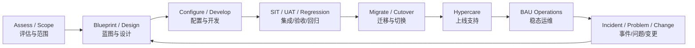
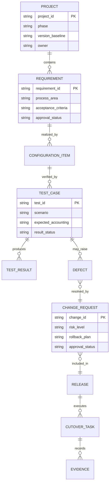

# 实施与运维生命周期（Implementation and Operations）

> 成功标准是方案可配置、可测试、可切换、可运行、可审计，并能由支持团队接管。本文把项目阶段门与生产运维连接起来。

## 阅读导航

- [阶段门](#1-生命周期与阶段门) · [项目工作流](#2-贯穿项目的五条工作流) · [切换](#3-cutover切换设计) · [上线支持](#4-上线与-hypercare) · [稳态运维](#5-稳态运维) · [交付物](#7-交付物检查表) · [生命周期专题](#9-生命周期专题)

## 交付业务架构与治理 ER 图

### 实施到运维业务架构图



### 交付治理核心 ER 图



交付物之间以可追溯关系连接：需求 → 配置/开发 → 测试 → 缺陷/变更 → 发布 → 切换证据。这样才能证明上线内容与批准范围一致。

## 1. 生命周期与阶段门

| 阶段 | 关键问题 | 最低退出条件 |
| --- | --- | --- |
| 评估与范围 | 为什么实施、哪些法人/流程/产品 | 范围、许可证、版本、集成和风险获批 |
| 方案设计 | 业务、组织、会计和控制如何落地 | Blueprint、流程/控制、架构和差异决策获批 |
| 构建与配置 | 如何配置、开发和迁移 | 配置工作簿、代码、单元测试和版本记录完整 |
| 集成与测试 | 跨系统是否完整、可恢复 | SIT/UAT/性能/安全/回归缺陷达到阈值 |
| 数据迁移与切换 | 数据和业务如何进入新系统 | 多轮演练、核对、Cutover 与回退获批 |
| Hypercare | 上线初期如何稳定 | 指标稳定、重大问题关闭、知识已移交 |
| 稳态运维 | 如何关账、变更、监控和恢复 | SLA、Runbook、监控、DR 和治理持续有效 |

## 2. 贯穿项目的五条工作流

### 2.1 方案与配置治理

每项配置记录业务理由、依赖、生效日期、环境值、迁移方式、验证结果和所有者。配置工作簿不是页面截图集合，而是可比较、可重建的受控基线。

### 2.2 数据迁移

依次完成 Profiling（剖析）、Cleansing（清洗）、Mapping（映射）、Mock Conversion（模拟迁移）、Reconciliation（对账）和 Sign-off（签核）。每类对象定义抽取截止、转换规则、业务唯一键、控制总额、拒绝处理、重跑和历史数据策略。

### 2.3 集成交付

接口契约包含字段、语义、必填、代码映射、时区/币种、文件/API 安全、批次、幂等、状态、错误、监控和服务级别。源端发送成功不等于业务导入、会计和下游完成。

### 2.4 测试与缺陷

测试层次包括单元测试、系统集成测试（SIT）、用户验收测试（UAT）、回归、性能、安全、灾备和切换演练。测试用例应包含业务前置、步骤、预期状态、预期会计、对账和证据。

### 2.5 变更与发布

变更需影响分析、批准、版本、环境推广路径、测试、回退和上线验证。紧急变更也应补齐事后审阅；开发人员不应单独批准并执行生产变更。

## 3. Cutover（切换）设计

Cutover Plan 按分钟/小时列出任务、依赖、执行人、验证人、输入、输出、最长耗时和回退点。关键内容包括业务冻结、接口停启、期初/未结数据、用户与职责、并发程序、银行/税务连接、控制总额、冒烟测试和业务开放。

回退不是一句“恢复备份”。必须说明回退决策时点、数据补偿、外围系统处理、已发生业务交易和沟通。超过不可逆点时采用前滚修复而非假定可回退。

## 4. 上线与 Hypercare

上线看板至少跟踪：接口成功率与积压、并发请求、关键业务交易、会计/GL 传输、付款/收款、性能、缺陷严重度和业务影响金额。建立每日对账和问题分诊，明确功能、技术、基础设施、银行/税务供应商责任。

退出 Hypercare 的条件包括：连续周期稳定、重大缺陷关闭、积压清零或有批准计划、月结演练/首次月结完成、运行手册验证、监控有效和支持团队正式接管。

## 5. 稳态运维

Incident（事件）恢复服务，Problem（问题）消除根因，Change（变更）受控修改。一个完整问题记录包含影响、时间线、证据、临时措施、根因、永久修复、回归范围和预防措施。

运行手册应覆盖日常接口、并发管理、期间开关、月结、用户权限、证书/密钥、容量、归档清理、备份恢复、克隆脱敏、补丁和灾备。每份手册标明风险、前置检查、命令/导航、预期结果、回退和升级联系人。

## 6. 监控与容量

监控既看技术可用性，也看业务完成度：服务存活、数据库/表空间、并发队列、接口积压、错误批次、未会计交易、未传 GL 分录和关键控制报表。阈值应基于基线和业务时限，不仅是 CPU/磁盘。

归档与清理需依据 Oracle 支持工具、法规保留期和业务审计要求；先验证备份、恢复和报表影响。克隆后必须处理敏感数据、外发邮件、银行/税务连接、并发调度和凭据。

## 7. 交付物检查表

- 范围与产品/许可证矩阵、组织与 Ledger 设计。
- 流程、控制、职责分离和会计矩阵。
- 配置工作簿、开发清单、接口契约和数据迁移映射。
- SIT/UAT/性能/安全/回归结果及缺陷清单。
- Cutover、回退、Hypercare、Runbook、监控和支持模型。
- 对账、签核、培训、知识移交和审计证据。

## 8. 建议练习

- 为 P2P 设计从配置到首次月结的端到端交付物。
- 为“接口部分成功”编写事件响应与永久修复方案。
- 制作含两个回退决策点的 Cutover 时间表。
- 演练一次恢复，证明备份可用且业务对账通过。

## 9. 生命周期专题

### 官方实施与运维依据

- [Oracle E-Business Suite Concepts Guide R12.2](https://docs.oracle.com/cd/E26401_01/doc.122/e22949/toc.htm)：企业结构、应用安全和集成边界。
- [Oracle E-Business Suite Developer's Guide R12.2](https://docs.oracle.com/cd/E26401_01/doc.122/e22961/toc.htm)：自定义 schema、APPS_INITIALIZE 和开发约束。
- [Oracle E-Business Suite Maintenance Guide R12.2](https://docs.oracle.com/cd/E26401_01/doc.122/e22954/toc.htm)：补丁、维护和应用层运维。
- [Oracle E-Business Suite Integrated SOA Gateway Implementation Guide](https://docs.oracle.com/cd/E26401_01/doc.122/e20925/toc.htm)：服务部署、认证和授权。


<!-- source: docs/11-implementation-operations/README.md -->
<a id="src-docs-11-implementation-operations-readme"></a>
### Oracle EBS 财务实施与运维生命周期


本目录将 Assessment（评估）、Blueprint（蓝图）、Build（构建）、Test（测试）、Cutover（切换）、Hypercare（上线强化支持）和 BAU Operations（常态运维）串成可审计的交付闭环。方法适用于新实施、扩展上线、升级、重大补丁和财务流程重构；具体产品配置与技术实现仍应链接对应模块正文。

<a id="src-docs-11-implementation-operations-readme--生命周期与阶段门"></a>
#### 生命周期与阶段门

| 阶段 | 关键问题 | 最低交付物 | 退出条件 |
| --- | --- | --- | --- |
| 1. Assessment | 为什么做、范围多大、现状风险是什么？ | 现状/版本/产品/许可证/CEMLI/数据量评估，范围和高阶计划 | 范围、假设、依赖、预算和治理获批准 |
| 2. Blueprint | 目标流程、组织、会计和控制如何设计？ | 企业结构、流程、COA、SLA、税务、权限、接口、报表、迁移蓝图 | 关键设计决策与差异正式签字 |
| 3. Build | 如何可重复地配置、开发和迁移？ | 配置工作簿、技术设计、代码、迁移工件、单元测试 | 工件版本化且通过评审/单测 |
| 4. Test | 业务、会计、性能和安全是否可接受？ | CRP、SIT、UAT、回归、性能、安全证据与缺陷决定 | 无阻断缺陷；业务、财务、技术共同签字 |
| 5. Cutover | 如何在受控窗口迁移并判断上线？ | 冻结、增量、Runbook、控制总额、回退/补偿、Go/No-Go | 迁移与对账完成，关键流程可用 |
| 6. Hypercare | 如何稳定运行并收敛缺陷？ | 每日监控/对账、缺陷看板、RCA、知识库和支持排班 | KPI 达标、重大问题关闭、支持团队接收 |
| 7. BAU | 如何持续关账、修补、审计和优化？ | 运行手册、月结、监控、变更、补丁、灾备和归档制度 | 持续运行，无一次性退出点 |

<a id="src-docs-11-implementation-operations-readme--专题导航"></a>
#### 专题导航

| 专题 | 中文说明 | 核心产出 |
| --- | --- | --- |
| [assessment-scope-license](#src-docs-11-implementation-operations-assessment-scope-license-readme) | 评估、范围与许可证 | 产品/版本/CEMLI/数据量清单、范围边界和风险 |
| [solution-blueprint](#src-docs-11-implementation-operations-solution-blueprint-readme) | 解决方案蓝图 | 企业结构、流程、会计、数据、集成、报表和控制设计 |
| [setup-sequence-and-workbooks](#src-docs-11-implementation-operations-setup-sequence-and-workbooks-readme) | 配置顺序与工作簿 | 依赖矩阵、配置值、迁移方式、验证和回退 |
| [data-migration-and-conversion](#src-docs-11-implementation-operations-data-migration-and-conversion-readme) | 数据迁移与转换 | Profile/Cleanse/Map/Load/Reconcile、Mock 和切换批次 |
| [integration-delivery](#src-docs-11-implementation-operations-integration-delivery-readme) | 集成交付 | 契约、幂等、状态机、安全、容量、监控和对账 |
| [testing-strategy](#src-docs-11-implementation-operations-testing-strategy-readme) | 测试策略 | CRP/SIT/UAT/回归/性能/安全、需求追踪和会计断言 |
| [cutover-and-rollback](#src-docs-11-implementation-operations-cutover-and-rollback-readme) | 切换与回退 | Freeze、Delta、Runbook、不可逆点、Go/No-Go 和补偿 |
| [hypercare-and-support-transition](#src-docs-11-implementation-operations-hypercare-and-support-transition-readme) | 上线支持与移交 | 每日对账、缺陷分级、知识转移、SLA 和接收标准 |
| [period-close-operations](#src-docs-11-implementation-operations-period-close-operations-readme) | 期间关账运维 | 关账日历、依赖、程序、对账、签字和重开控制 |
| [monitoring-and-diagnostics](#src-docs-11-implementation-operations-monitoring-and-diagnostics-readme) | 监控与诊断 | 接口/并发/Workflow/会计/服务指标和证据包 |
| [incident-problem-change](#src-docs-11-implementation-operations-incident-problem-change-readme) | 事件、问题与变更 | 恢复、RCA、已知错误、变更审批和前后验证 |
| [patching-and-upgrade](#src-docs-11-implementation-operations-patching-and-upgrade-readme) | 补丁与升级 | RUP/AD-TXK/CPU/one-off、冲突、演练、回归和发布 |
| [cloning-and-refresh](#src-docs-11-implementation-operations-cloning-and-refresh-readme) | 克隆与刷新 | Rapid Clone、环境差异、脱敏、接口隔离和验证 |
| [backup-recovery-dr](#src-docs-11-implementation-operations-backup-recovery-dr-readme) | 备份、恢复与灾备 | RPO/RTO、RMAN、Data Guard、应用恢复和演练证据 |
| [archive-purge-capacity](#src-docs-11-implementation-operations-archive-purge-capacity-readme) | 归档、清理与容量 | 保留政策、标准 Purge、增长预测、性能和审计 |

<a id="src-docs-11-implementation-operations-readme--贯穿全生命周期的工作流"></a>
#### 贯穿全生命周期的工作流

<a id="src-docs-11-implementation-operations-readme--需求到证据"></a>
##### 需求到证据

```text
业务需求
  → 方案决策/配置或 CEMLI
  → 设计与风险
  → 构建工件
  → 测试用例与结果
  → 切换步骤与验证
  → 运行控制与监控
```

Requirements Traceability Matrix（RTM，需求追踪矩阵）必须能从需求追溯到配置、开发、测试和上线证据，也能从一个生产工件反向找到批准需求和所有者。

<a id="src-docs-11-implementation-operations-readme--数量与金额对账"></a>
##### 数量与金额对账

凡涉及主数据、余额、未结交易、接口、会计或期间，至少按组织、账簿、期间、币种和业务分类验证：

```text
来源控制总额 = 成功 + 拒绝 + 在途
期初 + 增加 - 减少 ± 调整 = 期末
子账余额 + 已批准时间性差异 = GL 控制账户
```

对账结果必须记录数据截止时间、查询/报表版本、差异原因、责任人和解决期限。

<a id="src-docs-11-implementation-operations-readme--决策与例外"></a>
##### 决策与例外

架构、会计、权限、数据保留、接口补偿和切换不可逆点等重大决策使用 Decision Log（决策日志）记录：背景、选项、权衡、批准人、日期、影响和重新评估条件。任何绕过标准控制的临时方案必须有到期日和退出计划。

<a id="src-docs-11-implementation-operations-readme--主要交付物模板"></a>
#### 主要交付物模板

<a id="src-docs-11-implementation-operations-readme--solution-blueprint解决方案蓝图"></a>
##### Solution Blueprint（解决方案蓝图）

- 业务目标、范围、排除项、假设和成功指标。
- 企业结构、COA、日历、币种、Ledger 和数据访问。
- L1～L3 流程、异常/冲销、职责分离和审批。
- 主数据、税务、银行、会计事件/SLA 和报表。
- 接口、数据迁移、CEMLI、容量、安全和审计。
- 关账、运维、支持模型、风险、决策和开放事项。

<a id="src-docs-11-implementation-operations-readme--configuration-workbook配置工作簿"></a>
##### Configuration Workbook（配置工作簿）

- 对象、业务目的、导航责任、前置依赖和配置所有者。
- 配置代码/名称、中文含义、默认值依据和环境差异。
- 会计、权限、接口、报表和关账影响。
- 迁移方式、目标环境、验证证据、停用/回退方式。

<a id="src-docs-11-implementation-operations-readme--technical-design技术设计"></a>
##### Technical Design（技术设计）

- 业务契约、数据模型、状态机、字段映射和错误目录。
- EBS 上下文、受支持入口、事务、幂等、重试与补偿。
- 安全、敏感数据、性能容量、日志、指标、告警和保留。
- 对象/文件清单、依赖、ADOP/EBR、安装/卸载和回退。
- 单元、SIT、性能、安全、会计和对账断言。

<a id="src-docs-11-implementation-operations-readme--cutover-runbook切换运行手册"></a>
##### Cutover Runbook（切换运行手册）

每一步应包含：编号、负责人、计划/实际时间、前置条件、命令/导航/程序参数、输入输出、控制总额、成功标准、失败动作、重试/回退边界、证据位置和批准人。

<a id="src-docs-11-implementation-operations-readme--测试覆盖矩阵"></a>
#### 测试覆盖矩阵

| 维度 | 最低场景 |
| --- | --- |
| 业务 | 正常、取消、冲销、退回、拒绝、部分成功 |
| 时间 | 当前期、未来期、关闭期、跨期、月末/年末 |
| 组织 | 单 OU、多 OU、跨法人、数据权限拒绝 |
| 金额 | 本位币、外币、汇率缺失/变化、税、舍入、零/负数边界 |
| 集成 | 重复、乱序、超时、重放、外部不可用、回执拒绝 |
| 批量 | 代表性峰值、并发、批次拆分、恢复时间和关账窗口 |
| 会计 | Draft/Final、SLA 错误、未传 GL、导入失败、未过账、冲销 |
| 安全 | 最小权限、SoD、敏感数据、证书/密钥、审计追踪 |

<a id="src-docs-11-implementation-operations-readme--上线准备检查"></a>
#### 上线准备检查

1. 生产版本、补丁、许可证、容量和拓扑已确认。
2. 配置基线、CEMLI、接口端点、证书和调度均完成生产核对。
3. 迁移 Mock 达到质量和窗口要求，最终控制总额已批准。
4. Sev1/Sev2 缺陷关闭；剩余缺陷有业务接受和规避方案。
5. 回退与业务补偿在演练中可执行，不可逆点已标记。
6. 运维监控、告警、批处理、关账和升级路径已就绪。
7. 业务、财务、技术、安全和支持负责人完成 Go/No-Go 签字。

<a id="src-docs-11-implementation-operations-readme--hypercare-退出标准"></a>
#### Hypercare 退出标准

- 关键接口、并发请求和 Workflow 按窗口稳定运行。
- AP/AR/FA/CE/CST/SLA/GL 等关键对账无未解释重大差异。
- 缺陷数量和严重度达到接收阈值，Workaround 有有效期和所有者。
- 操作手册、已知错误、监控阈值、支持排班和供应商升级路径已移交。
- BAU 团队独立完成至少一个代表性日结/月结或批处理周期。

<a id="src-docs-11-implementation-operations-readme--生产运行原则"></a>
#### 生产运行原则

- 标准页面、公开 API、Open Interface、标准并发程序和 Oracle Support 批准方案优先。
- 不用直接 DML 基表、无审批脚本或长期手工 GL 调整掩盖根因。
- 所有变更具备影响分析、测试、回退、窗口、批准和前后验证。
- 克隆环境在连接外部系统前完成端点隔离、计划任务控制和敏感数据脱敏。
- 备份“成功”不等于可恢复；按批准 RPO/RTO 定期演练数据库和应用全链路恢复。

<a id="src-docs-11-implementation-operations-readme--相关入口"></a>
#### 相关入口

- [顾问学习手册](00-guide.md#src-docs-00-guide-consultant-handbook)
- [按生命周期阅读路径](00-guide.md#src-docs-00-guide-reading-paths-by-lifecycle)
- [生产安全与支持边界](00-guide.md#src-docs-00-guide-safety-and-production-boundaries)
- [技术架构与开发](10-technical.md#src-docs-10-technical-readme)
- [端到端流程](09-end-to-end.md#src-docs-09-end-to-end-readme)

<!-- 兼容旧版目录与学习材料的定位锚点；正文已按主题重编。 -->
<a id="src-docs-11-implementation-operations-archive-purge-capacity-readme"></a>
<a id="src-docs-11-implementation-operations-archive-purge-capacity-readme--最低交付"></a>
<a id="src-docs-11-implementation-operations-archive-purge-capacity-readme--目标"></a>
<a id="src-docs-11-implementation-operations-archive-purge-capacity-readme--财务控制"></a>
<a id="src-docs-11-implementation-operations-archive-purge-capacity-readme--运行边界"></a>
<a id="src-docs-11-implementation-operations-assessment-scope-license-readme"></a>
<a id="src-docs-11-implementation-operations-assessment-scope-license-readme--最低交付"></a>
<a id="src-docs-11-implementation-operations-assessment-scope-license-readme--目标"></a>
<a id="src-docs-11-implementation-operations-assessment-scope-license-readme--财务控制"></a>
<a id="src-docs-11-implementation-operations-assessment-scope-license-readme--运行边界"></a>
<a id="src-docs-11-implementation-operations-backup-recovery-dr-readme"></a>
<a id="src-docs-11-implementation-operations-backup-recovery-dr-readme--最低交付"></a>
<a id="src-docs-11-implementation-operations-backup-recovery-dr-readme--目标"></a>
<a id="src-docs-11-implementation-operations-backup-recovery-dr-readme--财务控制"></a>
<a id="src-docs-11-implementation-operations-backup-recovery-dr-readme--运行边界"></a>
<a id="src-docs-11-implementation-operations-cloning-and-refresh-readme"></a>
<a id="src-docs-11-implementation-operations-cloning-and-refresh-readme--最低交付"></a>
<a id="src-docs-11-implementation-operations-cloning-and-refresh-readme--目标"></a>
<a id="src-docs-11-implementation-operations-cloning-and-refresh-readme--财务控制"></a>
<a id="src-docs-11-implementation-operations-cloning-and-refresh-readme--运行边界"></a>
<a id="src-docs-11-implementation-operations-cutover-and-rollback-readme"></a>
<a id="src-docs-11-implementation-operations-cutover-and-rollback-readme--最低交付"></a>
<a id="src-docs-11-implementation-operations-cutover-and-rollback-readme--目标"></a>
<a id="src-docs-11-implementation-operations-cutover-and-rollback-readme--财务控制"></a>
<a id="src-docs-11-implementation-operations-cutover-and-rollback-readme--运行边界"></a>
<a id="src-docs-11-implementation-operations-data-migration-and-conversion-readme"></a>
<a id="src-docs-11-implementation-operations-data-migration-and-conversion-readme--最低交付"></a>
<a id="src-docs-11-implementation-operations-data-migration-and-conversion-readme--目标"></a>
<a id="src-docs-11-implementation-operations-data-migration-and-conversion-readme--财务控制"></a>
<a id="src-docs-11-implementation-operations-data-migration-and-conversion-readme--运行边界"></a>
<a id="src-docs-11-implementation-operations-hypercare-and-support-transition-readme"></a>
<a id="src-docs-11-implementation-operations-hypercare-and-support-transition-readme--最低交付"></a>
<a id="src-docs-11-implementation-operations-hypercare-and-support-transition-readme--目标"></a>
<a id="src-docs-11-implementation-operations-hypercare-and-support-transition-readme--财务控制"></a>
<a id="src-docs-11-implementation-operations-hypercare-and-support-transition-readme--运行边界"></a>
<a id="src-docs-11-implementation-operations-incident-problem-change-readme"></a>
<a id="src-docs-11-implementation-operations-incident-problem-change-readme--最低交付"></a>
<a id="src-docs-11-implementation-operations-incident-problem-change-readme--目标"></a>
<a id="src-docs-11-implementation-operations-incident-problem-change-readme--财务控制"></a>
<a id="src-docs-11-implementation-operations-incident-problem-change-readme--运行边界"></a>
<a id="src-docs-11-implementation-operations-integration-delivery-readme"></a>
<a id="src-docs-11-implementation-operations-integration-delivery-readme--最低交付"></a>
<a id="src-docs-11-implementation-operations-integration-delivery-readme--目标"></a>
<a id="src-docs-11-implementation-operations-integration-delivery-readme--财务控制"></a>
<a id="src-docs-11-implementation-operations-integration-delivery-readme--运行边界"></a>
<a id="src-docs-11-implementation-operations-monitoring-and-diagnostics-readme"></a>
<a id="src-docs-11-implementation-operations-monitoring-and-diagnostics-readme--最低交付"></a>
<a id="src-docs-11-implementation-operations-monitoring-and-diagnostics-readme--目标"></a>
<a id="src-docs-11-implementation-operations-monitoring-and-diagnostics-readme--财务控制"></a>
<a id="src-docs-11-implementation-operations-monitoring-and-diagnostics-readme--运行边界"></a>
<a id="src-docs-11-implementation-operations-patching-and-upgrade-readme"></a>
<a id="src-docs-11-implementation-operations-patching-and-upgrade-readme--最低交付"></a>
<a id="src-docs-11-implementation-operations-patching-and-upgrade-readme--目标"></a>
<a id="src-docs-11-implementation-operations-patching-and-upgrade-readme--财务控制"></a>
<a id="src-docs-11-implementation-operations-patching-and-upgrade-readme--运行边界"></a>
<a id="src-docs-11-implementation-operations-period-close-operations-readme"></a>
<a id="src-docs-11-implementation-operations-period-close-operations-readme--最低交付"></a>
<a id="src-docs-11-implementation-operations-period-close-operations-readme--目标"></a>
<a id="src-docs-11-implementation-operations-period-close-operations-readme--财务控制"></a>
<a id="src-docs-11-implementation-operations-period-close-operations-readme--运行边界"></a>
<a id="src-docs-11-implementation-operations-setup-sequence-and-workbooks-readme"></a>
<a id="src-docs-11-implementation-operations-setup-sequence-and-workbooks-readme--最低交付"></a>
<a id="src-docs-11-implementation-operations-setup-sequence-and-workbooks-readme--目标"></a>
<a id="src-docs-11-implementation-operations-setup-sequence-and-workbooks-readme--财务控制"></a>
<a id="src-docs-11-implementation-operations-setup-sequence-and-workbooks-readme--运行边界"></a>
<a id="src-docs-11-implementation-operations-solution-blueprint-readme"></a>
<a id="src-docs-11-implementation-operations-solution-blueprint-readme--最低交付"></a>
<a id="src-docs-11-implementation-operations-solution-blueprint-readme--目标"></a>
<a id="src-docs-11-implementation-operations-solution-blueprint-readme--财务控制"></a>
<a id="src-docs-11-implementation-operations-solution-blueprint-readme--运行边界"></a>
<a id="src-docs-11-implementation-operations-testing-strategy-readme"></a>
<a id="src-docs-11-implementation-operations-testing-strategy-readme--最低交付"></a>
<a id="src-docs-11-implementation-operations-testing-strategy-readme--目标"></a>
<a id="src-docs-11-implementation-operations-testing-strategy-readme--财务控制"></a>
<a id="src-docs-11-implementation-operations-testing-strategy-readme--运行边界"></a>
