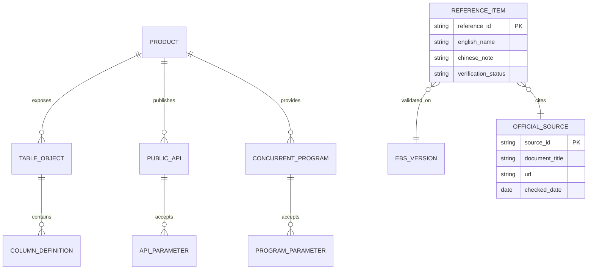

# 统一参考资料（Reference）

> 本页用于快速定位产品前缀、关键对象、程序、状态和中英文术语。表与列、API 签名、菜单和程序名称可能随产品、版本和补丁变化，必须在目标实例复核。

## 阅读导航

- [产品前缀](#1-产品前缀速查) · [会计对象](#2-会计追溯对象) · [并发程序](#3-常用并发程序概念索引) · [接口 API](#4-接口与-api-选型检查) · [状态](#5-状态解释原则) · [官方资料](#6-官方资料定位) · [中英文术语](#8-中英文术语与缩略语)

## 参考资料架构与 ER 图

参考项应至少关联产品、版本和官方来源；未在目标实例验证的表、API 或状态标记为待验证。

## 1. 产品前缀速查

| 前缀 | 英文名称 | 中文说明 |
| --- | --- | --- |
| GL | General Ledger | 总账 |
| XLA | Subledger Accounting | 子账会计 |
| AP | Payables | 应付管理 |
| AR/RA | Receivables | 应收管理 |
| PO | Purchasing | 采购管理 |
| RCV | Receiving | 接收/收货 |
| FA | Fixed Assets | 固定资产 |
| PA | Projects | 项目管理 |
| CE | Cash Management | 现金管理 |
| IBY | Payments | 支付管理 |
| ZX | E-Business Tax | 电子商务税务 |
| HZ | Trading Community Architecture | 交易社区架构/客户参与方 |
| MTL/INV | Inventory | 库存管理 |
| WIP | Work in Process | 在制品管理 |
| CST | Cost Management | 成本管理 |
| FND | Application Object Library | 应用对象库/基础技术对象 |
| WF | Workflow | 工作流 |

## 2. 会计追溯对象

| 层次 | 常见对象 | 用途 |
| --- | --- | --- |
| 业务交易 | 各产品 header/line/distribution 表 | 单据、行和分配 |
| 交易实体/事件 | `XLA_TRANSACTION_ENTITIES`、`XLA_EVENTS` | 来源实体和会计事件 |
| SLA 分录 | `XLA_AE_HEADERS`、`XLA_AE_LINES`、分配链接 | 会计分录和来源分配 |
| GL 导入 | `GL_INTERFACE`、`GL_IMPORT_REFERENCES` | 导入暂存和来源引用 |
| GL 日记账 | `GL_JE_BATCHES/HEADERS/LINES` | 日记账批、头、行 |
| GL 余额 | `GL_BALANCES` | 科目、期间、币种余额 |

查询时先确认 Ledger、OU、期间和业务键；不要根据本表直接在生产编写无界全表查询。

## 3. 常用并发程序（概念索引）

| 程序/程序族 | 中文说明 | 关键验证 |
| --- | --- | --- |
| Create Accounting | 创建会计 | 事件、模式、错误、传 GL 选项 |
| Transfer Journal Entries to GL | 传送日记账到总账 | 传输状态、批次、请求 ID |
| Journal Import | 日记账导入 | Source、Group ID、错误行 |
| Posting | 过账 | 批状态、期间、账户、审批 |
| Payables Open Interface Import | 应付开放接口导入 | 批次、来源、拒绝与业务发票 |
| AutoInvoice | 自动开票 | 来源、分组规则、拒绝、交易号 |
| AutoLockbox | 自动收款箱 | 文件、客户识别、核销与异常 |
| Depreciation | 折旧 | 资产账簿、期间、异常资产 |
| Material Transaction Manager | 物料事务处理管理器 | 接口状态、错误、交易 ID |

## 4. 接口与 API 选型检查

优先顺序：标准页面/批量工具 → Open Interface → Public API → Integration Repository 服务 → 受控自定义。评审字段语义、必填、业务唯一键、批次、控制总额、幂等、部分成功、错误回放、安全、监控和对账。任何写入方案都不得直接 DML EBS 业务基表。

## 5. 状态解释原则

- `NEW`、`PENDING`、`PROCESSED`、`ERROR` 等值在不同产品含义不同，必须结合表、程序和版本解释。
- 并发请求 Phase/Status 与业务单据状态是两套状态。
- 接口处理成功、业务导入成功、创建会计成功、传 GL 成功和过账成功是五个独立结论。
- 状态码查询应同时输出可读含义、更新时间、请求 ID 和错误信息。

## 6. 官方资料定位

- Oracle E-Business Suite Documentation Web Library：按目标 R12.2 版本查 Implementation、User、Technical 和 Upgrade Guides。
- eTRM：核实表、视图、列和对象关系。
- Integration Repository：核实公开 API、接口和服务签名。
- My Oracle Support（MOS）：核实补丁、已知问题和诊断脚本；记录文档编号、版本和访问日期。
- 目标实例数据字典与日志：对实例行为具有最终验证意义。

## 7. 参考项维护模板

新增表、程序、API、错误或 MOS 文档时，记录：产品/版本、英文名、中文说明、用途、输入/主键、关键状态、输出、权限/安全、验证环境、官方来源和最后复核日期。没有实例或官方依据的内容标注“待验证”，不要包装成确定事实。

### 7.1 本次复核的官方来源矩阵（2026-08-29）

| 主题 | Oracle 官方资料 |
| --- | --- |
| EBS R12.2 总库 | [Release 12.2 Documentation Library](https://docs.oracle.com/cd/E26401_01/index.htm) |
| 财务公共概念/实施 | [Financials Concepts](https://docs.oracle.com/cd/E26401_01/doc.122/e48836/toc.htm) · [Financials Implementation](https://docs.oracle.com/cd/E26401_01/doc.122/e48783/toc.htm) |
| GL/SLA | [General Ledger User's Guide](https://docs.oracle.com/cd/E26401_01/doc.122/e48748/toc.htm) · [SLA Implementation](https://docs.oracle.com/cd/E26401_01/doc.122/e48771/title.htm) |
| AP/AR/CE/EBTax | [Payables User](https://docs.oracle.com/cd/E26401_01/doc.122/e48760/toc.htm) · [Receivables User](https://docs.oracle.com/cd/E26401_01/doc.122/f10570/toc.htm) · [Cash Management](https://docs.oracle.com/cd/E26401_01/doc.122/e48900/toc.htm) · [EBTax Implementation](https://docs.oracle.com/cd/E26401_01/doc.122/e48750/toc.htm) · [EBTax User](https://docs.oracle.com/cd/E26401_01/doc.122/e48751/toc.htm) |
| Inventory/Cost/WIP | [Inventory User](https://docs.oracle.com/cd/E26401_01/doc.122/e48820/toc.htm) · [Cost Management](https://docs.oracle.com/cd/E26401_01/doc.122/e48829/toc.htm) · [WIP User](https://docs.oracle.com/cd/E26401_01/doc.122/e48905/toc.htm) |
| Projects/Assets | [Project Costing](https://docs.oracle.com/cd/E26401_01/doc.122/e48918/toc.htm) · [Project Billing](https://docs.oracle.com/cd/E26401_01/doc.122/e49079/toc.htm) · [Assets](https://docs.oracle.com/cd/E26401_01/doc.122/e48755/toc.htm) |
| 技术/集成 | [ISG Implementation](https://docs.oracle.com/cd/E26401_01/doc.122/e20925/) · [ISG Developer](https://docs.oracle.com/cd/E26401_01/doc.122/e20927/) · [EBS Developer's Guide](https://docs.oracle.com/cd/E26401_01/doc.122/e22961/) · [eTRM User's Guide](https://docs.oracle.com/cd/E26401_01/doc.122/f53031/) |

## 8. 中英文术语与缩略语

<!-- source: docs/90-reference/glossary-and-acronyms.md -->

### Oracle EBS R12.2.x 中英文术语与缩略语

同一缩略语在不同上下文可能有不同含义。例如 SLA 在本知识库通常表示 Subledger Accounting（子账会计），在运维合同中也可能表示 Service Level Agreement（服务级别协议）。使用时应先确认产品和语境。

#### 产品与核心财务

| 缩写/术语 | 英文全称 | 中文名称 | 简要说明 |
| --- | --- | --- | --- |
| EBS | Oracle E-Business Suite | Oracle 电子商务套件 | Oracle 的企业应用套件；本文默认 R12.2.x |
| ERP | Enterprise Resource Planning | 企业资源计划 | 覆盖财务、采购、供应链、项目、人力等企业流程 |
| Financials | Oracle Financials | Oracle 财务产品组 | GL、AP、AR、FA、CE、SLA、税务等产品集合 |
| GL | General Ledger | 总账 | 日记账、过账、余额、重估、折算和财务报告 |
| AP | Payables | 应付账款 | 供应商发票、匹配、暂停、审批、负债和付款计划 |
| AR | Receivables | 应收账款 | 客户交易、收款、核销、调整、收入和账龄 |
| FA | Fixed Assets / Assets | 固定资产 | 资产新增、折旧、调整、转移和报废 |
| CE | Cash Management | 现金管理 | 银行账户、对账单、自动对账、现金头寸和预测 |
| IBY | Oracle Payments | Oracle 支付 | 付款/收款执行、格式、支付指令、传输和回执 |
| ZX / EBTax | E-Business Tax | 电子商务税 | 交易税规则、税率、税额、抵扣和税务明细；技术前缀常为 ZX |
| XLA / SLA | Subledger Accounting | 子账会计 | 从子账事件生成会计分录并传送总账；技术前缀常为 XLA |
| FAH | Financials Accounting Hub | 财务会计中心 | 可选产品；为外部或扩展交易来源建立会计规则与分录 |
| AGIS | Advanced Global Intercompany System | 高级全球公司间系统 | 可选产品；管理公司间交易、审批和下游 AP/AR/GL 处理 |
| PA | Oracle Projects | Oracle 项目管理 | 项目基础、成本、开票、资本化等产品；技术前缀常为 PA |
| PO | Purchasing | 采购 | 请购、询报价、采购订单、协议和采购控制 |
| RCV | Receiving | 接收 | 收货、检验、入库、退货、纠正和接收应计 |
| INV | Inventory | 库存 | 物料、现有量、库存事务、批次/序列和估值 |
| MTL | Material / Inventory technical prefix | 物料/库存技术前缀 | 许多库存表和程序使用 MTL 前缀；不等同于产品业务名称 |
| CST | Cost Management | 成本管理 | 成本要素、成本类型、成本计算、分配和差异 |
| WIP | Work in Process | 在制品 | 工单、领料、资源、完工、关闭和差异 |
| BOM | Bills of Material | 物料清单 | 产品结构、组件和制造成本卷积的基础 |
| OPM | Oracle Process Manufacturing | Oracle 流程制造 | 配方、批次和流程制造成本等可选产品能力 |
| LCM | Landed Cost Management | 到岸成本管理 | 将运费、关税等附加费用分配至接收/库存成本 |
| OM | Order Management | 订单管理 | 销售订单、定价、信用检查和履行编排 |
| WSH | Shipping Execution | 发运执行 | 拣货、交货、发运确认和物流执行 |
| TCA | Trading Community Architecture | 贸易社区架构 | Party、地点、账户、关系及客户/供应商共享身份模型 |
| HRMS/HCM | Human Resources Management System / Human Capital Management | 人力资源/人力资本管理 | 组织、员工和费用报销等流程的上游基础 |
| iProcurement | Oracle iProcurement | 互联网采购 | 员工自助请购和目录采购 |
| iSupplier | Oracle iSupplier Portal | 供应商门户 | 供应商协同与订单、发运、发票信息访问 |
| iExpenses | Oracle Internet Expenses | 互联网费用报销 | 费用报告、政策、公司卡、审批和 AP 导入 |
| iReceivables | Oracle iReceivables | 互联网应收 | 客户自助账单、付款和争议能力 |
| ECC | Enterprise Command Center | 企业指挥中心 | 可选运营看板和数据发现能力，需确认产品版本与安装 |

#### 企业结构、核算与权限

| 缩写/术语 | 英文全称 | 中文名称 | 简要说明 |
| --- | --- | --- | --- |
| BG | Business Group | 业务组 | 主要是人力资源和组织模型的顶层上下文，不等于财务核算主体 |
| LE | Legal Entity | 法律实体/法人实体 | 承担法律、税务和法定报告责任的实体 |
| LEC | Legal Entity Configurator | 法律实体配置器 | 定义法律实体、法律登记和部分机构关系的功能 |
| ASM | Accounting Setup Manager | 会计设置管理器 | 配置 Ledger、会计选项和相关核算表示的工作台 |
| Ledger | Ledger | 账簿 | 由 COA、日历、币种、会计方法等主要核算属性组成 |
| Primary Ledger | Primary Ledger | 主账簿 | 交易的主要会计记录 |
| Secondary Ledger | Secondary Ledger | 辅助账簿 | 按不同会计表示保存另一套明细或日记账/余额 |
| Ledger Set | Ledger Set | 账簿集 | 多账簿访问、查询、报表或批处理的逻辑集合 |
| Reporting Currency | Reporting Currency | 报告币种 | 为账簿提供附加币种表示，转换层级依配置而定 |
| SOB | Set of Books | 账套（旧术语） | 11i 常用概念；R12 核心模型改为 Ledger，部分列名仍保留 `SET_OF_BOOKS_ID` |
| OU | Operating Unit | 经营单位 | AP、AR、PO 等多组织交易的数据边界 |
| IO | Inventory Organization | 库存组织 | 库存、成本和制造业务的组织范围；需避免与 Input/Output 等缩写混淆 |
| MO | Multi-Org | 多组织 | EBS 按经营单位等组织维度隔离交易数据的机制 |
| MOAC | Multi-Org Access Control | 多组织访问控制 | 允许一个职责按安全配置访问多个 OU |
| Security Profile | Security Profile | 安全配置文件 | 定义可访问组织集合；具体使用依产品和责任配置 |
| DAS | Data Access Set | 数据访问集 | 控制 GL 账簿/平衡段值的读写权限 |
| COA | Chart of Accounts | 科目表 | 会计科目结构、段、值集和组合规则 |
| CCID | Code Combination ID | 科目组合标识 | 唯一标识一组会计段值，常对应 `GL_CODE_COMBINATIONS.CODE_COMBINATION_ID` |
| Balancing Segment | Balancing Segment | 平衡段 | 要求借贷平衡的科目段，常用于公司维度 |
| Natural Account | Natural Account Segment | 自然科目段 | 表示资产、负债、收入、费用等自然会计属性的段 |
| CVR | Cross-Validation Rule | 交叉验证规则 | 控制不同弹性域段值组合是否合法 |
| Dynamic Insertion | Dynamic Insertion | 动态插入 | 允许在使用时动态创建有效科目组合的能力 |
| KFF | Key Flexfield | 关键弹性域 | 构成具有业务意义的组合键，如 Accounting Flexfield |
| DFF | Descriptive Flexfield | 说明性弹性域 | 在标准对象上保存客户附加属性 |
| EFF | Extensible Flexfield | 可扩展弹性域 | 以属性组等方式扩展对象；具体产品支持范围需确认 |
| Value Set | Value Set | 值集 | 定义字段/弹性域值的格式、验证和来源 |
| Lookup | Lookup | 快速编码/查找代码 | 代码、显示含义和启停日期等可配置枚举 |
| Profile Option | Profile Option | 配置文件选项 | 可在站点、应用、职责、用户等层级影响系统行为 |
| Responsibility | Responsibility | 职责 | 组合应用、菜单、请求组和部分数据上下文的用户访问入口 |
| Request Group | Request Group | 请求组 | 控制职责可以提交哪些并发程序和请求集 |
| RBAC | Role-Based Access Control | 基于角色的访问控制 | 通过角色和权限授权功能/数据访问 |
| UMX | User Management | 用户管理 | EBS 用户、角色、权限和注册流程相关产品能力 |
| SoD | Segregation of Duties | 职责分离 | 防止单一人员同时拥有不相容业务权限的控制 |

#### 会计、交易与关账

| 缩写/术语 | 英文全称 | 中文名称 | 简要说明 |
| --- | --- | --- | --- |
| Accounting Event | Accounting Event | 会计事件 | 业务交易中可被 SLA 会计处理的事件 |
| Event Class | Event Class | 事件类 | 对相似会计事件的分类 |
| Event Type | Event Type | 事件类型 | 事件类下更具体的业务动作类型 |
| AMB | Accounting Methods Builder | 会计方法构建器 | 配置 SLA 会计定义、规则和分录行的框架 |
| AAD | Application Accounting Definition | 应用会计定义 | 组织事件与会计规则的 SLA 定义对象 |
| SLAM | Subledger Accounting Method | 子账会计方法 | 将一组应用会计定义关联到 Ledger |
| JLT | Journal Line Type | 日记账行类型 | 定义 SLA 分录行的借贷、余额类型等行为 |
| ADR | Account Derivation Rule | 账户派生规则 | 派生完整账户或单个会计段 |
| Mapping Set | Mapping Set | 映射集 | 按输入值映射输出值，常用于账户派生 |
| Create Accounting | Create Accounting | 创建会计 | 从符合条件的子账事件生成 Draft/Final SLA 分录 |
| Draft Accounting | Draft Accounting | 草稿会计 | 用于预览/验证的非最终会计，不应视为已入账 |
| Final Accounting | Final Accounting | 最终会计 | 已最终生成的 SLA 会计，可按配置传 GL |
| Transfer to GL | Transfer to General Ledger | 传送至总账 | 将 SLA 会计传送至 GL 导入链 |
| Journal Import | Journal Import | 日记账导入 | 从 `GL_INTERFACE` 等来源生成 GL 日记账 |
| Posting | Posting | 过账 | 将已批准/有效日记账更新至总账余额 |
| Journal Source | Journal Source | 日记账来源 | 标识日记账来源系统或子账 |
| Journal Category | Journal Category | 日记账类别 | 标识交易/调整类型，用于控制与报告 |
| Encumbrance | Encumbrance Accounting | 保留/承诺会计 | 记录采购承诺或预算占用；是否适用取决于预算控制设计 |
| Funds Check | Funds Check | 资金检查/预算检查 | 检查预算资金是否足够 |
| Revaluation | Revaluation | 外币重估 | 按期末汇率重估外币余额并产生损益 |
| Translation | Translation | 外币折算 | 将账簿余额折算到另一报告币种视角 |
| Consolidation | Consolidation | 合并 | 汇集多实体/账簿财务数据并处理调整和抵销 |
| Intercompany | Intercompany | 公司间 | 法人或平衡主体之间的交易及其平衡/对账 |
| Suspense | Suspense Accounting | 暂记会计 | 在特定不平等情况下使用暂记账户；应严格监控 |
| Accrual | Accrual | 应计/暂估 | 在现金发生前确认费用、负债或收入的会计处理 |
| Receipt Accrual | Receipt Accrual | 收货应计 | 根据接收事件确认采购应计，具体时点依设置 |
| Period-End Accrual | Period-End Accrual | 期末应计 | 期末对符合条件的未开票采购接收计提 |
| Liability | Liability | 负债 | AP 发票会计形成的应付义务控制余额 |
| Cash Clearing | Cash Clearing | 现金清算 | 付款/收款与银行最终清算之间的过渡账户 |
| Trial Balance | Trial Balance | 试算平衡表 | 按账户或子账维度显示借贷/余额并用于对账 |
| Aging | Aging | 账龄 | 按逾期时间段分析应收/应付未结项目 |
| Period Close | Period Close | 期间关闭/月结 | 完成交易、会计、对账、报告并关闭期间的过程 |
| Reconciliation | Reconciliation | 对账 | 比较两个记录体系的数量、金额和状态并解释差异 |
| Control Account | Control Account | 控制账户 | 汇总子账余额的总账账户，通常限制手工日记账 |
| Reversal | Reversal | 冲销 | 用反向会计或业务动作取消原交易影响 |
| Adjustment | Adjustment | 调整 | 依据业务规则修改余额、金额或会计影响 |
| Write-off | Write-off | 核销/转销 | 将小额或不可收回余额按批准规则转销 |
| DPIS | Date Placed in Service | 资产启用日期 | 固定资产开始投入使用并影响折旧计算的日期 |
| CIP | Construction in Process | 在建工程 | 尚未达到可使用状态、待资本化的项目/资产成本 |
| COGS | Cost of Goods Sold | 销售成本 | 与销售收入对应确认的存货成本 |

#### 端到端流程

| 缩写 | 英文全称 | 中文名称 | 范围 |
| --- | --- | --- | --- |
| R2R | Record to Report | 记录到报告 | 子账/日记账、SLA、GL、合并、报告和关账 |
| P2P | Procure to Pay | 采购到付款 | 供应商、采购、接收、AP、IBY、CE 和 GL |
| O2C | Order to Cash | 订单到收款 | 订单、发运、AR 开票、收款和会计 |
| C2C | Credit to Cash | 信用到收款 | 客户信用、应收、催收、争议、收款和现金 |
| A2R | Acquire to Retire | 资产取得到退出 | 采购/项目来源、资产、折旧、调整和报废 |
| P2C | Project to Cash | 项目到收款 | 项目成本、收入、开票、AR 和收款 |
| P2A | Project to Asset | 项目到资产 | 项目 CIP、资本化、FA 和 GL 对账 |
| E2R | Expense to Reimbursement | 费用到报销 | 费用报告、审批、AP、付款和银行对账 |

#### 采购、应付与支付

| 术语 | 英文全称 | 中文名称 | 简要说明 |
| --- | --- | --- | --- |
| Requisition | Purchase Requisition | 采购申请/请购单 | 内部采购需求，批准后可转采购订单 |
| PO | Purchase Order | 采购订单 | 对供应商的采购承诺和条款 |
| BPA | Blanket Purchase Agreement | 一揽子采购协议 | 在一定期间/金额范围内约定价格和条款 |
| Receipt | Receipt | 收货/接收 | 记录供应商交付；与库存入库可能是不同步骤 |
| Inspection | Inspection | 检验 | 4-way Match 等场景的接受/拒绝控制 |
| Match | Invoice Matching | 发票匹配 | 将 AP 发票与 PO/Receipt/Inspection 比较 |
| 2-way Match | Two-Way Match | 二单匹配 | 发票与采购订单比较 |
| 3-way Match | Three-Way Match | 三单匹配 | 发票、采购订单与收货比较 |
| 4-way Match | Four-Way Match | 四单匹配 | 再加入检验接受数量 |
| Tolerance | Tolerance | 容差 | 允许的价格、数量、汇率等差异范围 |
| Hold | Hold | 暂停/冻结 | 阻止发票付款或后续处理的控制状态 |
| Prepayment | Prepayment Invoice | 预付款发票 | 预先支付并可按规则核销到标准发票 |
| PPR | Payment Process Request | 付款流程请求 | IBY 组织付款选择、构建、格式化和支付指令的批次 |
| Payment Instruction | Payment Instruction | 支付指令 | 将付款聚合成待格式化/传输的银行指令 |
| Positive Pay | Positive Pay | 支票防伪核验 | 向银行发送已签发支票信息供兑付校验 |
| ACK | Acknowledgement | 确认回执 | 外部系统/银行对文件或交易的接收、接受或拒绝反馈 |
| ERS | Evaluated Receipt Settlement | 收货结算/自开票 | 按收货和采购条件自动形成结算/发票的机制 |

#### 应收、收款与信用

| 术语 | 英文全称 | 中文名称 | 简要说明 |
| --- | --- | --- | --- |
| Transaction Type | Transaction Type | 事务处理类型 | 控制 AR 发票/贷项等交易的部分业务与会计行为 |
| Transaction Source | Transaction Source | 事务处理来源 | 标识手工或 AutoInvoice 来源和编号/导入规则 |
| AutoInvoice | AutoInvoice | 自动开票 | 从接口表验证并创建 AR 交易的标准程序 |
| AutoAccounting | AutoAccounting | 自动会计 | 为 AR 交易派生应收、收入、税等账户 |
| Receipt | Cash Receipt | 现金收款 | 记录客户付款；可处于未识别、未核销、已核销等状态 |
| Application | Receipt Application | 收款核销 | 将收款应用到发票、借项或其他应收项目 |
| AutoCash | AutoCash Rule Set | 自动核销规则集 | 决定收款自动匹配和核销顺序 |
| AutoLockbox | AutoLockbox | 自动银行收款箱 | 导入银行收款数据并创建/核销 AR 收款 |
| Remittance | Remittance | 汇款/托收 | 将收款提交银行处理的阶段 |
| Chargeback | Chargeback | 退单/转回欠款 | 对短付等差额建立新的应收项目 |
| Credit Memo | Credit Memo | 贷项通知单 | 减少客户应收或调整原交易 |
| Debit Memo | Debit Memo | 借项通知单 | 增加客户应收的调整交易 |
| Delinquency | Delinquency | 逾期项目 | 进入催收管理的逾期应收项目 |
| Promise to Pay | Promise to Pay | 付款承诺 | 客户承诺在指定日期/金额付款的催收记录 |
| Dunning | Dunning | 催款 | 对逾期客户发出催款通知的流程 |

#### 资产、项目、库存与成本

| 术语 | 英文全称 | 中文名称 | 简要说明 |
| --- | --- | --- | --- |
| Asset Book | Asset Book | 资产账簿 | 资产会计、折旧和报告的核算集合，可分公司账/税务账 |
| Corporate Book | Corporate Book | 公司资产账簿 | 企业会计使用的主要资产账簿 |
| Tax Book | Tax Book | 税务资产账簿 | 按税法维护的资产折旧表示，通常与公司账关联 |
| Asset Category | Asset Category | 资产类别 | 决定默认账簿规则、账户和折旧属性 |
| Mass Additions | Mass Additions | 成批增加 | 从 AP/Projects/外部来源导入并准备创建资产 |
| Depreciation | Depreciation | 折旧 | 在使用年限内分配可折旧成本 |
| Prorate Convention | Prorate Convention | 折旧分摊惯例 | 决定启用期间首期折旧起算规则 |
| Retirement | Retirement | 资产报废/退出 | 全部或部分退出资产并确认相关损益 |
| Reinstatement | Reinstatement | 恢复报废 | 按规则恢复先前报废的资产 |
| Project | Project | 项目 | 项目成本、开票、预算或资本化的顶层业务对象 |
| Task | Task | 项目任务 | 项目分解、成本/收入归集与控制节点 |
| Expenditure Item | Expenditure Item | 支出项目 | 项目中可分配和会计的成本明细 |
| Burdening | Burdening | 间接成本分摊 | 按规则在直接成本上计算间接成本 |
| Project Asset | Project Asset | 项目资产 | 用于将项目资本成本归集并转入 FA 的对象 |
| On-hand | On-hand Quantity | 现有量 | 某组织/子库存/库位/批次等维度的库存数量 |
| Material Transaction | Material Transaction | 物料事务 | 接收、发料、转移、完工、销售等库存数量变化 |
| Cost Type | Cost Type | 成本类型 | 保存标准、冻结、当前或模拟成本等成本集合 |
| Cost Element | Cost Element | 成本要素 | Material、Material Overhead、Resource、OSP、Overhead 等成本分类 |
| OSP | Outside Processing | 外协加工 | 制造过程中由外部供应商执行的工序/资源成本 |
| Cost Rollup | Cost Rollup | 成本卷积 | 根据 BOM、Routing 和成本资料计算产品成本 |
| Cost Update | Cost Update | 成本更新 | 将计算成本更新为指定成本类型并产生调整影响 |
| WIP Variance | WIP Variance | 在制品差异 | 工单关闭时实际成本与标准/吸收等之间的差额 |

#### 技术架构与开发

| 缩写/术语 | 英文全称 | 中文名称 | 简要说明 |
| --- | --- | --- | --- |
| AOL | Application Object Library | 应用对象库 | EBS 用户、职责、菜单、并发、Profile 等公共基础设施 |
| FND | Foundation / Application Object Library prefix | 基础应用技术前缀 | 常见公共表、Package 和程序前缀 |
| APPS Schema | APPS Schema | APPS 数据库模式 | 通过同义词和授权提供 EBS 统一对象访问入口 |
| Product Schema | Product Schema | 产品数据库模式 | AP、AR、GL、XLA、ZX 等产品对象的拥有者 Schema |
| eTRM | Electronic Technical Reference Manual | 电子技术参考手册 | 查询 EBS 数据库对象定义与依赖的官方参考 |
| WHO Columns | WHO Columns | WHO 审计列 | 创建/更新用户、日期、登录或请求等基础追溯字段 |
| Base Table | Base Table | 基表 | 持久保存业务数据的表；不得直接 DML 绕过产品校验 |
| Synonym | Synonym | 同义词 | 为数据库对象提供另一个名称，APPS 常用其访问产品对象 |
| Editioning View | Editioning View | 版本化视图 | EBR 中隔离应用代码与基础表结构变化的视图 |
| API | Application Programming Interface | 应用程序编程接口 | 程序调用入口；只有官方公开且适用版本的 API 才视为受支持 |
| Open Interface | Open Interface | 开放接口 | 官方接口表、校验和导入程序组成的批量集成入口 |
| Interface Table | Interface Table | 接口表 | 暂存待标准程序校验/导入的数据；不是业务最终表 |
| Staging Table | Staging Table | 暂存表 | 客户自定义接收、清洗、映射、状态和重试数据的表 |
| Idempotency | Idempotency | 幂等性 | 同一业务请求重复执行不会造成重复业务结果 |
| Correlation ID | Correlation Identifier | 关联标识 | 串联来源、中间件、EBS 请求、业务对象和回执的统一标识 |
| Retry | Retry | 重试 | 对可恢复技术失败按上限和退避策略再次处理 |
| Replay | Replay | 重放 | 在保持业务唯一性和审计的前提下重新处理消息/批次 |
| Compensation | Compensation | 补偿 | 无法技术回滚时用批准的业务反向动作抵消影响 |
| DLQ | Dead Letter Queue | 死信队列 | 保存超过重试上限或无法处理的消息供人工处置 |
| REST | Representational State Transfer | 表述性状态转移 | 常见 HTTP API 风格；EBS 可通过 ISG 等受支持方式提供部分服务 |
| SOAP | Simple Object Access Protocol | 简单对象访问协议 | 基于 XML/WSDL 的 Web Service 协议 |
| ISG | Integrated SOA Gateway | 集成 SOA 网关 | 从 Integration Repository 部署和管理 EBS 服务 |
| OIC | Oracle Integration Cloud | Oracle 集成云 | 可与 EBS 连接的 Oracle 云集成平台，属于外部组件 |
| XML Gateway | Oracle XML Gateway | XML 网关 | EBS 基于标准消息/交易映射进行 XML 集成的组件 |
| Business Event | Business Event System | 业务事件系统 | 发布/订阅 EBS 业务事件的 Workflow 组件 |
| Concurrent Program | Concurrent Program | 并发程序 | 由 EBS 并发管理器调度的批处理、接口或报表程序 |
| CP | Concurrent Processing | 并发处理 | 管理后台请求、队列、程序、日志和输出的框架 |
| ICM | Internal Concurrent Manager | 内部并发管理器 | 控制其他并发管理器的核心管理进程 |
| PCP | Parallel Concurrent Processing | 并行并发处理 | 多节点并发处理与故障转移能力 |
| OPP | Output Post Processor | 输出后处理器 | 将 XML 数据与 BI Publisher 模板合并为 PDF/Excel 等输出 |
| Workflow | Oracle Workflow | Oracle 工作流 | 业务流程、活动、通知、事件和后台处理框架 |
| WF Item Type | Workflow Item Type | 工作流项目类型 | 一类工作流定义的标识 |
| Item Key | Workflow Item Key | 工作流项目键 | 唯一标识某个工作流实例的业务键 |
| AME | Approvals Management Engine | 审批管理引擎 | 依据属性、条件和规则计算审批链 |
| OAF | Oracle Application Framework | Oracle 应用框架 | EBS HTML 页面使用的 MVC 开发框架 |
| EO | Entity Object | 实体对象 | OAF BC4J 中封装持久业务实体的对象 |
| VO | View Object | 视图对象 | OAF 中查询/展示数据的对象 |
| AM | Application Module | 应用模块 | OAF 中管理业务对象、事务和服务的组件 |
| CO | Controller | 控制器 | OAF 页面请求和事件处理组件 |
| Forms | Oracle Forms | Oracle 表单 | EBS 传统桌面业务界面技术 |
| Personalization | Personalization | 个性化 | 在受支持范围内调整页面/表单行为而不修改标准代码 |
| Extension | Extension | 扩展 | 通过受支持扩展点增加或覆盖有限行为 |
| BI Publisher | Oracle BI Publisher / XML Publisher | BI 发布工具/XML 发布工具 | 数据定义、模板、格式化和分发报表的工具 |
| BIP | BI Publisher | BI 发布工具 | BI Publisher 常用缩写 |
| FSG | Financial Statement Generator | 财务报表生成器 | 基于 GL 余额定义行列并生成财务报表 |
| RXi | Report eXchange | 报表交换 | 可配置部分 Oracle Financials 报表布局和输出 |
| Web ADI | Web Applications Desktop Integrator | Web 应用桌面集成器 | 使用 Excel 等桌面工具录入或上传 EBS 数据 |
| FNDLOAD | Generic Loader | 通用配置加载工具 | 下载/上传多类 FND 配置；参数与 LCT/LDT 必须按对象验证 |
| WFLOAD | Workflow Loader | 工作流加载工具 | 下载/上传 Workflow 定义 |
| XDOLoader | XML Publisher Loader | XML Publisher 加载工具 | 迁移 BI Publisher 数据定义、模板等对象 |

#### R12.2 运维、发布与数据库

| 缩写/术语 | 英文全称 | 中文名称 | 简要说明 |
| --- | --- | --- | --- |
| ADOP | AD Online Patching | AD 在线补丁 | R12.2 的在线补丁命令和生命周期 |
| EBR | Edition-Based Redefinition | 基于版本的重定义 | Oracle Database 支持同一数据库中多版本应用对象的能力 |
| Run Edition | Run Edition | 运行版本 | 当前在线用户会话使用的数据库 Edition |
| Patch Edition | Patch Edition | 补丁版本 | 补丁应用和验证使用的数据库 Edition |
| Run File System | Run File System | 运行文件系统 | 当前应用服务使用的应用文件系统 |
| Patch File System | Patch File System | 补丁文件系统 | 在线补丁周期中用于应用补丁的另一套文件系统 |
| fs_ne | Non-Editioned File System | 非版本化文件系统 | Run/Patch 共享的日志、数据等非版本化文件区域 |
| Prepare | ADOP Prepare Phase | ADOP 准备阶段 | 建立补丁周期并同步补丁环境 |
| Apply | ADOP Apply Phase | ADOP 应用阶段 | 在补丁版本应用补丁或发布工件 |
| Finalize | ADOP Finalize Phase | ADOP 最终化阶段 | 完成 Cutover 前准备 |
| Cutover | ADOP Cutover Phase | ADOP 切换阶段 | 切换 Run/Patch 文件系统和数据库 Edition，通常需短暂停机 |
| Cleanup | ADOP Cleanup Phase | ADOP 清理阶段 | 清理旧 Edition 和相关对象/数据 |
| fs_clone | File System Clone | 文件系统克隆 | 按适用前提将 Run 文件系统同步到 Patch 文件系统 |
| AutoConfig | AutoConfig | 自动配置 | 根据 Context File 生成和维护大量 EBS 配置文件 |
| Context File | Context File | 上下文文件 | 保存节点、端口、路径和服务等 AutoConfig 配置参数的 XML 文件 |
| OHS | Oracle HTTP Server | Oracle HTTP 服务器 | EBS Web 入口和反向代理组件 |
| WLS | Oracle WebLogic Server | Oracle WebLogic 服务器 | 承载 OAF、Forms 等应用服务的中间件 |
| Node Manager | WebLogic Node Manager | WebLogic 节点管理器 | 管理 WebLogic Server 实例启停和恢复的组件 |
| JVM | Java Virtual Machine | Java 虚拟机 | OAF、WebLogic、OPP 等 Java 组件的运行环境 |
| GC | Garbage Collection | 垃圾回收 | JVM 自动内存回收；频繁/长停顿可能影响性能 |
| RAC | Real Application Clusters | 真正应用集群 | Oracle Database 多实例集群能力，需确认架构和许可 |
| Data Guard | Oracle Data Guard | 数据保护/灾备 | 数据库物理/逻辑备用与灾难恢复能力 |
| RMAN | Recovery Manager | 恢复管理器 | Oracle Database 备份和恢复工具 |
| AWR | Automatic Workload Repository | 自动工作负载资料库 | 数据库性能诊断能力，使用前确认 Diagnostics Pack 许可 |
| ASH | Active Session History | 活动会话历史 | 会话活动采样，使用前确认 Diagnostics Pack 许可 |
| SQL Monitor | Real-Time SQL Monitoring | 实时 SQL 监控 | SQL 执行监控能力，使用前确认相应数据库许可 |
| Trace | SQL Trace | SQL 跟踪 | 记录会话 SQL、等待和统计信息的诊断手段 |
| TKPROF | Transient Kernel PROFile | SQL Trace 格式化工具 | 汇总和格式化 SQL Trace 输出 |
| CPU | Critical Patch Update | 关键补丁更新 | Oracle 定期安全补丁集合；不要与处理器 CPU 混淆 |
| RU/RUR | Release Update / Release Update Revision | 版本更新/版本更新修订 | Oracle Database 补丁交付术语 |
| RUP | Release Update Pack | 版本更新包 | EBS 产品/技术栈的累计更新包语境 |
| AD | Applications DBA | 应用 DBA 技术组件 | EBS 安装、维护、补丁和文件系统相关组件/产品代码 |
| TXK | Applications Technology Stack | 应用技术栈组件 | EBS 技术栈配置、WebLogic、AutoConfig 等相关代码线 |

#### 实施、测试与支持

| 缩写/术语 | 英文全称 | 中文名称 | 简要说明 |
| --- | --- | --- | --- |
| CEMLI | Configurations, Extensions, Modifications, Localizations, Integrations | 配置、扩展、修改、本地化和集成 | 项目非纯标准能力清单和治理分类 |
| Fit-to-Standard | Fit to Standard | 标准适配 | 优先按标准产品能力设计流程并控制差异 |
| Fit-Gap | Fit-Gap Analysis | 适配差异分析 | 比较业务需求与标准功能并决定差异处理 |
| Blueprint | Solution Blueprint | 解决方案蓝图 | 定义范围、企业结构、流程、会计、集成、报表和控制 |
| CRP | Conference Room Pilot | 会议室演练 | 用原型和代表性数据验证方案与流程 |
| UT | Unit Test | 单元测试 | 对单一配置、程序、接口或组件的测试 |
| SIT | System Integration Test | 系统集成测试 | 验证跨模块、跨系统和异常恢复 |
| UAT | User Acceptance Test | 用户验收测试 | 由业务用户确认流程、控制、会计和报告可接受 |
| Regression | Regression Test | 回归测试 | 验证变更未破坏既有功能 |
| Smoke Test | Smoke Test | 冒烟测试 | 发布后快速验证关键服务和业务路径 |
| RTM | Requirements Traceability Matrix | 需求追踪矩阵 | 将需求映射到设计、配置、开发和测试证据 |
| RACI | Responsible, Accountable, Consulted, Informed | 负责、问责、咨询、知会矩阵 | 明确活动和交付物的角色责任 |
| Cutover | Cutover | 上线切换 | 冻结、增量迁移、对账和系统启用的受控过程 |
| Mock Conversion | Mock Conversion | 模拟转换 | 上线前多轮演练数据抽取、清洗、装载和对账 |
| Go/No-Go | Go/No-Go Decision | 上线/不上线决策 | 依据进入条件、风险和证据作出的阶段门决定 |
| Hypercare | Hypercare | 上线强化支持 | 上线初期加强监控、对账、缺陷处理和知识移交 |
| BAU | Business as Usual | 常态运营 | 从项目/Hypercare 移交后的日常支持模式 |
| SLA（运维） | Service Level Agreement | 服务级别协议 | 响应、恢复、可用性等服务承诺；不要与子账会计混淆 |
| Incident | Incident Management | 事件管理 | 恢复受影响服务的管理过程 |
| Problem | Problem Management | 问题管理 | 识别根因并减少事件重复发生的管理过程 |
| RCA | Root Cause Analysis | 根因分析 | 用证据解释问题发生机制和控制改进 |
| Change | Change Management | 变更管理 | 评估、批准、实施、验证和回退生产变更 |
| MOS | My Oracle Support | Oracle 技术支持门户 | 补丁、知识文档、认证信息和 Service Request 的授权入口 |
| SR | Service Request | 服务请求 | 向 Oracle Support 提交并跟踪产品问题的工单 |

#### 维护与验证规则

- 术语的产品含义以 [Oracle EBS R12.2 文档库](https://docs.oracle.com/cd/E26401_01/index.htm) 和目标实例为准。
- 表、列、状态和对象关系以目标实例 eTRM、`ALL_OBJECTS`、`ALL_TAB_COLUMNS`、Package Specification 和实际数据验证。
- API 是否公开、参数、事务控制和服务部署状态以目标实例 Integration Repository 为准。
- 可选产品、国家本地化、AWR/ASH/SQL Monitor 等能力需分别确认许可证和安装范围。
- 本表用于解释术语，不替代模块专题的配置、会计、接口和排错正文。

<!-- 兼容旧版目录与学习材料的定位锚点；正文已按主题重编。 -->

