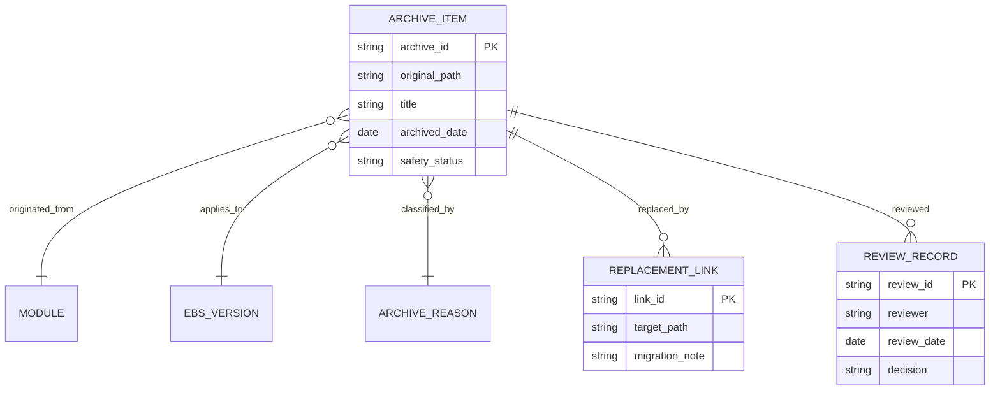

# 归档说明（Archive）

> 归档区记录已被替代、仅适用于历史版本或尚未验证的资料。归档内容不能直接作为生产操作依据。

## 阅读导航

- [归档条件](#1-进入归档的条件) · [记录要求](#2-归档记录要求) · [使用原则](#3-使用原则)

## 归档治理 ER 图

归档资料必须能找到替代正文和复核记录；涉及生产 SQL、补丁或数据修复的历史内容默认禁止直接执行。

## 1. 进入归档的条件

- 已被新版模块正文合并或替代。
- 仅适用于 R11i、R12.0/R12.1 或特定旧补丁，且不再维护。
- 缺少来源、实例验证或存在高风险做法。
- 重复内容需要保留历史审计，但不应出现在学习主路径。

## 2. 归档记录要求

每项资料记录原路径、标题、适用版本、归档原因、替代链接、归档日期和责任人。涉及 SQL、API、补丁或生产步骤时，明确标注“禁止直接执行”以及恢复使用前的验证要求。

## 3. 使用原则

查阅历史问题时可引用归档资料，但结论必须用目标实例、当前 Oracle 官方文档或有效项目基线重新验证。需要恢复的内容先经过功能、技术和运维评审，再移回对应模块。

当前无单独归档正文；Git 历史保留模块重编前的所有原始文件和版本。

<!-- 兼容旧版目录与学习材料的定位锚点；正文已按主题重编。 -->

